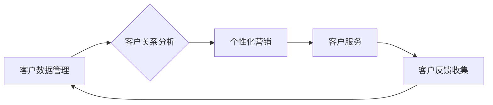

                 

## 客户关系管理：建立长期客户忠诚度

> 关键词：客户关系管理 (CRM)、客户忠诚度、数据分析、机器学习、个性化营销、客户体验、人工智能

## 1. 背景介绍

在当今竞争激烈的市场环境中，客户关系管理 (CRM) 已成为企业生存和发展的关键。客户忠诚度是企业长期成功的基石，而建立和维护客户忠诚度需要一套完善的 CRM 系统和策略。传统的 CRM 系统主要侧重于客户数据的收集和管理，而现代的 CRM 系统则更加注重数据分析、人工智能和个性化营销，以更好地理解客户需求，提供更优质的客户体验，从而提升客户忠诚度。

随着互联网和移动技术的快速发展，客户与企业之间的互动方式发生了巨大变化。客户拥有了更多的选择权和信息获取渠道，对企业服务的要求也越来越高。因此，企业需要利用先进的技术手段，构建更加智能化、个性化的 CRM 系统，以满足客户日益增长的需求。

## 2. 核心概念与联系

CRM 系统的核心是围绕客户进行的各个环节的管理和优化，包括：

* **客户获取:** 通过各种渠道吸引潜在客户，例如线上广告、线下活动、口碑营销等。
* **客户关系维护:** 与客户建立和维护良好的关系，例如定期沟通、提供优质服务、解决客户问题等。
* **客户价值提升:** 通过提供个性化产品和服务，提升客户的满意度和忠诚度。

CRM 系统的架构通常包括以下几个模块：



**客户数据管理模块:** 收集、存储和管理客户的各种信息，例如姓名、联系方式、购买历史、浏览记录等。

**客户关系分析模块:** 利用数据分析技术，挖掘客户行为模式、需求特征和潜在价值，为后续营销和服务提供决策依据。

**个性化营销模块:** 根据客户的个人特征和行为数据，制定个性化的营销策略，例如推荐产品、发送促销信息、提供定制服务等。

**客户服务模块:** 提供高效便捷的客户服务，例如在线客服、电话咨询、邮件回复等，解决客户遇到的问题，提升客户满意度。

**客户反馈收集模块:** 收集客户的反馈意见，例如问卷调查、在线评论、社交媒体互动等，了解客户对产品和服务的满意度，为改进和优化提供参考。

## 3. 核心算法原理 & 具体操作步骤

### 3.1  算法原理概述

在 CRM 系统中，常用的算法包括：

* **聚类算法:** 将客户根据相似度进行分组，例如根据购买行为、兴趣爱好、地理位置等特征进行分类。
* **推荐算法:** 根据客户的购买历史、浏览记录和兴趣爱好，推荐相关的产品或服务。
* **预测算法:** 利用历史数据预测客户未来的行为，例如预测客户的购买意愿、流失风险等。

### 3.2  算法步骤详解

以聚类算法为例，其具体操作步骤如下：

1. **数据预处理:** 对客户数据进行清洗、转换和特征工程，例如删除缺失值、标准化数据、提取特征向量等。
2. **选择聚类算法:** 根据客户数据特点和业务需求，选择合适的聚类算法，例如K-means聚类、层次聚类、DBSCAN聚类等。
3. **设置聚类参数:** 根据算法特点和数据规模，设置聚类参数，例如K值、距离度量等。
4. **执行聚类:** 利用选择的算法和参数，对客户数据进行聚类，将客户划分为不同的类别。
5. **评估聚类结果:** 利用聚类评估指标，例如Silhouette系数、Dunn指数等，评估聚类结果的质量。
6. **优化聚类参数:** 根据评估结果，调整聚类参数，重新执行聚类，直到达到预期的效果。

### 3.3  算法优缺点

**聚类算法的优点:**

* 可以发现客户数据中的潜在结构和模式。
* 可以将客户进行细分，为个性化营销提供依据。
* 算法相对简单，易于理解和实现。

**聚类算法的缺点:**

* 需要事先设定聚类数量，难以确定最佳的聚类数量。
* 对数据质量要求较高，数据噪声和异常值会影响聚类结果。
* 难以解释聚类结果，难以理解不同类别的客户特征。

### 3.4  算法应用领域

聚类算法广泛应用于CRM系统中的客户细分、个性化营销、客户流失预测等领域。

## 4. 数学模型和公式 & 详细讲解 & 举例说明

### 4.1  数学模型构建

在客户关系分析中，常用的数学模型包括：

* **客户价值模型:** 用于量化客户的价值，例如根据客户的购买金额、购买频率、客户生命周期价值等因素进行评估。
* **客户流失预测模型:** 用于预测客户流失的概率，例如根据客户的购买行为、服务满意度、客户生命周期等因素进行预测。

### 4.2  公式推导过程

以客户价值模型为例，其公式可以表示为：

$$
CV = \alpha \cdot P + \beta \cdot F + \gamma \cdot L
$$

其中：

* $CV$ 表示客户价值
* $P$ 表示客户的购买金额
* $F$ 表示客户的购买频率
* $L$ 表示客户的生命周期价值
* $\alpha$, $\beta$, $\gamma$ 为权重系数，根据业务需求进行调整。

### 4.3  案例分析与讲解

假设一家电商平台想要评估其客户的价值，可以根据上述公式进行计算。例如，一个客户在过去一年内购买金额为1000元，购买频率为12次，生命周期价值为5000元，则其客户价值可以计算为：

$$
CV = 0.3 \cdot 1000 + 0.5 \cdot 12 + 0.2 \cdot 5000 = 300 + 6 + 1000 = 1306
$$

其中，权重系数 $\alpha$, $\beta$, $\gamma$ 可以根据平台的业务特点进行调整。例如，如果平台更注重客户的购买金额，则可以将 $\alpha$ 设置为更高的值。

## 5. 项目实践：代码实例和详细解释说明

### 5.1  开发环境搭建

本项目使用 Python 语言进行开发，所需的开发环境包括：

* Python 3.x 版本
* Jupyter Notebook 或 VS Code 等代码编辑器
* pandas、scikit-learn 等数据科学库

### 5.2  源代码详细实现

```python
import pandas as pd
from sklearn.cluster import KMeans

# 加载客户数据
data = pd.read_csv('customer_data.csv')

# 数据预处理
# ...

# 选择聚类算法
kmeans = KMeans(n_clusters=5, random_state=42)

# 执行聚类
data['cluster'] = kmeans.fit_predict(data[['购买金额', '购买频率']])

# 评估聚类结果
# ...

# 分析不同类别的客户特征
# ...
```

### 5.3  代码解读与分析

* **数据加载:** 使用 pandas 库加载客户数据，数据格式为 CSV 文件。
* **数据预处理:** 对客户数据进行清洗、转换和特征工程，例如删除缺失值、标准化数据、提取特征向量等。
* **聚类算法选择:** 选择 K-means 聚类算法，并设置聚类数量为 5。
* **聚类执行:** 使用 K-means 算法对客户数据进行聚类，并将聚类结果存储在 'cluster' 列中。
* **聚类结果评估:** 使用聚类评估指标，例如 Silhouette系数、Dunn指数等，评估聚类结果的质量。
* **客户特征分析:** 分析不同类别的客户特征，例如平均购买金额、购买频率等，以便更好地理解客户群体差异。

### 5.4  运行结果展示

运行代码后，将生成一个包含客户聚类结果的 DataFrame，其中 'cluster' 列表示每个客户所属的类别。

## 6. 实际应用场景

CRM 系统在各个行业都有广泛的应用场景，例如：

* **电商平台:** 利用客户数据分析，进行精准营销、个性化推荐、客户流失预测等。
* **金融机构:** 利用客户数据分析，进行风险评估、客户画像、精准营销等。
* **制造业:** 利用客户数据分析，进行产品定制、售后服务优化、客户关系维护等。

### 6.4  未来应用展望

随着人工智能、大数据和云计算技术的不断发展，CRM 系统将更加智能化、个性化和自动化。未来，CRM 系统将更加注重以下几个方面：

* **人工智能驱动的客户服务:** 利用自然语言处理、机器学习等技术，实现更加智能化、个性化的客户服务。
* **预测分析和预警:** 利用机器学习算法，预测客户的未来行为，例如购买意愿、流失风险等，并及时采取预警措施。
* **客户体验优化:** 利用数据分析和个性化营销，提升客户的购物体验、服务体验等。

## 7. 工具和资源推荐

### 7.1  学习资源推荐

* **书籍:**
    * 《CRM系统设计与实施》
    * 《客户关系管理实战指南》
* **在线课程:**
    * Coursera 上的 CRM 课程
    * Udemy 上的 CRM 课程

### 7.2  开发工具推荐

* **CRM 平台:** Salesforce、Microsoft Dynamics 365、Oracle Siebel
* **数据分析工具:** Tableau、Power BI、Python pandas
* **机器学习库:** scikit-learn、TensorFlow、PyTorch

### 7.3  相关论文推荐

* **客户关系管理中的数据挖掘技术**
* **基于机器学习的客户流失预测模型**
* **人工智能驱动的客户服务系统**

## 8. 总结：未来发展趋势与挑战

### 8.1  研究成果总结

CRM 系统的发展经历了从数据管理到数据分析、再到人工智能驱动的智能化转型。随着技术的不断进步，CRM 系统将更加智能化、个性化和自动化，为企业提供更加精准、高效的客户服务和营销解决方案。

### 8.2  未来发展趋势

* **人工智能驱动的 CRM:** 利用人工智能技术，实现更加智能化的客户服务、个性化营销和预测分析。
* **云原生 CRM:** 基于云计算平台，实现 CRM 系统的弹性扩展、高可用性和数据安全。
* **跨渠道整合 CRM:** 将线上线下渠道的客户数据整合，提供更加全面的客户画像和服务体验。

### 8.3  面临的挑战

* **数据隐私和安全:** 如何保护客户数据隐私和安全，是 CRM 系统发展面临的重要挑战。
* **算法模型的解释性:** 许多人工智能算法模型的决策过程难以解释，这可能会导致客户对 CRM 系统的信任度降低。
* **技术人才短缺:** CRM 系统的开发和维护需要具备数据分析、人工智能和软件开发等方面的专业人才，而目前技术人才短缺是一个普遍问题。

### 8.4  研究展望

未来，CRM 系统的研究将更加注重以下几个方面:

* **开发更加透明、可解释的人工智能算法模型。**
* **构建更加安全、可靠的数据管理和分析平台。**
* **探索新的客户关系管理模式和策略，适应未来市场环境的变化。**

## 9. 附录：常见问题与解答

* **什么是 CRM 系统？**

CRM 系统是指客户关系管理系统，它是一个用于管理和优化客户关系的软件系统。

* **CRM 系统有哪些功能？**

CRM 系统的功能包括客户数据管理、客户关系分析、个性化营销、客户服务等。

* **如何选择合适的 CRM 系统？**

选择合适的 CRM 系统需要根据企业的业务需求、规模、预算等因素进行考虑。

* **如何实施 CRM 系统？**

CRM 系统的实施需要经过规划、部署、培训、维护等多个阶段。

* **CRM 系统的未来发展趋势是什么？**

CRM 系统的未来发展趋势是更加智能化、个性化和自动化。


作者：禅与计算机程序设计艺术 / Zen and the Art of Computer Programming 
<end_of_turn>

