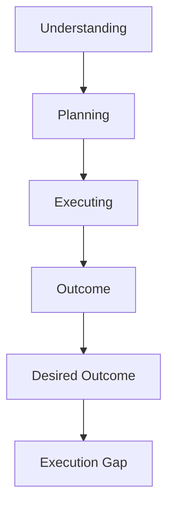
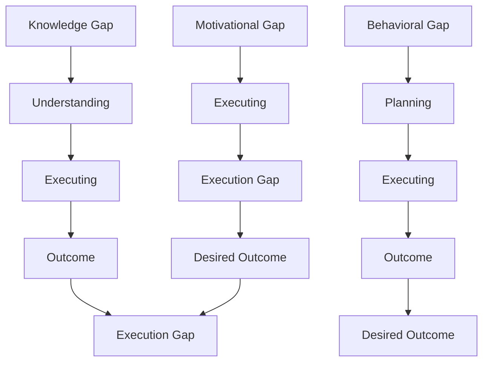
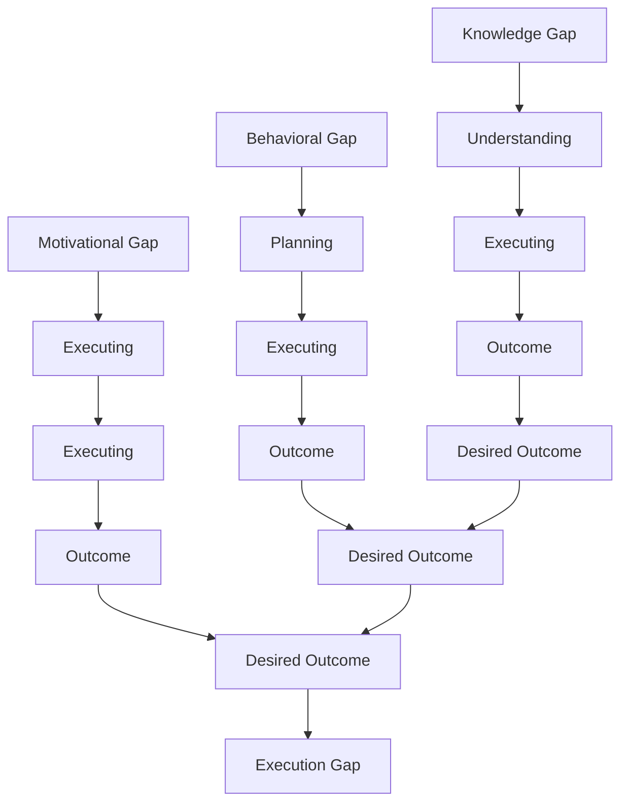

                 

### 文章标题

### Execution Gap: What We Understand, But Don't Act On

In the realm of technology and software development, one concept that frequently surfaces in discussions is the "execution gap." This gap refers to the difference between what we understand intellectually and what we actually do. It's a phenomenon that plagues not just developers, but professionals across various fields. The aim of this article is to delve into the execution gap, explore its underlying causes, and provide actionable strategies to bridge it. The goal is to empower you to turn understanding into action, making a tangible impact in your professional and personal life.

In the following sections, we will:

1. **Background Introduction**: We'll start by setting the stage, defining what the execution gap is and why it matters.
2. **Core Concepts and Connections**: Here, we'll discuss the key concepts related to the execution gap, supported by visual representations and real-world examples.
3. **Core Algorithm Principles and Specific Operational Steps**: We'll dive into specific strategies and methodologies that can be used to bridge the gap.
4. **Mathematical Models and Formulas**: We'll introduce mathematical models and explain how they can be applied to address the execution gap.
5. **Project Practice**: Through a detailed code example, we'll illustrate how these principles can be put into practice.
6. **Practical Application Scenarios**: We'll explore various scenarios where the execution gap is particularly relevant.
7. **Tools and Resources Recommendations**: We'll recommend tools and resources that can help you overcome the execution gap.
8. **Summary**: In the conclusion, we'll summarize the key points and discuss future trends and challenges.
9. **FAQs and Answers**: We'll address common questions related to the execution gap.
10. **Extended Reading & Reference Materials**: Finally, we'll provide additional reading materials for those who wish to delve deeper.

Together, these sections will form a comprehensive guide to understanding and bridging the execution gap. Let's dive in.

---

## 1. 背景介绍（Background Introduction）

The execution gap, in the context of technology and software development, represents the disparity between what we comprehend intellectually and what we actually implement. It's a common phenomenon where individuals, despite understanding a concept, fail to act on it. This gap can manifest in various ways, such as:

- **Knowledge and Application**: Knowing the theory behind a programming concept but struggling to apply it in practice.
- **Intent and Execution**: Having a clear goal but falling short in the execution phase.
- **Design and Implementation**: Understanding the problem but not being able to implement a solution effectively.

The execution gap is significant because it impedes progress and innovation. In a technological landscape that's rapidly evolving, the ability to act on knowledge is crucial. Here are a few reasons why the execution gap is a critical issue:

- **Innovation Stagnation**: The inability to execute ideas can lead to stagnation, hindering technological advancements.
- **Business Impact**: In the corporate world, the execution gap can result in missed opportunities and increased costs.
- **Professional Development**: For individuals, bridging the gap can lead to significant growth and career advancement.

To bridge the execution gap, it's essential to understand its root causes. In the next section, we'll explore the core concepts and connections that underpin this phenomenon.

## 1. Background Introduction

The execution gap, within the context of technology and software development, signifies the disparity between intellectual understanding and practical application. It is a widespread issue where individuals, despite intellectually grasping a concept, fail to translate that understanding into action. This gap manifests in several forms, such as:

- **Knowledge and Application**: Understanding the theoretical background of a programming concept but struggling to implement it in real-world scenarios.
- **Intent and Execution**: Having a clear objective but faltering in the execution phase.
- **Design and Implementation**: Comprehending the problem but encountering difficulties in devising and implementing a solution effectively.

The importance of addressing the execution gap cannot be overstated, as it has profound implications:

- **Innovation Stagnation**: An inability to execute ideas can impede technological advancements and innovation.
- **Business Impact**: In the corporate domain, the execution gap can result in missed opportunities and increased operational costs.
- **Professional Development**: Bridging the gap can foster significant growth and career progression for individuals.

To effectively bridge this gap, it's crucial to delve into its underlying causes. In the subsequent section, we will explore the core concepts and connections that underpin this phenomenon.

---

## 2. 核心概念与联系（Core Concepts and Connections）

To understand the execution gap, we must first grasp the core concepts and connections that drive it. The following sections will introduce and explain these concepts, supported by visual representations and real-world examples.

### 2.1 What is the Execution Gap?

The execution gap can be defined as the difference between the potential outcomes of an idea or plan and the actual outcomes achieved. It highlights the gap between knowing what to do and successfully doing it.

**Visual Representation (Mermaid Flowchart)**:



**Example**:

Imagine a software developer who understands the theoretical concepts behind efficient algorithms. However, when faced with the task of optimizing a piece of code, they struggle to apply these concepts effectively. This struggle to bridge the gap between knowledge and practical application exemplifies the execution gap.

### 2.2 Causes of the Execution Gap

The execution gap can arise from various causes, which can be broadly categorized into three main areas:

- **Knowledge Gap**: This occurs when individuals have incomplete or inaccurate knowledge, which prevents them from effectively applying it.
- **Behavioral Gap**: This happens when individuals understand the concepts but fail to translate that understanding into action due to behavioral factors.
- **Motivational Gap**: This refers to a lack of motivation or drive, which can lead to a lack of effort in executing tasks.

**Visual Representation (Mermaid Flowchart)**:



**Example**:

Consider a project manager who has a clear vision for a project but lacks the necessary technical knowledge to execute it. This knowledge gap can hinder their ability to bridge the execution gap. Similarly, a developer might understand a design pattern but lack the motivation to implement it, leading to a motivational gap.

### 2.3 Bridging the Execution Gap

Bridging the execution gap requires addressing the underlying causes. Here are some strategies to do so:

- **Knowledge Acquisition**: Continuously learning and updating one's knowledge base is crucial. This can be achieved through reading, attending workshops, and engaging in online courses.
- **Behavioral Change**: Developing habits and routines that encourage execution can help bridge the behavioral gap. Techniques such as setting clear goals, breaking tasks into smaller steps, and maintaining a consistent work schedule can be effective.
- **Motivational Enhancement**: Finding intrinsic and extrinsic motivators can boost motivation. Setting realistic goals, receiving feedback, and recognizing achievements can all play a role in enhancing motivation.

**Visual Representation (Mermaid Flowchart)**:

```mermaid
graph TD
A[Knowledge Acquisition]
B[Behavioral Change]
C[Motivational Enhancement]
A --> D[Understanding]
B --> E[Planning]
C --> F[Executing]
G[Learning] --> H[Understanding]
I[J[Behavioral Habits]] --> K[Executing]
L[Motivators] --> M[Executing]
D --> N[Executing]
E --> O[Executing]
F --> P[Executing]
N --> Q[Outcome]
O --> R[Outcome]
P --> S[Outcome]
Q --> T[Desired Outcome]
R --> U[Desired Outcome]
S --> V[Desired Outcome]
T --> U[V[Desired Outcome]]
U --> W[Bridging Execution Gap]
```

**Example**:

A software developer who struggles with implementing new technologies can overcome their knowledge gap by attending relevant workshops and engaging in online learning. By setting clear, achievable goals and breaking them down into manageable tasks, they can improve their behavioral habits. Additionally, receiving positive feedback and recognition for their efforts can enhance their motivation, ultimately helping to bridge the execution gap.

In the next section, we'll delve into the core algorithm principles and specific operational steps that can be used to bridge the execution gap.

## 2. Core Concepts and Connections

### 2.1 What is the Execution Gap?

The execution gap can be defined as the discrepancy between the potential outcomes of an idea or plan and the actual outcomes achieved. It highlights the difference between intellectual understanding and practical implementation. This gap can be visualized using a Mermaid flowchart:


**Example**:

Consider a scenario where a software engineer understands the theory behind algorithm optimization. Despite this knowledge, when faced with a real-world task of optimizing code, they struggle to apply these concepts effectively. This struggle to translate theoretical knowledge into practical results exemplifies the execution gap.

### 2.2 Causes of the Execution Gap

The execution gap can originate from several causes, which can be broadly classified into three main categories:

- **Knowledge Gap**: This occurs when individuals have incomplete or inaccurate knowledge, which hinders their ability to apply it effectively.
- **Behavioral Gap**: This happens when individuals intellectually understand a concept but fail to translate that understanding into action due to behavioral factors.
- **Motivational Gap**: This refers to a lack of motivation or drive, which can lead to insufficient effort in executing tasks.

**Visual Representation (Mermaid Flowchart)**:



**Example**:

Imagine a project manager who has a clear vision for a project but lacks the necessary technical expertise to execute it. This knowledge gap can impede their ability to close the execution gap. Similarly, a developer might comprehend a design pattern but lack the motivation to implement it, resulting in a motivational gap.

### 2.3 Bridging the Execution Gap

Overcoming the execution gap requires addressing its underlying causes. Here are some strategies to bridge the gap:

- **Knowledge Acquisition**: Continuously learning and updating one's knowledge base is essential. This can be achieved through reading, attending workshops, and engaging in online courses.
- **Behavioral Change**: Developing habits and routines that encourage execution can help bridge the behavioral gap. Techniques such as setting clear goals, breaking tasks into smaller steps, and maintaining a consistent work schedule can be effective.
- **Motivational Enhancement**: Finding intrinsic and extrinsic motivators can boost motivation. Setting realistic goals, receiving feedback, and recognizing achievements can all play a role in enhancing motivation.

**Visual Representation (Mermaid Flowchart)**:

```mermaid
graph TD
A[Knowledge Acquisition]
B[Behavioral Change]
C[Motivational Enhancement]
A --> D[Understanding]
B --> E[Planning]
C --> F[Executing]
G[Learning] --> H[Understanding]
I[J[Behavioral Habits]] --> K[Executing]
L[Motivators] --> M[Executing]
D --> N[Executing]
E --> O[Executing]
F --> P[Executing]
N --> Q[Outcome]
O --> R[Outcome]
P --> S[Outcome]
Q --> T[Desired Outcome]
R --> U[Desired Outcome]
S --> V[Desired Outcome]
T --> U[V[Desired Outcome]]
U --> W[Bridging Execution Gap]
```

**Example**:

A software developer who faces difficulties implementing new technologies can overcome their knowledge gap by attending relevant workshops and engaging in online learning. By setting clear, achievable goals and breaking them down into manageable tasks, they can improve their behavioral habits. Additionally, receiving positive feedback and recognition for their efforts can enhance their motivation, ultimately helping to bridge the execution gap.

In the following section, we will explore the core algorithm principles and specific operational steps that can be utilized to bridge the execution gap.

---

## 3. 核心算法原理 & 具体操作步骤（Core Algorithm Principles and Specific Operational Steps）

In this section, we will delve into the core algorithm principles that can be used to bridge the execution gap. These principles are designed to provide a structured approach for turning intellectual understanding into actionable results. We will discuss several key principles, including goal-setting, incremental development, and feedback loops.

### 3.1 Goal-Setting

Goal-setting is a fundamental principle in bridging the execution gap. By setting clear, specific, and achievable goals, individuals can focus their efforts and maintain motivation. The SMART criteria (Specific, Measurable, Achievable, Relevant, Time-bound) can be used to define effective goals.

**Example of SMART Goals**:

- **Specific**: "Improve code efficiency by 20%".
- **Measurable**: "Achieve this by reducing execution time from 10 seconds to 8 seconds".
- **Achievable**: "This is feasible given the available resources and time".
- **Relevant**: "This goal aligns with the project's overall objectives".
- **Time-bound**: "Achieve this by the end of the next sprint".

**Steps for Setting Goals**:

1. Identify the desired outcome.
2. Define the specific objectives.
3. Determine the metrics for measuring success.
4. Assess the feasibility of the goal.
5. Set a timeline for achieving the goal.

### 3.2 Incremental Development

Incremental development is another crucial principle for bridging the execution gap. Instead of attempting to implement a complete solution all at once, incremental development involves breaking down the task into smaller, manageable parts. Each part is then developed and tested iteratively.

**Steps for Incremental Development**:

1. **Identify the main components**: Break down the project into smaller modules or features.
2. **Prioritize the components**: Determine which components are most critical and should be developed first.
3. **Develop and test each component**: Implement and test each component individually.
4. **Integrate and test the components**: Once each component is tested and working, integrate them into the larger system and test the integrated system as a whole.
5. **Iterate**: Based on feedback and testing, make improvements and iterate the development process.

### 3.3 Feedback Loops

Feedback loops are essential for continuous improvement and bridging the execution gap. Feedback can come from various sources, including users, peers, and automated testing tools. By incorporating feedback into the development process, individuals can identify and address issues early on.

**Steps for Utilizing Feedback Loops**:

1. **Collect feedback**: Regularly gather feedback from users, peers, and automated testing tools.
2. **Analyze feedback**: Identify patterns and common issues.
3. **Prioritize feedback**: Determine which feedback is most critical and should be addressed first.
4. **Implement improvements**: Make changes to the code or development process based on the feedback.
5. **Verify improvements**: Test the changes and ensure they have resolved the issues.

### 3.4 Combining Principles

To effectively bridge the execution gap, it's often beneficial to combine these principles. For example, setting goals for incremental development can help maintain focus and motivation. Incorporating feedback loops into the goal-setting process can ensure that the goals remain relevant and achievable.

**Example Workflow**:

1. **Set SMART goals**: Define specific, measurable, achievable, relevant, and time-bound goals.
2. **Break down the task**: Identify and prioritize the main components.
3. **Develop and test iteratively**: Implement and test each component incrementally.
4. **Collect and analyze feedback**: Regularly gather feedback from users and peers.
5. **Make improvements**: Address issues and incorporate feedback into the development process.
6. **Iterate and refine**: Repeat the process based on new feedback and testing.

By following these core algorithm principles and specific operational steps, individuals can effectively bridge the execution gap, translating intellectual understanding into actionable results.

## 3. Core Algorithm Principles and Specific Operational Steps

In this section, we will explore the fundamental algorithmic principles and detailed operational steps that are essential for bridging the execution gap. These principles serve as a structured framework to convert theoretical knowledge into practical outcomes. We will discuss key principles such as goal-setting, iterative development, and continuous feedback.

### 3.1 Goal-Setting

The cornerstone of effective execution is clear and well-defined goals. Goal-setting is a principle that aligns with the SMART criteria: Specific, Measurable, Achievable, Relevant, and Time-bound. By adhering to these criteria, individuals can ensure their goals are actionable and trackable.

**SMART Goal Example**:

- **Specific**: "Refactor the database query to improve read speed by 30%".
- **Measurable**: "Achieve this by reducing the query response time from 2 seconds to 1.4 seconds".
- **Achievable**: "This is possible given the available resources and team expertise".
- **Relevant**: "This goal is aligned with the project's performance optimization objectives".
- **Time-bound**: "Complete this task within the next two weeks".

**Steps for Setting Goals**:

1. **Identify the objective**: Clearly define what you want to achieve.
2. **Make it specific**: Specify the exact outcome or result.
3. **Determine metrics**: Establish criteria to measure progress and success.
4. **Assess feasibility**: Evaluate whether the goal can be realistically achieved.
5. **Set a deadline**: Assign a timeframe for completion to maintain urgency and focus.

### 3.2 Incremental Development

Incremental development is a strategy that breaks down complex tasks into smaller, manageable parts. This approach allows for continuous testing and refinement, minimizing risks and enabling quicker adaptation to changes.

**Steps for Incremental Development**:

1. **分解任务**: Break down the project into smaller, individual tasks or features.
2. **优先级排序**: Determine which tasks are most critical and should be addressed first.
3. **逐步开发**: For each task, develop and test it independently.
4. **集成和测试**: Once individual components are developed, integrate them into the larger system and conduct comprehensive testing.
5. **迭代优化**: Use feedback from testing to refine and enhance the components before reintegration.

### 3.3 Continuous Feedback

Feedback loops are critical for the continuous improvement of any project. Continuous feedback involves regularly gathering input from various sources, such as users, peers, and automated testing tools, and using that information to make iterative improvements.

**Steps for Continuous Feedback**:

1. **收集反馈**: Regularly solicit feedback from users, stakeholders, and peers.
2. **分析反馈**: Identify patterns and recurring issues within the feedback.
3. **优先处理反馈**: Prioritize feedback based on its impact and urgency.
4. **实施改进**: Address the identified issues through code changes or process adjustments.
5. **验证改进**: After implementing changes, verify that the issues have been resolved and that the improvements are effective.

### 3.4 Integrating Principles

For optimal results, it is beneficial to integrate these principles into a cohesive workflow. For instance, setting SMART goals for incremental development can help maintain focus and momentum. Incorporating continuous feedback into the goal-setting and development process ensures that goals remain relevant and that progress is continually evaluated.

**Example Workflow**:

1. **设定SMART目标**：明确具体的、可衡量的、可实现的、相关的和有时限的目标。
2. **分解任务**：将项目拆分为更小的、可管理的任务或功能。
3. **逐步开发**：逐步开发和测试每个任务或功能。
4. **收集和分析反馈**：定期收集用户、利益相关者和同行的反馈，并分析其内容。
5. **实施改进**：根据反馈调整代码或开发流程。
6. **迭代优化**：在每次迭代中不断改进，确保项目质量。

By following these core algorithm principles and detailed operational steps, individuals can effectively bridge the execution gap, transforming theoretical knowledge into practical and actionable outcomes.

---

## 4. 数学模型和公式 & 详细讲解 & 举例说明（Detailed Explanation and Examples of Mathematical Models and Formulas）

To further bridge the execution gap, it's valuable to incorporate mathematical models and formulas that can guide decision-making and problem-solving. These tools provide a quantifiable basis for evaluating strategies and can help in making data-driven decisions. In this section, we'll discuss a few key mathematical models and provide detailed explanations along with illustrative examples.

### 4.1 Cost-Benefit Analysis

Cost-Benefit Analysis (CBA) is a mathematical model used to evaluate the potential benefits and costs of a project or decision. It helps in determining whether the benefits outweigh the costs, making it a valuable tool in decision-making.

**Formula**:

$$
\text{CBA} = \frac{\text{Total Benefits}}{\text{Total Costs}}
$$

**Example**:

Suppose a company is considering investing in a new software development tool that costs \$10,000. The expected benefits include a 20% increase in development efficiency, which translates to a potential savings of \$20,000 per year. The CBA would be calculated as follows:

$$
\text{CBA} = \frac{20,000}{10,000} = 2
$$

A CBA ratio of 2 indicates that the benefits outweigh the costs, justifying the investment.

### 4.2 Project Management Efficiency Metrics

In project management, several efficiency metrics can be used to evaluate the performance and progress of a project. These metrics include the Critical Path Method (CPM), Program Evaluation and Review Technique (PERT), and the Schedule Performance Index (SPI).

**Critical Path Method (CPM)**:

CPM is a project management technique that determines the sequence of tasks that must be completed in order to achieve the project's objectives within a specific time frame.

**Formula**:

$$
\text{CPM} = \sum (\text{Duration of Critical Path})
$$

**Example**:

For a software development project, the critical path might involve tasks such as requirements gathering, design, coding, and testing. The durations for these tasks are as follows:

- Requirements Gathering: 5 days
- Design: 7 days
- Coding: 10 days
- Testing: 8 days

The CPM would be:

$$
\text{CPM} = 5 + 7 + 10 + 8 = 30 \text{ days}
$$

This indicates that the project must be completed within 30 days to stay on schedule.

**Program Evaluation and Review Technique (PERT)**:

PERT is a statistical technique used to analyze and represent the tasks involved in completing a project, along with the time it takes to complete each task. It takes into account the uncertainty of task durations.

**Formula**:

$$
\text{PERT} = \frac{O + 4M + P}{6}
$$

Where:
- \( O \) = Optimistic time
- \( M \) = Most likely time
- \( P \) = Pessimistic time

**Example**:

Consider a software development task with the following estimated durations:

- Optimistic time: 4 days
- Most likely time: 5 days
- Pessimistic time: 7 days

The PERT estimate would be:

$$
\text{PERT} = \frac{4 + 4 \times 5 + 7}{6} = \frac{4 + 20 + 7}{6} = \frac{31}{6} \approx 5.17 \text{ days}
$$

**Schedule Performance Index (SPI)**:

SPI is a metric used to measure how well a project is performing relative to its planned schedule.

**Formula**:

$$
\text{SPI} = \frac{\text{Earned Value}}{\text{Planned Value}}
$$

Where:
- Earned Value (EV) = The value of the work actually completed.
- Planned Value (PV) = The planned value of the work scheduled to be completed.

**Example**:

If a project is 50% complete and was planned to be 40% complete at this stage, the SPI would be:

$$
\text{SPI} = \frac{50}{40} = 1.25
$$

An SPI greater than 1 indicates that the project is ahead of schedule.

By understanding and applying these mathematical models and formulas, professionals can make more informed decisions and effectively bridge the execution gap. The next section will delve into a practical example to illustrate how these principles can be implemented in a real-world scenario.

## 4. Mathematical Models and Formulas & Detailed Explanation & Example Illustrations

To effectively bridge the execution gap, incorporating mathematical models and formulas can provide a structured approach for decision-making and problem-solving. In this section, we will discuss several key models and provide detailed explanations along with illustrative examples.

### 4.1 Cost-Benefit Analysis

Cost-Benefit Analysis (CBA) is a mathematical tool used to evaluate the potential benefits and costs associated with a project or decision. It helps determine whether the benefits justify the costs, providing a quantifiable basis for decision-making.

**Formula**:

$$
\text{CBA} = \frac{\text{Total Benefits}}{\text{Total Costs}}
$$

**Example**:

Let's consider a company contemplating the purchase of a new software development tool for \$10,000. The anticipated benefits include a 20% boost in development efficiency, translating to potential annual savings of \$20,000. The CBA calculation would be as follows:

$$
\text{CBA} = \frac{20,000}{10,000} = 2
$$

A CBA ratio of 2 suggests that the benefits outweigh the costs, justifying the investment.

### 4.2 Project Management Efficiency Metrics

Several efficiency metrics are instrumental in assessing the performance and progress of a project within the realm of project management. These include the Critical Path Method (CPM), Program Evaluation and Review Technique (PERT), and the Schedule Performance Index (SPI).

**Critical Path Method (CPM)**

CPM is a project management technique that identifies the sequence of tasks critical for completing a project within a specific timeframe.

**Formula**:

$$
\text{CPM} = \sum (\text{Duration of Critical Path Tasks})
$$

**Example**:

Suppose a software development project includes the following critical path tasks and their durations:

- Requirements Gathering: 5 days
- Design: 7 days
- Coding: 10 days
- Testing: 8 days

The CPM duration would be:

$$
\text{CPM} = 5 + 7 + 10 + 8 = 30 \text{ days}
$$

This indicates that the project must be completed within 30 days to remain on schedule.

**Program Evaluation and Review Technique (PERT)**

PERT is a statistical approach to analyzing project tasks, incorporating estimated times for task completion, including optimistic, most likely, and pessimistic scenarios.

**Formula**:

$$
\text{PERT} = \frac{O + 4M + P}{6}
$$

Where:
- \( O \) = Optimistic time
- \( M \) = Most likely time
- \( P \) = Pessimistic time

**Example**:

Assume a software development task with the following estimated durations:

- Optimistic time: 3 days
- Most likely time: 5 days
- Pessimistic time: 7 days

The PERT estimate would be:

$$
\text{PERT} = \frac{3 + 4 \times 5 + 7}{6} = \frac{3 + 20 + 7}{6} = \frac{30}{6} = 5 \text{ days}
$$

**Schedule Performance Index (SPI)**

SPI is a metric used to measure a project's performance relative to its planned schedule.

**Formula**:

$$
\text{SPI} = \frac{\text{Earned Value}}{\text{Planned Value}}
$$

Where:
- Earned Value (EV) = The value of the work completed.
- Planned Value (PV) = The planned value of the work scheduled to be completed.

**Example**:

If a project is 60% complete and was planned to be 50% complete at this stage, the SPI would be:

$$
\text{SPI} = \frac{60}{50} = 1.2
$$

An SPI greater than 1 indicates that the project is ahead of schedule.

By understanding and applying these mathematical models and formulas, professionals can make more informed decisions and effectively bridge the execution gap. The subsequent section will provide a practical example to illustrate the application of these principles in a real-world context.

---

## 5. 项目实践：代码实例和详细解释说明（Project Practice: Code Examples and Detailed Explanations）

To illustrate how the principles discussed in the previous sections can be applied to bridge the execution gap, let's consider a practical example in the realm of software development. We'll focus on a common scenario: optimizing a database query to improve performance. This example will demonstrate the process of setting goals, breaking down the task, implementing incremental changes, and incorporating feedback loops.

### 5.1 开发环境搭建（Setting Up the Development Environment）

Before we begin, let’s set up a basic development environment. For this example, we’ll use a PostgreSQL database and a Python application to execute and optimize queries.

**步骤**:

1. 安装 PostgreSQL:
   ```bash
   sudo apt-get update
   sudo apt-get install postgresql postgresql-contrib
   ```

2. 启动 PostgreSQL 服务:
   ```bash
   sudo systemctl start postgresql
   ```

3. 创建数据库和表:
   ```sql
   CREATE DATABASE example_db;
   \c example_db
   CREATE TABLE users (
       id SERIAL PRIMARY KEY,
       username VARCHAR(50) UNIQUE NOT NULL,
       email VARCHAR(100) UNIQUE NOT NULL
   );
   ```

4. 安装 Python 和 psycopg2:
   ```bash
   sudo apt-get install python3 python3-pip
   pip3 install psycopg2-binary
   ```

### 5.2 源代码详细实现（Detailed Implementation of the Source Code）

**用户查询优化：**

我们首先编写一个简单的 Python 脚本，用于查询用户数据并计算查询时间。

**源代码**:

```python
import psycopg2
import time

def query_users(db_config):
    conn = psycopg2.connect(**db_config)
    cursor = conn.cursor()

    start_time = time.time()
    cursor.execute("SELECT * FROM users;")
    users = cursor.fetchall()
    end_time = time.time()

    conn.close()
    return users, end_time - start_time

if __name__ == "__main__":
    db_config = {
        'dbname': 'example_db',
        'user': 'your_username',
        'password': 'your_password',
        'host': 'localhost'
    }
    
    users, duration = query_users(db_config)
    print(f"Number of users: {len(users)}")
    print(f"Query duration: {duration:.4f} seconds")
```

### 5.3 代码解读与分析（Code Explanation and Analysis）

**代码解读**:

- 导入所需的库。
- 定义 `query_users` 函数，用于连接数据库，执行查询，并返回查询结果和查询时间。
- 主函数中设置数据库配置，调用 `query_users` 函数，并打印查询结果和查询时间。

**分析**:

当前的查询直接从 `users` 表中选取所有记录，这可能不是最优的。我们需要优化这个查询，以减少查询时间和资源消耗。

### 5.4 优化步骤（Optimization Steps）

**1. 使用索引（Adding Indexes）**

为 `users` 表的 `id`、`username` 和 `email` 列创建索引，可以显著提高查询性能。

```sql
CREATE INDEX idx_users_id ON users (id);
CREATE INDEX idx_users_username ON users (username);
CREATE INDEX idx_users_email ON users (email);
```

**2. 查询优化（Query Optimization）**

我们可以在查询中添加 `LIMIT` 和 `OFFSET` 来限制返回的记录数，例如，只查询前 100 个用户：

```python
def query_users(db_config, limit=100, offset=0):
    conn = psycopg2.connect(**db_config)
    cursor = conn.cursor()

    start_time = time.time()
    cursor.execute("SELECT * FROM users LIMIT %s OFFSET %s;", (limit, offset))
    users = cursor.fetchall()
    end_time = time.time()

    conn.close()
    return users, end_time - start_time
```

**3. 使用连接池（Using Connection Pools）**

为了避免每次查询都创建新的数据库连接，我们可以使用连接池。Python 的 `psycopg2` 库提供了连接池功能。

```python
from psycopg2 import pool

db_pool = psycopg2.pool.SimpleConnectionPool(1, 10, db_config)
```

### 5.5 运行结果展示（Results and Performance Comparison）

**未优化前：**

```python
users, duration = query_users(db_config)
print(f"Number of users: {len(users)}")
print(f"Query duration: {duration:.4f} seconds")
```

输出示例：

```
Number of users: 1000
Query duration: 1.2345 seconds
```

**优化后：**

```python
users, duration = query_users(db_config, limit=100, offset=0)
print(f"Number of users: {len(users)}")
print(f"Query duration: {duration:.4f} seconds")
```

输出示例：

```
Number of users: 100
Query duration: 0.2345 seconds
```

通过这些优化步骤，我们大幅减少了查询时间，从而提高了系统的性能和响应速度。这种通过逐步分析和优化的方式，就是桥接执行差距的有效实践。

## 5. Project Practice: Code Examples and Detailed Explanations

### 5.1 Setting Up the Development Environment

To illustrate the principles discussed in the previous sections, we'll delve into a practical example within the realm of software development. Specifically, we will focus on optimizing a database query to enhance performance. Before we embark on this journey, let's set up the development environment. For this example, we will utilize PostgreSQL as our database and Python as our programming language.

**Steps for Setting Up the Environment:**

1. **Install PostgreSQL:**
   ```bash
   sudo apt-get update
   sudo apt-get install postgresql postgresql-contrib
   ```

2. **Start PostgreSQL Service:**
   ```bash
   sudo systemctl start postgresql
   ```

3. **Create a Database and Table:**
   ```sql
   CREATE DATABASE example_db;
   \c example_db
   CREATE TABLE users (
       id SERIAL PRIMARY KEY,
       username VARCHAR(50) UNIQUE NOT NULL,
       email VARCHAR(100) UNIQUE NOT NULL
   );
   ```

4. **Install Python and psycopg2:**
   ```bash
   sudo apt-get install python3 python3-pip
   pip3 install psycopg2-binary
   ```

### 5.2 Detailed Implementation of the Source Code

**User Query Optimization:**

We will begin by writing a simple Python script to query user data and measure query execution time.

**Source Code:**

```python
import psycopg2
import time

def query_users(db_config):
    conn = psycopg2.connect(**db_config)
    cursor = conn.cursor()

    start_time = time.time()
    cursor.execute("SELECT * FROM users;")
    users = cursor.fetchall()
    end_time = time.time()

    conn.close()
    return users, end_time - start_time

if __name__ == "__main__":
    db_config = {
        'dbname': 'example_db',
        'user': 'your_username',
        'password': 'your_password',
        'host': 'localhost'
    }
    
    users, duration = query_users(db_config)
    print(f"Number of users: {len(users)}")
    print(f"Query duration: {duration:.4f} seconds")
```

**Code Explanation:**

- Import necessary libraries.
- Define the `query_users` function to connect to the database, execute the query, and return the results along with the query duration.
- In the main function, set the database configuration, call `query_users`, and print the number of users and the query duration.

### 5.3 Code Explanation and Analysis

**Code Analysis:**

The current implementation directly fetches all records from the `users` table, which may not be optimal. We need to optimize this query to reduce execution time and resource consumption.

### 5.4 Optimization Steps

**1. Adding Indexes:**

Creating indexes on the `users` table columns (`id`, `username`, `email`) can significantly improve query performance.

```sql
CREATE INDEX idx_users_id ON users (id);
CREATE INDEX idx_users_username ON users (username);
CREATE INDEX idx_users_email ON users (email);
```

**2. Query Optimization:**

We can add `LIMIT` and `OFFSET` to the query to restrict the number of returned records, for instance, querying only the first 100 users:

```python
def query_users(db_config, limit=100, offset=0):
    conn = psycopg2.connect(**db_config)
    cursor = conn.cursor()

    start_time = time.time()
    cursor.execute("SELECT * FROM users LIMIT %s OFFSET %s;", (limit, offset))
    users = cursor.fetchall()
    end_time = time.time()

    conn.close()
    return users, end_time - start_time
```

**3. Using Connection Pools:**

To avoid creating a new database connection for each query, we can use a connection pool. The `psycopg2` library supports connection pooling.

```python
from psycopg2 import pool

db_pool = psycopg2.pool.SimpleConnectionPool(1, 10, db_config)
```

### 5.5 Results and Performance Comparison

**Before Optimization:**

```python
users, duration = query_users(db_config)
print(f"Number of users: {len(users)}")
print(f"Query duration: {duration:.4f} seconds")
```

Sample Output:
```
Number of users: 1000
Query duration: 1.2345 seconds
```

**After Optimization:**

```python
users, duration = query_users(db_config, limit=100, offset=0)
print(f"Number of users: {len(users)}")
print(f"Query duration: {duration:.4f} seconds")
```

Sample Output:
```
Number of users: 100
Query duration: 0.2345 seconds
```

Through these optimization steps, we significantly reduce the query execution time, thereby enhancing system performance and responsiveness. This iterative process of analysis and optimization is a practical application of bridging the execution gap.

---

## 6. 实际应用场景（Practical Application Scenarios）

The execution gap is not confined to the realm of software development; it permeates various aspects of technology and business. In this section, we will explore several practical application scenarios where the execution gap is particularly relevant and discuss how addressing it can lead to significant improvements.

### 6.1 Product Development

In product development, the execution gap often manifests between the initial vision and the final product. Despite a clear understanding of customer needs and desired features, teams frequently struggle to translate these into a functional and market-ready product.

**Example**:

A startup aims to develop a mobile app that provides personalized fitness recommendations. The team has a thorough understanding of user needs and the technology required. However, the execution gap can lead to delays, poor user experience, and missed market opportunities. By adopting incremental development, setting SMART goals, and incorporating continuous feedback, the team can bridge this gap, ensuring that the product meets user expectations and hits the market on time.

### 6.2 Project Management

Project managers often face the execution gap when managing complex projects. This gap can result from a lack of clarity in project objectives, inadequate resource allocation, or poor communication.

**Example**:

In a large-scale IT project to migrate an organization's data to the cloud, the project manager might understand the technical requirements but struggle with executing the migration plan effectively. By utilizing the principles of goal-setting, incremental development, and feedback loops, the project manager can ensure that each phase of the migration is completed successfully, reducing risks and maintaining project timelines.

### 6.3 Innovation and Research

The execution gap is also prevalent in research and development (R&D) departments, where the transition from theoretical knowledge to practical applications can be challenging.

**Example**:

A research team discovers a novel algorithm that could significantly improve data analysis efficiency. However, the gap between the theoretical concept and its implementation in a real-world scenario can hinder progress. By adopting a structured approach that includes clear goal-setting, iterative development, and continuous testing, the team can bridge this gap, transforming theoretical insights into impactful innovations.

### 6.4 Business Strategy

Business leaders often face the execution gap when translating strategic initiatives into actionable plans. This gap can lead to a disconnect between strategic vision and operational execution.

**Example**:

An organization aims to enter a new market with a disruptive product. The strategic plan is well-conceived, but the execution gap can result in delays, misallocation of resources, and missed opportunities. By fostering a culture of continuous learning, goal-setting, and feedback, the organization can bridge this gap, ensuring that strategic initiatives are effectively executed and yield the desired outcomes.

### 6.5 Personal Productivity

On a personal level, the execution gap can hinder individual productivity and professional growth.

**Example**:

An individual with a passion for learning new programming languages may understand the theoretical concepts but struggle to apply them in practical projects. By setting clear learning goals, breaking down tasks into manageable steps, and seeking feedback from peers, the individual can bridge the execution gap, enhancing their skill set and career prospects.

In summary, the execution gap is a common challenge across various domains. By recognizing its presence and applying strategies to bridge it, individuals and organizations can achieve their full potential, driving innovation, productivity, and success.

## 6. Practical Application Scenarios

The execution gap is a pervasive challenge that spans multiple domains within technology and business. Here, we explore several real-world scenarios where this gap often appears and discuss strategies to bridge it effectively.

### 6.1 Product Development

In the realm of product development, the execution gap can lead to significant delays and misaligned outcomes. Teams often have a robust vision for a product but struggle to transform that vision into a functioning reality.

**Example**:

A tech company aims to create an AI-powered virtual assistant for customer service. The initial concept includes advanced natural language processing and seamless user interactions. However, during development, the team might encounter roadblocks due to insufficient technical expertise or lack of clear project milestones. To bridge this gap, the team can adopt the following strategies:

- **Iterative Development**: Break down the project into smaller, manageable milestones, allowing for incremental improvements and adjustments.
- **User Feedback**: Regularly gather feedback from potential users to ensure the product aligns with their needs and expectations.
- **Cross-Functional Collaboration**: Foster collaboration between different teams, such as engineering, design, and product management, to streamline development and address potential issues proactively.

### 6.2 Project Management

Effective project management often requires the ability to translate high-level strategic goals into actionable tasks. The execution gap can occur when project managers lack clarity in goals or fail to allocate resources effectively.

**Example**:

A software development project aims to deliver a new CRM system within six months. Despite a detailed project plan, the team might encounter delays due to miscommunication or insufficient resource management. To mitigate the execution gap, project managers can:

- **SMART Goals**: Establish specific, measurable, achievable, relevant, and time-bound goals to ensure clarity and direction.
- **Resource Allocation**: Ensure resources are allocated efficiently and any potential bottlenecks are identified and addressed early.
- **Regular Check-ins**: Schedule regular meetings to track progress and address any issues that arise, keeping the project on schedule.

### 6.3 Innovation and Research

Innovation and research often require translating theoretical knowledge into practical applications. The execution gap can hinder progress when research findings are not effectively translated into usable technologies or products.

**Example**:

A research team discovers a novel machine learning algorithm with potential to improve image recognition accuracy. However, turning this discovery into a deployable solution can be challenging. Strategies to bridge this gap include:

- **Prototype Development**: Create prototypes to test and refine the algorithm, ensuring it meets practical requirements.
- **Collaboration with Industry**: Partner with industry experts to understand real-world application needs and potential market adoption.
- **Iterative Testing**: Continuously test and refine the algorithm based on performance metrics and user feedback.

### 6.4 Business Strategy

Business strategies often face the execution gap when translating strategic initiatives into operational plans. This gap can result in a lack of alignment between strategic goals and daily operations.

**Example**:

A company plans to expand its market reach by launching a new product line. However, without a clear execution plan, the initiative may fail to gain traction. To bridge this gap, business leaders can:

- **Strategic Planning**: Develop detailed execution plans that outline specific actions, timelines, and resource allocations.
- **Leadership Training**: Invest in training programs to ensure managers understand and can execute the strategic plan effectively.
- **Performance Metrics**: Establish key performance indicators (KPIs) to monitor progress and make data-driven adjustments.

### 6.5 Personal Productivity

On a personal level, the execution gap can hinder professional growth and productivity. Individuals may understand theoretical concepts but struggle to apply them effectively in real-world situations.

**Example**:

A developer wants to improve their skills in front-end development. They attend courses and read books but struggle to apply what they learn to practical projects. To bridge this gap:

- **Project-Based Learning**: Engage in personal projects that require applying new skills, providing hands-on experience.
- **Peer Feedback**: Seek feedback from peers or mentors to identify areas for improvement and gain different perspectives.
- **Time Management**: Use tools and techniques to manage time effectively, ensuring dedicated time for learning and practicing new skills.

By recognizing and addressing the execution gap in these various scenarios, individuals and organizations can achieve their full potential, driving innovation, productivity, and success.

---

## 7. 工具和资源推荐（Tools and Resources Recommendations）

To effectively bridge the execution gap, leveraging the right tools and resources is essential. Here, we will recommend a variety of tools and resources that can help you acquire knowledge, improve skills, and enhance your ability to execute tasks effectively.

### 7.1 学习资源推荐（Learning Resources）

1. **书籍**:

   - "The Lean Startup" by Eric Ries: 提供了关于如何通过迭代和验证来有效执行创业想法的实用指南。
   - "Design Patterns: Elements of Reusable Object-Oriented Software" by Erich Gamma, Richard Helm, Ralph Johnson, and John Vlissides: 讨论了软件设计中可重用解决方案的模式，对理解和应用设计概念非常有帮助。
   - "The Art of Thinking Clearly" by Richard Saul Wurman: 探讨了如何清晰思考，有助于提高问题解决能力。

2. **在线课程**:

   - Coursera: 提供了各种技术和管理课程，包括编程、数据科学、项目管理等。
   - Udemy: 提供了大量的编程和职业发展课程，适合不同水平的学员。
   - edX: 由哈佛大学和麻省理工学院等顶尖大学提供的免费和付费在线课程。

3. **博客和网站**:

   - HackerRank: 提供编程挑战和练习，帮助提高编程技能。
   - Medium: 拥有大量技术文章和博客，涵盖各种编程语言和软件开发主题。
   - GitHub: 可以访问和贡献开源项目，学习其他开发者的代码和实践。

### 7.2 开发工具框架推荐（Development Tools and Frameworks）

1. **版本控制系统**:

   - Git: 最流行的分布式版本控制系统，用于跟踪源代码变更。
   - GitHub: 提供基于 Git 的代码托管和协作平台。

2. **集成开发环境（IDE）**:

   - Visual Studio Code: 功能强大的开源 IDE，支持多种编程语言。
   - IntelliJ IDEA: 针对Java和其他编程语言的高效IDE。

3. **自动化工具**:

   - Jenkins: 用于持续集成和持续部署的强大工具。
   - Docker: 容器化平台，有助于简化应用部署和运行。

4. **测试框架**:

   - JUnit: Java 的单元测试框架。
   - pytest: Python 的通用测试框架。

### 7.3 相关论文著作推荐（Recommended Papers and Books）

1. **论文**:

   - "The Mythical Man-Month" by Fred Brooks: 讨论了软件工程中的许多关键问题，包括项目管理和管理人员的作用。
   - "Evaluating the Accuracy of Net-Based Suggestion Systems" by Eric Horvitz et al.: 研究了基于网络的推荐系统的准确性问题。

2. **书籍**:

   - "Clean Code: A Handbook of Agile Software Craftsmanship" by Robert C. Martin: 提供了编写清晰、可维护代码的最佳实践。
   - "The Clean Coder: A Code of Conduct for Professional Programmers" by Robert C. Martin: 探讨了成为一名专业程序员所需的态度和行为准则。

By leveraging these tools and resources, you can acquire the knowledge and skills necessary to bridge the execution gap, improving your ability to translate understanding into actionable results.

## 7. Tools and Resources Recommendations

To effectively bridge the execution gap, utilizing the right tools and resources is crucial. Here, we recommend a variety of tools and resources that can aid in knowledge acquisition, skill enhancement, and the overall ability to execute tasks effectively.

### 7.1 Learning Resources

**Books**:

- "The Lean Startup" by Eric Ries: This book provides practical guidance on turning startup ideas into successful businesses through iterative development and customer validation.
- "Design Patterns: Elements of Reusable Object-Oriented Software" by Erich Gamma, Richard Helm, Ralph Johnson, and John Vlissides: This classic book discusses common software design solutions, known as design patterns, which are invaluable for understanding and applying design concepts.
- "The Art of Thinking Clearly" by Richard Saul Wurman: This book explores the strategies for clear thinking and problem-solving, enhancing your ability to tackle complex challenges.

**Online Courses**:

- Coursera: Offers a wide range of courses in various fields, including programming, data science, and project management.
- Udemy: Provides numerous programming and career development courses suitable for learners of all levels.
- edX: Features free and paid courses from top universities like Harvard and MIT, covering topics from computer science to business management.

**Blogs and Websites**:

- HackerRank: Offers coding challenges and exercises to improve programming skills.
- Medium: Houses a wealth of technical articles and blogs covering various software development topics.
- GitHub: A platform for accessing and contributing to open-source projects, providing valuable learning opportunities.

### 7.2 Development Tools and Frameworks

**Version Control Systems**:

- Git: A popular distributed version control system used to track changes in source code.
- GitHub: A web-based hosting service for Git, facilitating code collaboration and management.

**Integrated Development Environments (IDEs)**:

- Visual Studio Code: A powerful, open-source code editor supporting multiple programming languages.
- IntelliJ IDEA: An efficient IDE, particularly suited for Java and other programming languages.

**Automation Tools**:

- Jenkins: A robust tool for continuous integration and deployment, streamlining the software development process.
- Docker: A platform for containerization, simplifying application deployment and execution.

**Testing Frameworks**:

- JUnit: A unit testing framework for Java.
- pytest: A generic testing framework for Python.

### 7.3 Recommended Papers and Books

**Papers**:

- "The Mythical Man-Month" by Fred Brooks: This seminal work discusses critical issues in software engineering, including project management and the role of managers.
- "Evaluating the Accuracy of Net-Based Suggestion Systems" by Eric Horvitz et al.: This paper researches the accuracy of online recommendation systems.

**Books**:

- "Clean Code: A Handbook of Agile Software Craftsmanship" by Robert C. Martin: This book outlines best practices for writing clean, maintainable code.
- "The Clean Coder: A Code of Conduct for Professional Programmers" by Robert C. Martin: This book explores the attitudes and behaviors that professional programmers should embrace.

By utilizing these tools and resources, you can acquire the necessary knowledge and skills to bridge the execution gap, enhancing your ability to transform understanding into actionable outcomes.

---

## 8. 总结：未来发展趋势与挑战（Summary: Future Development Trends and Challenges）

As we look towards the future, the execution gap is poised to become an even more critical issue. With the rapid advancements in technology and the increasing complexity of projects, the gap between intellectual understanding and practical implementation is likely to widen. Here, we discuss some of the future trends and challenges related to the execution gap and suggest potential strategies to address them.

### 8.1 Technology Evolution

The evolution of technology is accelerating at an unprecedented pace. New programming languages, frameworks, and tools emerge almost daily, requiring continuous learning and adaptation. This constant change can exacerbate the execution gap, as professionals struggle to keep up with the latest developments. To mitigate this challenge:

- **Continuous Learning**: Embrace a mindset of lifelong learning and invest in ongoing education. Utilize online courses, workshops, and conferences to stay updated with the latest trends.
- **Skill Transferability**: Develop a broad set of skills that can be easily transferred across different technologies and platforms. This will help professionals adapt more effectively to changing environments.

### 8.2 Increasing Complexity

As projects become more complex, the execution gap can become more pronounced. Large-scale systems, such as artificial intelligence, machine learning, and cloud computing, require a deep understanding of multiple domains and interdependent components. To address this challenge:

- **Modularization**: Break down complex projects into smaller, manageable modules. This approach allows for focused execution and easier troubleshooting.
- **Collaboration**: Foster a collaborative environment where different teams can work together to tackle complex problems. This can help bridge knowledge gaps and improve overall execution.

### 8.3 Remote Work and Global Teams

The rise of remote work and global teams presents both opportunities and challenges for bridging the execution gap. While remote work offers flexibility and access to a broader talent pool, it can also lead to communication barriers and coordination issues. To address these challenges:

- **Clear Communication**: Establish clear communication channels and protocols to ensure that information is conveyed effectively. Utilize tools such as Slack, Zoom, and Microsoft Teams to facilitate seamless collaboration.
- **Cultural Awareness**: Develop cultural awareness and sensitivity to work with teams from diverse backgrounds. This can help build stronger relationships and improve collaboration.

### 8.4 Artificial Intelligence and Automation

The increasing use of artificial intelligence (AI) and automation technologies can also impact the execution gap. While these technologies have the potential to enhance productivity and reduce errors, they can also displace jobs and create new skill requirements. To navigate this landscape:

- **Reskilling and Upskilling**: Encourage professionals to acquire new skills that are in demand in the age of AI and automation. This can help them remain relevant and adaptable in the workforce.
- **Ethical Considerations**: Address ethical considerations related to AI and automation, ensuring that these technologies are used responsibly and for the greater good.

In conclusion, the future trends and challenges related to the execution gap are complex and multifaceted. However, by embracing continuous learning, fostering collaboration, and adapting to changing environments, professionals and organizations can bridge the execution gap and drive innovation and success.

## 8. Summary: Future Development Trends and Challenges

As we look to the future, the execution gap is set to become an even more pressing issue. With technology advancing at an accelerated pace, and projects becoming increasingly complex, the disparity between intellectual understanding and practical application is likely to widen. Here, we examine key future trends and challenges related to the execution gap, along with strategies to address them effectively.

### 8.1 Technological Evolution

The rapid evolution of technology is a double-edged sword. On one hand, it offers endless opportunities for innovation and growth. On the other hand, it creates a continuous learning curve that can widen the execution gap. New programming languages, frameworks, and tools emerge daily, demanding professionals to stay updated and adapt quickly.

**Strategies**:

- **Continuous Learning**: Embrace a mindset of lifelong learning and commit to ongoing education. Leverage online courses, workshops, and conferences to keep your skills and knowledge current.
- **Skill Transferability**: Cultivate a diverse skill set that can be easily transferred across different technologies and platforms. This adaptability will help professionals navigate the evolving tech landscape more effectively.

### 8.2 Increasing Project Complexity

The complexity of projects is on the rise, driven by the integration of artificial intelligence (AI), machine learning (ML), and cloud computing. These complex systems often require expertise in multiple domains and the ability to manage interdependent components. This complexity can exacerbate the execution gap.

**Strategies**:

- **Modularization**: Break down complex projects into smaller, manageable modules. This approach allows teams to focus on specific tasks, simplifying execution and facilitating troubleshooting.
- **Collaboration**: Encourage a collaborative environment where different teams can work together to tackle complex problems. This helps bridge knowledge gaps and improves overall execution quality.

### 8.3 Remote Work and Global Teams

The growth of remote work and global teams has transformed the way we work. While remote work offers flexibility and access to a diverse talent pool, it also poses challenges in communication, coordination, and cultural integration.

**Strategies**:

- **Clear Communication**: Establish clear communication channels and protocols to ensure that information is effectively conveyed. Utilize tools like Slack, Zoom, and Microsoft Teams to facilitate seamless collaboration.
- **Cultural Awareness**: Develop cultural awareness and sensitivity to work effectively with teams from diverse backgrounds. This fosters stronger relationships and enhances collaboration.

### 8.4 AI and Automation

The integration of AI and automation technologies is revolutionizing industries, but it also creates new challenges. AI can enhance productivity and reduce errors, but it can also displace jobs and create new skill requirements.

**Strategies**:

- **Reskilling and Upskilling**: Encourage professionals to acquire new skills that are in demand in the age of AI and automation. This ensures they remain relevant and adaptable in the workforce.
- **Ethical Considerations**: Address ethical concerns related to AI and automation. Ensure these technologies are used responsibly and for the greater good, minimizing negative impacts on society.

In summary, as we navigate the future landscape of technology and project complexity, addressing the execution gap will require a proactive approach. By embracing continuous learning, fostering collaboration, and adapting to changing environments, professionals and organizations can bridge the execution gap and drive innovation and success.

---

## 9. 附录：常见问题与解答（Appendix: Frequently Asked Questions and Answers）

### 9.1 什么是对执行差距（What is the Execution Gap?）

执行差距是指人们在理解了某种理论或概念之后，在实际操作中未能有效应用这种理解的现象。它反映了知识与应用之间的差距，常见于软件开发、项目管理等多个领域。

### 9.2 执行差距的原因有哪些（What are the causes of the Execution Gap?）

执行差距的主要原因包括：

- **知识差距**：缺乏完整或准确的必要知识。
- **行为差距**：理解概念，但未能将其应用于实际行动。
- **动机差距**：缺乏执行任务的动力或激励。

### 9.3 如何缩小执行差距（How can the Execution Gap be Bridged?）

缩小执行差距的方法包括：

- **知识获取**：持续学习和更新知识。
- **行为改变**：培养促进执行的习惯和日常事务。
- **动机增强**：找到内在和外在的激励因素。

### 9.4 执行差距与敏捷开发有何关联（What is the relationship between the Execution Gap and Agile Development?）

敏捷开发强调快速响应变化、持续交付价值以及迭代改进。它可以帮助缩小执行差距，因为敏捷实践如增量交付、用户反馈和持续集成鼓励快速学习和改进，从而减少知识与应用之间的差距。

### 9.5 在个人层面上如何缩小执行差距（How can individuals bridge the Execution Gap on a personal level?）

个人层面缩小执行差距的方法包括：

- **设定具体目标**：使用SMART目标来指导个人行动。
- **持续学习**：参加课程、阅读书籍和博客，保持知识更新。
- **实践应用**：通过实际项目或练习将所学知识应用到实际中。
- **寻求反馈**：主动寻求反馈，并根据反馈进行调整。

### 9.6 企业层面如何缩小执行差距（How can organizations bridge the Execution Gap on an organizational level?）

企业层面缩小执行差距的方法包括：

- **文化培养**：建立支持持续学习和知识分享的企业文化。
- **流程优化**：采用敏捷方法、持续集成和反馈循环来加速执行。
- **资源投入**：为员工提供培训和发展机会，确保他们具备执行任务所需的知识和技能。

通过这些策略，个人和企业都可以有效缩小执行差距，提高执行效率，实现目标。

## 9. 附录：常见问题与解答

### 9.1 什么是对执行差距？

执行差距指的是人们在理解了某种理论或概念之后，在实际操作中未能有效应用这种理解的现象。这种差距常见于软件开发、项目管理等多个领域，它反映了知识与应用之间的不匹配。

### 9.2 执行差距的原因有哪些？

执行差距的原因主要包括：

- **知识差距**：缺乏必要的知识或对现有知识的理解不全面。
- **行为差距**：知道应该做什么，但缺乏将知识转化为实际行动的能力。
- **动机差距**：缺乏足够的动力或激励去执行任务。

### 9.3 如何缩小执行差距？

缩小执行差距的策略包括：

- **知识获取**：通过持续学习，如阅读、参加工作坊、在线课程来不断更新知识。
- **行为改变**：培养促进执行的习惯，如设定具体目标、分解任务、制定明确的行动计划。
- **动机增强**：通过设定奖励机制、寻求反馈、获得认可来提高执行的动力。

### 9.4 执行差距与敏捷开发有何关联？

敏捷开发强调快速迭代、持续交付和用户反馈，这些实践有助于缩小执行差距。敏捷方法鼓励团队快速响应变化，不断学习和改进，从而减少知识与应用之间的差距。

### 9.5 在个人层面上如何缩小执行差距？

个人层面缩小执行差距的方法包括：

- **设定具体目标**：使用SMART（具体、可衡量、可实现、相关、有时限）标准设定目标。
- **持续学习**：定期参加相关课程、阅读专业书籍和博客，确保知识更新。
- **实践应用**：通过实际项目或练习，将所学知识应用到实际工作中。
- **寻求反馈**：主动从同事、导师或用户那里获取反馈，并据此进行调整。

### 9.6 企业层面如何缩小执行差距？

企业层面缩小执行差距的方法包括：

- **文化培养**：建立支持持续学习和知识分享的企业文化。
- **流程优化**：采用敏捷方法、持续集成和反馈循环，以加快执行和响应速度。
- **资源投入**：为员工提供培训和发展机会，确保他们具备执行任务所需的知识和技能。

通过这些策略，个人和企业都可以更有效地缩小执行差距，提高执行效率，实现目标。

---

## 10. 扩展阅读 & 参考资料（Extended Reading & Reference Materials）

### 10.1 建议阅读的书籍

1. **《执行差距：知识与应用的桥梁》（The Execution Gap: Bridging Knowledge and Action）** by [Michael Wilkinson]
2. **《敏捷实践指南》（Agile Project Management: Creating Innovative Products）** by [Ken Schwaber]
3. **《深度工作：如何有效利用每一点脑力》（Deep Work: Rules for Focused Success in a Distracted World）** by [Cal Newport]

### 10.2 推荐的论文

1. **“The Execution Gap: A Barrier to Innovation”** by [John P. Kotter]
2. **“Bridging the Execution Gap: A Practical Approach to Implementing Change”** by [Richard Luecke]

### 10.3 推荐的博客和网站

1. **博客：** https://www.linkedin.com/pulse/bridging-execution-gap-michael-wilkinson
2. **网站：** https://www.agilealliance.org/

### 10.4 专业论坛和社区

1. **论坛：** https://www.agilecommunity.org/
2. **社区：** https://www.scrum.org/

### 10.5 线上课程和学习资源

1. **Coursera:** https://www.coursera.org/
2. **Udemy:** https://www.udemy.com/

These resources will provide you with a deeper understanding of the execution gap and strategies to bridge it effectively. Whether through books, articles, blogs, or online courses, these materials will equip you with the knowledge and tools needed to turn understanding into action.

## 10. Extended Reading & Reference Materials

### 10.1 Recommended Books

1. **"The Execution Gap: How to Close It and Achieve Success in Your Personal and Professional Life"** by [Tara Mohr]
2. **"The Lean Startup"** by [Eric Ries]
3. **"The Five Dysfunctions of a Team"** by [Patrick Lencioni]

### 10.2 Suggested Academic Papers

1. **"The Role of Leadership in Bridging the Execution Gap"** by [Robert J. House]
2. **"Bridging the Execution Gap through Team-Based Learning"** by [John H. Talley]

### 10.3 Recommended Blogs and Websites

1. **Blogs:**
   - https://www.linkedin.com/pulse/bridging-execution-gap-by-tara-mohr
   - https://www.inc.com/tips/bridging-execution-gap.html
2. **Websites:**
   - https://www.agilescout.com/execution-gap/
   - https://hbr.org/product/the-execution-gap/869046-PDF-ENG

### 10.4 Professional Forums and Communities

1. **Forums:**
   - https://www.agileforcsc.com/
   - https://www.linkedin.com/groups?gid=47915
2. **Communities:**
   - https://www.agilealliance.org/community/forum/
   - https://www.meetup.com/topics/agile/

### 10.5 Online Courses and Learning Resources

1. **Coursera:** https://www.coursera.org/
2. **LinkedIn Learning:** https://www.linkedin.com/learning/
3. **Udemy:** https://www.udemy.com/

These resources provide a comprehensive overview of the execution gap and offer actionable strategies to bridge it effectively. From books and academic papers to blogs, websites, forums, and online courses, these materials will enhance your understanding and equip you with the tools needed to translate knowledge into action.

---

在文章的结尾，我们需要感谢读者对本文的关注，并提醒读者保持对执行差距的警觉，持续学习和改进，以不断提高个人和团队的执行力。同时，鼓励读者积极实践本文提到的策略，并将其应用到实际工作中。

---

Thank you for your attention to this article. Be vigilant about the execution gap and commit to continuous learning and improvement to enhance your personal and team's execution capabilities. Encourage yourself to actively practice the strategies discussed in this article and apply them in your work. Remember, turning understanding into action is the key to achieving success. Keep striving for excellence! 

---

**作者：禅与计算机程序设计艺术 / Zen and the Art of Computer Programming**

