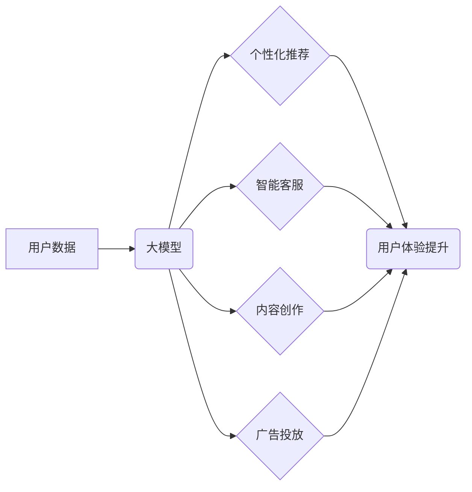

                 

## 探索基于大模型的电商智能营销自动化系统

> 关键词：大模型、电商营销、自动化系统、智能推荐、个性化营销、自然语言处理、深度学习

### 1. 背景介绍

电子商务行业竞争日益激烈，商家需要不断寻求创新手段提升营销效率和用户体验。传统营销模式往往依赖于人工操作，效率低下且难以实现精准化营销。近年来，随着人工智能技术的快速发展，特别是大模型技术的突破，为电商智能营销自动化提供了新的机遇。

大模型，是指在海量数据上训练的具有强大泛化能力的深度学习模型。其强大的语义理解、文本生成和预测能力，为电商智能营销自动化带来了诸多可能性。例如，大模型可以用于个性化推荐、智能客服、内容创作、广告投放等多个环节，帮助商家实现精准营销、自动化运营和用户体验提升。

### 2. 核心概念与联系

#### 2.1  电商智能营销自动化

电商智能营销自动化是指利用人工智能技术，自动执行营销任务，提高营销效率和精准度。其核心目标是通过数据分析、模型预测和自动化执行，实现个性化营销、精准触达和用户体验优化。

#### 2.2  大模型在电商智能营销中的应用

大模型在电商智能营销中扮演着关键角色，其强大的能力可以应用于多个环节：

* **个性化推荐:**  根据用户的历史购买记录、浏览行为、兴趣偏好等数据，大模型可以预测用户的潜在需求，并推荐个性化的商品和服务。
* **智能客服:**  大模型可以理解用户的自然语言输入，并提供智能化的回复，解决用户的疑问，提高客户服务效率。
* **内容创作:**  大模型可以根据电商平台的主题和目标用户，自动生成商品描述、广告文案、营销邮件等内容，提高内容创作效率。
* **广告投放:**  大模型可以分析用户的画像和行为数据，精准投放广告，提高广告转化率。

#### 2.3  架构图



### 3. 核心算法原理 & 具体操作步骤

#### 3.1  算法原理概述

大模型在电商智能营销自动化中的应用主要基于以下核心算法：

* **深度学习:**  深度学习算法可以从海量数据中学习复杂的特征和模式，为个性化推荐、智能客服等任务提供强大的支持。
* **自然语言处理 (NLP):**  NLP算法可以理解和处理自然语言文本，为智能客服、内容创作等任务提供语义理解和文本生成能力。
* **推荐系统:**  推荐系统算法可以根据用户的历史行为和偏好，预测用户的潜在兴趣，并推荐相关的商品或服务。

#### 3.2  算法步骤详解

以个性化推荐为例，其具体操作步骤如下：

1. **数据收集:**  收集用户的历史购买记录、浏览行为、评分反馈等数据。
2. **数据预处理:**  对收集到的数据进行清洗、转换和特征提取，构建用户画像和商品特征向量。
3. **模型训练:**  利用深度学习算法，训练一个个性化推荐模型，例如协同过滤、内容过滤或混合推荐模型。
4. **模型评估:**  使用测试数据评估模型的性能，例如准确率、召回率和覆盖率。
5. **模型部署:**  将训练好的模型部署到线上环境，实时为用户提供个性化商品推荐。

#### 3.3  算法优缺点

**优点:**

* **精准度高:**  大模型可以学习到用户的复杂特征和偏好，提供更精准的推荐和服务。
* **自动化程度高:**  大模型可以自动执行营销任务，提高效率和降低成本。
* **可扩展性强:**  大模型可以根据数据规模和业务需求进行扩展。

**缺点:**

* **训练成本高:**  大模型的训练需要大量的计算资源和时间。
* **数据依赖性强:**  大模型的性能依赖于训练数据的质量和数量。
* **解释性差:**  大模型的决策过程往往难以解释，难以理解模型的推荐逻辑。

#### 3.4  算法应用领域

大模型在电商智能营销自动化领域的应用场景广泛，包括：

* **商品推荐:**  根据用户的兴趣和行为，推荐相关的商品。
* **广告投放:**  精准投放广告，提高广告转化率。
* **内容创作:**  自动生成商品描述、广告文案、营销邮件等内容。
* **智能客服:**  提供智能化的客户服务，解决用户的疑问。
* **用户画像:**  分析用户的行为数据，构建用户画像。

### 4. 数学模型和公式 & 详细讲解 & 举例说明

#### 4.1  数学模型构建

在电商智能营销自动化中，常用的数学模型包括：

* **协同过滤模型:**  基于用户的历史行为和商品评分数据，预测用户对商品的评分。
* **内容过滤模型:**  基于商品的特征和用户的兴趣偏好，预测用户对商品的兴趣。
* **深度学习模型:**  利用神经网络结构，学习用户和商品之间的复杂关系，进行个性化推荐。

#### 4.2  公式推导过程

以协同过滤模型为例，其核心公式为：

$$
\hat{r}_{u,i} = \bar{r}_u + \frac{\sum_{v \in N(u)} (r_{v,i} - \bar{r}_v) \cdot sim(u,v)}{\sum_{v \in N(u)} sim(u,v)}
$$

其中：

* $\hat{r}_{u,i}$:  预测用户 $u$ 对商品 $i$ 的评分。
* $\bar{r}_u$:  用户 $u$ 的平均评分。
* $r_{v,i}$:  用户 $v$ 对商品 $i$ 的评分。
* $\bar{r}_v$:  用户 $v$ 的平均评分。
* $sim(u,v)$:  用户 $u$ 和用户 $v$ 之间的相似度。

#### 4.3  案例分析与讲解

假设用户 $A$ 和用户 $B$ 都购买了商品 $X$ 和 $Y$，用户 $A$ 对商品 $X$ 的评分为 5，对商品 $Y$ 的评分为 4，用户 $B$ 对商品 $X$ 的评分为 4，对商品 $Y$ 的评分为 5。

根据协同过滤模型，可以计算出用户 $A$ 对商品 $Z$ 的预测评分。

### 5. 项目实践：代码实例和详细解释说明

#### 5.1  开发环境搭建

* **操作系统:**  Linux 或 macOS
* **编程语言:**  Python
* **深度学习框架:**  TensorFlow 或 PyTorch
* **数据处理库:**  Pandas 或 NumPy

#### 5.2  源代码详细实现

```python
# 导入必要的库
import tensorflow as tf

# 定义模型结构
model = tf.keras.Sequential([
    tf.keras.layers.Embedding(input_dim=vocab_size, output_dim=embedding_dim),
    tf.keras.layers.LSTM(units=128),
    tf.keras.layers.Dense(units=num_classes, activation='softmax')
])

# 编译模型
model.compile(optimizer='adam',
              loss='sparse_categorical_crossentropy',
              metrics=['accuracy'])

# 训练模型
model.fit(x_train, y_train, epochs=10, batch_size=32)

# 评估模型
loss, accuracy = model.evaluate(x_test, y_test)
print('Loss:', loss)
print('Accuracy:', accuracy)
```

#### 5.3  代码解读与分析

* **Embedding层:** 将单词转换为稠密的向量表示。
* **LSTM层:** 学习文本序列中的长短时依赖关系。
* **Dense层:**  输出预测结果。
* **Adam优化器:**  用于优化模型参数。
* **SparseCategoricalCrossentropy损失函数:**  用于分类任务的损失函数。
* **Accuracy指标:**  用于评估模型性能。

#### 5.4  运行结果展示

训练完成后，可以将模型应用于实际场景，例如预测用户的商品购买意向。

### 6. 实际应用场景

#### 6.1  个性化推荐

大模型可以根据用户的历史购买记录、浏览行为、兴趣偏好等数据，推荐个性化的商品和服务，提高用户体验和转化率。

#### 6.2  智能客服

大模型可以理解用户的自然语言输入，并提供智能化的回复，解决用户的疑问，提高客户服务效率。

#### 6.3  内容创作

大模型可以根据电商平台的主题和目标用户，自动生成商品描述、广告文案、营销邮件等内容，提高内容创作效率。

#### 6.4  未来应用展望

随着大模型技术的不断发展，其在电商智能营销自动化领域的应用场景将更加广泛，例如：

* **更精准的个性化推荐:**  大模型可以学习到用户的更细粒度的特征和偏好，提供更精准的推荐。
* **更智能的客户服务:**  大模型可以理解用户的更复杂的需求，提供更智能化的服务。
* **更丰富的营销内容:**  大模型可以生成更丰富、更创意的营销内容，吸引用户的注意力。

### 7. 工具和资源推荐

#### 7.1  学习资源推荐

* **书籍:**  《深度学习》、《自然语言处理》
* **在线课程:**  Coursera、edX、Udacity
* **博客:**  Towards Data Science、Machine Learning Mastery

#### 7.2  开发工具推荐

* **深度学习框架:**  TensorFlow、PyTorch
* **数据处理库:**  Pandas、NumPy
* **云计算平台:**  AWS、Azure、GCP

#### 7.3  相关论文推荐

* **BERT:**  Bidirectional Encoder Representations from Transformers
* **GPT-3:**  Generative Pre-trained Transformer 3
* **DALL-E:**  Generative Pre-trained Transformer 3

### 8. 总结：未来发展趋势与挑战

#### 8.1  研究成果总结

大模型在电商智能营销自动化领域取得了显著的成果，例如：

* **提高了推荐精准度:**  大模型可以学习到用户的更细粒度的特征和偏好，提供更精准的推荐。
* **提高了客户服务效率:**  大模型可以理解用户的更复杂的需求，提供更智能化的服务。
* **提高了内容创作效率:**  大模型可以生成更丰富、更创意的营销内容，吸引用户的注意力。

#### 8.2  未来发展趋势

未来，大模型在电商智能营销自动化领域的应用将更加广泛，例如：

* **更个性化的营销:**  大模型可以根据用户的个性化需求，提供更精准的营销服务。
* **更智能的自动化:**  大模型可以自动完成更多的营销任务，例如广告投放、内容创作、客户服务等。
* **更跨模态的应用:**  大模型可以融合文本、图像、音频等多模态数据，提供更丰富的用户体验。

#### 8.3  面临的挑战

大模型在电商智能营销自动化领域也面临一些挑战，例如：

* **数据安全和隐私:**  大模型需要大量用户数据进行训练，如何保护用户数据安全和隐私是一个重要问题。
* **模型解释性和可控性:**  大模型的决策过程往往难以解释，如何提高模型的解释性和可控性是一个重要的研究方向。
* **模型公平性和偏见:**  大模型可能会学习到用户的偏见，导致不公平的推荐结果，如何解决模型公平性和偏见是一个重要的挑战。

#### 8.4  研究展望

未来，研究者将继续探索大模型在电商智能营销自动化领域的应用，解决上述挑战，推动该领域的发展。

### 9. 附录：常见问题与解答

#### 9.1  大模型训练需要多少数据？

大模型的训练数据量通常非常庞大，通常需要百万甚至数十亿条数据。

#### 9.2  大模型训练需要多少计算资源？

大模型的训练需要大量的计算资源，例如高性能GPU和TPU。

#### 9.3  如何评估大模型的性能？

大模型的性能可以评估指标，例如准确率、召回率、覆盖率、F1-score等。

#### 9.4  如何解决大模型的解释性和可控性问题？

研究者正在探索多种方法来解决大模型的解释性和可控性问题，例如：

* **可解释机器学习 (XAI):**  开发可解释的机器学习模型，使得模型的决策过程更加透明。
* **对抗训练:**  通过对抗样本训练模型，提高模型的鲁棒性和可控性。
* **联邦学习:**  在不共享原始数据的情况下，训练模型，保护用户数据隐私。


作者：禅与计算机程序设计艺术 / Zen and the Art of Computer Programming 
<end_of_turn>

