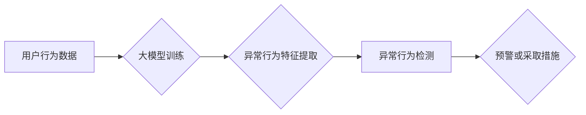

                 

## 关键词：大模型、电商平台、用户行为异常检测、自然语言处理、机器学习、深度学习、推荐系统

## 1. 背景介绍

在当今数字经济时代，电商平台作为重要的商业模式，其用户行为数据量庞大且日益增长。这些数据蕴含着丰富的商业价值，但也隐藏着潜在的风险。用户行为异常检测是电商平台安全运营和用户体验保障的关键环节，旨在识别和预防恶意行为、欺诈活动和潜在的安全威胁。

传统的用户行为异常检测方法主要依赖于规则引擎和统计模型，但这些方法存在局限性：

* **规则引擎难以应对复杂、多变的异常行为模式**，需要不断更新和维护规则，成本高且效率低。
* **统计模型对异常数据的识别能力有限**，难以捕捉到非线性、复杂的关系。

随着深度学习技术的快速发展，大模型在自然语言处理、图像识别等领域取得了突破性进展，为电商平台用户行为异常检测提供了新的思路和可能性。

## 2. 核心概念与联系

### 2.1 大模型

大模型是指参数量巨大、训练数据海量的人工智能模型。它们通常基于Transformer架构，具有强大的语义理解和文本生成能力。

### 2.2 用户行为异常检测

用户行为异常检测是指通过分析用户行为数据，识别与正常行为模式相悖的异常行为，并进行预警或采取相应的措施。

### 2.3 核心概念联系

大模型可以有效地学习和理解用户行为数据中的复杂模式，并将其应用于异常检测任务。

**Mermaid 流程图：**



## 3. 核心算法原理 & 具体操作步骤

### 3.1 算法原理概述

大模型在用户行为异常检测中的应用主要基于以下算法原理：

* **自编码器:** 自编码器是一种无监督学习算法，可以学习数据中的潜在特征表示。通过训练一个编码器和解码器，自编码器可以将用户行为数据压缩成低维特征，并将其解码回原始数据。异常行为通常具有与正常行为不同的特征表示，因此可以通过自编码器的重建误差来进行识别。
* **生成对抗网络 (GAN):** GAN由生成器和鉴别器两部分组成。生成器试图生成与真实数据相似的异常行为样本，而鉴别器则试图区分真实数据和生成数据。通过对抗训练，生成器可以学习生成越来越逼真的异常行为样本，而鉴别器可以学习识别异常行为的特征。
* **强化学习:** 强化学习算法可以训练一个代理，使其在环境中采取最优行动以获得最大奖励。在用户行为异常检测中，可以将代理视为异常检测模型，环境视为用户行为数据，奖励函数为正确识别异常行为的概率。通过强化学习，模型可以学习到识别异常行为的策略。

### 3.2 算法步骤详解

**以自编码器为例，详细说明算法步骤：**

1. **数据预处理:** 对用户行为数据进行清洗、转换和特征工程，例如将时间戳转换为时间特征、将用户行为类型转换为类别编码等。
2. **模型构建:** 选择合适的自编码器架构，并根据数据特点进行参数设置。
3. **模型训练:** 使用训练数据训练自编码器模型，优化模型参数以最小化重建误差。
4. **模型评估:** 使用测试数据评估模型的性能，例如计算准确率、召回率和F1-score等指标。
5. **异常行为识别:** 将新用户行为数据输入训练好的自编码器模型，计算重建误差，并将误差值与预设阈值进行比较，识别异常行为。

### 3.3 算法优缺点

**自编码器:**

* **优点:** 无监督学习，无需标注数据；可以学习数据中的潜在特征表示。
* **缺点:** 识别异常行为的准确率可能较低，需要精心设计模型架构和参数。

**GAN:**

* **优点:** 可以生成逼真的异常行为样本，提高模型的识别能力。
* **缺点:** 训练过程复杂，容易陷入局部最优解；需要大量的训练数据。

**强化学习:**

* **优点:** 可以学习到识别异常行为的策略，并根据环境变化进行动态调整。
* **缺点:** 训练过程需要大量的交互数据和奖励设计；模型的稳定性和泛化能力需要进一步研究。

### 3.4 算法应用领域

大模型在用户行为异常检测领域的应用场景广泛，包括：

* **欺诈检测:** 识别信用卡欺诈、账户盗用、虚假交易等行为。
* **恶意行为检测:** 识别恶意评论、刷单、恶意注册等行为。
* **安全风险预警:** 识别用户账号被盗、数据泄露等潜在安全风险。
* **用户体验优化:** 识别用户行为异常，及时提供帮助和改进服务。

## 4. 数学模型和公式 & 详细讲解 & 举例说明

### 4.1 数学模型构建

**自编码器模型:**

自编码器模型通常由编码器和解码器两部分组成。编码器将输入数据压缩成低维特征表示，解码器将低维特征表示解码回原始数据。

**编码器:**

$$
z = f_{\theta}(x)
$$

其中，$x$为输入数据，$z$为编码后的特征表示，$f_{\theta}$为编码器网络，$\theta$为编码器网络的参数。

**解码器:**

$$
\hat{x} = g_{\phi}(z)
$$

其中，$\hat{x}$为解码后的数据，$g_{\phi}$为解码器网络，$\phi$为解码器网络的参数。

**重建误差:**

$$
L = ||x - \hat{x}||^2
$$

其中，$L$为重建误差，$||\cdot||^2$为欧氏距离平方。

### 4.2 公式推导过程

自编码器的训练目标是最小化重建误差。通过反向传播算法，更新编码器和解码器网络的参数，使得重建误差最小。

### 4.3 案例分析与讲解

假设我们有一个电商平台的用户行为数据，包含用户ID、商品ID、购买时间、购买数量等信息。我们可以使用自编码器模型来学习用户行为的潜在特征表示。

例如，我们可以训练一个自编码器模型，将用户的购买历史数据作为输入，学习用户的购买偏好和购物习惯。然后，我们可以将新用户的购买数据输入到训练好的模型中，计算重建误差。如果重建误差较大，则表明该用户的购买行为与正常用户行为存在差异，可能是异常行为。

## 5. 项目实践：代码实例和详细解释说明

### 5.1 开发环境搭建

* Python 3.7+
* TensorFlow/PyTorch
* Jupyter Notebook

### 5.2 源代码详细实现

```python
# 导入必要的库
import tensorflow as tf

# 定义自编码器模型
class Autoencoder(tf.keras.Model):
    def __init__(self, latent_dim):
        super(Autoencoder, self).__init__()
        self.encoder = tf.keras.Sequential([
            tf.keras.layers.Dense(128, activation='relu'),
            tf.keras.layers.Dense(64, activation='relu'),
            tf.keras.layers.Dense(latent_dim)
        ])
        self.decoder = tf.keras.Sequential([
            tf.keras.layers.Dense(64, activation='relu'),
            tf.keras.layers.Dense(128, activation='relu'),
            tf.keras.layers.Dense(input_dim, activation='sigmoid')
        ])

    def call(self, x):
        encoded = self.encoder(x)
        decoded = self.decoder(encoded)
        return decoded

# 构建模型
latent_dim = 32
model = Autoencoder(latent_dim)

# 编译模型
model.compile(optimizer='adam', loss='binary_crossentropy')

# 训练模型
model.fit(x_train, x_train, epochs=10)

# 预测异常行为
predictions = model.predict(x_test)
```

### 5.3 代码解读与分析

* **模型定义:** 代码定义了一个自编码器模型，包含编码器和解码器两部分。
* **模型编译:** 使用Adam优化器和二元交叉熵损失函数编译模型。
* **模型训练:** 使用训练数据训练模型，训练epochs为10。
* **异常行为预测:** 使用训练好的模型预测测试数据，并根据重建误差判断异常行为。

### 5.4 运行结果展示

运行结果展示包括训练过程中的损失值变化曲线以及预测结果的准确率、召回率等指标。

## 6. 实际应用场景

### 6.1 欺诈检测

电商平台用户行为异常检测可以有效识别欺诈行为，例如虚假交易、刷单、恶意注册等。

* **案例:** 一家电商平台使用大模型检测用户注册行为，发现一些用户注册信息与真实信息不符，并进行异常行为预警。

### 6.2 恶意行为检测

电商平台用户行为异常检测可以识别恶意评论、刷单、恶意注册等恶意行为，保护平台的正常运营和用户权益。

* **案例:** 一家电商平台使用大模型检测用户评论行为，发现一些评论内容带有攻击性或虚假信息，并进行屏蔽处理。

### 6.3 安全风险预警

电商平台用户行为异常检测可以识别用户账号被盗、数据泄露等潜在安全风险，及时采取措施保障用户数据安全。

* **案例:** 一家电商平台使用大模型检测用户登录行为，发现用户账号在多个设备上同时登录，并进行安全预警。

### 6.4 未来应用展望

随着大模型技术的不断发展，其在电商平台用户行为异常检测领域的应用将更加广泛和深入。

* **个性化异常检测:** 基于用户画像和行为特征，实现个性化的异常检测，提高检测准确率。
* **多模态异常检测:** 将文本、图像、视频等多模态数据融合，构建更全面的异常检测模型。
* **实时异常检测:** 利用实时数据流处理技术，实现对用户行为的实时监控和异常检测。

## 7. 工具和资源推荐

### 7.1 学习资源推荐

* **书籍:**
    * 深度学习
    * 自然语言处理
* **在线课程:**
    * Coursera
    * edX
    * fast.ai

### 7.2 开发工具推荐

* **TensorFlow:** 开源深度学习框架
* **PyTorch:** 开源深度学习框架
* **Jupyter Notebook:** 交互式编程环境

### 7.3 相关论文推荐

* **BERT: Pre-training of Deep Bidirectional Transformers for Language Understanding**
* **Generative Adversarial Networks**
* **Autoencoders, Sparse Coding and Independent Component Analysis**

## 8. 总结：未来发展趋势与挑战

### 8.1 研究成果总结

大模型在电商平台用户行为异常检测领域取得了显著进展，能够有效识别欺诈行为、恶意行为和安全风险，提高平台安全性和用户体验。

### 8.2 未来发展趋势

未来，大模型在电商平台用户行为异常检测领域的应用将更加智能化、个性化和实时化。

### 8.3 面临的挑战

* **数据隐私保护:** 大模型训练需要大量用户数据，如何保护用户隐私是一个重要挑战。
* **模型解释性:** 大模型的决策过程往往难以解释，如何提高模型的解释性是一个关键问题。
* **模型可维护性:** 大模型参数量巨大，模型维护和更新成本高，需要开发更有效的模型维护策略。

### 8.4 研究展望

未来研究方向包括：

* **隐私保护大模型:** 开发能够保护用户隐私的隐私保护大模型。
* **可解释性大模型:** 研究大模型的决策过程，提高模型的解释性。
* **高效可维护大模型:** 开发高效、可维护的大模型架构和训练方法。

## 9. 附录：常见问题与解答

* **Q1: 大模型训练需要多少数据？**

* **A1:** 大模型训练需要海量数据，通常需要百万甚至数十亿条数据。

* **Q2: 大模型训练需要多长时间？**

* **A2:** 大模型训练时间取决于模型规模、数据量和硬件资源等因素，通常需要数天甚至数周时间。

* **Q3: 如何评估大模型的性能？**

* **A3:** 大模型的性能可以通过准确率、召回率、F1-score等指标进行评估。

* **Q4: 大模型的应用场景有哪些？**

* **A4:** 大模型的应用场景广泛，包括自然语言处理、图像识别、语音识别、机器翻译等。

作者：禅与计算机程序设计艺术 / Zen and the Art of Computer Programming 


<end_of_turn>

