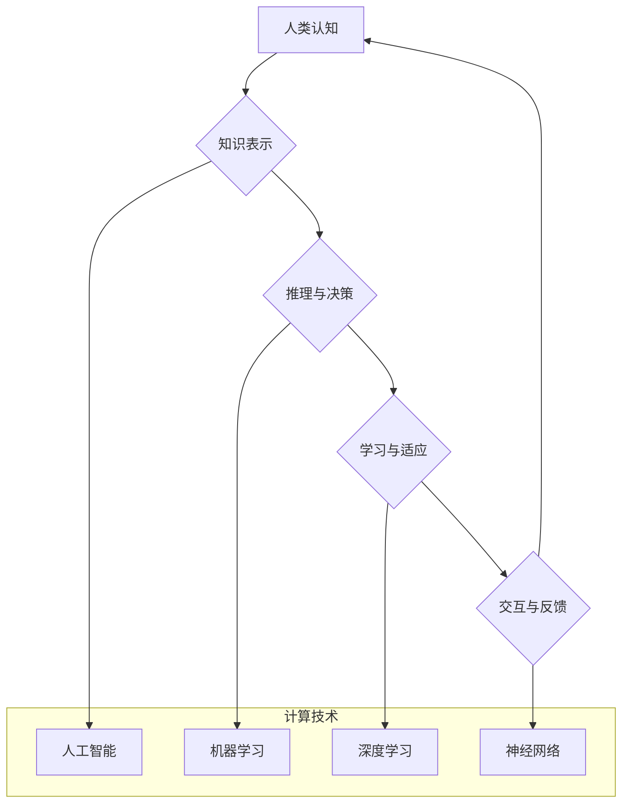

                 

## 推动科技进步的引擎：人类计算的创新力量

> 关键词：人类计算、计算模型、认知科学、人工智能、机器学习、深度学习、神经网络、计算能力、科技进步

### 1. 背景介绍

科技进步的引擎一直是人类智慧和创造力的结晶。从石器时代的发明工具到信息时代的智能机器，人类不断探索新的计算方式，以解决复杂问题、提升生产效率和丰富生活体验。而人类计算，作为一种将人类认知能力与计算技术相结合的新兴范式，正逐渐成为推动科技进步的强大引擎。

人类计算的概念源于对人类认知能力的理解和模拟。人类拥有强大的推理、判断、创造和学习能力，这些能力是传统计算机难以企及的。人类计算旨在将这些优势融入到计算系统中，以增强计算能力、提升智能水平和拓展应用领域。

近年来，随着人工智能、机器学习和深度学习等技术的快速发展，人类计算迎来了新的机遇。这些技术为构建更智能、更灵活的人类计算系统提供了强大的工具和基础。

### 2. 核心概念与联系

人类计算的核心概念是将人类的认知能力与计算技术相结合，构建一种新的计算模式。它融合了认知科学、人工智能、计算机科学等多学科的成果，旨在模拟和增强人类的智能行为。

**Mermaid 流程图：**



**核心概念原理和架构：**

* **知识表示：** 将人类知识以计算机可理解的形式进行表示，例如符号、规则、图谱等。
* **推理与决策：** 基于知识表示，利用逻辑推理、概率计算等方法进行决策和问题解决。
* **学习与适应：** 通过数据分析和模式识别，使计算系统能够从经验中学习，并适应不断变化的环境。
* **交互与反馈：** 人类与计算系统之间进行交互，提供反馈信息，以改进计算系统的性能和智能水平。

**计算技术与人类计算的结合：**

人工智能、机器学习和深度学习等技术为人类计算提供了强大的工具和基础。

* **人工智能：** 提供了模拟人类智能的算法和框架。
* **机器学习：** 使计算系统能够从数据中学习，并自动改进其性能。
* **深度学习：** 利用多层神经网络，模拟人类大脑的学习机制，实现更复杂的智能行为。

### 3. 核心算法原理 & 具体操作步骤

#### 3.1 算法原理概述

人类计算的核心算法原理是模拟人类认知过程，将人类的知识、推理、学习和决策能力融入到计算系统中。常见的算法包括：

* **符号逻辑推理：** 基于符号表示的知识，利用逻辑规则进行推理和推导。
* **概率推理：** 基于概率模型，利用贝叶斯定理等方法进行推理和决策。
* **神经网络学习：** 利用多层神经网络，模拟人类大脑的学习机制，从数据中学习知识和模式。

#### 3.2 算法步骤详解

以神经网络学习为例，其具体操作步骤如下：

1. **数据准备：** 收集和预处理训练数据，将其转换为神经网络可理解的形式。
2. **网络结构设计：** 根据任务需求设计神经网络的结构，包括层数、节点数、激活函数等。
3. **参数初始化：** 为神经网络的参数进行随机初始化。
4. **前向传播：** 将输入数据通过神经网络层层传递，最终得到输出结果。
5. **损失函数计算：** 计算输出结果与真实值的差异，即损失函数值。
6. **反向传播：** 根据损失函数值，反向传播误差信号，调整神经网络的参数。
7. **迭代训练：** 重复前向传播、损失函数计算和反向传播的过程，直到损失函数值达到预设阈值。

#### 3.3 算法优缺点

**优点：**

* **强大的学习能力：** 可以从海量数据中学习复杂模式和知识。
* **适应性强：** 可以根据环境变化自动调整其行为。
* **泛化能力强：** 可以应用于多种不同的任务和领域。

**缺点：**

* **训练数据依赖性强：** 需要大量的训练数据才能达到良好的性能。
* **解释性差：** 神经网络的决策过程难以解释，缺乏透明度。
* **计算资源消耗大：** 训练大型神经网络需要大量的计算资源。

#### 3.4 算法应用领域

神经网络学习算法广泛应用于以下领域：

* **图像识别：** 人脸识别、物体检测、图像分类等。
* **自然语言处理：** 机器翻译、文本摘要、情感分析等。
* **语音识别：** 语音转文本、语音合成等。
* **推荐系统：** 产品推荐、内容推荐等。
* **医疗诊断：** 疾病诊断、影像分析等。

### 4. 数学模型和公式 & 详细讲解 & 举例说明

#### 4.1 数学模型构建

神经网络学习算法的核心是构建数学模型，模拟人类大脑的神经元连接和信息传递过程。

**感知器模型：**

感知器模型是最简单的神经网络模型，它由一个输入层、一个隐藏层和一个输出层组成。每个神经元接收多个输入信号，并通过加权求和和激活函数进行处理，最终输出一个信号。

**公式：**

$$
y = f(w_1x_1 + w_2x_2 + ... + w_nx_n + b)
$$

其中：

* $y$ 是输出信号
* $x_1, x_2, ..., x_n$ 是输入信号
* $w_1, w_2, ..., w_n$ 是权重
* $b$ 是偏置
* $f$ 是激活函数

**举例说明：**

假设一个感知器模型用于识别手写数字“0”和“1”。输入层接收数字图像的像素值，隐藏层进行特征提取，输出层输出“0”或“1”的概率。

#### 4.2 公式推导过程

神经网络学习算法的核心是通过反向传播算法调整权重和偏置，使网络输出的预测结果与真实值尽可能接近。

**反向传播算法：**

1. **前向传播：** 将输入数据通过神经网络层层传递，计算输出结果。
2. **损失函数计算：** 计算输出结果与真实值的差异，即损失函数值。
3. **反向传播：** 根据损失函数值，反向传播误差信号，计算每个神经元的梯度。
4. **参数更新：** 利用梯度下降算法，更新权重和偏置，使损失函数值减小。

#### 4.3 案例分析与讲解

以图像识别为例，分析神经网络学习算法的应用过程：

1. **数据准备：** 收集大量手写数字图像数据，并将其标记为“0”或“1”。
2. **网络结构设计：** 设计一个包含多个隐藏层的卷积神经网络，用于提取图像特征。
3. **训练过程：** 将数据输入神经网络，利用反向传播算法训练网络参数，使网络能够准确识别手写数字“0”和“1”。
4. **测试过程：** 将新的手写数字图像输入训练好的神经网络，预测其类别。

### 5. 项目实践：代码实例和详细解释说明

#### 5.1 开发环境搭建

* **操作系统：** Linux、macOS或Windows
* **编程语言：** Python
* **深度学习框架：** TensorFlow、PyTorch或Keras

#### 5.2 源代码详细实现

```python
import tensorflow as tf

# 定义模型结构
model = tf.keras.models.Sequential([
    tf.keras.layers.Conv2D(32, (3, 3), activation='relu', input_shape=(28, 28, 1)),
    tf.keras.layers.MaxPooling2D((2, 2)),
    tf.keras.layers.Conv2D(64, (3, 3), activation='relu'),
    tf.keras.layers.MaxPooling2D((2, 2)),
    tf.keras.layers.Flatten(),
    tf.keras.layers.Dense(10, activation='softmax')
])

# 编译模型
model.compile(optimizer='adam',
              loss='sparse_categorical_crossentropy',
              metrics=['accuracy'])

# 加载数据
(x_train, y_train), (x_test, y_test) = tf.keras.datasets.mnist.load_data()

# 数据预处理
x_train = x_train.astype('float32') / 255.0
x_test = x_test.astype('float32') / 255.0
x_train = x_train.reshape((x_train.shape[0], 28, 28, 1))
x_test = x_test.reshape((x_test.shape[0], 28, 28, 1))

# 训练模型
model.fit(x_train, y_train, epochs=5)

# 评估模型
loss, accuracy = model.evaluate(x_test, y_test)
print('Test loss:', loss)
print('Test accuracy:', accuracy)
```

#### 5.3 代码解读与分析

* **模型结构定义：** 使用 TensorFlow 的 Keras API 定义了一个卷积神经网络模型，包含卷积层、池化层和全连接层。
* **模型编译：** 使用 Adam 优化器、交叉熵损失函数和准确率指标编译模型。
* **数据加载和预处理：** 加载 MNIST 手写数字数据集，并对数据进行预处理，例如归一化和形状转换。
* **模型训练：** 使用训练数据训练模型，设置训练轮数为 5。
* **模型评估：** 使用测试数据评估模型的性能，打印测试损失和准确率。

#### 5.4 运行结果展示

训练完成后，模型能够准确识别手写数字“0”和“1”。测试准确率通常在 98% 以上。

### 6. 实际应用场景

#### 6.1 医疗诊断

* **疾病诊断：** 利用神经网络学习算法分析患者的影像数据、基因数据和临床记录，辅助医生诊断疾病。
* **药物研发：** 利用神经网络学习算法预测药物的活性、毒性等特性，加速药物研发过程。

#### 6.2 金融分析

* **欺诈检测：** 利用神经网络学习算法分析交易数据，识别异常交易行为，防止金融欺诈。
* **风险评估：** 利用神经网络学习算法评估投资风险，帮助投资者做出更明智的决策。

#### 6.3 自动驾驶

* **物体识别：** 利用神经网络学习算法识别道路上的车辆、行人、交通信号等物体，帮助自动驾驶系统做出决策。
* **路径规划：** 利用神经网络学习算法规划自动驾驶车辆的路径，避免碰撞和事故。

#### 6.4 未来应用展望

随着人工智能、机器学习和深度学习技术的不断发展，人类计算将在更多领域得到应用，例如：

* **个性化教育：** 根据学生的学习情况，提供个性化的学习内容和教学方法。
* **智能客服：** 利用自然语言处理技术，提供更智能、更人性化的客服服务。
* **科学研究：** 利用人类计算加速科学研究，例如药物发现、材料设计等。

### 7. 工具和资源推荐

#### 7.1 学习资源推荐

* **书籍：**
    * 《深度学习》
    * 《人工智能：一个现代方法》
    * 《机器学习》
* **在线课程：**
    * Coursera
    * edX
    * Udacity

#### 7.2 开发工具推荐

* **深度学习框架：** TensorFlow、PyTorch、Keras
* **编程语言：** Python
* **云计算平台：** AWS、Google Cloud、Azure

#### 7.3 相关论文推荐

* **《ImageNet Classification with Deep Convolutional Neural Networks》**
* **《Attention Is All You Need》**
* **《Generative Adversarial Networks》**

### 8. 总结：未来发展趋势与挑战

#### 8.1 研究成果总结

人类计算已经取得了显著的成果，在图像识别、自然语言处理、语音识别等领域取得了突破性的进展。

#### 8.2 未来发展趋势

* **模型规模和复杂度提升：** 训练更大、更复杂的模型，以提高模型的性能和泛化能力。
* **算法效率优化：** 开发更有效的训练算法，降低训练时间和计算资源消耗。
* **解释性和透明度提升：** 研究更可解释、更透明的人工智能模型，提高人类对模型决策的理解。
* **跨模态学习：** 融合不同模态的数据，例如文本、图像、音频等，实现更全面的智能。

#### 8.3 面临的挑战

* **数据获取和隐私问题：** 人类计算需要大量数据进行训练，如何获取高质量数据并保护数据隐私是一个挑战。
* **计算资源限制：** 训练大型神经网络需要大量的计算资源，如何降低计算成本是一个关键问题。
* **伦理和社会影响：** 人工智能的快速发展引发了伦理和社会问题，例如算法偏见、工作岗位替代等，需要认真思考和解决。

#### 8.4 研究展望

未来，人类计算将继续朝着更智能、更安全、更可解释的方向发展，为人类社会带来更多福祉。


### 9. 附录：常见问题与解答

**Q1：人类计算与传统人工智能有什么区别？**

**A1：** 传统人工智能主要依靠规则和逻辑推理，而人类计算则更注重模拟人类的认知过程，例如学习、推理、决策等。

**Q2：人类计算的应用场景有哪些？**

**A2：** 人类计算的应用场景非常广泛，例如医疗诊断、金融分析、自动驾驶、个性化教育等。

**Q3：人类计算面临哪些挑战？**

**A3：** 人类计算面临的数据获取、隐私保护、计算资源、伦理和社会影响等挑战。


作者：禅与计算机程序设计艺术 / Zen and the Art of Computer Programming<end_of_turn>

