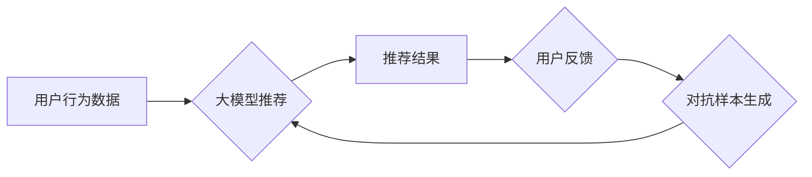

                 

## 推荐系统中的大模型对抗学习应用

> 关键词：推荐系统、大模型、对抗学习、鲁棒性、公平性、可解释性

## 1. 背景介绍

推荐系统作为信息过滤和个性化服务的重要组成部分，在电商、社交媒体、视频平台等领域发挥着越来越重要的作用。传统的推荐系统主要依赖于协同过滤、内容过滤等方法，但这些方法在面对数据稀疏、冷启动、数据漂移等问题时表现不足。近年来，大模型的兴起为推荐系统带来了新的机遇。大模型凭借其强大的学习能力和泛化能力，能够从海量数据中学习到更丰富的用户和物品特征，从而提升推荐效果。

然而，大模型也面临着一些挑战，例如：

* **对抗攻击：** 恶意用户可以通过精心设计的数据样本攻击推荐系统，从而获取虚假推荐或操纵用户行为。
* **数据偏差：** 训练数据可能存在各种偏差，导致推荐系统产生不公平或歧视性的结果。
* **可解释性差：** 大模型的决策过程往往难以理解，这使得用户难以信任推荐结果，也难以进行模型调优和故障诊断。

对抗学习作为一种机器学习技术，旨在通过训练模型对抗对抗攻击，从而提高模型的鲁棒性。将对抗学习应用于推荐系统，可以有效缓解上述问题，提升推荐系统的安全性、公平性和可解释性。

## 2. 核心概念与联系

### 2.1  推荐系统

推荐系统旨在根据用户的历史行为、偏好和上下文信息，预测用户对特定物品的兴趣，并推荐用户可能感兴趣的物品。

### 2.2  大模型

大模型是指参数规模庞大、训练数据量巨大的深度学习模型。大模型通常具有强大的泛化能力和学习能力，能够从海量数据中学习到复杂的模式和关系。

### 2.3  对抗学习

对抗学习是一种机器学习技术，旨在通过训练模型对抗对抗攻击，从而提高模型的鲁棒性。对抗攻击是指通过对输入数据进行微小的扰动，从而欺骗模型做出错误预测。对抗学习通过训练模型识别和抵抗这些对抗样本，从而提高模型的鲁棒性。

### 2.4  对抗学习与推荐系统的结合

将对抗学习应用于推荐系统，可以有效提升推荐系统的鲁棒性、公平性和可解释性。

**Mermaid 流程图**



## 3. 核心算法原理 & 具体操作步骤

### 3.1  算法原理概述

对抗学习的核心思想是通过训练模型对抗对抗攻击，从而提高模型的鲁棒性。对抗攻击是指通过对输入数据进行微小的扰动，从而欺骗模型做出错误预测。对抗学习通过训练模型识别和抵抗这些对抗样本，从而提高模型的鲁棒性。

在推荐系统中，对抗学习可以应用于以下几个方面：

* **对抗样本生成：** 生成对抗样本，用于测试推荐系统的鲁棒性。
* **对抗训练：** 在训练过程中，加入对抗样本，训练模型抵抗对抗攻击。
* **对抗防御：** 在部署阶段，使用对抗防御机制，防止恶意用户攻击推荐系统。

### 3.2  算法步骤详解

**对抗样本生成**

1. 选择一个推荐模型。
2. 选择一个用户和一个物品。
3. 使用梯度下降算法，对用户和物品的特征进行微小的扰动，使得推荐模型的预测结果发生变化。
4. 生成对抗样本。

**对抗训练**

1. 使用原始数据训练推荐模型。
2. 生成对抗样本。
3. 使用对抗样本和原始数据训练推荐模型。
4. 重复步骤2和3，直到模型的鲁棒性达到预期水平。

**对抗防御**

1. 使用对抗防御机制，例如对抗训练、数据增强、模型剪枝等，来防止恶意用户攻击推荐系统。
2. 定期评估推荐系统的鲁棒性，并根据需要调整对抗防御机制。

### 3.3  算法优缺点

**优点：**

* 可以有效提高推荐系统的鲁棒性，使其能够抵抗对抗攻击。
* 可以提升推荐系统的公平性和可解释性。

**缺点：**

* 训练对抗样本和对抗训练需要消耗大量的计算资源。
* 攻击者可能不断开发新的对抗攻击方法，导致对抗防御机制失效。

### 3.4  算法应用领域

* **电商推荐：** 提高商品推荐的鲁棒性，防止恶意用户通过攻击推荐系统获取虚假商品推荐。
* **社交媒体推荐：** 提高用户内容推荐的鲁棒性，防止恶意用户通过攻击推荐系统传播虚假信息。
* **视频平台推荐：** 提高视频推荐的鲁棒性，防止恶意用户通过攻击推荐系统获取虚假视频推荐。

## 4. 数学模型和公式 & 详细讲解 & 举例说明

### 4.1  数学模型构建

假设我们有一个推荐系统，其目标是预测用户 $u$ 对物品 $i$ 的评分 $r_{ui}$。我们可以使用以下数学模型来表示推荐系统的预测结果：

$$
\hat{r}_{ui} = f(h_u, h_i, \theta)
$$

其中：

* $\hat{r}_{ui}$ 是模型预测的用户 $u$ 对物品 $i$ 的评分。
* $h_u$ 是用户 $u$ 的特征向量。
* $h_i$ 是物品 $i$ 的特征向量。
* $\theta$ 是模型的参数向量。
* $f$ 是一个非线性函数，例如多层感知机。

### 4.2  公式推导过程

对抗学习的目标是训练一个鲁棒的模型，能够抵抗对抗样本的攻击。对抗样本是指对输入数据进行微小的扰动，从而欺骗模型做出错误预测的数据样本。

假设我们有一个对抗样本 $x' = x + \epsilon$，其中 $x$ 是原始数据，$\epsilon$ 是微小的扰动。对抗学习的目标是训练模型能够识别和抵抗这些对抗样本，即：

$$
\min_{\theta} \max_{\epsilon} L(f(h_u, h_i, \theta), r_{ui})
$$

其中：

* $L$ 是损失函数，例如均方误差。

### 4.3  案例分析与讲解

假设我们有一个电商推荐系统，其目标是推荐用户可能感兴趣的商品。

* **原始数据：** 用户的购买历史、浏览记录、评分等数据。
* **对抗样本：** 通过对用户特征进行微小的扰动，例如增加用户对特定商品的评分，从而欺骗模型推荐该商品。

对抗学习可以训练模型识别和抵抗这些对抗样本，从而提高推荐系统的鲁棒性。

## 5. 项目实践：代码实例和详细解释说明

### 5.1  开发环境搭建

* Python 3.6+
* TensorFlow 2.0+
* PyTorch 1.0+
* Jupyter Notebook

### 5.2  源代码详细实现

```python
import tensorflow as tf

# 定义推荐模型
class RecommenderModel(tf.keras.Model):
    def __init__(self, user_dim, item_dim, embedding_dim):
        super(RecommenderModel, self).__init__()
        self.user_embedding = tf.keras.layers.Embedding(user_dim, embedding_dim)
        self.item_embedding = tf.keras.layers.Embedding(item_dim, embedding_dim)
        self.dense = tf.keras.layers.Dense(1)

    def call(self, user_id, item_id):
        user_embedding = self.user_embedding(user_id)
        item_embedding = self.item_embedding(item_id)
        return self.dense(tf.concat([user_embedding, item_embedding], axis=-1))

# 定义损失函数
def loss_function(y_true, y_pred):
    return tf.keras.losses.MeanSquaredError()(y_true, y_pred)

# 定义优化器
optimizer = tf.keras.optimizers.Adam(learning_rate=0.001)

# 训练模型
model = RecommenderModel(user_dim=1000, item_dim=10000, embedding_dim=64)
model.compile(loss=loss_function, optimizer=optimizer)
model.fit(x_train, y_train, epochs=10)

```

### 5.3  代码解读与分析

* **推荐模型:** 使用多层感知机构建推荐模型，将用户和物品的特征向量拼接后输入到全连接层，输出用户对物品的评分预测。
* **损失函数:** 使用均方误差作为损失函数，衡量模型预测结果与真实评分之间的差异。
* **优化器:** 使用Adam优化器更新模型参数，使其能够最小化损失函数。
* **训练过程:** 使用训练数据训练模型，并使用验证数据评估模型性能。

### 5.4  运行结果展示

训练完成后，可以使用测试数据评估模型的性能，例如计算平均绝对误差 (MAE) 或均方根误差 (RMSE)。

## 6. 实际应用场景

### 6.1  电商推荐

* **商品推荐:** 针对用户的浏览历史、购买记录、评分等数据，推荐用户可能感兴趣的商品。
* **个性化促销:** 根据用户的购买偏好和行为模式，推荐个性化的促销活动和优惠券。

### 6.2  社交媒体推荐

* **内容推荐:** 针对用户的兴趣爱好、关注者、互动行为等数据，推荐用户可能感兴趣的内容，例如文章、视频、图片等。
* **好友推荐:** 根据用户的社交关系和兴趣爱好，推荐可能成为好友的用户。

### 6.3  视频平台推荐

* **视频推荐:** 针对用户的观看历史、点赞记录、评论等数据，推荐用户可能感兴趣的视频。
* **直播推荐:** 根据用户的观看习惯和兴趣爱好，推荐用户可能感兴趣的直播内容。

### 6.4  未来应用展望

* **更精准的推荐:** 利用对抗学习技术，提高推荐系统的鲁棒性，使其能够更好地抵抗对抗攻击，从而提供更精准的推荐结果。
* **更个性化的推荐:** 利用对抗学习技术，更好地理解用户的需求和偏好，从而提供更个性化的推荐服务。
* **更公平的推荐:** 利用对抗学习技术，缓解推荐系统中的数据偏差问题，从而提供更公平的推荐结果。

## 7. 工具和资源推荐

### 7.1  学习资源推荐

* **书籍:**
    * Deep Learning by Ian Goodfellow, Yoshua Bengio, and Aaron Courville
    * Adversarial Machine Learning by Ian Goodfellow
* **课程:**
    * Stanford CS231n: Convolutional Neural Networks for Visual Recognition
    * MIT 6.S191: Introduction to Deep Learning

### 7.2  开发工具推荐

* **TensorFlow:** https://www.tensorflow.org/
* **PyTorch:** https://pytorch.org/
* **Keras:** https://keras.io/

### 7.3  相关论文推荐

* **Generative Adversarial Networks** by Ian Goodfellow et al. (2014)
* **Adversarial Examples for Machine Learning** by Ian Goodfellow et al. (2015)
* **Adversarial Training for Robust Machine Learning** by Madry et al. (2017)

## 8. 总结：未来发展趋势与挑战

### 8.1  研究成果总结

对抗学习在推荐系统领域取得了显著的进展，能够有效提高推荐系统的鲁棒性、公平性和可解释性。

### 8.2  未来发展趋势

* **更有效的对抗训练方法:** 研究更有效的对抗训练方法，例如基于生成对抗网络 (GAN) 的对抗训练、基于强化学习的对抗训练等。
* **更鲁棒的对抗防御机制:** 研究更鲁棒的对抗防御机制，例如数据增强、模型剪枝、对抗训练等。
* **更公平的推荐系统:** 研究如何利用对抗学习技术缓解推荐系统中的数据偏差问题，从而提供更公平的推荐结果。

### 8.3  面临的挑战

* **对抗样本的生成:** 生成有效的对抗样本仍然是一个挑战，需要不断探索新的方法和技术。
* **对抗训练的效率:** 对抗训练通常需要大量的计算资源，如何提高对抗训练的效率是一个重要的研究方向。
* **对抗防御的泛化能力:** 现有的对抗防御机制往往具有较差的泛化能力，需要研究更通用的对抗防御方法。

### 8.4  研究展望

对抗学习在推荐系统领域仍有很大的发展空间，未来研究将更加注重以下几个方面：

* **理论研究:** 深入研究对抗学习的理论基础，例如对抗样本的性质、对抗训练的机制等。
* **算法创新:** 开发更有效的对抗训练方法和对抗防御机制。
* **应用研究:** 将对抗学习技术应用于更多实际场景，例如个性化推荐、欺诈检测、信息过滤等。


## 9. 附录：常见问题与解答

**Q1: 对抗学习的原理是什么？**

A1: 对抗学习的核心思想是通过训练两个模型，一个生成模型和一个判别模型，来学习数据分布。生成模型试图生成与真实数据相似的样本，而判别模型试图区分真实数据和生成数据。通过不断迭代训练，生成模型能够生成越来越逼真的样本，而判别模型能够越来越准确地区分真实数据和生成数据。

**Q2: 对抗学习在推荐系统中的应用有哪些？**

A2: 对抗学习在推荐系统中的应用包括：

* **对抗样本生成:** 生成对抗样本，用于测试推荐系统的鲁棒性。
* **对抗训练:** 在训练过程中，加入对抗样本，训练模型抵抗对抗攻击。
* **对抗防御:** 在部署阶段，使用对抗防御机制，防止恶意用户攻击推荐系统。

**Q3: 对抗学习有哪些挑战？**

A3: 对抗学习面临的挑战包括：

* **对抗样本的生成:** 生成有效的对抗样本仍然是一个挑战，需要不断探索新的方法和技术。
* **对抗训练的效率:** 对抗训练通常需要大量的计算资源，如何提高对抗训练的效率是一个重要的研究方向。
* **对抗防御的泛化能力:** 现有的对抗防御机制往往具有较差的泛化能力，需要研究更通用的对抗防御方法。


作者：禅与计算机程序设计艺术 / Zen and the Art of Computer Programming<end_of_turn>

