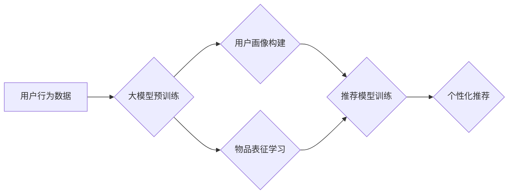

                 

## 推荐系统的未来：大模型的主导地位

> 关键词：推荐系统、大模型、Transformer、深度学习、个性化推荐、冷启动问题、数据隐私

### 1. 背景介绍

推荐系统作为互联网时代的重要组成部分，已经渗透到我们生活的方方面面，从电商平台的商品推荐、视频网站的影视推荐到社交媒体的个性化内容推送，都离不开推荐系统的支持。传统的推荐系统主要依赖于协同过滤、内容过滤等方法，但随着用户行为数据量的激增和推荐需求的多样化，这些方法逐渐显现出局限性。

近年来，深度学习技术的飞速发展为推荐系统带来了新的机遇。大模型，特别是基于Transformer架构的大模型，凭借其强大的学习能力和泛化能力，在推荐系统领域展现出巨大的潜力。

### 2. 核心概念与联系

#### 2.1 推荐系统概述

推荐系统旨在根据用户的历史行为、偏好和上下文信息，预测用户对特定物品的兴趣，并提供个性化的推荐列表。

#### 2.2 大模型简介

大模型是指参数规模庞大、训练数据海量的人工智能模型。它们通常通过大量的文本数据进行预训练，学习到丰富的语言表示和知识，并能够在各种下游任务中进行微调，例如文本生成、机器翻译、问答系统等。

#### 2.3 Transformer架构

Transformer是一种新型的神经网络架构，其核心是自注意力机制，能够有效捕捉文本序列中的长距离依赖关系。与传统的循环神经网络相比，Transformer具有更快的训练速度和更好的性能。

#### 2.4 大模型在推荐系统中的应用

大模型可以应用于推荐系统的各个环节，例如：

* **用户画像构建:** 利用大模型对用户的历史行为数据进行分析，构建更精准的用户画像。
* **物品表征学习:** 利用大模型对物品的描述信息进行学习，生成更丰富的物品表征。
* **推荐模型训练:** 利用大模型作为推荐模型的核心组件，学习用户和物品之间的潜在关系。

**Mermaid 流程图**



### 3. 核心算法原理 & 具体操作步骤

#### 3.1 算法原理概述

大模型在推荐系统中的应用主要基于深度学习技术，其中Transformer架构的模型在推荐领域表现尤为突出。

Transformer模型通过多头自注意力机制学习用户和物品之间的关系，并利用前馈神经网络进行特征提取和融合。

#### 3.2 算法步骤详解

1. **数据预处理:** 收集用户行为数据、物品信息等数据，并进行清洗、格式化等预处理操作。
2. **特征工程:** 将原始数据转换为模型可理解的特征，例如用户ID、物品ID、评分、浏览时间等。
3. **模型训练:** 利用大模型进行训练，学习用户和物品之间的潜在关系。
4. **模型评估:** 使用测试数据评估模型的性能，例如准确率、召回率、NDCG等指标。
5. **模型部署:** 将训练好的模型部署到线上环境，为用户提供个性化推荐服务。

#### 3.3 算法优缺点

**优点:**

* **强大的学习能力:** 大模型能够学习到更复杂的特征和关系，提升推荐效果。
* **泛化能力强:** 预训练的大模型能够在不同领域和任务中进行迁移学习，降低开发成本。
* **个性化推荐:** 大模型能够根据用户的历史行为和偏好进行个性化推荐，提升用户体验。

**缺点:**

* **训练成本高:** 大模型的训练需要大量的计算资源和时间。
* **数据依赖性强:** 大模型的性能依赖于训练数据的质量和数量。
* **可解释性差:** 大模型的决策过程较为复杂，难以解释推荐结果。

#### 3.4 算法应用领域

大模型在推荐系统领域具有广泛的应用前景，例如：

* **电商推荐:** 推荐商品、优惠券、促销活动等。
* **视频推荐:** 推荐影视作品、直播内容、短视频等。
* **音乐推荐:** 推荐歌曲、专辑、音乐人等。
* **新闻推荐:** 推荐新闻文章、资讯内容等。

### 4. 数学模型和公式 & 详细讲解 & 举例说明

#### 4.1 数学模型构建

大模型在推荐系统中的应用通常基于以下数学模型：

* **用户-物品交互矩阵:** 用来表示用户对物品的评分或交互行为，其中每个元素代表用户对物品的评分或交互行为。

* **嵌入向量:** 将用户和物品映射到低维向量空间，以便模型学习用户和物品之间的关系。

* **注意力机制:** 用于学习用户和物品之间的重要关系，并赋予不同关系不同的权重。

#### 4.2 公式推导过程

Transformer模型的核心是自注意力机制，其计算公式如下：

$$
Attention(Q, K, V) = softmax(\frac{QK^T}{\sqrt{d_k}})V
$$

其中：

* $Q$：查询矩阵
* $K$：键矩阵
* $V$：值矩阵
* $d_k$：键向量的维度

#### 4.3 案例分析与讲解

假设我们有一个用户-物品交互矩阵，其中每个元素代表用户对物品的评分。我们可以使用大模型学习用户和物品的嵌入向量，并利用注意力机制计算用户对每个物品的兴趣分数。

例如，用户A对物品1评分为5，对物品2评分为3，对物品3评分为4。我们可以将这些评分信息作为训练数据，训练一个大模型学习用户A的嵌入向量和物品1、2、3的嵌入向量。

训练完成后，我们可以使用模型计算用户A对每个物品的兴趣分数。例如，模型可能计算出用户A对物品1的兴趣分数最高，其次是物品3，最后是物品2。

### 5. 项目实践：代码实例和详细解释说明

#### 5.1 开发环境搭建

推荐系统开发环境通常包含以下组件：

* **编程语言:** Python
* **深度学习框架:** TensorFlow、PyTorch
* **数据处理工具:** Pandas、NumPy
* **云计算平台:** AWS、Azure、GCP

#### 5.2 源代码详细实现

以下是一个使用PyTorch实现基于Transformer架构的推荐系统的简单代码示例：

```python
import torch
import torch.nn as nn

class TransformerRecommender(nn.Module):
    def __init__(self, user_dim, item_dim, hidden_dim, num_heads):
        super(TransformerRecommender, self).__init__()
        self.embedding = nn.Embedding(user_dim, user_dim)
        self.item_embedding = nn.Embedding(item_dim, item_dim)
        self.transformer = nn.Transformer(d_model=hidden_dim, nhead=num_heads)
        self.fc = nn.Linear(hidden_dim, 1)

    def forward(self, user_ids, item_ids):
        user_embeddings = self.embedding(user_ids)
        item_embeddings = self.item_embedding(item_ids)
        embeddings = torch.cat([user_embeddings, item_embeddings], dim=-1)
        output = self.transformer(embeddings)
        output = self.fc(output[:, 0, :])
        return output
```

#### 5.3 代码解读与分析

* `__init__`方法：初始化模型参数，包括用户嵌入层、物品嵌入层、Transformer层和全连接层。
* `forward`方法：定义模型的正向传播过程，将用户ID和物品ID转换为嵌入向量，并通过Transformer层进行处理，最后使用全连接层输出预测评分。

#### 5.4 运行结果展示

训练完成后，可以使用测试数据评估模型的性能，例如计算准确率、召回率、NDCG等指标。

### 6. 实际应用场景

#### 6.1 电商推荐

大模型在电商推荐领域具有广泛的应用场景，例如：

* **商品推荐:** 根据用户的历史购买记录、浏览记录和兴趣偏好，推荐相关的商品。
* **优惠券推荐:** 根据用户的消费习惯和优惠信息，推荐合适的优惠券。
* **促销活动推荐:** 根据用户的兴趣和消费行为，推荐相关的促销活动。

#### 6.2 视频推荐

大模型在视频推荐领域可以实现以下功能：

* **影视作品推荐:** 根据用户的观看历史、评分和喜好，推荐相关的影视作品。
* **直播内容推荐:** 根据用户的观看习惯和兴趣，推荐相关的直播内容。
* **短视频推荐:** 根据用户的观看记录和兴趣偏好，推荐相关的短视频。

#### 6.3 音乐推荐

大模型可以用于以下音乐推荐场景：

* **歌曲推荐:** 根据用户的播放历史、收藏和点赞记录，推荐相关的歌曲。
* **专辑推荐:** 根据用户的音乐偏好和聆听习惯，推荐相关的专辑。
* **音乐人推荐:** 根据用户的音乐口味和关注对象，推荐相关的音乐人。

#### 6.4 未来应用展望

随着大模型技术的不断发展，其在推荐系统领域的应用将更加广泛和深入，例如：

* **个性化推荐:** 大模型能够学习到更细粒度的用户特征，实现更加个性化的推荐。
* **跨模态推荐:** 大模型能够融合文本、图像、音频等多模态数据，实现更加丰富的推荐体验。
* **实时推荐:** 大模型能够实时更新用户偏好和兴趣，实现更加动态的推荐。

### 7. 工具和资源推荐

#### 7.1 学习资源推荐

* **书籍:**
    * 《深度学习》
    * 《自然语言处理》
    * 《推荐系统》
* **在线课程:**
    * Coursera
    * edX
    * Udacity
* **博客和论坛:**
    * Towards Data Science
    * Machine Learning Mastery
    * Reddit

#### 7.2 开发工具推荐

* **深度学习框架:** TensorFlow、PyTorch
* **数据处理工具:** Pandas、NumPy
* **云计算平台:** AWS、Azure、GCP

#### 7.3 相关论文推荐

* **BERT:** Devlin et al. (2018)
* **GPT-3:** Brown et al. (2020)
* **Transformer:** Vaswani et al. (2017)

### 8. 总结：未来发展趋势与挑战

#### 8.1 研究成果总结

大模型在推荐系统领域取得了显著的成果，例如：

* **提升推荐效果:** 大模型能够学习到更复杂的特征和关系，提升推荐的准确性和个性化程度。
* **降低开发成本:** 预训练的大模型能够在不同领域和任务中进行迁移学习，降低开发成本。
* **拓展应用场景:** 大模型能够应用于各种推荐场景，例如电商、视频、音乐等。

#### 8.2 未来发展趋势

* **模型规模更大:** 未来大模型的规模将进一步扩大，学习能力和泛化能力将得到进一步提升。
* **多模态融合:** 大模型将融合文本、图像、音频等多模态数据，实现更加丰富的推荐体验。
* **个性化定制:** 大模型将能够根据用户的个性化需求进行定制，提供更加精准的推荐服务。

#### 8.3 面临的挑战

* **训练成本高:** 大模型的训练需要大量的计算资源和时间，成本较高。
* **数据依赖性强:** 大模型的性能依赖于训练数据的质量和数量，数据获取和处理是一个挑战。
* **可解释性差:** 大模型的决策过程较为复杂，难以解释推荐结果，缺乏透明度。

#### 8.4 研究展望

未来研究将集中在以下几个方面：

* **降低训练成本:** 研究更有效的训练方法和硬件架构，降低大模型的训练成本。
* **提升数据利用效率:** 研究如何利用少量的训练数据，提高大模型的性能。
* **增强模型可解释性:** 研究如何解释大模型的决策过程，提高推荐结果的透明度。

### 9. 附录：常见问题与解答

#### 9.1 如何选择合适的推荐算法？

选择合适的推荐算法需要根据具体场景和需求进行考虑，例如：

* **数据量:** 数据量较少时，可以使用基于内容过滤的算法；数据量较大时，可以使用基于协同过滤的算法。
* **用户行为:** 用户行为多样化时，可以使用基于混合过滤的算法；用户行为单一化时，可以使用基于深度学习的算法。
* **推荐效果:** 需要追求高准确率时，可以使用基于梯度下降的算法；需要追求个性化推荐时，可以使用基于Transformer的算法。

#### 9.2 如何评估推荐系统的性能？

推荐系统的性能通常使用以下指标进行评估：

* **准确率:** 推荐结果中正确预测的比例。
* **召回率:** 推荐结果中包含所有真实目标的比例。
* **NDCG:** Normalized Discounted Cumulative Gain，衡量推荐结果的排序质量。

#### 9.3 如何解决冷启动问题？

冷启动问题是指推荐系统在面对新用户或新物品时，缺乏历史数据进行推荐的困境。

解决冷启动问题的常用方法包括：

* **利用用户属性信息:** 利用用户的基本信息，例如年龄、性别、兴趣爱好等，进行推荐。
* **利用物品属性信息:** 利用物品的描述信息，例如类别、价格、品牌等，进行推荐。
* **利用协同过滤的邻居推荐:** 利用与新用户或新物品相似的用户或物品的历史数据进行推荐。


作者：禅与计算机程序设计艺术 / Zen and the Art of Computer Programming 
<end_of_turn>

