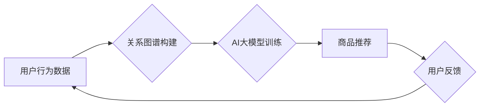

                 

## 1. 背景介绍

在当今数据爆炸的时代，电商平台面临着巨大的挑战：如何精准地推荐用户感兴趣的产品，提升用户体验，最终提高转化率和盈利。传统的搜索推荐系统主要依赖于基于规则的算法和协同过滤技术，但这些方法在面对海量数据和用户个性化需求时显得捉襟见肘。

近年来，人工智能（AI）技术，特别是深度学习，为搜索推荐系统带来了革命性的变革。AI大模型凭借其强大的学习能力和泛化能力，能够从海量数据中挖掘出用户隐含的兴趣和偏好，提供更精准、更个性化的推荐结果。

## 2. 核心概念与联系

### 2.1 搜索推荐系统

搜索推荐系统是电商平台的核心功能之一，旨在帮助用户快速找到所需商品，并根据用户的历史行为、偏好和上下文信息，推荐相关商品。

### 2.2 AI 大模型

AI大模型是指在海量数据上训练的深度学习模型，拥有强大的泛化能力和学习能力。常见的AI大模型包括BERT、GPT-3、LaMDA等。

### 2.3 关系图谱

关系图谱是一种数据结构，用于表示实体之间的关系。在搜索推荐系统中，关系图谱可以用来构建用户-商品-品牌-类别等多维关系网络，帮助模型理解用户需求和商品属性之间的关联。

**Mermaid 流程图**



## 3. 核心算法原理 & 具体操作步骤

### 3.1 算法原理概述

AI大模型在搜索推荐系统中的应用主要基于以下核心算法：

* **协同过滤:** 基于用户的历史行为和商品的相似度，推荐用户可能感兴趣的商品。
* **内容过滤:** 基于商品的属性和描述，推荐与用户兴趣相符的商品。
* **深度学习:** 利用深度神经网络从海量数据中学习用户偏好和商品特征，进行更精准的推荐。

### 3.2 算法步骤详解

**深度学习算法步骤:**

1. **数据预处理:** 收集用户行为数据、商品信息、用户画像等数据，进行清洗、转换和特征工程。
2. **模型构建:** 选择合适的深度学习模型，例如Transformer、BERT等，并根据任务需求进行调整。
3. **模型训练:** 利用预处理后的数据训练模型，并通过评估指标（例如准确率、召回率、NDCG等）进行模型优化。
4. **模型部署:** 将训练好的模型部署到线上环境，并进行实时推荐。
5. **模型监控和更新:** 持续监控模型的性能，并根据用户反馈和数据变化进行模型更新和迭代。

### 3.3 算法优缺点

**深度学习算法优点:**

* 能够从海量数据中学习出更复杂的模式和关系。
* 具有较强的泛化能力，能够对新的用户和商品进行准确推荐。
* 可以结合多种数据源进行推荐，提高推荐的准确性和个性化程度。

**深度学习算法缺点:**

* 需要大量的训练数据和计算资源。
* 模型训练过程复杂，需要专业的技术人员进行操作。
* 模型解释性较差，难以理解模型的推荐决策过程。

### 3.4 算法应用领域

深度学习算法在搜索推荐系统中的应用领域非常广泛，包括：

* **电商平台商品推荐:** 根据用户的历史购买记录、浏览记录、收藏记录等数据，推荐用户可能感兴趣的商品。
* **内容平台文章推荐:** 根据用户的阅读历史、点赞记录、评论记录等数据，推荐用户可能感兴趣的文章。
* **社交平台好友推荐:** 根据用户的社交关系、共同兴趣、共同好友等数据，推荐用户可能想添加的好友。

## 4. 数学模型和公式 & 详细讲解 & 举例说明

### 4.1 数学模型构建

在搜索推荐系统中，常用的数学模型包括协同过滤模型、内容过滤模型和深度学习模型。

**协同过滤模型:**

协同过滤模型基于用户的历史行为数据，预测用户对商品的评分或购买意愿。常用的协同过滤算法包括基于用户的协同过滤和基于物品的协同过滤。

**内容过滤模型:**

内容过滤模型基于商品的属性和描述，预测用户对商品的兴趣。常用的内容过滤算法包括TF-IDF、Word2Vec等。

**深度学习模型:**

深度学习模型利用深度神经网络从海量数据中学习用户偏好和商品特征，进行更精准的推荐。常用的深度学习模型包括Transformer、BERT等。

### 4.2 公式推导过程

**协同过滤模型的公式推导:**

假设用户 $u$ 对商品 $i$ 的评分为 $r_{ui}$，则协同过滤模型的目标是预测用户 $u$ 对商品 $i$ 的评分。

基于用户的协同过滤模型可以使用以下公式进行预测:

$$
\hat{r}_{ui} = \bar{r}_u + \frac{\sum_{j \in N(u)} (r_{uj} - \bar{r}_u) \cdot sim(u, j)}{\sum_{j \in N(u)} sim(u, j)}
$$

其中:

* $\hat{r}_{ui}$ 是模型预测的用户 $u$ 对商品 $i$ 的评分。
* $\bar{r}_u$ 是用户 $u$ 的平均评分。
* $N(u)$ 是与用户 $u$ 相似的用户集合。
* $sim(u, j)$ 是用户 $u$ 和用户 $j$ 之间的相似度。

**内容过滤模型的公式推导:**

内容过滤模型可以使用TF-IDF算法计算商品 $i$ 的重要性得分:

$$
TF-IDF(i) = TF(i) \cdot IDF(i)
$$

其中:

* $TF(i)$ 是商品 $i$ 在文档中的词频。
* $IDF(i)$ 是商品 $i$ 在整个语料库中的逆文档频率。

### 4.3 案例分析与讲解

**案例:**

假设一个电商平台想要推荐用户可能感兴趣的书籍。

**协同过滤:**

根据用户的历史购买记录，可以找到与当前用户兴趣相似的用户，并推荐这些用户购买过的书籍。

**内容过滤:**

根据书籍的主题、作者、出版社等信息，可以推荐与用户兴趣相符的书籍。

**深度学习:**

利用深度学习模型，可以从用户的历史行为数据、书籍信息、用户画像等多维数据中学习出用户偏好和书籍特征，进行更精准的推荐。

## 5. 项目实践：代码实例和详细解释说明

### 5.1 开发环境搭建

* Python 3.x
* TensorFlow 或 PyTorch
* Jupyter Notebook

### 5.2 源代码详细实现

```python
# 导入必要的库
import tensorflow as tf

# 定义模型结构
model = tf.keras.Sequential([
    tf.keras.layers.Embedding(input_dim=vocab_size, output_dim=embedding_dim),
    tf.keras.layers.LSTM(units=128),
    tf.keras.layers.Dense(units=num_classes, activation='softmax')
])

# 编译模型
model.compile(optimizer='adam',
              loss='sparse_categorical_crossentropy',
              metrics=['accuracy'])

# 训练模型
model.fit(x_train, y_train, epochs=10, batch_size=32)

# 评估模型
loss, accuracy = model.evaluate(x_test, y_test)
print('Loss:', loss)
print('Accuracy:', accuracy)
```

### 5.3 代码解读与分析

* **Embedding层:** 将用户和商品的ID转换为稠密的向量表示。
* **LSTM层:** 学习用户和商品之间的序列关系。
* **Dense层:** 输出预测结果，即用户对商品的评分或购买意愿。
* **编译模型:** 选择优化器、损失函数和评估指标。
* **训练模型:** 使用训练数据训练模型。
* **评估模型:** 使用测试数据评估模型的性能。

### 5.4 运行结果展示

训练完成后，可以将模型部署到线上环境，并进行实时推荐。

## 6. 实际应用场景

### 6.1 电商平台商品推荐

AI大模型在电商平台商品推荐场景中应用广泛，例如：

* **个性化推荐:** 根据用户的历史购买记录、浏览记录、收藏记录等数据，推荐用户可能感兴趣的商品。
* **新品推荐:** 推荐平台上最新的商品，提高用户对新品的关注度。
* **关联推荐:** 根据用户购买的商品，推荐与之相关的商品，例如“购买了手机，也可能需要购买充电器”。

### 6.2 内容平台文章推荐

AI大模型也可以用于内容平台文章推荐，例如：

* **个性化推荐:** 根据用户的阅读历史、点赞记录、评论记录等数据，推荐用户可能感兴趣的文章。
* **热点推荐:** 推荐平台上当前热门的文章，提高用户对热点事件的关注度。
* **主题推荐:** 根据用户的兴趣爱好，推荐与之相关的主题文章。

### 6.3 社交平台好友推荐

AI大模型还可以用于社交平台好友推荐，例如：

* **兴趣推荐:** 根据用户的兴趣爱好，推荐可能与用户兴趣相符的用户。
* **关系推荐:** 根据用户的社交关系，推荐可能与用户关系密切的用户。
* **共同好友推荐:** 根据用户的共同好友，推荐可能与用户关系密切的用户。

### 6.4 未来应用展望

随着AI技术的不断发展，AI大模型在搜索推荐系统中的应用场景将会更加广泛，例如：

* **多模态推荐:** 将文本、图像、视频等多模态数据融合在一起，进行更精准的推荐。
* **个性化广告推荐:** 根据用户的兴趣爱好和行为数据，推荐个性化的广告。
* **跨平台推荐:** 将用户在不同平台的活动数据整合在一起，进行跨平台的推荐。

## 7. 工具和资源推荐

### 7.1 学习资源推荐

* **书籍:**
    * Deep Learning by Ian Goodfellow
    * Hands-On Machine Learning with Scikit-Learn, Keras & TensorFlow by Aurélien Géron
* **在线课程:**
    * TensorFlow官方教程
    * PyTorch官方教程
    * Coursera上的深度学习课程

### 7.2 开发工具推荐

* **TensorFlow:** 开源深度学习框架
* **PyTorch:** 开源深度学习框架
* **Jupyter Notebook:** 用于深度学习开发的交互式笔记本环境

### 7.3 相关论文推荐

* Attention Is All You Need
* BERT: Pre-training of Deep Bidirectional Transformers for Language Understanding
* Transformer-XL: Attentive Language Modeling Beyond Millions of Tokens

## 8. 总结：未来发展趋势与挑战

### 8.1 研究成果总结

AI大模型在搜索推荐系统中的应用取得了显著的成果，能够提供更精准、更个性化的推荐结果，提高用户体验和平台盈利。

### 8.2 未来发展趋势

* **模型规模和能力的提升:** 未来AI大模型将会更加庞大，拥有更强的学习能力和泛化能力。
* **多模态融合:** 将文本、图像、视频等多模态数据融合在一起，进行更全面的用户理解和商品推荐。
* **解释性和可解释性:** 研究如何提高AI大模型的解释性和可解释性，帮助用户理解模型的推荐决策过程。

### 8.3 面临的挑战

* **数据质量和隐私问题:** AI大模型需要海量数据进行训练，如何保证数据质量和用户隐私是一个重要的挑战。
* **模型训练成本:** 训练大型AI模型需要大量的计算资源和时间，成本较高。
* **模型公平性和偏见:** AI大模型可能会存在公平性和偏见问题，需要进行相应的研究和改进。

### 8.4 研究展望

未来，AI大模型在搜索推荐系统中的应用将会更加深入和广泛，为用户提供更智能、更便捷的体验。


## 9. 附录：常见问题与解答

**Q1: 如何选择合适的AI大模型？**

**A1:** 选择合适的AI大模型需要根据具体的应用场景和数据特点进行选择。例如，对于文本数据，BERT模型效果较好；对于图像数据，Vision Transformer模型效果较好。

**Q2: 如何解决AI大模型的训练成本问题？**

**A2:** 可以采用模型压缩、知识蒸馏等技术来降低模型训练成本。

**Q3: 如何保证AI大模型的公平性和可解释性？**

**A3:** 可以采用公平性评估指标、可解释性分析方法等手段来保证AI大模型的公平性和可解释性。


作者：禅与计算机程序设计艺术 / Zen and the Art of Computer Programming 
<end_of_turn>

