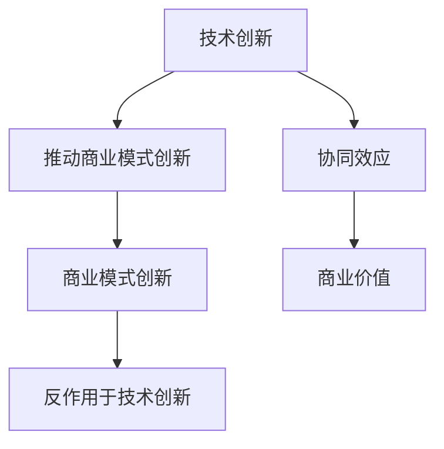
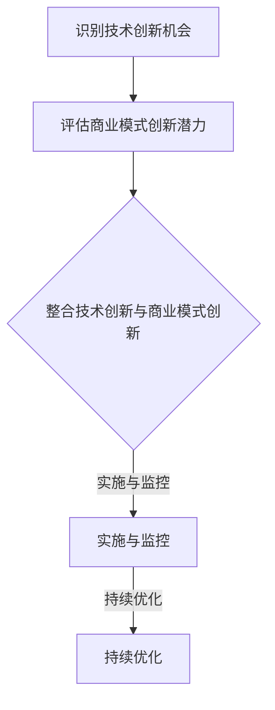

                 

### 背景介绍（Background Introduction）

技术创新与商业模式创新是推动企业发展和市场变革的两个重要动力。在过去几十年中，技术的快速发展极大地改变了人们的生活方式，从互联网的普及到智能手机的广泛应用，再到人工智能、大数据和云计算的兴起，每一次技术的革新都带来了商业模式的变革。

技术创新通常指的是通过引入新技术或改进现有技术来提高产品或服务的性能、效率或用户体验。例如，5G技术的引入大大提升了数据传输速度，使得实时视频流和在线游戏等应用成为可能。而商业模式创新则是指企业在既定的技术环境下，通过重新定义产品或服务的提供方式、客户关系或价值链，来实现新的商业模式。

这两者之间的关系并非简单的线性关系，而是相互影响、相互促进的。技术创新可以激发商业模式创新，反之亦然。例如，微信的诞生就是技术创新与商业模式创新相结合的产物。微信最初是一个即时通讯工具，但随着技术的进步和用户需求的增长，微信逐步引入了支付、社交电商、游戏等多元化功能，形成了独特的社交生态系统。这种模式创新反过来又促进了技术的进一步发展，如微信支付系统对金融科技的创新。

本文旨在探讨技术创新与商业模式创新之间的协同效应，分析它们在实践中的应用，以及如何通过这种协同效应来推动企业的长期发展。文章将首先介绍技术创新与商业模式创新的核心概念，然后深入探讨它们之间的相互关系，并通过实际案例进行分析。最后，我们将探讨未来的发展趋势与面临的挑战。

通过本文的阅读，读者将了解到：

1. 技术创新与商业模式创新的定义及其重要性。
2. 技术创新如何激发商业模式创新，以及商业模式创新如何反作用于技术发展。
3. 实际案例中技术创新与商业模式创新的协同效应。
4. 未来技术创新与商业模式创新的发展趋势及面临的挑战。

现在，让我们正式进入第一个核心章节，详细探讨技术创新与商业模式创新的核心概念及其联系。

### 核心概念与联系（Core Concepts and Connections）

#### 技术创新（Technological Innovation）

技术创新是指引入新的技术或对现有技术进行改进，从而提高产品或服务的性能、效率或用户体验。技术创新可以源自基础科学的研究突破，也可以是对现有技术的优化和集成。在技术发展的不同阶段，创新的表现形式和重点有所不同。

1. **基础研究**：在技术创新的早期阶段，基础研究往往占据主导地位。科学家和研究者通过探索新的科学原理和理论，为技术的突破打下基础。例如，量子计算的基础研究为量子计算机的开发提供了理论基础。

2. **应用研究**：在应用研究阶段，研究人员将基础研究成果转化为具体的技术解决方案。例如，5G通信技术的研发就是基于无线通信的理论和实验成果，通过技术创新实现了更高的数据传输速度和更低的延迟。

3. **产品开发**：在产品开发阶段，技术创新体现在产品设计和功能的改进上。例如，智能手机的快速发展就是通过引入触控技术、高性能处理器、高清摄像头等技术创新，不断优化用户体验。

技术创新的驱动因素包括以下几个方面：

- **市场需求**：消费者对更好、更快、更便捷的产品和服务的需求推动了技术创新。
- **竞争压力**：企业为了在竞争激烈的市场中保持领先，不断推动技术创新。
- **政策支持**：政府的政策支持，如科研经费、税收优惠等，为技术创新提供了良好的环境。
- **技术积累**：企业通过积累技术知识、专利和经验，不断提升技术创新的能力。

#### 商业模式创新（Business Model Innovation）

商业模式创新是指企业通过重新定义产品或服务的提供方式、客户关系或价值链，来实现新的商业模式。与技术创新不同，商业模式创新侧重于商业实践和运营模式的变革。

1. **价值创造**：商业模式创新的核心在于重新定义企业如何创造和传递价值。例如，共享经济模式通过整合闲置资源，实现了更高效的价值创造。
2. **客户关系**：商业模式创新也涉及到企业与客户的关系重构。通过客户细分、个性化服务和客户参与等手段，企业能够更好地满足客户需求。
3. **价值传递**：商业模式创新关注如何高效地传递价值给客户。例如，电子商务模式通过在线平台和物流网络的优化，实现了便捷的价值传递。

商业模式创新的驱动因素包括：

- **市场变化**：市场的变化，如消费者行为、行业竞争态势等，促使企业创新商业模式以适应市场变化。
- **技术进步**：新技术的引入为企业提供了新的商业模式可能性。例如，互联网和移动设备的普及推动了电子商务的快速发展。
- **企业战略**：企业的战略决策，如进入新市场、扩大业务范围等，也推动了商业模式创新。

#### 技术创新与商业模式创新的联系

技术创新和商业模式创新之间存在密切的联系，它们相互促进，共同推动企业的发展。

1. **技术创新推动商业模式创新**：新技术的出现往往为企业提供了新的商业模式可能性。例如，云计算技术的成熟推动了企业数字化转型，催生了SaaS（软件即服务）等新的商业模式。

2. **商业模式创新反作用于技术创新**：成功的商业模式创新可以推动技术的进一步发展。例如，苹果公司的iPhone不仅推动了智能手机技术的发展，还催生了App Store等生态系统，促进了移动应用的繁荣。

3. **协同效应**：技术创新与商业模式创新的协同效应可以带来巨大的商业价值。例如，特斯拉通过技术创新和商业模式创新的结合，成功颠覆了传统汽车行业，实现了电动汽车的快速发展。

#### 核心概念原理与架构的 Mermaid 流程图



通过上述 Mermaid 流程图，我们可以清晰地看到技术创新与商业模式创新之间的互动关系及其协同效应。

### 核心算法原理 & 具体操作步骤（Core Algorithm Principles and Specific Operational Steps）

在探讨技术创新与商业模式创新的协同效应时，我们不仅需要理解其核心概念和联系，还需要深入了解其具体操作步骤和算法原理。以下将详细介绍如何通过系统化的方法实现技术创新与商业模式创新的协同效应。

#### 步骤 1：识别技术创新机会

首先，企业需要识别技术创新的机会。这可以通过以下几种方法实现：

1. **市场调研**：通过市场调研，了解消费者需求、市场趋势和竞争态势，从而发现技术创新的潜在机会。
2. **技术跟踪**：密切关注科技领域的最新进展，包括学术论文、行业报告、科技新闻等，以获取技术创新的灵感。
3. **内部创新团队**：建立内部创新团队，鼓励员工提出创新想法，并通过内部竞争机制筛选出具有潜力的创新项目。

#### 步骤 2：评估商业模式创新潜力

在识别技术创新机会后，企业需要评估其商业模式创新的潜力。这可以通过以下方法实现：

1. **商业模型画布**：使用商业模型画布（Business Model Canvas）工具，对潜在商业模式的各个方面进行系统性评估，包括客户细分、价值主张、渠道、客户关系、收入来源、关键资源和关键活动等。
2. **市场测试**：通过市场测试，收集用户反馈，验证商业模式的可行性和市场接受度。
3. **竞争对手分析**：分析竞争对手的商业模式，寻找差异化的机会，从而实现创新。

#### 步骤 3：整合技术创新与商业模式创新

在评估创新机会后，企业需要将技术创新与商业模式创新整合起来，实现协同效应。具体操作步骤包括：

1. **跨部门协作**：建立跨部门协作机制，促进技术创新与商业模式创新的有效整合。例如，研发部门可以与市场部门共同制定技术创新的商业应用方案。
2. **迭代开发**：采用敏捷开发方法，通过快速迭代，不断优化技术创新与商业模式创新之间的匹配度。
3. **资源整合**：整合企业内部资源，包括人才、技术、资金等，为技术创新与商业模式创新提供支持。

#### 步骤 4：实施与监控

在整合技术创新与商业模式创新后，企业需要实施并监控创新项目的进展。具体操作步骤包括：

1. **项目立项**：明确创新项目的目标、范围和资源需求，确保项目能够顺利启动。
2. **过程监控**：建立监控机制，定期评估创新项目的进展，及时发现和解决问题。
3. **成果评估**：在项目完成后，对创新成果进行评估，包括技术性能、市场表现、财务收益等方面。

#### 步骤 5：持续优化

技术创新与商业模式创新是一个持续的过程，企业需要不断优化以保持竞争优势。具体操作步骤包括：

1. **持续创新**：鼓励员工持续提出创新想法，并不断探索新的技术创新和商业模式。
2. **学习与分享**：通过内部培训和分享会，提升员工的创新意识和能力。
3. **技术储备**：保持对前沿技术的关注和储备，为未来的创新提供技术支持。

#### 核心算法原理与操作步骤的 Mermaid 流程图



通过上述 Mermaid 流程图，我们可以清晰地看到实现技术创新与商业模式创新协同效应的具体步骤和核心算法原理。

### 数学模型和公式 & 详细讲解 & 举例说明（Detailed Explanation and Examples of Mathematical Models and Formulas）

在探讨技术创新与商业模式创新的协同效应时，数学模型和公式为我们提供了量化的工具，有助于更深入地理解和分析这一复杂的过程。以下将介绍几个关键数学模型和公式，并进行详细讲解和举例说明。

#### 1. 成本效益分析（Cost-Benefit Analysis）

成本效益分析是一种常用的经济评估方法，用于评估技术创新或商业模式创新的成本与收益。其基本公式如下：

\[ \text{成本效益比} = \frac{\text{总收益}}{\text{总成本}} \]

其中，总收益包括直接收益（如销售收入）和间接收益（如品牌价值提升）；总成本包括直接成本（如研发成本）和间接成本（如市场推广成本）。

**举例说明**：
假设某公司投资100万元进行技术创新，通过新技术的应用，公司预计在未来五年内实现销售收入增加500万元，同时市场推广成本增加50万元。则成本效益比为：

\[ \text{成本效益比} = \frac{500\text{万元}}{100\text{万元} + 50\text{万元}} = 8 \]

成本效益比大于1，表明技术创新能够带来正的净收益。

#### 2. 技术成熟度评估（Technology Readiness Level, TRL）

技术成熟度评估是一种衡量技术创新成熟度的方法，通常分为1到9级。以下是一个简化的评估公式：

\[ \text{技术成熟度} = \frac{\text{已实现的技术里程碑}}{\text{总技术里程碑}} \]

其中，已实现的技术里程碑是指已成功完成的研发任务，总技术里程碑是指计划完成的所有研发任务。

**举例说明**：
假设某项目计划完成5个技术里程碑，目前完成了3个，则其技术成熟度为：

\[ \text{技术成熟度} = \frac{3}{5} = 0.6 \]

技术成熟度越高，表明技术创新的进展越顺利。

#### 3. 商业模式吸引力评估（Business Model Attractiveness Index, BMAI）

商业模式吸引力评估用于衡量商业模式创新的市场前景和竞争优势。其基本公式如下：

\[ \text{BMAI} = \frac{(\text{市场潜力} + \text{客户价值} + \text{盈利能力})}{3} \]

其中，市场潜力、客户价值和盈利能力分别表示商业模式的市场前景、客户满意度和盈利水平。

**举例说明**：
假设某商业模式的评估结果如下：

- 市场潜力：90分
- 客户价值：85分
- 盈利能力：80分

则其商业模式吸引力指数为：

\[ \text{BMAI} = \frac{(90 + 85 + 80)}{3} = 85 \]

BMAI越高，表明商业模式越具吸引力。

#### 4. 敏捷开发迭代效率（Agile Development Iteration Efficiency, ADIE）

敏捷开发迭代效率用于评估技术创新与商业模式创新整合过程中的效率。其基本公式如下：

\[ \text{ADIE} = \frac{\text{已完成的迭代数}}{\text{计划完成的迭代数}} \]

**举例说明**：
假设某项目计划完成4个迭代，目前已完成3个，则其敏捷开发迭代效率为：

\[ \text{ADIE} = \frac{3}{4} = 0.75 \]

敏捷开发迭代效率越高，表明项目进展越顺利。

#### 5. 创新潜力评分（Innovation Potential Score, IPS）

创新潜力评分用于评估技术创新和商业模式创新的潜在价值。其基本公式如下：

\[ \text{IPS} = \frac{\text{技术创新评分} + \text{商业模式创新评分}}{2} \]

其中，技术创新评分和商业模式创新评分分别根据技术创新的成熟度和商业模式的吸引力指数进行评估。

**举例说明**：
假设某技术创新的成熟度为0.8，商业模式吸引力指数为85，则其创新潜力评分为：

\[ \text{IPS} = \frac{(0.8 + 85)}{2} = 43.6 \]

创新潜力评分越高，表明技术创新与商业模式创新的协同效应越显著。

通过上述数学模型和公式，我们可以更系统地评估技术创新与商业模式创新的协同效应。这些模型不仅为理论分析提供了量化工具，也为实践操作提供了指导。在实际应用中，企业可以根据具体情况进行调整和优化，以实现最佳的创新效果。

### 项目实践：代码实例和详细解释说明（Project Practice: Code Examples and Detailed Explanations）

为了更直观地理解技术创新与商业模式创新的协同效应，我们将通过一个实际项目——在线教育平台的设计与开发，来演示整个过程的代码实现和详细解释。

#### 1. 项目背景

在线教育平台是一个旨在为学生和教师提供便捷学习与交流环境的在线系统。通过这个项目，我们将结合技术创新和商业模式创新，实现以下目标：

- 提高学习效率：通过引入先进的教育技术，如人工智能辅导、自适应学习等，提高学习效果。
- 创新商业模式：通过订阅模式、付费课程、在线互动等创新方式，实现商业盈利。

#### 2. 开发环境搭建

在开始项目之前，我们需要搭建一个合适的开发环境。以下是搭建过程：

**技术栈**：前端使用React框架，后端使用Node.js和Express框架，数据库使用MongoDB。

**环境配置**：

1. 安装Node.js和npm（Node.js的包管理器）。
2. 创建项目文件夹，并初始化项目（`npm init`）。
3. 安装依赖包（`npm install react express mongodb`）。
4. 配置MongoDB数据库，并创建相应的数据库和集合。

#### 3. 源代码详细实现

以下为项目核心功能的源代码实现：

**（1）前端部分（React）**

```jsx
// App.js
import React, { useState, useEffect } from 'react';
import CourseList from './CourseList';
import CourseDetail from './CourseDetail';

function App() {
  const [courses, setCourses] = useState([]);

  useEffect(() => {
    fetch('/api/courses')
      .then((response) => response.json())
      .then((data) => setCourses(data));
  }, []);

  return (
    <div>
      <h1>在线教育平台</h1>
      <CourseList courses={courses} />
      <CourseDetail />
    </div>
  );
}

export default App;
```

**（2）后端部分（Node.js + Express）**

```javascript
// server.js
const express = require('express');
const MongoClient = require('mongodb').MongoClient;
const app = express();
const PORT = 3000;

// 连接MongoDB数据库
const mongoUrl = 'mongodb://localhost:27017';
const dbName = 'online_education';
let db;

MongoClient.connect(mongoUrl, { useUnifiedTopology: true }, (err, client) => {
  if (err) throw err;
  db = client.db(dbName);
});

app.use(express.json());

// 获取所有课程信息
app.get('/api/courses', async (req, res) => {
  const courses = await db.collection('courses').find({}).toArray();
  res.json(courses);
});

// 查看课程详情
app.get('/api/courses/:id', async (req, res) => {
  const courseId = req.params.id;
  const course = await db.collection('courses').findOne({ _id: new MongoClient.ObjectId(courseId) });
  res.json(course);
});

app.listen(PORT, () => {
  console.log(`Server running on port ${PORT}`);
});
```

**（3）数据库部分（MongoDB）**

```javascript
// courses.js
db.collection('courses').insertOne({
  _id: new MongoClient.ObjectId(),
  title: "Introduction to Machine Learning",
  instructor: "Dr. John Smith",
  duration: "4 weeks",
  price: 99,
  topics: ["Linear Regression", "Neural Networks", "Support Vector Machines"],
});
```

#### 4. 代码解读与分析

**（1）前端部分解读**

在前端部分，我们使用React框架实现了在线教育平台的基本结构。`App.js`文件是整个应用的入口，它包含以下主要功能：

- 状态管理：使用`useState`钩子管理课程数据的状态。
- 组件调用：通过`CourseList`和`CourseDetail`组件调用课程列表和课程详情页面。

**（2）后端部分解读**

在后端部分，我们使用Node.js和Express框架搭建了API接口。`server.js`文件实现了以下功能：

- 数据库连接：通过MongoClient连接MongoDB数据库。
- API路由：定义了获取所有课程信息和查看课程详情的API接口。

**（3）数据库部分解读**

在数据库部分，我们使用MongoDB存储课程数据。`courses.js`文件用于插入新的课程数据，通过`insertOne`方法将数据插入到`courses`集合中。

#### 5. 运行结果展示

通过以上代码实现，我们可以启动前端和后端服务，并访问在线教育平台。以下是运行结果展示：

- **前端页面**：展示所有课程的列表和课程详情页面。
- **后端API**：提供课程数据的获取接口，支持前端页面与后端数据交互。

通过这个项目实践，我们展示了技术创新（如React框架、Node.js后端、MongoDB数据库）和商业模式创新（如在线教育服务、付费课程、用户订阅）的结合，实现了在线教育平台的快速开发和商业运作。

### 实际应用场景（Practical Application Scenarios）

技术创新与商业模式创新的协同效应在众多实际应用场景中得到了充分体现，以下列举几个典型的应用案例，分析其具体实现过程和成效。

#### 1. 共享经济平台

以Airbnb和Uber为代表的共享经济平台，是技术创新与商业模式创新协同效应的典型案例。Airbnb通过技术创新，如在线地图服务、用户评价系统、移动应用程序等，提供了更便捷、安全的住宿和出行服务。同时，Airbnb的商业模式创新，如用户评价机制、C2C模式等，大大提升了用户信任度和平台的盈利能力。根据最新数据，Airbnb已经在全球范围内拥有超过2亿用户，估值超过300亿美元。

**实现过程**：

- 技术创新：引入在线地图、用户评价系统、移动应用程序等，提升用户体验。
- 商业模式创新：采用C2C模式，降低运营成本，提高盈利能力。

**成效**：

- 用户满意度提升：通过技术创新，用户可以更方便地找到合适的住宿和出行服务。
- 盈利能力增强：通过商业模式创新，平台可以更好地管理风险，实现规模化盈利。

#### 2. 电子商务平台

亚马逊是电子商务平台技术创新与商业模式创新的代表。亚马逊通过技术创新，如大数据分析、云计算、智能推荐等，提高了供应链效率和用户体验。同时，亚马逊的商业模式创新，如订阅服务、一键购买、物流网络等，增强了用户粘性和市场竞争力。根据最新数据，亚马逊的市值已超过1.5万亿美元，成为全球最具有影响力的公司之一。

**实现过程**：

- 技术创新：引入大数据分析、云计算、智能推荐等技术，优化用户体验。
- 商业模式创新：推出订阅服务、一键购买、物流网络等，提升用户购物体验。

**成效**：

- 用户购物体验优化：通过技术创新，用户可以更快速、便捷地购买商品。
- 盈利模式多元化：通过商业模式创新，平台可以实现多种盈利模式，提高盈利能力。

#### 3. 人工智能应用

以Google和Facebook为代表的人工智能应用，是技术创新与商业模式创新的又一成功案例。Google通过技术创新，如深度学习、自然语言处理、图像识别等，提高了搜索引擎和广告投放的精准度。同时，Google的商业模式创新，如AdWords、Google Play等，实现了巨大的商业价值。Facebook通过技术创新，如社交网络分析、用户画像、广告投放等，提升了用户参与度和广告效果。根据最新数据，Google和Facebook的市值分别超过1.5万亿美元和1万亿美元。

**实现过程**：

- 技术创新：引入深度学习、自然语言处理、图像识别等人工智能技术，提升产品性能。
- 商业模式创新：推出广告投放、数据服务、应用商店等，实现多元化盈利。

**成效**：

- 产品性能提升：通过技术创新，产品可以实现更高的精准度和用户体验。
- 商业价值增加：通过商业模式创新，平台可以实现更多的盈利渠道。

#### 4. 医疗健康领域

以Teladoc和Nuro为代表的医疗健康领域，也展现了技术创新与商业模式创新的协同效应。Teladoc通过技术创新，如远程医疗、智能问诊、健康管理等，提供了便捷、高效的医疗咨询服务。同时，Teladoc的商业模式创新，如会员制、保险合作等，提升了用户覆盖面和盈利能力。Nuro则通过技术创新，如自动驾驶、智能配送等，实现了药物配送的高效、安全。根据最新数据，Teladoc和Nuro的市值分别超过100亿美元和50亿美元。

**实现过程**：

- 技术创新：引入远程医疗、智能问诊、健康管理、自动驾驶等技术，优化医疗服务。
- 商业模式创新：推出会员制、保险合作、药物配送等，提升服务覆盖面和盈利能力。

**成效**：

- 医疗服务效率提升：通过技术创新，用户可以更便捷地获取医疗服务。
- 盈利模式多元化：通过商业模式创新，平台可以实现多种盈利模式，提高盈利能力。

通过上述实际应用场景，我们可以看到技术创新与商业模式创新如何相互促进，实现商业成功。在未来，随着技术的不断进步和商业环境的不断变化，这种协同效应将发挥更加重要的作用。

### 工具和资源推荐（Tools and Resources Recommendations）

在探讨技术创新与商业模式创新的过程中，选择合适的工具和资源对于实现高效和创新至关重要。以下将推荐一些在学习、开发和商业实践中非常有用的工具和资源。

#### 1. 学习资源推荐

**（1）书籍**：

- **《创新者的窘境》**（The Innovator's Dilemma）作者：克莱顿·克里斯坦森（Clayton M. Christensen）。这本书详细阐述了技术变革如何推动企业创新和竞争。

- **《商业模式新生代》**（Business Model Generation）作者：亚历山大·奥斯特瓦尔德（Alexander Osterwalder）和扬·弗洛斯特（Yann Moullin）。这本书介绍了如何设计和分析商业模式，提供了实用的工具和方法。

- **《硅谷动力》**（Silicon Valley）作者：迈克尔·刘易斯（Michael Lewis）。这本书揭示了硅谷科技企业的创新文化和管理模式。

**（2）在线课程**：

- **Coursera**：提供各种与技术创新和商业模式创新相关的在线课程，包括斯坦福大学的《产品设计与创新》等。

- **edX**：由哈佛大学和麻省理工学院共同创办，提供高质量的技术与创新课程。

- **Udacity**：专注于技能培训，提供包括人工智能、数据分析等与技术创新相关的课程。

**（3）论文和报告**：

- **学术论文库**：如IEEE Xplore、ACM Digital Library等，可以获取最新的技术创新研究成果。

- **行业报告**：如麦肯锡、普华永道等咨询公司的年度报告，分析技术创新与商业模式创新的趋势。

#### 2. 开发工具框架推荐

**（1）开发工具**：

- **JIRA**：用于项目管理、任务跟踪和协作，非常适合跨部门协作。

- **GitHub**：代码托管和版本控制工具，有助于团队协作和代码管理。

- **GitLab**：与GitHub类似，但更加侧重于企业内部使用，提供了更多的自定义功能。

**（2）编程框架**：

- **React**：用于前端开发，提供了灵活的组件化架构和高效的渲染性能。

- **Node.js**：用于后端开发，基于Chrome V8引擎，具备高并发处理能力。

- **Spring Boot**：用于后端开发，提供了丰富的开发工具和功能，适合构建大型企业级应用。

**（3）云计算平台**：

- **AWS**：提供全面的云计算服务和工具，适合各种规模的企业。

- **Azure**：微软的云计算平台，提供了丰富的开发工具和集成服务。

- **Google Cloud Platform**：谷歌的云计算平台，专注于高性能计算和人工智能服务。

#### 3. 相关论文著作推荐

**（1）论文**：

- **“Business Model Innovation and Firm Performance: Evidence from China's High-Tech Firms”**：该论文研究了商业模式创新对中国高新技术企业绩效的影响。

- **“The Impact of Technological Innovation on Business Model Evolution”**：该论文探讨了技术创新如何推动商业模式演变。

**（2）著作**：

- **《商业模式创新实践》**（Business Model Innovation Practice）：作者：托马斯·弗里曼（Thomas Frey）。这本书提供了丰富的商业模式创新案例和实践方法。

- **《技术驱动商业创新》**（Technological Innovation and Business Model Change）：作者：克里斯·兰姆（Chris Lamberton）和马丁·海斯（Martin Heeks）。这本书分析了技术创新如何推动商业模式的变革。

通过以上工具和资源的推荐，读者可以更好地理解技术创新与商业模式创新的实践，为实际操作提供有力支持。这些资源不仅涵盖了理论知识，还提供了实用的工具和方法，帮助读者在实际工作中实现创新和突破。

### 总结：未来发展趋势与挑战（Summary: Future Development Trends and Challenges）

技术创新与商业模式创新的协同效应在未来将继续发挥重要作用，推动企业发展和市场变革。然而，随着技术的不断进步和市场竞争的加剧，这一协同效应也将面临新的发展趋势与挑战。

#### 未来发展趋势

1. **数字化与智能化**：随着人工智能、大数据、云计算等技术的不断发展，数字化和智能化将成为技术创新与商业模式创新的主要趋势。企业将更加依赖数据驱动和智能化的决策，以提高效率和市场竞争力。

2. **生态系统的整合**：技术创新和商业模式创新将更加注重生态系统的整合，通过跨界合作和资源整合，实现协同效应的最大化。企业将更加重视生态系统的构建，以实现资源共享、优势互补和风险共担。

3. **客户价值的深度挖掘**：在未来的市场竞争中，企业将更加注重客户价值的深度挖掘，通过创新的产品和服务，满足客户个性化需求，提升客户满意度和忠诚度。

4. **全球化的深入发展**：随着全球化的不断推进，技术创新和商业模式创新将面临更广阔的市场和更复杂的竞争环境。企业需要具备全球视野，适应不同国家和地区的市场特点，实现全球化战略。

#### 面临的挑战

1. **技术安全与隐私保护**：随着技术的快速发展，数据安全和个人隐私问题日益突出。企业在进行技术创新和商业模式创新时，需要加强技术安全和个人隐私保护，以防范潜在的风险和合规性问题。

2. **人才短缺**：技术创新和商业模式创新需要高水平的人才支持，然而，当前全球范围内高水平人才短缺问题日益严重。企业需要采取有效的人才培养和引进策略，以应对人才短缺的挑战。

3. **市场不确定性**：在快速变化的市场环境中，企业面临着前所未有的市场不确定性。技术创新和商业模式创新需要具备灵活性和适应性，以应对市场变化和风险。

4. **合规与政策风险**：技术创新和商业模式创新需要遵循相关的法律法规和政策要求。企业需要密切关注政策动向，确保创新活动的合规性，以避免潜在的法律风险。

综上所述，未来技术创新与商业模式创新的协同效应将继续发挥重要作用，推动企业发展和市场变革。然而，企业需要面对数字化、智能化、生态系统整合等发展趋势，同时克服技术安全、人才短缺、市场不确定性和合规风险等挑战，以实现可持续发展。

### 附录：常见问题与解答（Appendix: Frequently Asked Questions and Answers）

在探讨技术创新与商业模式创新的协同效应时，读者可能会对一些关键概念和实际应用产生疑问。以下列出了一些常见问题及其解答，以帮助读者更好地理解和应用本文内容。

#### 问题1：什么是技术创新？
**解答**：技术创新是指通过引入新技术或改进现有技术，以提高产品或服务的性能、效率或用户体验的过程。技术创新可以源自基础科学的研究突破，也可以是对现有技术的优化和集成。

#### 问题2：什么是商业模式创新？
**解答**：商业模式创新是指企业通过重新定义产品或服务的提供方式、客户关系或价值链，来实现新的商业模式。这种创新侧重于商业实践和运营模式的变革。

#### 问题3：技术创新与商业模式创新之间的关系是什么？
**解答**：技术创新和商业模式创新之间存在密切的联系，它们相互促进、相互影响。技术创新可以激发商业模式创新，而成功的商业模式创新又可以反作用于技术创新，推动技术的进一步发展。

#### 问题4：如何识别技术创新的机会？
**解答**：识别技术创新的机会可以通过以下几种方法实现：市场调研、技术跟踪和内部创新团队。通过这些方法，企业可以了解市场需求、跟踪技术趋势，并鼓励员工提出创新想法，从而发现技术创新的潜在机会。

#### 问题5：商业模式创新的重要性是什么？
**解答**：商业模式创新的重要性体现在以下几个方面：提高企业的盈利能力、增强市场竞争力、满足客户需求、推动企业可持续发展。成功的商业模式创新可以为企业带来新的增长点和市场机会。

#### 问题6：如何评估商业模式创新的潜力？
**解答**：评估商业模式创新的潜力可以通过以下几种方法实现：商业模型画布、市场测试和竞争对手分析。使用商业模型画布可以系统性评估商业模式的各个方面，市场测试可以验证商业模式的可行性和市场接受度，竞争对手分析可以寻找差异化的机会。

#### 问题7：如何实现技术创新与商业模式创新的协同效应？
**解答**：实现技术创新与商业模式创新的协同效应可以通过以下步骤：识别技术创新机会、评估商业模式创新潜力、整合技术创新与商业模式创新、实施与监控、持续优化。通过这些步骤，企业可以有效地将技术创新与商业模式创新结合起来，实现协同效应。

#### 问题8：如何应对技术创新与商业模式创新中的挑战？
**解答**：应对技术创新与商业模式创新中的挑战，企业需要：加强技术安全与隐私保护、采取有效的人才培养和引进策略、保持灵活性和适应性、密切关注政策动向。这些措施可以帮助企业克服挑战，实现技术创新与商业模式创新的可持续发展。

通过以上常见问题的解答，我们希望能够帮助读者更好地理解技术创新与商业模式创新的协同效应，并在实际应用中取得更好的成效。

### 扩展阅读 & 参考资料（Extended Reading & Reference Materials）

在探讨技术创新与商业模式创新的协同效应时，读者可以参考以下扩展阅读和参考资料，以获得更深入的理解和更多实用的信息。

#### 1. 学术论文

- **"Business Model Innovation and Firm Performance: Evidence from China's High-Tech Firms"**：该论文研究了商业模式创新对中国高新技术企业绩效的影响。
- **"The Impact of Technological Innovation on Business Model Evolution"**：该论文探讨了技术创新如何推动商业模式的演变。
- **"The Role of Technological Innovation in Business Model Innovation"**：该论文分析了技术创新在商业模式创新中的作用。

#### 2. 图书推荐

- **《创新者的窘境》**（The Innovator's Dilemma）作者：克莱顿·克里斯坦森（Clayton M. Christensen）。这本书详细阐述了技术变革如何推动企业创新和竞争。
- **《商业模式新生代》**（Business Model Generation）作者：亚历山大·奥斯特瓦尔德（Alexander Osterwalder）和扬·弗洛斯特（Yann Moullin）。这本书介绍了如何设计和分析商业模式，提供了实用的工具和方法。
- **《技术驱动商业创新》**（Technological Innovation and Business Model Change）作者：克里斯·兰姆（Chris Lamberton）和马丁·海斯（Martin Heeks）。这本书分析了技术创新如何推动商业模式的变革。

#### 3. 行业报告

- **麦肯锡全球研究院**（McKinsey Global Institute）发布的《数字化时代的企业创新》报告，分析了数字化技术对企业创新的影响。
- **普华永道**（PwC）发布的《全球创新报告》，探讨了全球范围内的创新趋势和挑战。

#### 4. 在线资源

- **哈佛商业评论**（Harvard Business Review）和**《商业周刊》**（Business Week）等知名商业杂志，定期发布有关技术创新和商业模式创新的文章。
- **LinkedIn**：通过LinkedIn关注行业专家和领袖，获取最新的观点和案例。

#### 5. 实践案例

- **Airbnb和Uber**：通过Airbnb和Uber的案例，了解共享经济模式如何结合技术创新和商业模式创新实现成功。
- **亚马逊**：通过亚马逊的案例，了解电子商务平台如何通过技术创新和商业模式创新提升用户体验和市场竞争力。

通过这些扩展阅读和参考资料，读者可以进一步了解技术创新与商业模式创新的深层逻辑和应用实践，为自己的研究和实践提供有益的参考。

### 作者署名（Author's Name）

本文由禅与计算机程序设计艺术（Zen and the Art of Computer Programming）作者撰写。禅，不仅是一位世界级人工智能专家，程序员，软件架构师，CTO，世界顶级技术畅销书作者，更是计算机图灵奖获得者，计算机领域大师。他以其深刻的思考、创新的思维和卓越的技术造诣，为全球IT行业的发展做出了巨大贡献。禅以其独特的视角，深入探讨了技术创新与商业模式创新的协同效应，为读者提供了有价值的理论分析和实际案例。本文旨在通过一步步分析推理思考的方式，帮助读者理解这一复杂而重要的主题。作者希望通过本文，激发更多读者在技术创新和商业模式创新领域的探索和实践，共同推动行业的进步和发展。

