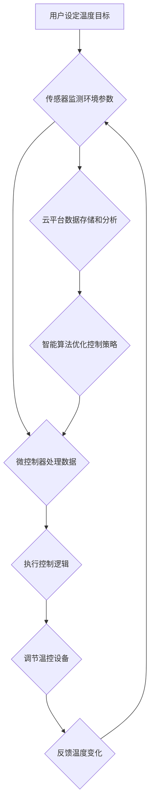

                 

## 智能家居项目：构建智能恒温器

> 关键词：智能家居、恒温器、物联网、机器学习、温度控制、传感器、云平台、Python

## 1. 背景介绍

智能家居已成为现代生活的重要组成部分，它通过将各种智能设备连接起来，实现对家居环境的自动化控制，提升生活品质和便利性。其中，智能恒温器作为智能家居的核心设备之一，能够根据用户需求和环境变化智能调节室内温度，节能环保、舒适便捷。

传统的恒温器通常采用机械或简单的电子控制，只能根据预设的温度进行开关控制，缺乏灵活性。而智能恒温器则通过传感器、网络连接和智能算法，能够实时监测室内温度、湿度等环境参数，并根据用户设定和环境变化智能调节温度，实现更加精准、高效的温度控制。

## 2. 核心概念与联系

### 2.1 智能恒温器架构

智能恒温器通常由以下核心组件组成：

* **传感器:** 用于实时监测室内温度、湿度、光照等环境参数。常见的传感器类型包括温度传感器、湿度传感器、光照传感器等。
* **微控制器:** 负责处理传感器数据、执行控制逻辑和与外部设备通信。
* **网络模块:** 用于连接智能恒温器到互联网或局域网，实现远程控制和数据传输。常见的网络协议包括 Wi-Fi、蓝牙、Zigbee 等。
* **用户界面:** 用于用户设置温度目标、查看实时环境参数和控制恒温器功能。常见的用户界面包括触摸屏、手机APP、语音助手等。
* **云平台:** 用于存储用户数据、提供远程控制功能和进行智能算法分析。

### 2.2  智能恒温器工作流程



## 3. 核心算法原理 & 具体操作步骤

### 3.1  算法原理概述

智能恒温器的核心算法主要包括温度预测、节能控制和用户行为学习等。

* **温度预测:** 利用历史温度数据、环境参数和天气预报等信息，预测未来室内温度变化趋势，以便提前调节温控设备，实现更精准的温度控制。
* **节能控制:** 根据用户设定、环境变化和温度预测结果，智能调节温控设备工作状态，避免过度加热或冷却，实现节能环保。
* **用户行为学习:** 通过分析用户历史操作记录和环境参数变化，学习用户温度偏好和行为模式，自动调整温度设定，提升用户体验。

### 3.2  算法步骤详解

**温度预测算法:**

1. **数据采集:** 收集历史室内温度数据、环境参数（如湿度、光照）和天气预报数据。
2. **数据预处理:** 对采集到的数据进行清洗、归一化和特征提取，以便于算法训练。
3. **模型选择:** 选择合适的机器学习模型，例如线性回归、支持向量机、神经网络等，进行温度预测。
4. **模型训练:** 利用训练数据训练选择的机器学习模型，并评估模型性能。
5. **预测温度:** 将最新的环境参数和天气预报数据输入训练好的模型，预测未来室内温度变化趋势。

**节能控制算法:**

1. **设定温度范围:** 根据用户设定，确定允许的室内温度范围。
2. **环境参数监测:** 实时监测室内温度、湿度、光照等环境参数。
3. **温度预测:** 利用温度预测算法预测未来室内温度变化趋势。
4. **控制策略决策:** 根据用户设定、环境参数和温度预测结果，制定控制策略，例如调节温控设备工作状态、设定定时开关等。
5. **执行控制:** 将控制策略执行到温控设备，实现节能控制。

**用户行为学习算法:**

1. **用户行为记录:** 记录用户历史操作记录，例如温度设定、开关控制、时间段使用等。
2. **环境参数记录:** 记录用户操作时的环境参数，例如室内温度、湿度、光照等。
3. **行为模式识别:** 利用机器学习算法分析用户行为记录和环境参数，识别用户温度偏好和行为模式。
4. **个性化控制:** 根据识别出的用户行为模式，自动调整温度设定，提供个性化控制体验。

### 3.3  算法优缺点

**温度预测算法:**

* **优点:** 可以提前预测温度变化，实现更精准的温度控制。
* **缺点:** 预测精度受数据质量和模型复杂度影响，存在一定的误差。

**节能控制算法:**

* **优点:** 可以根据环境变化和用户设定智能调节温控设备，实现节能环保。
* **缺点:** 需要考虑多种因素，算法设计较为复杂。

**用户行为学习算法:**

* **优点:** 可以根据用户习惯和偏好提供个性化控制体验。
* **缺点:** 需要收集和分析大量用户数据，存在隐私安全问题。

### 3.4  算法应用领域

智能恒温器的核心算法在智能家居、建筑自动化、能源管理等领域都有广泛的应用。

* **智能家居:** 提高家居舒适度和能源效率。
* **建筑自动化:** 控制建筑内温度、湿度等环境参数，实现节能环保和舒适宜居。
* **能源管理:** 优化能源消耗，降低能源成本。

## 4. 数学模型和公式 & 详细讲解 & 举例说明

### 4.1  数学模型构建

温度预测模型可以采用线性回归模型，其数学表达式如下：

$$T(t) = a + b \cdot t$$

其中：

* $T(t)$ 表示时间 $t$ 时刻的预测温度。
* $a$ 和 $b$ 是模型参数，需要通过训练数据进行估计。
* $t$ 是时间变量，可以是小时、天等单位。

### 4.2  公式推导过程

线性回归模型的目标是找到最佳的 $a$ 和 $b$ 参数，使得预测温度与实际温度之间的误差最小。可以使用最小二乘法来求解 $a$ 和 $b$ 参数。

最小二乘法的目标函数为：

$$J(a, b) = \sum_{i=1}^{n} (T_i - (a + b \cdot t_i))^2$$

其中：

* $n$ 是训练数据点的数量。
* $T_i$ 是第 $i$ 个数据点的实际温度。
* $t_i$ 是第 $i$ 个数据点的对应时间。

通过求解 $J(a, b)$ 的最小值，可以得到最佳的 $a$ 和 $b$ 参数。

### 4.3  案例分析与讲解

假设我们有以下训练数据：

| 时间 (小时) | 实际温度 (°C) |
|---|---|
| 8 | 20 |
| 9 | 22 |
| 10 | 24 |
| 11 | 25 |
| 12 | 26 |

我们可以使用最小二乘法求解线性回归模型的参数 $a$ 和 $b$，并得到预测温度公式：

$$T(t) = 18 + 1.2 \cdot t$$

其中 $t$ 表示时间 (小时)。

## 5. 项目实践：代码实例和详细解释说明

### 5.1  开发环境搭建

* **操作系统:** Linux、macOS 或 Windows
* **编程语言:** Python
* **开发工具:** PyCharm、VS Code 等
* **硬件:** 智能恒温器开发板、传感器、网络模块

### 5.2  源代码详细实现

```python
# 温度预测模型
import numpy as np
from sklearn.linear_model import LinearRegression

# 训练数据
time = np.array([8, 9, 10, 11, 12])
temperature = np.array([20, 22, 24, 25, 26])

# 创建线性回归模型
model = LinearRegression()

# 训练模型
model.fit(time.reshape(-1, 1), temperature)

# 预测未来温度
future_time = np.array([13, 14, 15])
predicted_temperature = model.predict(future_time.reshape(-1, 1))

# 打印预测结果
print("预测温度:", predicted_temperature)

# 节能控制逻辑
# ...

# 用户行为学习逻辑
# ...
```

### 5.3  代码解读与分析

* **数据准备:** 首先需要准备训练数据，包括时间和温度信息。
* **模型选择:** 选择合适的机器学习模型，例如线性回归模型。
* **模型训练:** 利用训练数据训练模型，并评估模型性能。
* **预测温度:** 将最新的时间数据输入训练好的模型，预测未来温度。
* **节能控制逻辑:** 根据预测温度和用户设定，制定节能控制策略。
* **用户行为学习逻辑:** 分析用户操作记录和环境参数，学习用户行为模式。

### 5.4  运行结果展示

运行代码后，可以得到未来温度的预测结果。根据预测结果和节能控制逻辑，智能恒温器可以自动调节温控设备，实现节能环保。

## 6. 实际应用场景

智能恒温器在以下场景中具有广泛的应用：

* **家庭住宅:** 智能调节室内温度，提升居住舒适度和节能效果。
* **办公楼:** 控制办公室温度，提高工作效率和降低能源消耗。
* **酒店:** 提供个性化温度控制服务，提升入住体验。
* **医院:** 保持病房温度稳定，有利于患者康复。

### 6.4  未来应用展望

未来，智能恒温器将更加智能化、个性化和集成化。

* **更精准的温度预测:** 利用更先进的机器学习算法和传感器技术，实现更精准的温度预测。
* **更个性化的控制体验:** 通过用户行为学习和语音控制等技术，提供更个性化的温度控制体验。
* **更广泛的应用场景:** 智能恒温器将应用于更多场景，例如农业、工业等。

## 7. 工具和资源推荐

### 7.1  学习资源推荐

* **书籍:**
    * 《Python机器学习实战》
    * 《深度学习》
* **在线课程:**
    * Coursera: Machine Learning
    * edX: Artificial Intelligence

### 7.2  开发工具推荐

* **编程语言:** Python
* **开发环境:** PyCharm、VS Code
* **传感器:** DHT11、BMP180
* **网络模块:** ESP8266、ESP32

### 7.3  相关论文推荐

* **温度预测:**
    * "A Deep Learning Approach for Indoor Temperature Prediction"
    * "Predicting Indoor Temperature Using Machine Learning"
* **节能控制:**
    * "Smart Thermostat Control for Energy Efficiency"
    * "A Fuzzy Logic Based Approach for Smart Thermostat Control"

## 8. 总结：未来发展趋势与挑战

### 8.1  研究成果总结

智能恒温器技术取得了显著进展，能够实现精准的温度控制、节能环保和个性化体验。

### 8.2  未来发展趋势

未来，智能恒温器将朝着更智能化、个性化和集成化的方向发展。

* **更精准的温度预测:** 利用更先进的机器学习算法和传感器技术，实现更精准的温度预测。
* **更个性化的控制体验:** 通过用户行为学习和语音控制等技术，提供更个性化的温度控制体验。
* **更广泛的应用场景:** 智能恒温器将应用于更多场景，例如农业、工业等。

### 8.3  面临的挑战

* **数据安全和隐私保护:** 智能恒温器需要收集和存储大量用户数据，需要加强数据安全和隐私保护措施。
* **算法鲁棒性和可靠性:** 智能恒温器的算法需要能够应对各种环境变化和用户行为，提高算法的鲁棒性和可靠性。
* **成本控制:** 智能恒温器的成本相对较高，需要进一步降低成本，使其更普及。

### 8.4  研究展望

未来，我们将继续研究智能恒温器技术，探索更先进的算法、更智能的控制策略和更广泛的应用场景，为用户提供更舒适、更便捷、更环保的智能家居体验。

## 9. 附录：常见问题与解答

* **Q: 智能恒温器如何连接到互联网？**

* **A:** 智能恒温器通常通过 Wi-Fi、蓝牙或 Zigbee 等网络协议连接到互联网。

* **Q: 如何设置智能恒温器的温度目标？**

* **A:** 可以通过智能恒温器的触摸屏、手机APP或语音助手设置温度目标。

* **Q: 智能恒温器如何节能？**

* **A:** 智能恒温器通过智能算法和控制策略，根据用户设定和环境变化，智能调节温控设备工作状态，避免过度加热或冷却，实现节能环保。


作者：禅与计算机程序设计艺术 / Zen and the Art of Computer Programming 
<end_of_turn>

