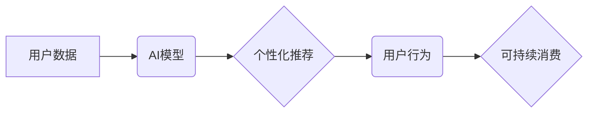

                 

## 欲望生态系统管理员：AI驱动的可持续消费指导

> 关键词：人工智能、可持续消费、欲望生态系统、个性化推荐、算法优化、数据驱动、伦理考量

## 1. 背景介绍

在当今信息爆炸的时代，消费主义已经深入人心，人们对物质的追求日益膨胀。然而，过度消费带来的环境污染、资源枯竭和社会不平等问题日益突出。可持续消费，即以节约资源、减少浪费、保护环境为目标的消费模式，成为解决这些问题的关键。

人工智能（AI）作为一种强大的技术工具，在可持续消费领域展现出巨大的潜力。通过分析用户行为、需求和偏好，AI可以帮助人们做出更明智的消费决策，引导他们 towards 更可持续的生活方式。

## 2. 核心概念与联系

**2.1 欲望生态系统**

欲望生态系统是指由个体、社会文化、经济结构和技术环境等因素共同构成的复杂网络，它影响着人们的欲望产生、表达和满足。在这个生态系统中，广告、社交媒体、消费文化等因素不断刺激人们的欲望，推动着消费行为的持续增长。

**2.2 AI驱动的可持续消费指导**

AI驱动的可持续消费指导是指利用人工智能技术，分析用户数据，提供个性化建议，引导用户做出更可持续的消费决策。

**2.3 架构图**



## 3. 核心算法原理 & 具体操作步骤

**3.1 算法原理概述**

AI驱动的可持续消费指导主要依赖于以下核心算法：

* **机器学习算法**: 用于分析用户数据，识别消费模式和偏好。
* **推荐算法**: 根据用户数据和可持续性指标，推荐符合用户需求和环保理念的产品或服务。
* **优化算法**: 优化推荐结果，提高推荐准确性和用户满意度。

**3.2 算法步骤详解**

1. **数据收集**: 收集用户消费行为数据、环境影响数据、产品信息等。
2. **数据预处理**: 清洗、转换和格式化数据，使其适合算法训练。
3. **模型训练**: 利用机器学习算法训练模型，识别用户消费模式和偏好。
4. **推荐生成**: 根据用户数据和可持续性指标，利用推荐算法生成个性化推荐结果。
5. **结果优化**: 利用优化算法优化推荐结果，提高推荐准确性和用户满意度。
6. **反馈收集**: 收集用户反馈，不断改进模型和推荐算法。

**3.3 算法优缺点**

* **优点**:

    * **个性化**: 根据用户数据提供个性化推荐，提高用户体验。
    * **数据驱动**: 基于数据分析，提供更准确和有效的建议。
    * **可持续性**: 引导用户做出更环保和可持续的消费决策。

* **缺点**:

    * **数据隐私**: 需要收集和处理大量用户数据，需注意数据隐私保护。
    * **算法偏见**: 算法可能存在偏见，导致推荐结果不公平。
    * **技术复杂性**: 需要专业的技术人员进行开发和维护。

**3.4 算法应用领域**

* **电商平台**: 提供个性化推荐，引导用户购买环保产品。
* **社交媒体**: 推广可持续消费理念，分享环保生活方式。
* **政府部门**: 制定可持续消费政策，引导公众行为。

## 4. 数学模型和公式 & 详细讲解 & 举例说明

**4.1 数学模型构建**

可持续消费指导系统可以构建一个数学模型，将用户需求、产品信息和环境影响等因素综合考虑。

**4.2 公式推导过程**

假设：

* $u_i$ 表示用户 $i$ 的需求向量。
* $p_j$ 表示产品 $j$ 的特征向量。
* $e_k$ 表示产品 $k$ 的环境影响向量。
* $w_i$ 表示用户 $i$ 对不同特征的权重向量。
* $v_j$ 表示产品 $j$ 的可持续性得分。

则可持续消费推荐模型可以定义为：

$$v_j = \sum_{i=1}^{n} w_i \cdot u_i \cdot p_j - \sum_{k=1}^{m} e_k \cdot p_j$$

其中：

* $n$ 是用户数量。
* $m$ 是环境影响指标数量。

**4.3 案例分析与讲解**

例如，用户 $A$ 需求向量为 $(衣物, 食物, 交通)$, 产品 $B$ 的特征向量为 $(舒适, 健康, 低碳)$, 环境影响向量为 $(碳排放, 水资源消耗)。

则用户 $A$ 对产品 $B$ 的可持续性得分可以计算为：

$$v_B = w_A(舒适) \cdot u_A(衣物) \cdot p_B(舒适) + w_A(健康) \cdot u_A(食物) \cdot p_B(健康) + w_A(低碳) \cdot u_A(交通) \cdot p_B(低碳) - w_A(碳排放) \cdot e_B(碳排放) - w_A(水资源消耗) \cdot e_B(水资源消耗)$$

## 5. 项目实践：代码实例和详细解释说明

**5.1 开发环境搭建**

* Python 3.7+
* TensorFlow 2.0+
* PyTorch 1.0+
* Jupyter Notebook

**5.2 源代码详细实现**

```python
import tensorflow as tf

# 定义用户需求向量
user_demand = tf.constant([[1, 0, 1], [0, 1, 1]])

# 定义产品特征向量
product_features = tf.constant([[0.8, 0.5, 0.2], [0.6, 0.7, 0.3]])

# 定义环境影响向量
environmental_impact = tf.constant([[0.1, 0.2], [0.3, 0.1]])

# 定义用户权重向量
user_weights = tf.constant([[0.6, 0.3, 0.1], [0.4, 0.5, 0.1]])

# 计算可持续性得分
sustainability_score = tf.reduce_sum(user_weights * user_demand * product_features, axis=1) - tf.reduce_sum(user_weights * environmental_impact, axis=1)

# 打印结果
print(sustainability_score)
```

**5.3 代码解读与分析**

* 代码首先定义了用户需求向量、产品特征向量、环境影响向量和用户权重向量。
* 然后，利用 TensorFlow 库计算可持续性得分。
* 最后，打印可持续性得分。

**5.4 运行结果展示**

运行结果将显示每个产品的可持续性得分，可以根据得分进行排序，推荐可持续性更高的产品。

## 6. 实际应用场景

**6.1 电商平台**

电商平台可以利用 AI驱动的可持续消费指导系统，为用户提供个性化推荐，引导用户购买环保产品。例如，用户在搜索“衣服”时，系统可以根据用户的需求、偏好和环境影响，推荐可持续服装品牌或产品。

**6.2 社交媒体**

社交媒体平台可以利用 AI技术，推广可持续消费理念，分享环保生活方式。例如，平台可以根据用户的兴趣爱好，推荐环保相关的文章、视频和活动。

**6.3 政府部门**

政府部门可以利用 AI技术，制定可持续消费政策，引导公众行为。例如，政府可以利用 AI分析消费数据，识别可持续消费趋势，制定相应的政策措施。

**6.4 未来应用展望**

未来，AI驱动的可持续消费指导系统将更加智能化、个性化和高效化。例如，系统可以利用传感器数据，实时监测用户的消费行为，提供更精准的建议。

## 7. 工具和资源推荐

**7.1 学习资源推荐**

* **书籍**:

    * 《人工智能：一种现代方法》
    * 《深度学习》

* **在线课程**:

    * Coursera: 人工智能
    * edX: 深度学习

**7.2 开发工具推荐**

* **Python**: 广泛应用于 AI开发，拥有丰富的库和框架。
* **TensorFlow**: 开源深度学习框架，支持多种硬件平台。
* **PyTorch**: 开源深度学习框架，以其灵活性和易用性而闻名。

**7.3 相关论文推荐**

* **推荐系统**:

    * 《Collaborative Filtering for Implicit Feedback Datasets》
    * 《Matrix Factorization Techniques for Recommender Systems》

* **可持续消费**:

    * 《Towards Sustainable Consumption: A Review of Consumer Behavior and Marketing Strategies》
    * 《The Role of Artificial Intelligence in Promoting Sustainable Consumption》

## 8. 总结：未来发展趋势与挑战

**8.1 研究成果总结**

AI驱动的可持续消费指导系统已经取得了一定的成果，能够为用户提供个性化推荐，引导用户做出更环保的消费决策。

**8.2 未来发展趋势**

* **更精准的推荐**: 利用更丰富的用户数据和更先进的算法，提供更精准的推荐。
* **更个性化的体验**: 根据用户的个性化需求和偏好，提供更个性化的体验。
* **更广泛的应用**: 将 AI技术应用于更多领域，促进可持续消费的普及。

**8.3 面临的挑战**

* **数据隐私**: 需要确保用户数据的安全和隐私。
* **算法偏见**: 需要避免算法产生偏见，确保推荐结果公平公正。
* **技术复杂性**: 需要不断提升技术水平，开发更先进的算法和模型。

**8.4 研究展望**

未来，AI驱动的可持续消费指导系统将朝着更智能化、个性化和高效化的方向发展，为构建更加可持续的社会贡献力量。

## 9. 附录：常见问题与解答

**9.1 如何保证数据隐私？**

* 使用加密技术保护用户数据。
*  anonymize 用户数据，去除个人识别信息。
* 获得用户明确的同意，才能收集和使用他们的数据。

**9.2 如何避免算法偏见？**

* 使用多样化的训练数据，避免算法过度依赖特定群体的数据。
* 定期评估算法的公平性，及时发现和解决偏见问题。
* 邀请来自不同背景的人参与算法开发和测试。

**9.3 如何提高算法的准确性？**

* 收集更丰富、更准确的用户数据。
* 使用更先进的算法模型，例如深度学习。
* 定期评估算法的性能，并根据反馈进行改进。


作者：禅与计算机程序设计艺术 / Zen and the Art of Computer Programming 
<end_of_turn>

