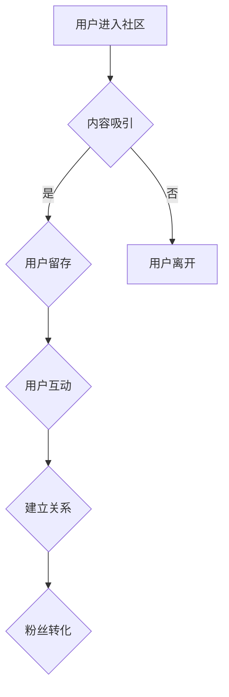

                 

##  注意力经济与在线社区建设策略：吸引并留住忠实的粉丝和受众

> 关键词：注意力经济、在线社区、粉丝运营、用户粘性、内容策略、社区建设、互动机制、数据分析

### 1. 背景介绍

在当今数字时代，信息爆炸和竞争日益激烈，人们的注意力成为稀缺资源。这被称为“注意力经济”，其核心是争夺用户有限的注意力，并将其转化为商业价值。在线社区作为信息传播和用户互动的重要平台，在注意力经济中扮演着越来越重要的角色。

然而，吸引和留住用户注意力并非易事。在线社区需要制定有效的策略，才能在海量信息中脱颖而出，并建立忠实的粉丝群体。

### 2. 核心概念与联系

#### 2.1 注意力经济

注意力经济是指在信息过载的时代，人们的注意力成为最宝贵的资源。企业和平台需要通过提供有价值、吸引人的内容和服务，来获取用户的注意力，并将其转化为商业价值。

#### 2.2 在线社区

在线社区是指基于互联网平台，由共享兴趣、目标或身份的用户组成的虚拟空间。它提供了一个平台，让用户可以交流、分享、协作和互动。

#### 2.3 用户粘性

用户粘性是指用户对平台的依赖程度和重复使用频率。高粘性的在线社区能够有效地留住用户，并将其转化为长期价值。

#### 2.4  粉丝运营

粉丝运营是指通过内容创作、互动交流、社区建设等方式，建立和维护与用户之间的关系，并将其转化为忠实的粉丝。

**Mermaid 流程图**



### 3. 核心算法原理 & 具体操作步骤

#### 3.1 算法原理概述

在线社区建设的核心算法原理在于用户行为分析和个性化推荐。通过分析用户的兴趣、行为模式和社交关系，算法可以推荐更符合用户需求的内容和服务，从而提高用户粘性和粉丝转化率。

#### 3.2 算法步骤详解

1. **数据收集:** 收集用户行为数据，包括浏览记录、点赞、评论、分享等。
2. **数据清洗:** 对收集到的数据进行清洗和处理，去除无效数据和噪声。
3. **特征提取:** 从用户行为数据中提取特征，例如用户兴趣、偏好、社交关系等。
4. **模型训练:** 利用机器学习算法，训练用户行为预测模型。
5. **个性化推荐:** 根据用户的特征和行为模式，推荐个性化的内容和服务。
6. **效果评估:** 评估推荐算法的性能，并不断优化模型参数。

#### 3.3 算法优缺点

**优点:**

* **提高用户粘性:** 通过个性化推荐，满足用户的需求，提高用户留存率。
* **提升粉丝转化率:** 通过精准推荐，吸引目标用户，提高粉丝转化率。
* **数据驱动决策:** 基于数据分析，制定更有效的社区运营策略。

**缺点:**

* **数据隐私问题:** 收集和使用用户数据需要谨慎处理，确保用户隐私安全。
* **算法偏差:** 算法模型可能存在偏差，导致推荐结果不准确。
* **技术门槛高:** 需要专业的技术人员进行算法开发和维护。

#### 3.4 算法应用领域

* **内容推荐:** 推荐新闻、视频、文章等内容。
* **社交推荐:** 推荐朋友、群组、活动等社交资源。
* **电商推荐:** 推荐商品、服务、优惠券等。
* **游戏推荐:** 推荐游戏、道具、活动等。

### 4. 数学模型和公式 & 详细讲解 & 举例说明

#### 4.1 数学模型构建

用户行为预测模型通常采用基于概率的模型，例如贝叶斯网络、马尔科夫链等。这些模型可以根据用户的历史行为数据，预测用户未来行为的概率。

#### 4.2 公式推导过程

例如，使用贝叶斯网络预测用户是否会点击广告，可以根据以下公式推导：

$$P(Click|User, Ad) = \frac{P(User|Click)P(Ad|Click)P(Click)}{P(User)P(Ad)}$$

其中：

* $P(Click|User, Ad)$: 用户点击广告的概率，给定用户和广告信息。
* $P(User|Click)$: 用户点击广告的条件概率，给定用户信息。
* $P(Ad|Click)$: 广告被点击的条件概率，给定广告信息。
* $P(Click)$: 广告被点击的概率。
* $P(User)$: 用户出现的概率。
* $P(Ad)$: 广告出现的概率。

#### 4.3 案例分析与讲解

假设我们有一个在线社区，用户可以浏览文章、点赞、评论和分享。我们可以使用贝叶斯网络模型，预测用户是否会点赞某个文章。

我们可以收集用户历史行为数据，例如用户浏览过的文章、点赞过的文章、评论过的文章等。然后，我们可以根据这些数据，训练贝叶斯网络模型，并计算出用户点赞某个文章的概率。

例如，如果用户之前点赞过类似的文章，那么该用户点赞当前文章的概率会更高。

### 5. 项目实践：代码实例和详细解释说明

#### 5.1 开发环境搭建

* **操作系统:** Linux/macOS/Windows
* **编程语言:** Python
* **框架:** Flask/Django
* **数据库:** MySQL/PostgreSQL
* **工具:** Git、Docker

#### 5.2 源代码详细实现

```python
# 使用 Flask 框架构建简单的在线社区

from flask import Flask, render_template, request

app = Flask(__name__)

# 模拟用户数据
users = {
    1: {'name': '张三', 'interests': ['编程', '游戏']},
    2: {'name': '李四', 'interests': ['音乐', '电影']},
}

# 模拟文章数据
articles = [
    {'id': 1, 'title': 'Python 入门指南', 'author': 1, 'content': '这是一篇关于 Python 入门的文章'},
    {'id': 2, 'title': '游戏开发技巧', 'author': 1, 'content': '这是一篇关于游戏开发技巧的文章'},
    {'id': 3, 'title': '音乐推荐', 'author': 2, 'content': '这是一篇关于音乐推荐的文章'},
]

@app.route('/')
def index():
    return render_template('index.html', articles=articles)

@app.route('/user/<int:user_id>')
def user_profile(user_id):
    user = users.get(user_id)
    return render_template('user_profile.html', user=user)

if __name__ == '__main__':
    app.run(debug=True)
```

#### 5.3 代码解读与分析

* **Flask 框架:** 使用 Flask 框架构建简单的 Web 应用。
* **用户数据和文章数据:** 模拟用户数据和文章数据，方便演示。
* **路由:** 定义路由规则，例如 `/` 路由指向首页，`/user/<int:user_id>` 路由指向用户个人资料页面。
* **模板:** 使用 HTML 模板渲染页面内容。

#### 5.4 运行结果展示

运行代码后，可以访问 http://127.0.0.1:5000/，查看简单的在线社区首页。

### 6. 实际应用场景

#### 6.1 社区运营

在线社区可以用于运营粉丝群体，例如：

* **内容发布:** 发布有价值的内容，吸引用户关注。
* **互动交流:** 组织讨论、问答、投票等活动，促进用户互动。
* **社区管理:** 建立社区规则，维护社区秩序。

#### 6.2 商业推广

在线社区可以用于推广产品和服务，例如：

* **产品展示:** 展示产品功能和优势，吸引用户购买。
* **用户反馈:** 收集用户反馈，改进产品和服务。
* **营销活动:** 组织促销活动，吸引用户参与。

#### 6.3 学习交流

在线社区可以用于学习和交流，例如：

* **知识分享:** 分享学习经验和知识，帮助用户学习成长。
* **技术讨论:** 讨论技术问题，解决用户难题。
* **项目合作:** 组织项目合作，促进用户交流和协作。

#### 6.4 未来应用展望

随着人工智能技术的不断发展，在线社区将更加智能化、个性化和互动化。例如：

* **智能内容推荐:** 基于用户行为数据，推荐更符合用户需求的内容。
* **个性化社区体验:** 根据用户的兴趣和偏好，定制个性化的社区体验。
* **虚拟现实社区:** 利用虚拟现实技术，构建沉浸式的虚拟社区体验。

### 7. 工具和资源推荐

#### 7.1 学习资源推荐

* **书籍:**
    * 《注意力经济》
    * 《社区运营实战》
    * 《Python Web 开发》
* **在线课程:**
    * Coursera: 数据科学、机器学习
    * Udemy: Python 开发、Flask 框架
* **博客:**
    * Hacker News
    * Medium

#### 7.2 开发工具推荐

* **编程语言:** Python
* **框架:** Flask、Django
* **数据库:** MySQL、PostgreSQL
* **工具:** Git、Docker

#### 7.3 相关论文推荐

* **用户行为分析:**
    * "A Survey of User Behavior Modeling in Online Communities"
    * "Understanding User Behavior in Online Social Networks"
* **内容推荐:**
    * "Collaborative Filtering for Recommender Systems"
    * "Content-Based Recommendation Systems"
* **社区运营:**
    * "Community Building: A Guide for Online Communities"
    * "The Art of Community Management"

### 8. 总结：未来发展趋势与挑战

#### 8.1 研究成果总结

注意力经济与在线社区建设策略的研究取得了显著成果，例如：

* **用户行为分析模型:** 能够有效地预测用户行为，为社区运营提供数据支持。
* **个性化推荐算法:** 能够推荐更符合用户需求的内容，提高用户粘性和粉丝转化率。
* **社区运营策略:** 能够有效地运营粉丝群体，促进用户互动和社区发展。

#### 8.2 未来发展趋势

未来，在线社区将朝着以下方向发展：

* **更智能化:** 利用人工智能技术，实现更智能的社区运营和用户体验。
* **更个性化:** 根据用户的兴趣和偏好，定制个性化的社区体验。
* **更沉浸式:** 利用虚拟现实技术，构建沉浸式的虚拟社区体验。

#### 8.3 面临的挑战

在线社区建设也面临着一些挑战：

* **数据隐私问题:** 如何保护用户数据隐私，是社区运营的一大挑战。
* **算法偏差:** 算法模型可能存在偏差，导致推荐结果不准确。
* **内容质量问题:** 如何保证社区内容的质量和真实性，也是一个重要问题。

#### 8.4 研究展望

未来，需要进一步研究以下问题：

* 如何开发更安全、更可靠的用户行为分析模型。
* 如何解决算法偏差问题，提高推荐结果的准确性。
* 如何构建更有效的社区治理机制，保证社区秩序和内容质量。


### 9. 附录：常见问题与解答

#### 9.1 如何提高用户粘性？

* 提供有价值的内容，满足用户的需求。
* 鼓励用户互动，建立社区氛围。
* 个性化推荐，提高用户体验。

#### 9.2 如何吸引新用户？

* 推广社区，扩大影响力。
* 举办活动，吸引用户参与。
* 提供优惠活动，吸引用户注册。

#### 9.3 如何维护社区秩序？

* 建立社区规则，明确用户行为规范。
* 积极管理社区，及时处理问题。
* 鼓励用户举报违规行为。


作者：禅与计算机程序设计艺术 / Zen and the Art of Computer Programming 
<end_of_turn>

