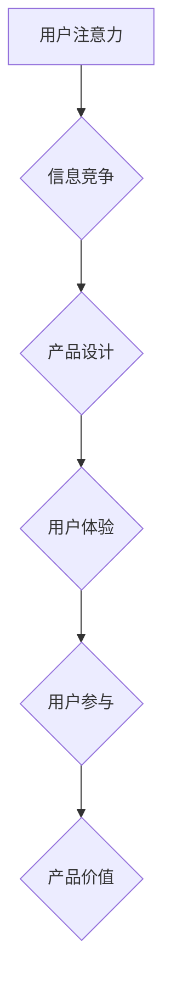

                 

## 1. 背景介绍

在当今信息爆炸的时代，用户面临着来自各方信息的冲击，注意力已成为稀缺的资源。如何有效地抓住用户的注意力，并将其转化为持续的参与和价值，成为产品设计和开发的关键挑战。

注意力经济的概念源于心理学家和经济学家对人类认知和行为的研究。它指出，人们的注意力是有限的，并且会随着信息量的增加而逐渐稀缺。因此，为了在竞争激烈的市场中脱颖而出，产品需要能够有效地吸引和保持用户的注意力，并提供令人沉浸的体验。

用户体验 (UX) 优化一直是产品设计的重要议题，而注意力经济的兴起进一步强调了其重要性。UX 优化旨在通过设计和开发用户友好的产品，提升用户的使用体验，从而提高用户满意度、忠诚度和转化率。

## 2. 核心概念与联系

### 2.1 注意力经济

注意力经济的核心概念是，注意力是人类最宝贵的资源之一，而信息时代，注意力资源变得越来越稀缺。

**注意力经济的本质：**

* **注意力是有限的：** 人类大脑只能同时处理有限的信息量，因此注意力是有限的。
* **注意力是可竞争的：** 各种信息和平台都在争夺用户的注意力，竞争激烈。
* **注意力可以被购买：** 通过提供有价值的内容和服务，可以吸引用户的注意力。

**注意力经济的应用场景：**

* **产品设计：** 设计能够吸引和保持用户注意力的产品界面和功能。
* **内容营销：** 创建能够吸引用户阅读和分享的内容。
* **广告投放：** 针对特定用户群体投放精准广告，提高广告转化率。

### 2.2 用户体验优化

用户体验优化 (UX) 旨在通过设计和开发用户友好的产品，提升用户的使用体验，从而提高用户满意度、忠诚度和转化率。

**用户体验优化的核心要素：**

* **易用性：** 产品易于理解和使用。
* **可用性：** 产品能够满足用户需求。
* **愉悦性：** 使用产品能够带来愉悦感。
* **效率：** 产品能够帮助用户快速完成任务。

**用户体验优化的目标：**

* **提高用户满意度：** 用户对产品的满意度越高，越有可能成为忠实用户。
* **提高用户忠诚度：** 用户对产品的忠诚度越高，越有可能重复购买和推荐产品。
* **提高转化率：** 用户对产品的转化率越高，越有可能产生商业价值。

### 2.3 注意力经济与用户体验优化的联系

注意力经济与用户体验优化是相互关联的两个概念。

* **注意力经济为用户体验优化提供了理论基础：** 了解用户注意力是如何被分配和消耗的，可以帮助设计师和开发人员更好地设计和开发能够吸引和保持用户注意力的产品。
* **用户体验优化是实现注意力经济的关键：** 通过提供令人沉浸的体验，产品可以有效地抓住用户的注意力，并将其转化为持续的参与和价值。

**Mermaid 流程图：**



## 3. 核心算法原理 & 具体操作步骤

### 3.1 算法原理概述

注意力机制是一种模仿人类注意力机制的算法，它能够帮助模型专注于输入数据中最重要的部分，从而提高模型的性能。

注意力机制的核心思想是，在处理输入数据时，模型会为每个数据元素分配一个权重，权重高的数据元素会被模型更加关注。

### 3.2 算法步骤详解

1. **计算注意力权重：** 对于每个输入数据元素，模型会计算一个注意力权重，该权重表示该数据元素的重要性。
2. **加权求和：** 将注意力权重与输入数据元素相乘，然后对所有数据元素进行加权求和，得到一个新的表示。
3. **输出结果：** 使用新的表示作为模型的输入，进行后续的处理。

### 3.3 算法优缺点

**优点：**

* **能够提高模型的性能：** 通过关注输入数据中最重要的部分，注意力机制能够帮助模型更好地理解数据，从而提高模型的性能。
* **能够解释模型的决策过程：** 注意力权重可以反映模型对输入数据元素的关注程度，从而帮助我们理解模型的决策过程。

**缺点：**

* **计算复杂度较高：** 计算注意力权重需要进行大量的计算，因此注意力机制的计算复杂度较高。
* **参数量较多：** 注意力机制需要学习大量的参数，因此模型的规模较大。

### 3.4 算法应用领域

注意力机制在许多领域都有广泛的应用，例如：

* **自然语言处理：** 机器翻译、文本摘要、问答系统等。
* **计算机视觉：** 图像识别、目标检测、图像分割等。
* **语音识别：** 语音转文本、语音合成等。

## 4. 数学模型和公式 & 详细讲解 & 举例说明

### 4.1 数学模型构建

注意力机制的数学模型可以概括为以下公式：

$$
\text{Attention}(Q, K, V) = \text{softmax}\left(\frac{Q K^T}{\sqrt{d_k}}\right) V
$$

其中：

* $Q$：查询矩阵
* $K$：键矩阵
* $V$：值矩阵
* $d_k$：键向量的维度
* $\text{softmax}$：softmax 函数

### 4.2 公式推导过程

1. **计算注意力权重：**

$$
\text{score}(Q, K) = \frac{Q K^T}{\sqrt{d_k}}
$$

该公式计算查询向量 $Q$ 与每个键向量 $K$ 的点积，然后除以键向量的维度开根号。

2. **应用 softmax 函数：**

$$
\text{attention}(Q, K) = \text{softmax}(\text{score}(Q, K))
$$

softmax 函数将注意力权重归一化，使其总和为 1。

3. **加权求和：**

$$
\text{Attention}(Q, K, V) = \text{attention}(Q, K) V
$$

将注意力权重与值矩阵 $V$ 相乘，得到加权求和结果。

### 4.3 案例分析与讲解

假设我们有一个句子 "我爱吃苹果"，我们想使用注意力机制来找出句子中最重要的词语。

1. 将句子中的每个词语转换为向量表示。
2. 将查询向量 $Q$ 设置为句子中的某个词语的向量表示。
3. 将键向量 $K$ 和值向量 $V$ 设置为句子的所有词语的向量表示。
4. 计算注意力权重，并将注意力权重最高的词语作为句子的重点词语。

## 5. 项目实践：代码实例和详细解释说明

### 5.1 开发环境搭建

* Python 3.x
* TensorFlow 或 PyTorch

### 5.2 源代码详细实现

```python
import tensorflow as tf

# 定义注意力机制
def attention_layer(query, key, value, mask=None):
    # 计算注意力权重
    scores = tf.matmul(query, key, transpose_b=True) / tf.math.sqrt(tf.cast(key.shape[-1], tf.float32))
    if mask is not None:
        scores += (mask * -1e9)
    # 应用 softmax 函数
    attention_weights = tf.nn.softmax(scores, axis=-1)
    # 加权求和
    context_vector = tf.matmul(attention_weights, value)
    return context_vector, attention_weights

# 示例代码
query = tf.random.normal([1, 5, 64])
key = tf.random.normal([1, 10, 64])
value = tf.random.normal([1, 10, 128])

context_vector, attention_weights = attention_layer(query, key, value)
print(context_vector.shape)
print(attention_weights.shape)
```

### 5.3 代码解读与分析

* `attention_layer` 函数定义了注意力机制的实现。
* `scores` 计算查询向量与每个键向量的点积，并进行归一化。
* `attention_weights` 应用 softmax 函数将注意力权重归一化。
* `context_vector` 通过加权求和得到新的表示。

### 5.4 运行结果展示

运行代码后，会输出 `context_vector` 和 `attention_weights` 的形状。

## 6. 实际应用场景

### 6.1 产品推荐系统

注意力机制可以用于个性化推荐产品，通过关注用户历史行为和偏好，推荐更符合用户需求的产品。

### 6.2 内容摘要

注意力机制可以用于自动生成文本摘要，通过关注文本中最重要的部分，生成简洁准确的摘要。

### 6.3 机器翻译

注意力机制可以用于机器翻译，通过关注源语言文本中与目标语言文本相关的部分，提高翻译质量。

### 6.4 未来应用展望

注意力机制在未来将有更广泛的应用，例如：

* **医疗诊断：** 帮助医生更快、更准确地诊断疾病。
* **金融风险管理：** 识别潜在的金融风险。
* **自动驾驶：** 帮助自动驾驶汽车更好地感知周围环境。

## 7. 工具和资源推荐

### 7.1 学习资源推荐

* **书籍：**
    * 《深度学习》
    * 《自然语言处理》
* **在线课程：**
    * Coursera
    * edX
* **博客和论坛：**
    * TensorFlow Blog
    * PyTorch Forum

### 7.2 开发工具推荐

* **TensorFlow:** 开源深度学习框架
* **PyTorch:** 开源深度学习框架
* **Keras:** 高级深度学习 API

### 7.3 相关论文推荐

* **Attention Is All You Need:** https://arxiv.org/abs/1706.03762
* **BERT: Pre-training of Deep Bidirectional Transformers for Language Understanding:** https://arxiv.org/abs/1810.04805

## 8. 总结：未来发展趋势与挑战

### 8.1 研究成果总结

注意力机制在近年来取得了显著的进展，并在许多领域取得了成功应用。

### 8.2 未来发展趋势

* **更有效的注意力机制：** 研究更有效的注意力机制，提高模型的性能和效率。
* **自适应注意力机制：** 研究能够根据不同任务和数据自动调整注意力的机制。
* **多模态注意力机制：** 研究能够处理多种模态数据的注意力机制，例如文本、图像、音频等。

### 8.3 面临的挑战

* **计算复杂度：** 注意力机制的计算复杂度较高，需要进一步优化。
* **参数量：** 注意力机制需要学习大量的参数，模型规模较大。
* **可解释性：** 注意力机制的决策过程难以解释，需要进一步研究可解释性方法。

### 8.4 研究展望

未来，注意力机制将继续是人工智能领域的重要研究方向，并将在更多领域得到应用。


## 9. 附录：常见问题与解答

**Q1：注意力机制的计算复杂度如何？**

A1：注意力机制的计算复杂度较高，主要取决于输入数据的规模和模型的复杂度。

**Q2：注意力机制的优势是什么？**

A2：注意力机制能够提高模型的性能，并能够解释模型的决策过程。

**Q3：注意力机制有哪些应用场景？**

A3：注意力机制在自然语言处理、计算机视觉、语音识别等领域都有广泛的应用。


作者：禅与计算机程序设计艺术 / Zen and the Art of Computer Programming 
<end_of_turn>

