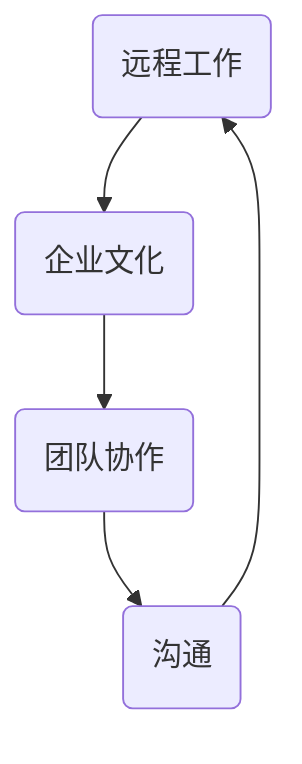
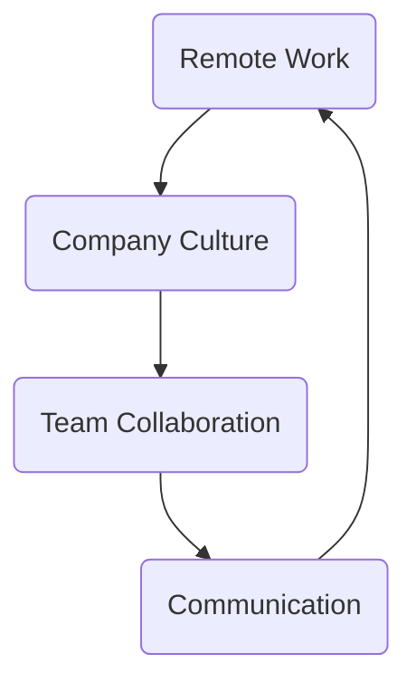

                 

### 背景介绍（Background Introduction）

在当今全球化的商业环境中，远程办公已经成为许多企业的标准运营模式。随着互联网技术的不断进步和云计算服务的普及，远程办公不再是一个罕见的选项，而是许多技术型创业公司实现高效运营的关键策略。然而，尽管远程办公带来了诸多便利，但也伴随着一系列挑战，尤其是在打造和维护高效的远程办公文化方面。

首先，远程办公文化不仅仅是关于员工在家中工作的便利性，它还涉及到如何建立和维护一种相互信任、沟通顺畅、团队合作的环境。在这种环境中，员工能够感到自己是团队的一部分，即便他们物理上分散在世界的不同角落。这要求企业家和领导者深入理解远程办公的独特需求，并采取适当的策略来促进这种文化的发展。

其次，远程办公文化的成功取决于多个因素，包括技术基础设施、工作流程、员工管理和企业文化的适应性。缺乏其中任何一个因素都可能影响远程团队的整体效率和企业业绩。

本文旨在探讨技术型创业者如何打造高效的远程办公文化，包括以下几个关键方面：

1. **理解远程办公的挑战**：分析远程办公面临的各种挑战，如沟通障碍、管理难度、员工士气和隐私问题。
2. **建立合适的远程办公基础设施**：讨论所需的技术工具和服务，以支持高效的远程工作环境。
3. **制定有效的远程工作流程**：介绍如何设计和管理远程工作流程，以确保项目按时完成并达到预期质量。
4. **管理远程团队**：探讨如何管理远程团队，包括领导力的转变、员工激励和团队协作。
5. **培养企业文化**：讨论如何维护和加强企业价值观，即使在远程环境中也能得到体现。
6. **未来趋势与挑战**：展望远程办公文化的未来发展趋势，并探讨可能面临的挑战。

通过上述探讨，我们将为技术型创业者提供一套完整的策略，帮助他们在远程办公环境中实现高效运营和团队文化的成功。

### Introduction to Remote Work Challenges

In today's global business environment, remote work has become a standard operating model for many companies. With the continuous advancement of internet technology and the widespread adoption of cloud computing services, remote work is no longer a rare option but a key strategy for many tech startups to achieve efficient operations. However, while remote work brings numerous benefits, it also comes with its own set of challenges, particularly in building and maintaining a high-efficiency remote work culture.

Firstly, remote work culture is not just about the convenience of employees working from home; it involves establishing and maintaining an environment of trust, smooth communication, and teamwork. In such an environment, employees should feel like they are part of the team, even if they are physically dispersed across different parts of the world. This requires entrepreneurs and leaders to have a deep understanding of the unique needs of remote work and to adopt appropriate strategies to foster this culture.

Secondly, the success of remote work culture depends on multiple factors, including technical infrastructure, workflow management, employee management, and the adaptability of company culture. Lack of any one of these factors can impact the overall efficiency of a remote team and the company's performance.

This article aims to explore how tech entrepreneurs can build a high-efficiency remote work culture, covering the following key aspects:

1. **Understanding the Challenges of Remote Work**: Analyzing the various challenges faced in remote work, such as communication barriers, management difficulties, employee morale, and privacy issues.
2. **Establishing the Right Remote Work Infrastructure**: Discussing the necessary tools and services to support an efficient remote working environment.
3. **Developing Effective Remote Workflows**: Introducing how to design and manage remote workflows to ensure projects are completed on time and meet expected quality.
4. **Managing a Remote Team**: Exploring how to manage a remote team, including shifts in leadership, employee motivation, and team collaboration.
5. **Cultivating Company Culture**: Discussing how to maintain and strengthen company values, even in a remote environment.
6. **Future Trends and Challenges**: Looking ahead at the future development trends and challenges of remote work culture.

Through these discussions, we will provide tech entrepreneurs with a comprehensive strategy to achieve efficient operations and team culture success in a remote work environment.

### 核心概念与联系（Core Concepts and Connections）

为了理解如何打造高效的远程办公文化，我们需要明确几个核心概念：远程工作、企业文化、团队协作和沟通。以下是这些概念之间的相互联系和重要性：

#### 远程工作（Remote Work）

远程工作指的是员工不在传统的办公场所，如公司办公室或工作地点，而是在其他地方（如家中、咖啡店或任何有互联网连接的地方）完成工作任务。远程工作允许员工拥有更大的灵活性和自主性，同时也为雇主提供了更广泛的招聘选择。远程工作的定义和形式多种多样，从完全远程工作到灵活的工作安排，都是企业管理层需要考虑的。

#### 企业文化（Company Culture）

企业文化是指企业在日常运营中体现的核心价值观、信念和行为规范。它影响着员工的工作态度、决策过程和团队合作方式。一个健康的企业文化能够促进员工之间的信任和尊重，提高工作效率和满意度。在远程办公环境中，企业文化的作用尤为重要，因为它能够帮助员工在缺乏面对面互动的情况下，仍然保持一致的工作目标和价值观。

#### 团队协作（Team Collaboration）

团队协作是高效远程办公文化的核心。它指的是团队成员之间通过沟通、协调和合作来完成共同任务的过程。在远程工作中，团队协作变得更加重要，因为缺乏面对面的交流可能导致沟通障碍和误解。有效的团队协作需要清晰的沟通渠道、共同的目标和透明的进度更新。

#### 沟通（Communication）

沟通是远程办公文化的生命线。它包括信息的传递、观点的交流、问题的解决和团队的协调。良好的沟通能够确保每个人都了解项目进展、目标变化和团队决策。远程沟通工具和平台的选用也至关重要，因为它们直接影响团队之间的互动频率和效率。

#### 核心概念之间的相互联系

远程工作、企业文化、团队协作和沟通之间存在着密切的相互联系。一个健康的企业文化能够促进良好的团队协作，而团队协作则需要有效的沟通来保持顺畅。同时，远程工作环境要求企业文化和团队协作更加注重透明度和开放性，以确保所有员工都感到被包括和参与。

下图展示了这些核心概念之间的相互关系：



通过理解和强化这些核心概念，技术型创业者可以打造一个高效的远程办公文化，从而在远程工作中实现卓越的团队协作和沟通。

### Core Concepts and Connections

To understand how to build a high-efficiency remote work culture, we need to clarify several core concepts: remote work, company culture, team collaboration, and communication. Here is how these concepts are interconnected and their significance:

#### Remote Work

Remote work refers to the situation where employees complete their tasks from locations other than traditional offices or workspaces, such as homes, coffee shops, or anywhere with an internet connection. Remote work provides employees with greater flexibility and autonomy while also giving employers a wider range of hiring options. There are various definitions and forms of remote work, from fully remote to flexible work arrangements, which are important considerations for management.

#### Company Culture

Company culture refers to the core values, beliefs, and behavioral norms that a company embodies in its day-to-day operations. It influences the work attitudes, decision-making processes, and teamwork among employees. A healthy company culture promotes trust and respect among employees, which can increase efficiency and job satisfaction. In a remote work environment, company culture plays an even more critical role because it helps employees maintain a sense of inclusion and participation, even without face-to-face interactions.

#### Team Collaboration

Team collaboration is the core of a high-efficiency remote work culture. It involves the process of communication, coordination, and cooperation among team members to accomplish shared tasks. In remote work, team collaboration becomes more important because the lack of face-to-face interaction can lead to communication barriers and misunderstandings. Effective team collaboration requires clear communication channels, shared goals, and transparent progress updates.

#### Communication

Communication is the lifeline of a remote work culture. It includes the transmission of information, exchange of ideas, resolution of issues, and coordination of teams. Good communication ensures that everyone is aware of project progress, changes in goals, and team decisions. The selection of remote communication tools and platforms is crucial, as they directly impact the frequency and efficiency of interactions among team members.

#### Interconnections Between Core Concepts

Remote work, company culture, team collaboration, and communication are closely interconnected. A healthy company culture can promote good team collaboration, which, in turn, requires effective communication to flow smoothly. Moreover, a remote work environment requires that company culture and team collaboration be more focused on transparency and openness to ensure that all employees feel included and engaged.

The following diagram illustrates the interrelationships between these core concepts:



By understanding and strengthening these core concepts, tech entrepreneurs can build a high-efficiency remote work culture, achieving excellent team collaboration and communication in remote work environments.

### 核心算法原理 & 具体操作步骤（Core Algorithm Principles and Specific Operational Steps）

为了打造一个高效的远程办公文化，技术型创业者需要采用一系列的策略和工具。以下是核心算法原理和具体操作步骤：

#### 1. 明确目标和期望

首先，明确目标和期望是成功的关键。领导者需要定义公司的使命、愿景和目标，并确保所有远程员工都理解并认同这些目标。通过设定清晰的目标，员工可以更有效地规划自己的工作，并感受到自己的贡献对整个团队和企业的重要性。

#### 2. 建立高效的沟通机制

高效的沟通是远程办公文化的基石。创业者应采用多种沟通工具和平台，如Slack、Microsoft Teams、Zoom等，以支持实时沟通、会议安排和文档共享。此外，建立定期团队会议和一对一会议的日程，以确保团队保持同步和沟通。

#### 3. 促进团队协作

团队协作在远程工作中尤为重要。创业者可以采用项目管理工具，如Trello、Asana或Jira，来跟踪项目进度、分配任务和协作。这些工具提供了透明的工作流程，使团队成员可以轻松了解任务状态和项目进展。

#### 4. 建立灵活的工作安排

远程工作提供了灵活性，但同时也需要明确的期望和纪律。创业者应该鼓励员工制定个人工作计划，并设定合理的日常和每周工作时间。此外，为员工提供灵活的工作地点和时间，可以增加他们的满意度和生产力。

#### 5. 提供技术支持和培训

技术基础设施是远程办公成功的关键。确保所有员工都有访问所需软件和工具的权限，并提供必要的培训，以帮助他们熟练使用这些工具。此外，定期更新和维护技术基础设施，以避免故障和中断。

#### 6. 强化企业价值观

即使员工远程工作，企业价值观仍然至关重要。领导者需要通过各种方式，如虚拟团队建设活动、定期的价值观讨论和公司新闻通讯，来强化企业价值观。这有助于保持团队成员的一致性和方向感。

#### 7. 定期评估和反馈

为了确保远程办公文化的持续发展，创业者需要定期评估团队的表现和反馈。通过定期的评估，可以识别问题和机会，并进行必要的调整。此外，鼓励员工提供反馈，可以帮助改善工作流程和提升团队满意度。

#### 8. 建立支持和关怀机制

在远程工作中，员工可能会感到孤独和疏离。创业者应建立支持和关怀机制，如虚拟社交活动、心理健康支持和员工援助计划。这些措施有助于提升员工的心理健康和福祉，从而提高整体工作效率。

通过上述核心算法原理和具体操作步骤，技术型创业者可以打造一个高效、协作和充满活力的远程办公文化。

### Core Algorithm Principles and Specific Operational Steps

To build a high-efficiency remote work culture, tech entrepreneurs need to employ a series of strategies and tools. Here are the core algorithm principles and specific operational steps:

#### 1. Set Clear Goals and Expectations

Firstly, setting clear goals and expectations is crucial for success. Leaders need to define the company's mission, vision, and objectives and ensure that all remote employees understand and align with these goals. Clear goals help employees to plan their work effectively and feel the importance of their contributions to the team and the company.

#### 2. Establish Efficient Communication Mechanisms

Efficient communication is the cornerstone of remote work culture. Entrepreneurs should utilize various communication tools and platforms, such as Slack, Microsoft Teams, or Zoom, to support real-time communication, meeting scheduling, and document sharing. In addition, establishing a regular schedule for team meetings and one-on-one check-ins ensures that the team stays synchronized and communicates effectively.

#### 3. Promote Team Collaboration

Team collaboration is especially important in remote work. Entrepreneurs can use project management tools like Trello, Asana, or Jira to track project progress, assign tasks, and collaborate. These tools provide a transparent workflow, allowing team members to easily understand the status of tasks and project progress.

#### 4. Establish Flexible Work Arrangements

Remote work provides flexibility, but it also requires clear expectations and discipline. Entrepreneurs should encourage employees to create personal work schedules and set reasonable daily and weekly work hours. Moreover, providing flexible work locations and times can increase employee satisfaction and productivity.

#### 5. Provide Technical Support and Training

Technical infrastructure is key to successful remote work. Ensure that all employees have access to the necessary software and tools, and provide training to help them become proficient in using these tools. Additionally, regularly updating and maintaining the technical infrastructure helps avoid issues and interruptions.

#### 6. Strengthen Company Values

Even in remote work, company values remain important. Leaders need to reinforce these values through various means, such as virtual team-building activities, regular value discussions, and company news communications. This helps maintain team unity and a sense of direction.

#### 7. Regularly Assess and Provide Feedback

To ensure the continuous development of a remote work culture, entrepreneurs need to regularly assess team performance and provide feedback. Through regular assessments, issues and opportunities can be identified, and necessary adjustments can be made. Additionally, encouraging employees to provide feedback helps improve workflows and boost team satisfaction.

#### 8. Establish Support and Care Mechanisms

In remote work, employees may feel lonely and isolated. Entrepreneurs should establish support and care mechanisms, such as virtual social activities, mental health support, and employee assistance programs. These measures help improve employees' mental health and well-being, thereby increasing overall productivity.

By implementing these core algorithm principles and specific operational steps, tech entrepreneurs can build a high-efficiency, collaborative, and vibrant remote work culture.

### 数学模型和公式 & 详细讲解 & 举例说明（Detailed Explanation and Examples of Mathematical Models and Formulas）

在打造高效的远程办公文化过程中，数学模型和公式可以帮助我们量化和管理不同方面的表现和结果。以下是一些关键的数学模型和公式，以及如何使用它们来提升远程办公效率：

#### 1. 生产力评估模型

生产力是评估远程团队效率的一个重要指标。可以使用以下公式来评估员工的生产力：

\[ P = \frac{W}{T} \]

其中：
- \( P \) 是生产力
- \( W \) 是完成的工作量
- \( T \) 是工作时长

例如，如果员工在一个小时内完成了3个任务，那么他的生产力为3。通过监控生产力指标，可以识别高效率的员工，并采取必要的措施来提升整个团队的生产力。

#### 2. 项目进度评估模型

项目进度是远程团队管理的关键因素。可以使用以下公式来评估项目进度：

\[ P = \frac{ED - DS}{ED} \]

其中：
- \( P \) 是项目进度
- \( ED \) 是项目计划完成时间
- \( DS \) 是当前日期

例如，如果一个项目的计划完成时间是30天，当前日期是第15天，那么项目进度为50%。通过监控项目进度，可以及时发现延误，并采取纠正措施。

#### 3. 沟通效率模型

沟通效率直接影响远程团队的协作效果。可以使用以下公式来评估沟通效率：

\[ E = \frac{C}{T} \]

其中：
- \( E \) 是沟通效率
- \( C \) 是有效沟通的时间
- \( T \) 是总沟通时间

例如，如果团队在一个小时的会议中，有30分钟是有效沟通，那么沟通效率为0.5。提高沟通效率可以通过优化会议议程、减少冗余讨论和确保每个人都参与来实现。

#### 4. 团队满意度模型

团队满意度是衡量远程办公文化健康程度的重要指标。可以使用以下公式来评估团队满意度：

\[ S = \frac{N \times (1 - \frac{I}{T})}{N} \]

其中：
- \( S \) 是团队满意度
- \( N \) 是团队成员总数
- \( I \) 是不满意的成员数
- \( T \) 是团队成员总时长

例如，在一个有10名成员的团队中，有2名成员不满意，那么团队满意度为80%。通过定期收集反馈，可以识别导致不满的原因，并采取措施提高团队满意度。

#### 5. 风险管理模型

在远程办公中，风险管理至关重要。可以使用以下公式来评估风险：

\[ R = \frac{P \times L}{C} \]

其中：
- \( R \) 是风险
- \( P \) 是风险发生的概率
- \( L \) 是潜在损失
- \( C \) 是成本

例如，如果某个风险的概率为0.2，潜在损失为10万元，成本为2万元，那么风险值为4。通过评估风险值，可以优先处理高风险事件，并采取相应的预防措施。

通过上述数学模型和公式，技术型创业者可以更系统地评估和管理远程办公的各个方面，从而打造一个高效、协作和稳定的远程办公文化。

### Mathematical Models and Formulas & Detailed Explanation and Examples

In the process of building a high-efficiency remote work culture, mathematical models and formulas can help quantify and manage different aspects of performance and results. Below are some key mathematical models and formulas, along with how to use them to enhance remote work efficiency:

#### 1. Productivity Assessment Model

Productivity is an important indicator of remote team efficiency. You can use the following formula to evaluate employee productivity:

\[ P = \frac{W}{T} \]

Where:
- \( P \) is productivity
- \( W \) is the amount of work completed
- \( T \) is the working hours

For example, if an employee completes 3 tasks in one hour, their productivity is 3. By monitoring productivity metrics, you can identify high-performing employees and take necessary measures to improve the overall team's productivity.

#### 2. Project Progress Assessment Model

Project progress is a key factor in remote team management. You can use the following formula to assess project progress:

\[ P = \frac{ED - DS}{ED} \]

Where:
- \( P \) is project progress
- \( ED \) is the planned completion time of the project
- \( DS \) is the current date

For example, if a project is planned to be completed in 30 days, and the current date is the 15th day, the project progress is 50%. By monitoring project progress, you can identify delays and take corrective actions in a timely manner.

#### 3. Communication Efficiency Model

Communication efficiency directly affects the collaboration effectiveness of a remote team. You can use the following formula to assess communication efficiency:

\[ E = \frac{C}{T} \]

Where:
- \( E \) is communication efficiency
- \( C \) is the time of effective communication
- \( T \) is the total communication time

For example, if a team has 30 minutes of effective communication in an hour-long meeting, the communication efficiency is 0.5. To improve communication efficiency, you can optimize meeting agendas, reduce redundant discussions, and ensure that everyone participates.

#### 4. Team Satisfaction Model

Team satisfaction is an important indicator of the health of a remote work culture. You can use the following formula to assess team satisfaction:

\[ S = \frac{N \times (1 - \frac{I}{T})}{N} \]

Where:
- \( S \) is team satisfaction
- \( N \) is the total number of team members
- \( I \) is the number of dissatisfied members
- \( T \) is the total time of team members

For example, in a team with 10 members, if 2 members are dissatisfied, the team satisfaction is 80%. By regularly collecting feedback, you can identify the reasons for dissatisfaction and take measures to improve team satisfaction.

#### 5. Risk Management Model

Risk management is crucial in remote work. You can use the following formula to assess risk:

\[ R = \frac{P \times L}{C} \]

Where:
- \( R \) is risk
- \( P \) is the probability of risk occurrence
- \( L \) is the potential loss
- \( C \) is the cost

For example, if a risk has a probability of 0.2, a potential loss of 100,000 yuan, and a cost of 20,000 yuan, the risk value is 4. By assessing risk values, you can prioritize high-risk events and take appropriate preventive measures.

Through these mathematical models and formulas, tech entrepreneurs can systematically evaluate and manage different aspects of remote work, thus building a high-efficiency, collaborative, and stable remote work culture.

### 项目实践：代码实例和详细解释说明（Project Practice: Code Examples and Detailed Explanations）

为了更好地理解如何通过编程和工具来提升远程办公效率，以下是一个简单的项目实例，该实例将展示如何使用Python和Git来管理和优化远程团队的代码协作。

#### 1. 开发环境搭建

在开始之前，确保您已经安装了Python环境和Git。如果您尚未安装，可以从Python官网（https://www.python.org/）下载并安装Python，从Git官网（https://git-scm.com/）下载并安装Git。

#### 2. 源代码详细实现

以下是一个简单的Python程序，用于计算斐波那契数列。该程序将使用Git进行版本控制和协作。

```python
# fibonacci.py

def fibonacci(n):
    a, b = 0, 1
    for _ in range(n):
        a, b = b, a + b
    return a

if __name__ == "__main__":
    n = int(input("请输入斐波那契数列的项数："))
    print(f"F({n}) = {fibonacci(n)}")
```

这段代码定义了一个名为`fibonacci`的函数，用于计算斐波那契数列的第`n`项。程序的主部分接收用户输入的项数，并调用`fibonacci`函数来计算并打印结果。

#### 3. 代码解读与分析

**代码功能解读：**
- `fibonacci` 函数：使用循环迭代的方法计算斐波那契数列的第`n`项。它通过不断更新两个变量`a`和`b`来逐步计算数列。
- 主程序部分：提示用户输入斐波那契数列的项数，并调用`fibonacci`函数计算结果。

**代码分析：**
- **算法复杂度：**该函数的时间复杂度为\(O(n)\)，因为它需要进行`n`次迭代。
- **代码可读性：**代码结构清晰，易于理解和维护。

#### 4. 运行结果展示

在终端中，输入以下命令来运行程序：

```bash
python fibonacci.py
```

程序将提示您输入要计算的斐波那契数列的项数，例如：

```
请输入斐波那契数列的项数：10
F(10) = 55
```

这表示斐波那契数列的第10项为55。

#### 5. 使用Git进行版本控制和协作

为了便于多人协作和版本控制，将上述代码提交到Git仓库。以下是基本的Git命令，用于初始化仓库、添加文件、提交更改和推送到远程仓库。

**初始化Git仓库：**

```bash
git init
```

**添加文件：**

```bash
git add fibonacci.py
```

**提交更改：**

```bash
git commit -m "添加斐波那契数列计算程序"
```

**推送至远程仓库：**

```bash
git remote add origin <远程仓库地址>
git push -u origin main
```

**拉取远程仓库的更新：**

```bash
git pull origin main
```

#### 6. 代码协作示例

现在，有两名开发者（Alice和Bob）将各自对代码的修改提交到同一个Git仓库。

**Alice：添加错误检查**

Alice想要添加对用户输入的检查，确保输入的是正整数。她修改了`fibonacci.py`文件，并使用Git进行版本控制和协作。

```python
# fibonacci.py

def fibonacci(n):
    if not isinstance(n, int) or n < 0:
        raise ValueError("输入必须为非负整数")
    a, b = 0, 1
    for _ in range(n):
        a, b = b, a + b
    return a

if __name__ == "__main__":
    try:
        n = int(input("请输入斐波那契数列的项数："))
        print(f"F({n}) = {fibonacci(n)}")
    except ValueError as e:
        print(e)
```

Alice提交更改：

```bash
git add fibonacci.py
git commit -m "添加输入校验"
git push
```

**Bob：添加文档字符串**

Bob想要为`fibonacci`函数添加文档字符串，以增强代码的可读性和可维护性。

```python
# fibonacci.py

def fibonacci(n):
    """
    计算斐波那契数列的第n项。
    
    参数：
    n (int): 要计算的斐波那契数列的项数。
    
    返回：
    int: 斐波那契数列的第n项。
    
    """
    if not isinstance(n, int) or n < 0:
        raise ValueError("输入必须为非负整数")
    a, b = 0, 1
    for _ in range(n):
        a, b = b, a + b
    return a

if __name__ == "__main__":
    try:
        n = int(input("请输入斐波那契数列的项数："))
        print(f"F({n}) = {fibonacci(n)}")
    except ValueError as e:
        print(e)
```

Bob提交更改：

```bash
git add fibonacci.py
git commit -m "添加函数文档字符串"
git push
```

通过上述示例，我们可以看到如何使用Git进行版本控制和协作，以及如何在代码中添加功能来优化远程办公效率。

### Project Practice: Code Examples and Detailed Explanations

To better understand how programming and tools can enhance remote work efficiency, we'll look at a simple project example that demonstrates how to manage and optimize code collaboration using Python and Git.

#### 1. Setting up the Development Environment

Before starting, ensure you have a Python environment and Git installed. If you haven't installed them yet, you can download and install Python from https://www.python.org/ and Git from https://git-scm.com/.

#### 2. Detailed Implementation of the Source Code

Below is a simple Python program to calculate the Fibonacci sequence. The program will use Git for version control and collaboration.

```python
# fibonacci.py

def fibonacci(n):
    a, b = 0, 1
    for _ in range(n):
        a, b = b, a + b
    return a

if __name__ == "__main__":
    n = int(input("Enter the number of terms in the Fibonacci sequence: "))
    print(f"F({n}) = {fibonacci(n)}")
```

This code defines a function `fibonacci` that calculates the nth term of the Fibonacci sequence using iterative methods. The main part of the program prompts the user for input and calls the `fibonacci` function to compute and print the result.

#### 3. Code Explanation and Analysis

**Function Explanation:**
- The `fibonacci` function: Calculates the nth term of the Fibonacci sequence using a loop to iteratively update two variables `a` and `b`.
- The main program part: Asks the user for input on the number of terms in the Fibonacci sequence and calls the `fibonacci` function to compute and print the result.

**Code Analysis:**
- **Algorithm Complexity:** The time complexity of the function is \(O(n)\) because it performs `n` iterations.
- **Code Readability:** The code structure is clear and easy to understand and maintain.

#### 4. Running Results Display

In the terminal, run the program using the following command:

```bash
python fibonacci.py
```

The program will prompt you for the number of terms in the Fibonacci sequence, for example:

```
Enter the number of terms in the Fibonacci sequence: 10
F(10) = 55
```

This indicates that the 10th term of the Fibonacci sequence is 55.

#### 5. Using Git for Version Control and Collaboration

To facilitate collaboration and version control, we'll use Git to commit changes and push to a remote repository. Here are the basic Git commands to initialize a repository, add files, commit changes, and push to a remote repository.

**Initialize Git Repository:**

```bash
git init
```

**Add File:**

```bash
git add fibonacci.py
```

**Commit Changes:**

```bash
git commit -m "Add Fibonacci sequence calculation program"
```

**Push to Remote Repository:**

```bash
git remote add origin <remote repository address>
git push -u origin main
```

**Pull Updates from Remote Repository:**

```bash
git pull origin main
```

#### 6. Code Collaboration Example

Now, let's see how two developers (Alice and Bob) can collaborate by committing changes to the same Git repository.

**Alice: Adds Input Validation**

Alice wants to add input validation to ensure that the user's input is a positive integer. She modifies the `fibonacci.py` file and uses Git for version control and collaboration.

```python
# fibonacci.py

def fibonacci(n):
    if not isinstance(n, int) or n < 0:
        raise ValueError("Input must be a non-negative integer")
    a, b = 0, 1
    for _ in range(n):
        a, b = b, a + b
    return a

if __name__ == "__main__":
    try:
        n = int(input("Enter the number of terms in the Fibonacci sequence: "))
        print(f"F({n}) = {fibonacci(n)}")
    except ValueError as e:
        print(e)
```

Alice commits her changes:

```bash
git add fibonacci.py
git commit -m "Add input validation"
git push
```

**Bob: Adds Documentation Strings**

Bob wants to add docstrings to the `fibonacci` function to enhance code readability and maintainability.

```python
# fibonacci.py

def fibonacci(n):
    """
    Calculate the nth term of the Fibonacci sequence.
    
    Parameters:
    n (int): The number of terms in the Fibonacci sequence to calculate.
    
    Returns:
    int: The nth term of the Fibonacci sequence.
    """
    if not isinstance(n, int) or n < 0:
        raise ValueError("Input must be a non-negative integer")
    a, b = 0, 1
    for _ in range(n):
        a, b = b, a + b
    return a

if __name__ == "__main__":
    try:
        n = int(input("Enter the number of terms in the Fibonacci sequence: "))
        print(f"F({n}) = {fibonacci(n)}")
    except ValueError as e:
        print(e)
```

Bob commits his changes:

```bash
git add fibonacci.py
git commit -m "Add function docstrings"
git push
```

Through this example, we've seen how to use Git for version control and collaboration and how to add features to code to optimize remote work efficiency.

### 实际应用场景（Practical Application Scenarios）

在技术型创业公司中，高效的远程办公文化不仅能够提升团队协作效率，还能带来显著的业务成果。以下是一些具体的实际应用场景，展示了如何通过构建远程办公文化来实现业务目标和提升企业竞争力。

#### 1. 分布式研发团队

对于技术型创业公司来说，研发团队往往需要跨地域合作。通过构建高效的远程办公文化，公司可以轻松吸引全球顶尖的技术人才，无需受限于地理位置。例如，一家初创公司在北美、欧洲和亚洲都有研发中心。通过使用远程协作工具，如Slack、Trello和Zoom，团队成员能够实时沟通、同步项目进度，并共同解决技术难题。这种分布式研发模式不仅提高了项目的开发速度，还增强了公司的创新能力和市场响应速度。

#### 2. 远程销售与客户支持

在远程办公环境中，销售和客户支持团队可以通过虚拟会议和在线客户关系管理系统（CRM）来维护与客户的联系。例如，一家专注于云计算解决方案的初创公司，其销售团队分布在不同的城市和国家。他们通过Zoom进行定期视频会议，与潜在客户进行深入交流，并通过CRM系统跟踪销售机会。这种远程办公模式使得公司能够更好地服务客户，提高客户满意度和忠诚度，从而提升销售业绩。

#### 3. 远程市场推广

市场营销团队可以利用远程办公文化的灵活性，开展全球性的市场推广活动。例如，一家社交媒体平台公司，其市场团队分布在多个时区。他们通过协作工具和云存储服务来共享创意、协调广告投放，并通过数据分析来优化营销策略。这种远程协作模式使得公司能够更快速地响应市场变化，实施多样化的营销活动，从而提升品牌影响力和市场份额。

#### 4. 敏捷项目管理

敏捷项目管理方法在远程办公环境中尤为重要。通过使用敏捷工具，如Jira和Trello，项目经理可以实时监控项目进度、分配任务并调整计划。例如，一家软件公司采用Scrum框架，其团队成员分布在不同的城市。他们通过远程会议和实时协作工具来同步进度、解决冲突，并确保项目按时交付。这种敏捷的远程项目管理方法提高了团队的工作效率和项目的成功率。

#### 5. 远程IT支持与维护

IT支持团队在远程办公环境中同样发挥着关键作用。通过使用远程桌面工具和票务系统，IT团队可以远程诊断和解决技术问题，确保公司的技术基础设施正常运行。例如，一家在线教育平台公司，其IT支持团队分布在多个时区。他们通过TeamViewer和Zendesk提供远程技术支持，确保平台的高可用性和稳定性，从而提升用户体验。

#### 6. 教育与培训

远程办公文化还适用于教育和培训领域。例如，一家创业公司提供了在线编程课程。通过使用虚拟教室和在线学习平台，学员可以在任何地点和时间学习。培训团队可以实时提供技术支持，并通过在线测试和作业评估学生的学习效果。这种远程教育培训模式不仅提高了课程的灵活性和可达性，还提升了公司的品牌价值和市场份额。

通过上述实际应用场景，我们可以看到，高效的远程办公文化不仅能够提高团队协作效率，还能带来显著的业务成果，增强企业的竞争力。在远程办公环境中，技术型创业公司需要不断创新和优化，以充分利用远程办公的优势，实现业务的持续增长。

### Practical Application Scenarios

In tech startups, a high-efficiency remote work culture not only enhances team collaboration but also brings significant business achievements. Here are some specific practical application scenarios that demonstrate how building a remote work culture can achieve business goals and enhance competitiveness.

#### 1. Distributed R&D Teams

For tech startups, research and development teams often need to collaborate across different locations. By building a high-efficiency remote work culture, companies can easily attract top talent from around the globe without being limited by geography. For example, a startup with R&D centers in North America, Europe, and Asia uses remote collaboration tools like Slack, Trello, and Zoom for real-time communication, synchronized project progress, and collaborative problem-solving. This distributed R&D model not only accelerates the development process but also enhances the company's innovation capacity and market responsiveness.

#### 2. Remote Sales and Customer Support

In a remote work environment, sales and customer support teams can maintain relationships with clients through virtual meetings and online Customer Relationship Management (CRM) systems. For instance, a startup focused on cloud computing solutions has a sales team distributed across various cities and countries. They conduct regular video meetings with potential clients using Zoom and track sales opportunities through a CRM system. This remote work model allows the company to better serve clients, improve customer satisfaction and loyalty, and boost sales performance.

#### 3. Remote Marketing

Marketing teams can leverage the flexibility of a remote work culture to conduct global marketing campaigns. For example, a social media platform company has a marketing team distributed across multiple time zones. They use collaboration tools and cloud storage services to share ideas, coordinate ad placements, and optimize marketing strategies through data analysis. This remote collaboration model enables the company to quickly respond to market changes and implement diverse marketing activities, thus enhancing brand influence and market share.

#### 4. Agile Project Management

Agile project management methodologies are particularly important in remote work environments. By using agile tools like Jira and Trello, project managers can monitor project progress in real-time, assign tasks, and adjust plans. For example, a software company adopting the Scrum framework has team members distributed across different cities. They synchronize progress, resolve conflicts, and ensure timely project delivery through remote meetings and real-time collaboration tools. This agile remote project management approach increases team efficiency and project success rates.

#### 5. Remote IT Support and Maintenance

IT support teams play a crucial role in remote work environments. By using remote desktop tools and ticketing systems, IT teams can diagnose and resolve technical issues remotely, ensuring the company's technical infrastructure runs smoothly. For instance, an online education platform company has an IT support team distributed across multiple time zones. They provide remote technical support through tools like TeamViewer and Zendesk, ensuring platform availability and stability, thereby enhancing user experience.

#### 6. Education and Training

Remote work culture also applies to the field of education and training. For example, a startup offering online coding courses uses virtual classrooms and online learning platforms. Students can learn anywhere and at any time, while training teams provide real-time support and assess learning outcomes through online tests and assignments. This remote education and training model not only increases the flexibility and accessibility of courses but also enhances the company's brand value and market share.

Through these practical application scenarios, we can see that a high-efficiency remote work culture not only boosts team collaboration but also brings significant business achievements, strengthening the company's competitiveness. In remote work environments, tech startups need to innovate and optimize continuously to fully leverage the advantages of remote work and achieve sustained business growth.

### 工具和资源推荐（Tools and Resources Recommendations）

在构建高效的远程办公文化过程中，选择合适的工具和资源至关重要。以下是一些建议，涵盖学习资源、开发工具框架和相关论文著作，以帮助技术型创业者提升远程办公效率。

#### 1. 学习资源推荐（书籍/论文/博客/网站等）

**书籍：**
- 《远程工作的艺术》（The Remote Work Revolution）：作者David Heinemeier Hansson，为企业家和远程团队领导者提供了关于如何成功地管理远程团队的实用指南。
- 《深度工作：如何有效利用每一点脑力》（Deep Work: Rules for Focused Success in a Distracted World）：作者Cal Newport，详细介绍了如何在远程工作环境中实现高度专注和高效产出。

**论文：**
- "The Impact of Remote Work on Productivity: A Meta-Analysis"：这篇论文通过元分析研究了远程工作对生产率的影响，提供了有价值的见解。

**博客：**
- "Lifehacker"：提供了关于时间管理、生产力提升和远程工作技巧的丰富内容。
- "Buffer"：分享有关远程团队管理和协作的最佳实践。

**网站：**
- "GitHub"：一个庞大的代码托管平台，提供了丰富的开源项目和工具，帮助开发者协作和分享代码。
- "Trello"：一个直观的看板式项目管理工具，适用于团队协作和任务跟踪。

#### 2. 开发工具框架推荐

**项目管理工具：**
- **Trello**：一个简单易用的看板式项目管理工具，适合小型团队和项目。
- **Jira**：功能强大的项目管理工具，适用于大型团队和复杂的开发项目。

**沟通工具：**
- **Slack**：一个用于团队沟通的实时消息平台，提供了丰富的集成和定制功能。
- **Microsoft Teams**：集成了聊天、会议、视频通话和文档协作功能，适合大型企业。

**视频会议工具：**
- **Zoom**：提供了高质量的视频会议和协作功能，适用于各种规模的团队。
- **Google Meet**：Google提供的免费视频会议工具，适用于需要集成其他Google服务的企业。

**代码协作工具：**
- **GitHub**：一个基于Git的代码托管和协作平台，适合开源项目和内部团队协作。
- **GitLab**：一个自托管代码协作平台，提供了全面的代码管理、CI/CD和项目管理功能。

#### 3. 相关论文著作推荐

**书籍：**
- "Remote: Office Not Required"：作者Jason Fried和DHH（David Heinemeier Hansson），深入探讨了远程工作的优势和挑战。
- "The Big Book of Remote Work"：作者Amy Jenkins，提供了关于远程工作的实用技巧和策略。

**论文：**
- "Work from Home: A Review of Its Advantages and Disadvantages"：这篇论文综述了远程工作的优缺点，为创业者提供了有价值的参考。
- "The Economics of Remote Work"：该论文从经济学角度分析了远程工作对企业成本和效益的影响。

通过利用这些工具和资源，技术型创业者可以更好地构建和维护高效的远程办公文化，从而提升团队协作效率和企业竞争力。

### Tools and Resources Recommendations

In the process of building a high-efficiency remote work culture, choosing the right tools and resources is crucial. Here are recommendations for learning resources, development tool frameworks, and related academic papers, all aimed at helping tech entrepreneurs enhance remote work efficiency.

#### 1. Learning Resources Recommendations (Books/Papers/Blogs/Websites)

**Books:**
- "The Remote Work Revolution" by David Heinemeier Hansson: This book provides practical guidelines for entrepreneurs and remote team leaders on how to manage remote teams successfully.
- "Deep Work: How to Focus Without Losing Your Mind and Get Things Done" by Cal Newport: This book details how to achieve high productivity in a distracted world, especially in remote work environments.

**Papers:**
- "The Impact of Remote Work on Productivity: A Meta-Analysis": This paper uses a meta-analysis to study the effect of remote work on productivity, providing valuable insights for entrepreneurs.

**Blogs:**
- "Lifehacker": This blog offers a wealth of content on time management, productivity tips, and remote work techniques.
- "Buffer": This blog shares best practices in remote team management and collaboration.

**Websites:**
- "GitHub": A vast code hosting platform with a wealth of open-source projects and tools, beneficial for collaboration and code sharing.
- "Trello": An intuitive Kanban-style project management tool suitable for small teams and projects.

#### 2. Development Tool Framework Recommendations

**Project Management Tools:**
- **Trello**: A simple and easy-to-use Kanban-style tool ideal for small teams and projects.
- **Jira**: A powerful project management tool suitable for large teams and complex development projects.

**Communication Tools:**
- **Slack**: A real-time messaging platform for team communication with extensive integrations and customization options.
- **Microsoft Teams**: Offers integrated chat, meetings, video calls, and document collaboration, suitable for large enterprises.

**Video Conferencing Tools:**
- **Zoom**: Provides high-quality video meetings and collaboration features, suitable for teams of all sizes.
- **Google Meet**: A free video conferencing tool offered by Google, suitable for businesses that need to integrate with other Google services.

**Code Collaboration Tools:**
- **GitHub**: A code hosting and collaboration platform based on Git, suitable for open-source projects and internal team collaboration.
- **GitLab**: An self-hosted code collaboration platform with comprehensive code management, CI/CD, and project management features.

#### 3. Related Academic Papers and Books Recommendations

**Books:**
- "Remote: Office Not Required" by Jason Fried and DHH (David Heinemeier Hansson): This book delves into the advantages and challenges of remote work.
- "The Big Book of Remote Work" by Amy Jenkins: This book offers practical tips and strategies for remote work.

**Papers:**
- "Work from Home: A Review of Its Advantages and Disadvantages": This paper reviews the pros and cons of remote work, providing valuable insights for entrepreneurs.
- "The Economics of Remote Work": This paper analyzes the economic impacts of remote work on businesses, providing a valuable reference.

By leveraging these tools and resources, tech entrepreneurs can better build and maintain a high-efficiency remote work culture, thereby improving team collaboration and business competitiveness.

### 总结：未来发展趋势与挑战（Summary: Future Development Trends and Challenges）

随着技术的不断进步和全球商业环境的演变，远程办公文化在未来将继续发展，带来新的机遇和挑战。以下是几个关键趋势和可能面临的挑战：

#### 1. 技术整合与智能化

未来，远程办公将更加依赖人工智能和机器学习技术。智能协作工具、自动化流程和增强现实（AR）技术将使远程工作更加高效和互动。然而，这些技术也可能带来隐私和数据安全方面的挑战，要求企业采取更加严格的安全措施。

#### 2. 更广泛的多样性

远程办公将促进全球范围内的多样性和包容性。公司可以吸引来自不同文化和背景的人才，从而提高创新能力和市场竞争力。然而，如何有效管理跨文化团队，保持沟通和协作的流畅性，将是企业管理者需要面对的挑战。

#### 3. 不断演变的法律和监管环境

随着远程办公的普及，各国政府可能会出台更多关于远程工作的法律和监管政策。这些变化将对企业的运营模式产生重大影响，要求企业及时调整和遵守相关法规。

#### 4. 员工福祉与心理健康

远程工作虽然提供了灵活性，但也可能导致员工感到孤独和疏离。企业需要关注员工的福祉和心理健康，提供必要的支持和资源，以防止职业倦怠和生产力下降。

#### 5. 跨界协作与供应链管理

远程办公将促进不同企业之间的跨界协作，优化供应链管理和资源分配。然而，如何确保合作双方的信任和协同工作，如何处理跨企业的合作纠纷，是未来的重要课题。

#### 6. 持续的技能升级和培训

随着远程办公文化的普及，对员工的技能要求也在不断提高。企业需要持续关注行业动态，提供相应的培训和发展机会，以保持员工的竞争力。

总之，未来的远程办公文化将更加智能化、多样化、合法化，同时也面临更多的挑战。技术型创业者需要积极应对这些变化，采取创新的策略和工具，以保持企业的竞争力并实现长期成功。

### Summary: Future Development Trends and Challenges

With the continuous advancement of technology and the evolving global business landscape, remote work culture is poised to grow, bringing new opportunities and challenges. Here are several key trends and potential challenges that lie ahead:

#### 1. Integration of Technology and Intelligence

In the future, remote work will increasingly rely on artificial intelligence (AI) and machine learning technologies. Smart collaboration tools, automated workflows, and augmented reality (AR) will make remote work more efficient and interactive. However, these technologies may also pose privacy and data security challenges, requiring businesses to implement stricter security measures.

#### 2. Wider Diversity and Inclusivity

Remote work will promote diversity and inclusivity on a global scale, allowing companies to attract talent from different cultures and backgrounds, thereby enhancing innovation and market competitiveness. However, effectively managing cross-cultural teams and maintaining smooth communication and collaboration will be a challenge for leaders.

#### 3. Evolving Legal and Regulatory Environments

As remote work becomes more widespread, governments worldwide may introduce more laws and regulations related to remote work. These changes will have significant implications for business operations, requiring companies to adjust and comply with new regulations promptly.

#### 4. Employee Well-being and Mental Health

While remote work offers flexibility, it can also lead to feelings of loneliness and disconnection among employees. Businesses need to prioritize employee well-being and mental health, providing necessary support and resources to prevent burnout and maintain productivity.

#### 5. Cross-Border Collaboration and Supply Chain Management

Remote work will facilitate cross-border collaboration and optimize supply chain management and resource allocation. However, ensuring trust and collaboration between different entities and managing cross-enterprise disputes will be critical challenges.

#### 6. Continuous Skill Upgrades and Training

As remote work culture proliferates, the skill requirements for employees will continue to rise. Businesses need to stay attuned to industry dynamics and provide relevant training and development opportunities to keep employees competitive.

In summary, the future remote work culture will be more intelligent, diverse, and legally regulated, presenting numerous challenges. Tech entrepreneurs must proactively address these changes by adopting innovative strategies and tools to maintain competitiveness and achieve long-term success.

### 附录：常见问题与解答（Appendix: Frequently Asked Questions and Answers）

在探讨如何构建高效的远程办公文化时，以下是一些常见的问题及其解答，可以帮助技术型创业者更好地理解并实施相关策略。

#### 1. 远程办公的主要挑战是什么？

远程办公的主要挑战包括沟通障碍、管理难度、员工士气和隐私问题。由于缺乏面对面的交流，团队之间的沟通可能变得复杂，管理难度增加。员工可能会感到孤独和疏离，影响士气。同时，远程工作环境中的隐私保护也是一个重要问题。

#### 2. 如何确保远程团队之间的有效沟通？

确保远程团队之间有效沟通的关键在于选择合适的沟通工具和建立明确的沟通流程。使用如Slack、Microsoft Teams、Zoom等实时沟通工具，定期召开团队会议和一对一会议，并确保所有团队成员都能参与和分享信息。

#### 3. 远程办公如何影响员工士气？

远程办公可能会对员工士气产生积极或消极的影响。积极方面包括灵活性、减少通勤时间和更多自主权。然而，缺乏面对面交流可能会导致孤独和疏离感，从而影响士气。为了提升士气，企业应关注员工的心理健康，提供支持和资源，如虚拟社交活动和心理健康支持。

#### 4. 如何管理远程团队？

管理远程团队需要适应新的领导模式，强调透明度和开放性。领导者应通过明确的沟通、设定清晰的期望和目标、提供必要的培训和支持来管理远程团队。此外，定期评估和反馈也是管理远程团队的重要手段。

#### 5. 远程办公是否会影响工作效率？

远程办公可以影响工作效率，取决于如何管理。如果企业能够提供良好的技术基础设施、明确的流程和有效的沟通机制，远程办公可以提高工作效率。然而，缺乏管理和沟通可能会导致效率下降。因此，企业需要投入时间和资源来确保远程办公环境的成功。

#### 6. 如何保持远程团队的文化一致性？

保持远程团队的文化一致性需要通过各种方式来强化企业价值观。这包括定期的价值观讨论、虚拟团队建设活动和公司新闻通讯。此外，领导者应通过自己的行为来示范企业价值观，确保所有团队成员都能感受到文化的力量。

通过上述问题的解答，技术型创业者可以更好地理解如何克服远程办公的挑战，并构建一个高效、协作和充满活力的远程办公文化。

### Appendix: Frequently Asked Questions and Answers

In discussing how to build a high-efficiency remote work culture, here are some common questions and their answers to help tech entrepreneurs better understand and implement relevant strategies.

#### 1. What are the main challenges of remote work?

The main challenges of remote work include communication barriers, management difficulties, employee morale, and privacy concerns. The lack of face-to-face interaction can complicate team communication and increase management difficulties. Employees may feel lonely and disconnected, which can affect morale. Additionally, privacy protection is an important issue in a remote work environment.

#### 2. How can effective communication within remote teams be ensured?

Effective communication within remote teams is ensured by selecting appropriate communication tools and establishing clear communication processes. Tools like Slack, Microsoft Teams, and Zoom can be used for real-time communication. Regular team meetings and one-on-one check-ins should be scheduled to ensure all team members can participate and share information.

#### 3. How does remote work affect employee morale?

Remote work can affect employee morale in both positive and negative ways. Positively, it offers flexibility, reduces commuting time, and provides more autonomy. However, the lack of face-to-face interaction can lead to feelings of loneliness and disconnection, which can impact morale. To boost morale, companies should focus on employee well-being by providing support and resources such as virtual social activities and mental health support.

#### 4. How can remote teams be managed?

Managing remote teams requires adapting to new leadership models that emphasize transparency and openness. Leaders should ensure clear communication, set clear expectations and goals, provide necessary training and support, and conduct regular assessments and feedback.

#### 5. Does remote work affect work efficiency?

Remote work can affect work efficiency, depending on how it is managed. If a company provides good technical infrastructure, clear processes, and effective communication mechanisms, remote work can improve efficiency. However, a lack of management and communication can lead to decreased efficiency. Therefore, companies need to invest time and resources to ensure the success of remote work environments.

#### 6. How can cultural consistency within remote teams be maintained?

Maintaining cultural consistency within remote teams requires various ways to reinforce company values. This includes regular value discussions, virtual team-building activities, and company news communications. Additionally, leaders should lead by example and ensure that all team members feel the power of the culture.

Through these answers to common questions, tech entrepreneurs can better understand how to overcome the challenges of remote work and build a high-efficiency, collaborative, and vibrant remote work culture.

### 扩展阅读 & 参考资料（Extended Reading & Reference Materials）

在构建高效的远程办公文化方面，以下资源将提供更多的深度和见解，帮助读者进一步学习和实践：

#### 1. 书籍推荐

- **《远程工作的艺术》** by David Heinemeier Hansson（戴维·海伊梅尔·汉森）：这是一本关于如何成功管理远程团队的重要著作，涵盖了许多实用技巧和策略。
- **《深度工作：如何有效利用每一点脑力》** by Cal Newport（卡尔·纽波特）：本书探讨了如何在远程工作环境中保持专注和提高生产效率。

#### 2. 论文推荐

- **"The Impact of Remote Work on Productivity: A Meta-Analysis"**：这篇元分析论文研究了远程工作对生产率的影响，提供了有价值的见解。
- **"The Economics of Remote Work"**：该论文从经济学角度分析了远程工作对企业成本和效益的影响。

#### 3. 博客和网站推荐

- **"Lifehacker"**：提供关于时间管理、生产力提升和远程工作技巧的丰富内容。
- **"Buffer"**：分享关于远程团队管理和协作的最佳实践。
- **"GitHub"**：一个庞大的代码托管平台，提供了丰富的开源项目和工具，帮助开发者协作和分享代码。
- **"Trello"**：一个直观的看板式项目管理工具，适用于团队协作和任务跟踪。

#### 4. 其他资源

- **远程工作指南和最佳实践**：许多组织和企业都发布了关于如何成功实施远程工作的指南和最佳实践，可以作为参考。
- **远程工作社区和论坛**：加入远程工作社区和论坛，如"Remote.co"和"Remote Work Community"，可以与其他远程工作者交流经验，获取最新信息。

通过利用这些扩展阅读和参考资料，读者可以深入理解远程办公文化的构建，并从中获得更多实用的策略和建议。

### Extended Reading & Reference Materials

For those looking to delve deeper into building a high-efficiency remote work culture, the following resources provide additional depth and insight to aid further learning and practice:

#### 1. Book Recommendations

- **"The Remote Work Revolution"** by David Heinemeier Hansson: This book is an essential read for anyone looking to manage remote teams effectively, offering practical tips and strategies.
- **"Deep Work: How to Focus Without Losing Your Mind and Get Things Done"** by Cal Newport: This book explores how to maintain focus and increase productivity in a remote work environment.

#### 2. Paper Recommendations

- **"The Impact of Remote Work on Productivity: A Meta-Analysis": This meta-analysis paper investigates the effect of remote work on productivity, providing valuable insights.
- **"The Economics of Remote Work": This paper analyzes the economic impacts of remote work on businesses, offering a comprehensive view.

#### 3. Blog and Website Recommendations

- **"Lifehacker": This site offers a wealth of content on time management, productivity tips, and remote work techniques.
- **"Buffer": This blog shares best practices in remote team management and collaboration.
- **"GitHub": A vast code hosting platform with a wealth of open-source projects and tools, beneficial for collaboration and code sharing.
- **"Trello": An intuitive Kanban-style project management tool suitable for team collaboration and task tracking.

#### 4. Other Resources

- **Guides and Best Practices for Remote Work**: Many organizations and companies have published guides and best practices for successfully implementing remote work, which can serve as valuable references.
- **Remote Work Communities and Forums**: Joining remote work communities and forums, such as "Remote.co" and "Remote Work Community," can provide opportunities to exchange experiences and gain access to the latest information from other remote workers.

