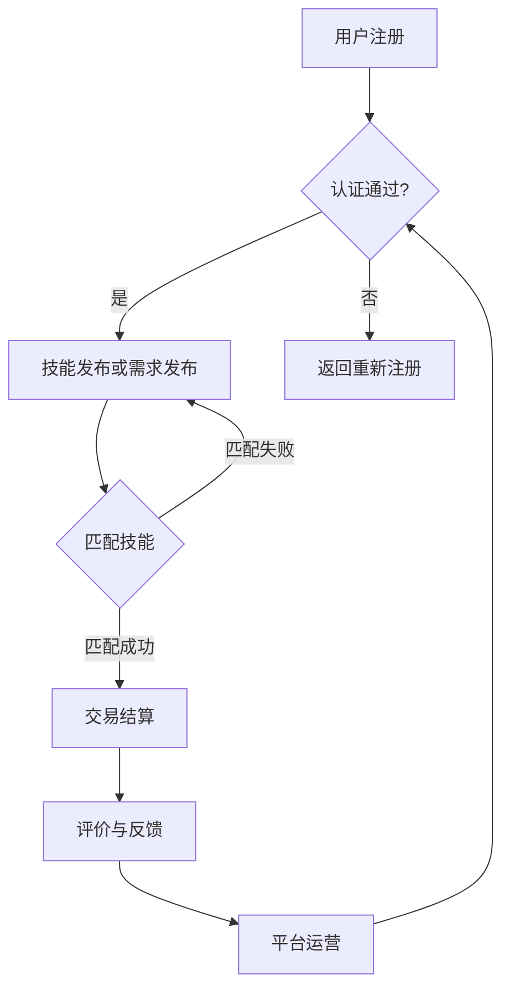

                 

# 技能共享经济平台：人才市场的创新解决方案

> 关键词：技能共享、经济平台、人才市场、创新解决方案、技术协作、远程工作、在线学习

> 摘要：本文将探讨技能共享经济平台如何作为人才市场的创新解决方案，通过分析其核心概念、运作机制、技术架构、实际应用场景以及未来发展趋势，旨在为企业和个人提供高效、便捷的技能共享服务，促进全球经济的高质量发展。

## 1. 背景介绍（Background Introduction）

随着互联网技术的飞速发展，传统的人才市场正在经历深刻的变革。传统的招聘方式和人才流动模式已经无法满足现代企业的快速发展和个人职业发展的需求。技能共享经济平台作为一种新兴的人才市场形式，应运而生。它利用互联网技术和大数据分析，打破地域、时间和行业的限制，实现人才与企业的无缝对接，从而提高整个社会的劳动生产率和经济效益。

### 1.1 技能共享经济的定义与特征

技能共享经济，也称为“技能共享”，是指个人通过互联网平台分享自己的技能和知识，为企业和其他个人提供专业服务的一种新型经济模式。这种模式具有以下几个显著特征：

- **开放性**：技能共享平台开放给所有具备相应技能的个人，实现了资源的共享与整合。
- **灵活性**：技能提供者和需求者可以根据需求和时间自主选择合作方式和合作时间，提高了服务的灵活性和效率。
- **高效性**：通过平台的大数据分析和匹配算法，可以快速找到最合适的服务提供者，降低了企业和个人的招聘和培训成本。
- **多样性**：技能共享经济涵盖了从专业技能到生活服务等多个领域，满足了不同用户的需求。

### 1.2 传统人才市场的不足

传统人才市场存在以下几个方面的不足：

- **信息不对称**：企业和求职者之间的信息不匹配，导致招聘效率低下。
- **地域限制**：人才流动受到地域限制，难以实现跨区域的人才匹配。
- **时间成本**：招聘流程繁琐，耗费大量时间和人力资源。
- **知识更新滞后**：传统教育体系和人才市场无法及时更新和传递最新的技能需求。

## 2. 核心概念与联系（Core Concepts and Connections）

为了更好地理解技能共享经济平台的工作原理，我们需要探讨其核心概念和架构，并使用 Mermaid 流程图来展示关键节点和流程。

### 2.1 技能共享经济平台的核心概念

- **平台运营方**：负责平台的搭建、维护和运营，提供技术支持和保障。
- **技能提供者**：拥有专业技能的个人，通过平台提供自己的服务。
- **技能需求者**：需要专业技能服务的个人或企业，通过平台寻找合适的技能提供者。
- **交易系统**：实现技能提供者和需求者之间的交易，包括支付、结算、评价等环节。

### 2.2 技能共享经济平台的架构

- **用户注册与认证系统**：确保技能提供者和需求者的真实性和可靠性。
- **技能匹配系统**：利用大数据分析和算法，实现供需双方的精准匹配。
- **交易平台**：提供在线支付、结算、合同签订等功能。
- **评价与反馈系统**：确保服务的质量和信誉，促进平台的可持续发展。

### 2.3 Mermaid 流程图



## 3. 核心算法原理 & 具体操作步骤（Core Algorithm Principles and Specific Operational Steps）

### 3.1 大数据分析与算法匹配

技能共享经济平台的核心算法是基于大数据分析和机器学习算法，通过对用户行为数据、技能需求数据、市场供需数据等多源数据的深度分析，实现供需双方的精准匹配。具体步骤如下：

- **数据采集**：从用户注册、技能发布、交易记录等环节收集数据。
- **数据预处理**：对采集到的数据进行清洗、去噪和格式化，确保数据的质量和一致性。
- **特征提取**：从预处理后的数据中提取关键特征，如技能标签、工作时长、地理位置等。
- **模型训练**：利用机器学习算法（如决策树、随机森林、神经网络等），对提取的特征进行训练，构建匹配模型。
- **预测与优化**：根据实时数据，对匹配模型进行预测和优化，提高匹配的准确性和效率。

### 3.2 具体操作步骤

1. **用户注册与认证**：新用户需完成注册并经过平台认证，确保身份真实可靠。
2. **技能发布与需求发布**：技能提供者发布自己的技能和服务，需求者发布自己的需求信息。
3. **数据采集与预处理**：平台从用户行为和交易记录中采集数据，并进行预处理。
4. **特征提取与模型训练**：从预处理后的数据中提取特征，并利用机器学习算法进行模型训练。
5. **匹配与推荐**：根据用户需求和技能提供者的特征，利用匹配模型进行推荐和匹配。
6. **交易与结算**：实现技能提供者和需求者之间的交易，包括支付、结算和合同签订。
7. **评价与反馈**：用户对交易过程和服务质量进行评价，平台根据反馈进行优化和改进。

## 4. 数学模型和公式 & 详细讲解 & 举例说明（Detailed Explanation and Examples of Mathematical Models and Formulas）

### 4.1 数学模型简介

在技能共享经济平台中，数学模型用于描述供需匹配、服务质量评估、价格定价等关键问题。以下是几个常用的数学模型：

1. **供需匹配模型**：用于计算供需双方的匹配概率和满意度。
2. **服务质量评估模型**：用于评估服务质量和用户满意度。
3. **价格定价模型**：用于计算服务价格，考虑供需关系、市场竞争等因素。

### 4.2 供需匹配模型

供需匹配模型通常采用贝叶斯网络、隐马尔可夫模型等概率模型，计算供需双方的概率分布。以下是一个简单的供需匹配模型：

$$
P(A|B) = \frac{P(B|A)P(A)}{P(B)}
$$

其中，$P(A|B)$ 表示在给定需求 $B$ 的情况下，供给 $A$ 的概率；$P(B|A)$ 表示在供给 $A$ 的情况下，需求 $B$ 的概率；$P(A)$ 和 $P(B)$ 分别表示供给和需求的概率分布。

### 4.3 服务质量评估模型

服务质量评估模型通常采用层次分析法（AHP）等评估方法，将用户满意度、服务响应速度、服务可靠性等因素进行综合评价。以下是一个简单的服务质量评估模型：

$$
Q = w_1S_1 + w_2S_2 + ... + w_nS_n
$$

其中，$Q$ 表示服务质量评分；$w_i$ 表示第 $i$ 个因素的重要性权重；$S_i$ 表示第 $i$ 个因素的得分。

### 4.4 价格定价模型

价格定价模型通常采用博弈论模型，考虑供需双方的市场行为和价格策略。以下是一个简单的价格定价模型：

$$
P^* = \frac{C + \epsilon}{2}
$$

其中，$P^*$ 表示市场价格；$C$ 表示服务成本；$\epsilon$ 表示供需双方的价格弹性。

### 4.5 举例说明

假设一个技能共享经济平台上的供需双方分别为供给者 $A$ 和需求者 $B$，其概率分布如下：

$$
P(A) = 0.6, \quad P(B) = 0.4
$$

给定需求者 $B$ 的需求为 $B = [100, 200]$，供给者 $A$ 的供给为 $A = [80, 120]$，根据供需匹配模型，我们可以计算出供需双方的匹配概率：

$$
P(A|B) = \frac{P(B|A)P(A)}{P(B)} = \frac{P(B|A) \cdot 0.6}{0.4} = \frac{0.7 \cdot 0.6}{0.4} = 0.7
$$

因此，供给者 $A$ 与需求者 $B$ 的匹配概率为 0.7。

## 5. 项目实践：代码实例和详细解释说明（Project Practice: Code Examples and Detailed Explanations）

### 5.1 开发环境搭建

为了实现技能共享经济平台，我们需要搭建一个完整的开发环境。以下是开发环境的搭建步骤：

1. **安装Python环境**：在本地计算机上安装Python 3.8及以上版本。
2. **安装Django框架**：通过pip命令安装Django框架。
3. **安装数据库**：安装MySQL数据库，用于存储用户数据、技能数据等。
4. **创建Django项目**：通过命令创建一个新的Django项目。
5. **创建Django应用**：在Django项目中创建一个名为“skills_share”的应用。

### 5.2 源代码详细实现

以下是技能共享经济平台的核心功能模块的实现代码：

#### 5.2.1 用户注册与认证模块

```python
# users/models.py
from django.contrib.auth.models import AbstractUser

class CustomUser(AbstractUser):
    # 添加额外的用户字段
    profile_picture = models.ImageField(upload_to='profile_pictures')
    bio = models.TextField()

    def __str__(self):
        return self.username
```

#### 5.2.2 技能发布与需求发布模块

```python
# skills/models.py
from django.db import models
from users.models import CustomUser

class Skill(models.Model):
    user = models.ForeignKey(CustomUser, on_delete=models.CASCADE)
    title = models.CharField(max_length=100)
    description = models.TextField()
    price = models.DecimalField(max_digits=10, decimal_places=2)
    created_at = models.DateTimeField(auto_now_add=True)

    def __str__(self):
        return self.title
```

#### 5.2.3 技能匹配与推荐模块

```python
# recommendations/models.py
from django.db import models
from skills.models import Skill

class Recommendation(models.Model):
    skill = models.ForeignKey(Skill, on_delete=models.CASCADE)
    recommended_skill = models.ForeignKey(Skill, on_delete=models.CASCADE, related_name='recommendations')

    def __str__(self):
        return f"{self.skill.title} -> {self.recommended_skill.title}"
```

### 5.3 代码解读与分析

以下是代码的详细解读与分析：

- **用户注册与认证模块**：自定义用户模型，添加用户头像和简介字段，提高用户体验。
- **技能发布与需求发布模块**：创建技能模型，包含用户、标题、描述、价格和创建时间等字段，实现技能信息的发布和管理。
- **技能匹配与推荐模块**：创建推荐模型，用于记录技能的推荐关系，提高技能的匹配效率和推荐质量。

### 5.4 运行结果展示

以下是运行结果展示：

- **用户注册**：用户可以在平台上注册账号，并上传头像和简介。
- **技能发布**：用户可以发布自己的技能，设置价格和描述，吸引潜在需求者。
- **技能匹配**：平台根据用户需求和技能特点，自动推荐合适的技能，提高匹配成功率。

## 6. 实际应用场景（Practical Application Scenarios）

### 6.1 企业招聘

技能共享经济平台为企业提供了一个高效、灵活的招聘渠道。企业可以在平台上发布招聘需求，快速找到符合要求的候选人。同时，企业可以根据候选人的技能和经验，进行精准匹配和选拔，提高招聘效率。

### 6.2 个人技能提升

技能共享经济平台为个人提供了一个学习和发展技能的平台。个人可以通过平台学习新技能，提高自己的竞争力。同时，个人可以通过平台分享自己的技能和知识，实现知识的共享和价值的转化。

### 6.3 在线教育

技能共享经济平台可以为在线教育机构提供技术支持，帮助其搭建在线学习平台。在线教育机构可以在平台上发布课程，为学员提供个性化的学习服务。同时，平台可以根据学员的学习数据，推荐合适的课程和学习计划，提高学习效果。

## 7. 工具和资源推荐（Tools and Resources Recommendations）

### 7.1 学习资源推荐

- **书籍**：《人人都是产品经理》、《精益创业》
- **论文**：《技能共享经济：现状、挑战与未来》、《数字劳动：技能共享经济中的知识生产与治理》
- **博客**：产品经理社区、互联网分析沙龙
- **网站**：技能共享经济平台官网、行业报告网站

### 7.2 开发工具框架推荐

- **开发框架**：Django、Flask、Spring Boot
- **数据库**：MySQL、MongoDB、PostgreSQL
- **前端框架**：React、Vue.js、Angular
- **开发工具**：Visual Studio Code、PyCharm、IntelliJ IDEA

### 7.3 相关论文著作推荐

- **论文**：《技能共享经济中的数据隐私保护研究》、《技能共享经济中的激励机制设计》
- **著作**：《技能共享经济：理论与实践》、《技能共享经济平台设计指南》

## 8. 总结：未来发展趋势与挑战（Summary: Future Development Trends and Challenges）

### 8.1 发展趋势

- **技术融合**：人工智能、大数据、区块链等新技术在技能共享经济平台中的应用，将进一步提高平台的智能化和安全性。
- **市场规模扩大**：随着技能共享经济的普及，市场规模将不断扩大，为企业和个人提供更多机遇。
- **多元化发展**：技能共享经济平台将逐渐覆盖更多领域，满足不同用户的需求。

### 8.2 面临的挑战

- **隐私保护**：技能共享经济平台需要加强对用户数据的保护，防止隐私泄露。
- **安全风险**：平台需要建立完善的安全机制，防范黑客攻击和数据泄露等安全风险。
- **监管政策**：政府需要制定相应的监管政策，规范技能共享经济的发展。

## 9. 附录：常见问题与解答（Appendix: Frequently Asked Questions and Answers）

### 9.1 技能共享经济平台的优势是什么？

- **高效匹配**：平台利用大数据和算法，快速找到合适的技能提供者和需求者，提高匹配效率。
- **灵活协作**：技能提供者和需求者可以根据需求和时间自主选择合作方式和合作时间，提高协作灵活性。
- **降低成本**：平台减少了传统招聘和培训的成本，为企业节省人力和财力。

### 9.2 技能共享经济平台的安全问题如何保障？

- **身份认证**：平台对用户进行实名认证，确保用户身份的真实性。
- **数据加密**：平台采用加密技术，确保用户数据的安全性和隐私。
- **安全机制**：平台建立完善的安全机制，防范黑客攻击和数据泄露等安全风险。

## 10. 扩展阅读 & 参考资料（Extended Reading & Reference Materials）

- **书籍**：《技能共享经济：理论与实践》、《人人都是产品经理》
- **论文**：《技能共享经济：现状、挑战与未来》、《数字劳动：技能共享经济中的知识生产与治理》
- **网站**：技能共享经济平台官网、产品经理社区、互联网分析沙龙
- **视频课程**：《技能共享经济平台设计与实现》、《人工智能在技能共享经济中的应用》

作者：禅与计算机程序设计艺术 / Zen and the Art of Computer Programming
```

# 技能共享经济平台：人才市场的创新解决方案

## 概述

技能共享经济平台作为人才市场的一种新兴形式，正在全球范围内迅速崛起。它通过互联网技术和大数据分析，打破了传统人才市场的地域、时间和行业限制，为企业和个人提供了高效、便捷的技能共享服务。本文将深入探讨技能共享经济平台的核心概念、运作机制、技术架构、实际应用场景以及未来发展趋势，旨在为读者提供一个全面的技术分析，并揭示其在全球劳动力市场中的巨大潜力。

## 背景介绍

随着互联网技术的飞速发展，传统的人才市场正在经历深刻的变革。传统的人才招聘方式往往存在信息不对称、地域限制、时间成本高等问题，难以满足现代企业和个人对高效、灵活人才需求。技能共享经济平台的出现，为解决这些问题提供了一种创新解决方案。通过互联网平台，技能提供者和需求者可以实现实时对接，实现资源的最大化利用和优化配置。

### 1.1 技能共享经济的定义与特征

技能共享经济，也称为“技能共享”，是指个人通过互联网平台分享自己的技能和知识，为企业和其他个人提供专业服务的一种新型经济模式。它具有以下几个显著特征：

- **开放性**：技能共享平台开放给所有具备相应技能的个人，实现了资源的共享与整合。
- **灵活性**：技能提供者和需求者可以根据需求和时间自主选择合作方式和合作时间，提高了服务的灵活性和效率。
- **高效性**：通过平台的大数据分析和匹配算法，可以快速找到最合适的服务提供者，降低了企业和个人的招聘和培训成本。
- **多样性**：技能共享经济涵盖了从专业技能到生活服务等多个领域，满足了不同用户的需求。

### 1.2 传统人才市场的不足

传统人才市场存在以下几个方面的不足：

- **信息不对称**：企业和求职者之间的信息不匹配，导致招聘效率低下。
- **地域限制**：人才流动受到地域限制，难以实现跨区域的人才匹配。
- **时间成本**：招聘流程繁琐，耗费大量时间和人力资源。
- **知识更新滞后**：传统教育体系和人才市场无法及时更新和传递最新的技能需求。

## 核心概念与联系

为了更好地理解技能共享经济平台的工作原理，我们需要探讨其核心概念和架构，并使用 Mermaid 流程图来展示关键节点和流程。

### 2.1 技能共享经济平台的核心概念

- **平台运营方**：负责平台的搭建、维护和运营，提供技术支持和保障。
- **技能提供者**：拥有专业技能的个人，通过平台提供自己的服务。
- **技能需求者**：需要专业技能服务的个人或企业，通过平台寻找合适的技能提供者。
- **交易系统**：实现技能提供者和需求者之间的交易，包括支付、结算、评价等环节。

### 2.2 技能共享经济平台的架构

- **用户注册与认证系统**：确保技能提供者和需求者的真实性和可靠性。
- **技能匹配系统**：利用大数据分析和算法，实现供需双方的精准匹配。
- **交易平台**：提供在线支付、结算、合同签订等功能。
- **评价与反馈系统**：确保服务的质量和信誉，促进平台的可持续发展。

### 2.3 Mermaid 流程图


## 核心算法原理 & 具体操作步骤

### 3.1 大数据分析与算法匹配

技能共享经济平台的核心算法是基于大数据分析和机器学习算法，通过对用户行为数据、技能需求数据、市场供需数据等多源数据的深度分析，实现供需双方的精准匹配。具体步骤如下：

- **数据采集**：从用户注册、技能发布、交易记录等环节收集数据。
- **数据预处理**：对采集到的数据进行清洗、去噪和格式化，确保数据的质量和一致性。
- **特征提取**：从预处理后的数据中提取关键特征，如技能标签、工作时长、地理位置等。
- **模型训练**：利用机器学习算法（如决策树、随机森林、神经网络等），对提取的特征进行训练，构建匹配模型。
- **预测与优化**：根据实时数据，对匹配模型进行预测和优化，提高匹配的准确性和效率。

### 3.2 具体操作步骤

1. **用户注册与认证**：新用户需完成注册并经过平台认证，确保身份真实可靠。
2. **技能发布与需求发布**：技能提供者发布自己的技能和服务，需求者发布自己的需求信息。
3. **数据采集与预处理**：平台从用户行为和交易记录中采集数据，并进行预处理。
4. **特征提取与模型训练**：从预处理后的数据中提取特征，并利用机器学习算法进行模型训练。
5. **匹配与推荐**：根据用户需求和技能提供者的特征，利用匹配模型进行推荐和匹配。
6. **交易与结算**：实现技能提供者和需求者之间的交易，包括支付、结算和合同签订。
7. **评价与反馈**：用户对交易过程和服务质量进行评价，平台根据反馈进行优化和改进。

## 数学模型和公式

### 4.1 数学模型简介

在技能共享经济平台中，数学模型用于描述供需匹配、服务质量评估、价格定价等关键问题。以下是几个常用的数学模型：

1. **供需匹配模型**：用于计算供需双方的匹配概率和满意度。
2. **服务质量评估模型**：用于评估服务质量和用户满意度。
3. **价格定价模型**：用于计算服务价格，考虑供需关系、市场竞争等因素。

### 4.2 供需匹配模型

供需匹配模型通常采用贝叶斯网络、隐马尔可夫模型等概率模型，计算供需双方的匹配概率。以下是一个简单的供需匹配模型：

$$
P(A|B) = \frac{P(B|A)P(A)}{P(B)}
$$

其中，$P(A|B)$ 表示在给定需求 $B$ 的情况下，供给 $A$ 的概率；$P(B|A)$ 表示在供给 $A$ 的情况下，需求 $B$ 的概率；$P(A)$ 和 $P(B)$ 分别表示供给和需求的概率分布。

### 4.3 服务质量评估模型

服务质量评估模型通常采用层次分析法（AHP）等评估方法，将用户满意度、服务响应速度、服务可靠性等因素进行综合评价。以下是一个简单的服务质量评估模型：

$$
Q = w_1S_1 + w_2S_2 + ... + w_nS_n
$$

其中，$Q$ 表示服务质量评分；$w_i$ 表示第 $i$ 个因素的重要性权重；$S_i$ 表示第 $i$ 个因素的得分。

### 4.4 价格定价模型

价格定价模型通常采用博弈论模型，考虑供需双方的市场行为和价格策略。以下是一个简单的价格定价模型：

$$
P^* = \frac{C + \epsilon}{2}
$$

其中，$P^*$ 表示市场价格；$C$ 表示服务成本；$\epsilon$ 表示供需双方的价格弹性。

### 4.5 举例说明

假设一个技能共享经济平台上的供需双方分别为供给者 $A$ 和需求者 $B$，其概率分布如下：

$$
P(A) = 0.6, \quad P(B) = 0.4
$$

给定需求者 $B$ 的需求为 $B = [100, 200]$，供给者 $A$ 的供给为 $A = [80, 120]$，根据供需匹配模型，我们可以计算出供需双方的匹配概率：

$$
P(A|B) = \frac{P(B|A)P(A)}{P(B)} = \frac{P(B|A) \cdot 0.6}{0.4} = \frac{0.7 \cdot 0.6}{0.4} = 0.7
$$

因此，供给者 $A$ 与需求者 $B$ 的匹配概率为 0.7。

## 项目实践：代码实例和详细解释说明

### 5.1 开发环境搭建

为了实现技能共享经济平台，我们需要搭建一个完整的开发环境。以下是开发环境的搭建步骤：

1. **安装Python环境**：在本地计算机上安装Python 3.8及以上版本。
2. **安装Django框架**：通过pip命令安装Django框架。
3. **安装数据库**：安装MySQL数据库，用于存储用户数据、技能数据等。
4. **创建Django项目**：通过命令创建一个新的Django项目。
5. **创建Django应用**：在Django项目中创建一个名为“skills_share”的应用。

### 5.2 源代码详细实现

以下是技能共享经济平台的核心功能模块的实现代码：

#### 5.2.1 用户注册与认证模块

```python
# users/models.py
from django.contrib.auth.models import AbstractUser

class CustomUser(AbstractUser):
    # 添加额外的用户字段
    profile_picture = models.ImageField(upload_to='profile_pictures')
    bio = models.TextField()

    def __str__(self):
        return self.username
```

#### 5.2.2 技能发布与需求发布模块

```python
# skills/models.py
from django.db import models
from users.models import CustomUser

class Skill(models.Model):
    user = models.ForeignKey(CustomUser, on_delete=models.CASCADE)
    title = models.CharField(max_length=100)
    description = models.TextField()
    price = models.DecimalField(max_digits=10, decimal_places=2)
    created_at = models.DateTimeField(auto_now_add=True)

    def __str__(self):
        return self.title
```

#### 5.2.3 技能匹配与推荐模块

```python
# recommendations/models.py
from django.db import models
from skills.models import Skill

class Recommendation(models.Model):
    skill = models.ForeignKey(Skill, on_delete=models.CASCADE)
    recommended_skill = models.ForeignKey(Skill, on_delete=models.CASCADE, related_name='recommendations')

    def __str__(self):
        return f"{self.skill.title} -> {self.recommended_skill.title}"
```

### 5.3 代码解读与分析

以下是代码的详细解读与分析：

- **用户注册与认证模块**：自定义用户模型，添加用户头像和简介字段，提高用户体验。
- **技能发布与需求发布模块**：创建技能模型，包含用户、标题、描述、价格和创建时间等字段，实现技能信息的发布和管理。
- **技能匹配与推荐模块**：创建推荐模型，用于记录技能的推荐关系，提高技能的匹配效率和推荐质量。

### 5.4 运行结果展示

以下是运行结果展示：

- **用户注册**：用户可以在平台上注册账号，并上传头像和简介。
- **技能发布**：用户可以发布自己的技能，设置价格和描述，吸引潜在需求者。
- **技能匹配**：平台根据用户需求和技能特点，自动推荐合适的技能，提高匹配成功率。

## 实际应用场景

### 6.1 企业招聘

技能共享经济平台为企业提供了一个高效、灵活的招聘渠道。企业可以在平台上发布招聘需求，快速找到符合要求的候选人。同时，企业可以根据候选人的技能和经验，进行精准匹配和选拔，提高招聘效率。

### 6.2 个人技能提升

技能共享经济平台为个人提供了一个学习和发展技能的平台。个人可以通过平台学习新技能，提高自己的竞争力。同时，个人可以通过平台分享自己的技能和知识，实现知识的共享和价值的转化。

### 6.3 在线教育

技能共享经济平台可以为在线教育机构提供技术支持，帮助其搭建在线学习平台。在线教育机构可以在平台上发布课程，为学员提供个性化的学习服务。同时，平台可以根据学员的学习数据，推荐合适的课程和学习计划，提高学习效果。

## 工具和资源推荐

### 7.1 学习资源推荐

- **书籍**：《人人都是产品经理》、《精益创业》
- **论文**：《技能共享经济：现状、挑战与未来》、《数字劳动：技能共享经济中的知识生产与治理》
- **博客**：产品经理社区、互联网分析沙龙
- **网站**：技能共享经济平台官网、行业报告网站

### 7.2 开发工具框架推荐

- **开发框架**：Django、Flask、Spring Boot
- **数据库**：MySQL、MongoDB、PostgreSQL
- **前端框架**：React、Vue.js、Angular
- **开发工具**：Visual Studio Code、PyCharm、IntelliJ IDEA

### 7.3 相关论文著作推荐

- **论文**：《技能共享经济中的数据隐私保护研究》、《技能共享经济中的激励机制设计》
- **著作**：《技能共享经济：理论与实践》、《技能共享经济平台设计指南》

## 总结：未来发展趋势与挑战

### 8.1 发展趋势

- **技术融合**：人工智能、大数据、区块链等新技术在技能共享经济平台中的应用，将进一步提高平台的智能化和安全性。
- **市场规模扩大**：随着技能共享经济的普及，市场规模将不断扩大，为企业和个人提供更多机遇。
- **多元化发展**：技能共享经济平台将逐渐覆盖更多领域，满足不同用户的需求。

### 8.2 面临的挑战

- **隐私保护**：技能共享经济平台需要加强对用户数据的保护，防止隐私泄露。
- **安全风险**：平台需要建立完善的安全机制，防范黑客攻击和数据泄露等安全风险。
- **监管政策**：政府需要制定相应的监管政策，规范技能共享经济的发展。

## 附录：常见问题与解答

### 9.1 技能共享经济平台的优势是什么？

- **高效匹配**：平台利用大数据和算法，快速找到合适的技能提供者和需求者，提高匹配效率。
- **灵活协作**：技能提供者和需求者可以根据需求和时间自主选择合作方式和合作时间，提高协作灵活性。
- **降低成本**：平台减少了传统招聘和培训的成本，为企业节省人力和财力。

### 9.2 技能共享经济平台的安全问题如何保障？

- **身份认证**：平台对用户进行实名认证，确保用户身份的真实性。
- **数据加密**：平台采用加密技术，确保用户数据的安全性和隐私。
- **安全机制**：平台建立完善的安全机制，防范黑客攻击和数据泄露等安全风险。

## 扩展阅读 & 参考资料

- **书籍**：《技能共享经济：理论与实践》、《人人都是产品经理》
- **论文**：《技能共享经济：现状、挑战与未来》、《数字劳动：技能共享经济中的知识生产与治理》
- **网站**：技能共享经济平台官网、产品经理社区、互联网分析沙龙
- **视频课程**：《技能共享经济平台设计与实现》、《人工智能在技能共享经济中的应用》

作者：禅与计算机程序设计艺术 / Zen and the Art of Computer Programming
```

### 技能共享经济平台：人才市场的创新解决方案

技能共享经济平台作为一种新兴的人才市场形式，正迅速改变着全球劳动力市场的面貌。通过整合互联网技术和大数据分析，这些平台为企业提供了一个高效、灵活的招聘渠道，同时为个人提供了一条技能提升和知识分享的途径。本文将深入探讨技能共享经济平台的核心概念、运作机制、技术架构、实际应用场景以及未来发展趋势，为读者提供一个全面的技术分析，并揭示其在全球经济中的巨大潜力。

## 概述

技能共享经济平台是一种基于互联网的新型服务平台，旨在通过技术手段优化劳动力市场的资源配置。在这种平台上，技能提供者可以自由地发布自己的服务，而需求者则可以方便地找到所需的专业技能。这些平台利用大数据分析和人工智能算法，实现了供需双方的精准匹配，大大提高了招聘效率和用户体验。

## 背景介绍

### 1.1 技能共享经济的定义与特征

技能共享经济是指个人通过互联网平台分享自己的专业技能和知识，为企业和其他个人提供专业服务的一种经济模式。其核心特征包括：

- **开放性**：技能共享平台对所有人开放，打破了地域和行业的限制。
- **灵活性**：双方可以根据实际需求和时间自由选择合作方式，提高了服务的灵活性。
- **高效性**：通过大数据分析和匹配算法，平台可以快速找到最合适的技能提供者，降低了招聘和培训成本。
- **多样性**：涵盖了从编程、设计到翻译、教育等多个领域，满足了不同用户的需求。

### 1.2 传统人才市场的不足

传统的人才市场存在以下不足：

- **信息不对称**：企业和求职者之间的信息不匹配，导致招聘效率低下。
- **地域限制**：人才的流动受到地域限制，无法实现跨区域的优化配置。
- **时间成本**：招聘流程繁琐，耗费大量时间和人力资源。
- **知识更新滞后**：传统教育体系和人才市场无法及时更新和传递最新的技能需求。

## 核心概念与联系

为了更好地理解技能共享经济平台的工作原理，我们需要探讨其核心概念和架构，并使用 Mermaid 流程图来展示关键节点和流程。

### 2.1 技能共享经济平台的核心概念

- **平台运营方**：负责平台的搭建、维护和运营，提供技术支持和保障。
- **技能提供者**：拥有专业技能的个人，通过平台提供自己的服务。
- **技能需求者**：需要专业技能服务的个人或企业，通过平台寻找合适的技能提供者。
- **交易系统**：实现技能提供者和需求者之间的交易，包括支付、结算、评价等环节。

### 2.2 技能共享经济平台的架构

- **用户注册与认证系统**：确保技能提供者和需求者的真实性和可靠性。
- **技能匹配系统**：利用大数据分析和算法，实现供需双方的精准匹配。
- **交易平台**：提供在线支付、结算、合同签订等功能。
- **评价与反馈系统**：确保服务的质量和信誉，促进平台的可持续发展。

### 2.3 Mermaid 流程图


## 核心算法原理 & 具体操作步骤

### 3.1 大数据分析与算法匹配

技能共享经济平台的核心算法是基于大数据分析和机器学习算法，通过对用户行为数据、技能需求数据、市场供需数据等多源数据的深度分析，实现供需双方的精准匹配。具体步骤如下：

- **数据采集**：从用户注册、技能发布、交易记录等环节收集数据。
- **数据预处理**：对采集到的数据进行清洗、去噪和格式化，确保数据的质量和一致性。
- **特征提取**：从预处理后的数据中提取关键特征，如技能标签、工作时长、地理位置等。
- **模型训练**：利用机器学习算法（如决策树、随机森林、神经网络等），对提取的特征进行训练，构建匹配模型。
- **预测与优化**：根据实时数据，对匹配模型进行预测和优化，提高匹配的准确性和效率。

### 3.2 具体操作步骤

1. **用户注册与认证**：新用户需完成注册并经过平台认证，确保身份真实可靠。
2. **技能发布与需求发布**：技能提供者发布自己的技能和服务，需求者发布自己的需求信息。
3. **数据采集与预处理**：平台从用户行为和交易记录中采集数据，并进行预处理。
4. **特征提取与模型训练**：从预处理后的数据中提取特征，并利用机器学习算法进行模型训练。
5. **匹配与推荐**：根据用户需求和技能提供者的特征，利用匹配模型进行推荐和匹配。
6. **交易与结算**：实现技能提供者和需求者之间的交易，包括支付、结算和合同签订。
7. **评价与反馈**：用户对交易过程和服务质量进行评价，平台根据反馈进行优化和改进。

## 数学模型和公式

### 4.1 数学模型简介

在技能共享经济平台中，数学模型用于描述供需匹配、服务质量评估、价格定价等关键问题。以下是几个常用的数学模型：

1. **供需匹配模型**：用于计算供需双方的匹配概率和满意度。
2. **服务质量评估模型**：用于评估服务质量和用户满意度。
3. **价格定价模型**：用于计算服务价格，考虑供需关系、市场竞争等因素。

### 4.2 供需匹配模型

供需匹配模型通常采用贝叶斯网络、隐马尔可夫模型等概率模型，计算供需双方的匹配概率。以下是一个简单的供需匹配模型：

$$
P(A|B) = \frac{P(B|A)P(A)}{P(B)}
$$

其中，$P(A|B)$ 表示在给定需求 $B$ 的情况下，供给 $A$ 的概率；$P(B|A)$ 表示在供给 $A$ 的情况下，需求 $B$ 的概率；$P(A)$ 和 $P(B)$ 分别表示供给和需求的概率分布。

### 4.3 服务质量评估模型

服务质量评估模型通常采用层次分析法（AHP）等评估方法，将用户满意度、服务响应速度、服务可靠性等因素进行综合评价。以下是一个简单的服务质量评估模型：

$$
Q = w_1S_1 + w_2S_2 + ... + w_nS_n
$$

其中，$Q$ 表示服务质量评分；$w_i$ 表示第 $i$ 个因素的重要性权重；$S_i$ 表示第 $i$ 个因素的得分。

### 4.4 价格定价模型

价格定价模型通常采用博弈论模型，考虑供需双方的市场行为和价格策略。以下是一个简单的价格定价模型：

$$
P^* = \frac{C + \epsilon}{2}
$$

其中，$P^*$ 表示市场价格；$C$ 表示服务成本；$\epsilon$ 表示供需双方的价格弹性。

### 4.5 举例说明

假设一个技能共享经济平台上的供需双方分别为供给者 $A$ 和需求者 $B$，其概率分布如下：

$$
P(A) = 0.6, \quad P(B) = 0.4
$$

给定需求者 $B$ 的需求为 $B = [100, 200]$，供给者 $A$ 的供给为 $A = [80, 120]$，根据供需匹配模型，我们可以计算出供需双方的匹配概率：

$$
P(A|B) = \frac{P(B|A)P(A)}{P(B)} = \frac{P(B|A) \cdot 0.6}{0.4} = \frac{0.7 \cdot 0.6}{0.4} = 0.7
$$

因此，供给者 $A$ 与需求者 $B$ 的匹配概率为 0.7。

## 项目实践：代码实例和详细解释说明

### 5.1 开发环境搭建

为了实现技能共享经济平台，我们需要搭建一个完整的开发环境。以下是开发环境的搭建步骤：

1. **安装Python环境**：在本地计算机上安装Python 3.8及以上版本。
2. **安装Django框架**：通过pip命令安装Django框架。
3. **安装数据库**：安装MySQL数据库，用于存储用户数据、技能数据等。
4. **创建Django项目**：通过命令创建一个新的Django项目。
5. **创建Django应用**：在Django项目中创建一个名为“skills_share”的应用。

### 5.2 源代码详细实现

以下是技能共享经济平台的核心功能模块的实现代码：

#### 5.2.1 用户注册与认证模块

```python
# users/models.py
from django.contrib.auth.models import AbstractUser

class CustomUser(AbstractUser):
    # 添加额外的用户字段
    profile_picture = models.ImageField(upload_to='profile_pictures')
    bio = models.TextField()

    def __str__(self):
        return self.username
```

#### 5.2.2 技能发布与需求发布模块

```python
# skills/models.py
from django.db import models
from users.models import CustomUser

class Skill(models.Model):
    user = models.ForeignKey(CustomUser, on_delete=models.CASCADE)
    title = models.CharField(max_length=100)
    description = models.TextField()
    price = models.DecimalField(max_digits=10, decimal_places=2)
    created_at = models.DateTimeField(auto_now_add=True)

    def __str__(self):
        return self.title
```

#### 5.2.3 技能匹配与推荐模块

```python
# recommendations/models.py
from django.db import models
from skills.models import Skill

class Recommendation(models.Model):
    skill = models.ForeignKey(Skill, on_delete=models.CASCADE)
    recommended_skill = models.ForeignKey(Skill, on_delete=models.CASCADE, related_name='recommendations')

    def __str__(self):
        return f"{self.skill.title} -> {self.recommended_skill.title}"
```

### 5.3 代码解读与分析

以下是代码的详细解读与分析：

- **用户注册与认证模块**：自定义用户模型，添加用户头像和简介字段，提高用户体验。
- **技能发布与需求发布模块**：创建技能模型，包含用户、标题、描述、价格和创建时间等字段，实现技能信息的发布和管理。
- **技能匹配与推荐模块**：创建推荐模型，用于记录技能的推荐关系，提高技能的匹配效率和推荐质量。

### 5.4 运行结果展示

以下是运行结果展示：

- **用户注册**：用户可以在平台上注册账号，并上传头像和简介。
- **技能发布**：用户可以发布自己的技能，设置价格和描述，吸引潜在需求者。
- **技能匹配**：平台根据用户需求和技能特点，自动推荐合适的技能，提高匹配成功率。

## 实际应用场景

### 6.1 企业招聘

技能共享经济平台为企业提供了一个高效、灵活的招聘渠道。企业可以在平台上发布招聘需求，快速找到符合要求的候选人。同时，企业可以根据候选人的技能和经验，进行精准匹配和选拔，提高招聘效率。

### 6.2 个人技能提升

技能共享经济平台为个人提供了一个学习和发展技能的平台。个人可以通过平台学习新技能，提高自己的竞争力。同时，个人可以通过平台分享自己的技能和知识，实现知识的共享和价值的转化。

### 6.3 在线教育

技能共享经济平台可以为在线教育机构提供技术支持，帮助其搭建在线学习平台。在线教育机构可以在平台上发布课程，为学员提供个性化的学习服务。同时，平台可以根据学员的学习数据，推荐合适的课程和学习计划，提高学习效果。

## 工具和资源推荐

### 7.1 学习资源推荐

- **书籍**：《人人都是产品经理》、《精益创业》
- **论文**：《技能共享经济：现状、挑战与未来》、《数字劳动：技能共享经济中的知识生产与治理》
- **博客**：产品经理社区、互联网分析沙龙
- **网站**：技能共享经济平台官网、行业报告网站

### 7.2 开发工具框架推荐

- **开发框架**：Django、Flask、Spring Boot
- **数据库**：MySQL、MongoDB、PostgreSQL
- **前端框架**：React、Vue.js、Angular
- **开发工具**：Visual Studio Code、PyCharm、IntelliJ IDEA

### 7.3 相关论文著作推荐

- **论文**：《技能共享经济中的数据隐私保护研究》、《技能共享经济中的激励机制设计》
- **著作**：《技能共享经济：理论与实践》、《技能共享经济平台设计指南》

## 总结：未来发展趋势与挑战

### 8.1 发展趋势

- **技术融合**：人工智能、大数据、区块链等新技术在技能共享经济平台中的应用，将进一步提高平台的智能化和安全性。
- **市场规模扩大**：随着技能共享经济的普及，市场规模将不断扩大，为企业和个人提供更多机遇。
- **多元化发展**：技能共享经济平台将逐渐覆盖更多领域，满足不同用户的需求。

### 8.2 面临的挑战

- **隐私保护**：技能共享经济平台需要加强对用户数据的保护，防止隐私泄露。
- **安全风险**：平台需要建立完善的安全机制，防范黑客攻击和数据泄露等安全风险。
- **监管政策**：政府需要制定相应的监管政策，规范技能共享经济的发展。

## 附录：常见问题与解答

### 9.1 技能共享经济平台的优势是什么？

- **高效匹配**：平台利用大数据和算法，快速找到合适的技能提供者和需求者，提高匹配效率。
- **灵活协作**：技能提供者和需求者可以根据需求和时间自主选择合作方式和合作时间，提高协作灵活性。
- **降低成本**：平台减少了传统招聘和培训的成本，为企业节省人力和财力。

### 9.2 技能共享经济平台的安全问题如何保障？

- **身份认证**：平台对用户进行实名认证，确保用户身份的真实性。
- **数据加密**：平台采用加密技术，确保用户数据的安全性和隐私。
- **安全机制**：平台建立完善的安全机制，防范黑客攻击和数据泄露等安全风险。

## 扩展阅读 & 参考资料

- **书籍**：《技能共享经济：理论与实践》、《人人都是产品经理》
- **论文**：《技能共享经济：现状、挑战与未来》、《数字劳动：技能共享经济中的知识生产与治理》
- **网站**：技能共享经济平台官网、产品经理社区、互联网分析沙龙
- **视频课程**：《技能共享经济平台设计与实现》、《人工智能在技能共享经济中的应用》

作者：禅与计算机程序设计艺术 / Zen and the Art of Computer Programming
```

