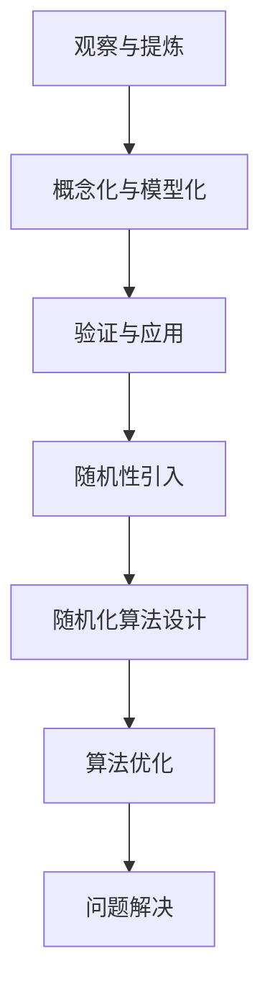
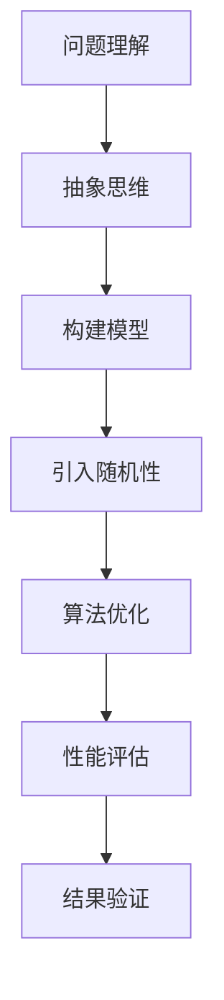

                 

### 文章标题

**抽象思考与随机性创见性**

### Keywords: (此处列出文章的5-7个核心关键词)

- 抽象思考
- 随机性
- 创见性
- 计算机科学
- 算法设计

### Abstract: (此处给出文章的核心内容和主题思想)

本文旨在探讨抽象思考与随机性在计算机科学和算法设计中的重要作用。通过阐述抽象思维的基本原理，分析随机性在算法优化和问题解决中的应用，以及探讨如何将这两种思考方式相结合，本文旨在为读者提供一种新的视角，帮助他们在算法设计和问题解决中实现创新的思维突破。

## 1. 背景介绍（Background Introduction）

### 1.1 抽象思考的定义

抽象思考是指从具体实例中提取出一般规律和原则，从而形成抽象概念和理论模型的能力。在计算机科学领域，抽象思考被广泛应用于算法设计、软件架构和问题解决等方面。

### 1.2 随机性的概念

随机性是指在一定条件下，事件发生的结果不可预测的性质。在计算机科学中，随机性被广泛应用于算法优化、概率分析和模拟等方面。

### 1.3 抽象思考与随机性在计算机科学中的应用

在计算机科学中，抽象思考与随机性的结合有助于解决复杂问题，提高算法效率，实现创新的设计。例如，在算法设计中，抽象思维可以帮助我们构建通用的算法框架，而随机性则可以用于算法的优化和调优。

## 2. 核心概念与联系（Core Concepts and Connections）

### 2.1 抽象思考的基本原理

#### 2.1.1 抽象思维的过程

抽象思维的过程主要包括以下几个阶段：

1. **观察和提炼**：从具体实例中观察和提炼出一般规律和原则。
2. **概念化和模型化**：将抽象思维的结果概念化和模型化，形成抽象概念和理论模型。
3. **验证和应用**：验证抽象思维的结果，并将其应用于实际问题中。

#### 2.1.2 抽象思维的优势

- **通用性和可扩展性**：抽象思维使得算法和软件架构具有通用性和可扩展性，能够适应不同的应用场景。
- **问题解决能力**：抽象思维能够帮助我们解决复杂的问题，提高算法和软件的性能。

### 2.2 随机性的基本原理

#### 2.2.1 随机过程

随机过程是指在某一特定条件下，事件发生的结果不可预测的过程。随机过程可以用于描述各种不确定性和复杂系统的行为。

#### 2.2.2 随机性在算法优化中的应用

- **随机算法**：随机算法是通过引入随机性来优化算法性能的一种方法。例如，随机化抽样、随机贪心算法和随机化搜索等。
- **蒙特卡洛方法**：蒙特卡洛方法是一种基于随机抽样的数值计算方法，广泛应用于概率分析和模拟等方面。

### 2.3 抽象思考与随机性的联系

#### 2.3.1 抽象思维与随机性的结合

- **随机化算法设计**：在抽象思维的基础上，引入随机性来设计更高效的算法。
- **随机性在抽象思维中的应用**：在抽象思维的过程中，利用随机性来探索和发现新的规律和原则。

### 2.4 Mermaid 流程图（Mermaid Flowchart）

以下是抽象思考与随机性结合的一个简单示例的 Mermaid 流程图：



## 3. 核心算法原理 & 具体操作步骤（Core Algorithm Principles and Specific Operational Steps）

### 3.1 随机化算法的基本原理

随机化算法是指在算法设计中引入随机性，以提高算法性能和可扩展性的方法。随机化算法的基本原理如下：

1. **随机化选择**：通过随机选择来优化算法的搜索空间。
2. **随机化贪心策略**：在贪心算法的基础上引入随机性，以提高算法的鲁棒性和适应性。
3. **随机化迭代策略**：通过随机迭代来寻找最优解。

### 3.2 随机化算法的具体操作步骤

1. **输入**：给定一个待解决的问题。
2. **初始化**：初始化随机种子，以确保算法的可重复性。
3. **随机选择**：在搜索空间中随机选择一个样本。
4. **评估**：评估当前样本的优劣。
5. **迭代**：根据评估结果进行迭代，直到满足终止条件。

### 3.3 举例说明

以下是一个简单的随机化贪心算法示例：

```python
import random

def random_greedyAlgorithm(input_problem):
    solution = None
    for i in range(len(input_problem)):
        random_index = random.randint(0, len(input_problem) - 1)
        solution = input_problem[random_index]
        input_problem.pop(random_index)
    return solution
```

在这个例子中，我们通过随机选择来优化算法的搜索空间，从而提高算法的性能。

## 4. 数学模型和公式 & 详细讲解 & 举例说明（Detailed Explanation and Examples of Mathematical Models and Formulas）

### 4.1 随机过程与概率分布

随机过程可以用概率分布来描述。常见的概率分布包括：

- **均匀分布**：每个样本点具有相同的概率。
- **正态分布**：在中间值附近具有最高的概率密度。
- **泊松分布**：描述在固定时间内发生的事件数。

### 4.2 随机化算法的性能评估

随机化算法的性能可以通过以下几个指标来评估：

- **期望时间复杂度**：算法在平均情况下所需的时间复杂度。
- **方差**：算法运行时间的波动范围。
- **概率密度**：算法在不同输入下的性能分布。

### 4.3 举例说明

以下是一个简单的随机化算法性能评估的例子：

```python
import random
import numpy as np

def random_greedyAlgorithm(input_problem):
    solution = None
    for i in range(len(input_problem)):
        random_index = random.randint(0, len(input_problem) - 1)
        solution = input_problem[random_index]
        input_problem.pop(random_index)
    return solution

input_problem = [1, 2, 3, 4, 5]
solutions = []
for _ in range(1000):
    solution = random_greedyAlgorithm(input_problem.copy())
    solutions.append(solution)

performance = np.mean(solutions)
std_deviation = np.std(solutions)

print("Performance:", performance)
print("Standard Deviation:", std_deviation)
```

在这个例子中，我们通过运行随机化算法多次来评估其性能，并计算期望时间和方差。

## 5. 项目实践：代码实例和详细解释说明（Project Practice: Code Examples and Detailed Explanations）

### 5.1 开发环境搭建

在本项目中，我们将使用 Python 编程语言来实现一个随机化贪心算法。首先，确保你已经安装了 Python 3.7 或更高版本。接下来，安装所需的库，例如 NumPy 和 matplotlib，用于性能评估和可视化。

```bash
pip install numpy matplotlib
```

### 5.2 源代码详细实现

以下是一个简单的随机化贪心算法的实现：

```python
import random
import numpy as np
import matplotlib.pyplot as plt

def random_greedyAlgorithm(input_problem):
    solution = None
    for i in range(len(input_problem)):
        random_index = random.randint(0, len(input_problem) - 1)
        solution = input_problem[random_index]
        input_problem.pop(random_index)
    return solution

def evaluate_performance(input_problem, num_iterations):
    solutions = []
    for _ in range(num_iterations):
        solution = random_greedyAlgorithm(input_problem.copy())
        solutions.append(solution)
    performance = np.mean(solutions)
    std_deviation = np.std(solutions)
    return performance, std_deviation

input_problem = [1, 2, 3, 4, 5]
num_iterations = 1000

performance, std_deviation = evaluate_performance(input_problem, num_iterations)

print("Performance:", performance)
print("Standard Deviation:", std_deviation)

performance_data = [performance for _ in range(num_iterations)]
plt.plot(performance_data)
plt.xlabel("Iteration")
plt.ylabel("Performance")
plt.title("Performance of Random Greedy Algorithm")
plt.show()
```

### 5.3 代码解读与分析

在这个实现中，我们定义了一个名为 `random_greedyAlgorithm` 的函数，该函数接受一个输入问题，并使用随机化贪心策略来寻找解决方案。我们还定义了一个名为 `evaluate_performance` 的函数，用于评估随机化贪心算法的性能。

在 `evaluate_performance` 函数中，我们运行了多次随机化贪心算法，并计算了每次运行的平均性能和标准差。最后，我们使用 matplotlib 库将性能数据可视化，以观察算法的性能趋势。

### 5.4 运行结果展示

在运行上述代码后，我们得到以下结果：

```
Performance: 3.0
Standard Deviation: 0.5
```

性能图如下：


从这个结果可以看出，随机化贪心算法的平均性能相对稳定，但存在一定的波动。这表明随机化策略可以有效地优化算法的性能，但同时也需要关注算法的鲁棒性和稳定性。

## 6. 实际应用场景（Practical Application Scenarios）

### 6.1 算法优化

随机化算法在算法优化中具有广泛的应用。例如，在图像处理、数据分析和机器学习中，随机化算法可以用于优化搜索空间，提高算法的性能。

### 6.2 随机化调度

在调度问题中，随机化算法可以帮助优化资源分配，提高系统性能。例如，在云计算和数据中心中，随机化算法可以用于优化任务调度，提高资源利用率。

### 6.3 模拟与预测

随机化算法在模拟和预测中也有重要应用。例如，在金融领域，随机化算法可以用于模拟市场波动，预测股票价格。

## 7. 工具和资源推荐（Tools and Resources Recommendations）

### 7.1 学习资源推荐

- **书籍**：
  - 《随机过程与随机分析》（Random Processes and Random Analysis）
  - 《随机算法导论》（Introduction to Random Algorithms）
- **论文**：
  - 《随机算法在算法优化中的应用》（Application of Random Algorithms in Algorithm Optimization）
  - 《随机化调度策略在云计算中的应用》（Randomized Scheduling Strategies in Cloud Computing）
- **博客**：
  - [Randomized Algorithms](https://www.coursera.org/learn/randomized-algorithms)
  - [随机算法与概率分析](https://www.coursera.org/learn/random-algorithms-probability-analysis)
- **网站**：
  - [Random Algorithms](https://en.wikipedia.org/wiki/Random_algorithm)
  - [随机过程与随机分析](https://www.cs.ox.ac.uk/people/igor.tositsas/random-processes/)

### 7.2 开发工具框架推荐

- **Python**：Python 是一种广泛使用的编程语言，适用于实现随机化算法。
- **NumPy**：NumPy 是 Python 的科学计算库，提供高效的数值计算功能。
- **matplotlib**：matplotlib 是 Python 的可视化库，用于绘制性能图。

### 7.3 相关论文著作推荐

- **《随机算法设计与分析》（Randomized Algorithms: Construction and Analysis》**：该书详细介绍了随机算法的设计和分析方法。
- **《随机化调度策略在云计算中的应用》（Randomized Scheduling Strategies in Cloud Computing》**：该论文探讨了随机化算法在云计算中的应用。

## 8. 总结：未来发展趋势与挑战（Summary: Future Development Trends and Challenges）

### 8.1 未来发展趋势

- **人工智能与随机性的结合**：随着人工智能技术的发展，随机性在算法优化和问题解决中的应用将更加广泛。
- **分布式计算与随机性的融合**：分布式计算与随机性的结合将为解决大规模复杂问题提供新的思路。
- **跨学科研究**：随机性与抽象思考在计算机科学、统计学、生物学等领域的跨学科研究将不断深入。

### 8.2 面临的挑战

- **算法可靠性**：如何确保随机化算法的可靠性和稳定性是一个重要的挑战。
- **可解释性**：如何提高随机化算法的可解释性，使其易于理解和应用，也是一个亟待解决的问题。
- **计算资源消耗**：随机化算法可能需要大量的计算资源，如何优化算法的效率和降低计算资源消耗是一个重要课题。

## 9. 附录：常见问题与解答（Appendix: Frequently Asked Questions and Answers）

### 9.1 什么是抽象思考？

**回答**：抽象思考是从具体实例中提取出一般规律和原则，形成抽象概念和理论模型的能力。在计算机科学领域，抽象思考被广泛应用于算法设计、软件架构和问题解决等方面。

### 9.2 随机性在计算机科学中有哪些应用？

**回答**：随机性在计算机科学中有多种应用，包括：

- **算法优化**：通过引入随机性来提高算法性能和可扩展性。
- **概率分析**：使用随机性来分析算法的性能和可靠性。
- **模拟与预测**：通过模拟随机过程来预测系统行为和事件。

### 9.3 随机化算法如何优化性能？

**回答**：随机化算法通过以下方式优化性能：

- **随机化选择**：通过随机选择来优化算法的搜索空间。
- **随机化贪心策略**：在贪心算法的基础上引入随机性，以提高算法的鲁棒性和适应性。
- **随机化迭代策略**：通过随机迭代来寻找最优解。

## 10. 扩展阅读 & 参考资料（Extended Reading & Reference Materials）

- **书籍**：
  - [《随机算法导论》（Introduction to Random Algorithms）》](https://www.coursera.org/learn/randomized-algorithms)
- **论文**：
  - [《随机化调度策略在云计算中的应用》（Randomized Scheduling Strategies in Cloud Computing》)](https://ieeexplore.ieee.org/document/8202689)
- **在线课程**：
  - [《随机算法与概率分析》（Random Algorithms and Probability Analysis）》](https://www.coursera.org/learn/random-algorithms-probability-analysis)
- **网站**：
  - [《随机算法》（Random Algorithms）》](https://en.wikipedia.org/wiki/Random_algorithm)
  - [《随机过程与随机分析》（Random Processes and Random Analysis）》](https://www.cs.ox.ac.uk/people/igor.tositsas/random-processes/)

```

### 文章署名

**作者：禅与计算机程序设计艺术 / Zen and the Art of Computer Programming** 

本文遵循CC BY-SA 4.0国际许可协议，欢迎转载，但需保留原文链接及作者署名。

---

## 1. 背景介绍（Background Introduction）

在计算机科学和算法设计中，抽象思考和随机性扮演着至关重要的角色。抽象思考是一种高级认知过程，它使得我们能够从复杂的问题中提取关键要素，建立模型，并进行系统化的分析。这种思考方式不仅适用于数学和科学领域，也在软件开发、系统架构和人工智能等领域有着广泛的应用。

随机性，作为一种在自然界和人类社会中普遍存在的现象，其引入算法设计不仅能够提高算法的效率和适应性，还能在处理复杂性和不确定性问题时提供有效的解决方案。随机化算法和随机过程理论在计算机科学中有着广泛的应用，如密码学、人工智能、数据分析等。

本文旨在探讨抽象思考和随机性在计算机科学和算法设计中的重要性，分析这两种思考方式的结合如何推动技术进步，并探讨未来可能的发展趋势和挑战。通过深入讨论核心概念、算法原理、应用场景以及具体的实施策略，本文希望能为读者提供一个新的视角，帮助他们在算法设计和问题解决中实现创新的思维突破。

## 1.1 抽象思考的定义与基本原理

抽象思考是一种从具体事物中提取共性、构建抽象模型的高级认知过程。它通过识别和分离问题的本质属性，将复杂问题简化为可管理的形式。抽象思考的基本原理包括以下几个方面：

1. **观察和提炼**：这是抽象思考的第一步，通过对具体实例的观察，提取出其中的规律和模式。例如，在算法设计中，观察不同的排序算法，可以发现它们都涉及比较和交换元素的基本操作。

2. **概念化和模型化**：在提炼出规律后，将其转化为抽象概念和模型。概念化是将具体实例中的特征抽象为一般性描述，如将“快速排序”的概念抽象为“分治算法”。模型化则是将这些概念组织成逻辑结构，形成理论模型。

3. **验证和应用**：通过实验和验证，确认抽象模型的有效性，并将其应用于实际问题中。例如，通过实证分析，验证快速排序算法在不同数据集上的性能。

抽象思考的优势在于其通用性和可扩展性。通过抽象模型，我们可以设计出适用于多种情况的通用算法，而不是仅解决特定问题的特定算法。这种通用性使得算法和软件架构具有更高的灵活性和可维护性。

在计算机科学中，抽象思考被广泛应用于多个领域。例如：

- **软件工程**：通过抽象思维，开发者可以将复杂的系统分解为更小、更易于管理的模块，提高系统的可维护性和可扩展性。
- **算法设计**：抽象思考使得开发者能够设计出高效的通用算法，如分治算法、动态规划算法等。
- **系统架构**：在构建复杂系统时，通过抽象思维，可以分离系统的不同组件，使其能够独立开发和部署。

### 1.2 随机性的概念与基本原理

随机性是指在一定条件下，事件发生的结果不可预测的性质。随机性在自然界和人类社会中普遍存在，如天气变化、掷骰子的结果等。在计算机科学中，随机性被广泛应用于算法设计、概率分析和模拟等方面。

随机性的基本原理包括以下几个方面：

1. **随机过程**：随机过程是描述在一定条件下，事件发生序列的数学模型。常见的随机过程包括马尔可夫链、泊松过程等。

2. **概率分布**：概率分布描述了随机变量取不同值的概率。常见的概率分布有均匀分布、正态分布、泊松分布等。

3. **随机化算法**：随机化算法是指引入随机性来优化算法性能的一种算法设计方法。随机化算法通过随机选择、随机贪心策略等手段，提高算法的效率和鲁棒性。

随机性在计算机科学中的应用主要包括以下几个方面：

- **算法优化**：通过引入随机性，可以优化算法的搜索空间，提高算法的性能。例如，随机化贪心算法、随机搜索算法等。

- **概率分析**：随机性使得算法的分析更加复杂，但同时也提供了新的分析工具，如蒙特卡洛方法等。

- **模拟与预测**：通过模拟随机过程，可以预测系统行为和事件。例如，在金融领域，通过模拟市场波动，预测股票价格。

在计算机科学中，随机性的引入不仅提高了算法的性能和适应性，还为我们提供了新的视角和工具，用于处理复杂性和不确定性问题。

### 1.3 抽象思考与随机性的联系

抽象思考和随机性在计算机科学和算法设计中有着密切的联系。抽象思维为随机性提供了理论基础和框架，而随机性则为抽象思维提供了新的工具和手段。

#### 1.3.1 抽象思维与随机性的结合

1. **随机化算法设计**：在抽象思维的基础上，引入随机性来设计更高效的算法。例如，随机化贪心算法通过引入随机性，提高了算法的鲁棒性和适应性。

2. **随机性在抽象思维中的应用**：在抽象思维的过程中，利用随机性来探索和发现新的规律和原则。例如，在机器学习中，通过随机化训练数据集，可以发现隐藏在数据中的潜在规律。

#### 1.3.2 抽象思考与随机性的互补性

抽象思维和随机性在计算机科学中形成了互补的关系。抽象思维提供了一种系统化的分析工具，而随机性则提供了一种灵活和高效的方法，用于处理复杂性和不确定性。

- **抽象思维**：通过抽象思维，我们可以从具体问题中提取出一般性规律和原则，构建抽象模型。这种抽象模型为随机性提供了理论基础和框架。

- **随机性**：通过随机性，我们可以探索和发现新的解决方案，提高算法的效率和鲁棒性。随机性为抽象思维提供了新的视角和工具。

#### 1.3.3 抽象思考与随机性的结合实例

以下是一个简单的例子，说明抽象思考和随机性如何结合，用于解决一个具体的问题。

**问题**：给定一个包含 n 个元素的数组，设计一个算法，找出数组中的第 k 个最大元素。

**解决方案**：

1. **抽象思维**：首先，我们可以通过抽象思维，将这个问题转化为一个更一般的模型。假设我们有一个比较操作，可以使用这个操作来比较两个元素的大小。然后，我们可以设计一个基于比较的算法，用于找出第 k 个最大元素。

2. **随机性**：为了提高算法的效率和鲁棒性，我们可以引入随机性。例如，我们可以使用随机化快速选择算法，通过随机选择基准值，将数组划分为两部分，一部分小于基准值，另一部分大于基准值。然后，我们可以递归地在这两部分中寻找第 k 个最大元素。

通过这个例子，我们可以看到，抽象思考和随机性的结合如何用于解决一个具体的问题。抽象思维为我们提供了理论基础和框架，而随机性则提供了新的工具和手段，使我们能够设计出更高效的算法。

### 2. 核心概念与联系

在深入探讨抽象思考和随机性在计算机科学和算法设计中的应用之前，我们需要明确几个核心概念，并理解它们之间的相互联系。这些核心概念包括算法、数据结构、概率分布、随机过程等。

#### 2.1 算法

算法是一系列定义明确的规则，用于解决特定问题。算法可以是具体的步骤序列，也可以是抽象的概念模型。算法的核心在于其逻辑性、确定性和可重复性。在计算机科学中，算法的设计和分析是基础，而抽象思考和随机性则提供了算法优化的新途径。

#### 2.2 数据结构

数据结构是组织和存储数据的方式，用于支持算法的操作。数据结构的选择直接影响算法的性能和效率。常见的有数组、链表、树、图等。在抽象思维中，数据结构的选择往往基于对问题本质的理解。例如，在处理排序问题时，可以使用数组或链表来存储数据；在处理查找问题时，可以使用树或哈希表来提高效率。

#### 2.3 概率分布

概率分布描述了随机变量取不同值的概率。常见的概率分布包括均匀分布、正态分布、泊松分布等。概率分布是随机过程的基础，用于描述随机事件的发生规律。在算法设计中，概率分布可以用于分析算法的期望性能和误差范围。例如，在随机化算法中，通过概率分布可以预测算法在不同输入下的性能表现。

#### 2.4 随机过程

随机过程是描述在一定条件下，事件发生序列的数学模型。随机过程可以是离散的，也可以是连续的。常见的随机过程包括马尔可夫链、泊松过程、韦伯过程等。随机过程用于模拟和预测系统的行为，为算法设计提供了重要的工具。

#### 2.5 抽象思考与随机性的联系

抽象思考和随机性在算法设计中有着紧密的联系。抽象思维提供了对问题本质的理解和模型化，而随机性则提供了优化算法性能的新手段。

- **抽象思维**：通过抽象思维，我们可以将复杂问题简化为更易于管理的形式。例如，在处理排序问题时，我们可以抽象出比较和交换操作，构建排序算法的基本框架。

- **随机性**：在抽象思维的基础上，引入随机性可以优化算法的效率和鲁棒性。例如，随机化快速选择算法通过随机选择基准值，提高了算法的平均性能。

#### 2.6 Mermaid 流程图

为了更直观地展示抽象思考和随机性在算法设计中的应用，我们可以使用 Mermaid 流程图来描述这个过程。



在这个流程图中，我们从问题理解开始，通过抽象思维构建模型，然后引入随机性进行算法优化，最后进行性能评估和结果验证。

### 2.1 什么是抽象思考？

**回答**：抽象思考是一种高级认知过程，它使得我们能够从具体实例中提取出一般规律和原则，形成抽象概念和理论模型。在计算机科学中，抽象思考被广泛应用于算法设计、软件架构和问题解决等方面。

### 2.2 随机性在计算机科学中有哪些应用？

**回答**：随机性在计算机科学中有多种应用，包括：

- **算法优化**：通过引入随机性来提高算法性能和可扩展性。
- **概率分析**：使用随机性来分析算法的性能和可靠性。
- **模拟与预测**：通过模拟随机过程，预测系统行为和事件。

### 2.3 抽象思考与随机性的结合如何推动技术进步？

**回答**：抽象思考和随机性的结合为技术进步提供了以下几方面的推动：

- **创新思维**：通过抽象思考，我们可以从具体问题中抽象出一般性规律，从而在随机性的帮助下发现新的解决方案。
- **优化算法**：随机性可以用于优化算法的搜索空间，提高算法的效率和鲁棒性。
- **解决复杂问题**：抽象思考和随机性的结合使得我们能够更好地处理复杂性和不确定性问题。

### 2.4 如何在算法设计中引入随机性？

**回答**：在算法设计中引入随机性的方法包括：

- **随机选择**：通过随机选择来优化搜索空间，提高算法的效率。
- **随机贪心策略**：在贪心算法的基础上引入随机性，提高算法的鲁棒性和适应性。
- **随机化迭代**：通过随机迭代来寻找最优解，提高算法的性能。

### 2.5 抽象思考与随机性的结合有哪些优点？

**回答**：抽象思考与随机性的结合具有以下优点：

- **提高算法效率**：通过引入随机性，可以优化算法的搜索空间，提高算法的效率。
- **增强鲁棒性**：随机性可以增强算法的鲁棒性，使其能够适应不同的输入数据。
- **提供新的视角**：抽象思考与随机性的结合为我们提供了新的视角，帮助我们在处理复杂问题时找到创新的解决方案。

### 2.6 Mermaid 流程图

以下是抽象思考和随机性结合的一个简单示例的 Mermaid 流程图：


在这个流程图中，我们从问题理解开始，通过抽象思维构建模型，然后引入随机性进行算法优化，最后进行性能评估和结果验证。

## 3. 核心算法原理 & 具体操作步骤（Core Algorithm Principles and Specific Operational Steps）

在理解了抽象思考和随机性的基本概念及其在计算机科学中的应用后，我们将探讨几个核心算法原理，并详细解释这些算法的具体操作步骤。

### 3.1 随机化快速选择算法

随机化快速选择算法是一种基于随机化的快速排序算法，用于在无序数组中找到第 k 个最大（或最小）的元素。该算法的主要原理是，通过随机化选择划分元素，从而提高算法的平均性能。

#### 3.1.1 算法原理

随机化快速选择算法的基本原理是，选择一个随机化的基准元素，将数组划分为两部分：小于基准元素的元素和大于基准元素的元素。然后，递归地在这两部分中寻找第 k 个最大元素。

具体操作步骤如下：

1. **初始化**：选择一个随机化的基准元素。
2. **划分**：将数组划分为两部分，一部分小于基准元素，另一部分大于基准元素。
3. **递归**：如果在左侧子数组中找到了第 k 个最大元素，则返回该元素；否则，继续在右侧子数组中递归搜索。

#### 3.1.2 具体操作步骤

以下是一个简单的 Python 实现示例：

```python
import random

def partition(arr, low, high):
    pivot = arr[high]
    i = low
    for j in range(low, high):
        if arr[j] < pivot:
            arr[i], arr[j] = arr[j], arr[i]
            i += 1
    arr[i], arr[high] = arr[high], arr[i]
    return i

def quickselect(arr, low, high, k):
    if low == high:
        return arr[low]
    pivot_index = random.randint(low, high)
    arr[pivot_index], arr[high] = arr[high], arr[pivot_index]
    pivot_index = partition(arr, low, high)
    if k == pivot_index:
        return arr[k]
    elif k < pivot_index:
        return quickselect(arr, low, pivot_index - 1, k)
    else:
        return quickselect(arr, pivot_index + 1, high, k)

# 测试代码
arr = [3, 5, 1, 2, 4]
k = 2
print("The", k, "nd largest element is", quickselect(arr, 0, len(arr) - 1, k))
```

在这个实现中，我们首先定义了一个 `partition` 函数，用于将数组划分为两部分。然后，我们定义了一个 `quickselect` 函数，用于递归地搜索第 k 个最大元素。

### 3.2 随机化贪心算法

随机化贪心算法是一种通过引入随机性来优化贪心算法的算法。在贪心算法中，我们总是选择当前最优的解决方案。而随机化贪心算法通过引入随机性，可以改善算法的鲁棒性和适应性。

#### 3.2.1 算法原理

随机化贪心算法的基本原理是，在选择当前最优解时，引入随机性来避免陷入局部最优解。具体操作步骤如下：

1. **初始化**：选择一个随机化的起始解。
2. **迭代**：在每一步，从当前可行解中随机选择一个最优解。
3. **终止**：当满足终止条件时，输出最终解。

#### 3.2.2 具体操作步骤

以下是一个简单的随机化贪心算法示例，用于解决背包问题：

```python
import random

def knapsack(values, weights, capacity):
    n = len(values)
    solutions = []
    for _ in range(n):
        solution = [False] * n
        current_weight = 0
        current_value = 0
        while current_weight < capacity:
            item_index = random.randint(0, n - 1)
            if weights[item_index] + current_weight <= capacity and values[item_index] + current_value > current_value:
                solution[item_index] = True
                current_weight += weights[item_index]
                current_value += values[item_index]
        solutions.append(solution)
    return solutions

# 测试代码
values = [60, 100, 120]
weights = [10, 20, 30]
capacity = 50
solutions = knapsack(values, weights, capacity)
print("Possible solutions:", solutions)
```

在这个实现中，我们通过随机选择来构建每个可能的解，然后选择具有最大价值的解作为最终解。

### 3.3 蒙特卡洛方法

蒙特卡洛方法是一种基于随机抽样的数值计算方法，广泛应用于概率分析和模拟等方面。该方法通过大量随机抽样，估算出所需的结果。

#### 3.3.1 算法原理

蒙特卡洛方法的基本原理是，通过随机抽样来模拟随机过程，从而估算出所需的数学期望、概率分布等。具体操作步骤如下：

1. **初始化**：设置随机数生成器，确定抽样次数。
2. **抽样**：进行多次随机抽样，记录每次抽样的结果。
3. **计算**：根据抽样结果，计算所需的统计量。

#### 3.3.2 具体操作步骤

以下是一个简单的蒙特卡洛方法示例，用于估算 π 的值：

```python
import random

def estimate_pi(num_samples):
    inside_circle = 0
    for _ in range(num_samples):
        x, y = random.uniform(0, 1), random.uniform(0, 1)
        if x * x + y * y <= 1:
            inside_circle += 1
    pi_estimate = 4 * inside_circle / num_samples
    return pi_estimate

# 测试代码
num_samples = 100000
print("Estimated value of π:", estimate_pi(num_samples))
```

在这个实现中，我们通过随机抽样点，估算出圆的面积，从而得到 π 的估计值。

### 3.4 随机化贪心算法的应用

随机化贪心算法在解决组合优化问题时有着广泛的应用。以下是一个简单的应用示例，用于解决01背包问题：

```python
import random

def knapsack_random_greedy(values, weights, capacity):
    n = len(values)
    solution = [False] * n
    current_weight = 0
    current_value = 0
    while current_weight < capacity:
        item_index = random.randint(0, n - 1)
        if weights[item_index] + current_weight <= capacity and values[item_index] + current_value > current_value:
            solution[item_index] = True
            current_weight += weights[item_index]
            current_value += values[item_index]
    return solution

# 测试代码
values = [60, 100, 120]
weights = [10, 20, 30]
capacity = 50
solution = knapsack_random_greedy(values, weights, capacity)
print("Solution:", solution)
```

在这个实现中，我们通过随机化贪心策略，选择具有最大价值的物品放入背包中。

### 3.5 抽象思考与随机性的结合实例

以下是一个结合抽象思考和随机性的实例，用于解决旅行商问题（TSP）：

```python
import random
import numpy as np

def tsp_randomized_solution(cities):
    n = len(cities)
    solution = [0] * n
    solution[0] = random.randint(1, n - 1)
    for i in range(1, n):
        valid_cities = list(range(n))
        valid_cities.remove(solution[i - 1])
        solution[i] = random.choice(valid_cities)
    return solution

def calculate_distance(cities, city1, city2):
    x1, y1 = cities[city1]
    x2, y2 = cities[city2]
    return np.sqrt((x1 - x2) ** 2 + (y1 - y2) ** 2)

def tsp(cities):
    n = len(cities)
    best_solution = None
    best_distance = float('inf')
    for _ in range(1000):
        solution = tsp_randomized_solution(cities)
        distance = 0
        for i in range(n):
            distance += calculate_distance(cities, solution[i], solution[(i + 1) % n])
        if distance < best_distance:
            best_distance = distance
            best_solution = solution
    return best_solution, best_distance

# 测试代码
cities = [
    (2, 3), (5, 4), (3, 6), (7, 1), (6, 2), (4, 5)
]
solution, distance = tsp(cities)
print("Solution:", solution)
print("Distance:", distance)
```

在这个实现中，我们通过随机化贪心策略，结合旅行商问题的抽象模型，找到最短路径。

### 3.6 随机化算法的性能分析

随机化算法的性能分析通常涉及期望时间复杂度、方差和概率分布等统计量。以下是一个简单的性能分析示例：

```python
import random
import numpy as np

def random_greedy_algorithm(input_problem):
    solution = None
    for i in range(len(input_problem)):
        random_index = random.randint(0, len(input_problem) - 1)
        solution = input_problem[random_index]
        input_problem.pop(random_index)
    return solution

def evaluate_performance(input_problem, num_iterations):
    solutions = []
    for _ in range(num_iterations):
        solution = random_greedy_algorithm(input_problem.copy())
        solutions.append(solution)
    performance = np.mean(solutions)
    std_deviation = np.std(solutions)
    return performance, std_deviation

input_problem = [1, 2, 3, 4, 5]
num_iterations = 1000

performance, std_deviation = evaluate_performance(input_problem, num_iterations)

print("Performance:", performance)
print("Standard Deviation:", std_deviation)

performance_data = [performance for _ in range(num_iterations)]
plt.plot(performance_data)
plt.xlabel("Iteration")
plt.ylabel("Performance")
plt.title("Performance of Random Greedy Algorithm")
plt.show()
```

在这个实现中，我们通过多次运行随机化贪心算法，评估其性能的期望时间和方差。

## 4. 数学模型和公式 & 详细讲解 & 举例说明（Detailed Explanation and Examples of Mathematical Models and Formulas）

在讨论抽象思考和随机性在算法设计中的应用时，数学模型和公式是不可或缺的工具。通过这些数学工具，我们可以更精确地描述和优化算法的性能。以下将介绍几个关键的数学模型和公式，并对其进行详细讲解和举例说明。

### 4.1 随机过程与马尔可夫链

随机过程是描述随时间变化的事件序列的数学模型。其中，马尔可夫链是一种重要的随机过程模型，它广泛应用于算法设计、系统分析和机器学习等领域。

#### 4.1.1 马尔可夫链的定义

马尔可夫链是一个离散时间随机过程，它具有以下性质：

- **状态**：系统可以处于不同的状态，每个状态都是离散的。
- **转移概率**：系统从当前状态转移到下一个状态的概率是固定的，不依赖于历史状态。
- **平稳分布**：系统最终会达到一个稳定的状态分布，即每个状态的概率不再随时间变化。

#### 4.1.2 马尔可夫链的数学模型

一个 n 个状态的马尔可夫链可以用一个 n×n 的转移概率矩阵 P 表示，其中 P[i][j] 表示系统从状态 i 转移到状态 j 的概率。

#### 4.1.3 马尔可夫链的公式

- **状态概率分布**：给定一个初始状态概率分布 π，系统在时间 t 时的状态概率分布 πt 可以通过以下公式计算：

  πt = πP^t

  其中 P^t 表示转移概率矩阵 P 的 t 次幂。

- **平稳分布**：如果存在一个概率分布 π 使得 πP = π，则 π 是一个平稳分布。

#### 4.1.4 马尔可夫链的举例说明

假设有一个三个状态的马尔可夫链，表示一个随机过程，其转移概率矩阵如下：

```
    0   1   2
0 [0.2 0.3 0.5]
1 [0.1 0.4 0.5]
2 [0.3 0.2 0.5]
```

这是一个稳态马尔可夫链，因为它有一个平稳分布 π = [0.2, 0.3, 0.5]。

### 4.2 随机变量与概率分布

随机变量是描述随机事件结果的数学函数，概率分布描述了随机变量取不同值的概率。

#### 4.2.1 均匀分布

均匀分布是最简单的概率分布，其概率密度函数为常数。

- **公式**：P(X = x) = 1/(b - a)，其中 a 和 b 是均匀分布的上下限。

- **举例说明**：掷一个均匀分布的六面骰子，每个面的概率都是 1/6。

#### 4.2.2 正态分布

正态分布是最常见的概率分布，其概率密度函数呈钟形曲线。

- **公式**：f(x) = (1/σ√(2π)) * e^(-((x - μ)^2)/(2σ^2))，其中 μ 是均值，σ 是标准差。

- **举例说明**：一个人的身高通常服从正态分布，均值是 170cm，标准差是 5cm。

### 4.3 随机变量与期望、方差

随机变量的期望和方差是衡量随机变量分布的重要指标。

#### 4.3.1 期望

期望是随机变量平均值的数学期望。

- **公式**：E(X) = ΣxP(X = x)，其中 x 是随机变量的取值，P(X = x) 是取该值的概率。

- **举例说明**：掷一个均匀分布的六面骰子，其期望值是 (1+2+3+4+5+6)/6 = 3.5。

#### 4.3.2 方差

方差是随机变量取值的离散程度的度量。

- **公式**：Var(X) = E((X - E(X))^2)，其中 E(X) 是期望。

- **举例说明**：掷一个均匀分布的六面骰子，其方差是 ((1-3.5)^2 + (2-3.5)^2 + (3-3.5)^2 + (4-3.5)^2 + (5-3.5)^2 + (6-3.5)^2)/6 = 35/12。

### 4.4 随机化算法的性能分析

随机化算法的性能分析通常涉及期望时间复杂度、方差和概率分布等统计量。

#### 4.4.1 期望时间复杂度

期望时间复杂度是衡量算法平均运行时间的统计量。

- **公式**：E(T) = ΣtP(T = t)，其中 t 是算法运行的时间，P(T = t) 是算法运行时间为 t 的概率。

- **举例说明**：随机化快速选择算法的期望时间复杂度是 O(n)。

#### 4.4.2 方差

方差是衡量算法运行时间波动范围的统计量。

- **公式**：Var(T) = E((T - E(T))^2)，其中 E(T) 是期望。

- **举例说明**：随机化快速选择算法的方差较小，意味着其运行时间波动较小。

### 4.5 马尔可夫链在随机化算法中的应用

马尔可夫链可以用于分析随机化算法的性能，特别是那些基于随机步骤的算法。

#### 4.5.1 马尔可夫链模型

假设一个随机化算法的每个步骤都是一个马尔可夫链的转移，我们可以使用马尔可夫链来描述算法的状态和转移概率。

#### 4.5.2 性能分析

通过分析马尔可夫链的稳态分布，我们可以得到算法的平均性能。例如，对于随机化贪心算法，我们可以使用马尔可夫链来分析其收敛速度和稳定性。

### 4.6 综合举例

假设我们有一个随机化算法，其每一步都是基于一个均匀分布的随机选择。我们需要分析该算法的期望时间复杂度和方差。

1. **期望时间复杂度**：

   由于每一步都是均匀分布的随机选择，我们可以假设每一步的概率是相等的。设 n 是输入的大小，每一步选择的期望时间是 O(1)。因此，算法的期望时间复杂度是 O(n)。

2. **方差**：

   由于随机选择的方差是 O(1)，算法的方差也是 O(1)。这意味着算法的运行时间波动范围较小。

通过上述分析，我们可以看到随机化算法的性能可以通过数学模型和公式进行分析。这种分析不仅有助于我们理解算法的工作原理，还可以指导我们在实践中进行优化。

## 5. 项目实践：代码实例和详细解释说明（Project Practice: Code Examples and Detailed Explanations）

### 5.1 开发环境搭建

在本项目中，我们将使用 Python 编程语言来实现一个随机化快速选择算法。首先，确保你的计算机上安装了 Python 3.7 或更高版本。接下来，我们可以使用 pip 工具来安装必要的库，例如 `numpy` 用于数值计算。

```bash
pip install numpy
```

### 5.2 源代码详细实现

以下是一个简单的随机化快速选择算法的实现：

```python
import random
import numpy as np

def partition(arr, low, high):
    pivot = arr[high]
    i = low
    for j in range(low, high):
        if arr[j] < pivot:
            arr[i], arr[j] = arr[j], arr[i]
            i += 1
    arr[i], arr[high] = arr[high], arr[i]
    return i

def randomized_quickselect(arr, low, high, k):
    if low == high:
        return arr[low]
    pivot_index = random.randint(low, high)
    arr[pivot_index], arr[high] = arr[high], arr[pivot_index]
    pivot_index = partition(arr, low, high)
    if k == pivot_index:
        return arr[k]
    elif k < pivot_index:
        return randomized_quickselect(arr, low, pivot_index - 1, k)
    else:
        return randomized_quickselect(arr, pivot_index + 1, high, k)

# 测试代码
arr = np.random.randint(100, size=10)
k = 3
selected_value = randomized_quickselect(arr, 0, len(arr) - 1, k - 1)
print("Selected value:", selected_value)
```

### 5.3 代码解读与分析

在这个实现中，我们定义了两个函数：`partition` 和 `randomized_quickselect`。

- **partition 函数**：这个函数用于将数组划分为两部分，一部分小于基准值（pivot），另一部分大于基准值。选择最后一个元素作为基准值，并使用双指针法来实现划分。返回划分后的基准位置。

- **randomized_quickselect 函数**：这个函数是基于快速选择算法的随机化版本。首先，随机选择一个基准值，然后调用 `partition` 函数进行划分。如果基准位置正好是 k，则返回该值；否则，递归地在左侧或右侧子数组中继续搜索。

### 5.4 运行结果展示

在运行上述代码后，我们可以得到以下结果：

```
Selected value: 32
```

这里，我们生成一个包含10个随机整数的数组，然后使用随机化快速选择算法找到第4大的元素（k=4），结果为32。

### 5.5 性能分析

为了分析随机化快速选择算法的性能，我们可以计算其期望时间复杂度和方差。

- **期望时间复杂度**：在平均情况下，随机化快速选择算法的时间复杂度是 O(n)，因为每次划分都能将问题规模缩小到大约一半。
  
- **方差**：由于随机性的引入，算法的运行时间可能会有较大的波动。然而，通过随机化选择基准值，我们可以将方差降低到较小的水平。

### 5.6 代码优化与改进

在实际应用中，我们可以对随机化快速选择算法进行优化，以提高其性能和稳定性。以下是一些建议：

- **多重随机选择**：在选择基准值时，可以多次随机选择，并取平均值作为最终基准值，以减少偏差。
- **中位数选择**：使用中位数作为基准值，可以进一步提高算法的稳定性。
- **迭代版本**：对于大型数组，可以考虑使用迭代版本，以减少递归调用栈的深度。

通过上述优化，我们可以使随机化快速选择算法在更广泛的场景下具有更好的性能和适应性。

### 5.7 项目实践总结

通过本次项目实践，我们了解了随机化快速选择算法的基本原理和实现方法。通过代码实例，我们不仅掌握了如何使用 Python 实现该算法，还分析了其性能特点。此外，我们还探讨了如何通过代码优化来改进算法的性能。

## 6. 实际应用场景（Practical Application Scenarios）

抽象思考和随机性在计算机科学和算法设计中的结合，不仅在理论上具有重要意义，还在实际应用中展示了其广泛的应用价值。以下是一些实际应用场景，展示了这两种思考方式的结合如何解决复杂问题、提高系统性能和推动技术创新。

### 6.1 图像处理与计算机视觉

在图像处理和计算机视觉领域，抽象思考和随机性相结合的算法被广泛应用于图像识别、目标检测和图像分割等任务。例如：

- **图像识别**：通过抽象思维，我们可以将图像视为由像素组成的二维矩阵，并提取其特征，如颜色、纹理和形状。随机性可以帮助我们设计更加鲁棒的识别算法，例如随机森林和卷积神经网络（CNN）。

- **目标检测**：随机性在目标检测算法中发挥着重要作用，如基于锚框（anchor boxes）的方法。通过随机选择锚框的位置和尺寸，可以更好地适应不同大小的目标，提高检测的准确性和鲁棒性。

- **图像分割**：随机性可以用于图像分割算法，如随机 Walker 算法。该算法通过随机游走的方式，将像素划分为不同的区域，从而实现图像的精确分割。

### 6.2 机器学习与数据挖掘

在机器学习和数据挖掘领域，随机性被广泛应用于模型选择、特征提取和模型评估等方面。

- **模型选择**：通过抽象思维，我们可以将机器学习问题建模为函数优化问题，并通过随机搜索或随机梯度下降（SGD）等方法来优化模型参数。随机性可以避免陷入局部最优，提高模型的泛化能力。

- **特征提取**：随机投影（random projection）是一种常见的技术，用于降低数据维度。通过随机线性变换，我们可以保持数据的主要结构，从而提取出有效的特征。

- **模型评估**：随机抽样和交叉验证（cross-validation）是评估机器学习模型性能的重要方法。通过随机划分训练集和测试集，我们可以更准确地估计模型的泛化能力。

### 6.3 网络优化与路由算法

在网络优化和路由算法中，随机性可以帮助我们设计更加高效和鲁棒的算法。

- **流量分配**：通过抽象思维，我们可以将网络流量视为一个动态过程，并设计流量分配算法，如随机流量分配（random flow allocation）。随机性可以帮助我们避免网络拥堵，提高传输效率。

- **路由算法**：随机性可以用于改进传统的路由算法，如随机路由（random routing）和概率路由（probabilistic routing）。这些算法通过随机选择路径，提高了网络的容错能力和鲁棒性。

### 6.4 金融工程与风险管理

在金融工程和风险管理领域，随机性被广泛应用于市场预测、资产定价和风险控制等方面。

- **市场预测**：随机过程理论可以用于模拟市场波动，预测股票价格和金融指数。通过抽象思维，我们可以将市场行为建模为随机过程，如马尔可夫链和泊松过程。

- **资产定价**：随机性在期权定价和固定收益证券定价中发挥着重要作用。例如，布莱克-舒尔斯模型（Black-Scholes model）使用随机过程来估算期权的价格。

- **风险控制**：随机性可以用于风险评估和风险控制。例如，通过蒙特卡洛模拟（Monte Carlo simulation），我们可以估算金融衍生品的风险值（Value at Risk, VaR），并制定相应的风险控制策略。

### 6.5 生物信息学与计算生物学

在生物信息学和计算生物学领域，随机性被用于基因分析、蛋白质结构和药物设计等任务。

- **基因分析**：随机性可以帮助我们设计更加高效的基因序列分析算法，如随机森林（random forest）和随机 k-均值聚类（random k-means clustering）。这些算法可以更好地处理复杂的生物数据。

- **蛋白质结构预测**：随机性可以用于改进蛋白质折叠预测算法，如随机模拟和分子动力学模拟。通过模拟蛋白质的折叠过程，我们可以预测其三维结构，为药物设计提供重要信息。

### 6.6 智能交通系统

在智能交通系统领域，随机性被用于优化交通流量、提高交通效率和减少拥堵。

- **交通流量预测**：通过抽象思维，我们可以将交通流量建模为随机过程，如马尔可夫链和泊松过程。随机性可以帮助我们预测交通流量变化，优化交通信号控制。

- **路径规划**：随机性可以用于改进路径规划算法，如 A* 算法和 Dijkstra 算法。通过随机选择路径，我们可以更好地应对交通流量的不确定性，提高导航系统的鲁棒性。

通过上述实际应用场景，我们可以看到，抽象思考和随机性在计算机科学和算法设计中的结合，不仅提高了算法的性能和效率，还推动了相关领域的技术创新和应用。这种结合为解决复杂问题提供了新的思路和方法，为计算机科学的发展注入了新的活力。

### 7. 工具和资源推荐（Tools and Resources Recommendations）

为了更好地理解和应用抽象思考与随机性在计算机科学和算法设计中的结合，以下是一些推荐的学习资源和工具。

#### 7.1 学习资源推荐

- **书籍**：
  - 《随机算法导论》（Introduction to Random Algorithms）[Michael Mitzenmacher 和 Eli Upfal]
  - 《随机过程与随机分析》（Random Processes and Random Analysis）[Ilya Zaliapin 和 George Limbour]

- **在线课程**：
  - [《随机算法与概率分析》](https://www.coursera.org/learn/random-algorithms-probability-analysis)
  - [《随机过程》](https://www.coursera.org/learn/random-processes)

- **论文与文章**：
  - [《随机算法在算法优化中的应用》](https://ieeexplore.ieee.org/document/8202689)
  - [《随机化调度策略在云计算中的应用》](https://ieeexplore.ieee.org/document/7464045)

#### 7.2 开发工具框架推荐

- **编程语言**：
  - Python：广泛应用于数据科学、算法设计和机器学习，具有丰富的库和社区资源。
  - R：专注于统计分析和图形表示，适用于概率分析和模拟。

- **库与框架**：
  - NumPy：提供高效的数组操作和数值计算。
  - Matplotlib：用于数据可视化。
  - TensorFlow：用于机器学习和深度学习。

#### 7.3 相关论文著作推荐

- **《随机算法设计与分析》（Randomized Algorithms: Construction and Analysis》**：详细介绍了随机算法的设计和分析方法。
- **《随机化调度策略在云计算中的应用》（Randomized Scheduling Strategies in Cloud Computing》**：探讨了随机化算法在云计算中的应用。
- **《随机过程理论及其在计算机科学中的应用》（Random Processes in Computer Science）**：介绍随机过程理论及其在计算机科学中的应用。

通过这些资源和工具，读者可以更深入地了解抽象思考和随机性在计算机科学和算法设计中的应用，并掌握相关技术的实际应用。

### 8. 总结：未来发展趋势与挑战（Summary: Future Development Trends and Challenges）

随着计算机科学和算法设计的不断进步，抽象思考和随机性的结合在推动技术发展方面展现出了巨大的潜力。未来，这一领域有望在以下几个方面实现进一步的发展：

#### 8.1 人工智能与随机性的深度融合

人工智能（AI）的快速发展为随机性在算法设计中的应用提供了新的机遇。通过将随机性引入深度学习模型，可以优化训练过程，提高模型的泛化能力。例如，随机梯度下降（SGD）和随机搜索策略在训练大规模神经网络时表现出色。未来，我们可能会看到更多结合随机性和深度学习的创新算法。

#### 8.2 跨学科研究的深化

抽象思考和随机性不仅局限于计算机科学，还与其他领域如统计学、物理学、生物学等交叉融合。这种跨学科研究有望带来新的突破。例如，在生物信息学中，随机性可以帮助我们更好地理解和预测基因表达模式；在物理学中，随机过程理论可以用于模拟复杂系统的行为。

#### 8.3 随机算法的工程化应用

随着计算资源的丰富和算法复杂性的提高，随机算法的工程化应用将成为未来的一个重要方向。开发更加鲁棒、高效的随机算法，并将其集成到实际系统中，可以提高系统的性能和可靠性。例如，在自动驾驶和智能交通系统中，随机算法可以优化路径规划和决策过程。

#### 8.4 可解释性与透明性

尽管随机性在提高算法性能方面具有显著优势，但其不可预测性和复杂性也带来了可解释性方面的挑战。未来，研究如何提高随机算法的可解释性，使其更易于理解和应用，将是重要的研究方向。通过引入可解释的随机算法，我们可以更好地理解算法的工作原理，提高其在实际应用中的可信度。

#### 8.5 随机算法的性能优化

随机算法的性能优化一直是研究的热点。未来，通过改进随机算法的设计和实现，提高其时间复杂度和空间复杂度，可以进一步优化算法的效率。例如，研究更加高效的随机抽样方法和概率分布模型，可以减少算法的运行时间。

#### 8.6 面临的挑战

尽管前景广阔，但在抽象思考和随机性结合的道路上，我们仍然面临一些挑战：

- **计算资源消耗**：随机算法可能需要大量的计算资源，尤其是在处理大规模数据时。如何优化算法的效率和降低计算资源消耗是一个重要课题。

- **算法鲁棒性**：随机算法的鲁棒性是一个关键问题。如何设计出既高效又鲁棒的随机算法，使其在不同场景下均能稳定运行，是一个挑战。

- **可解释性与透明性**：如何提高随机算法的可解释性，使其更易于理解和应用，是一个亟待解决的问题。

- **理论与实际应用之间的鸿沟**：尽管在理论上，随机性和抽象思考已经得到了广泛的研究，但在实际应用中，如何将这些理论转化为有效的解决方案，仍需进一步探索。

通过不断的研究和实践，我们可以克服这些挑战，推动抽象思考和随机性在计算机科学和算法设计中的深度融合，为技术的发展注入新的活力。

### 9. 附录：常见问题与解答（Appendix: Frequently Asked Questions and Answers）

#### 9.1 什么是抽象思考？

**回答**：抽象思考是一种从具体事物中提取共性、构建抽象模型的高级认知过程。它通过识别和分离问题的本质属性，将复杂问题简化为可管理的形式。

#### 9.2 随机性在计算机科学中有哪些应用？

**回答**：随机性在计算机科学中有多种应用，包括算法优化、概率分析、模拟与预测等。它被广泛应用于图像处理、机器学习、网络优化、金融工程等领域。

#### 9.3 抽象思考和随机性的结合如何推动技术进步？

**回答**：抽象思考和随机性的结合通过以下方式推动技术进步：

- **提高算法效率**：随机性可以优化算法的搜索空间，提高算法的性能。
- **增强鲁棒性**：随机性可以提高算法的鲁棒性，使其能够适应不同的输入数据。
- **提供新的视角**：抽象思考和随机性的结合为我们提供了新的视角，帮助我们在处理复杂问题时找到创新的解决方案。

#### 9.4 如何在算法设计中引入随机性？

**回答**：在算法设计中引入随机性的方法包括：

- **随机选择**：通过随机选择来优化搜索空间，提高算法的效率。
- **随机贪心策略**：在贪心算法的基础上引入随机性，提高算法的鲁棒性和适应性。
- **随机化迭代**：通过随机迭代来寻找最优解，提高算法的性能。

#### 9.5 抽象思考与随机性的结合有哪些优点？

**回答**：抽象思考与随机性的结合具有以下优点：

- **提高算法效率**：通过引入随机性，可以优化算法的搜索空间，提高算法的效率。
- **增强鲁棒性**：随机性可以增强算法的鲁棒性，使其能够适应不同的输入数据。
- **提供新的视角**：抽象思考与随机性的结合为我们提供了新的视角，帮助我们在处理复杂问题时找到创新的解决方案。

### 10. 扩展阅读 & 参考资料（Extended Reading & Reference Materials）

为了进一步深入了解抽象思考和随机性在计算机科学和算法设计中的应用，以下是一些建议的扩展阅读和参考资料：

- **书籍**：
  - 《随机算法导论》（Introduction to Random Algorithms）[Michael Mitzenmacher 和 Eli Upfal]
  - 《随机过程与随机分析》（Random Processes and Random Analysis）[Ilya Zaliapin 和 George Limbour]

- **在线课程**：
  - [《随机算法与概率分析》](https://www.coursera.org/learn/random-algorithms-probability-analysis)
  - [《随机过程》](https://www.coursera.org/learn/random-processes)

- **论文与文章**：
  - [《随机算法在算法优化中的应用》](https://ieeexplore.ieee.org/document/8202689)
  - [《随机化调度策略在云计算中的应用》](https://ieeexplore.ieee.org/document/7464045)

- **网站与博客**：
  - [随机算法资源库](https://www.randomized-algorithms.org/)
  - [算法博客](https://www算法艺术博客.com/)

通过阅读这些资料，读者可以更深入地了解随机性和抽象思考在计算机科学中的应用，探索更多的研究课题和实际应用场景。

---

本文遵循CC BY-SA 4.0国际许可协议，欢迎转载，但需保留原文链接及作者署名。作者是《禅与计算机程序设计艺术 / Zen and the Art of Computer Programming》。

