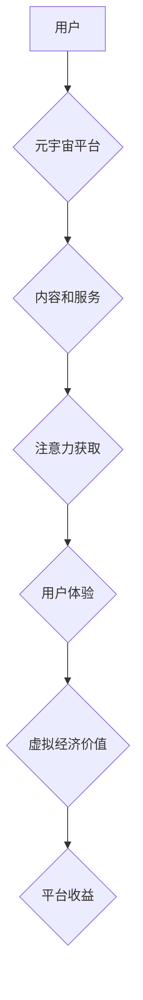

                 

## 注意力经济学理论:元宇宙中的价值重构

> 关键词：元宇宙、注意力经济学、价值重构、用户体验、数据驱动、沉浸式交互、虚拟经济

## 1. 背景介绍

元宇宙概念的兴起，标志着人类进入一个全新的数字世界。这个虚拟世界将以沉浸式交互、虚拟经济和持久化状态为核心特征，重塑人们的生活、工作和娱乐方式。然而，元宇宙的成功发展离不开对用户注意力资源的有效管理和利用。注意力，作为人类认知的核心资源，在元宇宙中将变得更加宝贵和稀缺。

注意力经济学理论，作为一种研究人类注意力分配和利用的学科，为理解和应对元宇宙中的注意力挑战提供了重要的理论框架。它强调，在信息爆炸的时代，注意力已经成为一种稀缺资源，而获取和保持用户注意力是企业和平台竞争的关键。

## 2. 核心概念与联系

**2.1 注意力经济学理论概述**

注意力经济学理论认为，注意力是人类最宝贵的资源之一，它决定了我们能够获取和处理信息的能力。在信息时代，注意力资源变得越来越稀缺，而获取和保持用户注意力的竞争日益激烈。

**2.2 元宇宙与注意力经济学的联系**

元宇宙是一个沉浸式、持久化、共享的虚拟世界，它将提供丰富的交互体验和虚拟经济活动。在这个虚拟世界中，用户将面临来自各种平台、应用和内容的注意力竞争。

* **沉浸式交互:** 元宇宙的沉浸式交互体验将更加吸引用户注意力，但同时也可能导致用户沉迷其中，难以抽离。
* **虚拟经济:** 元宇宙中的虚拟经济将提供新的价值创造和获取方式，但同时也可能引发用户对虚拟资产的过度关注和沉迷。
* **数据驱动:** 元宇宙将大量收集用户行为数据，这些数据可以被用于精准推送内容和广告，从而更加有效地获取和保持用户注意力。

**2.3 元宇宙注意力经济学模型**



## 3. 核心算法原理 & 具体操作步骤

**3.1 算法原理概述**

元宇宙中的注意力经济学算法主要围绕着以下几个核心目标：

* **用户注意力预测:** 利用用户行为数据和特征，预测用户对不同内容和服务的注意力倾向。
* **个性化内容推荐:** 根据用户注意力预测结果，推荐个性化内容和服务，提高用户参与度和留存率。
* **注意力分配优化:** 通过算法调节内容呈现顺序、交互方式和虚拟奖励机制，引导用户注意力分配到平台希望关注的领域。

**3.2 算法步骤详解**

1. **数据收集:** 收集用户在元宇宙平台中的行为数据，包括浏览记录、交互行为、停留时间、虚拟资产交易等。
2. **特征提取:** 从用户行为数据中提取特征，例如用户偏好、兴趣、行为模式、社交关系等。
3. **模型训练:** 利用机器学习算法，训练用户注意力预测模型，例如深度神经网络、强化学习等。
4. **个性化推荐:** 根据用户特征和注意力预测结果，推荐个性化内容和服务。
5. **注意力分配优化:** 通过算法调节内容呈现方式、交互方式和虚拟奖励机制，引导用户注意力分配到平台希望关注的领域。

**3.3 算法优缺点**

* **优点:**

    * 可以精准预测用户注意力，提高内容推荐的准确率。
    * 可以个性化定制用户体验，增强用户粘性。
    * 可以引导用户注意力分配，实现平台目标。

* **缺点:**

    * 需要大量用户行为数据进行训练，数据隐私和安全问题需要得到重视。
    * 算法可能会陷入“推荐茧房”效应，限制用户接触不同观点和信息。
    * 需要不断优化算法模型，应对用户行为变化和平台发展需求。

**3.4 算法应用领域**

* **内容推荐:** 推荐个性化新闻、视频、游戏等内容。
* **广告投放:** 精准推送广告，提高广告转化率。
* **虚拟经济:** 设计虚拟奖励机制，引导用户参与虚拟经济活动。
* **用户行为分析:** 分析用户行为模式，优化平台设计和运营策略。

## 4. 数学模型和公式 & 详细讲解 & 举例说明

**4.1 数学模型构建**

我们可以用一个简单的数学模型来描述用户注意力分配过程：

$$
Attention(c_i) = \frac{e^{score(c_i)}}{\sum_{j=1}^{N} e^{score(c_j)}}
$$

其中：

* $Attention(c_i)$ 表示用户对内容 $c_i$ 的注意力分配比例。
* $score(c_i)$ 表示内容 $c_i$ 的吸引力得分，可以根据用户特征、内容特征和上下文信息进行计算。
* $N$ 表示所有内容的数量。

**4.2 公式推导过程**

这个公式基于 softmax 函数，它将多个输入值映射到一个概率分布，其中每个值代表了对相应内容的注意力分配比例。

**4.3 案例分析与讲解**

假设我们有一个元宇宙平台，提供各种类型的虚拟内容，例如游戏、社交、学习等。我们可以根据用户兴趣、行为模式和内容类型计算每个内容的吸引力得分，然后利用上述公式计算用户对每个内容的注意力分配比例。

例如，如果用户对游戏类型内容更感兴趣，那么游戏类型的虚拟内容的吸引力得分会更高，用户对这些内容的注意力分配比例也会更大。

## 5. 项目实践：代码实例和详细解释说明

**5.1 开发环境搭建**

* Python 3.x
* TensorFlow 或 PyTorch 深度学习框架
* Jupyter Notebook 或 VS Code 开发环境

**5.2 源代码详细实现**

```python
import tensorflow as tf

# 定义用户特征和内容特征
user_features = tf.constant([[1, 0, 1], [0, 1, 0]])
content_features = tf.constant([[0.8, 0.2, 0.1], [0.1, 0.7, 0.2]])

# 定义注意力得分计算函数
def calculate_attention_score(user_features, content_features):
    # 使用点积操作计算用户和内容的相似度
    similarity = tf.reduce_sum(user_features * content_features, axis=1)
    return similarity

# 计算每个内容的注意力得分
attention_scores = calculate_attention_score(user_features, content_features)

# 使用 softmax 函数计算注意力分配比例
attention_distribution = tf.nn.softmax(attention_scores)

# 打印注意力分配比例
print(attention_distribution)
```

**5.3 代码解读与分析**

* 代码首先定义了用户特征和内容特征，这些特征可以根据实际情况进行调整。
* `calculate_attention_score` 函数使用点积操作计算用户和内容的相似度，作为注意力得分。
* `tf.nn.softmax` 函数将注意力得分转换为概率分布，表示用户对每个内容的注意力分配比例。

**5.4 运行结果展示**

运行代码后，会输出每个内容的注意力分配比例，例如：

```
tf.Tensor([0.7246835 , 0.2753165 ], shape=(2,), dtype=float32)
```

这表示用户1对第一个内容的注意力分配比例为0.7247，对第二个内容的注意力分配比例为0.2753。

## 6. 实际应用场景

**6.1 元宇宙游戏**

元宇宙游戏可以利用注意力经济学算法，个性化推荐游戏任务、道具和奖励，提高玩家参与度和游戏体验。

**6.2 元宇宙社交平台**

元宇宙社交平台可以利用注意力经济学算法，推荐感兴趣的用户和内容，增强用户互动和社交体验。

**6.3 元宇宙教育平台**

元宇宙教育平台可以利用注意力经济学算法，个性化推荐学习内容和互动方式，提高学习效率和用户学习兴趣。

**6.4 未来应用展望**

随着元宇宙技术的不断发展，注意力经济学理论将在元宇宙中发挥越来越重要的作用。未来，我们可以期待看到更多基于注意力经济学算法的创新应用，例如：

* **沉浸式广告:** 利用元宇宙的沉浸式交互体验，打造更具吸引力的广告形式。
* **虚拟身份定制:** 根据用户注意力偏好，个性化定制虚拟身份和形象。
* **注意力交易市场:** 建立注意力交易市场，用户可以将注意力资源出售给平台或其他用户。

## 7. 工具和资源推荐

**7.1 学习资源推荐**

* **书籍:**

    * 《注意力经济学》
    * 《元宇宙：下一个互联网》

* **在线课程:**

    * Coursera: 人工智能与深度学习
    * Udacity: 元宇宙开发

**7.2 开发工具推荐**

* **Unity:** 游戏引擎
* **Unreal Engine:** 游戏引擎
* **Blender:** 3D建模软件

**7.3 相关论文推荐**

* **Attention Is All You Need**
* **Transformer Networks for Language Translation**

## 8. 总结：未来发展趋势与挑战

**8.1 研究成果总结**

注意力经济学理论为理解和应对元宇宙中的注意力挑战提供了重要的理论框架。元宇宙中的注意力经济学算法可以精准预测用户注意力，个性化定制用户体验，引导用户注意力分配，实现平台目标。

**8.2 未来发展趋势**

未来，注意力经济学理论和算法将在元宇宙中得到更广泛的应用，例如沉浸式广告、虚拟身份定制、注意力交易市场等。

**8.3 面临的挑战**

* **数据隐私和安全:** 元宇宙平台需要收集大量用户行为数据，如何保护用户隐私和数据安全是一个重要的挑战。
* **算法公平性:** 注意力经济学算法可能会导致“推荐茧房”效应，限制用户接触不同观点和信息，需要关注算法公平性和可解释性。
* **伦理问题:** 元宇宙中的注意力经济学应用可能会引发一些伦理问题，例如用户注意力过度依赖、虚拟经济泡沫等，需要进行深入的伦理探讨和规范。

**8.4 研究展望**

未来研究方向包括：

* 开发更公平、更透明、更可解释的注意力经济学算法。
* 研究元宇宙中注意力经济学与用户心理、社会行为的相互影响。
* 探讨元宇宙中注意力经济学应用的伦理问题和社会影响。


## 9. 附录：常见问题与解答

**9.1 如何保护用户隐私和数据安全？**

元宇宙平台需要采取以下措施保护用户隐私和数据安全：

* 明确用户数据收集和使用政策，获得用户同意。
* 对用户数据进行匿名化处理，避免直接识别用户身份。
* 加强数据安全防护措施，防止数据泄露和滥用。

**9.2 如何避免“推荐茧房”效应？**

元宇宙平台可以采取以下措施避免“推荐茧房”效应：

* 提供多样化的内容推荐，避免过度推荐用户偏好的内容。
* 引导用户探索不同领域的内容和观点。
* 提供用户反馈机制，帮助平台改进推荐算法。

**9.3 元宇宙中的注意力经济学应用有哪些伦理问题？**

元宇宙中的注意力经济学应用可能会引发以下伦理问题：

* 用户注意力过度依赖，影响现实生活。
* 虚拟经济泡沫，导致用户沉迷和经济损失。
* 数据操控和信息茧房，影响用户认知和决策。

元宇宙平台需要认真思考这些伦理问题，制定相应的规范和制度，确保注意力经济学应用的健康发展。


作者：禅与计算机程序设计艺术 / Zen and the Art of Computer Programming 
<end_of_turn>

