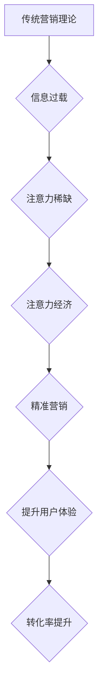

                 

## 1. 背景介绍

在信息爆炸的时代，人们每天面临着海量的信息涌入。从新闻推送到社交媒体，从电子邮件到广告，信息无处不在，却难以抓住人们的注意力。这使得传统的营销理论，以其“轰炸式”的传播方式，逐渐失去了效力。

传统营销理论的核心是通过大量曝光和重复宣传，将产品信息植入消费者脑海，从而影响消费决策。然而，在注意力经济时代，消费者对信息的筛选能力越来越强，他们更加精明地选择关注自己感兴趣的内容，并对广告和营销信息产生抵触情绪。

注意力经济的兴起，标志着一种新的营销 paradigm 的转变。它强调的是，在信息过载的时代，获取和保持消费者的注意力才是营销的核心。

## 2. 核心概念与联系

### 2.1 注意力经济

注意力经济是指在信息时代，注意力成为一种稀缺资源，而能够有效获取和利用注意力的人或组织，就拥有了巨大的经济价值。

### 2.2 传统营销理论

传统营销理论主要包括产品、价格、渠道和促销四大要素，以产品本身的价值和功能为核心，通过广告、促销等手段，向消费者传递信息，最终促成销售。

### 2.3 联系

注意力经济对传统营销理论提出了巨大的挑战。传统的营销方式，往往是“粗放式”的，难以精准地触达目标受众，更难以在信息过载的时代，抓住消费者的注意力。

**Mermaid 流程图**



## 3. 核心算法原理 & 具体操作步骤

### 3.1 算法原理概述

注意力机制的核心原理是模拟人类的注意力机制，通过学习和理解输入信息中的重要部分，从而提高模型的学习效率和准确性。

注意力机制的核心思想是，在处理序列数据时，不同位置的元素对模型的输出可能具有不同的重要性。注意力机制通过学习每个元素的重要性权重，从而对输入序列进行加权处理，突出重要信息，抑制无关信息。

### 3.2 算法步骤详解

1. **计算注意力权重:** 对于每个输入元素，计算其与输出元素之间的相关性，并将其转换为注意力权重。
2. **加权求和:** 将注意力权重与输入元素相乘，并对所有元素进行求和，得到加权后的输出。

### 3.3 算法优缺点

**优点:**

* 能够提高模型的学习效率和准确性。
* 能够更好地理解序列数据的上下文关系。
* 能够对输入信息进行可解释性分析。

**缺点:**

* 计算复杂度较高。
* 需要大量的训练数据。

### 3.4 算法应用领域

注意力机制在自然语言处理、计算机视觉、语音识别等领域都有广泛的应用。

## 4. 数学模型和公式 & 详细讲解 & 举例说明

### 4.1 数学模型构建

注意力机制的数学模型通常基于一个得分函数，该函数用来计算每个输入元素与输出元素之间的相关性。

**得分函数:**

$$
s_{i,j} = \text{score}(q_i, k_j)
$$

其中，$q_i$ 是查询向量，$k_j$ 是键向量，$s_{i,j}$ 是查询向量 $q_i$ 与键向量 $k_j$ 之间的得分。

**注意力权重:**

$$
a_{i,j} = \frac{\exp(s_{i,j})}{\sum_{l=1}^{n} \exp(s_{i,l})}
$$

其中，$a_{i,j}$ 是查询向量 $q_i$ 与键向量 $k_j$ 之间的注意力权重，$n$ 是输入序列的长度。

**加权求和:**

$$
o_i = \sum_{j=1}^{n} a_{i,j} v_j
$$

其中，$o_i$ 是输出向量，$v_j$ 是值向量。

### 4.2 公式推导过程

得分函数的具体形式可以根据不同的任务和模型而有所不同。常见的得分函数包括点积、余弦相似度和多层感知机。

注意力权重的计算公式是基于 softmax 函数，该函数将得分转换为概率分布，使得每个元素的注意力权重在 0 到 1 之间。

加权求和公式将注意力权重与值向量相乘，并对所有元素进行求和，得到最终的输出向量。

### 4.3 案例分析与讲解

例如，在机器翻译任务中，注意力机制可以帮助模型关注源语言句子中与目标语言句子相对应的关键词，从而提高翻译的准确性。

## 5. 项目实践：代码实例和详细解释说明

### 5.1 开发环境搭建

* Python 3.6+
* TensorFlow 2.0+
* PyTorch 1.0+

### 5.2 源代码详细实现

```python
import tensorflow as tf

# 定义注意力机制层
class AttentionLayer(tf.keras.layers.Layer):
    def __init__(self, units):
        super(AttentionLayer, self).__init__()
        self.Wq = tf.keras.layers.Dense(units)
        self.Wk = tf.keras.layers.Dense(units)
        self.Wv = tf.keras.layers.Dense(units)
        self.dense = tf.keras.layers.Dense(units)

    def call(self, inputs):
        Q = self.Wq(inputs)
        K = self.Wk(inputs)
        V = self.Wv(inputs)

        # 计算注意力权重
        attention_scores = tf.matmul(Q, K, transpose_b=True) / tf.math.sqrt(tf.cast(units, tf.float32))
        attention_weights = tf.nn.softmax(attention_scores, axis=-1)

        # 加权求和
        output = tf.matmul(attention_weights, V)
        return self.dense(output)

# 创建注意力机制模型
model = tf.keras.Sequential([
    tf.keras.layers.Embedding(input_dim=10000, output_dim=128),
    AttentionLayer(128),
    tf.keras.layers.Dense(10, activation='softmax')
])

# 编译模型
model.compile(optimizer='adam', loss='sparse_categorical_crossentropy', metrics=['accuracy'])

# 训练模型
model.fit(x_train, y_train, epochs=10)
```

### 5.3 代码解读与分析

* `AttentionLayer` 类定义了注意力机制层，包含三个稠密层用于计算查询向量、键向量和值向量，以及一个稠密层用于最终输出。
* `call` 方法实现了注意力机制的计算过程，包括计算注意力权重、加权求和和最终输出。
* `model` 对象创建了一个包含嵌入层、注意力机制层和全连接层的模型。
* `compile` 方法配置了模型的优化器、损失函数和评估指标。
* `fit` 方法训练了模型。

### 5.4 运行结果展示

训练完成后，可以评估模型的性能，并使用模型进行预测。

## 6. 实际应用场景

### 6.1 个性化推荐

注意力机制可以帮助电商平台根据用户的浏览历史、购买记录等信息，精准地推荐感兴趣的产品，提高用户体验和转化率。

### 6.2 内容推荐

社交媒体平台和新闻网站可以使用注意力机制，根据用户的阅读习惯和兴趣偏好，推荐个性化的内容，提高用户粘性和参与度。

### 6.3 广告投放

注意力机制可以帮助广告平台精准地投放广告，将广告信息展示给最有可能点击和购买的用户，提高广告效果和投资回报率。

### 6.4 未来应用展望

注意力机制在未来将有更广泛的应用场景，例如：

* **医疗诊断:** 利用注意力机制分析患者的病历和影像数据，提高疾病诊断的准确性。
* **金融风险控制:** 利用注意力机制识别潜在的金融风险，提高风险控制的效率。
* **自动驾驶:** 利用注意力机制帮助自动驾驶系统关注道路上的关键信息，提高驾驶安全性和可靠性。

## 7. 工具和资源推荐

### 7.1 学习资源推荐

* **书籍:**
    * 《深度学习》
    * 《自然语言处理》
* **在线课程:**
    * Coursera: 深度学习
    * Udacity: 自然语言处理
* **博客:**
    * TensorFlow Blog
    * PyTorch Blog

### 7.2 开发工具推荐

* **TensorFlow:** 开源深度学习框架
* **PyTorch:** 开源深度学习框架
* **Keras:** 高级深度学习 API

### 7.3 相关论文推荐

* **Attention Is All You Need**
* **BERT: Pre-training of Deep Bidirectional Transformers for Language Understanding**
* **Transformer-XL: Attentive Language Models Beyond a Fixed-Length Context**

## 8. 总结：未来发展趋势与挑战

### 8.1 研究成果总结

注意力机制在近年来取得了显著的进展，并在多个领域取得了优异的性能。

### 8.2 未来发展趋势

* **更有效的注意力机制:** 研究更有效的注意力机制，例如自注意力机制、多头注意力机制等，提高模型的学习效率和准确性。
* **注意力机制的解释性:** 研究注意力机制的解释性，使得模型的决策过程更加透明和可理解。
* **注意力机制的应用扩展:** 将注意力机制应用到更多领域，例如医疗、金融、自动驾驶等。

### 8.3 面临的挑战

* **计算复杂度:** 传统的注意力机制计算复杂度较高，难以应用于大规模数据和复杂任务。
* **数据依赖性:** 注意力机制的性能依赖于训练数据的质量和数量。
* **可解释性:** 注意力机制的决策过程难以解释，这限制了其在一些领域，例如医疗诊断等，的应用。

### 8.4 研究展望

未来，注意力机制的研究将继续朝着更有效、更可解释、更广泛应用的方向发展。

## 9. 附录：常见问题与解答

* **什么是注意力机制？**

注意力机制是一种模拟人类注意力机制的算法，能够帮助模型关注输入信息中的重要部分，提高学习效率和准确性。

* **注意力机制有哪些应用场景？**

注意力机制在自然语言处理、计算机视觉、语音识别等领域都有广泛的应用，例如个性化推荐、内容推荐、广告投放等。

* **如何理解注意力权重？**

注意力权重表示每个输入元素对模型输出的贡献程度，权重越高，表示该元素对模型输出的影响越大。

* **注意力机制的计算复杂度如何？**

传统的注意力机制计算复杂度较高，但随着算法的改进和硬件的进步，计算复杂度正在逐渐降低。

* **注意力机制的性能如何？**

注意力机制在多个领域取得了优异的性能，但其性能也依赖于训练数据的质量和数量。


作者：禅与计算机程序设计艺术 / Zen and the Art of Computer Programming 
<end_of_turn>

