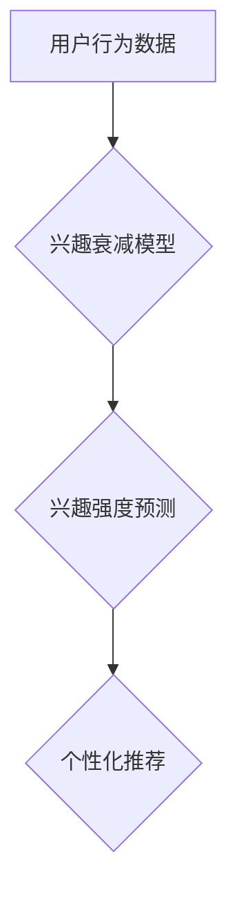

                 

## 深度学习在用户兴趣衰减建模中的创新

> 关键词：用户兴趣衰减、深度学习、推荐系统、序列建模、长短期记忆网络(LSTM)、注意力机制

## 1. 背景介绍

在数字时代，用户兴趣的动态变化是推荐系统面临的重大挑战。用户兴趣并非恒定不变，而是会随着时间推移、环境变化和新信息涌现而发生演变。用户兴趣衰减是指用户对特定内容或服务的兴趣强度随着时间的推移而逐渐降低的现象。 

传统推荐系统往往依赖于用户的历史行为数据，例如点击、购买、评分等，来预测用户的兴趣。然而，这些方法难以捕捉用户兴趣的动态性和复杂性，尤其是在面对快速变化的网络环境时。

深度学习技术的兴起为用户兴趣衰减建模提供了新的思路。深度学习模型能够从海量用户行为数据中学习到更复杂的模式和特征，从而更准确地预测用户的兴趣变化趋势。

## 2. 核心概念与联系

### 2.1 用户兴趣衰减模型

用户兴趣衰减模型旨在捕捉用户对特定内容或服务的兴趣强度随时间变化的规律。 

**核心概念：**

* **兴趣强度：** 用户对特定内容或服务的关注程度，可以用点击率、停留时间、评分等指标来衡量。
* **时间衰减：** 用户兴趣强度随时间推移而降低的趋势。
* **兴趣复苏：** 由于新信息、环境变化或其他因素，用户对特定内容或服务的兴趣重新激增的现象。

**模型架构：**



### 2.2 深度学习在用户兴趣衰减建模中的应用

深度学习模型能够学习到用户兴趣衰减的复杂非线性关系，并对用户兴趣进行更精准的预测。

**核心概念：**

* **序列建模：** 将用户行为数据视为时间序列，学习用户兴趣随时间变化的动态模式。
* **长短期记忆网络 (LSTM)：** 一种专门用于处理序列数据的深度学习模型，能够捕捉长期的依赖关系。
* **注意力机制：**  允许模型关注用户行为数据中的重要信息，提高预测精度。

## 3. 核心算法原理 & 具体操作步骤

### 3.1 算法原理概述

深度学习在用户兴趣衰减建模中的核心算法通常基于序列建模和深度神经网络。

**核心思想：**

* 将用户的历史行为数据作为输入，训练深度学习模型，学习用户兴趣随时间变化的规律。
* 利用 LSTM 网络捕捉用户兴趣的长期依赖关系，并使用注意力机制关注重要信息。
* 输出用户对特定内容或服务的兴趣强度预测。

### 3.2 算法步骤详解

1. **数据预处理：** 将用户行为数据进行清洗、格式化和编码，例如将时间戳转换为数字表示，将用户行为类别转换为独热编码。
2. **模型构建：** 选择合适的深度学习模型架构，例如 LSTM 网络，并定义模型参数。
3. **模型训练：** 使用训练数据训练深度学习模型，优化模型参数，使模型能够准确预测用户兴趣强度。
4. **模型评估：** 使用测试数据评估模型的性能，例如使用均方误差 (MSE) 或平均绝对误差 (MAE) 作为评价指标。
5. **模型部署：** 将训练好的模型部署到生产环境中，用于实时预测用户兴趣强度并进行个性化推荐。

### 3.3 算法优缺点

**优点：**

* 能够捕捉用户兴趣的复杂非线性关系。
* 能够学习到用户兴趣随时间变化的动态模式。
* 预测精度较高。

**缺点：**

* 需要大量的训练数据。
* 模型训练时间较长。
* 对硬件资源要求较高。

### 3.4 算法应用领域

* **推荐系统：** 预测用户对商品、视频、音乐等内容的兴趣，提供个性化推荐。
* **内容创作：** 预测用户对不同类型内容的偏好，帮助内容创作者创作更受欢迎的内容。
* **广告投放：** 预测用户对不同广告的兴趣，提高广告投放的精准度。

## 4. 数学模型和公式 & 详细讲解 & 举例说明

### 4.1 数学模型构建

用户兴趣衰减模型可以表示为一个时间序列模型，其中每个时间点代表用户对特定内容的兴趣强度。

**模型假设：**

* 用户兴趣强度随时间呈指数衰减。
* 用户兴趣衰减率是一个固定的参数。

**模型公式：**

$$
I(t) = I(0) * e^{- \lambda * t}
$$

其中：

* $I(t)$ 是用户在时间 $t$ 的兴趣强度。
* $I(0)$ 是用户在初始时间 $t=0$ 的兴趣强度。
* $\lambda$ 是用户兴趣衰减率。
* $t$ 是时间。

### 4.2 公式推导过程

该公式基于指数衰减函数的性质。指数衰减函数描述了随着时间的推移，一个量逐渐减少的趋势。

在用户兴趣衰减模型中，用户兴趣强度 $I(t)$ 与初始兴趣强度 $I(0)$ 成比例，并且随着时间 $t$ 的增加，指数项 $e^{- \lambda * t}$ 会逐渐减小，导致用户兴趣强度 $I(t)$ 也逐渐降低。

### 4.3 案例分析与讲解

假设用户在初始时间对某个商品的兴趣强度为 10，兴趣衰减率为 0.1。

根据公式，我们可以计算用户在不同时间点的兴趣强度：

* $t=1$ 时，$I(1) = 10 * e^{-0.1 * 1} = 9.05$
* $t=2$ 时，$I(2) = 10 * e^{-0.1 * 2} = 8.20$
* $t=3$ 时，$I(3) = 10 * e^{-0.1 * 3} = 7.43$

可以看出，随着时间的推移，用户的兴趣强度逐渐降低。

## 5. 项目实践：代码实例和详细解释说明

### 5.1 开发环境搭建

* Python 3.6+
* TensorFlow 2.0+
* Keras 2.0+
* Jupyter Notebook

### 5.2 源代码详细实现

```python
import tensorflow as tf
from tensorflow.keras.models import Sequential
from tensorflow.keras.layers import LSTM, Dense

# 定义模型
model = Sequential()
model.add(LSTM(units=64, return_sequences=True, input_shape=(timesteps, features)))
model.add(LSTM(units=32))
model.add(Dense(units=1))

# 编译模型
model.compile(loss='mean_squared_error', optimizer='adam')

# 训练模型
model.fit(X_train, y_train, epochs=10, batch_size=32)

# 评估模型
loss = model.evaluate(X_test, y_test)
print('Loss:', loss)

# 预测用户兴趣
predictions = model.predict(X_new)
```

### 5.3 代码解读与分析

* **数据预处理:** 首先需要将用户行为数据进行预处理，例如将时间戳转换为数字表示，将用户行为类别转换为独热编码。
* **模型构建:** 使用 Keras 库构建一个 LSTM 网络模型。
* **模型编译:** 使用均方误差 (MSE) 作为损失函数，使用 Adam 优化器进行模型训练。
* **模型训练:** 使用训练数据训练模型，设置训练轮数 (epochs) 和批处理大小 (batch_size)。
* **模型评估:** 使用测试数据评估模型的性能，计算损失值。
* **模型预测:** 使用训练好的模型预测用户对特定内容的兴趣强度。

### 5.4 运行结果展示

运行代码后，会输出模型的损失值以及对新数据的预测结果。

## 6. 实际应用场景

### 6.1 个性化推荐系统

深度学习在用户兴趣衰减建模中的应用可以提高推荐系统的个性化程度。

**应用场景：**

* **电商平台：** 根据用户的历史购买记录和浏览行为，预测用户对不同商品的兴趣强度，并推荐个性化的商品。
* **视频网站：** 根据用户的观看历史和点赞记录，预测用户对不同视频的兴趣强度，并推荐个性化的视频。
* **音乐平台：** 根据用户的播放历史和收藏记录，预测用户对不同音乐的兴趣强度，并推荐个性化的音乐。

### 6.2 内容创作与优化

深度学习可以帮助内容创作者了解用户对不同类型内容的偏好，并优化内容创作策略。

**应用场景：**

* **新闻网站：** 分析用户对不同新闻主题的兴趣强度，并根据用户偏好推荐相关新闻。
* **博客平台：** 分析用户对不同博客文章的阅读量和评论数，并根据用户兴趣推荐相关文章。
* **社交媒体平台：** 分析用户对不同类型的帖子和内容的互动情况，并根据用户兴趣推荐相关内容。

### 6.3 广告投放与精准营销

深度学习可以帮助广告商更精准地投放广告，提高广告效果。

**应用场景：**

* **搜索引擎广告：** 根据用户的搜索历史和浏览行为，预测用户对不同广告的兴趣强度，并精准投放广告。
* **社交媒体广告：** 根据用户的社交行为和兴趣爱好，预测用户对不同广告的兴趣强度，并精准投放广告。
* **移动应用广告：** 根据用户的移动设备使用情况和兴趣爱好，预测用户对不同广告的兴趣强度，并精准投放广告。

### 6.4 未来应用展望

随着深度学习技术的不断发展，用户兴趣衰减建模将有更广泛的应用场景。

**未来展望：**

* **多模态用户兴趣建模：** 将文本、图像、音频等多模态数据融合，构建更全面的用户兴趣模型。
* **动态用户兴趣建模：** 考虑用户兴趣随时间和环境变化的动态性，构建更灵活的用户兴趣模型。
* **个性化用户兴趣预测：** 基于用户的个性化特征，进行更精准的用户兴趣预测。

## 7. 工具和资源推荐

### 7.1 学习资源推荐

* **深度学习入门书籍：**
    * 《深度学习》 - Ian Goodfellow, Yoshua Bengio, Aaron Courville
    * 《动手学深度学习》 -  李沐
* **在线课程：**
    * Coursera: 深度学习 Specialization
    * Udacity: Deep Learning Nanodegree
* **开源库：**
    * TensorFlow
    * PyTorch

### 7.2 开发工具推荐

* **IDE:** PyCharm, VS Code
* **数据可视化工具:** Matplotlib, Seaborn
* **云计算平台:** AWS, Azure, GCP

### 7.3 相关论文推荐

* **《Recurrent Neural Networks for Sequence Learning》** - Sepp Hochreiter, Jürgen Schmidhuber
* **《Attention Is All You Need》** - Ashish Vaswani, Noam Shazeer, Niki Parmar, Jakob Uszkoreit, Llion Jones, Aidan N Gomez, Łukasz Kaiser, Illia Polosukhin
* **《Deep Learning for Recommender Systems》** -  K. Rendle,  A.  G.  Schütze

## 8. 总结：未来发展趋势与挑战

### 8.1 研究成果总结

深度学习在用户兴趣衰减建模领域取得了显著的成果，能够更准确地预测用户兴趣强度，并为个性化推荐、内容创作和广告投放等应用提供支持。

### 8.2 未来发展趋势

* **多模态用户兴趣建模:** 将文本、图像、音频等多模态数据融合，构建更全面的用户兴趣模型。
* **动态用户兴趣建模:** 考虑用户兴趣随时间和环境变化的动态性，构建更灵活的用户兴趣模型。
* **个性化用户兴趣预测:** 基于用户的个性化特征，进行更精准的用户兴趣预测。

### 8.3 面临的挑战

* **数据稀缺性:** 用户兴趣数据往往稀缺且不完整，这会影响模型的训练效果。
* **模型复杂度:** 深度学习模型往往具有很高的复杂度，需要大量的计算资源和时间进行训练。
* **解释性问题:** 深度学习模型的决策过程往往难以解释，这可能会导致用户对模型结果的信任度降低。

### 8.4 研究展望

未来，用户兴趣衰减建模的研究将继续朝着更准确、更灵活、更可解释的方向发展。


## 9. 附录：常见问题与解答

**Q1: 如何处理用户兴趣数据中的缺失值？**

**A1:** 可以使用多种方法处理用户兴趣数据中的缺失值，例如：

* **删除缺失值:** 如果缺失值较少，可以删除包含缺失值的样本。
* **插值法:** 使用平均值、中位数或其他插值方法填充缺失值。
* **机器学习模型:** 使用机器学习模型预测缺失值。

**Q2: 如何评估用户兴趣衰减模型的性能？**

**A2:** 可以使用多种指标评估用户兴趣衰减模型的性能，例如：

* **均方误差 (MSE):** 计算预测值与真实值的平方差的平均值。
* **平均绝对误差 (MAE):** 计算预测值与真实值的绝对差的平均值。
* **R-squared:** 计算模型解释的方差比例。

**Q3: 如何选择合适的深度学习模型架构？**

**A3:** 选择合适的深度学习模型架构需要根据具体应用场景和数据特点进行选择。

* **LSTM 网络:** 适用于处理时间序列数据，能够捕捉用户兴趣随时间变化的动态模式。
* **Transformer 网络:** 能够处理更长的序列数据，并具有更强的表达能力。

**Q4: 如何防止模型过拟合？**

**A4:** 可以使用多种方法防止模型过拟合，例如：

* **正则化:** 添加正则化项到损失函数中，惩罚模型的复杂度。
* **Dropout:** 在训练过程中随机丢弃一部分神经元，防止模型过依赖于特定的神经元。
* **数据增强:** 对训练数据进行随机变换，增加训练数据的多样性。


作者：禅与计算机程序设计艺术 / Zen and the Art of Computer Programming 
<end_of_turn>

