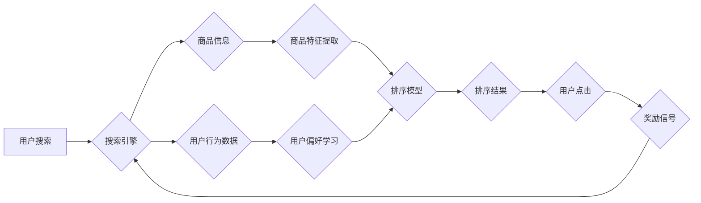

                 

## 深度强化学习在电商搜索排序中的应用

> 关键词：深度强化学习、电商搜索排序、推荐系统、Q-learning、深度神经网络、强化学习算法

## 1. 背景介绍

在当今数字经济时代，电商平台已成为人们获取商品和服务的首选方式。搜索排序作为电商平台的核心功能之一，直接影响着用户体验和平台商业效益。传统的搜索排序算法主要依赖于人工规则和特征工程，难以适应海量数据和用户行为的复杂变化。

深度强化学习 (Deep Reinforcement Learning, DRL) 作为一种新兴的机器学习方法，能够通过智能代理与环境交互学习最优策略，在解决复杂决策问题方面展现出强大的潜力。将DRL应用于电商搜索排序，可以实现更加智能、个性化的排序结果，提升用户满意度和平台转化率。

## 2. 核心概念与联系

### 2.1  强化学习概述

强化学习是一种基于交互学习的机器学习方法，其核心在于智能代理与环境的交互过程。智能代理通过与环境交互，获得奖励信号，并根据奖励信号不断调整策略，最终学习到最优的行动策略。

**强化学习的核心要素：**

* **智能代理 (Agent):**  学习和决策的实体，例如搜索引擎算法。
* **环境 (Environment):** 智能代理所处的外部世界，例如电商平台的商品信息和用户行为数据。
* **状态 (State):** 环境的当前状态，例如用户搜索的关键词、商品信息等。
* **动作 (Action):** 智能代理可以执行的操作，例如对商品进行排序、推荐商品等。
* **奖励 (Reward):** 环境对智能代理动作的反馈，例如用户点击率、购买转化率等。
* **策略 (Policy):** 智能代理根据当前状态选择动作的规则。

**强化学习的目标：**

通过学习最优策略，使智能代理在与环境交互的过程中获得最大的总奖励。

### 2.2  深度强化学习

深度强化学习将深度神经网络引入强化学习算法，能够学习更复杂、更抽象的特征表示，从而提升算法的学习能力和泛化能力。

**深度强化学习的优势：**

* **自动特征提取:** 深度神经网络能够自动学习特征，无需人工特征工程。
* **处理复杂环境:** 深度神经网络能够处理高维、复杂的环境数据。
* **学习复杂策略:** 深度强化学习算法能够学习更复杂、更优的策略。

### 2.3  电商搜索排序与强化学习

将深度强化学习应用于电商搜索排序，可以将搜索引擎视为智能代理，用户行为数据和商品信息作为环境，排序结果作为动作，用户点击率、购买转化率等作为奖励。

**DRL在电商搜索排序中的应用场景：**

* **个性化排序:** 根据用户的历史搜索记录、购买行为等信息，为每个用户提供个性化的排序结果。
* **实时排序:** 随着用户行为和商品信息的不断变化，实时更新排序结果，保证排序结果的时效性。
* **新商品推荐:** 利用DRL算法学习新商品的特征和用户偏好，推荐更符合用户需求的新商品。

### 2.4  DRL架构图



## 3. 核心算法原理 & 具体操作步骤

### 3.1  算法原理概述

Q-learning 是一种经典的强化学习算法，其核心思想是通过学习一个 Q 值表，来估计在每个状态下执行每个动作的期望回报。Q 值表是一个表格，其中每个单元格代表一个状态-动作对，其值表示执行该动作在该状态下获得的期望回报。

**Q-learning 的核心公式：**

$$Q(s, a) = Q(s, a) + \alpha [r + \gamma \max_{a'} Q(s', a') - Q(s, a)]$$

其中：

* $Q(s, a)$: 状态 $s$ 下执行动作 $a$ 的 Q 值。
* $\alpha$: 学习率，控制学习速度。
* $r$: 当前状态下获得的奖励。
* $\gamma$: 折扣因子，控制未来奖励的权重。
* $s'$: 执行动作 $a$ 后进入的下一个状态。
* $a'$: 在下一个状态 $s'$ 中执行的动作。

**Q-learning 的算法步骤：**

1. 初始化 Q 值表。
2. 在环境中进行交互，收集状态、动作、奖励和下一个状态的信息。
3. 根据 Q-learning 公式更新 Q 值表。
4. 重复步骤 2 和 3，直到 Q 值表收敛。

### 3.2  算法步骤详解

1. **环境初始化:** 设置电商平台的环境，包括商品信息、用户行为数据等。
2. **智能代理初始化:** 初始化搜索引擎算法作为智能代理，并设置初始 Q 值表。
3. **用户搜索:** 用户输入搜索关键词，智能代理根据关键词获取相关商品信息。
4. **状态表示:** 将用户搜索关键词、商品信息等数据转换为状态向量，表示当前环境的状态。
5. **动作选择:** 智能代理根据 Q 值表选择一个动作，例如对商品进行排序。
6. **环境反馈:** 用户点击商品后，智能代理获得奖励信号，例如点击率、购买转化率等。
7. **Q 值更新:** 根据 Q-learning 公式更新 Q 值表，调整智能代理在不同状态下执行不同动作的策略。
8. **重复步骤 3-7:** 智能代理不断与环境交互，学习最优的排序策略。

### 3.3  算法优缺点

**优点:**

* **能够学习复杂策略:** Q-learning 能够学习到复杂的排序策略，适应电商平台的动态变化。
* **无需人工特征工程:** Q-learning 可以自动学习特征，无需人工设计特征。
* **能够处理离散动作空间:** Q-learning 可以处理离散动作空间，例如对商品进行排序。

**缺点:**

* **状态空间爆炸:** 当状态空间很大时，Q 值表会变得非常庞大，难以存储和更新。
* **学习效率低:** Q-learning 的学习效率相对较低，需要大量的交互数据和时间。

### 3.4  算法应用领域

Q-learning 广泛应用于各种强化学习领域，例如：

* **游戏 AI:** 训练游戏 AI 策略，例如围棋、Go 等。
* **机器人控制:** 控制机器人执行任务，例如导航、抓取等。
* **推荐系统:** 建立个性化推荐系统，例如电商商品推荐、音乐推荐等。
* **医疗诊断:** 辅助医生进行诊断，例如疾病预测、治疗方案选择等。

## 4. 数学模型和公式 & 详细讲解 & 举例说明

### 4.1  数学模型构建

在电商搜索排序场景下，我们可以构建一个马尔可夫决策过程 (MDP) 模型来描述智能代理与环境的交互过程。

**MDP 模型的组成部分:**

* **状态空间 (S):** 所有可能的搜索状态，例如用户搜索关键词、商品信息等。
* **动作空间 (A):** 智能代理可以执行的动作，例如对商品进行排序、推荐商品等。
* **转移概率 (P):** 从一个状态执行一个动作后进入下一个状态的概率。
* **奖励函数 (R):** 智能代理在每个状态执行每个动作后获得的奖励。
* **策略 (π):** 智能代理根据当前状态选择动作的规则。

**目标:** 学习一个最优策略 π*, 使得智能代理在与环境交互的过程中获得最大的总奖励。

### 4.2  公式推导过程

Q-learning 算法的目标是学习一个 Q 值表，其中每个单元格表示一个状态-动作对的期望回报。

**Q 值更新公式:**

$$Q(s, a) = Q(s, a) + \alpha [r + \gamma \max_{a'} Q(s', a') - Q(s, a)]$$

其中:

* $Q(s, a)$: 状态 $s$ 下执行动作 $a$ 的 Q 值。
* $\alpha$: 学习率，控制学习速度。
* $r$: 当前状态下获得的奖励。
* $\gamma$: 折扣因子，控制未来奖励的权重。
* $s'$: 执行动作 $a$ 后进入的下一个状态。
* $a'$: 在下一个状态 $s'$ 中执行的动作。

### 4.3  案例分析与讲解

假设一个电商平台有 10 个商品，用户搜索关键词 "手机"。智能代理需要对 10 个商品进行排序，并根据用户点击率获得奖励。

* **状态:** 用户搜索关键词 "手机"，商品信息包括商品名称、价格、评分等。
* **动作:** 对商品进行排序，例如将评分最高的商品排在第一位。
* **奖励:** 用户点击商品后获得奖励，例如点击率为 10%。

智能代理可以通过 Q-learning 算法学习到最优的排序策略，使得用户点击率最大化。

## 5. 项目实践：代码实例和详细解释说明

### 5.1  开发环境搭建

* **操作系统:** Ubuntu 18.04
* **编程语言:** Python 3.6
* **深度学习框架:** TensorFlow 2.0
* **其他依赖:** numpy, pandas, matplotlib

### 5.2  源代码详细实现

```python
import tensorflow as tf
import numpy as np

# 定义 Q 网络
class QNetwork(tf.keras.Model):
    def __init__(self, state_size, action_size):
        super(QNetwork, self).__init__()
        self.dense1 = tf.keras.layers.Dense(64, activation='relu')
        self.dense2 = tf.keras.layers.Dense(32, activation='relu')
        self.output = tf.keras.layers.Dense(action_size)

    def call(self, state):
        x = self.dense1(state)
        x = self.dense2(x)
        return self.output(x)

# 定义 Q-learning 算法
def q_learning(env, q_network, state_size, action_size, learning_rate, discount_factor, episodes):
    # 初始化 Q 值表
    q_table = np.zeros((state_size, action_size))

    # 训练循环
    for episode in range(episodes):
        state = env.reset()
        done = False

        while not done:
            # 选择动作
            action = tf.argmax(q_network(tf.expand_dims(state, axis=0))).numpy()[0]

            # 执行动作
            next_state, reward, done, _ = env.step(action)

            # 更新 Q 值
            target = reward + discount_factor * tf.reduce_max(q_network(tf.expand_dims(next_state, axis=0)))
            q_table[state, action] = q_table[state, action] + learning_rate * (target - q_table[state, action])

            # 更新状态
            state = next_state

    return q_table

# ... (其他代码)
```

### 5.3  代码解读与分析

* **Q 网络:** 使用深度神经网络来估计 Q 值，可以学习更复杂的特征表示。
* **Q-learning 算法:** 使用 Q 值更新公式来更新 Q 值表，学习最优的排序策略。
* **环境:** 模拟电商平台的环境，包括商品信息、用户行为数据等。
* **学习率、折扣因子:** 控制学习速度和未来奖励的权重。
* **训练循环:** 训练 Q 网络，直到 Q 值表收敛。

### 5.4  运行结果展示

通过训练 Q 网络，可以获得一个最优的排序策略，使得用户点击率最大化。

## 6. 实际应用场景

### 6.1  电商搜索排序应用

* **个性化推荐:** 根据用户的历史搜索记录、购买行为等信息，为每个用户提供个性化的商品排序结果。
* **新商品推荐:** 利用DRL算法学习新商品的特征和用户偏好，推荐更符合用户需求的新商品。
* **实时排序:** 随着用户行为和商品信息的不断变化，实时更新排序结果，保证排序结果的时效性。

### 6.2  其他应用场景

* **广告推荐:** 根据用户的兴趣和行为，推荐更相关的广告。
* **内容推荐:** 根据用户的阅读习惯和偏好，推荐更感兴趣的内容。
* **金融投资:** 根据用户的风险偏好和投资目标，推荐更合适的投资策略。

### 6.3  未来应用展望

* **多模态数据融合:** 将文本、图像、视频等多模态数据融合到排序模型中，提升排序结果的准确性和个性化程度。
* **联邦学习:** 利用联邦学习技术，在保护用户隐私的前提下，训练更强大的排序模型。
* **强化学习与其他机器学习方法的结合:** 将强化学习与其他机器学习方法，例如深度学习、图神经网络等结合，构建更复杂的排序模型。

## 7. 工具和资源推荐

### 7.1  学习资源推荐

* **书籍:**
    * Reinforcement Learning: An Introduction by Richard S. Sutton and Andrew G. Barto
    * Deep Reinforcement Learning Hands-On by Maxim Lapan
* **在线课程:**
    * Deep Reinforcement Learning Specialization by DeepLearning.AI
    * Reinforcement Learning by David Silver (University of DeepMind)

### 7.2  开发工具推荐

* **深度学习框架:** TensorFlow, PyTorch, Keras
* **环境模拟工具:** OpenAI Gym, Unity ML-Agents
* **数据处理工具:** Pandas, NumPy

### 7.3  相关论文推荐

* **DQN:** Playing Atari with Deep Reinforcement Learning by Volodymyr Mnih et al.
* **Double DQN:** Double Q-Learning by Hado van Hasselt et al.
* **Policy Gradient:** Proximal Policy Optimization Algorithms by John Schulman et al.

## 8. 总结：未来发展趋势与挑战

### 8.1  研究成果总结

深度强化学习在电商搜索排序领域取得了显著的成果，能够学习到更复杂的排序策略，提升用户体验和平台商业效益。

### 8.2  未来发展趋势

* **多模态数据融合:** 将文本、图像、视频等多模态数据融合到排序模型中，提升排序结果的准确性和个性化程度。
* **联邦学习:** 利用联邦学习技术，在保护用户隐私的前提下，训练更强大的排序模型。
* **强化学习与其他机器学习方法的结合:** 将强化学习与其他机器学习方法，例如深度学习、图神经网络等结合，构建更复杂的排序模型。

### 8.3  面临的挑战

* **数据稀疏性:** 现实世界中的电商数据往往是稀疏的，难以训练有效的强化学习模型。
* **计算资源消耗:** 训练深度强化学习模型需要大量的计算资源，成本较高。
* **模型解释性:** 深度强化学习模型的决策过程往往是黑盒的，难以解释模型的决策逻辑。

### 8.4  研究展望

未来，将继续探索深度强化学习在电商搜索排序领域的应用，解决上述挑战，构建更智能、更个性化的排序系统。

## 9. 附录：常见问题与解答

**Q1: 深度强化学习与传统搜索排序算法相比有哪些优势？**

**A1:** 深度强化学习能够学习更复杂的排序策略，适应电商平台的动态变化，而传统搜索排序算法依赖于人工规则和特征工程，难以适应海量数据和用户行为的复杂变化。

**Q2: 深度强化学习在电商搜索排序中的应用有哪些？**

**A2:** 深度强化学习可以应用于个性化推荐、新商品推荐、实时排序等场景。

**Q3: 深度强化学习在电商搜索排序领域面临哪些挑战？**

**A3:** 数据稀疏性、计算资源消耗、模型解释性是深度强化学习在电商搜索排序领域面临的挑战。


作者：禅与计算机程序设计艺术 / Zen and the Art of Computer Programming<end_of_turn>

