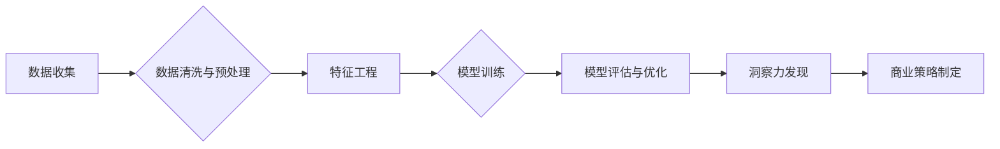

                 

## 理解洞察力的应用：在商业策略中的力量

> 关键词：洞察力、商业策略、数据分析、机器学习、人工智能、预测模型、商业决策

### 1. 背景介绍

在当今数据爆炸的时代，企业面临着前所未有的机遇和挑战。海量数据蕴藏着丰富的商业洞察力，但如何有效地挖掘和利用这些洞察力，将其转化为可行的商业策略，成为企业竞争的关键。洞察力，是指对复杂现象进行深入分析，识别出隐藏的模式、趋势和关系，从而获得对未来发展方向的深刻理解。

传统的商业决策往往依赖于经验和直觉，而数据驱动的洞察力则可以提供更客观、更精准的决策依据。通过运用数据分析、机器学习等先进技术，企业可以从海量数据中提取有价值的信息，构建预测模型，洞察市场趋势、客户需求、竞争对手动态等，为制定更有效的商业策略提供强有力的支持。

### 2. 核心概念与联系

**2.1 洞察力与商业策略的联系**

洞察力是商业策略的基石，它为战略制定提供数据支撑，帮助企业识别机会、规避风险，并制定更精准、更有效的行动计划。

**2.2 数据分析与机器学习在洞察力中的作用**

数据分析和机器学习是实现洞察力的关键技术。数据分析是指通过统计、挖掘等方法，从数据中提取有价值的信息，而机器学习则通过算法训练，使计算机能够从数据中学习，并进行预测和决策。

**2.3 洞察力应用的流程**



### 3. 核心算法原理 & 具体操作步骤

**3.1 算法原理概述**

在洞察力应用中，常用的算法包括：

* **聚类算法:** 将数据点根据相似性进行分组，用于发现客户群、市场细分等。
* **关联规则挖掘算法:** 发现数据中存在的关联关系，用于分析产品组合、推荐系统等。
* **预测模型算法:** 利用历史数据预测未来趋势，用于销售预测、风险评估等。

**3.2 算法步骤详解**

以聚类算法为例，其具体步骤如下：

1. **数据预处理:** 清洗、转换、标准化数据，使其适合聚类算法的输入。
2. **选择聚类算法:** 根据数据特点和需求选择合适的聚类算法，例如K-means、层次聚类等。
3. **设置聚类参数:** 确定聚类数量、距离度量等参数。
4. **执行聚类:** 运行聚类算法，将数据点划分为不同的簇。
5. **评估聚类结果:** 使用聚类评估指标，例如Silhouette score、Dunn index等，评估聚类效果。
6. **可视化结果:** 使用图表等方式可视化聚类结果，方便理解和分析。

**3.3 算法优缺点**

* **优点:** 可以发现数据中的隐藏模式和结构，帮助企业更好地理解数据。
* **缺点:** 聚类结果的解释性较弱，需要结合业务知识进行分析。

**3.4 算法应用领域**

* **客户细分:** 将客户根据消费习惯、购买行为等特征进行分组，制定针对性的营销策略。
* **市场分析:** 分析市场趋势、竞争对手动态，识别新的市场机会。
* **产品推荐:** 根据用户的购买历史和偏好，推荐相关的产品。

### 4. 数学模型和公式 & 详细讲解 & 举例说明

**4.1 数学模型构建**

在洞察力应用中，常用的数学模型包括：

* **线性回归模型:** 用于预测连续变量，例如销售额、价格等。
* **逻辑回归模型:** 用于预测分类变量，例如客户是否会购买产品、是否会流失等。
* **决策树模型:** 用于分类和预测，通过树状结构决策规则进行预测。

**4.2 公式推导过程**

以线性回归模型为例，其目标是找到一条直线，使得预测值与实际值之间的误差最小。

* **线性回归模型公式:**

$$y = \beta_0 + \beta_1x + \epsilon$$

其中：

* $y$ 是预测值
* $x$ 是输入变量
* $\beta_0$ 是截距
* $\beta_1$ 是斜率
* $\epsilon$ 是误差项

* **最小二乘法:**

最小二乘法是一种常用的优化方法，其目标是找到使得误差平方和最小的参数值。

$$SSE = \sum_{i=1}^{n}(y_i - \hat{y}_i)^2$$

其中：

* $SSE$ 是误差平方和
* $y_i$ 是实际值
* $\hat{y}_i$ 是预测值

**4.3 案例分析与讲解**

假设我们想要预测房屋价格，输入变量为房屋面积，目标是找到一条直线，使得预测价格与实际价格之间的误差最小。

我们可以收集房屋面积和价格的数据，使用最小二乘法训练线性回归模型，得到模型参数 $\beta_0$ 和 $\beta_1$。

然后，我们可以使用这个模型预测新的房屋价格。

### 5. 项目实践：代码实例和详细解释说明

**5.1 开发环境搭建**

* Python 3.x
* Jupyter Notebook
* pandas
* scikit-learn

**5.2 源代码详细实现**

```python
import pandas as pd
from sklearn.linear_model import LinearRegression
from sklearn.model_selection import train_test_split
from sklearn.metrics import mean_squared_error

# 加载数据
data = pd.read_csv('house_data.csv')

# 分割数据
X = data[['面积']]
y = data['价格']
X_train, X_test, y_train, y_test = train_test_split(X, y, test_size=0.2, random_state=42)

# 创建线性回归模型
model = LinearRegression()

# 训练模型
model.fit(X_train, y_train)

# 预测测试数据
y_pred = model.predict(X_test)

# 评估模型
mse = mean_squared_error(y_test, y_pred)
print(f'Mean Squared Error: {mse}')

# 打印模型参数
print(f'Intercept: {model.intercept_}')
print(f'Slope: {model.coef_}')
```

**5.3 代码解读与分析**

* 首先，我们加载数据，并将其分割为训练集和测试集。
* 然后，我们创建线性回归模型，并使用训练集训练模型。
* 接下来，我们使用训练好的模型预测测试数据，并评估模型的性能。
* 最后，我们打印模型的参数，以便了解模型的学习结果。

**5.4 运行结果展示**

运行代码后，会输出模型的性能指标，例如均方误差 (MSE)。

### 6. 实际应用场景

**6.1 客户关系管理 (CRM)**

* 通过分析客户数据，识别潜在客户、高价值客户，制定个性化营销策略。
* 预测客户流失风险，采取措施挽留客户。

**6.2 市场营销**

* 分析市场趋势，识别新的市场机会。
* 预测产品销量，优化库存管理。
* 评估营销活动效果，优化营销预算。

**6.3 产品开发**

* 分析用户需求，开发符合市场需求的产品。
* 预测产品生命周期，制定产品迭代策略。

**6.4 风险管理**

* 识别潜在风险，评估风险等级。
* 制定风险应对策略，降低风险损失。

**6.5 未来应用展望**

随着人工智能技术的不断发展，洞察力应用将更加广泛、更加深入。

* **更精准的预测:** 利用更先进的机器学习算法，实现更精准的预测。
* **更个性化的服务:** 通过对用户行为的深度分析，提供更个性化的服务。
* **更智能的决策:** 将洞察力应用于决策支持系统，帮助企业做出更智能的决策。

### 7. 工具和资源推荐

**7.1 学习资源推荐**

* **书籍:**
    * 《数据挖掘：概念与技术》
    * 《机器学习》
    * 《Python数据科学手册》
* **在线课程:**
    * Coursera: 数据科学、机器学习
    * edX: 数据分析、人工智能
* **网站:**
    * Kaggle: 数据科学竞赛平台
    * Towards Data Science: 数据科学博客平台

**7.2 开发工具推荐**

* **Python:** 数据分析、机器学习的常用编程语言
* **Jupyter Notebook:** 数据分析、机器学习的交互式开发环境
* **pandas:** 数据处理和分析库
* **scikit-learn:** 机器学习库
* **TensorFlow:** 深度学习库

**7.3 相关论文推荐**

* **《The Elements of Statistical Learning》**
* **《Pattern Recognition and Machine Learning》**
* **《Deep Learning》**

### 8. 总结：未来发展趋势与挑战

**8.1 研究成果总结**

近年来，洞察力应用取得了显著进展，在商业决策、市场营销、产品开发等领域发挥着越来越重要的作用。

**8.2 未来发展趋势**

* **更智能的洞察力:** 利用人工智能技术，实现更智能的洞察力，例如自动发现模式、生成预测报告。
* **更个性化的洞察力:** 根据用户的需求和偏好，提供更个性化的洞察力。
* **更可解释的洞察力:** 提高洞察力的可解释性，帮助用户更好地理解洞察力的来源和含义。

**8.3 面临的挑战**

* **数据质量:** 洞察力的准确性依赖于数据质量，如何保证数据准确、完整、一致性是一个挑战。
* **算法复杂性:** 一些洞察力算法非常复杂，需要专业的知识和技能才能理解和应用。
* **伦理问题:** 洞察力应用可能会涉及到隐私问题、算法偏见等伦理问题，需要谨慎对待。

**8.4 研究展望**

未来，洞察力应用将继续朝着更智能、更个性化、更可解释的方向发展。

### 9. 附录：常见问题与解答

* **Q1: 如何选择合适的洞察力算法？**

A1: 选择合适的洞察力算法需要根据数据特点和需求进行选择。例如，如果要预测连续变量，可以使用线性回归模型；如果要预测分类变量，可以使用逻辑回归模型。

* **Q2: 如何评估洞察力模型的性能？**

A2: 可以使用各种评估指标来评估洞察力模型的性能，例如均方误差 (MSE)、R-squared 等。

* **Q3: 如何解决数据质量问题？**

A3: 可以通过数据清洗、数据预处理等方法来解决数据质量问题。


作者：禅与计算机程序设计艺术 / Zen and the Art of Computer Programming 
<end_of_turn>

