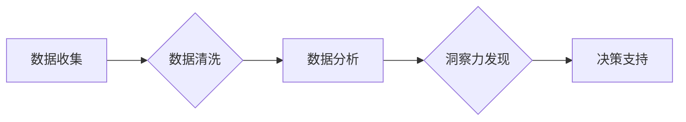

                 

## 理解洞察力：复杂世界中的导航仪

> 关键词：人工智能、洞察力、复杂系统、数据分析、机器学习、模式识别、预测建模、决策支持

### 1. 背景介绍

当今世界，信息爆炸式增长，数据无处不在。从社交媒体的实时动态到金融市场的波动趋势，从医疗诊断的精准分析到城市交通的智能管理，海量数据蕴藏着丰富的洞察力，为我们提供理解复杂世界、做出明智决策的指引。然而，如何从海量数据中提取有价值的洞察力，并将其转化为可操作的知识，是摆在我们面前的重大挑战。

传统的数据分析方法往往局限于描述性统计和简单的关联分析，难以应对复杂系统中隐藏的深层模式和非线性关系。而人工智能技术的兴起，特别是机器学习和深度学习的突破，为我们提供了全新的工具和方法，让我们能够更深入地理解复杂世界，挖掘更深层的洞察力。

### 2. 核心概念与联系

**2.1 洞察力**

洞察力是指从数据中发现隐藏的模式、趋势和关系，并将其转化为有价值的知识和见解的能力。它不仅是数据分析的结果，更是一种思考和理解的能力，需要结合领域知识、经验和直觉进行综合判断。

**2.2 复杂系统**

复杂系统是指由众多相互作用的个体组成的系统，其整体行为难以通过简单地分析个体行为来预测。复杂系统具有以下特征：

* **非线性性:** 系统的输出与输入之间存在非线性的关系，微小的变化可能导致巨大的影响。
* **自组织性:** 系统能够自发地形成结构和模式，无需外部控制。
* **反馈机制:** 系统内部存在反馈机制，可以调节和改变系统的行为。
* **异质性:** 系统中的个体具有不同的属性和行为。

**2.3 人工智能**

人工智能是指模拟人类智能的计算机系统。机器学习作为人工智能的重要分支，通过算法学习数据中的模式，并根据学习到的知识进行预测和决策。

**2.4 数据分析**

数据分析是指从数据中提取有价值的信息的过程。它包括数据收集、清洗、整理、分析和可视化等步骤。

**2.5 关联分析**

关联分析是指发现数据中不同属性之间的关联关系的过程。例如，发现哪些商品经常被一起购买。

**2.6 模式识别**

模式识别是指识别数据中存在的模式和规律的过程。例如，识别图像中的物体、语音中的说话人等。

**2.7 预测建模**

预测建模是指根据历史数据预测未来事件的过程。例如，预测股票价格、客户流失率等。

**2.8 决策支持**

决策支持是指利用数据分析和洞察力来辅助决策的过程。例如，帮助企业制定营销策略、优化运营流程等。

**Mermaid 流程图**



### 3. 核心算法原理 & 具体操作步骤

**3.1 算法原理概述**

在复杂世界中，洞察力的发现往往依赖于机器学习算法的应用。机器学习算法能够从海量数据中学习模式和规律，并将其应用于预测和决策。常见的机器学习算法包括：

* **监督学习:** 利用标记数据训练模型，例如分类和回归问题。
* **无监督学习:** 从未标记数据中发现模式和结构，例如聚类和降维。
* **强化学习:** 通过试错学习，在环境中获得最大奖励。

**3.2 算法步骤详解**

机器学习算法的具体操作步骤通常包括以下几个阶段：

1. **数据预处理:** 清洗、转换和格式化数据，使其适合模型训练。
2. **特征工程:** 从原始数据中提取有价值的特征，用于模型训练。
3. **模型选择:** 根据具体问题选择合适的机器学习算法。
4. **模型训练:** 利用训练数据训练模型，学习数据中的模式和规律。
5. **模型评估:** 利用测试数据评估模型的性能，并进行调参优化。
6. **模型部署:** 将训练好的模型部署到实际应用场景中。

**3.3 算法优缺点**

不同的机器学习算法具有不同的优缺点，需要根据具体问题选择合适的算法。例如，决策树算法易于理解和解释，但泛化能力较弱；支持向量机算法具有较强的泛化能力，但训练时间较长。

**3.4 算法应用领域**

机器学习算法广泛应用于各个领域，例如：

* **医疗诊断:** 辅助医生诊断疾病，预测患者的风险。
* **金融风险管理:** 识别欺诈交易，预测市场风险。
* **推荐系统:** 为用户推荐个性化的商品和服务。
* **自然语言处理:** 进行文本分类、机器翻译、语音识别等任务。

### 4. 数学模型和公式 & 详细讲解 & 举例说明

**4.1 数学模型构建**

机器学习算法通常基于数学模型进行构建。例如，线性回归模型假设数据之间存在线性关系，可以使用以下公式进行建模：

$$y = mx + c$$

其中，$y$ 是预测值，$x$ 是输入特征，$m$ 是斜率，$c$ 是截距。

**4.2 公式推导过程**

机器学习算法的训练过程通常涉及优化模型参数的过程。例如，线性回归模型的训练过程可以通过最小化预测误差来实现。预测误差可以使用均方误差 (MSE) 来衡量：

$$MSE = \frac{1}{n} \sum_{i=1}^{n} (y_i - \hat{y}_i)^2$$

其中，$n$ 是样本数量，$y_i$ 是真实值，$\hat{y}_i$ 是预测值。

通过梯度下降算法，可以迭代更新模型参数，使得 MSE 最小化。

**4.3 案例分析与讲解**

假设我们想要预测房价，输入特征包括房屋面积、房间数量、地理位置等。我们可以使用线性回归模型进行建模，并利用训练数据训练模型。

训练完成后，我们可以使用模型预测新房子的价格。例如，如果新房子的面积为 100 平方米，房间数量为 3 个，地理位置在市中心，我们可以将这些特征输入到模型中，得到预测价格。

### 5. 项目实践：代码实例和详细解释说明

**5.1 开发环境搭建**

为了实现机器学习项目，我们需要搭建相应的开发环境。常用的开发环境包括：

* **Python:** Python 是机器学习领域最常用的编程语言，拥有丰富的机器学习库，例如 scikit-learn、TensorFlow、PyTorch 等。
* **Jupyter Notebook:** Jupyter Notebook 是一个交互式编程环境，方便进行机器学习代码的编写和调试。
* **云计算平台:** 云计算平台，例如 AWS、Azure、GCP 等，提供强大的计算资源和机器学习服务。

**5.2 源代码详细实现**

以下是一个使用 Python 和 scikit-learn 库实现线性回归模型的代码示例：

```python
from sklearn.linear_model import LinearRegression
from sklearn.model_selection import train_test_split
from sklearn.metrics import mean_squared_error

# 加载数据
data = ...

# 将数据分为训练集和测试集
X_train, X_test, y_train, y_test = train_test_split(data.drop('price', axis=1), data['price'], test_size=0.2)

# 创建线性回归模型
model = LinearRegression()

# 训练模型
model.fit(X_train, y_train)

# 预测测试集数据
y_pred = model.predict(X_test)

# 计算均方误差
mse = mean_squared_error(y_test, y_pred)

# 打印结果
print(f'均方误差: {mse}')
```

**5.3 代码解读与分析**

这段代码首先加载数据，然后将数据分为训练集和测试集。接着，创建线性回归模型，并使用训练集训练模型。最后，使用训练好的模型预测测试集数据，并计算均方误差来评估模型性能。

**5.4 运行结果展示**

运行这段代码后，会输出模型的均方误差值。均方误差值越小，模型的预测精度越高。

### 6. 实际应用场景

**6.1 医疗诊断**

机器学习算法可以用于辅助医生诊断疾病，例如根据患者的症状、病史和检查结果预测疾病的可能性。

**6.2 金融风险管理**

机器学习算法可以用于识别欺诈交易、预测市场风险和评估客户的信用风险。

**6.3 推荐系统**

机器学习算法可以用于构建个性化的推荐系统，例如推荐用户可能感兴趣的商品、电影或音乐。

**6.4 其他应用场景**

机器学习算法还广泛应用于其他领域，例如自然语言处理、图像识别、语音识别、机器人控制等。

**6.5 未来应用展望**

随着人工智能技术的不断发展，机器学习算法将在更多领域得到应用，为我们带来更加智能化、个性化和便捷的生活体验。

### 7. 工具和资源推荐

**7.1 学习资源推荐**

* **在线课程:** Coursera、edX、Udacity 等平台提供丰富的机器学习课程。
* **书籍:** 《机器学习》 (周志华)、《深入理解机器学习》 (李航) 等书籍是机器学习学习的经典教材。
* **博客和论坛:** 机器学习相关的博客和论坛，例如 Towards Data Science、Machine Learning Mastery 等，可以帮助你了解最新的机器学习进展和应用案例。

**7.2 开发工具推荐**

* **Python:** Python 是机器学习领域最常用的编程语言。
* **scikit-learn:** scikit-learn 是 Python 的一个机器学习库，提供各种常用的机器学习算法。
* **TensorFlow:** TensorFlow 是 Google 开发的一个开源机器学习框架，支持深度学习。
* **PyTorch:** PyTorch 是 Facebook 开发的一个开源机器学习框架，也支持深度学习。

**7.3 相关论文推荐**

* **《机器学习》 (周志华)**
* **《深入理解机器学习》 (李航)**
* **《Pattern Recognition and Machine Learning》 (Christopher M. Bishop)**

### 8. 总结：未来发展趋势与挑战

**8.1 研究成果总结**

近年来，人工智能领域取得了长足的进步，特别是机器学习算法在各个领域的应用取得了显著的成果。

**8.2 未来发展趋势**

未来，人工智能技术将继续发展，并对我们的生活产生更深远的影响。一些重要的发展趋势包括：

* **深度学习的进一步发展:** 深度学习算法将继续取得突破，应用于更复杂的任务，例如图像识别、自然语言处理等。
* **迁移学习和联邦学习的兴起:** 迁移学习和联邦学习可以帮助模型在有限数据情况下进行训练，并保护用户隐私。
* **人工智能的解释性和可信度:** 如何提高人工智能模型的解释性和可信度，使其能够被人们更好地理解和信任，是未来研究的重要方向。

**8.3 面临的挑战**

人工智能技术的发展也面临着一些挑战，例如：

* **数据安全和隐私保护:** 人工智能算法依赖于大量数据，如何确保数据的安全和隐私保护是重要的挑战。
* **算法偏见和公平性:** 人工智能算法可能存在偏见，导致不公平的结果。如何解决算法偏见和确保公平性是重要的研究课题。
* **人工智能的伦理问题:** 人工智能技术的应用可能引发一些伦理问题，例如人工智能的责任和义务、人工智能对就业的影响等。

**8.4 研究展望**

未来，人工智能研究将继续朝着更智能、更安全、更可信的方向发展。我们需要加强跨学科合作，解决人工智能技术带来的挑战，并将其应用于造福人类的领域。

### 9. 附录：常见问题与解答

**9.1 如何选择合适的机器学习算法？**

选择合适的机器学习算法需要根据具体问题和数据特点进行考虑。例如，对于分类问题，可以考虑使用决策树、支持向量机或神经网络等算法；对于回归问题，可以考虑使用线性回归、逻辑回归或支持向量回归等算法。

**9.2 如何评估机器学习模型的性能？**

机器学习模型的性能可以通过各种指标进行评估，例如准确率、召回率、F1-score、均方误差等。

**9.3 如何解决机器学习算法中的过拟合问题？**

过拟合是指模型对训练数据过拟合，导致在测试数据上表现不佳。解决过拟合问题的方法包括：

* **增加训练数据量**
* **使用正则化技术**
* **使用交叉验证**
* **减少模型复杂度**


作者：禅与计算机程序设计艺术 / Zen and the Art of Computer Programming 
<end_of_turn>

