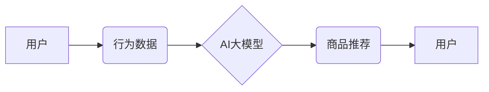

                 

## 电商平台个性化推送：AI大模型的精准营销

> 关键词：电商平台、个性化推送、AI大模型、精准营销、推荐系统、深度学习、Transformer模型

## 1. 背景介绍

在当今数据爆炸的时代，电商平台面临着巨大的用户群体和海量商品信息。如何精准地将合适的商品推荐给合适的用户，成为了提升用户体验、促进交易的关键。传统的基于规则的推荐系统难以应对用户行为的多样性和商品信息的复杂性，而基于机器学习的推荐系统则凭借其强大的数据挖掘和模式识别能力，逐渐成为电商平台个性化推送的主流方案。

近年来，随着深度学习技术的飞速发展，特别是Transformer模型的出现，AI大模型在推荐系统领域展现出巨大的潜力。AI大模型能够学习用户和商品之间的复杂关系，并生成更精准、更个性化的推荐结果。本文将深入探讨AI大模型在电商平台个性化推送中的应用，分析其核心概念、算法原理、实践案例以及未来发展趋势。

## 2. 核心概念与联系

### 2.1 个性化推送

个性化推送是指根据用户的兴趣、偏好、行为等信息，为其提供定制化的商品推荐，以提升用户体验和转化率。

### 2.2 AI大模型

AI大模型是指在海量数据上训练的深度学习模型，拥有强大的泛化能力和学习能力，能够处理复杂的任务，例如自然语言处理、图像识别、推荐系统等。

### 2.3 推荐系统

推荐系统是根据用户的历史行为、偏好和上下文信息，预测用户对特定商品的兴趣，并将其推荐给用户的技术系统。

**核心概念与联系流程图:**



## 3. 核心算法原理 & 具体操作步骤

### 3.1 算法原理概述

AI大模型在电商平台个性化推送中，主要采用基于深度学习的协同过滤算法和内容过滤算法。

* **协同过滤算法:** 

根据用户的历史行为数据，预测用户对特定商品的兴趣。

* **内容过滤算法:** 

根据商品的特征信息，预测用户对特定商品的兴趣。

### 3.2 算法步骤详解

**协同过滤算法步骤:**

1. **数据收集:** 收集用户行为数据，例如浏览记录、购买记录、评分等。
2. **用户-商品矩阵构建:** 将用户和商品信息构建成一个用户-商品矩阵，其中每个元素表示用户对商品的评分或交互行为。
3. **相似用户/商品挖掘:** 使用协同过滤算法，例如基于用户的协同过滤或基于物品的协同过滤，挖掘与目标用户相似的用户或与目标商品相似的商品。
4. **推荐生成:** 根据相似用户或商品的评分或交互行为，预测目标用户对特定商品的兴趣，并生成推荐结果。

**内容过滤算法步骤:**

1. **商品特征提取:** 从商品信息中提取特征，例如商品类别、品牌、价格、描述等。
2. **用户兴趣建模:** 根据用户的历史行为数据，构建用户兴趣模型，例如用户偏好的商品类别、品牌、价格等。
3. **推荐生成:** 根据商品特征和用户兴趣模型，预测用户对特定商品的兴趣，并生成推荐结果。

### 3.3 算法优缺点

**协同过滤算法:**

* **优点:** 能够发现用户之间的隐性关系，推荐更个性化的商品。
* **缺点:** 数据稀疏性问题，当用户行为数据不足时，算法效果会下降。

**内容过滤算法:**

* **优点:** 不需要用户行为数据，能够推荐与用户兴趣相符的商品。
* **缺点:** 难以发现用户之间的隐性关系，推荐结果可能不够个性化。

### 3.4 算法应用领域

* **电商平台:** 个性化商品推荐、用户画像分析、精准营销。
* **社交媒体:** 内容推荐、用户兴趣挖掘、广告投放。
* **音乐平台:** 音乐推荐、用户偏好分析、音乐发现。
* **视频平台:** 视频推荐、用户兴趣分析、内容创作。

## 4. 数学模型和公式 & 详细讲解 & 举例说明

### 4.1 数学模型构建

协同过滤算法的核心是用户-商品矩阵，可以使用矩阵分解模型来进行建模。

假设用户集合为U，商品集合为I，用户-商品交互矩阵为R，其中R(u,i)表示用户u对商品i的评分或交互行为。

矩阵分解模型的目标是将用户-商品矩阵分解成两个低维矩阵，分别表示用户特征矩阵和商品特征矩阵。

* **用户特征矩阵:**  U ∈ R^(|U|×k)，其中k为隐特征维度。
* **商品特征矩阵:**  V ∈ R^(|I|×k)。

则用户-商品交互矩阵R可以表示为：

$$R \approx U V^T$$

其中，$U V^T$表示用户特征矩阵和商品特征矩阵的点积。

### 4.2 公式推导过程

可以使用最小二乘法来优化矩阵U和V，目标函数为：

$$L(U,V) = \sum_{u \in U, i \in I} (R(u,i) - U(u,:) V(i,:))^2$$

其中，$U(u,:)$表示用户u的特征向量，$V(i,:)$表示商品i的特征向量。

通过梯度下降算法，可以迭代更新U和V，使得目标函数L最小化。

### 4.3 案例分析与讲解

假设有一个用户-商品交互矩阵，其中用户集合为U = {1, 2, 3}, 商品集合为I = {A, B, C}, 矩阵R如下：

```
    A  B  C
1  5  3  4
2  4  5  2
3  3  2  5
```

可以使用矩阵分解模型将这个矩阵分解成两个低维矩阵，例如k=2。

通过优化目标函数，可以得到用户特征矩阵U和商品特征矩阵V，然后可以根据这两个矩阵，预测用户对未交互过的商品的兴趣。

## 5. 项目实践：代码实例和详细解释说明

### 5.1 开发环境搭建

* Python 3.x
* TensorFlow/PyTorch
* Jupyter Notebook

### 5.2 源代码详细实现

```python
import tensorflow as tf

# 定义用户-商品交互矩阵
R = tf.constant([[5, 3, 4],
                 [4, 5, 2],
                 [3, 2, 5]])

# 定义隐特征维度
k = 2

# 定义用户特征矩阵和商品特征矩阵
U = tf.Variable(tf.random.normal([3, k]))
V = tf.Variable(tf.random.normal([3, k]))

# 定义损失函数
def loss_function(R, U, V):
  return tf.reduce_mean(tf.square(R - tf.matmul(U, V, transpose_b=True)))

# 定义优化器
optimizer = tf.keras.optimizers.Adam()

# 训练模型
for epoch in range(100):
  with tf.GradientTape() as tape:
    loss = loss_function(R, U, V)
  gradients = tape.gradient(loss, [U, V])
  optimizer.apply_gradients(zip(gradients, [U, V]))

# 打印训练结果
print("训练完成！")
print("用户特征矩阵：\n", U.numpy())
print("商品特征矩阵：\n", V.numpy())
```

### 5.3 代码解读与分析

* 代码首先定义了用户-商品交互矩阵R，隐特征维度k，以及用户特征矩阵U和商品特征矩阵V。
* 然后定义了损失函数，用于衡量模型预测结果与真实交互矩阵之间的误差。
* 使用Adam优化器来更新用户特征矩阵和商品特征矩阵，使得损失函数最小化。
* 最后打印训练完成后的用户特征矩阵和商品特征矩阵。

### 5.4 运行结果展示

训练完成后，可以得到用户特征矩阵和商品特征矩阵，这些矩阵可以用于预测用户对未交互过的商品的兴趣。

## 6. 实际应用场景

### 6.1 商品推荐

电商平台可以根据用户的历史购买记录、浏览记录、评分等数据，使用AI大模型进行商品推荐，推荐用户可能感兴趣的商品。

### 6.2 用户画像分析

AI大模型可以分析用户的行为数据，构建用户画像，了解用户的兴趣爱好、消费习惯等信息，为精准营销提供数据支持。

### 6.3 精准营销

电商平台可以根据用户的画像信息，进行精准营销，例如推送个性化的优惠券、广告等，提升营销效果。

### 6.4 未来应用展望

* **多模态推荐:** 将文本、图像、视频等多模态数据融合到推荐系统中，提供更丰富的用户体验。
* **个性化内容创作:** 使用AI大模型生成个性化的商品描述、广告文案等，提升营销效果。
* **实时推荐:** 基于用户的实时行为数据，进行实时推荐，提升用户体验。

## 7. 工具和资源推荐

### 7.1 学习资源推荐

* **书籍:**
    * Deep Learning by Ian Goodfellow, Yoshua Bengio, and Aaron Courville
    * Hands-On Machine Learning with Scikit-Learn, Keras & TensorFlow by Aurélien Géron
* **在线课程:**
    * TensorFlow官方教程
    * PyTorch官方教程
    * Coursera上的深度学习课程

### 7.2 开发工具推荐

* **TensorFlow:** 开源深度学习框架
* **PyTorch:** 开源深度学习框架
* **Scikit-learn:** 机器学习库

### 7.3 相关论文推荐

* **Attention Is All You Need:** https://arxiv.org/abs/1706.03762
* **BERT: Pre-training of Deep Bidirectional Transformers for Language Understanding:** https://arxiv.org/abs/1810.04805

## 8. 总结：未来发展趋势与挑战

### 8.1 研究成果总结

AI大模型在电商平台个性化推送领域取得了显著成果，能够提供更精准、更个性化的推荐结果，提升用户体验和转化率。

### 8.2 未来发展趋势

* **模型规模和能力提升:** 随着计算资源的不断发展，AI大模型的规模和能力将不断提升，能够处理更复杂的任务，提供更精准的推荐结果。
* **多模态融合:** 将文本、图像、视频等多模态数据融合到推荐系统中，提供更丰富的用户体验。
* **个性化内容创作:** 使用AI大模型生成个性化的商品描述、广告文案等，提升营销效果。

### 8.3 面临的挑战

* **数据隐私和安全:** AI大模型需要大量用户数据进行训练，如何保护用户数据隐私和安全是一个重要的挑战。
* **模型解释性和可信度:** AI大模型的决策过程往往是复杂的，难以解释，如何提高模型的解释性和可信度是一个重要的研究方向。
* **算法公平性和偏见:** AI大模型可能存在算法公平性和偏见问题，需要进行充分的测试和评估，确保推荐结果公平公正。

### 8.4 研究展望

未来，AI大模型在电商平台个性化推送领域将继续发挥重要作用，并不断发展和完善。研究者将继续探索新的模型架构、训练方法和应用场景，以提升推荐系统的精准度、个性化程度和用户体验。

## 9. 附录：常见问题与解答

* **Q: AI大模型的训练需要多少数据？**

A: AI大模型的训练需要大量的训练数据，通常需要百万甚至数百万条数据才能达到较好的效果。

* **Q: 如何评估AI大模型的推荐效果？**

A: 可以使用各种指标来评估AI大模型的推荐效果，例如点击率、转化率、用户满意度等。

* **Q: 如何解决AI大模型的过拟合问题？**

A: 可以使用正则化技术、数据增强、交叉验证等方法来解决AI大模型的过拟合问题。


作者：禅与计算机程序设计艺术 / Zen and the Art of Computer Programming 
<end_of_turn>

