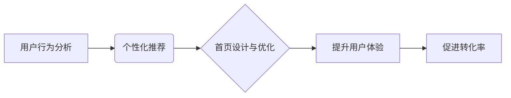

                 

## 电商平台中的个性化首页设计与优化

> 关键词：个性化推荐、电商平台、首页设计、机器学习、用户行为分析、A/B测试、深度学习、推荐算法

## 1. 背景介绍

在当今竞争激烈的电商市场中，用户体验至关重要。个性化首页设计与优化已成为电商平台提升用户粘性、促进转化率的关键策略。传统电商平台首页通常采用静态模板，无法满足用户多样化的需求。个性化首页则通过对用户行为、偏好和历史数据进行分析，为每个用户定制独一无二的首页内容，从而提升用户体验和商业价值。

## 2. 核心概念与联系

### 2.1 个性化推荐

个性化推荐是指根据用户的历史行为、偏好和属性，推荐与用户需求相匹配的商品、内容或服务。它旨在提升用户体验，引导用户发现感兴趣的产品，并最终促进交易。

### 2.2 用户行为分析

用户行为分析是指通过收集和分析用户在电商平台上的行为数据，例如浏览记录、购买历史、评价反馈等，以了解用户的兴趣、需求和购物习惯。这些数据是个性化推荐的基础，也是优化首页设计的关键依据。

### 2.3 首页设计与优化

首页设计是指根据平台目标和用户需求，规划和设计电商平台的首页布局、内容结构和视觉风格。首页优化是指通过数据分析和A/B测试，不断调整和改进首页设计，以提升用户体验和转化率。

**核心概念架构图:**



## 3. 核心算法原理 & 具体操作步骤

### 3.1 算法原理概述

个性化推荐算法的核心是根据用户的历史行为和特征，预测用户对特定商品的兴趣和购买意愿。常用的算法包括：

* **基于内容的推荐算法:** 根据商品的属性和用户喜欢的商品属性进行匹配。
* **基于协同过滤的推荐算法:** 根据与用户兴趣相似的其他用户的购买行为进行推荐。
* **基于深度学习的推荐算法:** 利用深度神经网络学习用户行为和商品特征之间的复杂关系，进行更精准的推荐。

### 3.2 算法步骤详解

以基于协同过滤的推荐算法为例，其具体步骤如下：

1. **数据收集:** 收集用户历史购买记录、浏览记录、评分等行为数据。
2. **用户-商品矩阵构建:** 将用户和商品作为行和列，构建一个用户-商品交互矩阵。
3. **相似用户/商品计算:** 使用余弦相似度等算法计算用户之间的相似度或商品之间的相似度。
4. **推荐生成:** 为每个用户推荐与其相似用户购买过的商品，或与其兴趣相似的商品。

### 3.3 算法优缺点

**基于协同过滤的推荐算法:**

* **优点:** 可以发现用户之间的隐性关系，推荐更个性化的商品。
* **缺点:** 数据稀疏性问题，新用户和新商品难以推荐。

### 3.4 算法应用领域

个性化推荐算法广泛应用于电商平台、视频网站、音乐平台等领域，例如：

* **商品推荐:** 为用户推荐相关的商品。
* **内容推荐:** 为用户推荐感兴趣的新闻、视频、音乐等内容。
* **广告推荐:** 为用户推荐相关的广告。

## 4. 数学模型和公式 & 详细讲解 & 举例说明

### 4.1 数学模型构建

基于协同过滤的推荐算法可以构建如下数学模型：

* **用户相似度:** 使用余弦相似度计算用户之间的相似度：

$$
sim(u_i, u_j) = \frac{u_i \cdot u_j}{||u_i|| ||u_j||}
$$

其中，$u_i$ 和 $u_j$ 分别表示用户 $i$ 和用户 $j$ 的特征向量，$ \cdot $ 表示点积，$||u_i||$ 和 $||u_j||$ 分别表示用户 $i$ 和用户 $j$ 的特征向量长度。

* **商品推荐:** 为用户 $u_i$ 推荐商品 $m$，可以使用以下公式：

$$
score(u_i, m) = \sum_{u_j \in N(u_i)} sim(u_i, u_j) * r(u_j, m)
$$

其中，$N(u_i)$ 表示与用户 $u_i$ 相似的用户集合，$r(u_j, m)$ 表示用户 $u_j$ 对商品 $m$ 的评分。

### 4.2 公式推导过程

* **余弦相似度:** 余弦相似度度量两个向量的夹角，值域在 [ -1, 1 ] 之间，其中 1 表示完全相似，-1 表示完全相反，0 表示不相关。

* **推荐评分:** 推荐评分是基于用户相似度和用户对商品的评分进行加权平均计算的。

### 4.3 案例分析与讲解

假设有两个用户 $u_1$ 和 $u_2$，他们对以下商品的评分如下：

| 商品 | $u_1$ | $u_2$ |
|---|---|---|
| A | 5 | 4 |
| B | 3 | 5 |
| C | 4 | 3 |

我们可以计算用户 $u_1$ 和 $u_2$ 的余弦相似度：

$$
sim(u_1, u_2) = \frac{(5*4 + 3*5 + 4*3)}{(sqrt(5^2 + 3^2 + 4^2))*(sqrt(4^2 + 5^2 + 3^2))}
$$

假设用户 $u_3$ 对商品 A 的评分为 3，则可以使用公式计算用户 $u_1$ 对商品 A 的推荐评分：

$$
score(u_1, A) = sim(u_1, u_2) * r(u_2, A)
$$

## 5. 项目实践：代码实例和详细解释说明

### 5.1 开发环境搭建

* Python 3.x
* Pandas
* Scikit-learn
* TensorFlow/PyTorch

### 5.2 源代码详细实现

```python
import pandas as pd
from sklearn.metrics.pairwise import cosine_similarity

# 加载用户-商品交互数据
data = pd.read_csv('user_item_data.csv')

# 构建用户-商品矩阵
user_item_matrix = data.pivot_table(index='user_id', columns='item_id', values='rating')

# 计算用户相似度
user_similarity = cosine_similarity(user_item_matrix)

# 为用户推荐商品
def recommend_items(user_id, top_n=5):
    # 获取用户相似用户
    similar_users = user_similarity[user_id].argsort()[:-top_n-1:-1]

    # 获取相似用户喜欢的商品
    recommended_items = []
    for similar_user in similar_users:
        # 获取相似用户喜欢的商品
        similar_user_items = user_item_matrix.loc[similar_user].index[user_item_matrix.loc[similar_user] > 0]
        # 添加到推荐列表
        recommended_items.extend(similar_user_items)

    # 去除重复商品
    recommended_items = list(set(recommended_items))

    return recommended_items

# 获取用户 ID
user_id = 1

# 推荐商品
recommendations = recommend_items(user_id)

# 打印推荐结果
print(f'推荐给用户 {user_id} 的商品：{recommendations}')
```

### 5.3 代码解读与分析

* 代码首先加载用户-商品交互数据，并构建用户-商品矩阵。
* 然后使用余弦相似度计算用户之间的相似度。
* `recommend_items` 函数根据用户 ID 和推荐数量，获取用户相似用户，并推荐相似用户喜欢的商品。
* 最后，代码打印推荐结果。

### 5.4 运行结果展示

运行代码后，将输出用户 1 的推荐商品列表。

## 6. 实际应用场景

个性化首页设计与优化在电商平台的实际应用场景非常广泛，例如：

* **商品推荐:** 为用户推荐与其兴趣相符的商品，提升用户购物体验和转化率。
* **内容推荐:** 为用户推荐与其兴趣相符的新闻、视频、博客等内容，增强用户粘性。
* **广告推荐:** 为用户推荐与其兴趣相符的广告，提升广告精准度和转化率。

### 6.4 未来应用展望

随着人工智能技术的不断发展，个性化首页设计与优化将更加智能化和精准化。未来，个性化首页将更加注重用户的情感、价值观和生活方式等多维度的个性化需求，提供更加个性化、定制化的体验。

## 7. 工具和资源推荐

### 7.1 学习资源推荐

* **书籍:**
    * 《推荐系统实践》
    * 《深度学习》
* **在线课程:**
    * Coursera: Recommender Systems
    * Udacity: Deep Learning Nanodegree

### 7.2 开发工具推荐

* **Python:** 
    * Pandas
    * Scikit-learn
    * TensorFlow/PyTorch
* **数据库:**
    * MySQL
    * MongoDB

### 7.3 相关论文推荐

* **Collaborative Filtering for Implicit Feedback Datasets**
* **Deep Learning for Recommender Systems**

## 8. 总结：未来发展趋势与挑战

### 8.1 研究成果总结

个性化首页设计与优化已取得了显著成果，为电商平台提升用户体验和商业价值提供了有效手段。

### 8.2 未来发展趋势

* **更精准的推荐:** 利用深度学习等先进算法，更加精准地预测用户需求。
* **多维度的个性化:** 考虑用户的情感、价值观、生活方式等多维度的个性化需求。
* **实时个性化:** 基于用户实时行为，动态调整首页内容。

### 8.3 面临的挑战

* **数据稀疏性:** 新用户和新商品难以推荐。
* **冷启动问题:** 新用户和新商品缺乏历史数据。
* **用户隐私保护:** 如何平衡个性化推荐和用户隐私保护。

### 8.4 研究展望

未来，个性化首页设计与优化将继续朝着更精准、更智能、更个性化的方向发展，为用户提供更加丰富的体验。


## 9. 附录：常见问题与解答

* **Q: 如何解决数据稀疏性问题？**

* **A:** 可以使用矩阵分解、协同过滤等算法，从有限的数据中挖掘潜在的模式。

* **Q: 如何解决冷启动问题？**

* **A:** 可以利用用户画像、商品属性等信息，对新用户和新商品进行初始推荐。

* **Q: 如何平衡个性化推荐和用户隐私保护？**

* **A:** 可以采用匿名化处理、数据加密等技术，保护用户隐私。


作者：禅与计算机程序设计艺术 / Zen and the Art of Computer Programming 
<end_of_turn>

