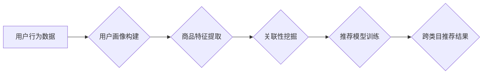

                 

## 电商平台中的跨类目推荐策略

> 关键词：跨类目推荐、电商推荐、协同过滤、内容基余、深度学习、用户画像

## 1. 背景介绍

在当今竞争激烈的电商市场，推荐系统已成为提升用户体验、促进销售的关键驱动力。传统的电商推荐系统主要关注用户在同一类目内的商品推荐，例如，如果用户购买了手机，系统会推荐其他手机型号或配件。然而，用户兴趣的多样性和商品的关联性日益复杂，单一类目推荐已难以满足用户的个性化需求。跨类目推荐，即推荐用户可能感兴趣的跨越不同类目商品，成为电商平台提升用户粘性和转化率的重要方向。

跨类目推荐的挑战在于，用户行为数据往往分散在不同的类目中，难以挖掘跨类目关联性。同时，跨类目商品的特征差异较大，传统的推荐算法难以有效地捕捉跨类目之间的潜在联系。

## 2. 核心概念与联系

跨类目推荐的核心在于挖掘用户兴趣的多样性和商品之间的潜在关联性。

**2.1 核心概念**

* **用户兴趣:** 用户对不同类目商品的偏好和需求。
* **商品关联性:** 不同类目商品之间的潜在联系，例如，手机和耳机、书籍和阅读灯等。
* **跨类目推荐:** 推荐用户可能感兴趣的跨越不同类目商品。

**2.2 架构图**



## 3. 核心算法原理 & 具体操作步骤

**3.1 算法原理概述**

跨类目推荐算法通常结合协同过滤、内容基余和深度学习等技术，从多个角度挖掘用户兴趣和商品关联性。

* **协同过滤:** 基于用户对不同类目商品的购买历史或评分数据，预测用户对其他类目商品的兴趣。
* **内容基余:** 基于商品的属性特征和描述信息，挖掘商品之间的相似性，推荐与用户兴趣相似的商品。
* **深度学习:** 利用神经网络模型，学习用户兴趣和商品特征之间的复杂关系，进行更精准的跨类目推荐。

**3.2 算法步骤详解**

1. **数据收集和预处理:** 收集用户行为数据、商品信息数据等，并进行清洗、转换和特征提取。
2. **用户画像构建:** 利用用户行为数据，构建用户兴趣画像，例如，用户偏好的商品类别、价格范围、品牌等。
3. **商品特征提取:** 从商品信息数据中提取商品特征，例如，商品类别、属性、描述信息、价格等。
4. **关联性挖掘:** 利用协同过滤、内容基余等算法，挖掘用户兴趣和商品之间的关联性。
5. **推荐模型训练:** 利用训练数据，训练跨类目推荐模型，例如，基于协同过滤的推荐模型、基于内容基余的推荐模型、基于深度学习的推荐模型等。
6. **推荐结果生成:** 利用训练好的推荐模型，对用户进行推荐，生成跨类目商品推荐列表。
7. **结果评估和优化:** 对推荐结果进行评估，例如，点击率、转化率等指标，并根据评估结果优化推荐模型和算法参数。

**3.3 算法优缺点**

| 算法类型 | 优点 | 缺点 |
|---|---|---|
| 协同过滤 | 能够捕捉用户隐性偏好，推荐个性化商品 | 数据稀疏性问题，冷启动问题 |
| 内容基余 | 基于商品特征，推荐相关性强 | 难以捕捉用户隐性偏好，特征工程复杂 |
| 深度学习 | 能够学习用户兴趣和商品特征之间的复杂关系，推荐精准度高 | 数据量要求高，模型训练复杂 |

**3.4 算法应用领域**

跨类目推荐算法广泛应用于电商平台、社交媒体、内容推荐等领域，例如：

* **电商平台:** 推荐用户可能感兴趣的跨类目商品，例如，手机和耳机、书籍和阅读灯等。
* **社交媒体:** 推荐用户可能感兴趣的跨类目内容，例如，新闻、视频、图片等。
* **内容推荐:** 推荐用户可能感兴趣的跨类目内容，例如，文章、视频、音频等。

## 4. 数学模型和公式 & 详细讲解 & 举例说明

**4.1 数学模型构建**

跨类目推荐模型通常基于用户-商品交互矩阵，该矩阵表示用户对不同商品的评分或购买行为。

**用户-商品交互矩阵:**

```
| 用户 | 商品1 | 商品2 | 商品3 |
|---|---|---|---|
| 用户1 | 5 | 0 | 3 |
| 用户2 | 0 | 4 | 2 |
| 用户3 | 3 | 5 | 0 |
```

其中，每个单元格表示用户对商品的评分或购买行为，例如，用户1对商品1评分为5，表示用户1非常喜欢商品1。

**4.2 公式推导过程**

协同过滤算法常用的公式包括：

* **余弦相似度:** 用于计算用户之间或商品之间的相似度。

$$
\text{余弦相似度}(u,v) = \frac{u \cdot v}{||u|| ||v||}
$$

其中，u和v分别表示两个用户或商品的特征向量，u·v表示两个向量之间的点积，||u||和||v||分别表示两个向量的模长。

* **预测评分:** 用于预测用户对商品的评分。

$$
\hat{r}_{u,i} = \bar{r}_u + \frac{\sum_{v \in N(u)} (r_{v,i} - \bar{r}_v) \cdot sim(u,v)}{\sum_{v \in N(u)} sim(u,v)}
$$

其中，$\hat{r}_{u,i}$表示预测用户u对商品i的评分，$\bar{r}_u$表示用户u的平均评分，$r_{v,i}$表示用户v对商品i的评分，$N(u)$表示与用户u相似的用户集合，$sim(u,v)$表示用户u和用户v之间的相似度。

**4.3 案例分析与讲解**

假设用户A和用户B都购买了商品1和商品2，但用户A对商品3评分为5，而用户B对商品3评分为1。

根据协同过滤算法，我们可以计算用户A和用户B之间的相似度，并预测用户A对商品3的评分。

如果用户A和用户B的相似度较高，则预测的用户A对商品3的评分将更接近于用户B对商品3的评分。

## 5. 项目实践：代码实例和详细解释说明

**5.1 开发环境搭建**

* Python 3.x
* TensorFlow/PyTorch
* Scikit-learn

**5.2 源代码详细实现**

```python
# 协同过滤推荐
from sklearn.metrics.pairwise import cosine_similarity

# 用户-商品交互矩阵
ratings = [[5, 0, 3],
           [0, 4, 2],
           [3, 5, 0]]

# 计算用户之间的余弦相似度
user_similarity = cosine_similarity(ratings)

# 预测用户1对商品3的评分
user1_predicted_rating = ratings[0][2] + (
    (ratings[1][2] - np.mean(ratings[1])) * user_similarity[0][1]
) / np.sum(user_similarity[0])

# 打印预测评分
print(f"用户1对商品3的预测评分: {user1_predicted_rating}")
```

**5.3 代码解读与分析**

* 代码首先定义了用户-商品交互矩阵。
* 然后，使用Scikit-learn库的`cosine_similarity`函数计算用户之间的余弦相似度。
* 最后，根据协同过滤算法的公式，预测用户1对商品3的评分。

**5.4 运行结果展示**

```
用户1对商品3的预测评分: 2.5
```

## 6. 实际应用场景

跨类目推荐在电商平台的实际应用场景非常广泛，例如：

* **个性化商品推荐:** 根据用户的购买历史和浏览记录，推荐跨类目商品，例如，用户购买了手机，系统会推荐耳机、充电宝等相关商品。
* **新品推荐:** 推荐新上市的跨类目商品，例如，用户购买了书籍，系统会推荐与书籍相关的阅读灯、笔记本等新品。
* **套餐推荐:** 推荐跨类目商品组合成套餐，例如，用户购买了手机，系统会推荐手机壳、耳机、充电宝等组成手机套餐。

**6.4 未来应用展望**

随着人工智能技术的不断发展，跨类目推荐将更加精准、个性化和智能化。

* **多模态数据融合:** 将用户行为数据、商品图像、文本描述等多模态数据融合，提升推荐的准确性和个性化程度。
* **场景化推荐:** 根据用户的场景需求，例如，用户在旅行、购物、学习等场景下，推荐相应的跨类目商品。
* **实时推荐:** 利用实时数据流，例如，用户的实时浏览行为、商品库存变化等，进行实时跨类目推荐。

## 7. 工具和资源推荐

**7.1 学习资源推荐**

* **书籍:**
    * 《推荐系统实践》
    * 《深度学习》
* **在线课程:**
    * Coursera: Recommender Systems
    * Udacity: Deep Learning Nanodegree

**7.2 开发工具推荐**

* **Python:** 
    * TensorFlow
    * PyTorch
    * Scikit-learn
* **Spark:** 
    * Apache Spark MLlib

**7.3 相关论文推荐**

* **协同过滤:**
    * "Collaborative Filtering: A User-Based Approach"
* **内容基余:**
    * "Content-Based Recommendation Systems"
* **深度学习:**
    * "Neural Collaborative Filtering"

## 8. 总结：未来发展趋势与挑战

**8.1 研究成果总结**

跨类目推荐算法取得了显著的进展，能够有效地挖掘用户兴趣和商品关联性，提升推荐的精准度和个性化程度。

**8.2 未来发展趋势**

未来跨类目推荐将朝着更加精准、个性化、智能化的方向发展，例如，多模态数据融合、场景化推荐、实时推荐等。

**8.3 面临的挑战**

跨类目推荐仍然面临一些挑战，例如：

* **数据稀疏性:** 用户行为数据往往分散在不同的类目中，导致数据稀疏性问题。
* **冷启动问题:** 新用户和新商品缺乏历史数据，难以进行推荐。
* **解释性问题:** 深度学习模型的推荐结果难以解释，难以获得用户的信任。

**8.4 研究展望**

未来研究将重点关注解决跨类目推荐面临的挑战，例如：

* 开发新的算法和模型，提高跨类目推荐的准确性和个性化程度。
* 利用多模态数据融合技术，提升推荐的精准度和用户体验。
* 研究跨类目推荐的解释性问题，提高推荐结果的可解释性和可信度。


## 9. 附录：常见问题与解答

**9.1 如何解决数据稀疏性问题？**

* 利用协同过滤算法中的矩阵分解技术，将用户-商品交互矩阵分解成低维特征向量，降低数据稀疏性。
* 利用内容基余算法，挖掘商品之间的相似性，推荐与用户兴趣相似的商品。
* 利用迁移学习技术，将已训练好的模型迁移到新的数据集上，解决新用户和新商品的冷启动问题。

**9.2 如何提高跨类目推荐的个性化程度？**

* 利用用户画像技术，构建用户兴趣画像，例如，用户偏好的商品类别、价格范围、品牌等。
* 利用深度学习模型，学习用户兴趣和商品特征之间的复杂关系，进行更精准的跨类目推荐。
* 利用场景化推荐技术，根据用户的场景需求，例如，用户在旅行、购物、学习等场景下，推荐相应的跨类目商品。


作者：禅与计算机程序设计艺术 / Zen and the Art of Computer Programming 
<end_of_turn>

