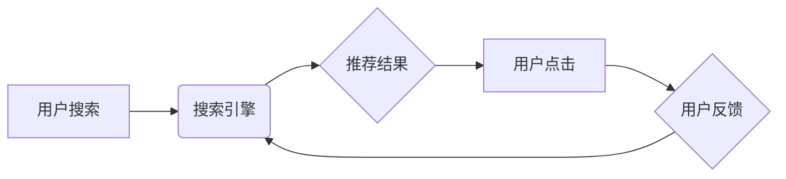

                 

## 电商平台的AI 大模型实践：搜索推荐系统是核心，用户体验是重点

> 关键词：电商平台、AI大模型、搜索推荐系统、用户体验、深度学习、Transformer、个性化推荐、协同过滤、内容基元匹配

## 1. 背景介绍

在当今数字经济时代，电商平台已成为人们获取商品和服务的首选方式。随着用户数量的激增和商品种类繁多的发展，电商平台面临着巨大的挑战，如何精准推荐用户感兴趣的商品，提升用户体验，成为平台发展的重要课题。

传统电商平台的搜索推荐系统主要依赖于规则引擎和基于内容的过滤方法，这些方法难以捕捉用户行为的复杂性和商品属性的多样性，推荐结果往往缺乏个性化和精准度。近年来，随着深度学习技术的快速发展，AI大模型在电商平台的应用日益广泛，特别是搜索推荐系统领域，AI大模型的应用为提升用户体验带来了新的机遇。

## 2. 核心概念与联系

**2.1 核心概念**

* **AI大模型:** 指规模庞大、训练数据海量、具备泛化能力强的深度学习模型。
* **搜索推荐系统:**  旨在根据用户搜索行为和历史偏好，推荐相关商品的系统。
* **用户体验:** 指用户使用电商平台时感受到的整体感受，包括搜索结果的准确性、推荐结果的个性化、平台的易用性等。

**2.2 架构关系**



**2.3 联系分析**

AI大模型在电商平台的搜索推荐系统中扮演着核心角色。它可以学习用户行为模式、商品属性特征以及用户与商品之间的交互关系，从而提供更精准、个性化的推荐结果。

用户搜索时，搜索引擎会根据用户的关键词进行匹配，并结合AI大模型的推荐结果，展示给用户。用户点击推荐结果后，系统会收集用户反馈信息，并将其反馈给AI大模型，用于模型的持续学习和优化。

## 3. 核心算法原理 & 具体操作步骤

**3.1 算法原理概述**

电商平台的搜索推荐系统通常采用多种算法相结合的方式，例如：

* **协同过滤:**  根据用户的历史购买行为和相似用户的购买行为，预测用户对特定商品的兴趣。
* **内容基元匹配:**  根据商品的属性特征和用户的搜索关键词进行匹配，推荐相关商品。
* **深度学习:**  利用深度神经网络学习用户行为模式和商品属性特征，实现更精准的推荐。

**3.2 算法步骤详解**

以协同过滤算法为例，其具体操作步骤如下：

1. **数据收集:** 收集用户购买历史数据、商品属性数据等。
2. **用户和商品相似度计算:**  利用余弦相似度等方法计算用户之间的相似度和商品之间的相似度。
3. **推荐结果生成:**  根据用户与其他用户的相似度，推荐其他用户购买过的商品。
4. **结果排序:**  根据推荐结果的相似度和用户历史行为等因素，对推荐结果进行排序。

**3.3 算法优缺点**

* **协同过滤:**
    * **优点:**  能够发现用户隐性偏好，推荐个性化商品。
    * **缺点:**  数据稀疏性问题，新用户和新商品推荐效果较差。
* **内容基元匹配:**
    * **优点:**  易于理解和实现，推荐结果更直接。
    * **缺点:**  难以捕捉用户隐性偏好，推荐结果可能不够个性化。
* **深度学习:**
    * **优点:**  能够学习复杂的用户行为模式和商品属性特征，推荐效果更精准。
    * **缺点:**  训练数据量大，模型复杂度高，需要强大的计算资源。

**3.4 算法应用领域**

* **电商平台:**  商品推荐、用户画像、个性化营销等。
* **社交媒体:**  内容推荐、用户兴趣匹配、广告投放等。
* **音乐平台:**  歌曲推荐、用户音乐偏好分析等。
* **视频平台:**  视频推荐、用户观看习惯分析等。

## 4. 数学模型和公式 & 详细讲解 & 举例说明

**4.1 数学模型构建**

协同过滤算法的核心是用户-商品交互矩阵，该矩阵表示用户对商品的评分或购买行为。

假设有N个用户和M个商品，则用户-商品交互矩阵可以表示为一个N x M的矩阵，其中每个元素代表用户对商品的评分或购买行为。

**4.2 公式推导过程**

协同过滤算法常用的相似度计算方法是余弦相似度。

余弦相似度公式如下：

$$
\text{相似度} = \frac{\mathbf{u} \cdot \mathbf{v}}{\|\mathbf{u}\| \|\mathbf{v}\|}
$$

其中：

* $\mathbf{u}$ 和 $\mathbf{v}$ 是两个向量的表示，分别代表两个用户的评分或购买行为。
* $\cdot$ 表示向量的点积。
* $\|\mathbf{u}\|$ 和 $\|\mathbf{v}\|$ 分别表示两个向量的模长。

**4.3 案例分析与讲解**

假设有两个用户A和B，他们的评分或购买行为分别为：

* 用户A:  商品1: 5, 商品2: 3, 商品3: 4
* 用户B:  商品1: 4, 商品2: 5, 商品3: 3

则用户A和用户B的余弦相似度为：

$$
\text{相似度} = \frac{(5 \times 4) + (3 \times 5) + (4 \times 3)}{\sqrt{5^2 + 3^2 + 4^2} \sqrt{4^2 + 5^2 + 3^2}} = \frac{20 + 15 + 12}{\sqrt{50} \sqrt{50}} = \frac{47}{50} = 0.94
$$

该结果表明用户A和用户B的评分或购买行为非常相似。

## 5. 项目实践：代码实例和详细解释说明

**5.1 开发环境搭建**

* Python 3.x
* TensorFlow 或 PyTorch 深度学习框架
* Jupyter Notebook 或 VS Code 代码编辑器

**5.2 源代码详细实现**

```python
# 导入必要的库
import numpy as np
from sklearn.metrics.pairwise import cosine_similarity

# 定义用户-商品交互矩阵
user_item_matrix = np.array([
    [5, 3, 4],
    [4, 5, 3],
    [3, 4, 5]
])

# 计算用户之间的余弦相似度
user_similarity = cosine_similarity(user_item_matrix)

# 打印用户相似度矩阵
print(user_similarity)
```

**5.3 代码解读与分析**

* 该代码首先导入必要的库，包括 NumPy 用于数值计算和 scikit-learn 用于计算余弦相似度。
* 然后定义一个用户-商品交互矩阵，该矩阵表示用户对商品的评分或购买行为。
* 使用 scikit-learn 的 `cosine_similarity` 函数计算用户之间的余弦相似度，并将结果存储在 `user_similarity` 变量中。
* 最后打印用户相似度矩阵。

**5.4 运行结果展示**

运行该代码后，会输出一个用户相似度矩阵，该矩阵的每个元素代表两个用户之间的相似度。

## 6. 实际应用场景

**6.1 商品推荐**

电商平台可以利用AI大模型的推荐能力，为用户推荐个性化的商品。例如，根据用户的浏览历史、购买记录和兴趣偏好，推荐用户可能感兴趣的商品。

**6.2 用户画像**

AI大模型可以学习用户的行为模式和特征，构建用户画像，帮助电商平台更好地了解用户需求，进行精准营销。

**6.3 个性化营销**

电商平台可以根据用户的画像和行为数据，进行个性化的营销活动，例如推送个性化的优惠券、推荐相关的促销活动等。

**6.4 未来应用展望**

* **多模态推荐:**  结合文本、图像、视频等多模态数据进行推荐，提升推荐的精准度和个性化程度。
* **实时推荐:**  利用实时数据流，实现对用户行为的实时分析和推荐，提供更及时和精准的推荐结果。
* **跨平台推荐:**  将用户行为数据整合到多个平台，实现跨平台的个性化推荐。

## 7. 工具和资源推荐

**7.1 学习资源推荐**

* **书籍:**
    * 《深度学习》
    * 《自然语言处理》
    * 《推荐系统》
* **在线课程:**
    * Coursera
    * edX
    * Udacity

**7.2 开发工具推荐**

* **深度学习框架:**
    * TensorFlow
    * PyTorch
    * Keras
* **数据处理工具:**
    * Pandas
    * NumPy
* **机器学习库:**
    * scikit-learn

**7.3 相关论文推荐**

* **Transformer模型:**
    * Attention Is All You Need
* **推荐系统:**
    * Collaborative Filtering for Implicit Feedback Datasets
    * Factorization Machines

## 8. 总结：未来发展趋势与挑战

**8.1 研究成果总结**

AI大模型在电商平台的搜索推荐系统中取得了显著的成果，能够提供更精准、个性化的推荐结果，提升用户体验。

**8.2 未来发展趋势**

* **模型规模和复杂度提升:**  随着计算资源的不断发展，AI大模型的规模和复杂度将不断提升，模型的推荐能力将进一步增强。
* **多模态融合:**  AI大模型将融合文本、图像、视频等多模态数据，实现更全面的用户理解和商品推荐。
* **个性化定制:**  AI大模型将更加注重用户个性化需求，提供更加定制化的推荐服务。

**8.3 面临的挑战**

* **数据隐私保护:**  AI大模型的训练需要大量用户数据，如何保护用户隐私成为一个重要挑战。
* **模型解释性:**  AI大模型的决策过程往往难以解释，如何提高模型的解释性，增强用户信任成为一个关键问题。
* **公平性与偏见:**  AI大模型可能存在公平性问题和偏见问题，需要进行充分的测试和调优，确保推荐结果公平公正。

**8.4 研究展望**

未来，AI大模型在电商平台的应用将更加广泛，将深刻改变用户购物体验，推动电商行业的发展。


## 9. 附录：常见问题与解答

**9.1 如何评估推荐系统的效果？**

常用的评估指标包括点击率 (CTR)、转化率 (CVR)、平均评分 (Average Rating) 等。

**9.2 如何解决数据稀疏性问题？**

可以使用矩阵分解、协同过滤等方法进行数据填充，或者使用深度学习模型进行数据学习。

**9.3 如何避免模型过拟合？**

可以使用正则化技术、交叉验证等方法进行模型调优，防止模型过拟合训练数据。


作者：禅与计算机程序设计艺术 / Zen and the Art of Computer Programming 
<end_of_turn>

