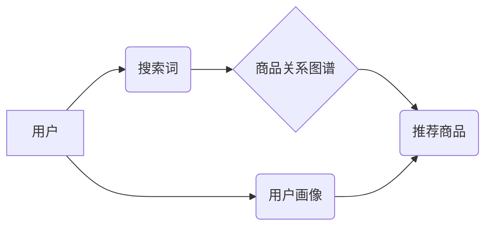

                 

## 电商搜索业务中的图神经网络技术应用

> 关键词：图神经网络、电商搜索、推荐系统、用户画像、商品关系、知识图谱、深度学习

## 1. 背景介绍

随着电商行业的蓬勃发展，用户搜索商品的需求日益增长。传统的基于关键词匹配的搜索引擎在处理复杂用户需求时显得力不从心，无法提供个性化、精准的搜索结果。为了提升用户搜索体验，电商平台不断探索新的技术手段，图神经网络 (Graph Neural Networks, GNN) 作为一种新兴的深度学习方法，凭借其强大的能力在处理复杂关系数据方面展现出巨大潜力，逐渐成为电商搜索领域的研究热点。

图神经网络的核心思想是将用户、商品、品牌等实体以及它们之间的关系表示为图结构，并利用图卷积网络 (Graph Convolutional Networks, GCN) 等算法学习图结构中的特征表示。通过学习实体之间的关系和依赖性，GNN 可以更好地理解用户搜索意图，并推荐更相关的商品。

## 2. 核心概念与联系

### 2.1 图神经网络概述

图神经网络 (GNN) 是一种专门用于处理图结构数据的深度学习模型。它通过图卷积操作学习图结构中的特征表示，并根据这些表示进行预测或分类。

图神经网络的核心概念包括：

* **节点 (Node):** 图中的基本单元，代表实体，例如用户、商品、品牌等。
* **边 (Edge):** 连接节点的线，代表实体之间的关系，例如用户购买商品、商品属于某个品牌等。
* **图卷积 (Graph Convolution):** GNN 的核心操作，通过聚合相邻节点的信息来学习节点的特征表示。

### 2.2 电商搜索业务与图神经网络的联系

电商搜索业务本质上是一个关系型问题，用户搜索商品的意图与商品之间的关系、用户之间的关系、商品之间的关系等都息息相关。图神经网络能够有效地学习这些关系，从而提升电商搜索的精准度和个性化程度。

**电商搜索业务与图神经网络的联系可以概括为以下几个方面：**

* **用户画像:** 通过构建用户行为图谱，学习用户兴趣、偏好、购买习惯等信息，构建更精准的用户画像。
* **商品关系挖掘:** 通过构建商品属性图谱，学习商品之间的相似性、关联性等信息，提升商品推荐的精准度。
* **搜索意图理解:** 通过分析用户搜索词与商品关系，理解用户的搜索意图，提供更相关的搜索结果。
* **个性化推荐:** 基于用户画像和商品关系，为用户提供个性化的商品推荐。

**Mermaid 流程图：**



## 3. 核心算法原理 & 具体操作步骤

### 3.1 算法原理概述

图卷积网络 (GCN) 是图神经网络中最常用的算法之一。它通过聚合相邻节点的信息来学习节点的特征表示。

GCN 的核心思想是将每个节点的特征表示作为输入，通过图卷积操作将其与相邻节点的特征表示进行融合，得到更新后的特征表示。

### 3.2 算法步骤详解

**GCN 算法的具体步骤如下：**

1. **初始化节点特征:** 为每个节点赋予初始特征向量，例如商品的属性信息、用户的购买历史等。
2. **图卷积操作:** 对于每个节点，计算其相邻节点的特征向量加权平均，得到节点的更新特征向量。
3. **激活函数:** 对更新后的特征向量应用激活函数，例如ReLU函数，引入非线性特性。
4. **重复步骤 2 和 3:** 重复上述步骤多次，直到特征表示收敛。

### 3.3 算法优缺点

**GCN 算法的优点:**

* **能够有效地学习图结构中的特征表示:** 通过聚合相邻节点的信息，GCN 可以学习到节点之间的关系和依赖性。
* **适用于各种图结构:** GCN 可以应用于各种类型的图结构，例如稀疏图、密集图等。
* **训练过程相对简单:** GCN 的训练过程相对简单，可以使用现有的深度学习框架进行实现。

**GCN 算法的缺点:**

* **难以处理大规模图:** 当图规模较大时，GCN 的计算复杂度会很高。
* **对图结构敏感:** GCN 的性能受图结构的影响较大，如果图结构不完整或不准确，则会影响模型的性能。

### 3.4 算法应用领域

GCN 算法在多个领域都有广泛的应用，例如：

* **推荐系统:** 基于用户-商品交互图，推荐个性化商品。
* **社交网络分析:** 分析用户之间的关系，预测用户行为。
* **知识图谱构建:** 从文本数据中构建知识图谱，提取实体关系。
* **药物研发:** 预测药物的活性，发现新的药物靶点。

## 4. 数学模型和公式 & 详细讲解 & 举例说明

### 4.1 数学模型构建

图卷积网络的数学模型可以表示为以下公式：

$$
h_i^{(l+1)} = \sigma(\sum_{j \in N(i)} \frac{e_{ij}}{ \sqrt{d_i d_j}} W^{(l)} h_j^{(l)})
$$

其中：

* $h_i^{(l)}$ 表示节点 $i$ 在第 $l$ 层的特征向量。
* $N(i)$ 表示节点 $i$ 的邻居节点集合。
* $e_{ij}$ 表示节点 $i$ 和节点 $j$ 之间的边权重。
* $d_i$ 表示节点 $i$ 的度数。
* $W^{(l)}$ 表示第 $l$ 层的权重矩阵。
* $\sigma$ 表示激活函数。

### 4.2 公式推导过程

该公式的推导过程可以分为以下几个步骤：

1. **邻居节点信息聚合:** 对于每个节点 $i$，计算其邻居节点 $j$ 的特征向量 $h_j^{(l)}$ 的加权平均，其中权重为 $e_{ij} / \sqrt{d_i d_j}$。
2. **线性变换:** 将聚合后的信息与第 $l$ 层的权重矩阵 $W^{(l)}$ 进行矩阵乘法，得到线性变换后的特征向量。
3. **激活函数应用:** 对线性变换后的特征向量应用激活函数 $\sigma$，引入非线性特性。

### 4.3 案例分析与讲解

**举例说明:**

假设我们有一个简单的图，包含三个节点 A、B、C，以及它们之间的边关系。节点 A 的特征向量为 [1, 2], 节点 B 的特征向量为 [3, 4], 节点 C 的特征向量为 [5, 6]。

如果我们使用 GCN 算法进行图卷积，则可以得到以下结果：

* 节点 A 的更新特征向量: $\sigma(\frac{e_{AB}}{ \sqrt{d_A d_B}} W^{(l)} h_B^{(l)} + \frac{e_{AC}}{ \sqrt{d_A d_C}} W^{(l)} h_C^{(l)})$
* 节点 B 的更新特征向量: $\sigma(\frac{e_{AB}}{ \sqrt{d_B d_A}} W^{(l)} h_A^{(l)} + \frac{e_{BC}}{ \sqrt{d_B d_C}} W^{(l)} h_C^{(l)})$
* 节点 C 的更新特征向量: $\sigma(\frac{e_{AC}}{ \sqrt{d_C d_A}} W^{(l)} h_A^{(l)} + \frac{e_{BC}}{ \sqrt{d_C d_B}} W^{(l)} h_B^{(l)})$

其中，$e_{AB}$、$e_{AC}$、$e_{BC}$ 分别表示节点 A 与 B、A 与 C、B 与 C 之间的边权重，$d_A$、$d_B$、$d_C$ 分别表示节点 A、B、C 的度数。

## 5. 项目实践：代码实例和详细解释说明

### 5.1 开发环境搭建

* **Python:** 使用 Python 3.6 或更高版本。
* **深度学习框架:** 使用 PyTorch 或 TensorFlow 等深度学习框架。
* **图数据库:** 使用 Neo4j 或其他图数据库。

### 5.2 源代码详细实现

```python
import torch
import torch.nn as nn

class GCNLayer(nn.Module):
    def __init__(self, in_features, out_features):
        super(GCNLayer, self).__init__()
        self.linear = nn.Linear(in_features, out_features)

    def forward(self, x, adj):
        # 计算图卷积
        x = torch.matmul(adj, x)
        x = self.linear(x)
        return x

# 定义 GCN 模型
class GCNModel(nn.Module):
    def __init__(self, in_features, hidden_features, out_features):
        super(GCNModel, self).__init__()
        self.layer1 = GCNLayer(in_features, hidden_features)
        self.layer2 = GCNLayer(hidden_features, out_features)

    def forward(self, x, adj):
        x = self.layer1(x, adj)
        x = self.layer2(x, adj)
        return x

# 训练模型
model = GCNModel(in_features=10, hidden_features=64, out_features=1)
optimizer = torch.optim.Adam(model.parameters(), lr=0.01)
loss_function = nn.MSELoss()

# ... 训练代码 ...

```

### 5.3 代码解读与分析

* **GCNLayer 类:** 定义了图卷积层，包含线性变换和激活函数。
* **GCNModel 类:** 定义了 GCN 模型，包含两层 GCN 层。
* **训练代码:** 使用 Adam 优化器和均方误差损失函数训练模型。

### 5.4 运行结果展示

训练完成后，可以将模型应用于实际数据，例如预测用户对商品的评分或点击率。

## 6. 实际应用场景

### 6.1 用户画像构建

通过构建用户行为图谱，学习用户兴趣、偏好、购买习惯等信息，构建更精准的用户画像。例如，可以根据用户的购买历史、浏览记录、评价信息等构建用户兴趣标签，为用户推荐更相关的商品。

### 6.2 商品关系挖掘

通过构建商品属性图谱，学习商品之间的相似性、关联性等信息，提升商品推荐的精准度。例如，可以根据商品的类别、属性、品牌等信息构建商品关系图，推荐用户可能感兴趣的商品。

### 6.3 搜索意图理解

通过分析用户搜索词与商品关系，理解用户的搜索意图，提供更相关的搜索结果。例如，可以根据用户的搜索词和历史搜索记录，预测用户想要搜索的商品类型，并提供更精准的搜索结果。

### 6.4 未来应用展望

图神经网络在电商搜索领域还有很大的发展潜力，未来可以应用于以下方面：

* **个性化搜索结果排序:** 基于用户画像和商品关系，为用户提供更个性化的搜索结果排序。
* **多模态搜索:** 将文本、图像、视频等多模态数据融合，提升搜索的准确性和丰富度。
* **跨平台搜索:** 将用户在不同平台的搜索行为进行整合，提供更全面的搜索体验。

## 7. 工具和资源推荐

### 7.1 学习资源推荐

* **书籍:**
    * 《图神经网络》
    * 《深度学习》
* **在线课程:**
    * Coursera: Graph Neural Networks Specialization
    * Udacity: Deep Learning Nanodegree

### 7.2 开发工具推荐

* **深度学习框架:** PyTorch, TensorFlow
* **图数据库:** Neo4j, JanusGraph
* **图计算库:** DGL, PyTorch Geometric

### 7.3 相关论文推荐

* 《Graph Convolutional Networks》
* 《Semi-Supervised Classification with Graph Convolutional Networks》
* 《Attention Is All You Need》

## 8. 总结：未来发展趋势与挑战

### 8.1 研究成果总结

图神经网络在电商搜索领域取得了显著的成果，例如提升了商品推荐的精准度、搜索结果的个性化程度等。

### 8.2 未来发展趋势

未来，图神经网络在电商搜索领域的发展趋势包括：

* **模型复杂度提升:** 开发更复杂的图神经网络模型，例如多层图卷积网络、图注意力网络等，提升模型的表达能力和学习能力。
* **数据规模扩大:** 利用海量电商数据训练更强大的图神经网络模型，提升模型的泛化能力和鲁棒性。
* **多模态融合:** 将文本、图像、视频等多模态数据融合，构建更全面的用户画像和商品关系图，提升搜索的准确性和丰富度。

### 8.3 面临的挑战

图神经网络在电商搜索领域也面临一些挑战：

* **大规模图处理:** 当图规模较大时，图神经网络的计算复杂度会很高，需要开发更有效的图处理算法。
* **图结构不完整:** 现实世界中的图结构往往不完整或不准确，需要开发更鲁棒的图神经网络模型，能够处理不完整或不准确的图数据。
* **数据隐私保护:** 图神经网络的训练需要使用用户隐私数据，需要开发更有效的隐私保护机制，确保用户数据的安全。

### 8.4 研究展望

未来，图神经网络在电商搜索领域的研究方向包括：

* **高效图神经网络算法:** 开发更高效的图神经网络算法，能够处理大规模图数据。
* **图数据增强:** 开发图数据增强技术，提升图数据的质量和完整性。
* **图神经网络与其他技术的融合:** 将图神经网络与其他技术，例如自然语言处理、计算机视觉等融合，构建更强大的电商搜索系统。

## 9. 附录：常见问题与解答

**Q1: 图神经网络与传统的机器学习模型相比有什么优势？**

**A1:** 图神经网络能够有效地学习图结构中的特征表示，而传统的机器学习模型难以处理复杂关系数据。

**Q2: 图神经网络的训练过程复杂吗？**

**A2:** 图神经网络的训练过程相对简单，可以使用现有的深度学习框架进行实现。

**Q3: 图神经网络的应用场景有哪些？**

**A3:** 图神经网络的应用场景非常广泛，例如推荐系统、社交网络分析、知识图谱构建等。


作者：禅与计算机程序设计艺术 / Zen and the Art of Computer Programming<end_of_turn>

