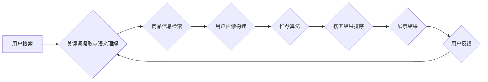

                 

## 电商搜索中的智能供需匹配与协同优化技术

> 关键词：电商搜索、供需匹配、协同优化、推荐系统、机器学习、深度学习、个性化

## 1. 背景介绍

在当今数字经济时代，电商平台作为商品交易的重要载体，其搜索引擎系统扮演着至关重要的角色。用户通过搜索引擎输入关键词，期望快速找到符合自身需求的商品。然而，电商平台商品种类繁多，用户需求多样化，传统的基于关键词匹配的搜索方式难以满足用户日益增长的个性化需求。因此，智能供需匹配与协同优化技术应运而生，旨在通过对用户行为、商品特征、市场趋势等多方面数据的分析和挖掘，实现精准的商品推荐和搜索结果排序，提升用户体验和平台商业价值。

## 2. 核心概念与联系

**2.1 核心概念**

* **供需匹配:** 指的是将用户需求与商品供应进行匹配，找到最合适的商品推荐给用户。
* **协同优化:** 指的是通过多个算法和模型的协同工作，共同优化搜索结果和推荐效果。

**2.2 架构图**



**2.3 联系**

智能供需匹配与协同优化技术的核心是将用户需求与商品供应进行精准匹配，并通过协同优化算法和模型，不断提升匹配效果。

* 用户搜索行为是供需匹配的基础，关键词提取和语义理解可以帮助系统理解用户真实需求。
* 商品信息检索可以快速找到与用户需求相关的商品。
* 用户画像构建可以帮助系统了解用户的兴趣、偏好和购买习惯，从而提供更个性化的推荐。
* 推荐算法可以根据用户需求和商品特征，预测用户可能感兴趣的商品，并进行排序。
* 搜索结果排序可以根据用户需求和商品特征，对搜索结果进行排序，展示最相关的商品。
* 用户反馈可以帮助系统不断优化匹配效果，形成闭环反馈机制。

## 3. 核心算法原理 & 具体操作步骤

**3.1 算法原理概述**

智能供需匹配与协同优化技术通常采用以下核心算法：

* **协同过滤:** 基于用户历史行为和商品特征，预测用户对商品的评分或购买意愿。
* **内容过滤:** 基于商品的属性和描述，推荐与用户兴趣相符的商品。
* **混合推荐:** 结合协同过滤和内容过滤算法，提高推荐效果。
* **深度学习:** 利用深度神经网络，从海量数据中学习用户需求和商品特征，实现更精准的匹配。

**3.2 算法步骤详解**

以协同过滤算法为例，其具体操作步骤如下：

1. **数据收集:** 收集用户行为数据，例如用户浏览历史、购买记录、评分等，以及商品特征数据，例如商品类别、价格、描述等。
2. **数据预处理:** 对数据进行清洗、转换和特征工程，例如处理缺失值、归一化数据、提取商品关键词等。
3. **相似度计算:** 计算用户之间和商品之间的相似度，例如使用余弦相似度、皮尔逊相关系数等。
4. **推荐生成:** 根据用户与商品的相似度，预测用户对商品的评分或购买意愿，并生成推荐列表。
5. **结果评估:** 使用指标，例如准确率、召回率、覆盖率等，评估推荐效果。

**3.3 算法优缺点**

* **优点:** 能够发现用户隐性需求，推荐个性化商品。
* **缺点:** 数据稀疏性问题，冷启动问题，推荐结果可能存在偏差。

**3.4 算法应用领域**

* 电商平台商品推荐
* 音乐平台歌曲推荐
* 视频平台影视推荐
* 社交平台好友推荐

## 4. 数学模型和公式 & 详细讲解 & 举例说明

**4.1 数学模型构建**

协同过滤算法的数学模型可以表示为用户-商品评分矩阵，其中每个元素表示用户对商品的评分。

**4.2 公式推导过程**

协同过滤算法的推荐公式可以根据不同的相似度计算方法进行推导，例如：

* **基于用户相似度的推荐:**

$$
r_{ui} = \frac{\sum_{j \in N(u)} s_{uj} * r_{uj}}{\sum_{j \in N(u)} s_{uj}}
$$

其中：

* $r_{ui}$ 表示用户 $u$ 对商品 $i$ 的预测评分。
* $N(u)$ 表示与用户 $u$ 相似的用户集合。
* $s_{uj}$ 表示用户 $u$ 和用户 $j$ 的相似度。
* $r_{uj}$ 表示用户 $j$ 对商品 $i$ 的评分。

* **基于商品相似度的推荐:**

$$
r_{ui} = \frac{\sum_{j \in N(i)} s_{ij} * r_{uj}}{\sum_{j \in N(i)} s_{ij}}
$$

其中：

* $N(i)$ 表示与商品 $i$ 相似的商品集合。
* $s_{ij}$ 表示商品 $i$ 和商品 $j$ 的相似度。

**4.3 案例分析与讲解**

假设有一个电商平台，用户 $A$ 和用户 $B$ 都购买了商品 $X$ 和商品 $Y$，用户 $A$ 对商品 $X$ 的评分为 5 分，对商品 $Y$ 的评分为 4 分，用户 $B$ 对商品 $X$ 的评分为 4 分，对商品 $Y$ 的评分为 5 分。

如果使用基于用户相似度的推荐算法，可以计算出用户 $A$ 和用户 $B$ 的相似度，然后根据用户 $B$ 对商品 $Z$ 的评分，预测用户 $A$ 对商品 $Z$ 的评分。

## 5. 项目实践：代码实例和详细解释说明

**5.1 开发环境搭建**

* Python 3.x
* TensorFlow 或 PyTorch
* Scikit-learn

**5.2 源代码详细实现**

```python
# 导入必要的库
import numpy as np
from sklearn.metrics.pairwise import cosine_similarity

# 定义用户-商品评分矩阵
ratings = np.array([
    [5, 4, 0, 0],
    [4, 5, 0, 0],
    [0, 0, 3, 5],
    [0, 0, 4, 0]
])

# 计算用户之间的相似度
user_similarity = cosine_similarity(ratings)

# 获取用户 A 的相似用户
similar_users = np.argsort(user_similarity[0])[::-1][1:]

# 预测用户 A 对商品 Z 的评分
predicted_rating = np.average([ratings[user, 2] for user in similar_users])

# 打印预测评分
print(f"用户 A 对商品 Z 的预测评分: {predicted_rating}")
```

**5.3 代码解读与分析**

* 代码首先导入必要的库，包括 NumPy 和 Scikit-learn。
* 然后定义一个用户-商品评分矩阵，其中每个元素表示用户对商品的评分。
* 使用 cosine_similarity 函数计算用户之间的相似度。
* 获取用户 A 的相似用户，并根据这些用户的评分，预测用户 A 对商品 Z 的评分。

**5.4 运行结果展示**

运行上述代码，可以得到用户 A 对商品 Z 的预测评分。

## 6. 实际应用场景

**6.1 电商平台商品推荐**

电商平台可以利用智能供需匹配与协同优化技术，根据用户的浏览历史、购买记录、评分等数据，推荐与用户兴趣相符的商品。

**6.2 个性化搜索结果排序**

电商平台可以根据用户的搜索关键词、浏览历史、购买记录等数据，对搜索结果进行个性化排序，展示更符合用户需求的商品。

**6.3 跨平台用户画像构建**

电商平台可以利用用户在不同平台的活动数据，构建更全面的用户画像，从而提供更精准的商品推荐和个性化服务。

**6.4 未来应用展望**

* **增强现实 (AR) 和虚拟现实 (VR) 购物体验:** 利用 AR 和 VR 技术，为用户提供更沉浸式的购物体验，并根据用户的虚拟购物行为，提供更精准的商品推荐。
* **智能客服:** 利用自然语言处理 (NLP) 技术，开发智能客服系统，帮助用户解决购物问题，并根据用户的咨询内容，推荐相关商品。
* **个性化营销:** 利用用户画像和行为数据，进行个性化营销，例如推送个性化优惠券、促销活动等。

## 7. 工具和资源推荐

**7.1 学习资源推荐**

* **书籍:**
    * 《推荐系统》
    * 《机器学习》
    * 《深度学习》
* **在线课程:**
    * Coursera: Recommender Systems
    * Udacity: Machine Learning Engineer Nanodegree
* **博客和论坛:**
    * Towards Data Science
    * Kaggle

**7.2 开发工具推荐**

* **Python:** 
    * TensorFlow
    * PyTorch
    * Scikit-learn
* **数据库:**
    * MySQL
    * MongoDB
* **云平台:**
    * AWS
    * Azure
    * Google Cloud Platform

**7.3 相关论文推荐**

* **协同过滤:**
    * "Collaborative Filtering for Implicit Feedback Datasets"
    * "Matrix Factorization Techniques for Recommender Systems"
* **深度学习推荐:**
    * "Deep Learning for Recommender Systems"
    * "Neural Collaborative Filtering"

## 8. 总结：未来发展趋势与挑战

**8.1 研究成果总结**

智能供需匹配与协同优化技术在电商搜索领域取得了显著成果，例如：

* 提升了商品推荐的准确率和个性化程度。
* 提高了用户搜索体验和平台商业价值。

**8.2 未来发展趋势**

* **更精准的个性化推荐:** 利用更先进的机器学习和深度学习算法，从更丰富的用户数据中学习，实现更精准的个性化推荐。
* **多模态数据融合:** 将文本、图像、视频等多模态数据融合，构建更全面的用户画像，提供更丰富的商品推荐。
* **实时推荐:** 利用实时数据流，实现商品推荐的实时更新，满足用户不断变化的需求。

**8.3 面临的挑战**

* **数据稀疏性问题:** 用户行为数据往往是稀疏的，难以训练有效的推荐模型。
* **冷启动问题:** 新用户和新商品难以获得推荐，需要开发新的算法和策略来解决。
* **用户隐私保护:** 用户数据敏感性高，需要开发隐私保护机制，确保用户数据安全。

**8.4 研究展望**

未来，智能供需匹配与协同优化技术将继续朝着更精准、更个性化、更智能的方向发展，为电商平台和用户带来更美好的购物体验。


## 9. 附录：常见问题与解答

* **Q1: 协同过滤算法的缺点是什么？**

* **A1:** 协同过滤算法存在数据稀疏性问题和冷启动问题。

* **Q2: 如何解决协同过滤算法的冷启动问题？**

* **A2:** 可以利用内容过滤算法、用户画像构建等方法，为新用户和新商品提供初始推荐。

* **Q3: 深度学习推荐算法有哪些优势？**

* **A3:** 深度学习推荐算法能够从海量数据中学习更复杂的特征，实现更精准的推荐。

* **Q4: 如何评估推荐算法的效果？**

* **A4:** 可以使用准确率、召回率、覆盖率等指标来评估推荐算法的效果。


作者：禅与计算机程序设计艺术 / Zen and the Art of Computer Programming 
<end_of_turn>

