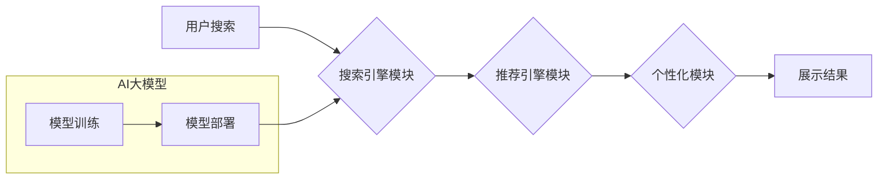

                 

## 电商搜索推荐场景下的AI大模型模型部署方案

> 关键词：电商搜索、推荐系统、AI大模型、模型部署、微服务架构、云计算、MLOps

## 1. 背景介绍

随着电商行业的蓬勃发展，用户对商品搜索和推荐的需求日益增长。传统的基于规则和协同过滤的推荐系统难以满足用户个性化需求和海量商品数据处理能力。近年来，人工智能（AI）技术，特别是大模型的快速发展，为电商搜索推荐领域带来了新的机遇。

AI大模型，例如Transformer、BERT等，凭借其强大的语义理解和学习能力，能够从海量商品数据中挖掘更深层的用户偏好和商品关联性，从而提供更精准、个性化的搜索和推荐结果。然而，将AI大模型应用于电商搜索推荐场景并非易事，需要考虑模型的训练、部署、优化等多个环节。

## 2. 核心概念与联系

### 2.1 电商搜索推荐系统

电商搜索推荐系统是电商平台的核心功能之一，旨在帮助用户快速找到所需商品，并推荐符合用户兴趣的商品。系统通常由以下几个模块组成：

* **搜索引擎模块:** 处理用户搜索词，并返回相关商品列表。
* **推荐引擎模块:** 基于用户行为、商品属性等信息，推荐符合用户偏好的商品。
* **个性化模块:** 根据用户画像和历史行为，对搜索结果和推荐结果进行个性化定制。
* **展示模块:** 将搜索结果和推荐结果以用户友好的方式展示给用户。

### 2.2 AI大模型

AI大模型是指在海量数据上训练的深度学习模型，具有强大的泛化能力和学习能力。常见的AI大模型包括：

* **Transformer:** 用于自然语言处理任务，例如文本分类、机器翻译、问答系统等。
* **BERT:** 基于Transformer的预训练语言模型，能够理解上下文信息，提高文本理解能力。
* **GPT:** 生成式预训练语言模型，能够生成高质量的文本内容。

### 2.3 模型部署方案

模型部署是指将训练好的AI模型部署到生产环境中，以便为用户提供服务。电商搜索推荐场景下，模型部署方案需要考虑模型的规模、实时性、可扩展性等因素。常见的模型部署方案包括：

* **容器化部署:** 将模型和依赖库打包成容器，方便部署和管理。
* **微服务架构:** 将模型部署成独立的服务，提高系统的可扩展性和容错性。
* **云计算平台:** 利用云计算平台的资源和服务，部署和管理模型。

**Mermaid 流程图**



## 3. 核心算法原理 & 具体操作步骤

### 3.1 算法原理概述

电商搜索推荐系统通常采用基于内容的推荐、基于协同过滤的推荐和基于深度学习的推荐等算法。

* **基于内容的推荐:** 根据商品的属性和用户过去的浏览记录，推荐与用户兴趣相符的商品。
* **基于协同过滤的推荐:** 根据用户之间的相似性，推荐用户喜欢的商品。
* **基于深度学习的推荐:** 利用深度学习模型，从海量数据中学习用户偏好和商品关联性，推荐更精准的商品。

### 3.2 算法步骤详解

以基于深度学习的推荐算法为例，其具体步骤如下：

1. **数据预处理:** 收集用户行为数据、商品属性数据等，并进行清洗、转换、特征工程等操作。
2. **模型训练:** 选择合适的深度学习模型，例如Transformer、BERT等，并利用预处理后的数据进行模型训练。
3. **模型评估:** 使用测试数据评估模型的性能，例如准确率、召回率、NDCG等指标。
4. **模型调优:** 根据模型评估结果，调整模型参数、训练策略等，提高模型性能。
5. **模型部署:** 将训练好的模型部署到生产环境中，为用户提供推荐服务。

### 3.3 算法优缺点

**基于深度学习的推荐算法**

* **优点:** 能够从海量数据中学习更深层的用户偏好和商品关联性，推荐结果更精准、个性化。
* **缺点:** 需要大量的训练数据和计算资源，模型训练时间较长，部署成本较高。

### 3.4 算法应用领域

基于深度学习的推荐算法广泛应用于电商、视频、音乐、新闻等领域，例如：

* **电商商品推荐:** 推荐用户可能感兴趣的商品。
* **视频内容推荐:** 推荐用户可能想观看的视频。
* **音乐内容推荐:** 推荐用户可能想听的音乐。
* **新闻内容推荐:** 推荐用户可能想阅读的新闻。

## 4. 数学模型和公式 & 详细讲解 & 举例说明

### 4.1 数学模型构建

基于深度学习的推荐系统通常采用用户-商品交互矩阵作为输入，并利用神经网络模型学习用户和商品的潜在特征。

假设用户集合为U，商品集合为I，用户-商品交互矩阵为R，其中R(u,i)表示用户u对商品i的交互行为，例如点击、购买等。

### 4.2 公式推导过程

常用的深度学习推荐模型包括矩阵分解模型、神经网络推荐模型等。

**矩阵分解模型:**

目标是将用户-商品交互矩阵R分解成两个低维矩阵，分别表示用户的潜在特征和商品的潜在特征。

$$R \approx U \cdot V^T$$

其中，U是用户特征矩阵，V是商品特征矩阵。

**神经网络推荐模型:**

利用多层神经网络学习用户和商品的潜在特征，并预测用户对商品的交互行为。

### 4.3 案例分析与讲解

例如，在电商平台上，用户-商品交互矩阵可以表示用户对商品的购买行为。

通过训练矩阵分解模型或神经网络推荐模型，可以学习到用户的兴趣偏好和商品的属性特征，从而推荐用户可能感兴趣的商品。

## 5. 项目实践：代码实例和详细解释说明

### 5.1 开发环境搭建

* **操作系统:** Linux
* **编程语言:** Python
* **深度学习框架:** TensorFlow或PyTorch
* **云计算平台:** AWS、Azure、GCP等

### 5.2 源代码详细实现

```python
import tensorflow as tf

# 定义用户-商品交互矩阵
R = tf.constant([[1, 0, 1], [0, 1, 0], [1, 1, 0]])

# 定义用户特征矩阵
U = tf.Variable(tf.random.normal([3, 2]))

# 定义商品特征矩阵
V = tf.Variable(tf.random.normal([2, 3]))

# 计算预测结果
predictions = tf.matmul(U, V, transpose_b=True)

# 计算损失函数
loss = tf.reduce_mean(tf.square(predictions - R))

# 定义优化器
optimizer = tf.keras.optimizers.Adam()

# 训练模型
for epoch in range(100):
    with tf.GradientTape() as tape:
        loss_value = loss
    gradients = tape.gradient(loss_value, [U, V])
    optimizer.apply_gradients(zip(gradients, [U, V]))

# 打印预测结果
print(predictions)
```

### 5.3 代码解读与分析

* 代码首先定义了用户-商品交互矩阵R，以及用户特征矩阵U和商品特征矩阵V。
* 然后，使用矩阵乘法计算预测结果predictions。
* 计算损失函数loss，并使用Adam优化器进行模型训练。
* 训练完成后，打印预测结果。

### 5.4 运行结果展示

训练完成后，predictions变量将包含预测的用户对商品的交互行为。

## 6. 实际应用场景

### 6.1 商品推荐

电商平台可以利用AI大模型推荐用户可能感兴趣的商品，提高用户购物体验和转化率。

### 6.2 搜索结果排序

AI大模型可以根据用户搜索词和商品属性，对搜索结果进行排序，提高搜索结果的准确性和相关性。

### 6.3 个性化广告

AI大模型可以根据用户的兴趣偏好和行为数据，推荐个性化的广告，提高广告点击率和转化率。

### 6.4 未来应用展望

* **多模态推荐:** 将文本、图像、视频等多模态数据融合到推荐系统中，提供更丰富的用户体验。
* **实时推荐:** 利用实时数据流，提供更及时、更精准的推荐服务。
* **个性化搜索:** 根据用户的搜索历史和偏好，提供个性化的搜索结果。

## 7. 工具和资源推荐

### 7.1 学习资源推荐

* **书籍:**
    * Deep Learning by Ian Goodfellow, Yoshua Bengio, and Aaron Courville
    * Hands-On Machine Learning with Scikit-Learn, Keras & TensorFlow by Aurélien Géron
* **在线课程:**
    * TensorFlow Tutorials: https://www.tensorflow.org/tutorials
    * PyTorch Tutorials: https://pytorch.org/tutorials/

### 7.2 开发工具推荐

* **深度学习框架:** TensorFlow, PyTorch
* **云计算平台:** AWS, Azure, GCP
* **容器化工具:** Docker, Kubernetes

### 7.3 相关论文推荐

* Attention Is All You Need (Vaswani et al., 2017)
* BERT: Pre-training of Deep Bidirectional Transformers for Language Understanding (Devlin et al., 2018)
* Factorization Machines (Rendle, 2010)

## 8. 总结：未来发展趋势与挑战

### 8.1 研究成果总结

AI大模型在电商搜索推荐领域取得了显著成果，能够提供更精准、个性化的推荐服务，提高用户体验和商业价值。

### 8.2 未来发展趋势

* **模型规模和能力提升:** 随着计算资源的不断发展，AI大模型的规模和能力将进一步提升，能够学习更深层的用户偏好和商品关联性。
* **多模态融合:** 将文本、图像、视频等多模态数据融合到推荐系统中，提供更丰富的用户体验。
* **实时推荐:** 利用实时数据流，提供更及时、更精准的推荐服务。

### 8.3 面临的挑战

* **数据隐私和安全:** AI大模型训练需要大量用户数据，如何保护用户隐私和数据安全是一个重要挑战。
* **模型解释性和可信度:** AI大模型的决策过程往往是复杂的，如何提高模型的解释性和可信度是一个重要的研究方向。
* **模型部署和维护成本:** AI大模型的部署和维护成本较高，需要开发高效的模型部署和管理方案。

### 8.4 研究展望

未来，AI大模型在电商搜索推荐领域将继续发挥重要作用，并不断朝着更智能、更个性化、更安全的方向发展。


## 9. 附录：常见问题与解答

* **Q1: 如何选择合适的AI大模型？**

A1: 选择合适的AI大模型需要根据具体应用场景和数据特点进行评估。例如，对于文本分类任务，BERT模型效果较好；对于推荐任务，Transformer模型效果更佳。

* **Q2: 如何解决模型过拟合问题？**

A2: 可以使用正则化技术、Dropout技术、数据增强等方法来解决模型过拟合问题。

* **Q3: 如何评估模型性能？**

A3: 可以使用准确率、召回率、NDCG等指标来评估模型性能。

* **Q4: 如何部署AI大模型？**

A4: 可以使用容器化部署、微服务架构、云计算平台等方式部署AI大模型。


作者：禅与计算机程序设计艺术 / Zen and the Art of Computer Programming 
<end_of_turn>

