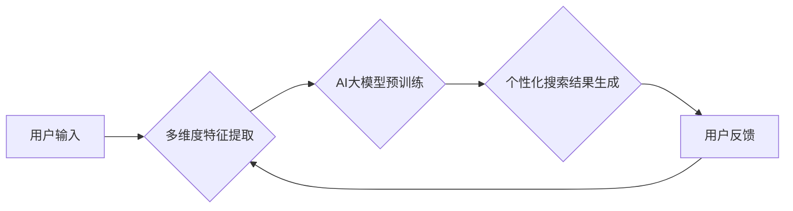

                 

## 电商搜索的多维度个性化：AI大模型的新突破

> 关键词：电商搜索、个性化推荐、AI大模型、多维度特征、深度学习、Transformer

## 1. 背景介绍

电商平台作为现代商业的重要组成部分，其搜索引擎扮演着至关重要的角色。用户通过搜索引擎查找心仪商品，而搜索结果的质量直接影响着用户体验和转化率。传统的电商搜索引擎主要基于关键词匹配和商品属性检索，缺乏对用户个性化需求的精准理解和响应。随着人工智能技术的快速发展，特别是深度学习和 Transformer 模型的突破，电商搜索的多维度个性化呈现出新的发展趋势。

近年来，AI大模型在自然语言处理、图像识别、推荐系统等领域取得了显著成就，为电商搜索的多维度个性化提供了强大的技术支撑。AI大模型能够学习用户行为、偏好和上下文信息，并生成更精准、更个性化的搜索结果，从而提升用户体验和商业价值。

## 2. 核心概念与联系

### 2.1 多维度个性化

多维度个性化是指根据用户的多方面特征，如用户画像、搜索历史、浏览记录、购买行为、兴趣爱好等，为每个用户提供个性化的搜索结果。

### 2.2 AI大模型

AI大模型是指在海量数据上训练的深度学习模型，具有强大的泛化能力和学习能力。常见的AI大模型包括BERT、GPT、T5等。

### 2.3 核心架构

电商搜索的多维度个性化基于AI大模型的架构，主要包括以下几个模块：



**核心流程:**

1. **用户输入:** 用户输入搜索关键词或商品描述。
2. **多维度特征提取:** 从用户画像、搜索历史、浏览记录、购买行为、兴趣爱好等方面提取多维度特征。
3. **AI大模型预训练:** 利用预训练的AI大模型对用户特征和搜索词进行编码，获取语义表示。
4. **个性化搜索结果生成:** 根据用户特征和搜索词的语义表示，生成个性化的搜索结果排序。
5. **用户反馈:** 用户对搜索结果进行评价，反馈信息用于模型训练和优化。

## 3. 核心算法原理 & 具体操作步骤

### 3.1 算法原理概述

电商搜索的多维度个性化主要基于深度学习和 Transformer 模型。深度学习算法能够从海量数据中学习用户行为和偏好模式，而 Transformer 模型能够捕捉用户搜索词和商品描述之间的长距离依赖关系，从而实现更精准的语义理解和匹配。

### 3.2 算法步骤详解

1. **数据预处理:** 收集用户行为数据、商品信息数据等，并进行清洗、格式化和编码。
2. **特征工程:** 从用户画像、搜索历史、浏览记录、购买行为、兴趣爱好等方面提取多维度特征，并进行量化和编码。
3. **模型训练:** 利用预训练的AI大模型，对用户特征和搜索词进行编码，并训练个性化搜索排序模型。
4. **模型评估:** 使用测试数据评估模型的性能，并进行调参优化。
5. **模型部署:** 将训练好的模型部署到线上环境，为用户提供个性化搜索服务。

### 3.3 算法优缺点

**优点:**

* **精准度高:** 基于深度学习和 Transformer 模型，能够捕捉用户行为和商品特征之间的复杂关系，实现更精准的搜索结果排序。
* **个性化强:** 根据用户多维度特征，为每个用户提供个性化的搜索体验。
* **可扩展性强:** 可以根据需要添加新的特征和模型，不断提升搜索效果。

**缺点:**

* **数据依赖性强:** 需要海量用户行为数据和商品信息数据进行训练。
* **计算资源消耗大:** 训练和部署AI大模型需要大量的计算资源。
* **模型解释性差:** 深度学习模型的内部机制较为复杂，难以解释模型的决策过程。

### 3.4 算法应用领域

电商搜索的多维度个性化算法广泛应用于以下领域:

* **商品推荐:** 根据用户的搜索历史、浏览记录和购买行为，推荐相关的商品。
* **搜索结果排序:** 根据用户的搜索词和特征，对搜索结果进行排序，提升用户体验。
* **个性化广告:** 根据用户的兴趣爱好和行为特征，展示个性化的广告。
* **内容推荐:** 根据用户的阅读习惯和兴趣爱好，推荐相关的文章、视频和音频内容。

## 4. 数学模型和公式 & 详细讲解 & 举例说明

### 4.1 数学模型构建

电商搜索的多维度个性化模型可以构建为一个多层神经网络，其中每一层都包含多个神经元。每个神经元接收来自上一层的输出作为输入，并通过激活函数进行处理，输出到下一层。

### 4.2 公式推导过程

模型的输出可以表示为：

$$
y = f(W_1x_1 + b_1)
$$

其中：

* $y$ 是模型的输出，即搜索结果的排序分数。
* $x_1$ 是用户特征的向量表示。
* $W_1$ 是第一层的权重矩阵。
* $b_1$ 是第一层的偏置向量。
* $f$ 是激活函数。

### 4.3 案例分析与讲解

假设我们有一个电商平台，用户搜索关键词“手机”。我们可以将用户的搜索历史、浏览记录、购买行为等信息提取为多维度特征，并将其编码为向量表示。然后，将用户特征向量输入到AI大模型中，模型会根据预训练的知识和用户特征，生成一个搜索结果的排序分数。

## 5. 项目实践：代码实例和详细解释说明

### 5.1 开发环境搭建

* Python 3.7+
* TensorFlow 2.0+
* PyTorch 1.0+
* CUDA Toolkit 10.2+

### 5.2 源代码详细实现

```python
import tensorflow as tf

# 定义模型结构
class PersonalizedSearchModel(tf.keras.Model):
    def __init__(self):
        super(PersonalizedSearchModel, self).__init__()
        self.embedding_layer = tf.keras.layers.Embedding(input_dim=vocab_size, output_dim=embedding_dim)
        self.transformer_layer = tf.keras.layers.Transformer(num_heads=8, d_model=embedding_dim)
        self.dense_layer = tf.keras.layers.Dense(units=1)

    def call(self, inputs):
        # 用户特征编码
        user_features = self.embedding_layer(user_feature_ids)
        # 搜索词编码
        search_query = self.embedding_layer(search_query_ids)
        # Transformer编码
        encoded_query = self.transformer_layer([user_features, search_query])
        # 输出排序分数
        output = self.dense_layer(encoded_query)
        return output

# 实例化模型
model = PersonalizedSearchModel()

# 训练模型
model.compile(optimizer='adam', loss='mse')
model.fit(train_data, train_labels, epochs=10)

# 预测排序分数
predictions = model.predict(test_data)
```

### 5.3 代码解读与分析

* **模型结构:** 模型采用多层神经网络结构，包括嵌入层、Transformer层和全连接层。
* **嵌入层:** 将用户特征和搜索词转换为向量表示。
* **Transformer层:** 捕捉用户特征和搜索词之间的长距离依赖关系。
* **全连接层:** 生成搜索结果的排序分数。
* **训练过程:** 使用训练数据训练模型，并使用测试数据评估模型性能。

### 5.4 运行结果展示

训练完成后，可以使用测试数据预测搜索结果的排序分数。可以将排序分数与实际用户点击行为进行比较，评估模型的性能。

## 6. 实际应用场景

### 6.1 个性化商品推荐

电商平台可以根据用户的搜索历史、浏览记录和购买行为，推荐相关的商品。例如，如果用户经常搜索“运动鞋”，那么平台可以推荐用户购买运动鞋相关的商品。

### 6.2 搜索结果个性化排序

电商平台可以根据用户的搜索词和特征，对搜索结果进行排序，提升用户体验。例如，如果用户搜索“手机”，平台可以根据用户的年龄、性别、购买历史等特征，优先推荐用户感兴趣的手机型号。

### 6.3 个性化广告展示

电商平台可以根据用户的兴趣爱好和行为特征，展示个性化的广告。例如，如果用户经常浏览“电子产品”类商品，那么平台可以展示与电子产品相关的广告。

### 6.4 未来应用展望

电商搜索的多维度个性化将朝着以下方向发展：

* **更精准的个性化:** 利用更丰富的用户特征和更先进的AI模型，实现更精准的个性化推荐和搜索结果排序。
* **更丰富的交互方式:** 支持语音搜索、图像搜索等更丰富的交互方式，提升用户体验。
* **更智能的搜索引擎:**  电商搜索引擎将更加智能化，能够理解用户的意图，并提供更全面的搜索结果。

## 7. 工具和资源推荐

### 7.1 学习资源推荐

* **深度学习书籍:** 《深度学习》
* **AI大模型论文:** BERT、GPT、T5等论文
* **在线课程:** Coursera、edX等平台的深度学习课程

### 7.2 开发工具推荐

* **TensorFlow:** 开源深度学习框架
* **PyTorch:** 开源深度学习框架
* **HuggingFace:** 提供预训练的AI模型和工具

### 7.3 相关论文推荐

* **BERT: Pre-training of Deep Bidirectional Transformers for Language Understanding**
* **GPT: Generative Pre-trained Transformer**
* **T5: Text-to-Text Transfer Transformer**

## 8. 总结：未来发展趋势与挑战

### 8.1 研究成果总结

电商搜索的多维度个性化基于AI大模型的架构，能够实现更精准、更个性化的搜索体验。

### 8.2 未来发展趋势

电商搜索的多维度个性化将朝着更精准、更智能、更丰富的方向发展。

### 8.3 面临的挑战

* 数据隐私保护
* 模型解释性
* 计算资源消耗

### 8.4 研究展望

未来研究将重点关注以下方面:

* 开发更隐私保护的个性化算法
* 提升模型的解释性
* 探索更有效的计算资源利用方式

## 9. 附录：常见问题与解答

* **Q1: 如何收集用户行为数据？**

A1: 可以通过用户登录、搜索记录、浏览记录、购买记录等方式收集用户行为数据。

* **Q2: 如何处理用户隐私问题？**

A2: 可以采用数据脱敏、加密等技术保护用户隐私。

* **Q3: 如何评估模型的性能？**

A3: 可以使用点击率、转化率等指标评估模型的性能。


作者：禅与计算机程序设计艺术 / Zen and the Art of Computer Programming 
<end_of_turn>

