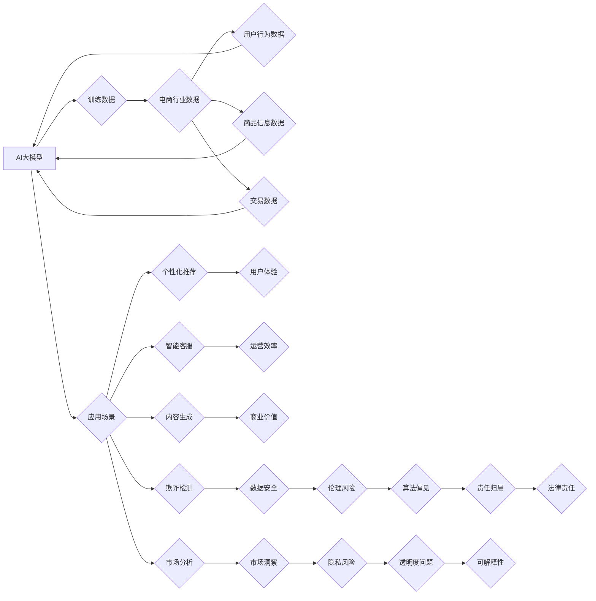

                 

## 关键词：

AI大模型，电商行业，伦理考量，隐私保护，数据安全，算法偏见，可解释性，公平性，透明度

## 1. 背景介绍

近年来，人工智能（AI）技术蓬勃发展，特别是大规模语言模型（LLM）的出现，为各行各业带来了革命性的变革。电商行业作为信息化程度高、数据量庞大的领域，也积极探索AI大模型的应用，旨在提升用户体验、优化运营效率、挖掘商业价值。然而，AI大模型的应用也引发了诸多伦理和隐私方面的担忧，需要我们认真思考并制定相应的解决方案。

### 1.1 电商行业对AI大模型的应用

AI大模型在电商行业中的应用场景广泛，例如：

* **个性化推荐:** 基于用户浏览历史、购买记录等数据，AI大模型可以精准推荐商品，提升用户购物体验和转化率。
* **智能客服:** AI大模型可以模拟人类对话，提供24小时在线客服服务，解答用户疑问，处理售后问题，减轻人工客服压力。
* **内容生成:** AI大模型可以自动生成商品描述、促销文案、广告语等内容，提高内容生产效率。
* **欺诈检测:** AI大模型可以分析用户行为数据，识别异常交易，有效防范欺诈行为。
* **市场分析:** AI大模型可以分析海量市场数据，预测市场趋势，帮助企业制定营销策略。

### 1.2 伦理与隐私风险

尽管AI大模型为电商行业带来了诸多机遇，但其应用也存在着一些伦理和隐私风险：

* **数据安全:** AI大模型的训练和应用都需要大量用户数据，如果数据泄露或被滥用，将严重损害用户隐私和安全。
* **算法偏见:** AI大模型的训练数据可能存在偏见，导致模型输出结果存在歧视或不公平现象。
* **透明度和可解释性:** 许多AI大模型是黑箱模型，其决策过程难以理解，这可能导致用户对模型结果产生 distrust。
* **责任归属:** 当AI大模型导致负面后果时，责任归属问题难以界定，需要明确责任主体和法律责任。

## 2. 核心概念与联系

### 2.1 AI大模型

AI大模型是指在海量数据上训练的深度学习模型，具有强大的泛化能力和学习能力，能够处理复杂的任务，例如自然语言处理、图像识别、语音合成等。

### 2.2 电商行业数据

电商行业的数据类型丰富多样，包括用户行为数据、商品信息数据、交易数据、市场数据等。这些数据是AI大模型训练和应用的基础。

### 2.3 伦理与隐私

伦理是指道德规范和价值观，而隐私是指个人信息不被他人无权获取、使用和披露的权利。

**Mermaid 流程图**



## 3. 核心算法原理 & 具体操作步骤

### 3.1 算法原理概述

电商行业中常用的AI大模型算法包括：

* **深度神经网络 (DNN):** 能够学习复杂数据模式，广泛应用于图像识别、自然语言处理等领域。
* **循环神经网络 (RNN):** 能够处理序列数据，例如文本和语音，常用于机器翻译、文本生成等任务。
* **Transformer:** 是一种新型的深度学习架构，能够捕捉长距离依赖关系，在自然语言处理领域取得了突破性进展。

### 3.2 算法步骤详解

以深度神经网络为例，其训练步骤如下：

1. **数据预处理:** 将原始数据清洗、转换、格式化，使其适合模型训练。
2. **模型构建:** 根据任务需求设计模型结构，包括输入层、隐藏层、输出层等。
3. **模型训练:** 使用训练数据训练模型，调整模型参数，使其能够准确预测目标输出。
4. **模型评估:** 使用测试数据评估模型性能，例如准确率、召回率、F1-score等。
5. **模型部署:** 将训练好的模型部署到生产环境中，用于实际应用。

### 3.3 算法优缺点

**优点:**

* 强大的学习能力，能够处理复杂数据模式。
* 高度可定制，可以根据任务需求调整模型结构和参数。
* 能够不断学习和改进，随着数据量的增加，模型性能会不断提升。

**缺点:**

* 训练数据量大，需要大量计算资源和时间。
* 模型参数众多，训练过程复杂，容易陷入局部最优解。
* 缺乏可解释性，难以理解模型的决策过程。

### 3.4 算法应用领域

深度神经网络广泛应用于电商行业中的多个领域，例如：

* **商品推荐:** 根据用户的浏览历史、购买记录等数据，推荐用户可能感兴趣的商品。
* **价格预测:** 根据市场数据、商品属性等信息，预测商品未来价格走势。
* **欺诈检测:** 分析用户行为数据，识别异常交易，防止欺诈行为。
* **客户服务:** 利用聊天机器人技术，提供24小时在线客服服务。

## 4. 数学模型和公式 & 详细讲解 & 举例说明

### 4.1 数学模型构建

深度神经网络的数学模型可以表示为一个多层感知机 (MLP)，其中每一层包含多个神经元，每个神经元接收来自上一层的输入信号，并通过激活函数进行处理，输出到下一层。

**公式:**

```latex
y = f(W^L * a^{L-1} + b^L)
```

其中：

* $y$ 是输出值
* $f$ 是激活函数
* $W^L$ 是第 L 层的权重矩阵
* $a^{L-1}$ 是第 L-1 层的激活值
* $b^L$ 是第 L 层的偏置向量

### 4.2 公式推导过程

深度神经网络的训练过程是通过反向传播算法 (Backpropagation) 来实现的。反向传播算法的基本思想是：

1. 计算模型输出与真实值的误差。
2. 根据误差反向传播，更新每一层的权重和偏置。

**公式:**

```latex
\Delta W = \eta \frac{\partial L}{\partial W}
```

其中：

* $\Delta W$ 是权重更新量
* $\eta$ 是学习率
* $\frac{\partial L}{\partial W}$ 是损失函数 $L$ 对权重 $W$ 的梯度

### 4.3 案例分析与讲解

例如，在商品推荐任务中，我们可以使用深度神经网络来预测用户对商品的点击概率。训练数据包括用户的历史浏览记录、购买记录以及商品的属性信息。模型的输出是一个概率值，表示用户点击该商品的可能性。

## 5. 项目实践：代码实例和详细解释说明

### 5.1 开发环境搭建

* Python 3.x
* TensorFlow 或 PyTorch 深度学习框架
* Jupyter Notebook 或 VS Code 代码编辑器

### 5.2 源代码详细实现

```python
import tensorflow as tf

# 定义模型结构
model = tf.keras.Sequential([
    tf.keras.layers.Dense(64, activation='relu', input_shape=(100,)),
    tf.keras.layers.Dense(32, activation='relu'),
    tf.keras.layers.Dense(1, activation='sigmoid')
])

# 编译模型
model.compile(optimizer='adam',
              loss='binary_crossentropy',
              metrics=['accuracy'])

# 训练模型
model.fit(x_train, y_train, epochs=10)

# 评估模型
loss, accuracy = model.evaluate(x_test, y_test)
print('Loss:', loss)
print('Accuracy:', accuracy)
```

### 5.3 代码解读与分析

* 首先，我们使用 TensorFlow 库定义了一个简单的深度神经网络模型。
* 模型包含三层神经元，第一层输入层有 100 个神经元，对应于用户特征的维度。
* 后两层分别有 64 个和 32 个神经元，使用 ReLU 激活函数。
* 最后输出层只有一个神经元，使用 sigmoid 激活函数，输出用户点击商品的概率。
* 然后，我们使用 Adam 优化器、二元交叉熵损失函数和准确率作为评估指标，编译模型。
* 最后，我们使用训练数据训练模型 10 个 epoch，并使用测试数据评估模型性能。

### 5.4 运行结果展示

训练完成后，我们可以查看模型的损失值和准确率，评估模型的性能。

## 6. 实际应用场景

### 6.1 个性化推荐

AI大模型可以分析用户的浏览历史、购买记录、评分等数据，构建用户画像，并推荐个性化的商品。例如，电商平台可以根据用户的兴趣爱好推荐相关的商品，提高用户购物体验和转化率。

### 6.2 智能客服

AI大模型可以模拟人类对话，提供24小时在线客服服务，解答用户疑问，处理售后问题。例如，电商平台可以利用聊天机器人技术，帮助用户解决订单问题、退换货问题等，减轻人工客服压力。

### 6.3 内容生成

AI大模型可以自动生成商品描述、促销文案、广告语等内容，提高内容生产效率。例如，电商平台可以利用 AI 大模型自动生成商品描述，节省人工成本。

### 6.4 未来应用展望

随着 AI 技术的不断发展，AI大模型在电商行业将有更广泛的应用场景，例如：

* **精准营销:** 根据用户的行为数据和画像，进行精准的营销推广，提高营销效果。
* **供应链优化:** 利用 AI 大模型预测商品需求，优化库存管理和物流配送，降低运营成本。
* **反欺诈:** 利用 AI 大模型识别异常交易，有效防范欺诈行为。

## 7. 工具和资源推荐

### 7.1 学习资源推荐

* **书籍:**
    * 《深度学习》 by Ian Goodfellow, Yoshua Bengio, and Aaron Courville
    * 《动手学深度学习》 by Aurélien Géron
* **在线课程:**
    * TensorFlow 官方教程: https://www.tensorflow.org/tutorials
    * PyTorch 官方教程: https://pytorch.org/tutorials/
* **博客和论坛:**
    * TensorFlow Blog: https://blog.tensorflow.org/
    * PyTorch Blog: https://pytorch.org/blog/
    * Kaggle: https://www.kaggle.com/

### 7.2 开发工具推荐

* **TensorFlow:** https://www.tensorflow.org/
* **PyTorch:** https://pytorch.org/
* **Jupyter Notebook:** https://jupyter.org/
* **VS Code:** https://code.visualstudio.com/

### 7.3 相关论文推荐

* **Attention Is All You Need:** https://arxiv.org/abs/1706.03762
* **BERT: Pre-training of Deep Bidirectional Transformers for Language Understanding:** https://arxiv.org/abs/1810.04805

## 8. 总结：未来发展趋势与挑战

### 8.1 研究成果总结

近年来，AI大模型在电商行业取得了显著的成果，例如个性化推荐、智能客服、内容生成等应用取得了成功。

### 8.2 未来发展趋势

未来，AI大模型在电商行业将继续发展，主要趋势包括：

* **模型规模和能力的提升:** 模型参数量将继续增加，模型能力将进一步提升，能够处理更复杂的任务。
* **多模态学习:** AI大模型将融合文本、图像、视频等多模态数据，提供更全面的用户体验。
* **边缘计算:** AI大模型将部署到边缘设备，实现更快速的响应和更低的延迟。
* **可解释性增强:** 研究人员将致力于提高 AI大模型的可解释性，使其决策过程更加透明。

### 8.3 面临的挑战

尽管 AI大模型在电商行业展现出巨大潜力，但也面临一些挑战：

* **数据安全和隐私保护:** 确保用户数据安全和隐私保护是至关重要的。
* **算法偏见:** 算法偏见可能导致不公平的结果，需要采取措施 mitigate 偏见。
* **可解释性:** AI大模型的决策过程难以理解，需要提高其可解释性。
* **伦理问题:** AI大模型的应用可能引发伦理问题，需要制定相应的规范和制度。

### 8.4 研究展望

未来，我们需要继续研究 AI大模型在电商行业的应用，探索其潜力，并解决其面临的挑战，使其更好地服务于用户和社会。

## 9. 附录：常见问题与解答

**Q1: AI大模型的训练需要多少数据？**

**A1:** 训练一个强大的 AI大模型需要海量数据，通常需要百万甚至数十亿条数据。

**Q2: 如何解决 AI大模型的算法偏见问题？**

**A2:** 可以通过以下方法解决算法偏见问题：

* 使用更加多样化的训练数据。
* 在训练过程中加入公平性约束。
* 对模型输出进行调优，减少偏见的影响。

**Q3: 如何提高 AI大模型的可解释性？**

**A3:** 可以通过以下方法提高 AI大模型的可解释性：

* 使用可解释的模型架构，例如决策树。
* 使用注意力机制，分析模型对哪些输入特征更加关注。
* 使用反向传播算法，解释模型决策过程中的关键步骤。


作者：禅与计算机程序设计艺术 / Zen and the Art of Computer Programming<end_of_turn>

