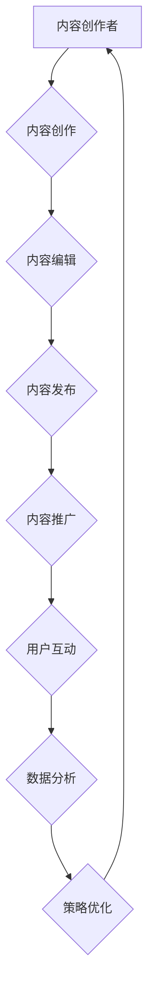

                 

## 知识付费创业中的内容营销自动化

> 关键词：知识付费、内容营销、自动化、机器学习、自然语言处理、数据分析、营销策略

## 1. 背景介绍

知识付费行业近年来蓬勃发展，涌现出众多优秀的内容创作者和平台。然而，随着市场竞争的加剧，内容创作者面临着越来越大的挑战：如何有效地推广自己的知识产品，吸引目标用户，并提升转化率？传统的内容营销方式，例如社交媒体推广、付费广告等，成本高昂且效果难以精准控制。

内容营销自动化应运而生，它利用技术手段，将内容创作、发布、推广等环节进行自动化，帮助内容创作者更高效地触达目标用户，提升营销效率。

## 2. 核心概念与联系

### 2.1 内容营销自动化

内容营销自动化是指利用软件工具和技术手段，将内容营销流程中的各个环节自动化，例如：

* **内容创作：** 利用机器学习算法生成内容草稿，辅助内容创作者提高创作效率。
* **内容发布：** 自动定时发布内容到不同平台，例如博客、社交媒体、邮件列表等。
* **内容推广：** 利用数据分析和目标用户画像，精准推送内容，提高用户参与度和转化率。
* **内容分析：** 自动收集和分析内容的阅读数据、用户反馈等，为内容创作者提供数据支持，优化内容策略。

### 2.2 核心技术

内容营销自动化主要依赖以下核心技术：

* **机器学习：** 用于内容创作辅助、用户画像分析、内容推荐等。
* **自然语言处理：** 用于内容理解、文本生成、用户对话等。
* **数据分析：** 用于收集和分析内容数据，洞察用户行为，优化营销策略。

### 2.3 架构图



## 3. 核心算法原理 & 具体操作步骤

### 3.1 算法原理概述

内容营销自动化中常用的算法包括：

* **文本生成算法：** 基于深度学习的语言模型，例如GPT-3、BERT等，可以生成高质量的文本内容，辅助内容创作者完成创作任务。
* **用户画像算法：** 利用机器学习算法分析用户行为数据，构建用户画像，精准识别目标用户群体。
* **内容推荐算法：** 基于协同过滤、内容相似度等算法，推荐用户感兴趣的内容，提高用户参与度。

### 3.2 算法步骤详解

以文本生成算法为例，其具体操作步骤如下：

1. **数据预处理：** 收集并清洗训练数据，例如书籍、文章、网站内容等，将其转换为模型可理解的格式。
2. **模型训练：** 利用深度学习框架，例如TensorFlow、PyTorch等，训练文本生成模型。
3. **模型评估：** 使用测试数据评估模型的生成效果，例如准确率、流畅度、相关性等。
4. **模型部署：** 将训练好的模型部署到服务器，提供文本生成服务。
5. **内容生成：** 用户输入关键词或主题，模型根据训练数据生成相应的文本内容。

### 3.3 算法优缺点

**优点：**

* 自动化内容创作，提高效率。
* 生成高质量的文本内容，满足用户需求。
* 个性化内容推荐，提升用户体验。

**缺点：**

* 模型训练需要大量数据和计算资源。
* 生成的文本内容可能缺乏创意和深度。
* 模型需要不断更新和迭代，才能保持效果。

### 3.4 算法应用领域

* **内容创作辅助：** 帮助作家、记者、营销人员等快速生成文章、文案、脚本等内容。
* **个性化内容推荐：** 为用户推荐感兴趣的内容，例如新闻、视频、商品等。
* **智能客服：** 利用自然语言处理技术，构建智能客服系统，自动回复用户咨询。

## 4. 数学模型和公式 & 详细讲解 & 举例说明

### 4.1 数学模型构建

内容营销自动化中常用的数学模型包括：

* **用户画像模型：** 利用机器学习算法，构建用户画像，描述用户的特征和行为模式。
* **内容推荐模型：** 利用协同过滤、内容相似度等算法，预测用户对特定内容的兴趣程度。

### 4.2 公式推导过程

以协同过滤算法为例，其核心公式为：

$$
r_{u,i} = \frac{\sum_{j \in N(u) \cap N(i)} \frac{r_{u,j} \cdot r_{j,i}}{\sum_{k \in N(u)} r_{u,k}^2} }{\sum_{j \in N(u) \cap N(i)} \frac{1}{\sum_{k \in N(j)} r_{j,k}^2}}
$$

其中：

* $r_{u,i}$ 表示用户 $u$ 对物品 $i$ 的评分。
* $N(u)$ 表示用户 $u$ 评分过的物品集合。
* $N(i)$ 表示物品 $i$ 被评分过的用户集合。

### 4.3 案例分析与讲解

假设用户 $A$ 和用户 $B$ 都评分过电影 $X$ 和电影 $Y$，并且 $A$ 对 $X$ 的评分为 5，对 $Y$ 的评分为 4，$B$ 对 $X$ 的评分为 4，对 $Y$ 的评分为 5。

根据公式，我们可以计算出用户 $A$ 对电影 $Z$ 的评分预测值，其中 $Z$ 是用户 $B$ 评分过的但 $A$ 未评分的电影。

## 5. 项目实践：代码实例和详细解释说明

### 5.1 开发环境搭建

* Python 3.x
* TensorFlow 或 PyTorch
* Jupyter Notebook

### 5.2 源代码详细实现

```python
# 导入必要的库
import tensorflow as tf

# 定义文本生成模型
model = tf.keras.Sequential([
    tf.keras.layers.Embedding(input_dim=vocab_size, output_dim=embedding_dim),
    tf.keras.layers.LSTM(units=lstm_units),
    tf.keras.layers.Dense(units=vocab_size, activation='softmax')
])

# 编译模型
model.compile(optimizer='adam', loss='sparse_categorical_crossentropy', metrics=['accuracy'])

# 训练模型
model.fit(train_data, epochs=epochs)

# 生成文本内容
text = model.predict(input_sequence)
```

### 5.3 代码解读与分析

* 首先，导入必要的库，例如 TensorFlow。
* 然后，定义文本生成模型，包括嵌入层、LSTM 层和全连接层。
* 接着，编译模型，选择优化器、损失函数和评价指标。
* 接下来，训练模型，使用训练数据进行训练。
* 最后，使用训练好的模型生成文本内容。

### 5.4 运行结果展示

训练好的模型可以生成高质量的文本内容，例如文章、故事、诗歌等。

## 6. 实际应用场景

### 6.1 内容创作辅助

* 自动生成博客文章、社交媒体文案、产品描述等内容。
* 辅助作家创作小说、剧本等创意内容。

### 6.2 个性化内容推荐

* 为用户推荐个性化的学习资源、课程、书籍等。
* 为用户推荐感兴趣的新闻、视频、商品等。

### 6.3 智能客服

* 利用自然语言处理技术，构建智能客服系统，自动回复用户咨询。
* 提供24小时在线服务，提高用户体验。

### 6.4 未来应用展望

* 更智能、更个性化的内容生成和推荐。
* 更广泛的应用场景，例如教育、医疗、金融等。
* 与其他技术融合，例如虚拟现实、增强现实等，打造更沉浸式的用户体验。

## 7. 工具和资源推荐

### 7.1 学习资源推荐

* **书籍：**
    * 《深度学习》
    * 《自然语言处理入门》
* **在线课程：**
    * Coursera
    * edX
    * Udemy

### 7.2 开发工具推荐

* **Python：** 
    * TensorFlow
    * PyTorch
    * scikit-learn
* **自然语言处理库：**
    * NLTK
    * spaCy
    * Gensim

### 7.3 相关论文推荐

* **Attention Is All You Need**
* **BERT: Pre-training of Deep Bidirectional Transformers for Language Understanding**
* **Generative Pre-trained Transformer 3**

## 8. 总结：未来发展趋势与挑战

### 8.1 研究成果总结

内容营销自动化技术取得了显著进展，能够有效地提高内容营销效率，提升用户体验。

### 8.2 未来发展趋势

* **更智能的算法：** 利用更先进的机器学习算法，生成更高质量、更个性化的内容。
* **更广泛的应用场景：** 将内容营销自动化技术应用到更多领域，例如教育、医疗、金融等。
* **与其他技术的融合：** 与虚拟现实、增强现实等技术融合，打造更沉浸式的用户体验。

### 8.3 面临的挑战

* **数据隐私和安全：** 内容营销自动化需要收集和分析大量用户数据，如何保护用户隐私和数据安全是一个重要挑战。
* **算法偏见：** 机器学习算法可能存在偏见，导致内容推荐不公平或不准确。
* **内容原创性：** 如何确保自动化生成的內容具有原创性和价值，避免过度依赖机器生成内容。

### 8.4 研究展望

未来，内容营销自动化技术将继续发展，为内容创作者和用户带来更多价值。需要加强对算法公平性、数据安全等方面的研究，确保技术发展能够造福人类社会。

## 9. 附录：常见问题与解答

* **Q1：内容营销自动化是否会取代内容创作者？**

* **A1：** 内容营销自动化可以帮助内容创作者提高效率，但不会取代他们。内容创作者仍然需要发挥创意和专业技能，为用户提供有价值的内容。

* **Q2：如何选择合适的自动化工具？**

* **A2：** 选择自动化工具时，需要考虑自身的业务需求、预算、技术水平等因素。可以参考行业评价、用户反馈等信息，选择适合自己的工具。

* **Q3：如何保证自动化内容的质量？**

* **A3：** 需要定期评估自动化内容的质量，并根据反馈进行调整和优化。同时，需要加强对算法的训练和维护，确保算法能够生成高质量的内容。


作者：禅与计算机程序设计艺术 / Zen and the Art of Computer Programming 
<end_of_turn>

