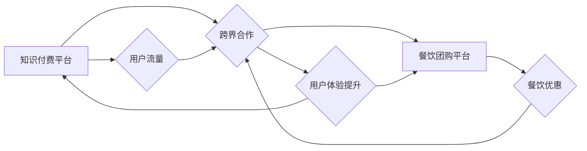

                 

## 关键词：知识付费、跨界营销、餐饮团购、数据分析、用户画像、个性化推荐、算法模型

## 1. 背景介绍

在当今数字化时代，知识付费和餐饮团购行业都呈现出蓬勃发展的态势。知识付费平台通过提供优质的知识产权，满足用户对学习和提升的渴望，而餐饮团购平台则通过优惠价格和便捷服务，连接商家和消费者，促进了餐饮行业的消费升级。

然而，这两个看似独立的领域，其实蕴藏着巨大的跨界合作潜力。通过融合各自的优势，知识付费平台可以借助餐饮团购平台的流量和用户基础，实现更广泛的市场覆盖和用户触达；而餐饮团购平台则可以通过知识付费内容的丰富，提升用户粘性，打造更具价值的服务生态。

## 2. 核心概念与联系

### 2.1 知识付费

知识付费是指通过付费的方式获取知识、技能和服务的商业模式。它涵盖了各种形式的知识产品，例如在线课程、电子书、付费咨询等。

### 2.2 餐饮团购

餐饮团购是指通过平台将商家提供的餐饮优惠套餐与消费者进行连接，实现线上预订和线下消费的商业模式。它通常以折扣优惠、套餐组合等方式吸引消费者，并通过平台的推广和营销手段，提高商家曝光度和客流量。

### 2.3 跨界营销

跨界营销是指企业与其他行业或品牌合作，共同进行营销活动，以扩大市场影响力和用户群体。它通过打破行业界限，创造新的联动效应，实现资源共享和协同发展。

**核心概念与联系流程图**



## 3. 核心算法原理 & 具体操作步骤

### 3.1 算法原理概述

跨界营销的核心算法原理在于数据分析和用户画像。通过对用户行为数据、消费偏好和兴趣爱好进行分析，构建用户画像，并根据画像特征，精准推荐相关知识付费内容和餐饮团购优惠。

### 3.2 算法步骤详解

1. **数据收集与清洗:** 收集用户行为数据，包括知识付费平台的用户浏览记录、购买历史、评论反馈等，以及餐饮团购平台的用户下单记录、消费金额、评价信息等。对收集到的数据进行清洗和预处理，去除无效数据和噪声，确保数据质量。

2. **用户画像构建:** 利用机器学习算法，对用户行为数据进行分析，提取用户特征，构建用户画像。用户画像可以包含用户的年龄、性别、职业、兴趣爱好、消费习惯等信息。

3. **内容推荐算法:** 基于用户画像，利用协同过滤、内容过滤、深度学习等推荐算法，推荐与用户兴趣相符的知识付费内容和餐饮团购优惠。

4. **个性化营销:** 根据用户画像和推荐结果，进行个性化营销，例如推送个性化广告、发送定制化优惠信息等，提高用户参与度和转化率。

### 3.3 算法优缺点

**优点:**

* **精准推荐:** 基于数据分析和用户画像，可以精准推荐用户感兴趣的内容和优惠，提高用户体验。
* **个性化营销:** 可以根据用户特征，进行个性化营销，提升用户粘性和转化率。
* **资源共享:** 知识付费平台和餐饮团购平台可以共享用户数据和资源，实现协同发展。

**缺点:**

* **数据隐私:** 数据收集和分析需要注重用户隐私保护，避免信息泄露和滥用。
* **算法偏差:** 算法模型可能存在偏差，导致推荐结果不准确或不公平。
* **用户体验:** 过度精准的推荐可能会导致用户感到被监控或被推销，影响用户体验。

### 3.4 算法应用领域

* **电商平台:** 推荐商品、个性化营销
* **社交媒体:** 推送内容、精准广告
* **教育平台:** 推荐课程、个性化学习
* **金融平台:** 推送理财产品、风险评估
* **医疗平台:** 推荐医生、个性化健康管理

## 4. 数学模型和公式 & 详细讲解 & 举例说明

### 4.1 数学模型构建

用户画像构建可以利用聚类算法，将用户分为不同的群体，每个群体具有相似的特征。常用的聚类算法包括K-means算法、层次聚类算法等。

**K-means算法:**

K-means算法的目标是将n个数据点划分为k个簇，使得每个数据点到其所属簇中心的距离最小。

**算法步骤:**

1. 随机选择k个数据点作为初始簇中心。
2. 将每个数据点分配到距离其最近的簇中心。
3. 计算每个簇的中心点。
4. 重复步骤2和步骤3，直到簇中心不再变化。

### 4.2 公式推导过程

K-means算法的目标函数为：

$$J(C) = \sum_{i=1}^{k} \sum_{x \in C_i} ||x - \mu_i||^2$$

其中：

* $J(C)$ 是目标函数值
* $k$ 是簇的个数
* $C_i$ 是第i个簇
* $x$ 是数据点
* $\mu_i$ 是第i个簇的中心点
* $||x - \mu_i||^2$ 是数据点 $x$ 到簇中心 $\mu_i$ 的距离平方

### 4.3 案例分析与讲解

假设我们有一个包含用户年龄、性别、消费金额等特征的数据集，想要将用户分为两类：高消费用户和低消费用户。我们可以使用K-means算法，将用户聚类为两类，并根据聚类结果，对不同用户群体进行个性化营销。

## 5. 项目实践：代码实例和详细解释说明

### 5.1 开发环境搭建

* Python 3.x
* scikit-learn 库
* Pandas 库
* Matplotlib 库

### 5.2 源代码详细实现

```python
import pandas as pd
from sklearn.cluster import KMeans

# 加载用户数据
data = pd.read_csv('user_data.csv')

# 选择特征变量
features = ['age', 'gender', 'consumption']

# 实例化KMeans模型
kmeans = KMeans(n_clusters=2)

# 训练模型
kmeans.fit(data[features])

# 获取聚类结果
labels = kmeans.labels_

# 将聚类结果添加到数据中
data['cluster'] = labels

# 查看聚类结果
print(data.groupby('cluster').mean())
```

### 5.3 代码解读与分析

* 首先，我们加载用户数据，并选择需要进行聚类的特征变量。
* 然后，我们实例化KMeans模型，并设置聚类数量为2。
* 接着，我们训练模型，并将聚类结果添加到数据中。
* 最后，我们查看聚类结果，可以观察到不同簇的用户特征的差异。

### 5.4 运行结果展示

运行代码后，会输出每个簇的用户平均特征值，例如年龄、性别、消费金额等。通过分析这些特征值，我们可以了解不同簇的用户特点，并进行相应的个性化营销。

## 6. 实际应用场景

### 6.1 知识付费平台

* **推荐相关课程:** 根据用户的消费记录和兴趣爱好，推荐与用户相关的知识付费课程。
* **个性化学习路径:** 根据用户的学习进度和知识掌握情况，构建个性化的学习路径，提高学习效率。
* **会员权益:** 为不同用户群体提供不同的会员权益，例如折扣优惠、专属课程等，提升用户粘性。

### 6.2 餐饮团购平台

* **精准广告投放:** 根据用户的消费偏好和地理位置，精准投放餐饮广告，提高广告转化率。
* **个性化套餐推荐:** 根据用户的消费记录和口味偏好，推荐个性化的餐饮套餐，提升用户体验。
* **会员积分兑换:** 允许用户使用会员积分兑换餐饮优惠，提升用户参与度和消费意愿。

### 6.4 未来应用展望

随着人工智能技术的不断发展，知识付费和餐饮团购行业的跨界合作将更加深入和广泛。未来，我们可以期待看到更多创新应用场景，例如：

* **智能餐厅:** 利用人工智能技术，实现餐厅智能化服务，例如自动点餐、个性化菜品推荐等。
* **虚拟美食体验:** 利用虚拟现实技术，打造虚拟美食体验，让用户在家就能品尝到各种美食。
* **智慧餐饮管理:** 利用大数据分析，帮助餐饮企业进行智慧管理，例如库存管理、成本控制、营销分析等。

## 7. 工具和资源推荐

### 7.1 学习资源推荐

* **机器学习课程:** Coursera、edX、Udacity 等平台提供丰富的机器学习课程。
* **数据分析书籍:** 《Python数据分析手册》、《数据挖掘实战》等书籍可以帮助你学习数据分析技能。
* **开源工具:** scikit-learn、TensorFlow、PyTorch 等开源工具可以帮助你进行机器学习和深度学习开发。

### 7.2 开发工具推荐

* **Python:** Python 是机器学习和数据分析的常用编程语言。
* **Jupyter Notebook:** Jupyter Notebook 是一个交互式编程环境，方便进行数据分析和机器学习开发。
* **Git:** Git 是一个版本控制系统，可以帮助你管理代码和项目。

### 7.3 相关论文推荐

* **K-means聚类算法:** MacQueen, J. (1967). Some methods for classification and analysis of multivariate observations.
* **推荐系统:** Adomavicius, G., & Tuzhilin, A. (2011). Toward the next generation of recommender systems: A data-driven approach.

## 8. 总结：未来发展趋势与挑战

### 8.1 研究成果总结

知识付费和餐饮团购行业的跨界合作，通过数据分析和用户画像，可以实现精准推荐、个性化营销，提升用户体验和商业价值。

### 8.2 未来发展趋势

* **人工智能技术:** 人工智能技术的不断发展，将推动跨界合作的深度融合，例如智能餐厅、虚拟美食体验等。
* **数据安全与隐私:** 数据安全和隐私保护将成为跨界合作的重要议题，需要制定相应的规范和机制。
* **跨界合作模式:** 除了知识付费和餐饮团购，其他行业也将探索跨界合作模式，实现资源共享和协同发展。

### 8.3 面临的挑战

* **数据质量:** 数据质量直接影响算法效果，需要加强数据清洗和预处理工作。
* **算法偏差:** 算法模型可能存在偏差，需要不断优化和改进算法模型。
* **用户隐私:** 数据收集和分析需要注重用户隐私保护，避免信息泄露和滥用。

### 8.4 研究展望

未来，我们需要继续探索跨界合作的创新模式，利用人工智能技术，打造更智能、更便捷、更具价值的服务生态，为用户提供更优质的体验。

## 9. 附录：常见问题与解答

**Q1: 跨界合作的风险有哪些？**

**A1:** 跨界合作的风险包括：

* **文化差异:** 不同行业企业文化差异可能导致合作困难。
* **利益分配:** 利益分配不合理可能导致合作破裂。
* **技术整合:** 技术整合难度大，可能导致合作效率低下。

**Q2: 如何选择合适的跨界合作对象？**

**A2:** 选择合适的跨界合作对象需要考虑以下因素：

* **行业匹配度:** 两个行业的业务模式和目标用户群体之间存在一定匹配度。
* **资源互补:** 两个企业拥有互补的资源和优势，可以共同创造价值。
* **文化契合度:** 两个企业的文化价值观相近，可以促进合作顺利进行。


作者：禅与计算机程序设计艺术 / Zen and the Art of Computer Programming 
<end_of_turn>

