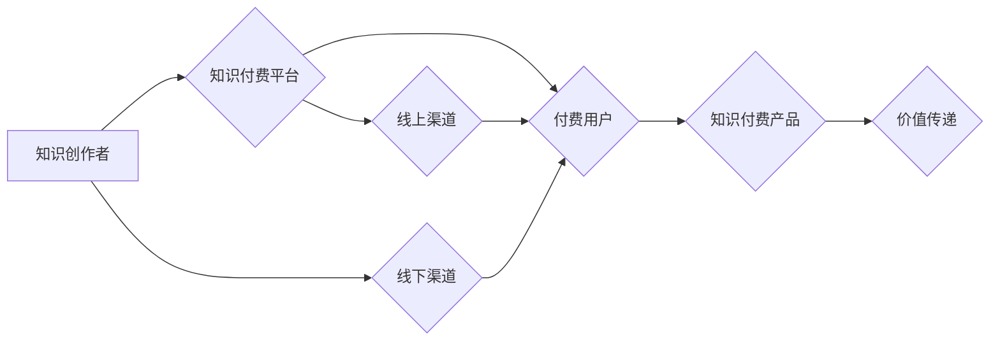

                 

## 知识付费赚钱的渠道拓展与合作伙伴管理

> 关键词：知识付费、渠道拓展、合作伙伴管理、内容运营、商业模式、市场营销、用户增长

### 1. 背景介绍

知识付费作为一种新型的商业模式，近年来发展迅速，成为互联网经济的重要组成部分。随着互联网技术的不断发展和用户对知识的需求不断增长，知识付费市场呈现出巨大的发展潜力。

知识付费的核心是将知识和技能转化为有价值的产品或服务，并通过线上线下多种渠道进行销售和推广。知识付费的内容形式多样，包括线上课程、付费文章、直播带货、咨询服务等。

然而，知识付费市场竞争激烈，想要在激烈的市场竞争中脱颖而出，需要不断拓展新的渠道，建立完善的合作伙伴关系，并进行有效的市场营销。

### 2. 核心概念与联系

#### 2.1 知识付费的核心概念

* **知识产权：** 知识付费的核心是知识产权的价值转化。知识创作者需要拥有独创的知识和技能，并将其转化为有价值的产品或服务。
* **付费用户：** 知识付费的最终目标是吸引付费用户，并为他们提供有价值的知识和技能。
* **价值传递：** 知识付费需要有效地传递知识和技能的价值，让用户感受到付费的价值。

#### 2.2 知识付费的商业模式

* **订阅模式：** 用户支付一定的费用，可以持续访问知识付费平台上的所有内容。
* **课程模式：** 用户购买特定的课程，可以学习到特定的知识和技能。
* **会员模式：** 用户成为平台的会员，可以享受平台提供的各种优惠和服务。

#### 2.3 知识付费的渠道拓展

* **线上渠道：** 知识付费平台、电商平台、社交媒体平台、搜索引擎等。
* **线下渠道：** 线下培训机构、线下活动、合作推广等。

#### 2.4 合作伙伴管理

* **知识创作者：** 与知识创作者建立长期合作关系，共同开发优质的知识付费产品。
* **平台合作：** 与其他知识付费平台进行合作，扩大知识付费产品的覆盖范围。
* **营销推广合作：** 与营销推广机构合作，进行有效的市场营销推广。

**Mermaid 流程图**



### 3. 核心算法原理 & 具体操作步骤

#### 3.1 算法原理概述

知识付费的成功离不开数据分析和算法的支撑。通过对用户行为、内容偏好等数据的分析，可以制定更精准的营销策略，推荐更符合用户需求的内容，提高用户转化率。

常用的算法包括：

* **推荐算法：** 基于用户历史行为、内容标签、相似用户等信息，推荐用户可能感兴趣的内容。
* **内容分发算法：** 根据内容质量、用户参与度、平台规则等因素，决定内容的展示顺序和曝光量。
* **用户画像算法：** 通过对用户数据的分析，构建用户画像，了解用户的兴趣爱好、消费习惯等信息。

#### 3.2 算法步骤详解

**推荐算法为例：**

1. **数据收集：** 收集用户行为数据，例如用户浏览记录、点赞记录、购买记录等。
2. **数据预处理：** 对数据进行清洗、转换、编码等处理，使其适合算法训练。
3. **特征工程：** 从原始数据中提取特征，例如用户年龄、性别、兴趣标签、内容类别、作者等。
4. **模型训练：** 选择合适的推荐算法模型，例如协同过滤、内容过滤、深度学习等，并使用训练数据进行模型训练。
5. **模型评估：** 使用测试数据评估模型的性能，例如准确率、召回率、覆盖率等。
6. **模型部署：** 将训练好的模型部署到线上环境，用于实时推荐内容。

#### 3.3 算法优缺点

**推荐算法的优缺点：**

* **优点：** 可以根据用户的兴趣爱好推荐个性化内容，提高用户体验和转化率。
* **缺点：** 需要大量的用户数据进行训练，算法模型的复杂度较高，需要专业的技术人员进行维护和优化。

#### 3.4 算法应用领域

推荐算法广泛应用于：

* **电商平台：** 商品推荐、用户画像、个性化营销。
* **社交媒体平台：** 内容推荐、用户匹配、广告投放。
* **视频平台：** 视频推荐、用户行为分析、内容分发。

### 4. 数学模型和公式 & 详细讲解 & 举例说明

#### 4.1 数学模型构建

推荐算法通常使用矩阵分解模型，例如协同过滤模型。

**协同过滤模型的数学模型：**

* **用户-物品交互矩阵：** 用矩阵 $R$ 表示用户和物品之间的交互关系，其中 $R_{ui}$ 表示用户 $u$ 对物品 $i$ 的评分或交互行为。

* **用户潜在特征向量：** 用向量 $u$ 表示用户 $u$ 的潜在特征，例如用户偏好、兴趣等。

* **物品潜在特征向量：** 用向量 $v$ 表示物品 $i$ 的潜在特征，例如物品类别、主题等。

* **预测评分：** 用户 $u$ 对物品 $i$ 的预测评分为 $R_{ui} = u \cdot v$，其中 $\cdot$ 表示点积运算。

#### 4.2 公式推导过程

协同过滤模型的目标是学习用户和物品的潜在特征向量，以便预测用户对物品的评分。

可以使用梯度下降算法来优化模型参数，例如用户特征向量 $u$ 和物品特征向量 $v$。

**梯度下降算法的公式：**

* $u = u - \alpha \frac{\partial Loss(R_{ui}, u \cdot v)}{\partial u}$

* $v = v - \alpha \frac{\partial Loss(R_{ui}, u \cdot v)}{\partial v}$

其中：

* $\alpha$ 是学习率，控制着参数更新的步长。
* $Loss(R_{ui}, u \cdot v)$ 是损失函数，衡量预测评分与真实评分之间的差异。

#### 4.3 案例分析与讲解

假设有一个用户-物品交互矩阵 $R$，其中 $R_{ui}$ 表示用户 $u$ 对物品 $i$ 的评分。

可以使用协同过滤模型来预测用户 $u$ 对物品 $i$ 的评分。

首先，需要学习用户和物品的潜在特征向量 $u$ 和 $v$。

可以使用梯度下降算法来优化模型参数，例如用户特征向量 $u$ 和物品特征向量 $v$。

通过训练模型，可以得到用户和物品的潜在特征向量，并使用这些向量来预测用户对物品的评分。

### 5. 项目实践：代码实例和详细解释说明

#### 5.1 开发环境搭建

* **操作系统：** Linux、macOS、Windows
* **编程语言：** Python
* **深度学习框架：** TensorFlow、PyTorch
* **数据处理工具：** Pandas、NumPy

#### 5.2 源代码详细实现

```python
import tensorflow as tf

# 定义用户-物品交互矩阵
R = tf.constant([[5, 4, 3],
                 [2, 5, 4],
                 [3, 2, 5]])

# 定义用户和物品的潜在特征向量
u = tf.Variable(tf.random.normal([3, 10]))
v = tf.Variable(tf.random.normal([3, 10]))

# 定义预测评分
R_pred = tf.matmul(u, v, transpose_b=True)

# 定义损失函数
loss = tf.reduce_mean(tf.square(R - R_pred))

# 定义优化器
optimizer = tf.keras.optimizers.Adam()

# 训练模型
for epoch in range(100):
    with tf.GradientTape() as tape:
        loss_value = loss
    gradients = tape.gradient(loss_value, [u, v])
    optimizer.apply_gradients(zip(gradients, [u, v]))

# 打印训练结果
print(loss_value)
```

#### 5.3 代码解读与分析

* 代码首先定义了用户-物品交互矩阵 $R$。
* 然后定义了用户和物品的潜在特征向量 $u$ 和 $v$，并使用随机数初始化。
* 接着定义了预测评分 $R_{pred}$，并使用矩阵乘法计算。
* 然后定义了损失函数 $loss$，衡量预测评分与真实评分之间的差异。
* 最后使用梯度下降算法训练模型，并打印训练结果。

#### 5.4 运行结果展示

训练完成后，可以将预测评分与真实评分进行比较，评估模型的性能。

### 6. 实际应用场景

#### 6.1 知识付费平台

* **内容推荐：** 根据用户的学习历史、兴趣爱好等信息，推荐用户可能感兴趣的课程或文章。
* **用户画像：** 通过对用户的学习行为、付费记录等数据进行分析，构建用户画像，了解用户的学习习惯、知识需求等信息。
* **个性化学习路径：** 根据用户的学习进度、知识掌握情况等信息，制定个性化的学习路径，帮助用户更高效地学习。

#### 6.2 线下培训机构

* **学员匹配：** 根据学员的学习目标、兴趣爱好等信息，匹配合适的课程和老师。
* **课程推荐：** 根据学员的学习历史、课程评价等信息，推荐学员可能感兴趣的课程。
* **营销推广：** 通过数据分析，了解学员的学习需求和痛点，制定更精准的营销推广策略。

#### 6.3 其他应用场景

* **电商平台：** 商品推荐、用户画像、个性化营销。
* **社交媒体平台：** 内容推荐、用户匹配、广告投放。
* **视频平台：** 视频推荐、用户行为分析、内容分发。

#### 6.4 未来应用展望

随着人工智能技术的不断发展，知识付费的应用场景将更加广泛，例如：

* **智能化学习助手：** 基于人工智能，提供个性化的学习建议、知识问答、学习进度跟踪等服务。
* **虚拟导师：** 利用人工智能技术，模拟真人导师的教学方式，为用户提供一对一指导。
* **沉浸式学习体验：** 利用虚拟现实、增强现实等技术，打造更加沉浸式的学习体验。

### 7. 工具和资源推荐

#### 7.1 学习资源推荐

* **书籍：**
    * 《推荐系统实践》
    * 《深度学习》
    * 《机器学习》
* **在线课程：**
    * Coursera
    * edX
    * Udacity
* **博客和论坛：**
    * Towards Data Science
    * Kaggle

#### 7.2 开发工具推荐

* **编程语言：** Python
* **深度学习框架：** TensorFlow、PyTorch
* **数据处理工具：** Pandas、NumPy
* **云计算平台：** AWS、Azure、GCP

#### 7.3 相关论文推荐

* **协同过滤推荐算法：**
    * "Collaborative Filtering for Implicit Feedback Datasets"
    * "Matrix Factorization Techniques for Recommender Systems"
* **深度学习推荐算法：**
    * "Deep Learning Recommendations for Everyone"
    * "Neural Collaborative Filtering"

### 8. 总结：未来发展趋势与挑战

#### 8.1 研究成果总结

知识付费市场发展迅速，算法技术不断进步，为知识付费的推广和发展提供了强大的技术支撑。

#### 8.2 未来发展趋势

* **个性化推荐：** 利用人工智能技术，提供更加个性化的知识付费推荐，满足用户多样化的需求。
* **智能化学习助手：** 基于人工智能，提供更加智能化的学习助手，帮助用户更高效地学习。
* **沉浸式学习体验：** 利用虚拟现实、增强现实等技术，打造更加沉浸式的学习体验。

#### 8.3 面临的挑战

* **数据质量：** 知识付费平台需要收集大量的用户数据，但数据质量往往参差不齐，需要进行有效的数据清洗和处理。
* **算法模型的复杂度：** 知识付费算法模型的复杂度较高，需要专业的技术人员进行维护和优化。
* **用户隐私保护：** 知识付费平台需要妥善处理用户隐私数据，确保用户数据安全。

#### 8.4 研究展望

未来，知识付费领域的研究方向将更加注重：

* **更精准的推荐算法：** 开发更加精准的推荐算法，能够更好地理解用户的需求，提供更个性化的推荐。
* **更智能的学习助手：** 开发更加智能的学习助手，能够提供更加个性化的学习建议和指导。
* **更沉浸式的学习体验：** 利用虚拟现实、增强现实等技术，打造更加沉浸式的学习体验，提高学习效率和兴趣。

### 9. 附录：常见问题与解答

#### 9.1 如何选择合适的知识付费平台？

选择知识付费平台需要考虑以下因素：

* **平台的专业性：** 平台是否专注于特定领域，是否拥有优质的知识创作者。
* **平台的用户群体：** 平台的用户群体是否与你的目标用户相匹配。
* **平台的收费模式：** 平台的收费模式是否合理，是否适合你的预算。
* **平台的服务质量：** 平台的服务质量是否良好，是否能够提供及时有效的帮助。

#### 9.2 如何提高知识付费产品的转化率？

提高知识付费产品的转化率需要考虑以下因素：

* **内容质量：** 知识付费产品的核心是内容质量，需要提供有价值、实用、原创的内容。
* **价格策略：** 价格策略需要根据产品的价值和市场情况进行制定，既要保证利润，又要符合用户的消费心理。
* **营销推广：** 需要进行有效的营销推广，提高产品的曝光率和知名度。
* **用户体验：** 需要提供良好的用户体验，例如易于使用的平台、便捷的支付方式等。


作者：禅与计算机程序设计艺术 / Zen and the Art of Computer Programming 
<end_of_turn>

