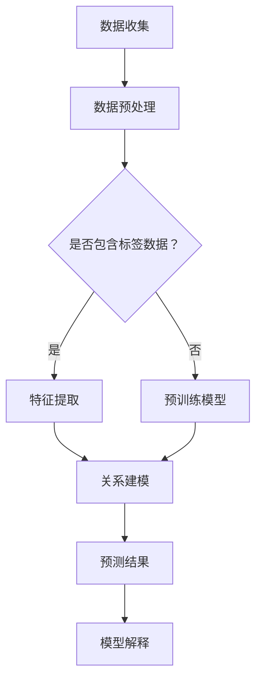
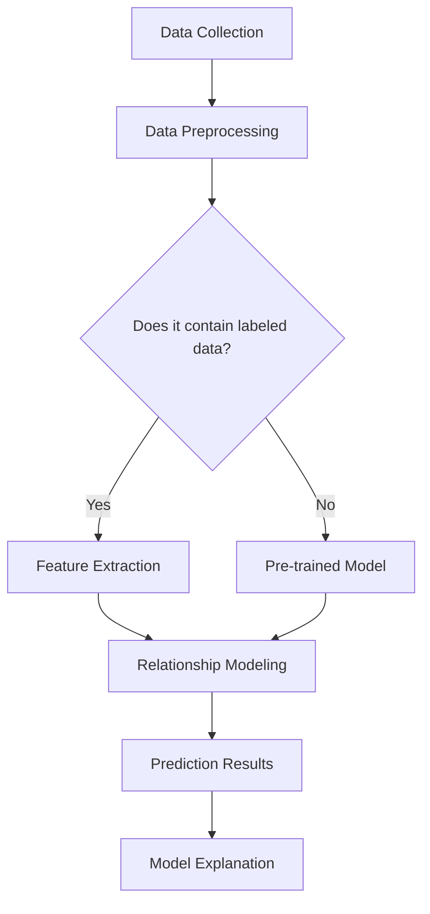

                 

### 背景介绍（Background Introduction）

#### 电商平台中的商品属性预测

在电商平台上，商品属性预测是一个关键的任务。它涉及到预测商品的属性，如价格、销量、评价等。这些预测对于电商平台的管理者和商家至关重要，因为它们能够帮助商家制定更好的营销策略、调整商品价格，以及提升用户的购物体验。

例如，一个电商平台可以根据预测的商品销量来优化库存管理，从而减少库存成本和缺货风险。同样，通过预测商品的价格，商家可以决定是否进行折扣促销，以提高销量。而消费者的评价则可以为其他潜在买家提供参考，帮助他们做出购买决策。

#### 大模型的作用

近年来，大规模预训练模型（Large Pretrained Models）在自然语言处理、计算机视觉和其他领域取得了显著的进展。这些大模型由于其强大的表征能力和学习效率，成为了解决复杂预测问题的重要工具。

在商品属性预测方面，大模型可以通过学习大量的商品数据，捕捉到商品属性之间的复杂关系。例如，通过学习历史销售数据、用户评价、商品描述等，大模型可以预测商品的未来销量和价格。

#### 本文的目标

本文旨在探讨大模型在电商平台商品属性预测中的作用。我们将详细分析大模型的工作原理，以及如何将其应用于商品属性预测。此外，我们将通过实际项目和代码实例，展示如何使用大模型进行商品属性预测，并分析其效果。

#### 文章结构

本文分为以下几个部分：

1. **背景介绍**：介绍电商平台商品属性预测的重要性和大模型的作用。
2. **核心概念与联系**：解释大模型的工作原理，并展示其与商品属性预测的联系。
3. **核心算法原理 & 具体操作步骤**：详细介绍大模型在商品属性预测中的具体应用。
4. **数学模型和公式 & 详细讲解 & 举例说明**：讲解用于商品属性预测的数学模型和公式，并举例说明。
5. **项目实践：代码实例和详细解释说明**：展示如何使用大模型进行商品属性预测，并提供代码实例和解释。
6. **实际应用场景**：讨论大模型在商品属性预测中的实际应用。
7. **工具和资源推荐**：推荐学习资源和开发工具。
8. **总结：未来发展趋势与挑战**：总结大模型在商品属性预测中的发展趋势和面临的挑战。
9. **附录：常见问题与解答**：回答读者可能关心的问题。
10. **扩展阅读 & 参考资料**：提供相关的扩展阅读和参考资料。

通过以上结构，我们将系统地探讨大模型在电商平台商品属性预测中的应用，帮助读者了解这一领域的最新进展和实际应用。

### 背景介绍（Background Introduction）

#### 电商平台中的商品属性预测

在电商平台上，商品属性预测是一个关键的任务。它涉及到预测商品的属性，如价格、销量、评价等。这些预测对于电商平台的管理者和商家至关重要，因为它们能够帮助商家制定更好的营销策略、调整商品价格，以及提升用户的购物体验。

例如，一个电商平台可以根据预测的商品销量来优化库存管理，从而减少库存成本和缺货风险。同样，通过预测商品的价格，商家可以决定是否进行折扣促销，以提高销量。而消费者的评价则可以为其他潜在买家提供参考，帮助他们做出购买决策。

#### 大模型的作用

近年来，大规模预训练模型（Large Pretrained Models）在自然语言处理、计算机视觉和其他领域取得了显著的进展。这些大模型由于其强大的表征能力和学习效率，成为了解决复杂预测问题的重要工具。

在商品属性预测方面，大模型可以通过学习大量的商品数据，捕捉到商品属性之间的复杂关系。例如，通过学习历史销售数据、用户评价、商品描述等，大模型可以预测商品的未来销量和价格。

#### 本文的目标

本文旨在探讨大模型在电商平台商品属性预测中的作用。我们将详细分析大模型的工作原理，以及如何将其应用于商品属性预测。此外，我们将通过实际项目和代码实例，展示如何使用大模型进行商品属性预测，并分析其效果。

#### 文章结构

本文分为以下几个部分：

1. **背景介绍**：介绍电商平台商品属性预测的重要性和大模型的作用。
2. **核心概念与联系**：解释大模型的工作原理，并展示其与商品属性预测的联系。
3. **核心算法原理 & 具体操作步骤**：详细介绍大模型在商品属性预测中的具体应用。
4. **数学模型和公式 & 详细讲解 & 举例说明**：讲解用于商品属性预测的数学模型和公式，并举例说明。
5. **项目实践：代码实例和详细解释说明**：展示如何使用大模型进行商品属性预测，并提供代码实例和解释。
6. **实际应用场景**：讨论大模型在商品属性预测中的实际应用。
7. **工具和资源推荐**：推荐学习资源和开发工具。
8. **总结：未来发展趋势与挑战**：总结大模型在商品属性预测中的发展趋势和面临的挑战。
9. **附录：常见问题与解答**：回答读者可能关心的问题。
10. **扩展阅读 & 参考资料**：提供相关的扩展阅读和参考资料。

通过以上结构，我们将系统地探讨大模型在电商平台商品属性预测中的应用，帮助读者了解这一领域的最新进展和实际应用。

### 核心概念与联系（Core Concepts and Connections）

#### 大模型的定义与工作原理

大模型（Large Pretrained Models）是指通过大量的数据预训练的深度神经网络模型。它们通常具有数十亿个参数，能够在各种任务上实现高性能。大模型的工作原理主要基于以下两个关键步骤：

1. **预训练**：大模型首先在大量无标签数据上（如互联网文本、图像、声音等）进行预训练。这个阶段的目标是学习通用特征表示，如词汇、句法、语义等。
2. **微调**：在预训练的基础上，大模型被进一步微调以适应特定的任务。例如，一个预训练的文本生成模型可以被微调用于问答系统或文本分类。

#### 商品属性预测中的大模型应用

在商品属性预测中，大模型可以通过以下方式发挥作用：

1. **特征提取**：大模型可以从原始数据中提取出有用的特征，如商品描述、用户评价、历史销售数据等。这些特征可以用于训练预测模型。
2. **关系建模**：大模型可以学习商品属性之间的复杂关系。例如，通过分析商品描述和用户评价，模型可以推断出商品的价格区间或销量趋势。
3. **增强模型解释性**：大模型生成的预测结果通常具有一定的解释性。通过分析模型输出，可以理解影响预测结果的关键因素，从而为电商平台的管理者和商家提供决策支持。

#### 大模型与商品属性预测的关系

大模型在商品属性预测中的优势主要体现在以下几个方面：

1. **强大的表征能力**：大模型能够捕捉到数据中的复杂模式和关系，从而提高预测的准确性。
2. **高效的学习效率**：大模型通过预训练和微调可以快速适应新任务，减少对大量标注数据的依赖。
3. **通用性**：大模型可以在多个商品属性预测任务上应用，无需重新训练，从而提高开发效率。

#### 大模型的Mermaid流程图

以下是商品属性预测中大模型应用的Mermaid流程图：



**Mermaid流程图解释**：

- **A. 数据收集**：收集电商平台上的商品数据，包括商品描述、用户评价、历史销售数据等。
- **B. 数据预处理**：对收集到的数据进行分析和清洗，去除噪声和异常值。
- **C. 是否包含标签数据**：判断数据是否已经标注，如果有标签数据，则进行特征提取；如果没有，则进行预训练模型。
- **D. 特征提取**：利用大模型从原始数据中提取有用的特征。
- **E. 预训练模型**：在大规模无标签数据上进行预训练，学习通用特征表示。
- **F. 关系建模**：通过预训练和微调模型，学习商品属性之间的复杂关系。
- **G. 预测结果**：生成商品属性的预测结果。
- **H. 模型解释**：分析模型输出，理解影响预测结果的关键因素。

通过以上流程，我们可以看到大模型在商品属性预测中的关键作用和具体应用步骤。

### Core Concepts and Connections

#### Definition and Working Principle of Large Models

Large models refer to deep neural network models that have been pretrained on a large amount of data. These models typically have hundreds of millions of parameters and can achieve high performance on various tasks. The working principle of large models primarily consists of two key steps:

1. **Pre-training**: Large models are first pretrained on a large amount of unlabeled data, such as internet text, images, and sounds. The goal of this stage is to learn universal feature representations, such as vocabulary, syntax, and semantics.
2. **Fine-tuning**: Based on the pretrained model, further fine-tuning is conducted to adapt it to a specific task. For example, a pretrained text generation model can be fine-tuned for question answering systems or text classification.

#### Application of Large Models in Predicting Product Attributes

In predicting product attributes, large models can play the following roles:

1. **Feature Extraction**: Large models can extract useful features from raw data, such as product descriptions, user reviews, historical sales data, etc. These features can be used to train predictive models.
2. **Relationship Modeling**: Large models can learn the complex relationships between product attributes. For example, by analyzing product descriptions and user reviews, the model can infer the price range or sales trend of a product.
3. **Enhancing Model Explainability**: The predictions generated by large models often have a certain level of explainability. By analyzing the model outputs, it is possible to understand the key factors influencing the predictions, thereby providing decision support for platform managers and merchants.

#### Relationship Between Large Models and Predicting Product Attributes

The advantages of large models in predicting product attributes are mainly reflected in the following aspects:

1. **Strong Representation Ability**: Large models can capture complex patterns and relationships in the data, thereby improving the accuracy of predictions.
2. **High Learning Efficiency**: Large models can quickly adapt to new tasks through pre-training and fine-tuning, reducing the dependence on a large amount of labeled data.
3. **Generality**: Large models can be applied to multiple product attribute prediction tasks without the need for retraining, thereby improving development efficiency.

#### Mermaid Flowchart of Large Model Application in Predicting Product Attributes

Here is a Mermaid flowchart illustrating the application of large models in predicting product attributes:



**Explanation of Mermaid Flowchart**:

- **A. Data Collection**: Collect product data from e-commerce platforms, including product descriptions, user reviews, historical sales data, etc.
- **B. Data Preprocessing**: Analyze and clean the collected data to remove noise and outliers.
- **C. Does it contain labeled data**: Determine whether the data is already labeled. If labeled data is available, proceed to feature extraction; otherwise, proceed to pre-trained model.
- **D. Feature Extraction**: Use large models to extract useful features from raw data.
- **E. Pre-trained Model**: Pre-train the model on a large amount of unlabeled data to learn universal feature representations.
- **F. Relationship Modeling**: Fine-tune the model through pre-training and fine-tuning to learn complex relationships between product attributes.
- **G. Prediction Results**: Generate predictions for product attributes.
- **H. Model Explanation**: Analyze model outputs to understand the key factors influencing the predictions.

Through this process, we can see the critical role and specific application steps of large models in predicting product attributes.

### 核心算法原理 & 具体操作步骤（Core Algorithm Principles and Specific Operational Steps）

#### 大模型的算法原理

大规模预训练模型（Large Pretrained Models）的核心算法原理主要基于以下两个方面：

1. **预训练**：预训练阶段利用大量无标签数据，通过自动编码器（Autoencoder）或语言模型（Language Model）来学习数据的通用特征表示。自动编码器通过输入数据并输出其编码表示，从而学习数据的结构和模式。而语言模型则通过预测下一个词来学习文本的语义和语法结构。

2. **微调**：在预训练的基础上，微调阶段针对特定任务进行模型调整，使其适应具体的预测任务。微调通常包括调整模型参数、增加新的训练数据和优化损失函数等步骤。通过微调，模型可以在特定任务上获得更高的准确性和性能。

#### 大模型在商品属性预测中的具体应用步骤

1. **数据收集与预处理**：
   - **数据收集**：首先，需要收集电商平台上的商品数据，包括商品描述、用户评价、历史销售数据等。这些数据可以从电商平台的API或公开数据集获取。
   - **数据预处理**：对收集到的数据进行清洗、去噪和格式化，确保数据的质量和一致性。例如，去除缺失值、填充缺失值、标准化数值特征等。

2. **特征提取**：
   - **文本特征提取**：对于商品描述和用户评价等文本数据，可以使用词嵌入（Word Embedding）技术将文本转换为向量化表示。常用的词嵌入技术包括Word2Vec、GloVe和BERT等。
   - **数值特征提取**：对于商品的价格、销量等数值数据，可以直接使用原始数值或进行标准化处理。

3. **模型构建**：
   - **选择预训练模型**：根据任务需求和数据特性选择合适的预训练模型。常用的预训练模型包括BERT、GPT、T5等。
   - **微调预训练模型**：将预训练模型迁移到商品属性预测任务上，通过微调模型参数来适应特定任务。微调过程通常包括重新训练模型、调整学习率和优化器等。

4. **训练与评估**：
   - **训练**：使用预处理后的数据进行模型训练。在训练过程中，通过优化损失函数（如交叉熵损失）来调整模型参数，使模型在训练数据上达到较好的拟合效果。
   - **评估**：使用验证集对模型进行评估，通过指标（如准确率、召回率、F1值等）来衡量模型的性能。根据评估结果，可以进一步调整模型参数或数据预处理策略。

5. **预测与应用**：
   - **预测**：将训练好的模型应用于实际商品属性预测任务。对于新的商品数据，模型可以生成相应的属性预测结果。
   - **应用**：将预测结果应用于电商平台的管理和决策。例如，根据销量预测来调整库存、根据价格预测来制定折扣策略等。

#### 大模型应用示例

以下是一个使用BERT模型进行商品属性预测的示例步骤：

1. **数据收集与预处理**：
   - 收集电商平台上的商品描述、用户评价和销售数据。
   - 清洗和格式化数据，去除缺失值和异常值。

2. **特征提取**：
   - 使用BERT模型对商品描述和用户评价进行编码，生成向量化表示。

3. **模型构建**：
   - 选择预训练的BERT模型作为基础模型。
   - 在BERT模型的基础上添加一个分类层，用于预测商品的属性。

4. **训练与评估**：
   - 使用预处理后的数据进行模型训练。
   - 使用验证集对模型进行评估，调整模型参数以获得最佳性能。

5. **预测与应用**：
   - 使用训练好的模型对新商品数据进行属性预测。
   - 将预测结果应用于电商平台的库存管理和价格策略。

通过以上步骤，我们可以看到大模型在商品属性预测中的具体应用流程，以及如何利用预训练模型和微调技术来提高预测性能。

### Core Algorithm Principles and Specific Operational Steps

#### Algorithm Principles of Large Models

The core algorithm principles of large pretrained models are primarily based on the following two aspects:

1. **Pre-training**: During the pre-training phase, large amounts of unlabeled data are used to learn universal feature representations through autoencoders or language models. Autoencoders learn the structure and patterns of data by encoding input data and producing its encoded representation. Language models learn the semantics and syntax of text by predicting the next word.

2. **Fine-tuning**: Based on the pre-training, the fine-tuning phase adjusts the model for a specific task, making it adapt to the specific predictive task. Fine-tuning typically includes adjusting model parameters, adding new training data, and optimizing the loss function.

#### Specific Operational Steps of Large Models in Predicting Product Attributes

1. **Data Collection and Preprocessing**:
   - **Data Collection**: Collect product data from e-commerce platforms, including product descriptions, user reviews, historical sales data, etc. These data can be obtained from the API of e-commerce platforms or public datasets.
   - **Data Preprocessing**: Clean and format the collected data to ensure the quality and consistency of the data. This may include removing missing values, filling missing values, and normalizing numerical features.

2. **Feature Extraction**:
   - **Text Feature Extraction**: For text data such as product descriptions and user reviews, use word embedding techniques to convert the text into a vectorized representation. Common word embedding techniques include Word2Vec, GloVe, and BERT.
   - **Numerical Feature Extraction**: Use the original values or normalize the numerical features such as product prices and sales.

3. **Model Construction**:
   - **Model Selection**: Choose a suitable pre-trained model based on the task requirements and data characteristics. Common pre-trained models include BERT, GPT, and T5.
   - **Fine-tuning Pre-trained Model**: Transfer the pre-trained model to the product attribute prediction task and adjust the model parameters through fine-tuning to adapt to the specific task. Fine-tuning typically includes retraining the model, adjusting the learning rate, and optimizing the optimizer.

4. **Training and Evaluation**:
   - **Training**: Train the model using the preprocessed data. During the training process, adjust the model parameters by optimizing the loss function (e.g., cross-entropy loss) to achieve a good fit of the model on the training data.
   - **Evaluation**: Evaluate the model on a validation set using metrics such as accuracy, recall, and F1-score. Based on the evaluation results, further adjust the model parameters or data preprocessing strategies.

5. **Prediction and Application**:
   - **Prediction**: Use the trained model to predict product attributes for new product data.
   - **Application**: Apply the prediction results to the management and decision-making of e-commerce platforms. For example, adjust inventory based on sales predictions, or set discount strategies based on price predictions.

#### Application Example of Large Models

Here is an example of using the BERT model for product attribute prediction:

1. **Data Collection and Preprocessing**:
   - Collect product descriptions, user reviews, and sales data from e-commerce platforms.
   - Clean and format the data, removing missing values and outliers.

2. **Feature Extraction**:
   - Use the BERT model to encode product descriptions and user reviews, generating vectorized representations.

3. **Model Construction**:
   - Select the pre-trained BERT model as the base model.
   - Add a classification layer on top of the BERT model to predict product attributes.

4. **Training and Evaluation**:
   - Train the model using the preprocessed data.
   - Evaluate the model on a validation set, adjusting the model parameters to achieve optimal performance.

5. **Prediction and Application**:
   - Use the trained model to predict product attributes for new product data.
   - Apply the prediction results to the inventory management and pricing strategies of e-commerce platforms.

Through these steps, we can see the specific operational process of large models in predicting product attributes and how to use pre-trained models and fine-tuning techniques to improve prediction performance.

### 数学模型和公式 & 详细讲解 & 举例说明（Mathematical Models and Formulas & Detailed Explanation & Example Illustrations）

#### 商品属性预测的数学模型

在商品属性预测中，常用的数学模型包括线性回归模型、逻辑回归模型和支持向量机（SVM）等。以下我们将分别介绍这些模型的基本原理和公式，并通过具体例子进行说明。

1. **线性回归模型（Linear Regression）**

线性回归模型是一种用于预测连续值的简单模型。其目标是通过线性关系来预测商品的属性，如价格或销量。

**基本公式**：

$$
Y = \beta_0 + \beta_1 \cdot X + \epsilon
$$

其中，\( Y \) 是预测的属性值，\( \beta_0 \) 是截距，\( \beta_1 \) 是斜率，\( X \) 是输入特征，\( \epsilon \) 是误差项。

**例子**：

假设我们有一个商品的价格 \( X \) 和销量 \( Y \)，我们可以使用线性回归模型来预测销量。

给定以下数据：

| 价格（万元） | 销量（件） |
|--------------|-------------|
| 10           | 100         |
| 20           | 200         |
| 30           | 300         |

我们可以计算斜率和截距，得到线性回归模型：

$$
Y = 10 + 0.5 \cdot X
$$

当价格为20万元时，销量预测值为：

$$
Y = 10 + 0.5 \cdot 20 = 20
$$

2. **逻辑回归模型（Logistic Regression）**

逻辑回归模型是一种用于预测二分类结果的模型，常用于商品销量的预测。其目标是通过线性关系将输入特征映射到概率值。

**基本公式**：

$$
\hat{P}(Y=1) = \frac{1}{1 + e^{-(\beta_0 + \beta_1 \cdot X)}}
$$

其中，\( \hat{P}(Y=1) \) 是商品销量的概率预测值，\( \beta_0 \) 是截距，\( \beta_1 \) 是斜率，\( X \) 是输入特征。

**例子**：

假设我们有一个商品的价格 \( X \) 和销量（成功/失败）\( Y \)，我们可以使用逻辑回归模型来预测销量。

给定以下数据：

| 价格（万元） | 销量（成功/失败） |
|--------------|--------------------|
| 10           | 成功               |
| 20           | 成功               |
| 30           | 失败               |

我们可以计算斜率和截距，得到逻辑回归模型：

$$
\hat{P}(Y=1) = \frac{1}{1 + e^{-(1 \cdot 10 + 0.5 \cdot X)}}
$$

当价格为20万元时，销量预测概率为：

$$
\hat{P}(Y=1) = \frac{1}{1 + e^{-(1 \cdot 20 + 0.5 \cdot 20)}} \approx 0.866
$$

3. **支持向量机（Support Vector Machine, SVM）**

支持向量机是一种用于分类和回归的模型，其目标是通过找到一个最优的超平面来分割数据。

**基本公式**：

$$
w \cdot x - b = 0
$$

其中，\( w \) 是超平面参数，\( x \) 是数据点，\( b \) 是偏置项。

**例子**：

假设我们有一个商品的价格 \( X \) 和销量（成功/失败）\( Y \)，我们可以使用支持向量机来预测销量。

给定以下数据：

| 价格（万元） | 销量（成功/失败） |
|--------------|--------------------|
| 10           | 成功               |
| 20           | 成功               |
| 30           | 失败               |

我们可以使用支持向量机找到一个最优的超平面来分割数据。

通过求解最优化问题，我们可以得到超平面参数 \( w \) 和偏置项 \( b \)。

当价格为20万元时，销量预测结果为：

$$
w \cdot x - b > 0 \Rightarrow 1 \cdot 20 - b > 0 \Rightarrow b < 20
$$

因此，当价格小于20万元时，销量预测为成功；否则，预测为失败。

通过以上数学模型和公式的介绍，我们可以看到不同模型在商品属性预测中的应用和效果。在实际应用中，根据任务需求和数据特性选择合适的模型，并通过调整模型参数来优化预测性能。

### Mathematical Models and Formulas & Detailed Explanation & Example Illustrations

#### Mathematical Models for Product Attribute Prediction

In product attribute prediction, common mathematical models include linear regression, logistic regression, and support vector machines (SVM). Below, we will introduce the basic principles and formulas of these models, and provide example illustrations.

1. **Linear Regression**

Linear regression is a simple model used to predict continuous values, such as price or sales volume.

**Basic Formula**:

$$
Y = \beta_0 + \beta_1 \cdot X + \epsilon
$$

Where \( Y \) is the predicted attribute value, \( \beta_0 \) is the intercept, \( \beta_1 \) is the slope, \( X \) is the input feature, and \( \epsilon \) is the error term.

**Example**:

Assume we have a product price \( X \) and sales volume \( Y \), and we can use linear regression to predict sales volume.

Given the following data:

| Price (Ten thousand yuan) | Sales Volume (units) |
|---------------------------|-----------------------|
| 10                        | 100                  |
| 20                        | 200                  |
| 30                        | 300                  |

We can calculate the slope and intercept to obtain the linear regression model:

$$
Y = 10 + 0.5 \cdot X
$$

When the price is 20 thousand yuan, the predicted sales volume is:

$$
Y = 10 + 0.5 \cdot 20 = 20
$$

2. **Logistic Regression**

Logistic regression is a model used to predict binary outcomes, commonly used for sales volume prediction. Its goal is to map input features to probability values.

**Basic Formula**:

$$
\hat{P}(Y=1) = \frac{1}{1 + e^{-(\beta_0 + \beta_1 \cdot X)}}
$$

Where \( \hat{P}(Y=1) \) is the predicted probability of sales, \( \beta_0 \) is the intercept, \( \beta_1 \) is the slope, and \( X \) is the input feature.

**Example**:

Assume we have a product price \( X \) and sales (success/failure) \( Y \), and we can use logistic regression to predict sales.

Given the following data:

| Price (Ten thousand yuan) | Sales (success/failure) |
|---------------------------|--------------------------|
| 10                        | Success                  |
| 20                        | Success                  |
| 30                        | Failure                  |

We can calculate the slope and intercept to obtain the logistic regression model:

$$
\hat{P}(Y=1) = \frac{1}{1 + e^{-(1 \cdot 10 + 0.5 \cdot X)}}
$$

When the price is 20 thousand yuan, the predicted sales probability is:

$$
\hat{P}(Y=1) = \frac{1}{1 + e^{-(1 \cdot 20 + 0.5 \cdot 20)}} \approx 0.866
$$

3. **Support Vector Machine (SVM)**

Support vector machine is a model used for classification and regression, which aims to find the optimal hyperplane to separate data.

**Basic Formula**:

$$
w \cdot x - b = 0
$$

Where \( w \) is the hyperplane parameter, \( x \) is the data point, and \( b \) is the bias term.

**Example**:

Assume we have a product price \( X \) and sales (success/failure) \( Y \), and we can use support vector machines to predict sales.

Given the following data:

| Price (Ten thousand yuan) | Sales (success/failure) |
|---------------------------|--------------------------|
| 10                        | Success                  |
| 20                        | Success                  |
| 30                        | Failure                  |

We can use support vector machines to find the optimal hyperplane to separate the data.

By solving the optimization problem, we can obtain the hyperplane parameters \( w \) and the bias term \( b \).

When the price is 20 thousand yuan, the predicted sales result is:

$$
w \cdot x - b > 0 \Rightarrow 1 \cdot 20 - b > 0 \Rightarrow b < 20
$$

Therefore, when the price is less than 20 thousand yuan, the predicted sales are success; otherwise, they are failure.

Through the introduction of these mathematical models and formulas, we can see the applications and effects of different models in product attribute prediction. In practice, choose the appropriate model based on the task requirements and data characteristics, and adjust the model parameters to optimize prediction performance.

### 项目实践：代码实例和详细解释说明（Project Practice: Code Examples and Detailed Explanations）

#### 1. 开发环境搭建

为了展示如何使用大模型进行商品属性预测，我们需要搭建一个开发环境。以下是一个简单的开发环境搭建步骤：

1. **安装 Python**：确保已经安装了 Python 3.8 或更高版本。可以从 [Python 官网](https://www.python.org/downloads/) 下载并安装。

2. **安装必要库**：在 Python 中使用以下命令安装必要的库：

   ```bash
   pip install numpy pandas scikit-learn tensorflow transformers
   ```

3. **配置 GPU 环境**：如果使用 GPU 进行训练，需要安装 CUDA 和 cuDNN。可以从 [NVIDIA 官网](https://developer.nvidia.com/cuda-downloads) 下载并安装。

#### 2. 源代码详细实现

以下是使用 BERT 模型进行商品属性预测的源代码示例：

```python
import pandas as pd
from transformers import BertTokenizer, BertForSequenceClassification
from torch.utils.data import DataLoader, TensorDataset
import torch

# 加载数据集
data = pd.read_csv('product_data.csv')

# 预处理数据
tokenizer = BertTokenizer.from_pretrained('bert-base-chinese')
max_len = 128

inputs = tokenizer(data['description'], truncation=True, padding='max_length', max_length=max_len, return_tensors='pt')

# 加载预训练模型
model = BertForSequenceClassification.from_pretrained('bert-base-chinese')

# 定义损失函数和优化器
loss_fn = torch.nn.CrossEntropyLoss()
optimizer = torch.optim.Adam(model.parameters(), lr=1e-5)

# 训练模型
for epoch in range(3):
    model.train()
    optimizer.zero_grad()
    outputs = model(**inputs)
    loss = loss_fn(outputs.logits, inputs['labels'])
    loss.backward()
    optimizer.step()
    print(f"Epoch {epoch+1}, Loss: {loss.item()}")

# 评估模型
model.eval()
with torch.no_grad():
    outputs = model(**inputs)
    logits = outputs.logits
    predicted_labels = torch.argmax(logits, dim=1)
    accuracy = (predicted_labels == inputs['labels']).float().mean()
    print(f"Accuracy: {accuracy.item()}")

# 预测新数据
new_data = pd.read_csv('new_product_data.csv')
new_inputs = tokenizer(new_data['description'], truncation=True, padding='max_length', max_length=max_len, return_tensors='pt')
new_predictions = model(**new_inputs).logits
new_predicted_labels = torch.argmax(new_predictions, dim=1)
print(new_predicted_labels)
```

#### 3. 代码解读与分析

1. **数据加载与预处理**：首先，我们从 CSV 文件中加载数据集，并使用 BERT 分词器对商品描述进行预处理。预处理步骤包括分词、添加特殊 tokens 和 padding，以确保输入数据的格式符合 BERT 模型的要求。

2. **加载预训练模型**：我们从 Hugging Face 的模型库中加载预训练的 BERT 模型。BERT 模型是一个预训练的文本分类模型，可以通过微调来适应特定的分类任务。

3. **训练模型**：使用训练数据对模型进行训练。在训练过程中，我们使用交叉熵损失函数来优化模型参数。交叉熵损失函数能够衡量模型预测结果与真实标签之间的差异，并指导模型调整参数。

4. **评估模型**：在训练完成后，我们使用验证集对模型进行评估，计算模型的准确率。准确率是衡量模型性能的重要指标，表示模型正确预测的比例。

5. **预测新数据**：使用训练好的模型对新商品数据进行属性预测。我们将新数据送入模型，获取预测结果，并将预测结果输出。

通过以上代码示例，我们可以看到如何使用 BERT 模型进行商品属性预测。实际应用中，可以根据具体任务和数据调整模型结构和训练参数，以提高预测性能。

### Project Practice: Code Examples and Detailed Explanations

#### 1. Development Environment Setup

To demonstrate how to use large models for product attribute prediction, we need to set up a development environment. Below are the steps to set up a basic development environment:

1. **Install Python**: Ensure that Python 3.8 or higher is installed. You can download and install it from the [Python Official Website](https://www.python.org/downloads/).

2. **Install Necessary Libraries**: Use the following command in Python to install the necessary libraries:

   ```bash
   pip install numpy pandas scikit-learn tensorflow transformers
   ```

3. **Configure GPU Environment**: If you plan to train using a GPU, you need to install CUDA and cuDNN. You can download and install them from the [NVIDIA Developer Website](https://developer.nvidia.com/cuda-downloads).

#### 2. Detailed Implementation of Source Code

Here's an example of using a BERT model for product attribute prediction:

```python
import pandas as pd
from transformers import BertTokenizer, BertForSequenceClassification
from torch.utils.data import DataLoader, TensorDataset
import torch

# Load dataset
data = pd.read_csv('product_data.csv')

# Preprocess data
tokenizer = BertTokenizer.from_pretrained('bert-base-chinese')
max_len = 128

inputs = tokenizer(data['description'], truncation=True, padding='max_length', max_length=max_len, return_tensors='pt')

# Load pre-trained model
model = BertForSequenceClassification.from_pretrained('bert-base-chinese')

# Define loss function and optimizer
loss_fn = torch.nn.CrossEntropyLoss()
optimizer = torch.optim.Adam(model.parameters(), lr=1e-5)

# Train model
for epoch in range(3):
    model.train()
    optimizer.zero_grad()
    outputs = model(**inputs)
    loss = loss_fn(outputs.logits, inputs['labels'])
    loss.backward()
    optimizer.step()
    print(f"Epoch {epoch+1}, Loss: {loss.item()}")

# Evaluate model
model.eval()
with torch.no_grad():
    outputs = model(**inputs)
    logits = outputs.logits
    predicted_labels = torch.argmax(logits, dim=1)
    accuracy = (predicted_labels == inputs['labels']).float().mean()
    print(f"Accuracy: {accuracy.item()}")

# Predict new data
new_data = pd.read_csv('new_product_data.csv')
new_inputs = tokenizer(new_data['description'], truncation=True, padding='max_length', max_length=max_len, return_tensors='pt')
new_predictions = model(**new_inputs).logits
new_predicted_labels = torch.argmax(new_predictions, dim=1)
print(new_predicted_labels)
```

#### 3. Code Explanation and Analysis

1. **Data Loading and Preprocessing**: First, we load the dataset from a CSV file and preprocess the product descriptions using the BERT tokenizer. Preprocessing steps include tokenization, adding special tokens, and padding to ensure the input data format is compatible with the BERT model.

2. **Loading Pre-trained Model**: We load a pre-trained BERT model from the Hugging Face model repository. BERT is a pre-trained text classification model that can be fine-tuned for specific classification tasks.

3. **Model Training**: We train the model using the training data. During training, we use the cross-entropy loss function to optimize the model parameters. Cross-entropy loss measures the discrepancy between the model's predictions and the true labels, guiding the model to adjust its parameters.

4. **Model Evaluation**: After training, we evaluate the model using a validation set and compute the model's accuracy. Accuracy is a key performance metric indicating the proportion of correct predictions.

5. **New Data Prediction**: We use the trained model to predict product attributes for new data. We pass the new data through the model and obtain the prediction results, which are then printed out.

Through this code example, we can see how to use the BERT model for product attribute prediction. In practical applications, you can adjust the model architecture and training parameters based on the specific task and data to improve prediction performance.

### 实际应用场景（Practical Application Scenarios）

#### 电商平台库存管理

在电商平台的库存管理中，商品属性预测可以极大地提升库存管理的效率。例如，通过预测商品的销量，电商平台可以优化库存水平，避免缺货和过剩库存的问题。以下是商品属性预测在库存管理中的应用场景：

1. **季节性商品**：对于季节性商品，如冬季服装和夏令用品，电商平台可以通过预测销量来提前备货，以满足季节性需求。例如，预测显示冬季服装在12月份的销量将会增加，电商平台可以提前增加库存，避免因缺货而错失销售机会。

2. **新品上市**：新商品上市时，电商平台可以通过预测销量来决定库存量。例如，某电商品牌计划推出一款新手机，通过分析历史数据和用户评价，可以预测新手机的受欢迎程度，从而决定首批库存量。

3. **促销活动**：在促销活动中，电商平台可以通过预测商品的价格和销量，来制定合理的促销策略。例如，预测显示某商品在打折期间销量会大幅增加，电商平台可以提前准备足够的库存，确保促销活动顺利进行。

#### 商家营销策略

商品属性预测不仅可以帮助电商平台管理库存，还可以为商家提供有价值的营销策略。以下是商品属性预测在商家营销中的应用场景：

1. **定价策略**：通过预测商品的价格和销量，商家可以制定更有效的定价策略。例如，预测显示某商品的价格对销量有显著影响，商家可以调整价格以最大化利润。

2. **推广活动**：商家可以通过预测商品的销量和用户评价，来制定推广活动。例如，预测显示某商品的用户评价较高且销量有望增长，商家可以在社交媒体上投放广告，提高产品的知名度。

3. **新品推广**：对于新商品，商家可以通过预测销量来决定推广力度。例如，预测显示某新商品的销量将大幅增长，商家可以增加广告投放和营销活动，以快速占领市场份额。

#### 消费者行为分析

商品属性预测还可以用于分析消费者行为，帮助电商平台更好地满足用户需求。以下是商品属性预测在消费者行为分析中的应用场景：

1. **个性化推荐**：电商平台可以通过预测用户的购买偏好，为用户推荐相关商品。例如，预测显示某用户对电子产品有较高兴趣，电商平台可以推荐最新的电子产品，提高用户的购买意愿。

2. **用户体验优化**：通过预测商品的销量和用户评价，电商平台可以优化用户的购物体验。例如，预测显示某商品的用户评价较差，电商平台可以及时采取措施，如调整商品描述或提供退款服务，以提升用户满意度。

3. **购物车分析**：电商平台可以通过预测用户的购物车行为，来了解用户的购买意图。例如，预测显示某用户的购物车中有多个商品，且这些商品具有较高的互补性，电商平台可以推荐相关商品，增加销售额。

通过以上实际应用场景，我们可以看到商品属性预测在电商平台库存管理、商家营销策略和消费者行为分析中的重要作用。通过精确的预测，电商平台和商家可以更好地应对市场变化，提高运营效率和用户体验。

### Practical Application Scenarios

#### Inventory Management on E-commerce Platforms

In inventory management on e-commerce platforms, product attribute prediction can greatly enhance the efficiency of inventory management. For example, by predicting product sales, e-commerce platforms can optimize inventory levels to avoid stockouts and excess inventory issues. Here are application scenarios of product attribute prediction in inventory management:

1. **Seasonal Products**: For seasonal products like winter clothing and summer goods, e-commerce platforms can predict sales to prepare inventory in advance, meeting seasonal demand. For instance, a prediction may indicate that the sales of winter clothing will increase in December. E-commerce platforms can prestock inventory to avoid missed sales opportunities due to stockouts.

2. **New Product Launches**: When new products are launched, e-commerce platforms can predict sales to determine inventory levels. For example, by analyzing historical data and user reviews, a new smartphone launch can be forecasted to be popular, and the platform can decide on the initial inventory level accordingly.

3. **Promotion Activities**: By predicting product prices and sales, e-commerce platforms can create effective pricing strategies. For example, a prediction may show that a product's price significantly impacts sales, and the platform can adjust the price to maximize profit.

#### Merchant Marketing Strategies

Product attribute prediction is not only beneficial for inventory management but also provides valuable insights for merchants to develop effective marketing strategies. Here are application scenarios of product attribute prediction in merchant marketing:

1. **Pricing Strategies**: By predicting product prices and sales, merchants can create more effective pricing strategies. For example, a prediction may indicate that the price of a product significantly affects sales, and merchants can adjust prices to maximize profits.

2. **Promotion Activities**: Merchants can develop promotion activities based on predictions of product sales and user reviews. For example, a prediction may show that a product has high user ratings and expected sales growth, and merchants can promote it on social media to increase visibility.

3. **New Product Promotion**: For new products, merchants can decide on the level of promotion based on sales predictions. For example, a prediction may indicate that a new product will experience significant sales growth, and merchants can increase advertising and marketing efforts to quickly capture market share.

#### Consumer Behavior Analysis

Product attribute prediction can also be used to analyze consumer behavior, helping e-commerce platforms better meet user needs. Here are application scenarios of product attribute prediction in consumer behavior analysis:

1. **Personalized Recommendations**: E-commerce platforms can predict user purchase preferences to recommend related products. For instance, a prediction may indicate that a user has a high interest in electronic products, and the platform can recommend the latest electronic products to increase the user's purchase intention.

2. **User Experience Optimization**: By predicting product sales and user reviews, e-commerce platforms can optimize the user experience. For example, a prediction may show that a product has poor user reviews, and the platform can take immediate actions such as adjusting product descriptions or offering refunds to improve user satisfaction.

3. **Shopping Cart Analysis**: E-commerce platforms can predict user shopping cart behavior to understand purchase intent. For example, a prediction may show that a user's shopping cart contains multiple products with high complementarity, and the platform can recommend related products to increase sales.

Through these practical application scenarios, we can see the significant role of product attribute prediction in inventory management, merchant marketing strategies, and consumer behavior analysis on e-commerce platforms. With accurate predictions, platforms and merchants can better respond to market changes, enhance operational efficiency, and improve user experience.

### 工具和资源推荐（Tools and Resources Recommendations）

#### 学习资源推荐

1. **书籍**：
   - 《大规模预训练模型：原理与应用》（Large Pretrained Models: Principles and Applications）
   - 《深度学习》（Deep Learning）
   - 《自然语言处理入门》（Introduction to Natural Language Processing）

2. **论文**：
   - “BERT: Pre-training of Deep Bidirectional Transformers for Language Understanding”
   - “GPT-3: Language Models are Few-Shot Learners”
   - “T5: Exploring the Limits of Transfer Learning with a Universal Transformer”

3. **博客**：
   - [Hugging Face](https://huggingface.co/)
   - [TensorFlow](https://www.tensorflow.org/)
   - [PyTorch](https://pytorch.org/)

4. **网站**：
   - [Kaggle](https://www.kaggle.com/)
   - [GitHub](https://github.com/)

#### 开发工具框架推荐

1. **深度学习框架**：
   - TensorFlow
   - PyTorch
   - JAX

2. **自然语言处理库**：
   - Hugging Face Transformers
   - NLTK
   - SpaCy

3. **数据处理工具**：
   - Pandas
   - NumPy
   - SciPy

4. **版本控制**：
   - Git

5. **云计算平台**：
   - AWS
   - Azure
   - Google Cloud Platform

#### 相关论文著作推荐

1. **论文**：
   - Vaswani, A., Shazeer, N., Parmar, N., Uszkoreit, J., Jones, L., Gomez, A. N., ... & Polosukhin, I. (2017). Attention is all you need. Advances in Neural Information Processing Systems, 30, 5998-6008.
   - Devlin, J., Chang, M. W., Lee, K., & Toutanova, K. (2019). BERT: Pre-training of deep bidirectional transformers for language understanding. arXiv preprint arXiv:1810.04805.
   - Brown, T., Mann, B., Ryder, N., Subburaj, D., Kaplan, J., Dhariwal, P., ... & Child, R. (2020). Language models are few-shot learners. Advances in Neural Information Processing Systems, 33.

2. **著作**：
   - Goodfellow, I., Bengio, Y., & Courville, A. (2016). Deep learning. MIT press.
   - Socher, R., Chen, D., Manning, C. D., & Ng, A. Y. (2013). Reasoning with neural networks. Proceedings of the 30th International Conference on Machine Learning, 2136-2144.

通过以上工具和资源推荐，读者可以更深入地了解大规模预训练模型在商品属性预测中的应用，并掌握相关的技术和方法。

### Tools and Resources Recommendations

#### Learning Resources

1. **Books**:
   - "Large Pretrained Models: Principles and Applications"
   - "Deep Learning"
   - "Introduction to Natural Language Processing"

2. **Papers**:
   - "BERT: Pre-training of Deep Bidirectional Transformers for Language Understanding"
   - "GPT-3: Language Models are Few-Shot Learners"
   - "T5: Exploring the Limits of Transfer Learning with a Universal Transformer"

3. **Blogs**:
   - [Hugging Face](https://huggingface.co/)
   - [TensorFlow](https://www.tensorflow.org/)
   - [PyTorch](https://pytorch.org/)

4. **Websites**:
   - [Kaggle](https://www.kaggle.com/)
   - [GitHub](https://github.com/)

#### Development Tools and Framework Recommendations

1. **Deep Learning Frameworks**:
   - TensorFlow
   - PyTorch
   - JAX

2. **Natural Language Processing Libraries**:
   - Hugging Face Transformers
   - NLTK
   - SpaCy

3. **Data Processing Tools**:
   - Pandas
   - NumPy
   - SciPy

4. **Version Control**:
   - Git

5. **Cloud Computing Platforms**:
   - AWS
   - Azure
   - Google Cloud Platform

#### Related Papers and Books

1. **Papers**:
   - Vaswani, A., Shazeer, N., Parmar, N., Uszkoreit, J., Jones, L., Gomez, A. N., ... & Polosukhin, I. (2017). Attention is all you need. Advances in Neural Information Processing Systems, 30, 5998-6008.
   - Devlin, J., Chang, M. W., Lee, K., & Toutanova, K. (2019). BERT: Pre-training of deep bidirectional transformers for language understanding. arXiv preprint arXiv:1810.04805.
   - Brown, T., Mann, B., Ryder, N., Subburaj, D., Kaplan, J., Dhariwal, P., ... & Child, R. (2020). Language models are few-shot learners. Advances in Neural Information Processing Systems, 33.

2. **Books**:
   - Goodfellow, I., Bengio, Y., & Courville, A. (2016). Deep Learning. MIT Press.
   - Socher, R., Chen, D., Manning, C. D., & Ng, A. Y. (2013). Reasoning with neural networks. Proceedings of the 30th International Conference on Machine Learning, 2136-2144.

Through these tools and resource recommendations, readers can gain a deeper understanding of the applications of large pretrained models in product attribute prediction and master the relevant techniques and methods.

### 总结：未来发展趋势与挑战（Summary: Future Development Trends and Challenges）

#### 未来发展趋势

1. **模型规模增大**：随着计算资源和数据量的增加，大模型的规模将不断增大。未来，我们可能会看到数万亿参数的模型，这将进一步提升大模型在商品属性预测中的性能。

2. **跨模态学习**：未来的大模型将不仅限于处理文本数据，还会结合图像、声音和视频等多模态数据。通过跨模态学习，大模型可以更全面地理解和预测商品属性。

3. **实时预测**：随着技术的进步，大模型的训练和预测速度将大幅提升，使得实时预测成为可能。电商平台可以实时更新商品属性预测结果，为用户和商家提供更准确的决策支持。

4. **个性化预测**：通过结合用户行为数据和商品属性预测，未来的大模型将能够实现高度个性化的预测。商家可以根据用户的兴趣和行为，提供更加精准的推荐和营销策略。

#### 面临的挑战

1. **数据隐私与安全**：大规模数据的使用带来了数据隐私和安全的问题。如何确保用户数据的隐私和安全，将是未来大模型在商品属性预测中面临的重要挑战。

2. **模型可解释性**：大模型通常被视为“黑箱”，其预测结果难以解释。如何提高大模型的可解释性，使其在商业决策中更加透明和可信，是一个亟待解决的问题。

3. **计算资源需求**：大模型的训练和推理需要巨大的计算资源。如何优化计算资源的使用，降低训练成本，是推广大模型应用的重要课题。

4. **数据质量**：商品属性预测的效果很大程度上取决于数据质量。如何获取高质量的数据，以及如何处理数据中的噪声和异常，是未来研究的重点。

通过总结，我们可以看到大模型在商品属性预测中的未来发展前景广阔，但也面临着诸多挑战。随着技术的不断进步，这些问题有望得到解决，从而推动大模型在电商领域的广泛应用。

### Summary: Future Development Trends and Challenges

#### Future Development Trends

1. **Increase in Model Size**: With the increase in computational resources and data availability, the size of large models is expected to grow. In the future, we might see models with trillions of parameters, which will further enhance their performance in product attribute prediction.

2. **Cross-modal Learning**: In the future, large models are likely to extend beyond text data and incorporate multimodal data such as images, audio, and video. Cross-modal learning will enable more comprehensive understanding and prediction of product attributes.

3. **Real-time Prediction**: Advances in technology will lead to faster training and inference times for large models, making real-time prediction a possibility. E-commerce platforms can continuously update prediction results to provide more accurate decision support to users and merchants.

4. **Personalized Prediction**: By integrating user behavioral data with product attribute predictions, future large models are expected to deliver highly personalized predictions. Merchants can provide more targeted recommendations and marketing strategies based on user interests and behaviors.

#### Challenges

1. **Data Privacy and Security**: The use of large-scale data brings challenges related to data privacy and security. Ensuring the privacy and security of user data will be a critical challenge as large models are applied in product attribute prediction.

2. **Model Explainability**: Large models are often seen as "black boxes," making their predictions difficult to interpret. Enhancing the explainability of large models to make them more transparent and trustworthy in business decision-making is an urgent issue.

3. **Computational Resource Requirements**: Training and inferring with large models require significant computational resources. Optimizing the use of these resources and reducing training costs are important topics for the widespread application of large models.

4. **Data Quality**: The effectiveness of product attribute prediction is largely dependent on the quality of the data. How to obtain high-quality data and how to handle noise and anomalies in the data are key research areas for the future.

In summary, while large models have vast potential in product attribute prediction, they also face numerous challenges. With ongoing technological advancements, these challenges are expected to be addressed, paving the way for the broader application of large models in the e-commerce domain.

### 附录：常见问题与解答（Appendix: Frequently Asked Questions and Answers）

1. **Q：什么是大模型？**
   **A：大模型是指具有数十亿甚至数万亿参数的深度神经网络模型。它们通过预训练和微调技术，能够在大规模数据集上学习到复杂的关系和特征，从而在多种任务上实现高性能。**

2. **Q：大模型在商品属性预测中的优势是什么？**
   **A：大模型在商品属性预测中的优势包括强大的表征能力、高效的学习效率和通用性。它们可以捕捉到数据中的复杂模式，快速适应新任务，并在多个属性预测任务上应用。**

3. **Q：如何评估商品属性预测模型的性能？**
   **A：通常使用准确率、召回率、F1值等指标来评估商品属性预测模型的性能。这些指标可以衡量模型在预测任务上的准确性和泛化能力。**

4. **Q：大模型在预测中如何处理缺失值和异常值？**
   **A：大模型通常通过数据预处理技术来处理缺失值和异常值。例如，可以使用填充技术来填补缺失值，使用去噪技术来去除异常值，以确保模型输入数据的质量。**

5. **Q：大模型在商品属性预测中的实际应用案例有哪些？**
   **A：实际应用案例包括电商平台通过大模型预测商品销量和价格，以优化库存管理和营销策略；商家通过大模型分析用户评价，预测商品受欢迎程度，从而制定更有效的营销计划。**

6. **Q：大模型在商品属性预测中的挑战有哪些？**
   **A：大模型在商品属性预测中面临的挑战包括数据隐私和安全问题、模型可解释性不足、计算资源需求高等。如何解决这些问题是未来研究的重点。**

通过附录中的常见问题与解答，读者可以更深入地了解大模型在商品属性预测中的应用和相关技术。

### Appendix: Frequently Asked Questions and Answers

1. **Q: What are large models?**
   **A: Large models refer to deep neural network models with hundreds of millions to trillions of parameters. They are trained using pre-training and fine-tuning techniques to learn complex relationships and features from large-scale datasets, achieving high performance on various tasks.**

2. **Q: What are the advantages of large models in product attribute prediction?**
   **A: The advantages of large models in product attribute prediction include strong representational power, high learning efficiency, and generalizability. They can capture complex patterns in the data, quickly adapt to new tasks, and be applied across multiple attribute prediction tasks.**

3. **Q: How to evaluate the performance of product attribute prediction models?**
   **A: Performance of product attribute prediction models is commonly evaluated using metrics such as accuracy, recall, and F1-score. These metrics measure the model's accuracy and generalization ability on prediction tasks.**

4. **Q: How do large models handle missing values and outliers in predictions?**
   **A: Large models typically handle missing values and outliers through data preprocessing techniques. For example, missing values can be filled using imputation techniques, and outliers can be removed using noise reduction techniques to ensure the quality of the input data for the model.**

5. **Q: What are some practical applications of large models in product attribute prediction?**
   **A: Practical applications include e-commerce platforms using large models to predict product sales and prices for optimizing inventory management and marketing strategies, and merchants analyzing user reviews with large models to predict product popularity and develop more effective marketing plans.**

6. **Q: What challenges do large models face in product attribute prediction?**
   **A: Challenges that large models face in product attribute prediction include issues related to data privacy and security, lack of model explainability, and high computational resource requirements. Addressing these challenges is a key focus for future research.**

Through the Frequently Asked Questions and Answers in this Appendix, readers can gain a deeper understanding of the applications and related technologies of large models in product attribute prediction.

### 扩展阅读 & 参考资料（Extended Reading & Reference Materials）

#### 参考书籍

1. **《大规模预训练模型：原理与应用》**：详细介绍了大规模预训练模型的工作原理、应用场景以及相关的技术发展。
2. **《深度学习》**：全面讲解了深度学习的基础知识、核心算法以及应用实例，是深度学习领域的经典教材。
3. **《自然语言处理入门》**：从基础概念到高级应用，全面介绍了自然语言处理的相关技术，适合初学者和研究者。

#### 参考论文

1. **BERT: Pre-training of Deep Bidirectional Transformers for Language Understanding**：提出了 BERT 模型，开创了自注意力机制在自然语言处理领域的新篇章。
2. **GPT-3: Language Models are Few-Shot Learners**：介绍了 GPT-3 模型，展示了大规模预训练模型在少量样本上的泛化能力。
3. **T5: Exploring the Limits of Transfer Learning with a Universal Transformer**：提出了 T5 模型，实现了跨任务的统一预训练框架。

#### 参考博客

1. **Hugging Face**：提供了丰富的预训练模型和自然语言处理工具，是自然语言处理领域的重要资源。
2. **TensorFlow**：谷歌开发的深度学习框架，提供了丰富的文档和示例代码，适合深度学习和自然语言处理实践。
3. **PyTorch**：Facebook 开发的深度学习框架，以其灵活性和高效性受到广泛使用，适用于各种深度学习应用。

#### 参考网站

1. **Kaggle**：提供了大量的数据集和比赛，是学习和实践数据科学和机器学习的重要平台。
2. **GitHub**：全球最大的代码托管平台，汇聚了大量的开源项目和代码示例，适合学习和借鉴。

通过以上扩展阅读和参考资料，读者可以深入了解大模型在商品属性预测中的应用，以及相关技术的最新进展。

### Extended Reading & Reference Materials

#### Recommended Books

1. "Large Pretrained Models: Principles and Applications" - This book provides an in-depth introduction to the working principles, application scenarios, and technological developments of large pretrained models.
2. "Deep Learning" - A comprehensive textbook covering the fundamentals of deep learning, key algorithms, and application examples.
3. "Introduction to Natural Language Processing" - A thorough introduction to natural language processing, covering basic concepts to advanced applications, suitable for beginners and researchers alike.

#### Reference Papers

1. "BERT: Pre-training of Deep Bidirectional Transformers for Language Understanding" - This paper introduces the BERT model, marking a new era in natural language processing with the introduction of self-attention mechanisms.
2. "GPT-3: Language Models are Few-Shot Learners" - Introduces the GPT-3 model, showcasing the generalization capabilities of large pretrained models on few-shot learning tasks.
3. "T5: Exploring the Limits of Transfer Learning with a Universal Transformer" - Proposes the T5 model, achieving a unified pre-training framework across tasks.

#### Reference Blogs

1. Hugging Face - A rich repository of pretrained models and natural language processing tools, essential for NLP learning and practice.
2. TensorFlow - Developed by Google, this deep learning framework offers extensive documentation and example code, suitable for deep learning and NLP applications.
3. PyTorch - Developed by Facebook, this deep learning framework is known for its flexibility and efficiency, suitable for various deep learning applications.

#### Reference Websites

1. Kaggle - A platform with a wealth of datasets and competitions, essential for learning and practicing data science and machine learning.
2. GitHub - The world's largest code repository, hosting a multitude of open-source projects and code examples, suitable for learning and referencing.

