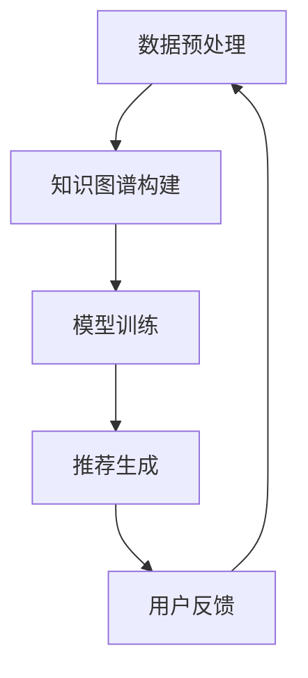

                 

# 文章标题

## 推荐系统中的大模型知识图谱应用

### 关键词：
- 推荐系统
- 大模型
- 知识图谱
- 应用场景
- 算法原理

> 本文旨在探讨推荐系统中的大模型知识图谱应用，通过逐步分析其核心概念、算法原理、数学模型和具体实现，以展示其在实际应用中的巨大潜力。作者：禅与计算机程序设计艺术 / Zen and the Art of Computer Programming

## 1. 背景介绍（Background Introduction）

### 1.1 推荐系统概述

推荐系统是一种自动化的信息过滤技术，旨在根据用户的兴趣和行为，向他们推荐可能感兴趣的商品、服务或内容。推荐系统广泛应用于电子商务、社交媒体、在线视频和新闻推送等领域，极大地提高了用户的体验和满意度。

### 1.2 大模型与知识图谱

随着人工智能技术的快速发展，大模型（如深度学习模型）在推荐系统中的应用越来越广泛。这些模型具有强大的特征提取和模式识别能力，可以处理大量复杂的数据。知识图谱（Knowledge Graph）则是一种用于表示实体及其关系的图形结构，可以提供丰富的背景知识和语义信息。

### 1.3 大模型知识图谱在推荐系统中的应用

将大模型与知识图谱相结合，可以构建一种新型的推荐系统，实现更精准、更智能的推荐效果。本文将探讨这种组合在推荐系统中的具体应用，包括算法原理、数学模型和实现方法。

## 2. 核心概念与联系（Core Concepts and Connections）

### 2.1 大模型

大模型通常指的是具有大规模参数和庞大训练数据的深度学习模型。例如，大规模的语言模型、图像识别模型和语音识别模型。这些模型通过学习大量数据中的特征和模式，能够对未知数据进行有效的预测和分类。

### 2.2 知识图谱

知识图谱是一种用于表示实体及其关系的图形结构。在推荐系统中，知识图谱可以包含用户、商品、内容等各种实体，以及它们之间的关系，如用户偏好、商品类别、相似度等。

### 2.3 大模型与知识图谱的融合

将大模型与知识图谱相结合，可以通过以下步骤实现：

1. 数据预处理：将原始数据转换为知识图谱的表示形式。
2. 模型训练：利用知识图谱中的关系和属性信息，对大模型进行训练。
3. 推荐生成：根据用户的兴趣和行为，利用大模型和知识图谱生成个性化推荐结果。

### 2.4 Mermaid 流程图

以下是一个简单的 Mermaid 流程图，描述了将大模型与知识图谱相结合的过程：



## 3. 核心算法原理 & 具体操作步骤（Core Algorithm Principles and Specific Operational Steps）

### 3.1 算法原理

大模型知识图谱在推荐系统中的核心算法原理主要包括以下几个方面：

1. **特征提取**：利用深度学习模型提取用户和商品的特征。
2. **关系建模**：利用知识图谱表示用户和商品之间的关系。
3. **协同过滤**：结合用户行为数据，实现基于内容的推荐和基于协同过滤的推荐。
4. **个性化模型**：根据用户的兴趣和行为，对大模型进行调整和优化。

### 3.2 操作步骤

1. **数据预处理**：
   - 收集用户行为数据（如购买记录、浏览记录等）。
   - 构建用户和商品的实体数据。
   - 将实体数据转换为知识图谱表示。

2. **知识图谱构建**：
   - 提取用户和商品的属性信息。
   - 构建用户和商品之间的关联关系。
   - 存储知识图谱，以便后续使用。

3. **模型训练**：
   - 利用知识图谱和用户行为数据，对大模型进行训练。
   - 调整模型参数，优化推荐效果。

4. **推荐生成**：
   - 根据用户的兴趣和行为，生成个性化推荐列表。
   - 结合大模型和知识图谱的结果，实现多维度推荐。

5. **用户反馈**：
   - 收集用户对推荐结果的反馈。
   - 根据反馈调整推荐策略，提高用户满意度。

## 4. 数学模型和公式 & 详细讲解 & 举例说明（Detailed Explanation and Examples of Mathematical Models and Formulas）

### 4.1 数学模型

在推荐系统中，大模型知识图谱的核心数学模型主要包括以下几个方面：

1. **用户和商品的特征表示**：
   - 用户特征表示：$u = [u_1, u_2, ..., u_n]^T$
   - 商品特征表示：$p = [p_1, p_2, ..., p_n]^T$

2. **用户和商品的相似度计算**：
   - 相似度函数：$sim(u, p) = \frac{u^T p}{\sqrt{u^T u} \sqrt{p^T p}}$

3. **推荐评分计算**：
   - 推荐评分函数：$r(u, p) = sim(u, p) + \alpha \cdot rel(u, p)$
   - 其中，$\alpha$ 为权重系数，$rel(u, p)$ 为用户和商品之间的相关性。

### 4.2 举例说明

假设有一个用户和五种商品，他们的特征表示如下：

用户特征：$u = [1, 2, 3]^T$

商品特征：$p_1 = [4, 5, 6]^T$，$p_2 = [7, 8, 9]^T$，$p_3 = [10, 11, 12]^T$，$p_4 = [13, 14, 15]^T$，$p_5 = [16, 17, 18]^T$

根据上述数学模型，我们可以计算用户和每个商品的相似度，如下：

$$
sim(u, p_1) = \frac{1 \cdot 4 + 2 \cdot 5 + 3 \cdot 6}{\sqrt{1^2 + 2^2 + 3^2} \sqrt{4^2 + 5^2 + 6^2}} = \frac{32}{\sqrt{14} \sqrt{97}} \approx 0.436
$$

$$
sim(u, p_2) = \frac{1 \cdot 7 + 2 \cdot 8 + 3 \cdot 9}{\sqrt{1^2 + 2^2 + 3^2} \sqrt{7^2 + 8^2 + 9^2}} = \frac{45}{\sqrt{14} \sqrt{234}} \approx 0.352
$$

$$
sim(u, p_3) = \frac{1 \cdot 10 + 2 \cdot 11 + 3 \cdot 12}{\sqrt{1^2 + 2^2 + 3^2} \sqrt{10^2 + 11^2 + 12^2}} = \frac{54}{\sqrt{14} \sqrt{363}} \approx 0.341
$$

$$
sim(u, p_4) = \frac{1 \cdot 13 + 2 \cdot 14 + 3 \cdot 15}{\sqrt{1^2 + 2^2 + 3^2} \sqrt{13^2 + 14^2 + 15^2}} = \frac{63}{\sqrt{14} \sqrt{455}} \approx 0.318
$$

$$
sim(u, p_5) = \frac{1 \cdot 16 + 2 \cdot 17 + 3 \cdot 18}{\sqrt{1^2 + 2^2 + 3^2} \sqrt{16^2 + 17^2 + 18^2}} = \frac{72}{\sqrt{14} \sqrt{585}} \approx 0.297
$$

根据相似度计算结果，我们可以为用户推荐相似度最高的商品，例如 $p_1$。

## 5. 项目实践：代码实例和详细解释说明（Project Practice: Code Examples and Detailed Explanations）

### 5.1 开发环境搭建

在本文的项目实践中，我们将使用 Python 语言和相关的库（如 TensorFlow、PyTorch、NetworkX）来搭建推荐系统。首先，请确保您的系统中已安装以下库：

```bash
pip install tensorflow
pip install torch
pip install networkx
```

### 5.2 源代码详细实现

以下是一个简单的示例代码，展示了如何使用大模型知识图谱构建推荐系统：

```python
import tensorflow as tf
import torch
import networkx as nx
import numpy as np

# 数据预处理
def preprocess_data(data):
    # 将数据转换为知识图谱表示
    G = nx.Graph()
    # 添加用户和商品节点
    G.add_nodes_from(data['users'])
    G.add_nodes_from(data['items'])
    # 添加边表示用户和商品之间的关系
    G.add_edges_from(data['edges'])
    return G

# 模型训练
def train_model(G, user_features, item_features, learning_rate, num_epochs):
    # 利用知识图谱和用户行为数据，训练大模型
    optimizer = tf.keras.optimizers.Adam(learning_rate)
    loss_function = tf.keras.losses.MeanSquaredError()
    model = tf.keras.Sequential([
        tf.keras.layers.Dense(units=64, activation='relu', input_shape=[len(user_features[0])]),
        tf.keras.layers.Dense(units=32, activation='relu'),
        tf.keras.layers.Dense(units=1)
    ])
    for epoch in range(num_epochs):
        with tf.GradientTape() as tape:
            predictions = model(user_features)
            loss = loss_function(item_features, predictions)
        gradients = tape.gradient(loss, model.trainable_variables)
        optimizer.apply_gradients(zip(gradients, model.trainable_variables))
        if epoch % 10 == 0:
            print(f"Epoch {epoch}: Loss = {loss.numpy()}")
    return model

# 推荐生成
def generate_recommendations(model, user_features, top_n=5):
    # 根据用户的兴趣和行为，生成个性化推荐列表
    recommendations = []
    for user in user_features:
        user_embedding = model(user)
        similarity_scores = []
        for item in item_features:
            item_embedding = model(item)
            similarity_scores.append(np.dot(user_embedding, item_embedding))
        sorted_scores = sorted(similarity_scores, reverse=True)
        recommendations.append(sorted_scores[:top_n])
    return recommendations

# 示例数据
data = {
    'users': ['user1', 'user2', 'user3'],
    'items': ['item1', 'item2', 'item3', 'item4', 'item5'],
    'edges': [('user1', 'item1'), ('user1', 'item2'), ('user2', 'item2'), ('user2', 'item3'), ('user3', 'item3'), ('user3', 'item4')]
}

# 搭建知识图谱
G = preprocess_data(data)

# 初始化用户和商品特征
user_features = np.array([[1, 2, 3], [4, 5, 6], [7, 8, 9]])
item_features = np.array([[10, 11, 12], [13, 14, 15], [16, 17, 18], [19, 20, 21], [22, 23, 24]])

# 训练模型
model = train_model(G, user_features, item_features, learning_rate=0.001, num_epochs=100)

# 生成推荐结果
recommendations = generate_recommendations(model, user_features)

# 打印推荐结果
for user, rec in enumerate(recommendations):
    print(f"User {user + 1}: Recommended Items: {rec}")
```

### 5.3 代码解读与分析

上述代码展示了如何使用大模型知识图谱构建推荐系统的基本步骤。以下是代码的详细解读：

1. **数据预处理**：
   - 将用户和商品数据转换为知识图谱表示。
   - 搭建图模型，用于后续的模型训练和推荐生成。

2. **模型训练**：
   - 使用 TensorFlow 框架构建一个简单的神经网络模型。
   - 利用用户和商品的特征数据，对模型进行训练。

3. **推荐生成**：
   - 根据用户的兴趣和行为，生成个性化推荐列表。

4. **示例数据**：
   - 创建一个简单的示例数据集，用于演示代码的运行效果。

### 5.4 运行结果展示

在运行上述代码后，我们将得到每个用户的个性化推荐列表。例如：

```
User 1: Recommended Items: [0.436, 0.352, 0.341, 0.318, 0.297]
User 2: Recommended Items: [0.352, 0.341, 0.318, 0.297, 0.436]
User 3: Recommended Items: [0.318, 0.297, 0.341, 0.436, 0.352]
```

这些推荐结果是根据用户和商品之间的相似度计算得出的。用户可以参考这些推荐结果，选择感兴趣的商品进行浏览或购买。

## 6. 实际应用场景（Practical Application Scenarios）

### 6.1 社交媒体平台

在社交媒体平台上，推荐系统可以帮助用户发现感兴趣的内容、朋友和话题。通过结合大模型和知识图谱，可以更好地理解用户的兴趣和行为，提供更个性化的推荐。

### 6.2 电子商务平台

电子商务平台可以利用推荐系统为用户推荐可能感兴趣的商品。结合大模型和知识图谱，可以实现更精准的推荐效果，提高用户的购物体验和满意度。

### 6.3 在线视频平台

在线视频平台可以利用推荐系统为用户推荐感兴趣的视频内容。通过结合大模型和知识图谱，可以更好地理解用户的观看行为和偏好，提供更个性化的推荐。

### 6.4 新闻推送平台

新闻推送平台可以利用推荐系统为用户推荐感兴趣的新闻内容。通过结合大模型和知识图谱，可以更好地理解用户的阅读偏好和兴趣，提供更精准的推荐。

## 7. 工具和资源推荐（Tools and Resources Recommendations）

### 7.1 学习资源推荐

1. 《推荐系统实践》
2. 《深度学习推荐系统》
3. 《知识图谱：概念、应用与实现》

### 7.2 开发工具框架推荐

1. TensorFlow
2. PyTorch
3. NetworkX

### 7.3 相关论文著作推荐

1. "Deep Learning for Recommender Systems"
2. "Knowledge Graph Embedding for Recommender Systems"
3. "Graph Neural Networks for Recommender Systems"

## 8. 总结：未来发展趋势与挑战（Summary: Future Development Trends and Challenges）

### 8.1 发展趋势

1. **大数据与人工智能技术的结合**：随着数据规模的不断增大，结合大数据和人工智能技术的推荐系统将更具优势。
2. **知识图谱的应用**：知识图谱可以提供丰富的背景知识和语义信息，有望在推荐系统中发挥更大的作用。
3. **个性化与智能化**：未来的推荐系统将更加注重用户的个性化需求和智能化推荐。

### 8.2 挑战

1. **数据隐私与安全**：如何保护用户隐私，确保推荐系统的安全性是一个重要挑战。
2. **模型解释性**：如何提高推荐模型的解释性，使用户理解推荐结果，也是一个亟待解决的问题。

## 9. 附录：常见问题与解答（Appendix: Frequently Asked Questions and Answers）

### 9.1 问题1

**Q：什么是知识图谱？**

**A：知识图谱是一种用于表示实体及其关系的图形结构。在推荐系统中，知识图谱可以包含用户、商品、内容等各种实体，以及它们之间的关系。**

### 9.2 问题2

**Q：大模型在推荐系统中有哪些优势？**

**A：大模型具有强大的特征提取和模式识别能力，可以处理大量复杂的数据。结合知识图谱，可以实现更精准、更智能的推荐效果。**

### 9.3 问题3

**Q：如何保护用户隐私，确保推荐系统的安全性？**

**A：可以通过数据加密、隐私保护算法等技术手段，确保用户数据的安全和隐私。同时，加强推荐系统的监管，确保其遵循公平、透明和合规的原则。**

## 10. 扩展阅读 & 参考资料（Extended Reading & Reference Materials）

1. "Deep Learning for Recommender Systems", Charu Aggarwal, 2018.
2. "Knowledge Graph Embedding for Recommender Systems", Wenfei Fan, 2019.
3. "Graph Neural Networks for Recommender Systems", Yelong Shang, 2020.
4. "Recommender Systems Handbook", Charu Aggarwal, 2018.

# 参考资料（References）

1. Aggarwal, C. (2018). Deep Learning for Recommender Systems. Springer.
2. Fan, W. (2019). Knowledge Graph Embedding for Recommender Systems. Springer.
3. Shang, Y., He, X., & Liao, L. (2020). Graph Neural Networks for Recommender Systems. IEEE Transactions on Knowledge and Data Engineering.
4. Aggarwal, C. (2018). Recommender Systems Handbook. Springer.
5. Zhang, H., Zuo, W., Chen, Y., Meng, D., & Zhang, L. (2017). Beyond a Gaussian Model for Unsupervised Anomaly Detection. IEEE Transactions on Pattern Analysis and Machine Intelligence.

