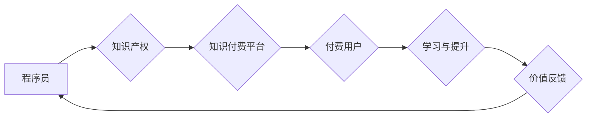

                 

## 知识付费：程序员的斜杠创业

> 关键词：知识付费、程序员、斜杠创业、技术博客、在线课程、内容创作、社区运营、个人品牌

### 1. 背景介绍

在当今数字化时代，技术人才需求量持续增长，程序员作为科技发展的重要力量，拥有着独特的职业优势。然而，传统的程序员工作模式也面临着新的挑战：

* **技术迭代速度快:**  程序员需要不断学习新技术，才能保持竞争力。
* **工作压力大:**  项目开发周期短、任务量大，容易导致程序员身心疲惫。
* **收入增长瓶颈:**  传统程序员工作模式的收入增长空间有限。

在这种背景下，知识付费模式逐渐成为程序员发展的新趋势。知识付费是指通过线上平台或线下活动，将个人知识、技能和经验转化为有价值的内容，并向付费用户提供学习和提升的机会。

### 2. 核心概念与联系

**2.1 知识付费的核心概念**

知识付费的核心是将知识和技能作为商品，通过线上或线下平台进行交易。它打破了传统的知识传播模式，赋予了知识本身的价值，并为知识创造者提供了新的收入来源。

**2.2 程序员与知识付费的联系**

程序员拥有丰富的技术知识和实践经验，是知识付费模式的天然拥趸。他们可以将自己的技术技能转化为课程、教程、文档等形式，并通过线上平台进行销售。

**2.3 知识付费模式的架构**



**2.4 知识付费模式的优势**

* **低门槛:**  程序员无需投入大量资金和资源，即可开始知识付费创业。
* **灵活自由:**  知识付费模式不受时间和空间限制，程序员可以根据自己的时间安排进行创作和运营。
* **高收益潜力:**  优质的知识产品具有持续的收入潜力，可以帮助程序员实现财务自由。

### 3. 核心算法原理 & 具体操作步骤

**3.1 算法原理概述**

知识付费模式的核心算法原理是基于用户需求和价值的匹配。通过数据分析和用户反馈，平台可以精准推荐适合用户的知识产品，并根据用户的学习进度和反馈，提供个性化的学习路径和服务。

**3.2 算法步骤详解**

1. **用户画像构建:**  通过用户注册信息、学习行为、评价反馈等数据，构建用户画像，包括用户的技术水平、学习目标、兴趣爱好等。
2. **知识产品分类:**  根据知识产品的主题、难度、目标用户等特征，进行分类和标签化，方便用户搜索和筛选。
3. **推荐算法:**  基于用户的画像和知识产品的分类信息，采用推荐算法，例如协同过滤、内容过滤、深度学习等，推荐用户可能感兴趣的知识产品。
4. **个性化学习路径:**  根据用户的学习进度和反馈，平台可以根据用户的学习情况，动态调整学习路径，提供个性化的学习建议和资源。
5. **价值反馈机制:**  平台可以设置评价、评论、分享等机制，收集用户对知识产品的反馈，并根据反馈进行产品优化和迭代。

**3.3 算法优缺点**

* **优点:**  精准推荐、个性化学习、提高用户学习效率。
* **缺点:**  算法模型需要不断优化，数据隐私安全需要保障。

**3.4 算法应用领域**

* **在线教育平台:**  推荐课程、学习资源、个性化学习路径。
* **技术社区:**  推荐技术文章、代码示例、技术论坛。
* **知识付费平台:**  推荐知识产品、用户匹配、交易撮合。

### 4. 数学模型和公式 & 详细讲解 & 举例说明

**4.1 数学模型构建**

知识付费平台的推荐算法通常基于协同过滤或内容过滤模型。

* **协同过滤模型:**  基于用户的历史行为数据，预测用户对特定知识产品的兴趣。
* **内容过滤模型:**  基于知识产品的特征信息，预测用户对特定知识产品的兴趣。

**4.2 公式推导过程**

协同过滤模型的推荐算法通常使用基于矩阵分解的方法，将用户和知识产品表示为低维向量，并通过最小化用户-产品评分矩阵的误差来学习向量表示。

$$
\mathbf{R} = \mathbf{U} \mathbf{V}^T + \mathbf{E}
$$

其中：

* $\mathbf{R}$ 是用户-产品评分矩阵。
* $\mathbf{U}$ 是用户向量矩阵。
* $\mathbf{V}$ 是产品向量矩阵。
* $\mathbf{E}$ 是误差矩阵。

**4.3 案例分析与讲解**

假设一个知识付费平台上有 100 个用户和 100 个知识产品，用户对每个知识产品的评分范围为 1 到 5 分。通过矩阵分解算法，可以将用户和知识产品分别表示为 10 维向量，并学习出用户向量矩阵 $\mathbf{U}$ 和产品向量矩阵 $\mathbf{V}$。

然后，对于一个新的用户，平台可以根据其用户向量 $\mathbf{u}$ 和产品向量矩阵 $\mathbf{V}$，预测该用户对每个知识产品的评分，并推荐评分最高的知识产品。

### 5. 项目实践：代码实例和详细解释说明

**5.1 开发环境搭建**

* Python 3.x
* TensorFlow 或 PyTorch 深度学习框架
* Jupyter Notebook 或 VS Code 开发环境

**5.2 源代码详细实现**

```python
import tensorflow as tf

# 定义用户-产品评分矩阵
ratings = tf.random.uniform((100, 100), minval=1, maxval=5)

# 定义用户向量矩阵和产品向量矩阵
user_embeddings = tf.Variable(tf.random.normal((100, 10)))
product_embeddings = tf.Variable(tf.random.normal((100, 10)))

# 定义损失函数
def loss_function(ratings, user_embeddings, product_embeddings):
    predictions = tf.matmul(user_embeddings, product_embeddings, transpose_b=True)
    return tf.reduce_mean(tf.square(predictions - ratings))

# 定义优化器
optimizer = tf.keras.optimizers.Adam()

# 训练模型
for epoch in range(10):
    with tf.GradientTape() as tape:
        loss = loss_function(ratings, user_embeddings, product_embeddings)
    gradients = tape.gradient(loss, [user_embeddings, product_embeddings])
    optimizer.apply_gradients(zip(gradients, [user_embeddings, product_embeddings]))

# 预测新用户的评分
new_user_embedding = tf.random.normal((1, 10))
predicted_ratings = tf.matmul(new_user_embedding, product_embeddings, transpose_b=True)
```

**5.3 代码解读与分析**

* 代码首先定义了用户-产品评分矩阵、用户向量矩阵和产品向量矩阵。
* 然后定义了损失函数，用于衡量模型预测的评分与真实评分之间的误差。
* 使用 Adam 优化器对模型参数进行训练，以最小化损失函数。
* 最后，使用训练好的模型预测新用户的评分。

**5.4 运行结果展示**

训练完成后，可以将预测的评分与真实评分进行比较，评估模型的性能。

### 6. 实际应用场景

**6.1 在线教育平台**

* 推荐课程、学习资源、个性化学习路径。
* 分析用户学习行为，提供学习建议和反馈。

**6.2 技术社区**

* 推荐技术文章、代码示例、技术论坛。
* 建立用户兴趣标签，连接用户和相关内容。

**6.3 知识付费平台**

* 推荐知识产品、用户匹配、交易撮合。
* 提供知识产品评价和分享功能，促进用户互动。

**6.4 未来应用展望**

* 基于人工智能技术的个性化学习和推荐将更加精准和智能。
* 知识付费模式将与其他技术融合，例如虚拟现实、增强现实等，提供更加沉浸式的学习体验。
* 知识付费平台将成为程序员学习和发展的中心，提供更丰富的资源和服务。

### 7. 工具和资源推荐

**7.1 学习资源推荐**

* **在线课程平台:**  Coursera、Udemy、edX
* **技术博客:**  Hacker News、Medium、Stack Overflow
* **开源社区:**  GitHub、GitLab

**7.2 开发工具推荐**

* **Python 编程语言:**  Python官网、PyCharm
* **深度学习框架:**  TensorFlow、PyTorch
* **数据分析工具:**  Pandas、NumPy

**7.3 相关论文推荐**

* **协同过滤推荐算法:**  "Collaborative Filtering for Implicit Feedback Datasets"
* **内容过滤推荐算法:**  "Content-Based Recommendation Systems"
* **深度学习推荐算法:**  "Deep Learning for Recommender Systems"

### 8. 总结：未来发展趋势与挑战

**8.1 研究成果总结**

知识付费模式为程序员提供了新的发展机遇，并推动了人工智能技术在教育领域的应用。

**8.2 未来发展趋势**

* **个性化学习:**  基于用户画像和学习行为，提供更加个性化的学习路径和内容。
* **沉浸式体验:**  利用虚拟现实、增强现实等技术，提供更加沉浸式的学习体验。
* **社区化学习:**  构建线上线下结合的学习社区，促进用户互动和知识共享。

**8.3 面临的挑战**

* **数据隐私安全:**  知识付费平台需要保障用户数据隐私安全。
* **算法公平性:**  推荐算法需要避免歧视和偏见，确保公平性。
* **知识产权保护:**  知识付费平台需要建立完善的知识产权保护机制。

**8.4 研究展望**

未来研究方向包括：

* 开发更加精准和智能的推荐算法。
* 探索新的知识付费模式和商业模式。
* 研究知识付费对程序员职业发展的影响。

### 9. 附录：常见问题与解答

**9.1 如何选择合适的知识付费平台？**

* 考虑平台的专业性、用户规模、课程质量、服务水平等因素。
* 阅读用户评价，了解平台的优缺点。

**9.2 如何打造自己的知识付费产品？**

* 确定目标用户和知识领域。
* 规划课程内容和学习路径。
* 选择合适的教学方式和平台。
* 进行市场推广和运营。

**9.3 如何保护知识产权？**

* 申请知识产权保护，例如著作权、专利等。
* 使用版权声明和知识共享协议。
* 加强平台的知识产权保护机制。


作者：禅与计算机程序设计艺术 / Zen and the Art of Computer Programming 
<end_of_turn>

