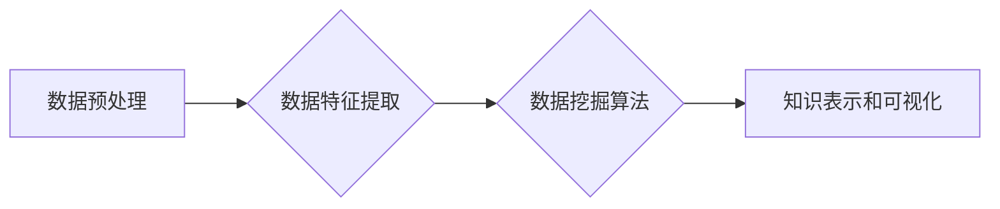

                 

## 知识发现引擎的核心算法解析

> 关键词：知识发现、数据挖掘、机器学习、关联规则、分类算法、聚类算法

## 1. 背景介绍

在海量数据时代，从海量数据中挖掘出有价值的知识，已成为各行各业的重要课题。知识发现引擎 (Knowledge Discovery Engine，KDE) 作为一种专门用于从数据中发现模式、趋势和关系的系统，在数据分析、商业智能、科学研究等领域发挥着越来越重要的作用。

传统的数据库系统主要关注数据的存储和查询，而知识发现引擎则更侧重于数据的分析和挖掘。它通过运用多种数据挖掘算法，从数据中提取隐藏的知识，并以可理解的形式呈现出来，帮助用户洞察数据背后的规律和意义。

## 2. 核心概念与联系

知识发现引擎的核心概念包括：

* **数据预处理:**  对原始数据进行清洗、转换和整合，使其适合后续的挖掘分析。
* **数据特征提取:** 从数据中提取关键特征，以便算法更好地识别模式和关系。
* **数据挖掘算法:**  运用各种算法，例如关联规则挖掘、分类算法、聚类算法等，从数据中发现隐藏的知识。
* **知识表示和可视化:** 将挖掘出的知识以可理解的形式呈现出来，例如图表、报告等。

**核心概念架构图:**



## 3. 核心算法原理 & 具体操作步骤

### 3.1  算法原理概述

知识发现引擎中常用的算法包括关联规则挖掘、分类算法和聚类算法。

* **关联规则挖掘:**  发现数据中不同属性之间的关联关系，例如“购买牛奶的人也经常购买面包”。
* **分类算法:**  根据已标记的数据，学习出一个模型，用于对新数据进行分类，例如判断邮件是否为垃圾邮件。
* **聚类算法:**  将数据按照相似性进行分组，例如将客户按照消费习惯进行分类。

### 3.2  算法步骤详解

**关联规则挖掘算法 (Apriori 算法为例):**

1. **频繁项集挖掘:**  从数据中找出频繁出现的项集，即满足最小支持度的项集。
2. **关联规则生成:**  根据频繁项集，生成关联规则，并计算其置信度和提升度。
3. **筛选规则:**  根据置信度和提升度阈值，筛选出满足条件的关联规则。

**分类算法 (决策树算法为例):**

1. **数据预处理:**  对数据进行清洗、转换和特征选择。
2. **树构建:**  根据数据特征，构建决策树，每个节点代表一个特征，每个分支代表一个特征值。
3. **树剪枝:**  通过剪枝操作，避免过拟合，提高模型泛化能力。
4. **预测:**  根据决策树，对新数据进行分类预测。

**聚类算法 (K-means 算法为例):**

1. **初始化中心点:**  随机选择 K 个数据点作为聚类中心。
2. **分配数据点:**  将每个数据点分配到距离其最近的聚类中心所属的类别。
3. **更新中心点:**  根据分配后的数据点，更新每个聚类中心的坐标。
4. **重复步骤 2 和 3:**  重复上述步骤，直到聚类中心不再发生变化。

### 3.3  算法优缺点

| 算法类型 | 优点 | 缺点 |
|---|---|---|
| 关联规则挖掘 | 发现数据中隐藏的关联关系 | 算法复杂度高，难以处理大规模数据 |
| 分类算法 | 准确率高，易于理解和解释 | 容易过拟合，对数据特征依赖性强 |
| 聚类算法 | 无需预先标记数据，能够发现数据中的自然结构 | 难以确定最佳聚类数，对初始中心点的选择敏感 |

### 3.4  算法应用领域

* **关联规则挖掘:**  市场营销 (推荐系统、促销策略)、生物信息学 (基因关联分析)、电子商务 (商品关联推荐)
* **分类算法:**  欺诈检测、文本分类、图像识别
* **聚类算法:**  客户细分、异常检测、图像分割

## 4. 数学模型和公式 & 详细讲解 & 举例说明

### 4.1  数学模型构建

**关联规则挖掘:**

* **支持度 (Support):**  项集在数据库中出现的频率。

$$
Support(X) = \frac{Number of transactions containing X}{Total number of transactions}
$$

* **置信度 (Confidence):**  在满足条件 X 的情况下，Y 出现的概率。

$$
Confidence(X \rightarrow Y) = \frac{Support(X \cup Y)}{Support(X)}
$$

* **提升度 (Lift):**  关联规则的置信度与随机出现的概率的比值。

$$
Lift(X \rightarrow Y) = \frac{Confidence(X \rightarrow Y)}{P(Y)}
$$

**分类算法 (决策树):**

* **信息增益 (Information Gain):**  用于选择特征的指标，表示使用该特征划分数据后，信息熵的减少程度。

$$
Information Gain(S, A) = Entropy(S) - \sum_{v \in Values(A)} \frac{|S_v|}{|S|} Entropy(S_v)
$$

**聚类算法 (K-means):**

* **距离度量:**  用于计算数据点与聚类中心的距离，例如欧氏距离。

$$
Distance(x, c) = \sqrt{\sum_{i=1}^{n} (x_i - c_i)^2}
$$

### 4.2  公式推导过程

**信息增益的推导:**

信息熵 (Entropy) 表示数据的混乱程度，其公式为：

$$
Entropy(S) = - \sum_{i=1}^{k} p_i \log_2 p_i
$$

其中，$S$ 是数据集，$k$ 是类别数，$p_i$ 是第 $i$ 类别的概率。

信息增益表示使用特征 $A$ 划分数据后，信息熵的减少程度，其公式为：

$$
Information Gain(S, A) = Entropy(S) - \sum_{v \in Values(A)} \frac{|S_v|}{|S|} Entropy(S_v)
$$

其中，$S_v$ 是特征 $A$ 取值为 $v$ 的子集。

### 4.3  案例分析与讲解

**关联规则挖掘案例:**

假设我们有一份超市购物记录数据，其中包含了顾客购买的商品信息。我们可以使用 Apriori 算法挖掘出以下关联规则：

* “购买牛奶的人也经常购买面包” (支持度: 0.6, 置信度: 0.8, 提升度: 1.5)

**分类算法案例:**

我们可以使用决策树算法对邮件进行分类，判断其是否为垃圾邮件。训练数据包含了已标记的邮件，其中包含了邮件内容、发送者、接收者等特征。

**聚类算法案例:**

我们可以使用 K-means 算法将客户按照消费习惯进行分类，例如高消费客户、中消费客户、低消费客户。

## 5. 项目实践：代码实例和详细解释说明

### 5.1  开发环境搭建

* **操作系统:**  Windows/Linux/macOS
* **编程语言:**  Python
* **库依赖:**  pandas, scikit-learn, matplotlib

### 5.2  源代码详细实现

```python
# 关联规则挖掘示例
from mlxtend.frequent_patterns import apriori, association_rules

# 数据加载
data = pd.read_csv('transactions.csv')

# 频繁项集挖掘
frequent_itemsets = apriori(data, min_support=0.05, use_colnames=True)

# 关联规则生成
rules = association_rules(frequent_itemsets, metric="lift", min_threshold=1)

# 打印关联规则
print(rules)

# 分类算法示例
from sklearn.tree import DecisionTreeClassifier

# 数据加载
X = pd.read_csv('features.csv')
y = pd.read_csv('labels.csv')

# 模型训练
model = DecisionTreeClassifier()
model.fit(X, y)

# 预测
predictions = model.predict(new_data)

# 聚类算法示例
from sklearn.cluster import KMeans

# 数据加载
data = pd.read_csv('data.csv')

# 模型训练
kmeans = KMeans(n_clusters=3)
kmeans.fit(data)

# 获取聚类结果
labels = kmeans.labels_

# 可视化聚类结果
plt.scatter(data[:, 0], data[:, 1], c=labels)
plt.show()
```

### 5.3  代码解读与分析

* **关联规则挖掘:**  代码使用 mlxtend 库中的 apriori 和 association_rules 函数，分别进行频繁项集挖掘和关联规则生成。
* **分类算法:**  代码使用 scikit-learn 库中的 DecisionTreeClassifier 类，构建决策树模型，并进行训练和预测。
* **聚类算法:**  代码使用 scikit-learn 库中的 KMeans 类，进行 K 均值聚类，并可视化聚类结果。

### 5.4  运行结果展示

运行上述代码后，将输出相应的关联规则、分类结果和聚类结果。

## 6. 实际应用场景

* **电商推荐:**  根据用户的购买历史，推荐相关的商品。
* **医疗诊断:**  根据患者的症状和病史，辅助医生进行诊断。
* **金融风险控制:**  识别潜在的欺诈交易和风险客户。
* **市场营销:**  分析客户行为，制定精准的营销策略。

### 6.4  未来应用展望

随着数据量的不断增长和算法的不断发展，知识发现引擎将在更多领域发挥重要作用，例如：

* **个性化教育:**  根据学生的学习情况，提供个性化的学习方案。
* **智能制造:**  通过数据分析，优化生产流程和提高生产效率。
* **智慧城市:**  利用数据分析，提高城市管理水平和居民生活质量。

## 7. 工具和资源推荐

### 7.1  学习资源推荐

* **书籍:**  
    * 《数据挖掘：概念与技术》
    * 《机器学习》
* **在线课程:**  
    * Coursera: 数据挖掘
    * edX: 机器学习
* **网站:**  
    * KDnuggets: 数据挖掘和机器学习新闻和资源
    * Towards Data Science: 数据科学博客平台

### 7.2  开发工具推荐

* **Python:**  数据挖掘和机器学习的常用编程语言。
* **R:**  统计分析和数据可视化的常用语言。
* **Weka:**  开源机器学习工具包。
* **RapidMiner:**  数据挖掘和机器学习平台。

### 7.3  相关论文推荐

* **Apriori Algorithm:**  Agrawal, R., Imielinski, T., & Swami, A. (1993). Mining association rules between sets of items in large databases. Proceedings of the ACM SIGMOD International Conference on Management of Data, 206-216.
* **Decision Tree Algorithm:**  Breiman, L., Friedman, J. H., Olshen, R. A., & Stone, C. J. (1984). Classification and regression trees. Wadsworth & Brooks/Cole Advanced Books & Software.
* **K-means Algorithm:**  MacQueen, J. B. (1967). Some methods for classification and analysis of multivariate observations. Proceedings of the fifth Berkeley symposium on mathematical statistics and probability, 1-28.

## 8. 总结：未来发展趋势与挑战

### 8.1  研究成果总结

知识发现引擎的发展取得了显著成果，在数据挖掘、机器学习、人工智能等领域发挥着越来越重要的作用。

### 8.2  未来发展趋势

* **深度学习:**  将深度学习技术应用于知识发现引擎，提高算法的准确性和效率。
* **云计算:**  利用云计算平台的强大计算能力，处理海量数据，挖掘更深层次的知识。
* **可解释性:**  提高知识发现引擎的解释性，使结果更易于理解和应用。

### 8.3  面临的挑战

* **数据质量:**  知识发现引擎的性能依赖于数据质量，如何处理脏数据和缺失数据是一个挑战。
* **算法复杂度:**  一些知识发现算法的复杂度很高，难以处理大规模数据。
* **可解释性:**  许多深度学习算法的决策过程难以解释，这限制了其在一些领域中的应用。

### 8.4  研究展望

未来，知识发现引擎的研究将继续朝着更智能、更高效、更可解释的方向发展，为各行各业提供更强大的数据分析和决策支持工具。

## 9. 附录：常见问题与解答

* **什么是知识发现引擎？**

知识发现引擎是一种专门用于从数据中发现模式、趋势和关系的系统。

* **知识发现引擎有哪些应用场景？**

知识发现引擎广泛应用于电商推荐、医疗诊断、金融风险控制、市场营销等领域。

* **如何选择合适的知识发现算法？**

选择合适的知识发现算法需要根据具体的数据和任务需求进行考虑。

* **如何提高知识发现引擎的性能？**

提高知识发现引擎的性能可以从以下几个方面入手：

* 提高数据质量
* 选择合适的算法
* 优化算法参数
* 利用云计算平台的强大计算能力


作者：禅与计算机程序设计艺术 / Zen and the Art of Computer Programming<end_of_turn>

