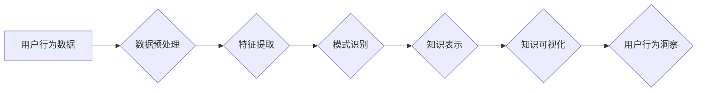

                 

## 知识发现引擎的用户行为分析

> 关键词：知识发现引擎、用户行为分析、数据挖掘、机器学习、推荐系统、个性化体验、行为模式识别

## 1. 背景介绍

在当今数据爆炸的时代，用户行为数据已成为企业获取洞察、优化产品和服务的重要资源。知识发现引擎（KDE）作为一种能够从海量数据中自动发现隐藏模式和知识的系统，在用户行为分析领域发挥着越来越重要的作用。通过对用户行为数据的挖掘和分析，KDE可以帮助企业深入了解用户的需求、偏好和行为模式，从而提供更个性化、更精准的服务体验。

传统的用户行为分析方法往往依赖于人工干预和经验判断，效率低下且难以捕捉到复杂的用户行为模式。而KDE通过运用数据挖掘和机器学习等技术，能够自动识别和分析用户行为数据中的隐藏规律，提供更客观、更全面的分析结果。

## 2. 核心概念与联系

### 2.1  知识发现引擎 (KDE)

知识发现引擎是一种能够从海量数据中自动发现隐藏模式、规律和知识的智能系统。它通常由以下几个核心模块组成：

* **数据预处理模块:** 对原始数据进行清洗、转换和格式化，使其能够被后续算法处理。
* **特征提取模块:** 从原始数据中提取出具有代表性的特征，用于后续的模式识别和知识发现。
* **模式识别模块:** 利用数据挖掘和机器学习算法，从数据中识别出潜在的模式、关联和趋势。
* **知识表示模块:** 将发现的模式和知识以可理解的形式进行表示，例如规则、图表、网络等。
* **知识可视化模块:** 将知识表示以直观的方式呈现给用户，方便用户理解和分析。

### 2.2  用户行为分析

用户行为分析是指通过收集、分析和解读用户在使用产品或服务时所表现出的行为数据，以了解用户的需求、偏好、习惯和行为模式。

用户行为数据可以包括：

* **点击行为:** 用户点击网页、链接、按钮等操作。
* **浏览行为:** 用户浏览网页、页面停留时间、滚动条位置等。
* **搜索行为:** 用户在搜索引擎或网站内进行的搜索查询。
* **购买行为:** 用户购买商品或服务的记录。
* **评论行为:** 用户对产品或服务的评价和反馈。

### 2.3  KDE与用户行为分析的联系

KDE可以有效地帮助企业进行用户行为分析。通过对用户行为数据的挖掘和分析，KDE可以帮助企业：

* **识别用户行为模式:** KDE可以识别出用户在使用产品或服务时常见的行为模式，例如用户经常访问哪些页面、用户在哪些时间段内进行哪些操作等。
* **预测用户行为:** 基于用户历史行为数据，KDE可以预测用户的未来行为，例如用户可能会购买哪些商品、用户可能会点击哪些广告等。
* **个性化用户体验:** KDE可以根据用户的行为数据，提供个性化的产品推荐、内容推送和服务体验。
* **优化产品和服务:** KDE可以帮助企业发现产品和服务中存在的问题，并提供改进建议。

**Mermaid 流程图**



## 3. 核心算法原理 & 具体操作步骤

### 3.1  算法原理概述

用户行为分析中常用的算法包括：

* **关联规则挖掘:** 发现用户行为数据中存在的关联关系，例如哪些商品经常被一起购买。
* **聚类分析:** 将用户根据他们的行为特征进行分组，例如将用户分为不同的消费群体。
* **分类算法:** 根据用户的历史行为数据，预测用户的未来行为，例如预测用户是否会购买商品。
* **推荐系统:** 基于用户的行为数据，推荐用户可能感兴趣的商品、内容或服务。

### 3.2  算法步骤详解

以关联规则挖掘为例，其具体操作步骤如下：

1. **数据预处理:** 对用户行为数据进行清洗、转换和格式化，例如将交易记录转换为用户-商品交互矩阵。
2. **频繁项集挖掘:** 找出用户行为数据中频繁出现的项集，例如频繁购买的商品组合。
3. **关联规则生成:** 从频繁项集中生成关联规则，例如“购买牛奶的用户也经常购买面包”。
4. **规则评估:** 对生成的关联规则进行评估，例如计算规则的支持度、置信度和提升度，选择具有较高价值的规则。

### 3.3  算法优缺点

**关联规则挖掘:**

* **优点:** 可以发现用户行为数据中隐藏的关联关系，帮助企业了解用户需求和购买习惯。
* **缺点:** 容易产生大量冗余规则，需要进行规则筛选和优化。

**聚类分析:**

* **优点:** 可以将用户根据行为特征进行分组，帮助企业进行细分营销和个性化服务。
* **缺点:** 聚类结果的解释性较弱，需要结合其他信息进行分析。

**分类算法:**

* **优点:** 可以预测用户的未来行为，例如预测用户是否会购买商品。
* **缺点:** 需要大量的训练数据，对数据质量要求较高。

### 3.4  算法应用领域

* **电商:** 商品推荐、用户画像、个性化营销
* **社交媒体:** 用户兴趣分析、内容推荐、社区运营
* **金融:** 风险评估、欺诈检测、客户服务
* **医疗:** 疾病诊断、患者画像、个性化治疗

## 4. 数学模型和公式 & 详细讲解 & 举例说明

### 4.1  数学模型构建

关联规则挖掘的数学模型通常基于频繁项集的计算。

**频繁项集:** 在用户行为数据中，一个项集如果满足一定的支持度阈值，则称为频繁项集。

**支持度:** 

$$
Support(X) = \frac{Number of transactions containing X}{Total number of transactions}
$$

其中，X代表一个项集。

**置信度:**

$$
Confidence(X \rightarrow Y) = \frac{Support(X \cup Y)}{Support(X)}
$$

其中，X和Y代表两个项集，X \rightarrow Y代表一个关联规则。

**提升度:**

$$
Lift(X \rightarrow Y) = \frac{Confidence(X \rightarrow Y)}{Support(Y)}
$$

### 4.2  公式推导过程

* **支持度:** 支持度衡量了项集在用户行为数据中的出现频率。
* **置信度:** 置信度衡量了在给定项集X的情况下，项集Y出现的概率。
* **提升度:** 提升度衡量了关联规则相对于随机出现的程度。

### 4.3  案例分析与讲解

假设用户行为数据中，购买牛奶和购买面包的交易记录如下：

| 交易ID | 商品 |
|---|---|
| 1 | 牛奶 |
| 1 | 面包 |
| 2 | 牛奶 |
| 3 | 面包 |
| 4 | 牛奶 |
| 4 | 面包 |

* **频繁项集:** {牛奶, 面包} 的支持度为 2/4 = 0.5，满足一定的阈值，因此是频繁项集。
* **关联规则:** 牛奶 -> 面包 的置信度为 2/2 = 1，提升度为 1/0.5 = 2。

该关联规则表明，购买牛奶的用户中，购买面包的用户比例是随机购买比例的两倍。

## 5. 项目实践：代码实例和详细解释说明

### 5.1  开发环境搭建

* **操作系统:** Linux/macOS/Windows
* **编程语言:** Python
* **库依赖:** pandas, scikit-learn, matplotlib

### 5.2  源代码详细实现

```python
import pandas as pd
from mlxtend.frequent_patterns import apriori, association_rules

# 加载用户行为数据
data = pd.read_csv('user_behavior.csv')

# 数据预处理
transactions = data.pivot_table(index='user_id', columns='product_id', values='purchase_date', aggfunc='count').fillna(0)

# 频繁项集挖掘
frequent_itemsets = apriori(transactions, min_support=0.2, use_colnames=True)

# 关联规则生成
rules = association_rules(frequent_itemsets, metric="lift", min_threshold=1)

# 打印关联规则
print(rules)
```

### 5.3  代码解读与分析

* **数据加载:** 使用 pandas 库加载用户行为数据。
* **数据预处理:** 将数据转换为用户-商品交互矩阵，方便后续算法处理。
* **频繁项集挖掘:** 使用 mlxtend 库的 apriori 函数进行频繁项集挖掘，设置支持度阈值。
* **关联规则生成:** 使用 mlxtend 库的 association_rules 函数生成关联规则，设置提升度阈值。
* **输出结果:** 打印生成的关联规则。

### 5.4  运行结果展示

运行代码后，会输出一个包含关联规则的 DataFrame，其中包含规则、支持度、置信度和提升度等信息。

## 6. 实际应用场景

### 6.1  电商平台

* **商品推荐:** 基于用户购买历史，推荐用户可能感兴趣的商品。
* **个性化营销:** 根据用户行为数据，进行精准的营销推广。
* **库存管理:** 预测商品需求，优化库存管理。

### 6.2  社交媒体平台

* **内容推荐:** 根据用户浏览和点赞记录，推荐用户可能感兴趣的内容。
* **用户画像:** 分析用户行为数据，构建用户画像，了解用户兴趣和偏好。
* **社区运营:** 发现用户兴趣社区，进行精准的社区运营。

### 6.3  金融机构

* **风险评估:** 分析用户交易行为，识别潜在的风险用户。
* **欺诈检测:** 发现异常交易行为，及时进行欺诈检测。
* **客户服务:** 根据用户行为数据，提供个性化的客户服务。

### 6.4  未来应用展望

随着人工智能和数据挖掘技术的不断发展，KDE在用户行为分析领域的应用将更加广泛和深入。未来，KDE可能应用于以下领域：

* **医疗保健:** 预测疾病风险、个性化治疗方案。
* **教育:** 个性化学习推荐、学生行为分析。
* **智能家居:** 智能家居设备行为分析、个性化服务。

## 7. 工具和资源推荐

### 7.1  学习资源推荐

* **书籍:**
    * 《数据挖掘：概念与技术》
    * 《机器学习》
* **在线课程:**
    * Coursera: 数据挖掘
    * edX: 机器学习
* **博客:**
    * KDnuggets
    * Analytics Vidhya

### 7.2  开发工具推荐

* **Python:** 数据分析和机器学习的常用语言。
* **R:** 数据可视化和统计分析的常用语言。
* **Spark:** 大数据处理框架。

### 7.3  相关论文推荐

* **Association Rule Mining: A Data Mining Task**
* **Frequent Pattern Mining: A Survey**
* **Knowledge Discovery in Databases: Principles, Methods, and Applications**

## 8. 总结：未来发展趋势与挑战

### 8.1  研究成果总结

KDE在用户行为分析领域取得了显著的成果，能够有效地发现用户行为模式、预测用户行为和提供个性化服务。

### 8.2  未来发展趋势

* **更强大的算法:** 开发更强大的数据挖掘和机器学习算法，能够处理更复杂的用户行为数据。
* **更精准的个性化:** 基于更细粒度的用户行为数据，提供更精准的个性化服务。
* **更全面的分析:** 将用户行为数据与其他数据源进行融合，进行更全面的分析。

### 8.3  面临的挑战

* **数据质量:** 用户行为数据往往存在噪声、缺失和不一致性，需要进行有效的清洗和处理。
* **隐私保护:** 用户行为数据包含敏感信息，需要进行有效的隐私保护。
* **解释性:** 一些数据挖掘算法的解释性较弱，需要开发更易于理解的算法。

### 8.4  研究展望

未来，KDE的研究将更加注重算法的效率、准确性和解释性，以及数据隐私保护和可解释性。


## 9. 附录：常见问题与解答

**Q1: KDE与传统用户行为分析方法相比有什么优势？**

**A1:** KDE能够自动识别和分析用户行为数据中的隐藏规律，提供更客观、更全面的分析结果，而传统方法往往依赖于人工干预和经验判断，效率低下且难以捕捉到复杂的用户行为模式。

**Q2: KDE的应用场景有哪些？**

**A2:** KDE的应用场景非常广泛，包括电商、社交媒体、金融、医疗等领域。

**Q3: 如何选择合适的KDE算法？**

**A3:** 选择合适的KDE算法需要根据具体应用场景和数据特点进行选择。例如，如果需要发现用户行为之间的关联关系，可以使用关联规则挖掘算法；如果需要将用户进行分组，可以使用聚类分析算法。


作者：禅与计算机程序设计艺术 / Zen and the Art of Computer Programming 
<end_of_turn>

