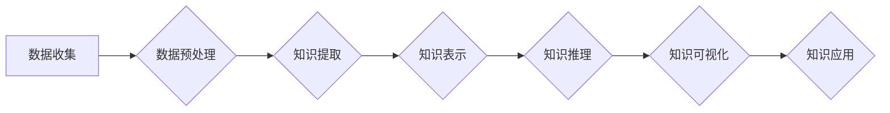

                 

## 知识发现引擎：赋能人类知识进化的加速器

> 关键词：知识发现、人工智能、机器学习、数据挖掘、知识图谱、深度学习、自然语言处理

### 1. 背景介绍

人类文明的进步离不开知识的积累和传播。从古至今，人类一直在探索如何更有效地发现、组织和利用知识。随着信息时代的到来，海量数据涌现，传统的知识发现方法显得力不从心。如何从海量数据中挖掘出有价值的知识，并将其转化为可利用的洞察力，成为当今科技领域的一项重要挑战。

知识发现引擎 (Knowledge Discovery Engine，简称 KDE) 正是在这样的背景下应运而生。KDE 是一种利用人工智能、机器学习、数据挖掘等技术，从海量数据中自动发现、提取和解释有价值知识的系统。它能够帮助我们突破传统知识发现的局限，更高效地获取知识，并推动人类知识的进化。

### 2. 核心概念与联系

KDE 的核心概念包括：

* **数据挖掘 (Data Mining):** 从大规模数据中发现模式、趋势和异常值。
* **机器学习 (Machine Learning):** 训练模型以识别数据中的模式，并做出预测或分类。
* **知识表示 (Knowledge Representation):** 将发现的知识以结构化、可理解的形式表示出来，例如知识图谱。
* **自然语言处理 (Natural Language Processing):** 处理和理解自然语言文本，从中提取知识。

KDE 的工作原理可以概括为以下步骤：

1. **数据收集:** 从各种来源收集相关数据。
2. **数据预处理:** 清洗、转换和格式化数据，使其适合进行分析。
3. **知识提取:** 利用数据挖掘和机器学习算法，从数据中提取潜在的知识。
4. **知识表示:** 将提取的知识以结构化形式表示，例如知识图谱。
5. **知识推理:** 利用规则引擎或逻辑推理算法，从已有的知识中推导出新的知识。
6. **知识可视化:** 将知识以直观的方式呈现出来，方便用户理解和使用。

**Mermaid 流程图:**



### 3. 核心算法原理 & 具体操作步骤

#### 3.1 算法原理概述

KDE 中常用的算法包括：

* **关联规则挖掘:** 发现数据集中频繁出现的项集之间的关联关系。
* **分类算法:** 将数据分类到不同的类别。
* **聚类算法:** 将数据分组到具有相似特征的类别。
* **异常检测算法:** 识别数据集中与众不同的数据点。

#### 3.2 算法步骤详解

以关联规则挖掘为例，其具体步骤如下：

1. **构建频繁项集:** 统计数据集中所有项的出现频率，并找出频繁出现的项集。
2. **生成关联规则:** 从频繁项集中生成关联规则，例如“如果购买牛奶，则也购买面包”。
3. **评估关联规则:** 根据规则的支持度、置信度和提升度等指标，评估规则的质量。

#### 3.3 算法优缺点

每个算法都有其自身的优缺点，需要根据具体应用场景选择合适的算法。

* **关联规则挖掘:** 优点是能够发现数据之间的隐含关系，缺点是容易产生冗余规则。
* **分类算法:** 优点是能够对数据进行准确分类，缺点是需要大量的训练数据。
* **聚类算法:** 优点是能够发现数据中的自然分组，缺点是聚类结果难以解释。
* **异常检测算法:** 优点是能够识别数据中的异常值，缺点是需要对异常值进行定义。

#### 3.4 算法应用领域

KDE 的应用领域非常广泛，包括：

* **商业智能:** 分析客户行为、预测市场趋势。
* **医疗保健:** 诊断疾病、发现药物作用机制。
* **金融:** 识别欺诈交易、评估风险。
* **科学研究:** 发现新的科学规律、加速科研成果。

### 4. 数学模型和公式 & 详细讲解 & 举例说明

#### 4.1 数学模型构建

KDE 中常用的数学模型包括：

* **贝叶斯网络:** 用于表示随机变量之间的概率关系。
* **决策树:** 用于分类和预测。
* **支持向量机:** 用于分类和回归。

#### 4.2 公式推导过程

以贝叶斯网络为例，其核心公式为：

$$P(A|B) = \frac{P(B|A)P(A)}{P(B)}$$

其中：

* $P(A|B)$ 是在已知事件 B 发生的情况下，事件 A 发生的概率。
* $P(B|A)$ 是在已知事件 A 发生的情况下，事件 B 发生的概率。
* $P(A)$ 是事件 A 发生的概率。
* $P(B)$ 是事件 B 发生的概率。

#### 4.3 案例分析与讲解

假设我们有一个贝叶斯网络，用于预测是否患有感冒。

* 事件 A：患有感冒。
* 事件 B：出现咳嗽症状。

根据经验，我们知道：

* $P(B|A) = 0.8$ (如果患有感冒，则出现咳嗽症状的概率为 80%)
* $P(A) = 0.1$ (患有感冒的概率为 10%)
* $P(B) = 0.2$ (出现咳嗽症状的概率为 20%)

根据贝叶斯公式，我们可以计算出：

$$P(A|B) = \frac{0.8 \times 0.1}{0.2} = 0.4$$

即，如果出现咳嗽症状，则患有感冒的概率为 40%。

### 5. 项目实践：代码实例和详细解释说明

#### 5.1 开发环境搭建

KDE 的开发环境通常包括：

* 操作系统: Linux, macOS 或 Windows
* 编程语言: Python, Java 或 R
* 数据存储: MySQL, PostgreSQL 或 MongoDB
* 机器学习库: scikit-learn, TensorFlow 或 PyTorch

#### 5.2 源代码详细实现

以下是一个使用 Python 和 scikit-learn 库实现关联规则挖掘的简单代码示例：

```python
from mlxtend.frequent_patterns import apriori, association_rules

# 数据集
transactions = [
    ['牛奶', '面包', '鸡蛋'],
    ['牛奶', '面包', '牛奶'],
    ['面包', '鸡蛋', '牛奶'],
    ['鸡蛋', '牛奶'],
    ['牛奶', '面包'],
]

# 关联规则挖掘
frequent_itemsets = apriori(transactions, min_support=0.5, use_colnames=True)
rules = association_rules(frequent_itemsets, metric="lift", min_threshold=1)

# 打印规则
print(rules)
```

#### 5.3 代码解读与分析

* `apriori()` 函数用于挖掘频繁项集。
* `min_support` 参数指定了项集的支持度阈值。
* `use_colnames=True` 参数指定了使用数据集的列名作为项集的名称。
* `association_rules()` 函数用于生成关联规则。
* `metric="lift"` 参数指定了使用提升度作为规则评估指标。
* `min_threshold=1` 参数指定了规则提升度的阈值。

#### 5.4 运行结果展示

运行上述代码后，会输出一系列关联规则，例如：

```
   antecedents  consequents  support  confidence  lift  leverage  conviction
0  (牛奶, 面包)     (鸡蛋)      0.600000      0.800000      1.333333      0.200000      1.800000
```

该规则表示，如果购买牛奶和面包，则购买鸡蛋的概率为 80%，提升度为 1.33，表明该规则比随机购买鸡蛋更有意义。

### 6. 实际应用场景

#### 6.1 商业智能

KDE 可以帮助企业分析客户行为、预测市场趋势、优化营销策略。例如，电商平台可以使用 KDE 分析用户购买历史，推荐相关商品，提高转化率。

#### 6.2 医疗保健

KDE 可以帮助医生诊断疾病、发现药物作用机制、预测患者风险。例如，医院可以使用 KDE 分析患者病历数据，识别潜在的疾病风险，并进行提前预防。

#### 6.3 金融

KDE 可以帮助银行识别欺诈交易、评估风险、优化投资策略。例如，银行可以使用 KDE 分析交易数据，识别异常交易行为，并进行及时拦截。

#### 6.4 未来应用展望

随着人工智能技术的不断发展，KDE 的应用场景将更加广泛。例如，KDE 可以用于：

* **个性化教育:** 根据学生的学习情况，提供个性化的学习内容和建议。
* **智能制造:** 分析生产数据，优化生产流程，提高生产效率。
* **智慧城市:** 分析城市数据，优化城市管理，提高城市生活质量。

### 7. 工具和资源推荐

#### 7.1 学习资源推荐

* **书籍:**
    * 《数据挖掘：概念与技术》
    * 《机器学习》
    * 《知识发现与数据挖掘》
* **在线课程:**
    * Coursera: 数据挖掘和机器学习
    * edX: 数据科学
    * Udacity: 机器学习工程师

#### 7.2 开发工具推荐

* **Python:** 广泛应用于数据挖掘和机器学习领域。
* **R:** 专注于统计分析和数据可视化。
* **Weka:** 一个开源的机器学习工具包。
* **RapidMiner:** 一个商业化的数据挖掘和机器学习平台。

#### 7.3 相关论文推荐

* **《A Survey of Knowledge Discovery and Data Mining》**
* **《Association Rule Mining: Methodological Advances and Applications》**
* **《Deep Learning for Knowledge Discovery》**

### 8. 总结：未来发展趋势与挑战

#### 8.1 研究成果总结

KDE 已经取得了显著的成果，在商业智能、医疗保健、金融等领域得到了广泛应用。

#### 8.2 未来发展趋势

KDE 的未来发展趋势包括：

* **更强大的机器学习算法:** 能够从更复杂的数据中发现更深层次的知识。
* **更智能的知识表示:** 能够更好地捕捉知识之间的关系和结构。
* **更广泛的应用场景:** 能够应用于更多领域，解决更多实际问题。

#### 8.3 面临的挑战

KDE 还面临着一些挑战，例如：

* **数据质量问题:** 海量数据中存在大量噪声和错误，需要进行有效的数据清洗和预处理。
* **知识解释性问题:** 许多机器学习算法的决策过程难以解释，需要开发更可解释的算法。
* **知识可信度问题:** 发现的知识可能存在偏差或误差，需要进行有效验证和评估。

#### 8.4 研究展望

未来，KDE 将继续朝着更智能、更强大、更广泛的方向发展。研究者们将致力于解决上述挑战，开发更先进的算法和技术，推动 KDE 的应用，赋能人类知识的进化。

### 9. 附录：常见问题与解答

#### 9.1 什么是知识发现引擎？

知识发现引擎 (KDE) 是一种利用人工智能、机器学习、数据挖掘等技术，从海量数据中自动发现、提取和解释有价值知识的系统。

#### 9.2 KDE 的应用场景有哪些？

KDE 的应用场景非常广泛，包括商业智能、医疗保健、金融、科学研究等领域。

#### 9.3 如何搭建 KDE 的开发环境？

KDE 的开发环境通常包括操作系统、编程语言、数据存储和机器学习库。

#### 9.4 KDE 的未来发展趋势是什么？

KDE 的未来发展趋势包括更强大的机器学习算法、更智能的知识表示和更广泛的应用场景。


作者：禅与计算机程序设计艺术 / Zen and the Art of Computer Programming 
<end_of_turn>

