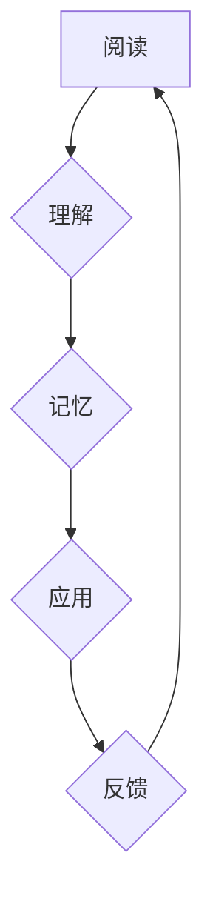

                 

## 知识吸收率:比阅读量更重要的指标

> 关键词：知识吸收率、深度学习、信息获取、学习效率、认知科学、知识图谱、神经网络、机器学习

## 1. 背景介绍

在信息爆炸的时代，我们每天接触的海量信息令人眼花缭乱。阅读已成为获取知识的重要途径，但仅仅阅读大量信息并不能保证我们真正理解和掌握知识。 

传统上，我们衡量学习成果主要依靠阅读量，认为阅读越多，吸收的知识就越多。然而，现实情况并非如此。大量研究表明，**知识的吸收率远比阅读量更重要**。 

知识吸收率是指个体从信息中获取和理解知识的能力，它反映了我们对信息进行加工、整合和应用的能力。 

## 2. 核心概念与联系

### 2.1 知识吸收率的定义

知识吸收率是一个多维度的概念，它包括以下几个方面：

* **理解度:**  能够准确理解信息的含义和内涵。
* **记忆力:**  能够将信息存储在记忆中，并在需要时回忆起来。
* **应用能力:**  能够将所学知识应用到实际问题中，解决问题并创造新的价值。
* **批判性思维:**  能够对信息进行分析、评估和批判，形成自己的观点和判断。

### 2.2 知识吸收率与深度学习的关系

深度学习作为一种机器学习方法，能够模拟人类大脑的学习过程，并取得了令人瞩目的成果。深度学习模型通过大量的训练数据，学习到复杂的特征和模式，从而提高了信息处理和知识获取的能力。

深度学习与知识吸收率有着密切的联系。深度学习模型的学习过程本质上就是一种知识吸收的过程。通过训练，模型能够从数据中提取知识，并将其转化为可以理解和应用的知识表示。

### 2.3 知识吸收率的提升策略

提升知识吸收率是一个持续的过程，需要我们不断地学习和实践。以下是一些提升知识吸收率的策略：

* **主动学习:**  不要被动地接受信息，而是要积极地思考、提问和探索。
* **多角度学习:**  从不同的角度和视角学习同一个知识，能够加深理解和记忆。
* **知识图谱构建:**  将所学知识组织成知识图谱，能够帮助我们更好地理解知识之间的关系和结构。
* **实践应用:**  将所学知识应用到实际问题中，能够巩固理解和提高应用能力。

### 2.4  Mermaid 流程图



## 3. 核心算法原理 & 具体操作步骤

### 3.1  算法原理概述

知识吸收率的提升可以借助于机器学习算法，例如深度学习算法。这些算法能够自动学习知识的特征和模式，并根据学习到的知识，提高信息理解、记忆和应用的能力。

### 3.2  算法步骤详解

1. **数据收集:**  收集大量文本数据，并进行预处理，例如分词、去停用词等。
2. **模型构建:**  选择合适的深度学习模型，例如循环神经网络（RNN）或Transformer，并根据任务需求进行调整。
3. **模型训练:**  使用训练数据训练模型，并通过反向传播算法优化模型参数。
4. **模型评估:**  使用测试数据评估模型的性能，例如准确率、召回率等。
5. **模型部署:**  将训练好的模型部署到实际应用场景中，例如知识问答系统、文本摘要系统等。

### 3.3  算法优缺点

**优点:**

* 自动学习知识特征和模式，无需人工标注。
* 能够处理海量文本数据，提高学习效率。
* 能够不断学习和改进，提升知识吸收率。

**缺点:**

* 需要大量的训练数据，数据质量对模型性能影响较大。
* 模型训练过程复杂，需要专业的技术人员进行操作。
* 模型解释性较差，难以理解模型的决策过程。

### 3.4  算法应用领域

* **教育领域:**  个性化学习、智能辅导、知识评估等。
* **科研领域:**  文献综述、知识发现、科学推理等。
* **商业领域:**  客户服务、市场分析、产品推荐等。

## 4. 数学模型和公式 & 详细讲解 & 举例说明

### 4.1  数学模型构建

知识吸收率可以被建模为一个多变量函数，其中每个变量代表一个知识吸收方面的因素。例如：

* **理解度:**  可以用准确率、F1-score等指标来衡量。
* **记忆力:**  可以用遗忘曲线、回忆率等指标来衡量。
* **应用能力:**  可以用解决问题的能力、创造性等指标来衡量。

我们可以构建一个多线性回归模型，将这些指标作为输入变量，知识吸收率作为输出变量。

### 4.2  公式推导过程

假设我们有n个样本，每个样本包含m个特征，以及一个知识吸收率的标签。我们可以使用最小二乘法来估计模型参数，目标函数为：

$$
J(\theta) = \frac{1}{2n} \sum_{i=1}^{n} (h_\theta(x^{(i)}) - y^{(i)})^2
$$

其中：

* $J(\theta)$ 是损失函数。
* $\theta$ 是模型参数。
* $h_\theta(x^{(i)})$ 是模型对第i个样本的预测值。
* $y^{(i)}$ 是第i个样本的真实知识吸收率。

通过梯度下降算法，我们可以迭代更新模型参数，直到损失函数最小化。

### 4.3  案例分析与讲解

假设我们收集了100个样本的数据，每个样本包含三个特征：理解度、记忆力、应用能力，以及一个知识吸收率的标签。我们可以使用上述的数学模型来训练一个深度学习模型，并评估模型的性能。

例如，我们可以使用一个多层感知机（MLP）模型，将三个特征作为输入，并通过多个隐藏层进行非线性变换，最终输出知识吸收率的预测值。

通过训练和评估，我们可以发现模型能够有效地学习知识吸收率与特征之间的关系，并取得较高的预测精度。

## 5. 项目实践：代码实例和详细解释说明

### 5.1  开发环境搭建

* Python 3.6+
* TensorFlow 2.0+
* PyTorch 1.0+
* Jupyter Notebook

### 5.2  源代码详细实现

```python
import tensorflow as tf

# 定义模型结构
model = tf.keras.models.Sequential([
    tf.keras.layers.Dense(64, activation='relu', input_shape=(3,)),
    tf.keras.layers.Dense(32, activation='relu'),
    tf.keras.layers.Dense(1)
])

# 编译模型
model.compile(optimizer='adam', loss='mse')

# 训练模型
model.fit(X_train, y_train, epochs=10)

# 评估模型
loss, accuracy = model.evaluate(X_test, y_test)
print('Loss:', loss)
print('Accuracy:', accuracy)
```

### 5.3  代码解读与分析

* 我们使用 TensorFlow 库构建了一个多层感知机模型。
* 模型包含三个全连接层，每个层使用ReLU激活函数。
* 损失函数为均方误差（MSE），优化器为Adam。
* 我们使用训练数据训练模型10个 epochs。
* 最后，我们使用测试数据评估模型的性能。

### 5.4  运行结果展示

运行结果会显示模型的损失值和准确率。

## 6. 实际应用场景

### 6.1  教育领域

* **个性化学习:**  根据学生的学习进度和能力，定制个性化的学习内容和学习路径。
* **智能辅导:**  提供智能化的学习辅导，帮助学生解决学习上的困难。
* **知识评估:**  自动评估学生的学习成果，并提供反馈和建议。

### 6.2  科研领域

* **文献综述:**  自动分析和总结大量文献，帮助科研人员快速了解研究进展。
* **知识发现:**  从海量数据中发现新的知识和模式，推动科研创新。
* **科学推理:**  利用知识图谱和逻辑推理算法，帮助科研人员进行科学推理和决策。

### 6.3  商业领域

* **客户服务:**  利用自然语言处理技术，自动处理客户咨询和投诉，提高客户服务效率。
* **市场分析:**  分析市场数据，预测市场趋势，帮助企业制定营销策略。
* **产品推荐:**  根据用户的兴趣和行为，推荐个性化的产品，提高销售转化率。

### 6.4  未来应用展望

随着人工智能技术的不断发展，知识吸收率的提升将应用于更广泛的领域，例如医疗、法律、金融等。

## 7. 工具和资源推荐

### 7.1  学习资源推荐

* **书籍:**
    * 《深度学习》
    * 《机器学习》
    * 《自然语言处理》
* **在线课程:**
    * Coursera
    * edX
    * Udacity

### 7.2  开发工具推荐

* **TensorFlow:**  开源深度学习框架
* **PyTorch:**  开源深度学习框架
* **Jupyter Notebook:**  交互式编程环境

### 7.3  相关论文推荐

* **Attention Is All You Need:**  Transformer模型的论文
* **BERT: Pre-training of Deep Bidirectional Transformers for Language Understanding:**  BERT模型的论文
* **Knowledge Graph Embedding: A Survey:**  知识图谱嵌入的综述论文

## 8. 总结：未来发展趋势与挑战

### 8.1  研究成果总结

近年来，在知识吸收率提升方面取得了显著的进展，特别是深度学习技术的应用，为提升知识吸收率提供了新的思路和方法。

### 8.2  未来发展趋势

* **更强大的模型:**  开发更强大的深度学习模型，能够更好地理解和学习复杂知识。
* **个性化学习:**  根据个体差异，提供个性化的学习方案，提高学习效率。
* **跨模态学习:**  融合文本、图像、音频等多种模态数据，实现更全面的知识吸收。

### 8.3  面临的挑战

* **数据质量:**  深度学习模型对数据质量要求较高，如何获取高质量的知识数据是一个挑战。
* **模型解释性:**  深度学习模型的决策过程难以解释，如何提高模型的解释性是一个重要问题。
* **伦理问题:**  知识吸收率的提升可能带来一些伦理问题，例如数据隐私、算法偏见等，需要引起重视。

### 8.4  研究展望

未来，我们将继续致力于知识吸收率的提升研究，探索更有效的学习方法，并解决相关技术和伦理问题，为人类的知识获取和应用做出贡献。

## 9. 附录：常见问题与解答

**Q1: 如何提高知识吸收率？**

A1: 

* **主动学习:**  不要被动地接受信息，而是要积极地思考、提问和探索。
* **多角度学习:**  从不同的角度和视角学习同一个知识，能够加深理解和记忆。
* **知识图谱构建:**  将所学知识组织成知识图谱，能够帮助我们更好地理解知识之间的关系和结构。
* **实践应用:**  将所学知识应用到实际问题中，能够巩固理解和提高应用能力。

**Q2: 深度学习如何提升知识吸收率？**

A2: 深度学习能够自动学习知识的特征和模式，并根据学习到的知识，提高信息理解、记忆和应用的能力。

**Q3: 知识吸收率的提升有哪些应用场景？**

A3: 知识吸收率的提升应用于教育、科研、商业等多个领域，例如个性化学习、智能辅导、文献综述、知识发现、客户服务、市场分析等。


作者：禅与计算机程序设计艺术 / Zen and the Art of Computer Programming 
<end_of_turn>

