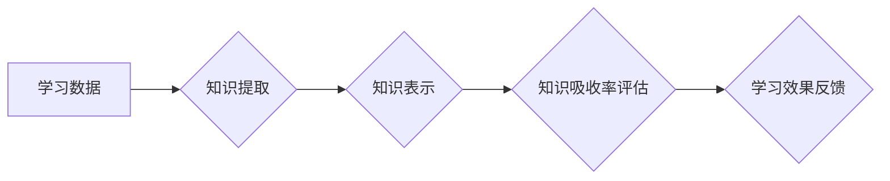

                 

## 知识吸收率:衡量学习效果的关键指标

> 关键词：知识吸收率、学习效果、机器学习、深度学习、神经网络、知识图谱、评估指标、数据分析

## 1. 背景介绍

在当今数据爆炸的时代，信息获取变得前所未有便捷，然而，如何有效地吸收和利用这些信息成为了一个至关重要的挑战。对于个人而言，高效的学习能力是获得知识、提升技能、实现自我价值的关键。对于企业而言，员工的知识吸收能力直接影响着组织的创新能力、竞争力以及发展潜力。

传统的学习评估方法往往侧重于知识的记忆和复述，而忽略了知识的理解、应用和创造。随着人工智能技术的快速发展，特别是深度学习技术的突破，机器学习模型能够从海量数据中自动提取知识，并将其转化为可理解和应用的知识表示。这为我们提供了新的视角和工具，可以更全面地衡量学习效果，并促进知识的有效吸收和利用。

## 2. 核心概念与联系

**2.1 知识吸收率的概念**

知识吸收率是指个体从学习过程中获得的知识量与学习投入量的比值。它可以用来衡量学习效率，以及个体对知识的理解和掌握程度。

**2.2 知识吸收率与机器学习的关系**

机器学习模型可以帮助我们自动分析学习数据，识别知识的结构和关系，并评估个体对知识的吸收程度。例如，可以通过分析个体对学习材料的阅读记录、提问情况、完成作业的质量等数据，来判断其对知识的理解和掌握程度。

**2.3 知识吸收率与深度学习的关系**

深度学习模型能够从复杂的数据中自动提取特征，并构建复杂的知识表示。这使得我们可以更深入地理解知识的本质，并开发更精准的知识吸收率评估方法。

**2.4 知识吸收率与知识图谱的关系**

知识图谱是一种结构化的知识表示形式，可以将知识点和其关系以图形的形式展现。通过构建知识图谱，我们可以更直观地理解知识之间的联系，并评估个体对知识网络的掌握程度。

**Mermaid 流程图**



## 3. 核心算法原理 & 具体操作步骤

**3.1 算法原理概述**

知识吸收率评估算法通常基于以下原理：

* **知识点提取:** 从学习数据中提取关键知识点，例如概念、定义、公式等。
* **知识关系建模:** 建立知识点之间的关系网络，例如概念之间的关联、定义之间的依赖等。
* **个体知识状态建模:** 建立个体对知识的理解和掌握程度模型，例如知识点掌握情况、知识关系理解程度等。
* **知识吸收率计算:** 根据个体知识状态模型和学习数据，计算知识吸收率。

**3.2 算法步骤详解**

1. **数据预处理:** 对学习数据进行清洗、格式化和转换，提取关键知识点。
2. **知识表示构建:** 利用自然语言处理技术、知识图谱构建等方法，构建知识点之间的关系网络。
3. **个体知识状态建模:** 利用机器学习模型，例如深度神经网络、支持向量机等，对个体对知识的理解和掌握程度进行建模。
4. **知识吸收率计算:** 根据个体知识状态模型和学习数据，计算知识吸收率。

**3.3 算法优缺点**

* **优点:**

    * 可以更全面地衡量学习效果，不仅考虑知识的记忆，还考虑知识的理解和应用。
    * 可以自动分析学习数据，识别知识的结构和关系，并评估个体对知识的吸收程度。
    * 可以根据个体学习情况，提供个性化的学习建议和反馈。

* **缺点:**

    * 需要大量的学习数据进行训练，才能获得准确的评估结果。
    * 知识表示的构建和个体知识状态模型的建立都比较复杂，需要专业的技术人员进行开发和维护。
    * 评估结果可能受到算法本身的局限性影响，需要不断改进和完善算法模型。

**3.4 算法应用领域**

* **教育领域:** 评估学生的学习效果，提供个性化的学习建议，促进教育教学改革。
* **企业培训领域:** 评估员工的培训效果，优化培训方案，提升员工技能水平。
* **个人学习领域:** 帮助个人了解自己的学习情况，制定更有效的学习计划。

## 4. 数学模型和公式 & 详细讲解 & 举例说明

**4.1 数学模型构建**

知识吸收率可以看作是一个个体对知识的理解和掌握程度与学习投入量的比值。我们可以用以下数学模型来表示：

$$
K_a = \frac{K_u}{K_i}
$$

其中：

* $K_a$ 表示知识吸收率
* $K_u$ 表示个体对知识的理解和掌握程度
* $K_i$ 表示学习投入量

**4.2 公式推导过程**

* **理解和掌握程度 ($K_u$)** 可以通过多种方式来衡量，例如：
    * 知识点正确率：个体对知识点的正确理解和记忆程度。
    * 知识关系理解程度：个体对知识点之间关系的理解程度。
    * 应用能力：个体能够将知识应用到实际问题中解决的能力。
* **学习投入量 ($K_i$)** 可以通过以下指标来衡量：
    * 学习时间：个体投入学习的时间。
    * 学习资源使用量：个体使用学习资源的数量和质量。
    * 学习努力程度：个体对学习的投入和专注程度。

**4.3 案例分析与讲解**

假设一个学生学习了10个知识点，其中正确理解了8个，掌握了7个，学习时间为2小时，使用了大量的学习资源，并且学习努力程度较高。

那么，我们可以计算出该学生的知识吸收率：

$$
K_a = \frac{7}{2} = 3.5
$$

这个结果表明，该学生在学习过程中非常高效，能够将学习投入转化为知识的理解和掌握。

## 5. 项目实践：代码实例和详细解释说明

**5.1 开发环境搭建**

* Python 3.x
* TensorFlow 或 PyTorch 深度学习框架
* NLTK 自然语言处理库
* NetworkX 图论库

**5.2 源代码详细实现**

```python
# 知识点提取
import nltk
from nltk.tokenize import word_tokenize

text = "深度学习是一种机器学习的子领域，它利用多层神经网络来学习数据中的复杂模式。"
tokens = word_tokenize(text)
keywords = nltk.FreqDist(tokens).most_common(10)

# 知识关系建模
import networkx as nx

G = nx.Graph()
G.add_nodes_from(keywords)
# 添加知识关系
G.add_edge("深度学习", "机器学习")
G.add_edge("深度学习", "神经网络")

# 个体知识状态建模
import tensorflow as tf

# ... (构建深度神经网络模型)

# 知识吸收率计算
def calculate_knowledge_absorption_rate(model, individual_data):
    # ... (使用模型预测个体知识状态)
    knowledge_understanding = model.predict(individual_data)
    # ... (计算知识吸收率)
    return knowledge_absorption_rate

# 运行代码
knowledge_absorption_rate = calculate_knowledge_absorption_rate(model, individual_data)
print(f"知识吸收率: {knowledge_absorption_rate}")
```

**5.3 代码解读与分析**

* 代码首先使用NLTK库对学习文本进行分词，提取关键词。
* 然后使用NetworkX库构建知识关系图，表示知识点之间的关联。
* 接着使用TensorFlow或PyTorch框架构建深度神经网络模型，对个体对知识的理解和掌握程度进行建模。
* 最后，使用模型预测个体知识状态，并计算知识吸收率。

**5.4 运行结果展示**

运行代码后，会输出个体的知识吸收率。

## 6. 实际应用场景

**6.1 教育领域**

* **个性化学习推荐:** 根据学生的知识吸收率，推荐个性化的学习资源和学习计划。
* **学习效果评估:** 评估学生的学习效果，及时发现学习困难，并提供针对性的帮助。
* **教学方法改进:** 分析学生的知识吸收率数据，改进教学方法，提高教学效率。

**6.2 企业培训领域**

* **培训效果评估:** 评估员工的培训效果，了解培训内容的吸收程度，并优化培训方案。
* **员工技能提升:** 根据员工的知识吸收率，制定个性化的技能提升计划，帮助员工提升工作能力。
* **知识管理:** 建立知识库，并根据员工的知识吸收率，推荐相关知识，促进知识共享和传播。

**6.3 个人学习领域**

* **学习计划制定:** 根据自己的知识吸收率，制定更有效的学习计划，提高学习效率。
* **学习效果跟踪:** 跟踪自己的学习效果，及时发现学习瓶颈，并采取措施改进。
* **知识巩固:** 通过定期测试和复习，巩固已学知识，提高知识的持久性。

**6.4 未来应用展望**

随着人工智能技术的不断发展，知识吸收率评估方法将更加精准、高效和个性化。未来，我们可以期待：

* 基于大规模学习数据的知识吸收率评估模型，能够更准确地预测个体对知识的理解和掌握程度。
* 更智能的学习平台，能够根据个体的知识吸收率，提供个性化的学习建议和反馈，帮助个体更高效地学习。
* 知识吸收率评估方法将应用于更广泛的领域，例如医疗、法律、金融等，帮助人们更好地理解和应用知识。

## 7. 工具和资源推荐

**7.1 学习资源推荐**

* **书籍:**
    * 《深度学习》 by Ian Goodfellow, Yoshua Bengio, and Aaron Courville
    * 《机器学习》 by Tom Mitchell
* **在线课程:**
    * Coursera: 深度学习 Specialization
    * edX: Artificial Intelligence
* **博客和网站:**
    * Towards Data Science
    * Machine Learning Mastery

**7.2 开发工具推荐**

* **Python:** 
    * TensorFlow
    * PyTorch
    * scikit-learn
* **数据可视化工具:**
    * Matplotlib
    * Seaborn
* **知识图谱构建工具:**
    * Neo4j
    * RDF4J

**7.3 相关论文推荐**

* **Knowledge Graph Embedding**
* **Transfer Learning for Knowledge Graph Completion**
* **Deep Learning for Natural Language Processing**

## 8. 总结：未来发展趋势与挑战

**8.1 研究成果总结**

近年来，在人工智能技术的推动下，知识吸收率评估方法取得了显著进展。深度学习模型能够从海量数据中自动提取知识，并构建复杂的知识表示，为更精准的知识吸收率评估提供了技术基础。

**8.2 未来发展趋势**

* **更精准的知识吸收率评估:** 利用更先进的深度学习模型和更丰富的学习数据，提高知识吸收率评估的准确性和可靠性。
* **更个性化的学习体验:** 根据个体的知识吸收率和学习风格，提供个性化的学习建议和反馈，帮助个体更高效地学习。
* **知识吸收率评估的应用扩展:** 将知识吸收率评估方法应用于更广泛的领域，例如医疗、法律、金融等，帮助人们更好地理解和应用知识。

**8.3 面临的挑战**

* **数据质量和可用性:** 知识吸收率评估算法依赖于高质量的学习数据，而获取高质量的学习数据仍然是一个挑战。
* **算法复杂性和 interpretability:** 深度学习模型的复杂性使得其难以解释和理解，这对于知识吸收率评估的透明度和可信度是一个挑战。
* **伦理和隐私问题:** 知识吸收率评估涉及到个体的学习数据，需要考虑伦理和隐私问题，确保数据的安全和隐私。

**8.4 研究展望**

未来，我们需要继续探索更精准、更个性化、更可解释的知识吸收率评估方法，并将其应用于更广泛的领域，促进知识的有效吸收和利用，推动人类社会的发展。

## 9. 附录：常见问题与解答

**9.1 如何获取高质量的学习数据？**

高质量的学习数据可以来自多种来源，例如：

* **教育机构:** 学校、大学等机构可以提供学生的学习记录、考试成绩等数据。
* **在线学习平台:** 在线学习平台可以提供用户的学习行为数据、学习进度等信息。
* **企业培训系统:** 企业培训系统可以提供员工的培训记录、培训效果评估等数据。

**9.2 如何解决算法复杂性和 interpretability 的问题？**

* 可以使用更简单的机器学习模型，例如支持向量机、决策树等。
* 可以使用可解释性机器学习方法，例如LIME、SHAP等，解释深度学习模型的决策过程。

**9.3 如何保护个体的学习数据隐私？**

* 可以使用匿名化技术，将个体的身份信息从学习数据中移除。
* 可以使用联邦学习技术，在不共享原始数据的情况下，训练机器学习模型。


作者：禅与计算机程序设计艺术 / Zen and the Art of Computer Programming 
<end_of_turn>

