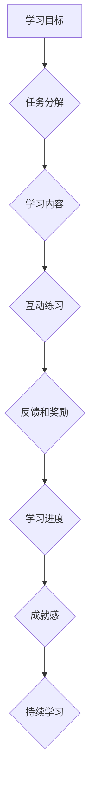

                 

## 知识的gamification：寓教于乐的学习革命

> 关键词：Gamification, 教育科技, 学习体验, 知识获取, 认知科学, 奖励机制, 互动学习

## 1. 背景介绍

在当今数字化时代，教育领域也迎来了前所未有的变革。传统教学模式面临着越来越多的挑战，如何激发学生的学习兴趣，提高学习效率，成为教育工作者和科技工作者共同关注的焦点。Gamification，即将游戏元素融入非游戏场景，成为一种备受关注的创新模式。它通过模拟游戏机制，例如积分、排行榜、任务目标等，将学习过程变得更加有趣、互动和富有挑战性，从而有效提升学习者的参与度和成就感。

## 2. 核心概念与联系

Gamification的核心在于将游戏的设计理念应用于非游戏领域，以增强用户体验和行为驱动。它并非简单地将游戏移植到教育场景，而是需要深入理解游戏机制的本质，并将其与学习目标相结合，设计出符合学习规律和用户需求的学习体验。

**Gamification 的核心元素：**

* **目标和任务:**  明确的学习目标和任务，引导学习者朝着目标前进。
* **反馈和奖励:** 及时反馈学习成果，并提供相应的奖励，增强学习者的积极性和成就感。
* **竞争和合作:**  引入竞争机制，激发学习者的学习热情，同时鼓励合作学习，提升团队协作能力。
* **进度和成就:**  展示学习进度和成就，增强学习者的学习动力和成就感。
* **故事和角色扮演:**  通过故事和角色扮演，增强学习者的代入感和学习兴趣。

**Gamification 与教育的联系:**

Gamification 可以有效解决传统教育模式面临的一些问题，例如：

* **学习兴趣低:** 通过游戏化元素，激发学生的学习兴趣，提高学习积极性。
* **学习效率低:**  通过任务目标、反馈机制等，引导学生高效学习，提高学习效率。
* **缺乏互动性:** 通过互动游戏、合作学习等，增强学习的互动性，提升学习效果。

**Mermaid 流程图:**



## 3. 核心算法原理 & 具体操作步骤

### 3.1  算法原理概述

Gamification 的核心算法原理在于将游戏元素与学习目标相结合，设计出能够有效激励和引导学习者的学习路径。常见的算法包括：

* **行为模型:**  通过分析用户的学习行为，预测用户的学习路径和学习兴趣，并根据用户的行为进行个性化推荐和奖励。
* **奖励机制:**  根据用户的学习成果和行为，提供相应的奖励，例如积分、徽章、虚拟货币等，增强用户的学习动力和成就感。
* **排行榜和竞争机制:**  通过排行榜和竞争机制，激发用户的学习热情，鼓励用户不断进步和超越自我。

### 3.2  算法步骤详解

1. **目标设定:**  明确学习目标和学习内容，并将其分解成多个可实现的任务。
2. **游戏化设计:**  根据学习目标和内容，设计相应的游戏元素，例如积分、排行榜、任务目标、奖励机制等。
3. **用户行为分析:**  收集用户的学习行为数据，例如学习时间、学习内容、学习进度等，并进行分析和建模。
4. **个性化推荐:**  根据用户的学习行为和兴趣，提供个性化的学习内容和任务推荐。
5. **奖励机制实施:**  根据用户的学习成果和行为，提供相应的奖励，例如积分、徽章、虚拟货币等。
6. **反馈和评估:**  及时反馈用户的学习成果，并进行评估和改进，不断优化学习体验。

### 3.3  算法优缺点

**优点:**

* **提高学习兴趣:**  游戏化元素能够有效激发学生的学习兴趣，提高学习积极性。
* **增强学习互动性:**  Gamification 可以通过互动游戏、合作学习等方式，增强学习的互动性，提升学习效果。
* **个性化学习:**  通过行为模型和数据分析，可以实现个性化学习，满足不同用户的学习需求。

**缺点:**

* **设计难度:**  需要深入理解游戏机制和学习规律，才能设计出有效的Gamification方案。
* **成本投入:**  开发和实施Gamification系统需要一定的成本投入。
* **过度游戏化:**  如果过度强调游戏元素，可能会降低学习的严肃性和深度。

### 3.4  算法应用领域

Gamification 的应用领域非常广泛，例如：

* **教育:**  将游戏化元素融入课堂教学，提高学生的学习兴趣和效率。
* **企业培训:**  通过游戏化方式进行员工培训，提高培训效果和员工参与度。
* **健康管理:**  通过游戏化方式鼓励用户进行健康行为，例如运动、饮食控制等。
* **营销推广:**  通过游戏化方式提高用户参与度和品牌忠诚度。

## 4. 数学模型和公式 & 详细讲解 & 举例说明

### 4.1  数学模型构建

Gamification 的核心算法可以抽象为一个数学模型，其中包括用户行为、奖励机制、学习进度等多个变量。

**用户行为模型:**

$$
u(t) = f(t, s(t), r(t))
$$

其中：

* $u(t)$ 表示用户在时间 $t$ 的行为。
* $t$ 表示时间。
* $s(t)$ 表示用户在时间 $t$ 的状态，例如学习进度、积分等。
* $r(t)$ 表示用户在时间 $t$ 接收到的奖励。
* $f$ 表示用户行为的函数，取决于时间、状态和奖励。

**奖励机制模型:**

$$
r(t) = g(u(t), s(t))
$$

其中：

* $r(t)$ 表示用户在时间 $t$ 接收到的奖励。
* $u(t)$ 表示用户在时间 $t$ 的行为。
* $s(t)$ 表示用户在时间 $t$ 的状态。
* $g$ 表示奖励机制的函数，取决于用户行为和状态。

### 4.2  公式推导过程

通过上述模型，我们可以推导出用户学习行为的演化规律，并根据用户的行为和状态，设计相应的奖励机制，以引导用户朝着学习目标前进。

### 4.3  案例分析与讲解

例如，在学习一门编程语言的课程中，我们可以使用以下Gamification机制：

* **目标设定:**  将课程内容分解成多个模块，每个模块对应一个学习目标。
* **任务分解:**  每个模块进一步分解成多个小任务，例如完成代码练习、解决编程问题等。
* **奖励机制:**  完成每个小任务，用户可以获得积分，完成每个模块，用户可以获得徽章。
* **排行榜和竞争机制:**  将用户的学习进度和积分排名显示在排行榜上，鼓励用户互相竞争，不断进步。

通过以上机制，可以有效激发学生的学习兴趣，提高学习效率。

## 5. 项目实践：代码实例和详细解释说明

### 5.1  开发环境搭建

为了实现Gamification的项目实践，我们需要搭建一个开发环境。常用的开发环境包括：

* **Python:**  Python 是一个非常流行的编程语言，拥有丰富的学习资源和开发工具。
* **Django/Flask:**  Django 和 Flask 是 Python 语言下的两个主流 web 框架，可以帮助我们快速搭建 web 应用。
* **数据库:**  我们可以使用 MySQL、PostgreSQL 等数据库来存储用户数据和学习进度。

### 5*2 源代码详细实现

以下是一个简单的 Gamification 系统的代码示例，使用 Python 和 Flask 框架实现：

```python
from flask import Flask, render_template, request

app = Flask(__name__)

# 用户数据
users = {}

@app.route('/')
def index():
    return render_template('index.html')

@app.route('/login', methods=['POST'])
def login():
    username = request.form['username']
    password = request.form['password']
    # 用户登录逻辑
    if username in users and users[username]['password'] == password:
        return '登录成功!'
    else:
        return '登录失败!'

@app.route('/task', methods=['POST'])
def task():
    username = request.form['username']
    task_id = request.form['task_id']
    # 任务完成逻辑
    if username in users:
        users[username]['progress'] += 1
        return '任务完成!'
    else:
        return '用户不存在!'

if __name__ == '__main__':
    app.run(debug=True)
```

**index.html:**

```html
<!DOCTYPE html>
<html>
<head>
    <title>Gamification</title>
</head>
<body>
    <h1>Gamification</h1>
    <form method="POST" action="/login">
        <label for="username">用户名:</label>
        <input type="text" id="username" name="username"><br><br>
        <label for="password">密码:</label>
        <input type="password" id="password" name="password"><br><br>
        <button type="submit">登录</button>
    </form>
</body>
</html>
```

### 5.3  代码解读与分析

* **用户数据:**  `users` 字典存储用户的用户名和密码，以及用户的学习进度等信息。
* **登录逻辑:**  `login` 函数处理用户登录请求，验证用户名和密码是否正确。
* **任务完成逻辑:**  `task` 函数处理用户完成任务的请求，更新用户的学习进度。

### 5.4  运行结果展示

运行以上代码，可以搭建一个简单的 Gamification 系统。用户可以通过网页登录系统，并完成系统提供的任务，获得积分和学习进度。

## 6. 实际应用场景

Gamification 的应用场景非常广泛，以下是一些实际应用场景：

### 6.1  教育领域

* **在线学习平台:**  将游戏化元素融入在线学习平台，提高学生的学习兴趣和参与度。
* **课堂教学:**  利用游戏化方式进行课堂教学，例如通过竞赛、合作学习等方式，增强学生的学习互动性和积极性。
* **个性化学习:**  根据学生的学习行为和兴趣，提供个性化的学习内容和任务推荐，提高学习效率。

### 6.2  企业培训领域

* **员工培训:**  通过游戏化方式进行员工培训，提高培训效果和员工参与度。
* **技能提升:**  利用游戏化机制鼓励员工提升技能，例如通过完成挑战任务、获得奖励等方式，提高员工的专业能力。
* **团队合作:**  通过游戏化方式促进团队合作，例如通过合作游戏、团队竞赛等方式，增强团队协作能力。

### 6.3  健康管理领域

* **运动激励:**  通过游戏化方式鼓励用户进行运动，例如通过完成运动目标、获得奖励等方式，提高用户的运动习惯。
* **健康饮食:**  通过游戏化方式引导用户养成健康饮食习惯，例如通过完成饮食目标、获得奖励等方式，提高用户的健康意识。
* **疾病管理:**  通过游戏化方式帮助用户管理慢性疾病，例如通过完成治疗计划、获得奖励等方式，提高用户的依从性。

### 6.4  未来应用展望

随着技术的不断发展，Gamification 的应用场景将会更加广泛，例如：

* **元宇宙教育:**  在元宇宙环境中，利用虚拟现实和增强现实技术，打造沉浸式的 Gamification 学习体验。
* **人工智能辅助学习:**  利用人工智能技术，根据用户的学习行为和需求，个性化定制 Gamification 学习方案。
* **跨学科学习:**  将不同学科的知识和技能融合在一起，设计出更加丰富的 Gamification 学习体验。

## 7. 工具和资源推荐

### 7.1  学习资源推荐

* **书籍:**
    * "Gamification by Design: Implementing Game Mechanics in Web and Mobile Apps" by Gabe Zichermann and Joselin Linder
    * "The Gamification of Learning and Instruction: Game-Based Methods and Strategies for Training and Education" by Karl Kapp
* **网站:**
    * **Gamification.co:** https://gamification.co/
    * **The Gamification Research Network:** https://www.gamificationresearch.org/

### 7.2  开发工具推荐

* **Python:** https://www.python.org/
* **Django:** https://www.djangoproject.com/
* **Flask:** https://flask.palletsprojects.com/en/2.2.x/

### 7.3  相关论文推荐

* **"Gamification in Education: A Systematic Review"** by Deterding, S., Sicart, M., Nacke, L., O'Hara, K., & Dixon, D. (2011)
* **"The Gamification of Learning and Instruction: Game-Based Methods and Strategies for Training and Education"** by Kapp, K. M. (2012)

## 8. 总结：未来发展趋势与挑战

### 8.1  研究成果总结

Gamification 在教育、企业培训、健康管理等领域取得了显著的成果，有效提高了学习兴趣、参与度和效率。

### 8.2  未来发展趋势

* **人工智能驱动的个性化 Gamification:**  利用人工智能技术，根据用户的学习行为和需求，个性化定制 Gamification 学习方案。
* **元宇宙 Gamification:**  在元宇宙环境中，利用虚拟现实和增强现实技术，打造沉浸式的 Gamification 学习体验。
* **跨学科 Gamification:**  将不同学科的知识和技能融合在一起，设计出更加丰富的 Gamification 学习体验。

### 8.3  面临的挑战

* **如何设计有效的 Gamification 方案:**  需要深入理解游戏机制和学习规律，才能设计出有效的 Gamification 方案。
* **如何避免过度游戏化:**  如果过度强调游戏元素，可能会降低学习的严肃性和深度。
* **如何保证数据安全和隐私:**  Gamification 系统需要收集用户的学习数据，需要保证数据的安全和隐私。

### 8.4  研究展望

未来，Gamification 将继续发展和完善，成为一种更加普遍和有效的学习方式。我们需要不断探索新的 Gamification 应用场景，并解决其面临的挑战，以更好地服务于教育和社会发展。

## 9. 附录：常见问题与解答

**常见问题:**

* **Gamification 是否适合所有学习者?**

**解答:**  Gamification 并非适合所有学习者，有些学习者可能更喜欢传统的学习方式。

* **如何设计有效的 Gamification 方案?**

**解答:**  需要深入理解游戏机制和学习规律，并根据用户的学习目标和需求进行设计。

* **Gamification 是否会降低学习的严肃性和深度?**

**解答:**  如果过度强调游戏元素，可能会降低学习的严肃性和深度。需要合理设计游戏元素，避免过度游戏化。


作者：禅与计算机程序设计艺术 / Zen and the Art of Computer Programming<end_of_turn>

