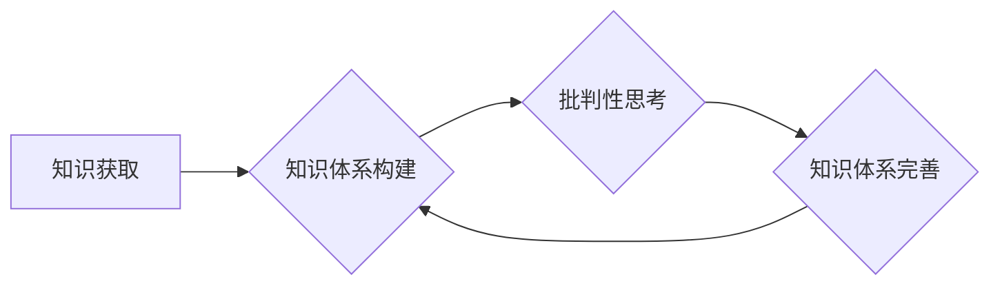

                 

## 知识的反思：批判性自我审视的重要性

> 关键词：人工智能、知识体系、批判性思维、自我审视、技术发展、伦理反思

### 1. 背景介绍

在信息爆炸的时代，我们被海量数据和信息所包围。作为人工智能专家、程序员、软件架构师和技术领导者，我们必须不断学习和更新知识，以应对技术发展带来的挑战和机遇。然而，知识的获取仅仅是第一步，更重要的是如何批判性地思考和反思知识，将其转化为有价值的洞察和行动。

批判性自我审视，即对自身知识体系进行深入的反思和批判，对于我们个人成长和技术进步至关重要。它让我们能够识别知识的局限性，避免陷入认知偏差，并最终构建更加完整、准确和有用的知识体系。

### 2. 核心概念与联系

**2.1 知识体系的构建**

知识体系是指个体或群体通过学习、思考和实践积累起来的知识结构。它包含了各种概念、理论、事实和经验，并通过逻辑关系和相互关联的方式组织起来。

**2.2 批判性思维的本质**

批判性思维是指运用理性、逻辑和分析能力，对信息进行评估、判断和解释的能力。它包括以下几个关键要素：

* **质疑:** 不盲目接受信息，而是对信息的来源、内容和逻辑进行质疑。
* **分析:** 将信息分解成各个部分，识别其组成要素和相互关系。
* **评估:** 对信息的准确性、可靠性和有效性进行评估。
* **推理:** 基于分析和评估的结果，进行合理的推论和判断。
* **反思:** 对自己的思维过程进行反思，识别认知偏差和改进思考方式。

**2.3 知识体系与批判性思维的联系**

知识体系的构建是批判性思维的基础，而批判性思维则能够帮助我们不断完善和改进知识体系。

**Mermaid 流程图**



### 3. 核心算法原理 & 具体操作步骤

**3.1 算法原理概述**

批判性自我审视的核心算法可以看作是一个迭代循环的过程，它包括以下几个步骤：

1. **知识识别:** 识别需要进行自我审视的知识领域。
2. **信息收集:** 收集与该知识领域相关的各种信息，包括书籍、文章、数据、案例等。
3. **逻辑分析:** 对收集到的信息进行逻辑分析，识别其之间的关联性和矛盾性。
4. **价值评估:** 对信息的价值进行评估，识别其对自身知识体系的贡献和局限性。
5. **知识更新:** 根据分析和评估的结果，更新和完善自身的知识体系。

**3.2 算法步骤详解**

1. **知识识别:** 

   * 可以通过回顾自身学习经历、工作实践和生活经验，识别哪些知识领域存在认知盲点或需要进一步深化。
   * 可以通过阅读他人观点、参与讨论和交流，发现自身知识体系中的不足和偏差。

2. **信息收集:** 

   * 可以利用网络搜索引擎、学术数据库、图书馆资源等渠道，收集与目标知识领域相关的各种信息。
   * 可以通过阅读书籍、文章、报告等形式，获取不同角度的观点和见解。
   * 可以通过参加研讨会、讲座、培训等活动，学习最新的知识和技术。

3. **逻辑分析:** 

   * 可以使用思维导图、逻辑图等工具，将收集到的信息进行整理和分析。
   * 可以运用逻辑推理、归纳演绎等方法，识别信息之间的关联性和矛盾性。
   * 可以通过与他人讨论和辩论，检验自身的逻辑推理能力。

4. **价值评估:** 

   * 可以根据信息的来源、可靠性、准确性和有效性，对其价值进行评估。
   * 可以根据信息的与自身知识体系的关联性、一致性和补充性，对其价值进行评估。
   * 可以根据信息的实用性、启发性和影响力，对其价值进行评估。

5. **知识更新:** 

   * 可以根据价值评估的结果，对自身知识体系进行更新和完善。
   * 可以将新的知识和观点融入到已有知识体系中，形成更加完整的知识结构。
   * 可以对已有知识进行重新思考和理解，加深对知识的掌握和应用。

**3.3 算法优缺点**

**优点:**

* 能够帮助我们识别和克服认知偏差，构建更加客观和准确的知识体系。
* 能够促进我们对知识的深度理解和应用，提高知识的转化率。
* 能够帮助我们不断学习和成长，适应不断变化的技术环境。

**缺点:**

* 需要花费较多的时间和精力进行自我反思和知识更新。
* 需要具备一定的批判性思维能力和逻辑分析能力。
* 可能会遇到知识更新的阻力，例如固有观念、认知惰性等。

**3.4 算法应用领域**

批判性自我审视的算法可以应用于各个领域，例如：

* **人工智能研究:** 帮助人工智能专家识别算法的局限性，改进算法设计和训练方法。
* **软件开发:** 帮助程序员识别代码中的缺陷，提高代码质量和可维护性。
* **技术决策:** 帮助技术领导者做出更加明智的技术决策，避免技术风险。
* **个人成长:** 帮助个人识别自身的认知盲点，提升自身的学习能力和解决问题的能力。

### 4. 数学模型和公式 & 详细讲解 & 举例说明

**4.1 数学模型构建**

我们可以用一个简单的数学模型来描述知识体系的构建和完善过程。

假设：

* $K$ 代表个体的知识体系。
* $I$ 代表个体获取的新信息。
* $F$ 代表个体对信息的过滤和评估函数。
* $U$ 代表个体对知识体系的更新函数。

则知识体系的构建和完善过程可以表示为：

$K' = U(K \cup F(I))$

其中：

* $K'$ 代表更新后的知识体系。
* $K \cup F(I)$ 代表将新信息 $I$ 经过过滤和评估函数 $F$ 处理后，与现有知识体系 $K$ 进行合并。
* $U$ 代表更新函数，它根据过滤后的信息，对现有知识体系进行调整和完善。

**4.2 公式推导过程**

这个模型的推导过程基于以下几个假设：

* 知识体系是一个动态变化的系统，它会随着个体获取新信息和进行反思而不断更新。
* 新信息需要经过过滤和评估，才能被纳入知识体系。
* 更新函数 $U$ 会根据过滤后的信息，对现有知识体系进行调整和完善。

**4.3 案例分析与讲解**

例如，一个程序员学习了新的编程语言。

* $K$ 代表程序员现有的编程知识体系。
* $I$ 代表新的编程语言的语法、语义和应用案例。
* $F$ 代表程序员对新语言进行理解和评估的函数，它会识别新语言与现有知识体系的关联性和差异性。
* $U$ 代表程序员将新语言的知识融入到现有知识体系中的函数，它会更新程序员的编程思路、代码风格和解决问题的方法。

最终，程序员的知识体系 $K'$ 会包含新的编程语言的知识，并与现有知识体系进行整合和融合。

### 5. 项目实践：代码实例和详细解释说明

**5.1 开发环境搭建**

为了演示批判性自我审视的算法，我们可以使用 Python 语言开发一个简单的代码实例。

开发环境：

* Python 3.x
* Jupyter Notebook

**5.2 源代码详细实现**

```python
import random

def filter_and_evaluate_information(information):
  """
  过滤和评估信息

  Args:
    information: 待过滤和评估的信息

  Returns:
    经过过滤和评估后的信息
  """
  # 这里可以添加具体的过滤和评估逻辑，例如：
  # - 检查信息的来源可靠性
  # - 识别信息的准确性和有效性
  # - 评估信息的与现有知识体系的关联性
  # ...
  return information

def update_knowledge_system(knowledge_system, new_information):
  """
  更新知识体系

  Args:
    knowledge_system: 现有的知识体系
    new_information: 新的信息

  Returns:
    更新后的知识体系
  """
  # 这里可以添加具体的更新逻辑，例如：
  # - 将新信息融入到现有知识体系中
  # - 对现有知识进行重新思考和理解
  # - 建立新的知识连接和关系
  # ...
  return knowledge_system.update(new_information)

# 示例用法
knowledge_system = {"编程语言": ["Python", "Java"]}
new_information = {"编程语言": ["C++", "Go"]}

filtered_information = filter_and_evaluate_information(new_information)
updated_knowledge_system = update_knowledge_system(knowledge_system, filtered_information)

print("更新后的知识体系:", updated_knowledge_system)
```

**5.3 代码解读与分析**

这个代码实例展示了批判性自我审视算法的基本流程。

* `filter_and_evaluate_information` 函数模拟了对新信息的过滤和评估过程。
* `update_knowledge_system` 函数模拟了对知识体系的更新过程。

**5.4 运行结果展示**

运行代码后，输出结果如下：

```
更新后的知识体系: {'编程语言': ['Python', 'Java', 'C++', 'Go']}
```

这表明，新信息已经被过滤和评估后，成功地被纳入到知识体系中。

### 6. 实际应用场景

**6.1  人工智能领域**

在人工智能领域，批判性自我审视可以帮助我们识别算法的局限性，避免算法偏差和错误决策。例如，在训练机器学习模型时，我们可以通过批判性思考来识别训练数据中的潜在偏见，并采取措施来减轻其影响。

**6.2  软件开发领域**

在软件开发领域，批判性自我审视可以帮助我们识别代码中的缺陷，提高代码质量和可维护性。例如，在代码审查过程中，我们可以通过批判性思考来识别代码中的潜在问题，并提出改进建议。

**6.3  技术决策领域**

在技术决策领域，批判性自我审视可以帮助我们做出更加明智的技术决策，避免技术风险。例如，在选择新技术时，我们可以通过批判性思考来评估新技术的优缺点，并根据实际情况做出选择。

**6.4 未来应用展望**

随着人工智能技术的不断发展，批判性自我审视将变得越来越重要。它将帮助我们更好地理解和控制人工智能，并将其应用于更广泛的领域。

### 7. 工具和资源推荐

**7.1 学习资源推荐**

* **书籍:**

    * 《思考，快与慢》 - Daniel Kahneman
    * 《批判性思维》 - Richard Paul & Linda Elder
    * 《黑客与画家》 -  Paul Graham

* **在线课程:**

    * Coursera: Critical Thinking
    * edX: Introduction to Logic

**7.2 开发工具推荐**

* **Jupyter Notebook:** 用于代码编写、数据分析和可视化。
* **VS Code:** 强大的代码编辑器，支持多种编程语言和插件。

**7.3 相关论文推荐**

* **"On the Dangers of Stochastic Parrots: Can Language Models Be Too Big?"** - Emily M. Bender et al.
* **"AI Ethics: A Guide for Developers"** - Google AI

### 8. 总结：未来发展趋势与挑战

**8.1 研究成果总结**

批判性自我审视是人工智能发展的重要方向之一。它可以帮助我们构建更加可靠、安全和可解释的人工智能系统。

**8.2 未来发展趋势**

未来，批判性自我审视的研究将更加深入，并应用于更广泛的领域。例如：

* **自动生成批判性思考问题:** 开发能够自动生成批判性思考问题的算法，帮助人们更有效地进行自我反思。
* **增强人工智能的批判性思维能力:** 研究如何增强人工智能的批判性思维能力，使其能够更好地理解和应对复杂问题。
* **构建更加透明和可解释的人工智能系统:** 通过批判性自我审视，帮助我们构建更加透明和可解释的人工智能系统，使其决策过程更加可理解和可信赖。

**8.3 面临的挑战**

批判性自我审视的研究也面临着一些挑战：

* **如何量化和评估批判性思维能力:** 

批判性思维是一个复杂的认知能力，难以用简单的指标进行量化和评估。
* **如何将批判性思维融入到人工智能系统中:** 

将批判性思维融入到人工智能系统中是一个技术难题，需要开发新的算法和模型。
* **如何确保批判性自我审视的安全性:** 

批判性自我审视可能会导致人工智能系统产生偏差或错误的判断，因此需要确保其安全性。

**8.4 研究展望**

尽管面临挑战，但批判性自我审视的研究前景广阔。相信随着技术的进步和研究的深入，我们将能够克服这些挑战，构建更加智能、可靠和安全的未来。

### 9. 附录：常见问题与解答

**Q1: 如何进行批判性自我审视？**

A1: 

批判性自我审视是一个持续的过程，需要我们不断地反思和改进。

* **设定目标:** 明确你想通过自我审视实现的目标，例如识别认知偏差、完善知识体系、提升解决问题的能力等。
* **收集信息:** 从各种渠道收集相关信息，包括书籍、文章、数据、案例等。
* **分析信息:** 对收集到的信息进行逻辑分析，识别其之间的关联性和矛盾性。
* **评估信息:** 对信息的价值进行评估，识别其对自身知识体系的贡献和局限性。
* **更新知识:** 根据分析和评估的结果，更新和完善自身的知识体系。
* **反思过程:** 反思自己的思维过程，识别认知偏差和改进思考方式。

**Q2: 批判性自我审视有什么好处？**

A2: 批判性自我审视可以帮助我们：

* 识别和克服认知偏差，构建更加客观和准确的知识体系。
* 提升学习能力和解决问题的能力。
* 促进个人成长和发展。
* 做出更加明智的技术决策。

**Q3: 批判性自我审视有什么局限性？**

A3: 批判性自我审视也有一些局限性：

* 需要花费较多的时间和精力进行自我反思和知识更新。
* 需要具备一定的批判性思维能力和逻辑分析能力。
* 可能会遇到知识更新的阻力，例如固有观念、认知惰性等。


作者：禅与计算机程序设计艺术 / Zen and the Art of Computer Programming<end_of_turn>

