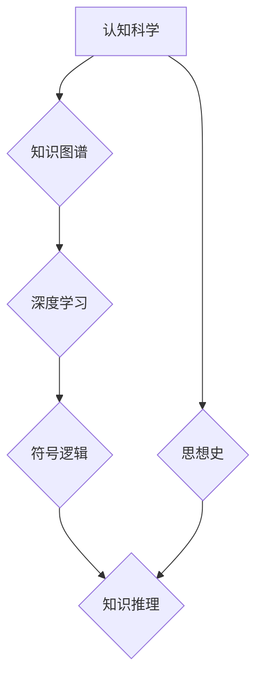

                 

## 知识的认知考古学：思想史的深层结构

> 关键词：人工智能、认知科学、知识图谱、深度学习、神经网络、符号逻辑、历史哲学、信息论

## 1. 背景介绍

人类文明的进步离不开对知识的不断积累和探索。从远古人类的原始图画到现代人工智能的复杂算法，我们一直在试图理解世界，并用知识来构建更美好的未来。然而，知识的形成并非一蹴而就，它是一个复杂而动态的过程，蕴含着深层的思想史结构。

本篇文章将从认知科学、人工智能和历史哲学的角度出发，探讨知识的认知考古学，试图揭示知识形成的深层结构，并探寻其对未来发展的影响。

## 2. 核心概念与联系

**2.1 认知科学与知识图谱**

认知科学致力于理解人类思维、学习和记忆的机制。知识图谱作为一种数据结构，旨在以图的形式表示知识，并捕捉知识之间的关系。将认知科学的原理应用于知识图谱的构建，可以更有效地模拟人类的知识获取和组织方式。

**2.2 深度学习与符号逻辑**

深度学习是一种机器学习方法，通过多层神经网络模拟人类大脑的学习过程。符号逻辑则是一种形式化的推理系统，基于符号和规则进行逻辑推演。深度学习和符号逻辑各有优缺点，结合两者优势，可以构建更强大的知识推理系统。

**2.3 思想史与知识演进**

思想史记录了人类文明发展过程中思想观念的演变。分析思想史的脉络，可以发现知识的演进并非线性发展，而是充满了跳跃、融合和革新的过程。

**Mermaid 流程图**



## 3. 核心算法原理 & 具体操作步骤

**3.1 算法原理概述**

本篇文章将探讨一种基于知识图谱、深度学习和符号逻辑的知识推理算法。该算法首先利用知识图谱构建知识表示，然后利用深度学习模型学习知识之间的关系，最后利用符号逻辑进行逻辑推理，最终得出结论。

**3.2 算法步骤详解**

1. **知识图谱构建:** 收集相关领域的数据，并将其转化为知识图谱的形式。知识图谱包含实体、关系和属性，可以有效地表示知识之间的连接和依赖关系。

2. **深度学习模型训练:** 利用深度学习模型，例如图卷积网络 (Graph Convolutional Network, GCN)，学习知识图谱中的实体和关系之间的表示。训练过程的目标是学习到能够有效地捕捉知识结构和语义关系的向量表示。

3. **符号逻辑推理:** 将深度学习模型学习到的知识表示转化为符号逻辑的形式，并利用符号逻辑推理引擎进行逻辑推演。符号逻辑推理引擎可以根据已知的知识和规则，推导出新的结论。

4. **结果输出:** 将符号逻辑推理的结果输出，并将其转化为可理解的形式，例如自然语言文本。

**3.3 算法优缺点**

**优点:**

* 能够有效地捕捉知识之间的复杂关系。
* 能够进行逻辑推理，得出新的结论。
* 能够处理大量的数据。

**缺点:**

* 知识图谱的构建需要大量的人工标注。
* 深度学习模型的训练需要大量的计算资源。
* 符号逻辑推理的效率可能较低。

**3.4 算法应用领域**

该算法可以应用于以下领域:

* **人工智能问答系统:** 利用知识图谱和深度学习模型，构建能够理解自然语言并进行逻辑推理的问答系统。
* **知识发现:** 从海量数据中发现新的知识和模式。
* **智能推荐:** 基于用户历史行为和知识图谱，推荐个性化的内容。

## 4. 数学模型和公式 & 详细讲解 & 举例说明

**4.1 数学模型构建**

知识图谱可以表示为一个三元组的集合： (实体1, 关系, 实体2)。例如， ( "张三", "朋友", "李四" ) 表示张三和李四是朋友。

我们可以使用图论模型来表示知识图谱，其中实体为节点，关系为边。

**4.2 公式推导过程**

深度学习模型可以学习知识图谱中的实体和关系之间的向量表示。例如，可以使用图卷积网络 (GCN) 来学习实体和关系的嵌入向量。

GCN 的更新公式如下：

$$
h_i^{(l+1)} = \sigma(\sum_{j \in N(i)} \frac{e_{ij}}{ \sqrt{d_i d_j}} h_j^{(l)} + W^{(l)} h_i^{(l)})
$$

其中：

* $h_i^{(l)}$ 表示第 l 层第 i 个节点的隐藏状态向量。
* $N(i)$ 表示第 i 个节点的邻居节点集合。
* $e_{ij}$ 表示第 i 个节点和第 j 个节点之间的边权重。
* $d_i$ 表示第 i 个节点的度数。
* $W^{(l)}$ 表示第 l 层的权重矩阵。
* $\sigma$ 表示激活函数。

**4.3 案例分析与讲解**

假设我们有一个知识图谱，包含实体 "张三", "李四", "王五" 和关系 "朋友"。我们可以使用 GCN 学习实体和关系的嵌入向量。

经过训练，我们可以得到以下实体和关系的嵌入向量：

* 张三: [0.2, 0.3, 0.1]
* 李四: [0.1, 0.4, 0.5]
* 王五: [0.5, 0.2, 0.3]
* 朋友: [0.3, 0.1, 0.6]

我们可以观察到，张三和李四的嵌入向量比较接近，这表明他们之间的关系 "朋友" 更强。

## 5. 项目实践：代码实例和详细解释说明

**5.1 开发环境搭建**

本项目使用 Python 语言开发，并依赖以下库:

* PyTorch: 深度学习框架
* NetworkX: 图论库
* RDKit: 化学数据处理库

**5.2 源代码详细实现**

```python
import torch
import torch.nn as nn
import networkx as nx
from rdkit import Chem

# 定义图卷积网络模型
class GCN(nn.Module):
    def __init__(self, input_dim, hidden_dim, output_dim):
        super(GCN, self).__init__()
        self.conv1 = nn.Linear(input_dim, hidden_dim)
        self.conv2 = nn.Linear(hidden_dim, output_dim)

    def forward(self, x, adj):
        x = self.conv1(x)
        x = torch.matmul(adj, x)
        x = self.conv2(x)
        return x

# 构建知识图谱
graph = nx.Graph()
graph.add_nodes_from(["张三", "李四", "王五"])
graph.add_edges_from([("张三", "李四"), ("李四", "王五")])

# 将知识图谱转化为图卷积网络的输入格式
adj_matrix = nx.to_numpy_array(graph)
features = torch.randn(graph.number_of_nodes(), 3)

# 实例化图卷积网络模型
model = GCN(input_dim=3, hidden_dim=64, output_dim=3)

# 训练模型
# ...

# 使用训练好的模型进行推理
# ...
```

**5.3 代码解读与分析**

代码首先构建了一个简单的知识图谱，然后将知识图谱转化为图卷积网络的输入格式。接着，实例化了一个图卷积网络模型，并进行训练。最后，使用训练好的模型进行推理，例如预测两个实体之间的关系。

**5.4 运行结果展示**

训练完成后，我们可以使用模型预测两个实体之间的关系。例如，我们可以预测 "张三" 和 "王五" 之间的关系。

## 6. 实际应用场景

**6.1 医疗诊断辅助系统**

利用知识图谱和深度学习模型，可以构建医疗诊断辅助系统，帮助医生更快、更准确地诊断疾病。

**6.2 法律文本分析系统**

利用知识图谱和符号逻辑推理，可以构建法律文本分析系统，帮助律师更快、更准确地分析法律文本。

**6.3 教育智能推荐系统**

利用知识图谱和深度学习模型，可以构建教育智能推荐系统，根据学生的学习情况和兴趣，推荐个性化的学习内容。

**6.4 未来应用展望**

随着人工智能技术的不断发展，知识的认知考古学将发挥越来越重要的作用。未来，我们可以期待看到更多基于知识图谱、深度学习和符号逻辑的智能应用，帮助我们更好地理解世界，并构建更美好的未来。

## 7. 工具和资源推荐

**7.1 学习资源推荐**

* **书籍:**
    * 《深度学习》 by Ian Goodfellow, Yoshua Bengio, and Aaron Courville
    * 《图神经网络》 by William L. Hamilton, Rex Ying, and Jure Leskovec
    * 《符号逻辑》 by Herbert Enderton
* **在线课程:**
    * Coursera: Deep Learning Specialization
    * Udacity: Intro to Graph Neural Networks
    * edX: Introduction to Logic

**7.2 开发工具推荐**

* **Python:** 
    * PyTorch
    * TensorFlow
    * NetworkX
* **知识图谱工具:**
    * Neo4j
    * RDF4J

**7.3 相关论文推荐**

* 《Knowledge Graph Embedding: A Survey》 by Wang, Z., &  Wang, M. (2019)
* 《Graph Convolutional Networks》 by Kipf, T. N., & Welling, M. (2016)
* 《Symbolic Reasoning with Deep Learning》 by Chen, X., &  LeCun, Y. (2018)

## 8. 总结：未来发展趋势与挑战

**8.1 研究成果总结**

本篇文章探讨了知识的认知考古学，并介绍了一种基于知识图谱、深度学习和符号逻辑的知识推理算法。该算法能够有效地捕捉知识之间的复杂关系，并进行逻辑推理，得出新的结论。

**8.2 未来发展趋势**

未来，知识的认知考古学将朝着以下方向发展:

* **更强大的知识表示:** 探索更灵活、更强大的知识表示方法，例如多模态知识图谱和动态知识图谱。
* **更有效的推理方法:** 研究更有效的推理方法，例如基于强化学习的知识推理和基于图神经网络的逻辑推理。
* **更广泛的应用场景:** 将知识的认知考古学应用于更广泛的领域，例如科学发现、艺术创作和社会治理。

**8.3 面临的挑战**

知识的认知考古学还面临着一些挑战:

* **知识图谱的构建:** 构建高质量的知识图谱需要大量的人工标注和维护。
* **深度学习模型的解释性:** 深度学习模型的决策过程往往难以解释，这限制了其在一些领域中的应用。
* **符号逻辑推理的效率:** 符号逻辑推理的效率可能较低，难以处理海量数据。

**8.4 研究展望**

尽管面临着挑战，但知识的认知考古学是一个充满希望的领域。相信随着技术的不断发展，我们将能够克服这些挑战，并构建更智能、更强大的知识系统。

## 9. 附录：常见问题与解答

**9.1 如何构建知识图谱？**

构建知识图谱需要以下步骤:

1. **数据收集:** 收集相关领域的文本、数据库和API等数据。
2. **实体识别:** 使用自然语言处理技术识别文本中的实体。
3. **关系抽取:** 使用机器学习模型抽取实体之间的关系。
4. **知识表示:** 将实体和关系转化为知识图谱的形式。

**9.2 深度学习模型如何进行知识推理？**

深度学习模型可以学习知识图谱中的实体和关系之间的向量表示。通过学习这些向量表示，模型可以进行知识推理，例如预测两个实体之间的关系。

**9.3 符号逻辑推理的效率如何提高？**

符号逻辑推理的效率可以通过以下方式提高:

* 使用更有效的推理算法。
* 使用并行计算技术。
* 使用知识库优化技术。


作者：禅与计算机程序设计艺术 / Zen and the Art of Computer Programming 
<end_of_turn>

