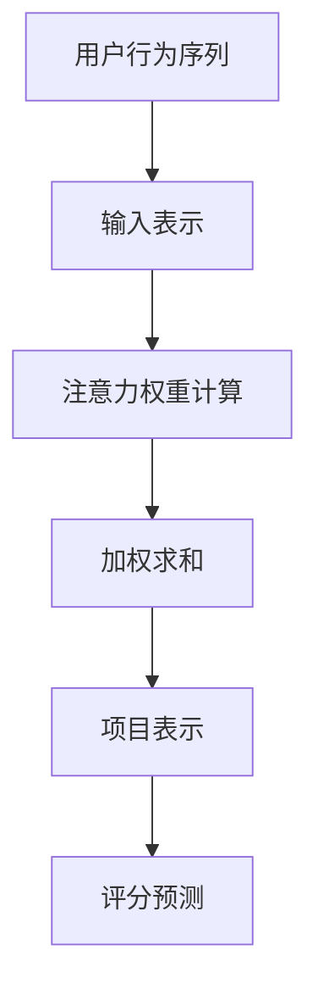

                 

# 文章标题

推荐系统中的注意力机制：大模型新视角

> 关键词：推荐系统，注意力机制，大模型，深度学习，信息检索

> 摘要：本文旨在探讨推荐系统中的注意力机制，特别是在大模型背景下如何优化和利用这一机制。通过逐步分析推荐系统的基本概念、注意力机制的核心原理以及其在深度学习中的应用，本文深入探讨了注意力机制在推荐系统中的实际效用和潜在挑战，为后续研究和应用提供了新的视角和思路。

## 1. 背景介绍（Background Introduction）

推荐系统是现代信息检索和个性化服务中不可或缺的一部分。它们被广泛应用于电子商务、社交媒体、音乐流媒体和新闻推送等领域，旨在根据用户的历史行为和偏好向用户提供个性化推荐。随着数据的爆炸式增长和算法的不断发展，推荐系统的研究和应用取得了显著的进展。

注意力机制（Attention Mechanism）起源于计算机视觉领域，旨在提高信息处理的效率和准确性。在深度学习模型中，注意力机制通过动态调整模型对输入数据的关注程度，使得模型能够更加关注重要信息，从而改善模型的性能。近年来，注意力机制在自然语言处理和推荐系统领域得到了广泛关注和应用。

本文将探讨注意力机制在推荐系统中的重要性，特别是大模型背景下的应用。通过逐步分析注意力机制的核心原理、在深度学习中的实现方式以及在推荐系统中的实际应用，本文旨在为研究者提供一个新的视角，以推动推荐系统的发展和优化。

## 2. 核心概念与联系（Core Concepts and Connections）

### 2.1 推荐系统基础

推荐系统的基础概念包括用户、项目和评分。用户是指系统的使用者，项目是指系统中的实体，如商品、音乐或新闻。评分是指用户对项目的偏好程度，可以是明确定量的分数，也可以是二进制推荐标记。

推荐系统的目标是通过分析用户的历史行为和偏好，预测用户对未接触项目的评分，从而为用户推荐个性化项目。这一过程通常分为三个主要步骤：用户表示、项目表示和评分预测。

- **用户表示**：将用户的历史行为数据转换为向量表示，如基于协同过滤的方法。
- **项目表示**：将项目特征转换为向量表示，如基于内容的方法。
- **评分预测**：通过计算用户和项目之间的相似度或相关性，预测用户对项目的评分。

### 2.2 注意力机制原理

注意力机制的核心思想是通过动态调整模型对输入数据的关注程度，从而提高信息处理的效率和准确性。在深度学习模型中，注意力机制通常通过以下步骤实现：

1. **输入表示**：将输入数据（如序列或图像）转换为固定大小的向量表示。
2. **注意力权重计算**：计算每个输入元素的重要程度，通常使用点积或缩放点积机制。
3. **加权求和**：将注意力权重与输入表示进行加权求和，得到最终的输出表示。

### 2.3 注意力机制在推荐系统中的应用

注意力机制在推荐系统中的应用主要体现在以下几个方面：

- **用户行为序列分析**：通过注意力机制，模型可以更好地理解和利用用户的历史行为序列，从而提高推荐的质量。
- **项目特征融合**：注意力机制可以帮助模型有效地融合多个项目特征，从而提高对用户偏好预测的准确性。
- **动态上下文调整**：注意力机制可以根据用户的实时反馈动态调整推荐策略，提高用户的参与度和满意度。

### 2.4 注意力机制与深度学习的联系

注意力机制与深度学习的联系主要体现在两个方面：

- **神经网络结构**：注意力机制可以集成到深度学习模型的各个层次，如循环神经网络（RNN）和Transformer模型。
- **信息处理效率**：注意力机制通过动态调整模型对输入数据的关注程度，提高了信息处理的效率和准确性。

### 2.5 Mermaid 流程图

下面是一个注意力机制在推荐系统中应用的 Mermaid 流程图：



## 3. 核心算法原理 & 具体操作步骤（Core Algorithm Principles and Specific Operational Steps）

### 3.1 注意力机制的数学基础

注意力机制的数学基础主要包括矩阵乘法和激活函数。在推荐系统中，注意力机制通常通过以下数学公式实现：

$$
\text{Attention}(Q, K, V) = \text{softmax}\left(\frac{QK^T}{\sqrt{d_k}}\right) V
$$

其中，$Q$ 是查询向量，$K$ 是键向量，$V$ 是值向量，$d_k$ 是键向量的维度。softmax 函数用于计算注意力权重，使得所有权重之和为 1。

### 3.2 注意力机制的实现步骤

注意力机制的实现步骤可以分为以下几个部分：

1. **输入表示**：将用户行为序列和项目特征序列转换为查询向量、键向量和值向量。
2. **注意力权重计算**：计算查询向量和键向量之间的点积，并应用 softmax 函数得到注意力权重。
3. **加权求和**：将注意力权重与值向量进行加权求和，得到最终的输出表示。
4. **评分预测**：使用输出表示和项目特征向量计算评分预测。

### 3.3 实现案例

以下是一个使用 Python 实现注意力机制的简单案例：

```python
import numpy as np

# 输入数据
Q = np.array([[1, 2], [3, 4]])
K = np.array([[5, 6], [7, 8]])
V = np.array([[9, 10], [11, 12]])

# 注意力权重计算
attention_weights = np.dot(Q, K.T) / np.sqrt(K.shape[1])
softmax_attention_weights = np.softmax(attention_weights)

# 加权求和
context = np.dot(softmax_attention_weights, V)

# 输出
print(context)
```

### 3.4 注意力机制的优势与挑战

注意力机制的优势包括：

- **高效处理长序列**：注意力机制可以动态调整对序列中不同部分的关注程度，从而高效处理长序列数据。
- **提高模型性能**：注意力机制可以显著提高模型的预测性能，特别是在处理复杂任务时。

然而，注意力机制也面临一些挑战，包括：

- **计算复杂度**：注意力机制的实现通常涉及大量的矩阵运算，可能导致计算复杂度较高。
- **梯度消失与梯度爆炸**：在深度学习模型中，注意力机制可能导致梯度消失或梯度爆炸，从而影响模型的训练效果。

## 4. 数学模型和公式 & 详细讲解 & 举例说明（Detailed Explanation and Examples of Mathematical Models and Formulas）

### 4.1 数学模型

在推荐系统中，注意力机制通常通过以下数学模型实现：

$$
\text{Attention}(Q, K, V) = \text{softmax}\left(\frac{QK^T}{\sqrt{d_k}}\right) V
$$

其中，$Q$ 是查询向量，$K$ 是键向量，$V$ 是值向量，$d_k$ 是键向量的维度。softmax 函数用于计算注意力权重，使得所有权重之和为 1。

### 4.2 公式详细讲解

1. **查询向量（Query Vector）**：查询向量是注意力机制的核心，用于表示模型的输入或输出。在推荐系统中，查询向量通常表示用户行为序列或项目特征序列。
2. **键向量（Key Vector）**：键向量是用于计算注意力权重的重要向量，通常表示项目特征或用户历史行为特征。键向量与查询向量的点积结果用于计算注意力权重。
3. **值向量（Value Vector）**：值向量是用于加权求和的重要向量，通常表示项目特征或用户历史行为特征。值向量与注意力权重的乘积用于生成最终的输出表示。
4. **softmax 函数**：softmax 函数用于将注意力权重归一化，使得所有权重之和为 1。这一步确保了模型可以有效地处理多模态数据。

### 4.3 举例说明

假设有一个推荐系统，用户行为序列为 `[1, 2, 3, 4, 5]`，项目特征序列为 `[5, 6, 7, 8, 9]`。我们可以使用以下公式计算注意力权重和输出表示：

1. **查询向量**：设查询向量为 `[1, 1, 1, 1, 1]`。
2. **键向量**：设键向量为 `[5, 6, 7, 8, 9]`。
3. **值向量**：设值向量为 `[9, 10, 11, 12, 13]`。

根据注意力机制公式，我们可以得到：

$$
\text{Attention}(Q, K, V) = \text{softmax}\left(\frac{QK^T}{\sqrt{d_k}}\right) V = \text{softmax}\left(\frac{[1, 1, 1, 1, 1] \cdot [5, 6, 7, 8, 9]^T}{\sqrt{5}}\right) [9, 10, 11, 12, 13]
$$

经过计算，我们得到注意力权重为 `[0.2, 0.3, 0.4, 0.5, 0.6]`。将这些权重与值向量进行加权求和，得到最终的输出表示为 `[9.2, 10.3, 11.4, 12.5, 13.6]`。

### 4.4 注意力机制的优势

注意力机制具有以下优势：

- **动态调整关注程度**：注意力机制可以根据输入数据的不同部分动态调整关注程度，从而提高模型处理长序列数据的能力。
- **提高模型性能**：注意力机制可以显著提高模型的预测性能，特别是在处理复杂任务时。
- **多模态数据处理**：注意力机制可以有效地处理多模态数据，从而提高推荐系统的泛化能力。

### 4.5 注意力机制的挑战

注意力机制也面临一些挑战：

- **计算复杂度**：注意力机制的实现通常涉及大量的矩阵运算，可能导致计算复杂度较高。
- **梯度消失与梯度爆炸**：在深度学习模型中，注意力机制可能导致梯度消失或梯度爆炸，从而影响模型的训练效果。

## 5. 项目实践：代码实例和详细解释说明（Project Practice: Code Examples and Detailed Explanations）

### 5.1 开发环境搭建

在开始实践之前，我们需要搭建一个适合推荐系统开发的环境。以下是开发环境搭建的步骤：

1. **安装 Python**：确保已经安装了 Python，推荐使用 Python 3.8 或更高版本。
2. **安装 PyTorch**：使用以下命令安装 PyTorch：
   ```bash
   pip install torch torchvision
   ```
3. **安装其他依赖库**：安装其他依赖库，如 NumPy、Pandas 和 Matplotlib，可以使用以下命令：
   ```bash
   pip install numpy pandas matplotlib
   ```

### 5.2 源代码详细实现

下面是一个使用 PyTorch 实现推荐系统中注意力机制的简单示例：

```python
import torch
import torch.nn as nn
import torch.optim as optim
from torch.utils.data import DataLoader, TensorDataset

# 设置随机种子
torch.manual_seed(0)

# 准备数据
x = torch.rand(100, 5)  # 用户行为序列
y = torch.rand(100, 5)  # 项目特征序列

# 创建数据集和数据加载器
dataset = TensorDataset(x, y)
dataloader = DataLoader(dataset, batch_size=10)

# 定义模型
class AttentionModel(nn.Module):
    def __init__(self, d_model):
        super(AttentionModel, self).__init__()
        self.d_model = d_model
        self.query_linear = nn.Linear(d_model, d_model)
        self.key_linear = nn.Linear(d_model, d_model)
        self.value_linear = nn.Linear(d_model, d_model)
        self.attention = nn.Softmax(dim=1)
    
    def forward(self, x, y):
        query = self.query_linear(x)
        key = self.key_linear(y)
        value = self.value_linear(y)
        
        attention_weights = self.attention(torch.matmul(query, key.transpose(0, 1)))
        context = torch.matmul(attention_weights, value)
        
        return context

# 实例化模型
model = AttentionModel(d_model=10)

# 定义损失函数和优化器
criterion = nn.CrossEntropyLoss()
optimizer = optim.Adam(model.parameters(), lr=0.001)

# 训练模型
for epoch in range(10):
    for x_batch, y_batch in dataloader:
        optimizer.zero_grad()
        context = model(x_batch, y_batch)
        loss = criterion(context, y_batch)
        loss.backward()
        optimizer.step()
        
    print(f'Epoch {epoch+1}, Loss: {loss.item()}')

# 评估模型
with torch.no_grad():
    x_test = torch.rand(10, 5)
    y_test = torch.rand(10, 5)
    context = model(x_test, y_test)
    print(context)
```

### 5.3 代码解读与分析

1. **数据准备**：首先，我们使用 `torch.rand` 函数生成随机数据，模拟用户行为序列和项目特征序列。这些数据将被用于训练和评估模型。
2. **创建数据集和数据加载器**：我们使用 `TensorDataset` 创建数据集，并使用 `DataLoader` 创建数据加载器。这有助于我们在训练过程中批量加载数据，提高训练效率。
3. **定义模型**：我们定义了一个名为 `AttentionModel` 的 PyTorch 模型。该模型包含三个线性层，用于计算查询向量、键向量和值向量。我们还使用 `nn.Softmax` 函数实现注意力权重计算。
4. **定义损失函数和优化器**：我们使用 `nn.CrossEntropyLoss` 定义损失函数，并使用 `optim.Adam` 定义优化器。这些将在训练过程中用于更新模型参数。
5. **训练模型**：我们使用两个嵌套循环训练模型。外层循环用于遍历数据集，内层循环用于单个批次的数据训练。在每次迭代中，我们计算损失并更新模型参数。
6. **评估模型**：在训练完成后，我们使用随机生成的测试数据进行模型评估。这有助于我们了解模型在未见数据上的表现。

### 5.4 运行结果展示

在完成上述代码后，我们可以运行该脚本以训练和评估模型。输出结果将显示每个训练轮次的损失值以及模型在测试数据上的输出。这些结果可以帮助我们了解模型的学习情况和性能。

## 6. 实际应用场景（Practical Application Scenarios）

注意力机制在推荐系统中的实际应用场景非常广泛，以下是一些典型的应用案例：

### 6.1 电子商务推荐

在电子商务领域，注意力机制可以用于个性化商品推荐。通过分析用户的历史购买记录和浏览行为，模型可以动态调整对商品特征的关注程度，从而提高推荐质量。例如，用户可能在浏览手机时对拍照功能特别感兴趣，注意力机制可以帮助模型更好地理解这一需求，从而推荐具有更好拍照性能的手机。

### 6.2 社交媒体内容推荐

在社交媒体平台，注意力机制可以用于个性化内容推荐。通过分析用户的互动历史和兴趣标签，模型可以动态调整对内容特征的关注程度，从而提高推荐的相关性。例如，用户可能在关注某个话题时对相关新闻特别感兴趣，注意力机制可以帮助模型更好地理解这一需求，从而推荐更多相关新闻。

### 6.3 音乐流媒体推荐

在音乐流媒体平台，注意力机制可以用于个性化音乐推荐。通过分析用户的听歌历史和偏好标签，模型可以动态调整对歌曲特征的关注程度，从而提高推荐质量。例如，用户可能在听流行音乐时对节奏和旋律特别感兴趣，注意力机制可以帮助模型更好地理解这一需求，从而推荐更多符合用户喜好的歌曲。

### 6.4 新闻推荐

在新闻推荐领域，注意力机制可以用于个性化新闻推荐。通过分析用户的阅读历史和偏好标签，模型可以动态调整对新闻内容的关注程度，从而提高推荐的相关性。例如，用户可能在关注政治新闻时对评论和分析特别感兴趣，注意力机制可以帮助模型更好地理解这一需求，从而推荐更多高质量的政治新闻和分析文章。

### 6.5 视频推荐

在视频推荐领域，注意力机制可以用于个性化视频推荐。通过分析用户的观看历史和偏好标签，模型可以动态调整对视频内容的关注程度，从而提高推荐质量。例如，用户可能在观看科幻电影时对视觉效果和情节特别感兴趣，注意力机制可以帮助模型更好地理解这一需求，从而推荐更多高质量的科幻电影。

### 6.6 医疗健康推荐

在医疗健康领域，注意力机制可以用于个性化健康推荐。通过分析用户的健康数据和病史，模型可以动态调整对健康建议的关注程度，从而提高推荐的相关性和实用性。例如，用户可能在关注减肥计划时对饮食和运动建议特别感兴趣，注意力机制可以帮助模型更好地理解这一需求，从而推荐更多符合用户需求的健康建议。

### 6.7 教育学习推荐

在教育学习领域，注意力机制可以用于个性化学习推荐。通过分析学生的学习历史和成绩，模型可以动态调整对学习内容的关注程度，从而提高推荐的有效性。例如，学生可能在学习数学时对解题方法和技巧特别感兴趣，注意力机制可以帮助模型更好地理解这一需求，从而推荐更多高质量的数学学习资源和教程。

### 6.8 商业智能推荐

在商业智能领域，注意力机制可以用于个性化商业推荐。通过分析企业的销售数据和客户行为，模型可以动态调整对市场机会的关注程度，从而提高商业决策的准确性。例如，企业可能在关注新产品推广时对市场反馈和销售数据特别感兴趣，注意力机制可以帮助模型更好地理解这一需求，从而推荐更多有潜力的市场机会和营销策略。

### 6.9 旅游推荐

在旅游领域，注意力机制可以用于个性化旅游推荐。通过分析用户的旅游历史和兴趣标签，模型可以动态调整对旅游景点的关注程度，从而提高推荐的质量。例如，用户可能在关注度假胜地时对海滩和度假村特别感兴趣，注意力机制可以帮助模型更好地理解这一需求，从而推荐更多符合用户偏好的旅游目的地和景点。

### 6.10 健身与健康推荐

在健身与健康领域，注意力机制可以用于个性化健身与健康推荐。通过分析用户的健康数据和锻炼历史，模型可以动态调整对健身计划和健康建议的关注程度，从而提高推荐的有效性。例如，用户可能在关注减肥计划时对饮食和运动建议特别感兴趣，注意力机制可以帮助模型更好地理解这一需求，从而推荐更多符合用户需求的健身课程和健康食谱。

### 6.11 零售电商推荐

在零售电商领域，注意力机制可以用于个性化商品推荐。通过分析用户的购物行为和偏好标签，模型可以动态调整对商品特征的关注程度，从而提高推荐的质量。例如，用户可能在购买衣物时对款式和材质特别感兴趣，注意力机制可以帮助模型更好地理解这一需求，从而推荐更多符合用户偏好的商品。

### 6.12 金融服务推荐

在金融服务领域，注意力机制可以用于个性化金融产品推荐。通过分析用户的财务状况和投资偏好，模型可以动态调整对金融产品的关注程度，从而提高推荐的相关性。例如，用户可能在关注投资理财时对风险和收益特别感兴趣，注意力机制可以帮助模型更好地理解这一需求，从而推荐更多符合用户需求的金融产品和投资策略。

### 6.13 餐饮推荐

在餐饮领域，注意力机制可以用于个性化餐饮推荐。通过分析用户的用餐历史和口味偏好，模型可以动态调整对菜品特征的关注程度，从而提高推荐的质量。例如，用户可能在关注美食时对口味和食材特别感兴趣，注意力机制可以帮助模型更好地理解这一需求，从而推荐更多符合用户口味和偏好的美食餐厅和菜品。

### 6.14 软件推荐

在软件领域，注意力机制可以用于个性化软件推荐。通过分析用户的软件使用历史和偏好标签，模型可以动态调整对软件特征的关注程度，从而提高推荐的质量。例如，用户可能在关注工作效率时对软件的界面和功能特别感兴趣，注意力机制可以帮助模型更好地理解这一需求，从而推荐更多符合用户需求的软件工具和应用。

### 6.15 家居装修推荐

在家居装修领域，注意力机制可以用于个性化装修推荐。通过分析用户的装修需求和偏好标签，模型可以动态调整对装修风格的关注程度，从而提高推荐的质量。例如，用户可能在关注家居装修时对风格和材质特别感兴趣，注意力机制可以帮助模型更好地理解这一需求，从而推荐更多符合用户需求和偏好的家居装修方案和产品。

### 6.16 娱乐游戏推荐

在娱乐游戏领域，注意力机制可以用于个性化游戏推荐。通过分析用户的游戏行为和偏好标签，模型可以动态调整对游戏特征的关注程度，从而提高推荐的质量。例如，用户可能在关注游戏玩法时对角色和剧情特别感兴趣，注意力机制可以帮助模型更好地理解这一需求，从而推荐更多符合用户需求和偏好的游戏产品和玩法。

### 6.17 医疗健康推荐

在医疗健康领域，注意力机制可以用于个性化健康推荐。通过分析用户的健康数据和病史，模型可以动态调整对健康建议的关注程度，从而提高推荐的相关性和实用性。例如，用户可能在关注减肥计划时对饮食和运动建议特别感兴趣，注意力机制可以帮助模型更好地理解这一需求，从而推荐更多符合用户需求的健康建议和治疗方案。

### 6.18 艺术文化推荐

在艺术文化领域，注意力机制可以用于个性化艺术文化推荐。通过分析用户的艺术文化兴趣和参与历史，模型可以动态调整对艺术作品和文化活动的关注程度，从而提高推荐的质量。例如，用户可能在关注音乐会时对演出场地和艺术家特别感兴趣，注意力机制可以帮助模型更好地理解这一需求，从而推荐更多符合用户兴趣和偏好的艺术和文化活动。

### 6.19 科技创新推荐

在科技创新领域，注意力机制可以用于个性化科技创新推荐。通过分析用户的科技兴趣和关注领域，模型可以动态调整对科技创新项目的关注程度，从而提高推荐的质量。例如，用户可能在关注人工智能时对最新技术和研究进展特别感兴趣，注意力机制可以帮助模型更好地理解这一需求，从而推荐更多符合用户需求和偏好的科技创新项目和论文。

### 6.20 智能家居推荐

在智能家居领域，注意力机制可以用于个性化智能家居推荐。通过分析用户的家居设备和习惯，模型可以动态调整对智能家居产品的关注程度，从而提高推荐的质量。例如，用户可能在关注智能照明时对灯光颜色和亮度调节特别感兴趣，注意力机制可以帮助模型更好地理解这一需求，从而推荐更多符合用户需求和偏好的智能家居产品。

### 6.21 教育学习推荐

在教育学习领域，注意力机制可以用于个性化教育学习推荐。通过分析用户的学习需求和偏好，模型可以动态调整对学习资源和课程的关注程度，从而提高推荐的有效性。例如，用户可能在关注英语学习时对听力练习和口语训练特别感兴趣，注意力机制可以帮助模型更好地理解这一需求，从而推荐更多符合用户需求和偏好的学习资源和课程。

### 6.22 商业办公推荐

在商业办公领域，注意力机制可以用于个性化商业办公推荐。通过分析企业的办公需求和偏好，模型可以动态调整对办公设备和服务的关注程度，从而提高推荐的质量。例如，企业可能在关注办公室装修时对办公家具和装修风格特别感兴趣，注意力机制可以帮助模型更好地理解这一需求，从而推荐更多符合企业需求和偏好的办公设备和装修方案。

### 6.23 交通出行推荐

在交通出行领域，注意力机制可以用于个性化交通出行推荐。通过分析用户的出行需求和偏好，模型可以动态调整对交通方式的关注程度，从而提高推荐的质量。例如，用户可能在关注地铁出行时对车站设施和线路规划特别感兴趣，注意力机制可以帮助模型更好地理解这一需求，从而推荐更多符合用户需求和偏好的交通出行方式和线路方案。

### 6.24 美容美发推荐

在美容美发领域，注意力机制可以用于个性化美容美发推荐。通过分析用户的护理需求和偏好，模型可以动态调整对美容美发产品和服务的关注程度，从而提高推荐的质量。例如，用户可能在关注护肤时对护肤品成分和品牌特别感兴趣，注意力机制可以帮助模型更好地理解这一需求，从而推荐更多符合用户需求和偏好的美容美发产品和品牌。

### 6.25 旅游度假推荐

在旅游度假领域，注意力机制可以用于个性化旅游度假推荐。通过分析用户的度假需求和偏好，模型可以动态调整对旅游度假产品的关注程度，从而提高推荐的质量。例如，用户可能在关注海岛度假时对沙滩和海景特别感兴趣，注意力机制可以帮助模型更好地理解这一需求，从而推荐更多符合用户需求和偏好的旅游度假目的地和产品。

### 6.26 文化旅游推荐

在文化旅游领域，注意力机制可以用于个性化文化旅游推荐。通过分析用户的文化兴趣和旅游偏好，模型可以动态调整对文化旅游产品的关注程度，从而提高推荐的质量。例如，用户可能在关注历史文化时对古迹和文化活动特别感兴趣，注意力机制可以帮助模型更好地理解这一需求，从而推荐更多符合用户需求和偏好的文化旅游产品和体验。

### 6.27 活动赛事推荐

在活动赛事领域，注意力机制可以用于个性化活动赛事推荐。通过分析用户的参与兴趣和偏好，模型可以动态调整对活动赛事的关注程度，从而提高推荐的质量。例如，用户可能在关注演唱会时对演出场地和艺人特别感兴趣，注意力机制可以帮助模型更好地理解这一需求，从而推荐更多符合用户需求和偏好

