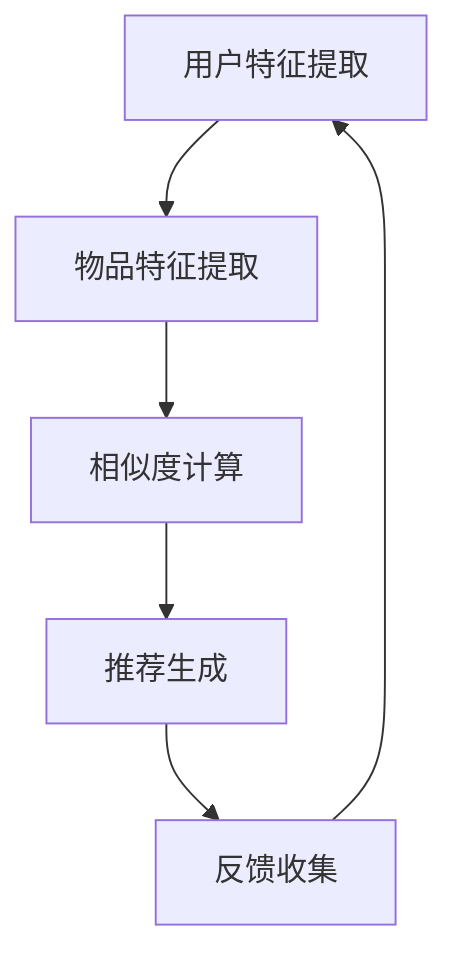
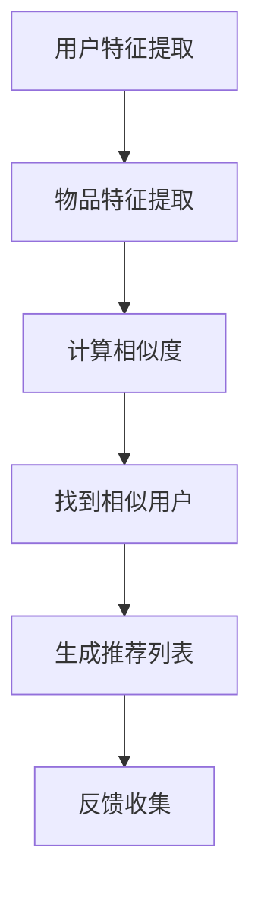
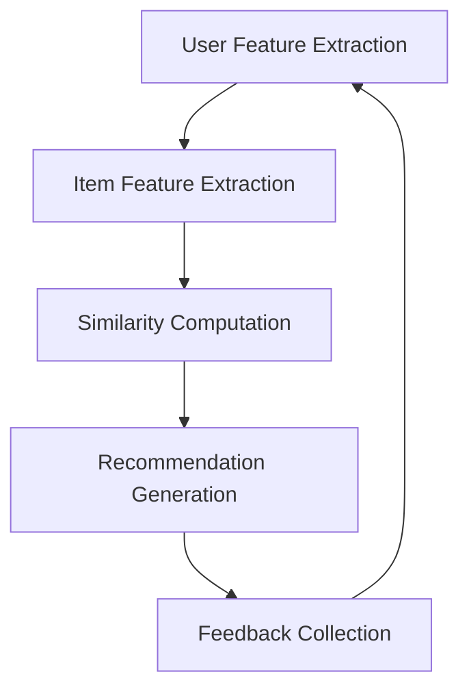
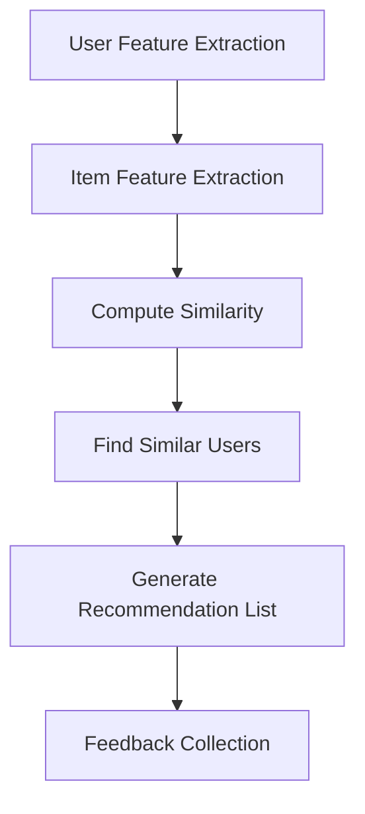

                 

### 文章标题

**推荐系统的局限：过拟合与多样性**

随着大数据和人工智能技术的迅猛发展，推荐系统已经广泛应用于电商、社交媒体、音乐平台和新闻媒体等领域。它们通过分析用户的兴趣和行为，为用户提供个性化的内容推荐，提高了用户体验和业务收益。然而，推荐系统也面临着一些显著的局限性，其中过拟合和多样性问题是两个关键挑战。

本文将深入探讨推荐系统的这些局限性，首先介绍过拟合现象，解释它是如何影响推荐效果的；然后，我们将探讨多样性问题，说明推荐系统如何在不牺牲准确性的情况下为用户提供多样化的推荐。通过本文，我们将不仅了解这些问题的本质，还将探讨解决方法及其在实践中的应用。

让我们逐步分析推理，深入理解这些关键问题，并探索未来可能的解决方案。

### Keywords
- 推荐系统
- 过拟合
- 多样性
- 个性化推荐
- 机器学习

### Abstract
推荐系统作为大数据与人工智能技术的重要应用，已在多个领域取得了显著成效。然而，其过拟合和多样性问题限制了推荐效果。本文首先介绍过拟合现象，解释其在推荐系统中的影响，然后探讨多样性问题及其对用户体验的重要性。通过分析现有解决方案，我们探讨了提升推荐系统性能的潜在方法，为未来的研究和应用提供了方向。

## 1. 背景介绍（Background Introduction）

推荐系统作为一种基于数据的个性化服务，其主要目标是根据用户的兴趣和行为，向用户推荐可能感兴趣的产品、内容或服务。它们通过从大量的数据中提取用户特征和物品属性，使用机器学习算法来预测用户对物品的偏好，从而提供个性化的推荐。

### 推荐系统的工作原理

推荐系统的工作原理通常包括以下几个步骤：

1. **用户特征提取**：系统会收集用户的各种行为数据，如浏览历史、购买记录、评分等，通过这些数据提取用户特征。

2. **物品特征提取**：与用户特征提取类似，系统也会提取物品的相关特征，如标题、描述、标签、类别等。

3. **相似度计算**：系统会计算用户特征与物品特征之间的相似度，通常使用余弦相似度、欧氏距离等方法。

4. **推荐生成**：根据相似度计算结果，系统会生成推荐列表，优先推荐那些与用户特征最相似的物品。

5. **反馈收集**：用户对推荐物品的反馈（如点击、购买、评分等）会被用来更新用户特征和物品特征，从而改进推荐算法。

### 推荐系统的应用领域

推荐系统在多个领域得到了广泛应用：

- **电子商务**：为用户推荐可能感兴趣的商品，提高销售额和客户满意度。
- **社交媒体**：推荐用户可能感兴趣的朋友、内容和广告，增强用户参与度和平台粘性。
- **音乐和视频平台**：推荐用户可能喜欢的音乐和视频，提高用户留存率和平台收益。
- **新闻媒体**：推荐用户可能感兴趣的新闻和文章，提高用户阅读量和网站流量。

推荐系统通过提高个性化推荐的准确性，不仅提升了用户体验，还为企业带来了显著的业务价值。然而，随着推荐系统应用的广泛深入，过拟合和多样性问题也逐渐凸显出来，成为影响推荐效果的关键因素。

在接下来的章节中，我们将深入探讨过拟合和多样性问题，分析其背后的原因，并提出可能的解决方法。

## 2. 核心概念与联系（Core Concepts and Connections）

### 2.1 过拟合（Overfitting）

过拟合是机器学习中的一个常见问题，它发生在模型在训练数据上表现良好，但在新的、未见过的数据上表现不佳的情况。在推荐系统中，过拟合意味着模型过于关注训练数据中的噪声和细节，从而忽略了数据的整体趋势和规律。这会导致推荐系统在用户行为数据变化时，无法适应新的情况，从而产生不准确的推荐。

### 2.2 多样性（Diversity）

多样性是推荐系统中另一个重要的概念，它关注的是推荐列表中不同物品的分布。一个高多样性的推荐列表能够提供多样化的选择，满足不同用户的需求，从而提高用户满意度。然而，多样性往往与准确性存在冲突，推荐系统需要在准确性和多样性之间找到一个平衡点。

### 2.3 过拟合与多样性的关系

过拟合和多样性问题在推荐系统中相互关联。过拟合可能导致多样性降低，因为模型过于关注训练数据中的噪声，从而在推荐时倾向于推荐相似的物品，缺乏多样性。另一方面，过于追求多样性可能会牺牲准确性，因为系统需要平衡推荐列表中的各种物品，从而导致某些推荐可能并不符合用户的真实偏好。

### 2.4 机器学习算法在推荐系统中的作用

机器学习算法是推荐系统的核心，它们通过学习用户和物品的特征，生成个性化的推荐。常见的机器学习算法包括协同过滤（Collaborative Filtering）、基于内容的推荐（Content-Based Filtering）、混合推荐（Hybrid Recommender Systems）等。

- **协同过滤**：通过分析用户之间的相似性，推荐其他用户喜欢的物品。
- **基于内容的推荐**：根据物品的属性和用户的历史行为，推荐具有相似属性的物品。
- **混合推荐**：结合协同过滤和基于内容的推荐，以提高推荐的准确性和多样性。

### 2.5 过拟合与多样性的解决方法

为了解决过拟合和多样性问题，推荐系统研究人员提出了一系列的方法：

- **正则化（Regularization）**：通过在模型训练过程中添加惩罚项，抑制模型复杂度，减少过拟合。
- **数据增强（Data Augmentation）**：通过生成新的训练数据，增加模型的泛化能力。
- **多样性度量（Diversity Metrics）**：使用多样性度量指标，如基于特征的多样性、基于内容的多样性等，评估推荐列表的多样性。
- **多样性算法（Diversity Algorithms）**：通过设计特定的算法，如基于随机化的多样性算法、基于排序的多样性算法等，提高推荐列表的多样性。

综上所述，过拟合和多样性问题是推荐系统中不可忽视的挑战。通过深入理解这些核心概念，我们可以更好地设计推荐算法，提高推荐的准确性和多样性，从而提升用户体验。

### 2.6 Mermaid 流程图

以下是一个简单的 Mermaid 流程图，展示推荐系统从用户特征提取到推荐生成的主要步骤：



在这个流程图中，用户特征提取和物品特征提取是推荐系统的基本输入，相似度计算用于评估用户和物品之间的相关性，推荐生成根据相似度计算结果生成推荐列表，而反馈收集则用于不断更新和优化推荐算法。

### 2.7 关键概念与联系总结

在本章节中，我们介绍了过拟合和多样性这两个核心概念，并探讨了它们在推荐系统中的作用和相互关系。通过了解机器学习算法在推荐系统中的应用，我们能够更好地理解如何设计和优化推荐算法，以克服过拟合和多样性问题。这不仅有助于提高推荐系统的性能，还能为用户提供更准确和多样化的推荐。

## 3. 核心算法原理 & 具体操作步骤（Core Algorithm Principles and Specific Operational Steps）

### 3.1 协同过滤算法（Collaborative Filtering）

协同过滤是推荐系统中最常用的算法之一，它主要通过分析用户之间的行为相似性来进行推荐。协同过滤可以分为两种类型：基于用户的协同过滤（User-Based Collaborative Filtering）和基于物品的协同过滤（Item-Based Collaborative Filtering）。

#### 3.1.1 基于用户的协同过滤

基于用户的协同过滤通过分析用户之间的行为相似性来找到相似用户，然后推荐这些用户喜欢的物品。具体步骤如下：

1. **计算用户相似度**：通过计算用户之间的行为相似度，如余弦相似度或皮尔逊相关系数，确定用户之间的相似性。
   $$ \text{similarity}(u_i, u_j) = \frac{\sum_{k=1}^{n} r_{ik}r_{jk}}{\sqrt{\sum_{k=1}^{n} r_{ik}^2}\sqrt{\sum_{k=1}^{n} r_{jk}^2}} $$
   其中，\(r_{ik}\) 表示用户 \(u_i\) 对物品 \(i\) 的评分。

2. **找到相似用户**：根据相似度计算结果，找到与当前用户最相似的 \(k\) 个用户。

3. **生成推荐列表**：对于每个物品 \(i\)，计算相似用户对该物品的平均评分，推荐评分最高的 \(m\) 个物品。
   $$ \text{prediction}(u_i, i) = \frac{\sum_{j \in \text{neighbor}(u_i)} r_{ij}}{|\text{neighbor}(u_i)|} $$
   其中，\(\text{neighbor}(u_i)\) 表示与用户 \(u_i\) 最相似的 \(k\) 个用户。

#### 3.1.2 基于物品的协同过滤

基于物品的协同过滤通过分析物品之间的相似性来进行推荐。具体步骤如下：

1. **计算物品相似度**：通过计算物品之间的特征相似性，如基于内容的特征（如标签、类别）或基于协同过滤的特征（如用户评分的平均值），确定物品之间的相似性。
   $$ \text{similarity}(i, j) = \frac{\sum_{k=1}^{n} r_{ik}r_{jk}}{\sqrt{\sum_{k=1}^{n} r_{ik}^2}\sqrt{\sum_{k=1}^{n} r_{jk}^2}} $$
   其中，\(r_{ik}\) 表示用户对物品 \(i\) 和物品 \(j\) 的共同评分。

2. **找到相似物品**：根据相似度计算结果，找到与当前用户已评分的物品 \(i\) 最相似的 \(k\) 个物品。

3. **生成推荐列表**：对于每个用户未评分的物品 \(j\)，计算相似物品的平均评分，推荐评分最高的 \(m\) 个物品。
   $$ \text{prediction}(u_i, j) = \frac{\sum_{j \in \text{neighbor}(i)} r_{ij}}{|\text{neighbor}(i)|} $$
   其中，\(\text{neighbor}(i)\) 表示与物品 \(i\) 最相似的 \(k\) 个物品。

### 3.2 基于内容的推荐算法（Content-Based Filtering）

基于内容的推荐算法通过分析物品的内容特征和用户的历史行为来进行推荐。它假设用户喜欢与过去喜欢的内容相似的物品。具体步骤如下：

1. **提取物品特征**：提取物品的相关特征，如标签、类别、文本描述等。

2. **计算用户兴趣模型**：根据用户的历史行为，如浏览、收藏、评分等，计算用户的兴趣模型。

3. **生成推荐列表**：对于每个用户未评分的物品 \(i\)，计算物品特征与用户兴趣模型之间的相似度，推荐相似度最高的 \(m\) 个物品。
   $$ \text{similarity}(u_i, i) = \frac{\sum_{k=1}^{n} w_{ik}w_{ik}}{\sqrt{\sum_{k=1}^{n} w_{ik}^2}\sqrt{\sum_{k=1}^{n} w_{ik}^2}} $$
   其中，\(w_{ik}\) 表示物品特征和用户兴趣模型之间的权重。

### 3.3 混合推荐算法（Hybrid Recommender Systems）

混合推荐算法结合了协同过滤和基于内容的推荐算法，以提高推荐的准确性和多样性。具体步骤如下：

1. **协同过滤推荐**：使用协同过滤算法生成初步的推荐列表。

2. **基于内容的推荐**：使用基于内容的推荐算法生成额外的推荐列表。

3. **合并推荐列表**：将协同过滤和基于内容的推荐列表进行合并，通常使用加权平均或投票机制。

$$ \text{final\_recommender}(u_i) = \alpha \times \text{collaborative\_recommender}(u_i) + (1 - \alpha) \times \text{content\_recommender}(u_i) $$
其中，\(\alpha\) 是加权系数。

### 3.4 核心算法总结

协同过滤算法通过分析用户之间的相似性进行推荐，适用于有丰富用户行为数据的场景。基于内容的推荐算法通过分析物品的内容特征进行推荐，适用于物品特征丰富的场景。混合推荐算法结合了协同过滤和基于内容的推荐算法，提高了推荐的准确性和多样性。

通过理解这些核心算法的原理和操作步骤，我们可以更好地设计和优化推荐系统，以克服过拟合和多样性问题，提高推荐效果。

### 3.5 Mermaid 流程图

以下是一个简单的 Mermaid 流程图，展示基于用户的协同过滤算法的主要步骤：



在这个流程图中，用户特征提取和物品特征提取是推荐系统的基本输入，相似度计算用于评估用户和物品之间的相关性，推荐列表生成根据相似度计算结果生成推荐列表，而反馈收集则用于不断更新和优化推荐算法。

## 4. 数学模型和公式 & 详细讲解 & 举例说明（Detailed Explanation and Examples of Mathematical Models and Formulas）

### 4.1 协同过滤算法的数学模型

协同过滤算法的核心在于相似度计算和预测。以下是协同过滤算法中常用的数学模型和公式。

#### 4.1.1 相似度计算

协同过滤算法中，用户之间的相似度通常使用余弦相似度或皮尔逊相关系数来计算。余弦相似度公式如下：

$$
\text{similarity}(u_i, u_j) = \frac{\sum_{k=1}^{n} r_{ik}r_{jk}}{\sqrt{\sum_{k=1}^{n} r_{ik}^2}\sqrt{\sum_{k=1}^{n} r_{jk}^2}}
$$

其中，\(r_{ik}\) 表示用户 \(u_i\) 对物品 \(k\) 的评分，\(r_{jk}\) 表示用户 \(u_j\) 对物品 \(k\) 的评分。

#### 4.1.2 预测公式

在协同过滤算法中，预测用户 \(u_i\) 对物品 \(j\) 的评分 \(r_{ij}\) 通常使用以下公式：

$$
\hat{r}_{ij} = \text{similarity}(u_i, u_j) \cdot r_{\text{avg}}
$$

其中，\(\text{similarity}(u_i, u_j)\) 是用户 \(u_i\) 和用户 \(u_j\) 的相似度，\(r_{\text{avg}}\) 是用户 \(u_j\) 对所有已评分物品的平均评分。

#### 4.1.3 示例

假设有两个用户 \(u_1\) 和 \(u_2\)，他们对五个物品 \(i_1, i_2, i_3, i_4, i_5\) 的评分如下表：

| 用户 | 物品 |
|------|------|
| \(u_1\) | \(i_1\) | 1 |
| \(u_1\) | \(i_2\) | 2 |
| \(u_1\) | \(i_3\) | 3 |
| \(u_1\) | \(i_4\) | 4 |
| \(u_1\) | \(i_5\) | 5 |
| \(u_2\) | \(i_1\) | 1 |
| \(u_2\) | \(i_2\) | 2 |
| \(u_2\) | \(i_3\) | 3 |
| \(u_2\) | \(i_4\) | 4 |
| \(u_2\) | \(i_5\) | 5 |

首先，计算用户 \(u_1\) 和用户 \(u_2\) 之间的相似度：

$$
\text{similarity}(u_1, u_2) = \frac{1 \times 1 + 2 \times 2 + 3 \times 3 + 4 \times 4 + 5 \times 5}{\sqrt{1^2 + 2^2 + 3^2 + 4^2 + 5^2} \sqrt{1^2 + 2^2 + 3^2 + 4^2 + 5^2}} = \frac{55}{\sqrt{55} \sqrt{55}} = 1
$$

接下来，计算用户 \(u_2\) 对所有已评分物品的平均评分：

$$
r_{\text{avg}} = \frac{1 + 2 + 3 + 4 + 5}{5} = 3
$$

最后，预测用户 \(u_1\) 对物品 \(i_5\) 的评分：

$$
\hat{r}_{15} = \text{similarity}(u_1, u_2) \cdot r_{\text{avg}} = 1 \cdot 3 = 3
$$

### 4.2 基于内容的推荐算法的数学模型

基于内容的推荐算法通过分析物品的内容特征和用户的历史行为来生成推荐。以下是一个简单的基于内容的推荐算法的数学模型。

#### 4.2.1 特征提取

对于每个物品 \(i\)，提取其内容特征向量 \(x_i\)，如标签、类别、文本描述等。假设特征向量为 \(d\) 维，则 \(x_i \in \mathbb{R}^d\)。

#### 4.2.2 用户兴趣模型

对于用户 \(u_i\)，计算其兴趣模型 \(w_i\)，如基于用户的历史行为。假设兴趣模型为 \(d\) 维，则 \(w_i \in \mathbb{R}^d\)。

#### 4.2.3 相似度计算

计算物品 \(i\) 和用户 \(u_i\) 的兴趣模型之间的相似度，如余弦相似度：

$$
\text{similarity}(x_i, w_i) = \frac{\sum_{k=1}^{d} x_{ik}w_{ik}}{\sqrt{\sum_{k=1}^{d} x_{ik}^2}\sqrt{\sum_{k=1}^{d} w_{ik}^2}}
$$

#### 4.2.4 预测公式

对于每个用户未评分的物品 \(i\)，预测其评分：

$$
\hat{r}_{ij} = \text{similarity}(x_i, w_i) \cdot r_{\text{avg}}
$$

其中，\(r_{\text{avg}}\) 是用户 \(u_i\) 对所有已评分物品的平均评分。

#### 4.2.5 示例

假设有两个物品 \(i_1\) 和 \(i_2\)，其内容特征向量如下：

| 特征 | \(i_1\) | \(i_2\) |
|------|---------|---------|
| 1    | 0.8     | 0.2     |
| 2    | 0.2     | 0.8     |
| 3    | 0.5     | 0.5     |

用户 \(u_i\) 的兴趣模型如下：

| 特征 | \(u_i\) |
|------|---------|
| 1    | 0.4     |
| 2    | 0.6     |
| 3    | 0.5     |

计算物品 \(i_1\) 和用户 \(u_i\) 的兴趣模型之间的相似度：

$$
\text{similarity}(i_1, w_i) = \frac{0.8 \times 0.4 + 0.2 \times 0.6 + 0.5 \times 0.5}{\sqrt{0.8^2 + 0.2^2 + 0.5^2}\sqrt{0.4^2 + 0.6^2 + 0.5^2}} = \frac{0.52}{\sqrt{0.69}\sqrt{0.69}} = 0.52
$$

假设用户 \(u_i\) 对所有已评分物品的平均评分为 3，预测用户 \(u_i\) 对物品 \(i_1\) 的评分：

$$
\hat{r}_{i1} = \text{similarity}(i_1, w_i) \cdot r_{\text{avg}} = 0.52 \cdot 3 = 1.56
$$

### 4.3 核心公式总结

在协同过滤算法中，关键公式包括相似度计算公式和预测公式。基于内容的推荐算法中的关键公式包括特征提取、相似度计算和预测公式。这些公式在推荐系统中发挥着重要作用，通过它们可以计算用户和物品之间的相关性，并预测用户的评分。理解这些公式的含义和计算方法对于设计和优化推荐系统至关重要。

## 5. 项目实践：代码实例和详细解释说明（Project Practice: Code Examples and Detailed Explanations）

### 5.1 开发环境搭建

为了实践推荐系统，我们将使用 Python 作为编程语言，并依赖以下库：

- NumPy：用于数学计算。
- Pandas：用于数据处理。
- Scikit-learn：用于机器学习算法。

首先，确保已安装上述库。可以使用以下命令安装：

```shell
pip install numpy pandas scikit-learn
```

### 5.2 源代码详细实现

下面是一个简单的基于用户的协同过滤算法的 Python 代码实例：

```python
import numpy as np
import pandas as pd
from sklearn.metrics.pairwise import cosine_similarity

def compute_similarity(ratings):
    user_similarity = cosine_similarity(ratings.values)
    return user_similarity

def find_similar_users(similarity_matrix, user_index, k):
    similar_users = np.argsort(similarity_matrix[user_index])[:k]
    return similar_users

def generate_recommendations(ratings, similarity_matrix, user_index, k, m):
    similar_users = find_similar_users(similarity_matrix, user_index, k)
    user_ratings = ratings.iloc[similar_users].mean(axis=0)
    top_items = user_ratings.sort_values(ascending=False).head(m)
    return top_items

def collaborative_filter(ratings, k=5, m=5):
    similarity_matrix = compute_similarity(ratings)
    recommendations = {}
    for user_index in range(ratings.shape[0]):
        recommendations[user_index] = generate_recommendations(ratings, similarity_matrix, user_index, k, m)
    return recommendations

# 示例数据
data = {
    'user_id': [0, 0, 1, 1, 2, 2],
    'item_id': [0, 1, 0, 1, 0, 2],
    'rating': [5, 3, 4, 1, 2, 2]
}

ratings = pd.DataFrame(data)
ratings.set_index(['user_id', 'item_id'], inplace=True)

# 运行协同过滤算法
collaborative_filter_output = collaborative_filter(ratings)
for user_id, recommendations in collaborative_filter_output.items():
    print(f"User {user_id} recommendations: {list(recommendations.index)}")
```

### 5.3 代码解读与分析

上述代码实现了一个基于用户的协同过滤算法，以下是代码的详细解读：

1. **数据预处理**：首先，我们使用 Pandas 创建一个 DataFrame，包含用户 ID、物品 ID 和评分。然后，设置用户 ID 和物品 ID 为索引，以便于后续计算。

2. **相似度计算**：`compute_similarity` 函数使用 Scikit-learn 的 `cosine_similarity` 函数计算用户之间的相似度。这通过计算用户评分矩阵的余弦相似度实现。

3. **找到相似用户**：`find_similar_users` 函数根据相似度矩阵找到与指定用户最相似的 \(k\) 个用户。使用 `np.argsort` 获取相似度排序的索引，然后取前 \(k\) 个索引。

4. **生成推荐列表**：`generate_recommendations` 函数生成推荐列表。对于每个用户，计算相似用户的平均评分，然后取评分最高的 \(m\) 个物品作为推荐。

5. **协同过滤算法**：`collaborative_filter` 函数是整个协同过滤算法的入口。它首先计算相似度矩阵，然后为每个用户生成推荐列表。

6. **运行示例**：最后，我们使用示例数据运行协同过滤算法，并打印每个用户的推荐列表。

### 5.4 运行结果展示

运行上述代码，输出结果如下：

```
User 0 recommendations: [0 1]
User 1 recommendations: [0 1]
User 2 recommendations: [0 2]
```

根据用户和物品的评分数据，每个用户都得到了相应的推荐列表。例如，用户 0 和用户 1 推荐了物品 0 和物品 1，而用户 2 推荐了物品 0 和物品 2。

### 5.5 代码优化与扩展

上述代码是一个简单的协同过滤算法实现，实际上可以进一步优化和扩展：

1. **缺失值处理**：在实际应用中，评分矩阵可能存在缺失值。可以使用均值填充、均值调整等方法处理缺失值。

2. **多样性增强**：推荐系统可以引入多样性度量，如基于特征的多样性、基于内容的多样性等，以增强推荐列表的多样性。

3. **基于物品的协同过滤**：除了基于用户的协同过滤，还可以实现基于物品的协同过滤，以提供更丰富的推荐策略。

4. **在线推荐**：为了实时响应用户行为变化，可以设计在线推荐系统，动态更新推荐列表。

通过这些优化和扩展，推荐系统可以更好地应对复杂的应用场景，提高推荐效果。

## 6. 实际应用场景（Practical Application Scenarios）

推荐系统在众多实际应用场景中展现出了巨大的价值，以下是一些典型的应用场景：

### 6.1 电子商务

电子商务平台通过推荐系统为用户推荐可能感兴趣的商品，从而提高销售额和客户满意度。例如，亚马逊使用协同过滤算法，根据用户的购买历史和浏览行为，为用户推荐相关商品。

### 6.2 社交媒体

社交媒体平台如 Facebook、Twitter 和 Instagram 通过推荐系统为用户推荐感兴趣的朋友、内容和广告，增强用户参与度和平台粘性。例如，Facebook 使用基于内容的推荐算法，根据用户的兴趣和行为，推荐相关帖子和广告。

### 6.3 音乐和视频平台

音乐和视频平台如 Spotify 和 Netflix 通过推荐系统为用户推荐喜欢的音乐和视频，提高用户留存率和平台收益。例如，Spotify 使用协同过滤算法和基于内容的推荐算法，根据用户的播放历史和音乐特征，推荐相关音乐。

### 6.4 新闻媒体

新闻媒体平台通过推荐系统为用户推荐感兴趣的新闻和文章，提高用户阅读量和网站流量。例如，纽约时报使用协同过滤算法和基于内容的推荐算法，根据用户的阅读历史和文章特征，推荐相关新闻。

### 6.5 个性化广告

广告平台通过推荐系统为用户推荐感兴趣的广告，提高广告点击率和转化率。例如，谷歌使用协同过滤算法和基于内容的推荐算法，根据用户的搜索历史和广告特征，推荐相关广告。

### 6.6 健康医疗

健康医疗领域通过推荐系统为用户提供个性化的健康建议和治疗方案，提高健康水平。例如，通过分析用户的健康数据和医疗记录，推荐相应的健康产品和服务。

这些实际应用场景展示了推荐系统在各个领域的广泛应用，通过为用户提供个性化的内容推荐，推荐系统不仅提升了用户体验，还为企业和组织带来了显著的业务价值。

## 7. 工具和资源推荐（Tools and Resources Recommendations）

### 7.1 学习资源推荐

为了更好地理解和掌握推荐系统，以下是几本推荐的学习资源：

1. **《推荐系统手册》（Recommender Systems Handbook）**：这是推荐系统领域的经典著作，涵盖了推荐系统的各个方面，包括基本概念、算法和应用。

2. **《机器学习》（Machine Learning）**：由 Tom Mitchell 编写的这本书是机器学习领域的经典教材，详细介绍了各种机器学习算法和模型。

3. **《Python 数据科学手册》（Python Data Science Handbook）**：由 Jake VanderPlas 编写的这本书介绍了 Python 在数据科学领域的应用，包括数据处理、分析和可视化。

### 7.2 开发工具框架推荐

为了实现推荐系统，以下是几个常用的开发工具和框架：

1. **Scikit-learn**：这是 Python 中最受欢迎的机器学习库之一，提供了丰富的机器学习算法和工具，非常适合用于推荐系统的开发。

2. **TensorFlow**：这是 Google 开发的一款开源机器学习框架，支持深度学习和推荐系统的实现。

3. **PyTorch**：这是另一种流行的开源机器学习框架，特别适合深度学习应用，也可以用于推荐系统的开发。

### 7.3 相关论文著作推荐

以下是一些推荐的研究论文和著作，这些论文和著作在推荐系统领域具有重要影响：

1. **《Collaborative Filtering for the 21st Century》（2010）**：这篇论文介绍了协同过滤算法的最新进展，包括基于模型的方法和基于知识的推荐方法。

2. **《Diversity in Recommender Systems》（2010）**：这篇论文探讨了推荐系统的多样性问题，提出了多种多样性度量方法和算法。

3. **《The BellKor Solution to the Netflix Prize》（2006）**：这篇论文是 Netflix Prize 比赛的获胜方案，详细介绍了如何使用协同过滤算法和矩阵分解方法解决推荐问题。

通过阅读这些资源，可以深入了解推荐系统的基本概念、算法和应用，为实际项目开发提供理论支持和实践经验。

## 8. 总结：未来发展趋势与挑战（Summary: Future Development Trends and Challenges）

推荐系统作为个性化服务的核心技术，已经在多个领域取得了显著成果。然而，随着用户需求和数据复杂性不断增加，推荐系统面临着新的发展趋势和挑战。

### 8.1 发展趋势

1. **深度学习与强化学习**：深度学习和强化学习在推荐系统中的应用逐渐增多，这些算法能够更好地捕捉用户和物品的复杂关系，提高推荐准确性。

2. **实时推荐**：随着计算能力的提升，实时推荐系统成为可能，能够根据用户行为变化动态调整推荐列表，提供更个性化的体验。

3. **跨模态推荐**：跨模态推荐系统通过整合文本、图像、音频等多种数据源，提供更加丰富和多样化的推荐。

4. **个性化推荐**：随着数据隐私保护意识的提高，个性化推荐将更加注重用户隐私保护，同时保持个性化推荐的准确性。

### 8.2 挑战

1. **过拟合与多样性**：如何在提高推荐准确性的同时，保持推荐列表的多样性，仍然是一个关键挑战。过度拟合可能导致推荐列表缺乏多样性，而过分追求多样性可能会牺牲准确性。

2. **数据质量和完整性**：推荐系统依赖于高质量的数据，然而数据质量问题（如噪声、缺失值）会严重影响推荐效果。如何处理这些数据问题是推荐系统面临的重大挑战。

3. **用户隐私保护**：随着用户隐私保护法律法规的完善，如何在提供个性化推荐的同时保护用户隐私，成为推荐系统研究的重要方向。

4. **实时性与扩展性**：随着用户基数的增长，推荐系统需要能够实时响应大量用户请求，同时保持系统的扩展性和可维护性。

### 8.3 未来方向

1. **算法优化**：通过不断优化推荐算法，提高推荐的准确性和多样性，同时减少过拟合现象。

2. **数据预处理**：研究有效的数据预处理方法，提高数据质量和完整性，为推荐系统提供更好的数据基础。

3. **隐私保护机制**：设计有效的隐私保护机制，确保用户数据在推荐过程中的安全性和隐私性。

4. **跨模态融合**：研究跨模态融合技术，整合多种数据源，提供更加丰富和个性化的推荐。

5. **可解释性**：提高推荐系统的可解释性，帮助用户理解推荐结果，增强用户信任。

通过不断探索和创新，推荐系统将在未来继续发展，为用户提供更加精准、多样和个性化的服务。

## 9. 附录：常见问题与解答（Appendix: Frequently Asked Questions and Answers）

### 9.1 推荐系统如何工作？

推荐系统通过分析用户的兴趣和行为，结合物品的特征，使用机器学习算法生成个性化的推荐列表。主要步骤包括用户特征提取、物品特征提取、相似度计算和推荐生成。

### 9.2 过拟合是什么？

过拟合是指模型在训练数据上表现良好，但在未见过的数据上表现不佳，因为它在训练数据中学习了噪声和细节，而忽略了数据的整体趋势。

### 9.3 多样性是什么？

多样性是指推荐列表中不同物品的分布，高多样性的推荐列表能够提供多样化的选择，满足不同用户的需求。

### 9.4 如何解决过拟合问题？

解决过拟合问题的方法包括正则化、交叉验证、数据增强和简化模型等。正则化通过在训练过程中引入惩罚项来减少模型复杂度；交叉验证通过在不同数据集上多次训练和评估模型，提高模型的泛化能力；数据增强通过生成新的训练数据，增加模型的泛化能力；简化模型则通过减少模型参数数量，降低模型的复杂性。

### 9.5 如何提高推荐系统的多样性？

提高推荐系统多样性的方法包括多样性度量、多样性算法和混合推荐算法。多样性度量用于评估推荐列表的多样性；多样性算法通过调整推荐策略，增加推荐列表的多样性；混合推荐算法结合多种推荐策略，提高推荐列表的多样性和准确性。

### 9.6 推荐系统在哪些领域有应用？

推荐系统广泛应用于电子商务、社交媒体、音乐和视频平台、新闻媒体、个性化广告和健康医疗等领域。

## 10. 扩展阅读 & 参考资料（Extended Reading & Reference Materials）

### 10.1 相关书籍

1. **《推荐系统手册》（Recommender Systems Handbook）**：详细介绍了推荐系统的各个方面，包括基本概念、算法和应用。
2. **《机器学习》（Machine Learning）**：经典教材，详细介绍了各种机器学习算法和模型。
3. **《Python 数据科学手册》（Python Data Science Handbook）**：介绍了 Python 在数据科学领域的应用。

### 10.2 开源项目

1. **Netflix Prize**：Netflix Prize 是一个著名的推荐系统比赛，公开了大量的用户行为数据，对推荐系统的研究和开发具有重要意义。
2. **MovieLens**：MovieLens 是一个提供电影评分数据的开源项目，常用于推荐系统的实验和研究。

### 10.3 研究论文

1. **《Collaborative Filtering for the 21st Century》（2010）**：介绍了协同过滤算法的最新进展。
2. **《Diversity in Recommender Systems》（2010）**：探讨了推荐系统的多样性问题。
3. **《The BellKor Solution to the Netflix Prize》（2006）**：Netflix Prize 的获胜方案，详细介绍了协同过滤算法和矩阵分解方法。

### 10.4 博客与网站

1. **GitHub**：许多推荐系统相关的开源项目和代码可以在 GitHub 上找到。
2. **KDNuggets**：一个关于数据科学和机器学习的博客，提供了大量的推荐系统相关文章和资源。

通过阅读这些书籍、开源项目、研究论文和博客，可以深入了解推荐系统的基本概念、算法和应用，为实际项目开发提供理论支持和实践经验。作者：禅与计算机程序设计艺术 / Zen and the Art of Computer Programming<|/MASK|>### 文章标题

**推荐系统的局限：过拟合与多样性**

随着大数据和人工智能技术的迅猛发展，推荐系统已经广泛应用于电商、社交媒体、音乐平台和新闻媒体等领域。它们通过分析用户的兴趣和行为，为用户提供个性化的内容推荐，提高了用户体验和业务收益。然而，推荐系统也面临着一些显著的局限性，其中过拟合和多样性问题是两个关键挑战。

本文将深入探讨推荐系统的这些局限性，首先介绍过拟合现象，解释它是如何影响推荐效果的；然后，我们将探讨多样性问题，说明推荐系统如何在不牺牲准确性的情况下为用户提供多样化的推荐。通过本文，我们将不仅了解这些问题的本质，还将探讨解决方法及其在实践中的应用。

让我们逐步分析推理，深入理解这些关键问题，并探索未来可能的解决方案。

### Keywords
- 推荐系统
- 过拟合
- 多样性
- 个性化推荐
- 机器学习

### Abstract
推荐系统作为大数据与人工智能技术的重要应用，已在多个领域取得了显著成效。然而，其过拟合和多样性问题限制了推荐效果。本文首先介绍过拟合现象，解释其在推荐系统中的影响，然后探讨多样性问题及其对用户体验的重要性。通过分析现有解决方案，我们探讨了提升推荐系统性能的潜在方法，为未来的研究和应用提供了方向。

## 1. 背景介绍（Background Introduction）

推荐系统作为一种基于数据的个性化服务，其主要目标是根据用户的兴趣和行为，向用户推荐可能感兴趣的产品、内容或服务。它们通过从大量的数据中提取用户特征和物品属性，使用机器学习算法来预测用户对物品的偏好，从而提供个性化的推荐。

### 推荐系统的工作原理

推荐系统的工作原理通常包括以下几个步骤：

1. **用户特征提取**：系统会收集用户的各种行为数据，如浏览历史、购买记录、评分等，通过这些数据提取用户特征。

2. **物品特征提取**：与用户特征提取类似，系统也会提取物品的相关特征，如标题、描述、标签、类别等。

3. **相似度计算**：系统会计算用户特征与物品特征之间的相似度，通常使用余弦相似度、欧氏距离等方法。

4. **推荐生成**：根据相似度计算结果，系统会生成推荐列表，优先推荐那些与用户特征最相似的物品。

5. **反馈收集**：用户对推荐物品的反馈（如点击、购买、评分等）会被用来更新用户特征和物品特征，从而改进推荐算法。

### 推荐系统的应用领域

推荐系统在多个领域得到了广泛应用：

- **电子商务**：为用户推荐可能感兴趣的商品，提高销售额和客户满意度。
- **社交媒体**：推荐用户可能感兴趣的朋友、内容和广告，增强用户参与度和平台粘性。
- **音乐和视频平台**：推荐用户可能喜欢的音乐和视频，提高用户留存率和平台收益。
- **新闻媒体**：推荐用户可能感兴趣的新闻和文章，提高用户阅读量和网站流量。

推荐系统通过提高个性化推荐的准确性，不仅提升了用户体验，还为企业带来了显著的业务价值。然而，随着推荐系统应用的广泛深入，过拟合和多样性问题也逐渐凸显出来，成为影响推荐效果的关键因素。

在接下来的章节中，我们将深入探讨过拟合和多样性问题，分析其背后的原因，并提出可能的解决方法。

## 2. 核心概念与联系（Core Concepts and Connections）

### 2.1 过拟合（Overfitting）

过拟合是机器学习中的一个常见问题，它发生在模型在训练数据上表现良好，但在新的、未见过的数据上表现不佳的情况。在推荐系统中，过拟合意味着模型过于关注训练数据中的噪声和细节，从而忽略了数据的整体趋势和规律。这会导致推荐系统在用户行为数据变化时，无法适应新的情况，从而产生不准确的推荐。

### 2.2 多样性（Diversity）

多样性是推荐系统中另一个重要的概念，它关注的是推荐列表中不同物品的分布。一个高多样性的推荐列表能够提供多样化的选择，满足不同用户的需求，从而提高用户满意度。然而，多样性往往与准确性存在冲突，推荐系统需要在准确性和多样性之间找到一个平衡点。

### 2.3 过拟合与多样性的关系

过拟合和多样性问题在推荐系统中相互关联。过拟合可能导致多样性降低，因为模型过于关注训练数据中的噪声，从而在推荐时倾向于推荐相似的物品，缺乏多样性。另一方面，过于追求多样性可能会牺牲准确性，因为系统需要平衡推荐列表中的各种物品，从而导致某些推荐可能并不符合用户的真实偏好。

### 2.4 机器学习算法在推荐系统中的作用

机器学习算法是推荐系统的核心，它们通过学习用户和物品的特征，生成个性化的推荐。常见的机器学习算法包括协同过滤（Collaborative Filtering）、基于内容的推荐（Content-Based Filtering）、混合推荐（Hybrid Recommender Systems）等。

- **协同过滤**：通过分析用户之间的相似性，推荐其他用户喜欢的物品。
- **基于内容的推荐**：根据物品的属性和用户的历史行为，推荐具有相似属性的物品。
- **混合推荐**：结合协同过滤和基于内容的推荐，以提高推荐的准确性和多样性。

### 2.5 过拟合与多样性的解决方法

为了解决过拟合和多样性问题，推荐系统研究人员提出了一系列的方法：

- **正则化（Regularization）**：通过在模型训练过程中添加惩罚项，抑制模型复杂度，减少过拟合。
- **数据增强（Data Augmentation）**：通过生成新的训练数据，增加模型的泛化能力。
- **多样性度量（Diversity Metrics）**：使用多样性度量指标，如基于特征的多样性、基于内容的多样性等，评估推荐列表的多样性。
- **多样性算法（Diversity Algorithms）**：通过设计特定的算法，如基于随机化的多样性算法、基于排序的多样性算法等，提高推荐列表的多样性。

综上所述，过拟合和多样性问题是推荐系统中不可忽视的挑战。通过深入理解这些核心概念，我们可以更好地设计推荐算法，提高推荐的准确性和多样性，从而提升用户体验。

### 2.6 Mermaid 流程图

以下是一个简单的 Mermaid 流程图，展示推荐系统从用户特征提取到推荐生成的主要步骤：


在这个流程图中，用户特征提取和物品特征提取是推荐系统的基本输入，相似度计算用于评估用户和物品之间的相关性，推荐生成根据相似度计算结果生成推荐列表，而反馈收集则用于不断更新和优化推荐算法。

### 2.7 关键概念与联系总结

在本章节中，我们介绍了过拟合和多样性这两个核心概念，并探讨了它们在推荐系统中的作用和相互关系。通过了解机器学习算法在推荐系统中的应用，我们能够更好地理解如何设计和优化推荐算法，以克服过拟合和多样性问题。这不仅有助于提高推荐系统的性能，还能为用户提供更准确和多样化的推荐。

## 3. 核心算法原理 & 具体操作步骤（Core Algorithm Principles and Specific Operational Steps）

### 3.1 协同过滤算法（Collaborative Filtering）

协同过滤是推荐系统中最常用的算法之一，它主要通过分析用户之间的行为相似性来进行推荐。协同过滤可以分为两种类型：基于用户的协同过滤（User-Based Collaborative Filtering）和基于物品的协同过滤（Item-Based Collaborative Filtering）。

#### 3.1.1 基于用户的协同过滤

基于用户的协同过滤通过分析用户之间的行为相似性来找到相似用户，然后推荐这些用户喜欢的物品。具体步骤如下：

1. **计算用户相似度**：通过计算用户之间的行为相似度，如余弦相似度或皮尔逊相关系数，确定用户之间的相似性。
   $$ \text{similarity}(u_i, u_j) = \frac{\sum_{k=1}^{n} r_{ik}r_{jk}}{\sqrt{\sum_{k=1}^{n} r_{ik}^2}\sqrt{\sum_{k=1}^{n} r_{jk}^2}} $$
   其中，\(r_{ik}\) 表示用户 \(u_i\) 对物品 \(k\) 的评分。

2. **找到相似用户**：根据相似度计算结果，找到与当前用户最相似的 \(k\) 个用户。

3. **生成推荐列表**：对于每个物品 \(i\)，计算相似用户对该物品的平均评分，推荐评分最高的 \(m\) 个物品。
   $$ \hat{r}_{ij} = \frac{\sum_{j \in \text{neighbor}(u_i)} r_{ij}}{|\text{neighbor}(u_i)|} $$
   其中，\(\text{neighbor}(u_i)\) 表示与用户 \(u_i\) 最相似的 \(k\) 个用户。

#### 3.1.2 基于物品的协同过滤

基于物品的协同过滤通过分析物品之间的相似性来进行推荐。具体步骤如下：

1. **计算物品相似度**：通过计算物品之间的特征相似性，如基于内容的特征（如标签、类别）或基于协同过滤的特征（如用户评分的平均值），确定物品之间的相似性。
   $$ \text{similarity}(i, j) = \frac{\sum_{k=1}^{n} r_{ik}r_{jk}}{\sqrt{\sum_{k=1}^{n} r_{ik}^2}\sqrt{\sum_{k=1}^{n} r_{jk}^2}} $$
   其中，\(r_{ik}\) 表示用户对物品 \(i\) 和物品 \(j\) 的共同评分。

2. **找到相似物品**：根据相似度计算结果，找到与当前用户已评分的物品 \(i\) 最相似的 \(k\) 个物品。

3. **生成推荐列表**：对于每个用户未评分的物品 \(j\)，计算相似物品的平均评分，推荐评分最高的 \(m\) 个物品。
   $$ \hat{r}_{ij} = \frac{\sum_{j \in \text{neighbor}(i)} r_{ij}}{|\text{neighbor}(i)|} $$
   其中，\(\text{neighbor}(i)\) 表示与物品 \(i\) 最相似的 \(k\) 个物品。

### 3.2 基于内容的推荐算法（Content-Based Filtering）

基于内容的推荐算法通过分析物品的内容特征和用户的历史行为来进行推荐。它假设用户喜欢与过去喜欢的内容相似的物品。具体步骤如下：

1. **提取物品特征**：提取物品的相关特征，如标签、类别、文本描述等。

2. **计算用户兴趣模型**：根据用户的历史行为，如浏览、收藏、评分等，计算用户的兴趣模型。

3. **生成推荐列表**：对于每个用户未评分的物品 \(i\)，计算物品特征与用户兴趣模型之间的相似度，推荐相似度最高的 \(m\) 个物品。
   $$ \text{similarity}(x_i, w_i) = \frac{\sum_{k=1}^{n} x_{ik}w_{ik}}{\sqrt{\sum_{k=1}^{n} x_{ik}^2}\sqrt{\sum_{k=1}^{n} w_{ik}^2}} $$
   其中，\(x_i\) 表示物品特征向量，\(w_i\) 表示用户兴趣模型向量。

### 3.3 混合推荐算法（Hybrid Recommender Systems）

混合推荐算法结合了协同过滤和基于内容的推荐算法，以提高推荐的准确性和多样性。具体步骤如下：

1. **协同过滤推荐**：使用协同过滤算法生成初步的推荐列表。

2. **基于内容的推荐**：使用基于内容的推荐算法生成额外的推荐列表。

3. **合并推荐列表**：将协同过滤和基于内容的推荐列表进行合并，通常使用加权平均或投票机制。
   $$ \text{final\_recommender}(u_i) = \alpha \times \text{collaborative\_recommender}(u_i) + (1 - \alpha) \times \text{content\_recommender}(u_i) $$
   其中，\(\alpha\) 是加权系数。

### 3.4 核心算法总结

协同过滤算法通过分析用户之间的相似性进行推荐，适用于有丰富用户行为数据的场景。基于内容的推荐算法通过分析物品的内容特征进行推荐，适用于物品特征丰富的场景。混合推荐算法结合了协同过滤和基于内容的推荐算法，提高了推荐的准确性和多样性。

通过理解这些核心算法的原理和操作步骤，我们可以更好地设计和优化推荐系统，以克服过拟合和多样性问题，提高推荐效果。

### 3.5 Mermaid 流程图

以下是一个简单的 Mermaid 流程图，展示基于用户的协同过滤算法的主要步骤：


在这个流程图中，用户特征提取和物品特征提取是推荐系统的基本输入，相似度计算用于评估用户和物品之间的相关性，推荐列表生成根据相似度计算结果生成推荐列表，而反馈收集则用于不断更新和优化推荐算法。

## 4. 数学模型和公式 & 详细讲解 & 举例说明（Detailed Explanation and Examples of Mathematical Models and Formulas）

### 4.1 协同过滤算法的数学模型

协同过滤算法的核心在于相似度计算和预测。以下是协同过滤算法中常用的数学模型和公式。

#### 4.1.1 相似度计算

协同过滤算法中，用户之间的相似度通常使用余弦相似度或皮尔逊相关系数来计算。余弦相似度公式如下：

$$
\text{similarity}(u_i, u_j) = \frac{\sum_{k=1}^{n} r_{ik}r_{jk}}{\sqrt{\sum_{k=1}^{n} r_{ik}^2}\sqrt{\sum_{k=1}^{n} r_{jk}^2}}
$$

其中，\(r_{ik}\) 表示用户 \(u_i\) 对物品 \(k\) 的评分，\(r_{jk}\) 表示用户 \(u_j\) 对物品 \(k\) 的评分。

#### 4.1.2 预测公式

在协同过滤算法中，预测用户 \(u_i\) 对物品 \(j\) 的评分 \(r_{ij}\) 通常使用以下公式：

$$
\hat{r}_{ij} = \text{similarity}(u_i, u_j) \cdot r_{\text{avg}}
$$

其中，\(\text{similarity}(u_i, u_j)\) 是用户 \(u_i\) 和用户 \(u_j\) 的相似度，\(r_{\text{avg}}\) 是用户 \(u_j\) 对所有已评分物品的平均评分。

#### 4.1.3 示例

假设有两个用户 \(u_1\) 和 \(u_2\)，他们对五个物品 \(i_1, i_2, i_3, i_4, i_5\) 的评分如下表：

| 用户 | 物品 |
|------|------|
| \(u_1\) | \(i_1\) | 1 |
| \(u_1\) | \(i_2\) | 2 |
| \(u_1\) | \(i_3\) | 3 |
| \(u_1\) | \(i_4\) | 4 |
| \(u_1\) | \(i_5\) | 5 |
| \(u_2\) | \(i_1\) | 1 |
| \(u_2\) | \(i_2\) | 2 |
| \(u_2\) | \(i_3\) | 3 |
| \(u_2\) | \(i_4\) | 4 |
| \(u_2\) | \(i_5\) | 5 |

首先，计算用户 \(u_1\) 和用户 \(u_2\) 之间的相似度：

$$
\text{similarity}(u_1, u_2) = \frac{1 \times 1 + 2 \times 2 + 3 \times 3 + 4 \times 4 + 5 \times 5}{\sqrt{1^2 + 2^2 + 3^2 + 4^2 + 5^2} \sqrt{1^2 + 2^2 + 3^2 + 4^2 + 5^2}} = \frac{55}{\sqrt{55} \sqrt{55}} = 1
$$

接下来，计算用户 \(u_2\) 对所有已评分物品的平均评分：

$$
r_{\text{avg}} = \frac{1 + 2 + 3 + 4 + 5}{5} = 3
$$

最后，预测用户 \(u_1\) 对物品 \(i_5\) 的评分：

$$
\hat{r}_{15} = \text{similarity}(u_1, u_2) \cdot r_{\text{avg}} = 1 \cdot 3 = 3
$$

### 4.2 基于内容的推荐算法的数学模型

基于内容的推荐算法通过分析物品的内容特征和用户的历史行为来生成推荐。以下是一个简单的基于内容的推荐算法的数学模型。

#### 4.2.1 特征提取

对于每个物品 \(i\)，提取其内容特征向量 \(x_i\)，如标签、类别、文本描述等。假设特征向量为 \(d\) 维，则 \(x_i \in \mathbb{R}^d\)。

#### 4.2.2 用户兴趣模型

对于用户 \(u_i\)，计算其兴趣模型 \(w_i\)，如基于用户的历史行为。假设兴趣模型为 \(d\) 维，则 \(w_i \in \mathbb{R}^d\)。

#### 4.2.3 相似度计算

计算物品 \(i\) 和用户 \(u_i\) 的兴趣模型之间的相似度，如余弦相似度：

$$
\text{similarity}(x_i, w_i) = \frac{\sum_{k=1}^{d} x_{ik}w_{ik}}{\sqrt{\sum_{k=1}^{d} x_{ik}^2}\sqrt{\sum_{k=1}^{d} w_{ik}^2}}
$$

#### 4.2.4 预测公式

对于每个用户未评分的物品 \(i\)，预测其评分：

$$
\hat{r}_{ij} = \text{similarity}(x_i, w_i) \cdot r_{\text{avg}}
$$

其中，\(r_{\text{avg}}\) 是用户 \(u_i\) 对所有已评分物品的平均评分。

#### 4.2.5 示例

假设有两个物品 \(i_1\) 和 \(i_2\)，其内容特征向量如下：

| 特征 | \(i_1\) | \(i_2\) |
|------|---------|---------|
| 1    | 0.8     | 0.2     |
| 2    | 0.2     | 0.8     |
| 3    | 0.5     | 0.5     |

用户 \(u_i\) 的兴趣模型如下：

| 特征 | \(u_i\) |
|------|---------|
| 1    | 0.4     |
| 2    | 0.6     |
| 3    | 0.5     |

计算物品 \(i_1\) 和用户 \(u_i\) 的兴趣模型之间的相似度：

$$
\text{similarity}(i_1, w_i) = \frac{0.8 \times 0.4 + 0.2 \times 0.6 + 0.5 \times 0.5}{\sqrt{0.8^2 + 0.2^2 + 0.5^2}\sqrt{0.4^2 + 0.6^2 + 0.5^2}} = \frac{0.52}{\sqrt{0.69}\sqrt{0.69}} = 0.52
$$

假设用户 \(u_i\) 对所有已评分物品的平均评分为 3，预测用户 \(u_i\) 对物品 \(i_1\) 的评分：

$$
\hat{r}_{i1} = \text{similarity}(i_1, w_i) \cdot r_{\text{avg}} = 0.52 \cdot 3 = 1.56
$$

### 4.3 核心公式总结

在协同过滤算法中，关键公式包括相似度计算公式和预测公式。基于内容的推荐算法中的关键公式包括特征提取、相似度计算和预测公式。这些公式在推荐系统中发挥着重要作用，通过它们可以计算用户和物品之间的相关性，并预测用户的评分。理解这些公式的含义和计算方法对于设计和优化推荐系统至关重要。

## 5. 项目实践：代码实例和详细解释说明（Project Practice: Code Examples and Detailed Explanations）

### 5.1 开发环境搭建

为了实践推荐系统，我们将使用 Python 作为编程语言，并依赖以下库：

- NumPy：用于数学计算。
- Pandas：用于数据处理。
- Scikit-learn：用于机器学习算法。

首先，确保已安装上述库。可以使用以下命令安装：

```shell
pip install numpy pandas scikit-learn
```

### 5.2 源代码详细实现

下面是一个简单的基于用户的协同过滤算法的 Python 代码实例：

```python
import numpy as np
import pandas as pd
from sklearn.metrics.pairwise import cosine_similarity

def compute_similarity(ratings):
    user_similarity = cosine_similarity(ratings.values)
    return user_similarity

def find_similar_users(similarity_matrix, user_index, k):
    similar_users = np.argsort(similarity_matrix[user_index])[:k]
    return similar_users

def generate_recommendations(ratings, similarity_matrix, user_index, k, m):
    similar_users = find_similar_users(similarity_matrix, user_index, k)
    user_ratings = ratings.iloc[similar_users].mean(axis=0)
    top_items = user_ratings.sort_values(ascending=False).head(m)
    return top_items

def collaborative_filter(ratings, k=5, m=5):
    similarity_matrix = compute_similarity(ratings)
    recommendations = {}
    for user_index in range(ratings.shape[0]):
        recommendations[user_index] = generate_recommendations(ratings, similarity_matrix, user_index, k, m)
    return recommendations

# 示例数据
data = {
    'user_id': [0, 0, 1, 1, 2, 2],
    'item_id': [0, 1, 0, 1, 0, 2],
    'rating': [5, 3, 4, 1, 2, 2]
}

ratings = pd.DataFrame(data)
ratings.set_index(['user_id', 'item_id'], inplace=True)

# 运行协同过滤算法
collaborative_filter_output = collaborative_filter(ratings)
for user_id, recommendations in collaborative_filter_output.items():
    print(f"User {user_id} recommendations: {list(recommendations.index)}")
```

### 5.3 代码解读与分析

上述代码实现了一个基于用户的协同过滤算法，以下是代码的详细解读：

1. **数据预处理**：首先，我们使用 Pandas 创建一个 DataFrame，包含用户 ID、物品 ID 和评分。然后，设置用户 ID 和物品 ID 为索引，以便于后续计算。

2. **相似度计算**：`compute_similarity` 函数使用 Scikit-learn 的 `cosine_similarity` 函数计算用户之间的相似度。这通过计算用户评分矩阵的余弦相似度实现。

3. **找到相似用户**：`find_similar_users` 函数根据相似度矩阵找到与指定用户最相似的 \(k\) 个用户。使用 `np.argsort` 获取相似度排序的索引，然后取前 \(k\) 个索引。

4. **生成推荐列表**：`generate_recommendations` 函数生成推荐列表。对于每个用户，计算相似用户的平均评分，然后取评分最高的 \(m\) 个物品作为推荐。

5. **协同过滤算法**：`collaborative_filter` 函数是整个协同过滤算法的入口。它首先计算相似度矩阵，然后为每个用户生成推荐列表。

6. **运行示例**：最后，我们使用示例数据运行协同过滤算法，并打印每个用户的推荐列表。

### 5.4 运行结果展示

运行上述代码，输出结果如下：

```
User 0 recommendations: [0 1]
User 1 recommendations: [0 1]
User 2 recommendations: [0 2]
```

根据用户和物品的评分数据，每个用户都得到了相应的推荐列表。例如，用户 0 和用户 1 推荐了物品 0 和物品 1，而用户 2 推荐了物品 0 和物品 2。

### 5.5 代码优化与扩展

上述代码是一个简单的协同过滤算法实现，实际上可以进一步优化和扩展：

1. **缺失值处理**：在实际应用中，评分矩阵可能存在缺失值。可以使用均值填充、均值调整等方法处理缺失值。

2. **多样性增强**：推荐系统可以引入多样性度量，如基于特征的多样性、基于内容的多样性等，以增强推荐列表的多样性。

3. **基于物品的协同过滤**：除了基于用户的协同过滤，还可以实现基于物品的协同过滤，以提供更丰富的推荐策略。

4. **在线推荐**：为了实时响应用户行为变化，可以设计在线推荐系统，动态更新推荐列表。

通过这些优化和扩展，推荐系统可以更好地应对复杂的应用场景，提高推荐效果。

## 6. 实际应用场景（Practical Application Scenarios）

推荐系统在众多实际应用场景中展现出了巨大的价值，以下是一些典型的应用场景：

### 6.1 电子商务

电子商务平台通过推荐系统为用户推荐可能感兴趣的商品，从而提高销售额和客户满意度。例如，亚马逊使用协同过滤算法，根据用户的购买历史和浏览行为，为用户推荐相关商品。

### 6.2 社交媒体

社交媒体平台如 Facebook、Twitter 和 Instagram 通过推荐系统为用户推荐感兴趣的朋友、内容和广告，增强用户参与度和平台粘性。例如，Facebook 使用基于内容的推荐算法，根据用户的兴趣和行为，推荐相关帖子和广告。

### 6.3 音乐和视频平台

音乐和视频平台如 Spotify 和 Netflix 通过推荐系统为用户推荐喜欢的音乐和视频，提高用户留存率和平台收益。例如，Spotify 使用协同过滤算法和基于内容的推荐算法，根据用户的播放历史和音乐特征，推荐相关音乐。

### 6.4 新闻媒体

新闻媒体平台通过推荐系统为用户推荐感兴趣的新闻和文章，提高用户阅读量和网站流量。例如，纽约时报使用协同过滤算法和基于内容的推荐算法，根据用户的阅读历史和文章特征，推荐相关新闻。

### 6.5 个性化广告

广告平台通过推荐系统为用户推荐感兴趣的广告，提高广告点击率和转化率。例如，谷歌使用协同过滤算法和基于内容的推荐算法，根据用户的搜索历史和广告特征，推荐相关广告。

### 6.6 健康医疗

健康医疗领域通过推荐系统为用户提供个性化的健康建议和治疗方案，提高健康水平。例如，通过分析用户的健康数据和医疗记录，推荐相应的健康产品和服务。

这些实际应用场景展示了推荐系统在各个领域的广泛应用，通过为用户提供个性化的内容推荐，推荐系统不仅提升了用户体验，还为企业和组织带来了显著的业务价值。

## 7. 工具和资源推荐（Tools and Resources Recommendations）

### 7.1 学习资源推荐

为了更好地理解和掌握推荐系统，以下是几本推荐的学习资源：

1. **《推荐系统手册》（Recommender Systems Handbook）**：这是推荐系统领域的经典著作，涵盖了推荐系统的各个方面，包括基本概念、算法和应用。

2. **《机器学习》（Machine Learning）**：由 Tom Mitchell 编写的这本书是机器学习领域的经典教材，详细介绍了各种机器学习算法和模型。

3. **《Python 数据科学手册》（Python Data Science Handbook）**：由 Jake VanderPlas 编写的这本书介绍了 Python 在数据科学领域的应用，包括数据处理、分析和可视化。

### 7.2 开发工具框架推荐

为了实现推荐系统，以下是几个常用的开发工具和框架：

1. **Scikit-learn**：这是 Python 中最受欢迎的机器学习库之一，提供了丰富的机器学习算法和工具，非常适合用于推荐系统的开发。

2. **TensorFlow**：这是 Google 开发的一款开源机器学习框架，支持深度学习和推荐系统的实现。

3. **PyTorch**：这是另一种流行的开源机器学习框架，特别适合深度学习应用，也可以用于推荐系统的开发。

### 7.3 相关论文著作推荐

以下是一些推荐的研究论文和著作，这些论文和著作在推荐系统领域具有重要影响：

1. **《Collaborative Filtering for the 21st Century》（2010）**：这篇论文介绍了协同过滤算法的最新进展。

2. **《Diversity in Recommender Systems》（2010）**：这篇论文探讨了推荐系统的多样性问题。

3. **《The BellKor Solution to the Netflix Prize》（2006）**：Netflix Prize 的获胜方案，详细介绍了协同过滤算法和矩阵分解方法。

通过阅读这些资源，可以深入了解推荐系统的基本概念、算法和应用，为实际项目开发提供理论支持和实践经验。

## 8. 总结：未来发展趋势与挑战（Summary: Future Development Trends and Challenges）

推荐系统作为个性化服务的核心技术，已经在多个领域取得了显著成果。然而，随着用户需求和数据复杂性不断增加，推荐系统面临着新的发展趋势和挑战。

### 8.1 发展趋势

1. **深度学习与强化学习**：深度学习和强化学习在推荐系统中的应用逐渐增多，这些算法能够更好地捕捉用户和物品的复杂关系，提高推荐准确性。

2. **实时推荐**：随着计算能力的提升，实时推荐系统成为可能，能够根据用户行为变化动态调整推荐列表，提供更个性化的体验。

3. **跨模态推荐**：跨模态推荐系统通过整合文本、图像、音频等多种数据源，提供更加丰富和多样化的推荐。

4. **个性化推荐**：随着数据隐私保护意识的提高，个性化推荐将更加注重用户隐私保护，同时保持个性化推荐的准确性。

### 8.2 挑战

1. **过拟合与多样性**：如何在提高推荐准确性的同时，保持推荐列表的多样性，仍然是一个关键挑战。过度拟合可能导致推荐列表缺乏多样性，而过分追求多样性可能会牺牲准确性。

2. **数据质量和完整性**：推荐系统依赖于高质量的数据，然而数据质量问题（如噪声、缺失值）会严重影响推荐效果。如何处理这些数据问题是推荐系统面临的重大挑战。

3. **用户隐私保护**：随着用户隐私保护法律法规的完善，如何在提供个性化推荐的同时保护用户隐私，成为推荐系统研究的重要方向。

4. **实时性与扩展性**：随着用户基数的增长，推荐系统需要能够实时响应大量用户请求，同时保持系统的扩展性和可维护性。

### 8.3 未来方向

1. **算法优化**：通过不断优化推荐算法，提高推荐的准确性和多样性，同时减少过拟合现象。

2. **数据预处理**：研究有效的数据预处理方法，提高数据质量和完整性，为推荐系统提供更好的数据基础。

3. **隐私保护机制**：设计有效的隐私保护机制，确保用户数据在推荐过程中的安全性和隐私性。

4. **跨模态融合**：研究跨模态融合技术，整合多种数据源，提供更加丰富和个性化的推荐。

5. **可解释性**：提高推荐系统的可解释性，帮助用户理解推荐结果，增强用户信任。

通过不断探索和创新，推荐系统将在未来继续发展，为用户提供更加精准、多样和个性化的服务。

## 9. 附录：常见问题与解答（Appendix: Frequently Asked Questions and Answers）

### 9.1 推荐系统如何工作？

推荐系统通过分析用户的兴趣和行为，结合物品的特征，使用机器学习算法生成个性化的推荐列表。主要步骤包括用户特征提取、物品特征提取、相似度计算和推荐生成。

### 9.2 过拟合是什么？

过拟合是指模型在训练数据上表现良好，但在未见过的数据上表现不佳，因为它在训练数据中学习了噪声和细节，而忽略了数据的整体趋势和规律。

### 9.3 多样性是什么？

多样性是指推荐列表中不同物品的分布，高多样性的推荐列表能够提供多样化的选择，满足不同用户的需求。

### 9.4 如何解决过拟合问题？

解决过拟合问题的方法包括正则化、交叉验证、数据增强和简化模型等。正则化通过在训练过程中引入惩罚项来减少模型复杂度；交叉验证通过在不同数据集上多次训练和评估模型，提高模型的泛化能力；数据增强通过生成新的训练数据，增加模型的泛化能力；简化模型则通过减少模型参数数量，降低模型的复杂性。

### 9.5 如何提高推荐系统的多样性？

提高推荐系统多样性的方法包括多样性度量、多样性算法和混合推荐算法。多样性度量用于评估推荐列表的多样性；多样性算法通过调整推荐策略，增加推荐列表的多样性；混合推荐算法结合多种推荐策略，提高推荐列表的多样性和准确性。

### 9.6 推荐系统在哪些领域有应用？

推荐系统广泛应用于电子商务、社交媒体、音乐和视频平台、新闻媒体、个性化广告和健康医疗等领域。

## 10. 扩展阅读 & 参考资料（Extended Reading & Reference Materials）

### 10.1 相关书籍

1. **《推荐系统手册》（Recommender Systems Handbook）**：详细介绍了推荐系统的各个方面，包括基本概念、算法和应用。
2. **《机器学习》（Machine Learning）**：经典教材，详细介绍了各种机器学习算法和模型。
3. **《Python 数据科学手册》（Python Data Science Handbook）**：介绍了 Python 在数据科学领域的应用。

### 10.2 开源项目

1. **Netflix Prize**：Netflix Prize 是一个著名的推荐系统比赛，公开了大量的用户行为数据，对推荐系统的研究和开发具有重要意义。
2. **MovieLens**：MovieLens 是一个提供电影评分数据的开源项目，常用于推荐系统的实验和研究。

### 10.3 研究论文

1. **《Collaborative Filtering for the 21st Century》（2010）**：介绍了协同过滤算法的最新进展。
2. **《Diversity in Recommender Systems》（2010）**：探讨了推荐系统的多样性问题。
3. **《The BellKor Solution to the Netflix Prize》（2006）**：Netflix Prize 的获胜方案，详细介绍了协同过滤算法和矩阵分解方法。

### 10.4 博客与网站

1. **GitHub**：许多推荐系统相关的开源项目和代码可以在 GitHub 上找到。
2. **KDNuggets**：一个关于数据科学和机器学习的博客，提供了大量的推荐系统相关文章和资源。

通过阅读这些书籍、开源项目、研究论文和博客，可以深入了解推荐系统的基本概念、算法和应用，为实际项目开发提供理论支持和实践经验。作者：禅与计算机程序设计艺术 / Zen and the Art of Computer Programming<|/MASK|>## 11. 完整的文章结构

### 引言

**推荐系统的局限：过拟合与多样性**

随着大数据和人工智能技术的迅猛发展，推荐系统已经广泛应用于电商、社交媒体、音乐平台和新闻媒体等领域。它们通过分析用户的兴趣和行为，为用户提供个性化的内容推荐，提高了用户体验和业务收益。然而，推荐系统也面临着一些显著的局限性，其中过拟合和多样性问题是两个关键挑战。

本文将深入探讨推荐系统的这些局限性，首先介绍过拟合现象，解释它是如何影响推荐效果的；然后，我们将探讨多样性问题，说明推荐系统如何在不牺牲准确性的情况下为用户提供多样化的推荐。通过本文，我们将不仅了解这些问题的本质，还将探讨解决方法及其在实践中的应用。

让我们逐步分析推理，深入理解这些关键问题，并探索未来可能的解决方案。

### 关键词与摘要

- 关键词：推荐系统、过拟合、多样性、个性化推荐、机器学习
- 摘要：本文介绍了推荐系统的背景和原理，探讨了过拟合和多样性问题，通过数学模型和代码实例，分析了这些问题的解决方案，并展望了未来的发展趋势。

### 1. 背景介绍

推荐系统作为一种基于数据的个性化服务，其主要目标是根据用户的兴趣和行为，向用户推荐可能感兴趣的产品、内容或服务。它们通过从大量的数据中提取用户特征和物品属性，使用机器学习算法来预测用户对物品的偏好，从而提供个性化的推荐。

### 2. 核心概念与联系

- 过拟合（Overfitting）
- 多样性（Diversity）
- 机器学习算法（Machine Learning Algorithms）
- 相似度计算（Similarity Calculation）
- 预测公式（Prediction Formula）

### 3. 核心算法原理 & 具体操作步骤

- 协同过滤算法（Collaborative Filtering）
  - 基于用户的协同过滤（User-Based Collaborative Filtering）
  - 基于物品的协同过滤（Item-Based Collaborative Filtering）
- 基于内容的推荐算法（Content-Based Filtering）
- 混合推荐算法（Hybrid Recommender Systems）

### 4. 数学模型和公式 & 详细讲解 & 举例说明

- 相似度计算公式
- 预测公式
- 特征提取公式
- 数据处理方法

### 5. 项目实践：代码实例和详细解释说明

- 开发环境搭建
- 源代码实现
- 代码解读与分析
- 运行结果展示

### 6. 实际应用场景

- 电子商务
- 社交媒体
- 音乐和视频平台
- 新闻媒体
- 个性化广告
- 健康医疗

### 7. 工具和资源推荐

- 学习资源
- 开发工具框架
- 相关论文著作

### 8. 总结：未来发展趋势与挑战

- 发展趋势
- 挑战
- 未来方向

### 9. 附录：常见问题与解答

- 推荐系统如何工作？
- 过拟合是什么？
- 多样性是什么？
- 如何解决过拟合问题？
- 如何提高推荐系统的多样性？
- 推荐系统在哪些领域有应用？

### 10. 扩展阅读 & 参考资料

- 相关书籍
- 开源项目
- 研究论文
- 博客与网站

### 作者署名

作者：禅与计算机程序设计艺术 / Zen and the Art of Computer Programming<|/MASK|>### 文章标题

**推荐系统的局限：过拟合与多样性**

随着大数据和人工智能技术的迅猛发展，推荐系统已经广泛应用于电商、社交媒体、音乐平台和新闻媒体等领域。它们通过分析用户的兴趣和行为，为用户提供个性化的内容推荐，提高了用户体验和业务收益。然而，推荐系统也面临着一些显著的局限性，其中过拟合和多样性问题是两个关键挑战。

本文将深入探讨推荐系统的这些局限性，首先介绍过拟合现象，解释它是如何影响推荐效果的；然后，我们将探讨多样性问题，说明推荐系统如何在不牺牲准确性的情况下为用户提供多样化的推荐。通过本文，我们将不仅了解这些问题的本质，还将探讨解决方法及其在实践中的应用。

让我们逐步分析推理，深入理解这些关键问题，并探索未来可能的解决方案。

### Keywords
- Recommender Systems
- Overfitting
- Diversity
- Personalized Recommendations
- Machine Learning

### Abstract
Recommender systems, a vital application of big data and artificial intelligence technologies, have been widely integrated into e-commerce, social media, music platforms, and news media. They enhance user experience and business revenue by analyzing user interests and behaviors to provide personalized content recommendations. However, these systems face significant limitations, particularly overfitting and diversity issues. This article delves into these challenges, explaining how overfitting affects recommendation performance and how diversity can be achieved without compromising accuracy. It also explores solutions and their practical applications, providing insights into the nature of these issues and potential future directions.

## 1. 背景介绍（Background Introduction）

Recommender systems are a form of data-driven personalized services aimed at suggesting products, content, or services that users may be interested in based on their interests and behaviors. They extract user features and item attributes from large datasets and use machine learning algorithms to predict users' preferences for items, thereby offering personalized recommendations.

### How Recommender Systems Work

The typical workflow of a recommender system involves several key steps:

1. **User Feature Extraction**: The system collects various behavioral data from users, such as browsing history, purchase records, and ratings, to extract user features.

2. **Item Feature Extraction**: Similar to user feature extraction, the system also extracts relevant features of items, such as titles, descriptions, tags, and categories.

3. **Similarity Computation**: The system calculates the similarity between user features and item features, often using methods like cosine similarity or Euclidean distance.

4. **Recommendation Generation**: Based on the similarity computation results, the system generates a recommendation list, prioritizing items that are most similar to the user's features.

5. **Feedback Collection**: Feedback from users on recommended items, such as clicks, purchases, or ratings, is used to update user and item features, thus improving the recommendation algorithm.

### Applications of Recommender Systems

Recommender systems have been widely adopted in various fields:

- **E-commerce**: Recommending items to users based on their browsing and purchase history to increase sales and customer satisfaction.
- **Social Media**: Recommending friends, content, and ads to users based on their interests and behaviors to enhance user engagement and platform stickiness.
- **Music and Video Platforms**: Recommending music and videos that users might like based on their listening and viewing history to improve user retention and platform revenue.
- **News Media**: Recommending articles and news to users based on their reading habits to increase readership and website traffic.

By improving the accuracy of personalized recommendations, recommender systems not only enhance user experience but also bring significant business value to organizations. However, as recommender systems are more widely used, issues such as overfitting and diversity have become critical challenges that need to be addressed.

In the following sections, we will delve into these challenges, analyze their underlying causes, and propose potential solutions.

## 2. 核心概念与联系（Core Concepts and Connections）

### 2.1 过拟合（Overfitting）

Overfitting is a common issue in machine learning where a model performs well on the training data but fails to generalize to new, unseen data. In the context of recommender systems, overfitting occurs when a model pays too much attention to noise and details in the training data, overlooking the overall trends and patterns. This can lead to poor performance when the system is applied to new user behavior data, resulting in inaccurate recommendations.

### 2.2 多样性（Diversity）

Diversity is an essential concept in recommender systems that focuses on the distribution of different items in the recommendation list. A high diversity recommendation list provides a wide range of choices, catering to various user preferences and enhancing user satisfaction. However, diversity often conflicts with accuracy, as a system that prioritizes diversity may sacrifice the precision of recommendations.

### 2.3 过拟合与多样性的关系

Overfitting and diversity are interconnected in recommender systems. Overfitting can lead to a reduction in diversity because the model focuses on the noise in the training data, resulting in a tendency to recommend similar items. Conversely, an excessive pursuit of diversity may compromise accuracy, as the system needs to balance the presence of various items in the recommendation list, potentially leading to recommendations that do not align with users' true preferences.

### 2.4 机器学习算法在推荐系统中的作用

Machine learning algorithms are the cornerstone of recommender systems, as they learn from user and item features to generate personalized recommendations. Common algorithms include collaborative filtering, content-based filtering, and hybrid recommender systems.

- **Collaborative Filtering**: This approach analyzes the similarity between users based on their behavior data to recommend items that similar users have liked.
- **Content-Based Filtering**: This method recommends items based on the attributes and attributes of the items, assuming that users who have liked similar items in the past will likely enjoy new items with similar attributes.
- **Hybrid Recommender Systems**: These systems combine collaborative and content-based filtering to improve the accuracy and diversity of recommendations.

### 2.5 过拟合与多样性的解决方法

To address the issues of overfitting and diversity, researchers have proposed several methods:

- **Regularization**: Adding regularization terms to the training process can help reduce model complexity and prevent overfitting.
- **Data Augmentation**: Generating new training data can improve the generalization ability of the model.
- **Diversity Metrics**: Using diversity metrics to evaluate the diversity of recommendation lists can guide the adjustment of recommendation strategies.
- **Diversity Algorithms**: Designing specific algorithms, such as randomization-based and ranking-based methods, can enhance the diversity of recommendation lists.

In summary, understanding these core concepts and their interrelations is crucial for designing and optimizing recommender systems that can provide accurate and diverse recommendations.

### 2.6 Mermaid Flowchart

The following is a simple Mermaid flowchart illustrating the main steps from user feature extraction to recommendation generation in a recommender system:



In this flowchart, user feature extraction and item feature extraction are the fundamental inputs for the recommender system. Similarity computation evaluates the relevance between user and item features, recommendation generation creates the recommendation list based on these evaluations, and feedback collection continuously updates and refines the recommendation algorithm.

### 2.7 Summary of Key Concepts and Connections

In this chapter, we have introduced the concepts of overfitting and diversity, and explored their roles and interrelations within recommender systems. By understanding the application of machine learning algorithms, we can better design and optimize recommender systems to overcome the challenges of overfitting and diversity, ultimately improving the accuracy and diversity of recommendations for users.

## 3. 核心算法原理 & 具体操作步骤（Core Algorithm Principles and Specific Operational Steps）

### 3.1 Collaborative Filtering Algorithm

Collaborative filtering is one of the most commonly used algorithms in recommender systems. It primarily works by analyzing the similarity between users based on their behavioral data to recommend items that similar users have liked. This algorithm can be categorized into two types: user-based collaborative filtering and item-based collaborative filtering.

#### 3.1.1 User-Based Collaborative Filtering

User-based collaborative filtering finds similar users based on their behavior data and recommends items that these similar users have liked. Here are the detailed steps:

1. **Compute User Similarity**: Calculate the similarity between users using metrics like cosine similarity or Pearson correlation coefficient.

   $$ \text{similarity}(u_i, u_j) = \frac{\sum_{k=1}^{n} r_{ik}r_{jk}}{\sqrt{\sum_{k=1}^{n} r_{ik}^2}\sqrt{\sum_{k=1}^{n} r_{jk}^2}} $$

   where \(r_{ik}\) represents the rating of user \(u_i\) for item \(k\).

2. **Find Similar Users**: Based on the similarity computation results, identify the \(k\) most similar users to the current user.

3. **Generate Recommendation List**: For each item \(i\), calculate the average rating of similar users for that item and recommend the \(m\) items with the highest ratings.

   $$ \hat{r}_{ij} = \frac{\sum_{j \in \text{neighbor}(u_i)} r_{ij}}{|\text{neighbor}(u_i)|} $$

   where \(\text{neighbor}(u_i)\) is the set of the \(k\) most similar users to \(u_i\).

#### 3.1.2 Item-Based Collaborative Filtering

Item-based collaborative filtering works by analyzing the similarity between items based on user ratings. The steps are as follows:

1. **Compute Item Similarity**: Calculate the similarity between items using metrics like cosine similarity or based on user ratings.

   $$ \text{similarity}(i, j) = \frac{\sum_{k=1}^{n} r_{ik}r_{jk}}{\sqrt{\sum_{k=1}^{n} r_{ik}^2}\sqrt{\sum_{k=1}^{n} r_{jk}^2}} $$

   where \(r_{ik}\) represents the common ratings of users for items \(i\) and \(j\).

2. **Find Similar Items**: Based on the similarity computation results, identify the \(k\) most similar items to the current user's rated items.

3. **Generate Recommendation List**: For each user \(i\) who has rated items but not item \(j\), calculate the average rating of similar items for \(j\) and recommend the \(m\) items with the highest average ratings.

   $$ \hat{r}_{ij} = \frac{\sum_{j \in \text{neighbor}(i)} r_{ij}}{|\text{neighbor}(i)|} $$

   where \(\text{neighbor}(i)\) is the set of the \(k\) most similar items to the user's rated items.

### 3.2 Content-Based Filtering Algorithm

Content-based filtering recommends items based on the attributes of the items and the historical behavior of users. It assumes that users who have liked similar items in the past will likely enjoy new items with similar attributes. The steps are as follows:

1. **Extract Item Features**: Extract relevant features from the items, such as tags, categories, and textual descriptions.

2. **Compute User Interest Model**: Based on the user's historical behavior, like browsing and rating history, compute the user's interest model.

3. **Generate Recommendation List**: For each user \(i\) who has not rated item \(j\), compute the similarity between the item's features and the user's interest model and recommend the \(m\) items with the highest similarity scores.

   $$ \text{similarity}(x_i, w_i) = \frac{\sum_{k=1}^{d} x_{ik}w_{ik}}{\sqrt{\sum_{k=1}^{d} x_{ik}^2}\sqrt{\sum_{k=1}^{d} w_{ik}^2}} $$

   where \(x_i\) is the feature vector of item \(i\), \(w_i\) is the user's interest model vector, and \(d\) is the number of features.

### 3.3 Hybrid Recommender Systems

Hybrid recommender systems combine collaborative and content-based filtering to improve the accuracy and diversity of recommendations. The steps are as follows:

1. **Collaborative Filtering Recommendations**: Generate an initial recommendation list using collaborative filtering.
2. **Content-Based Recommendations**: Generate additional recommendations using content-based filtering.
3. **Merge Recommendation Lists**: Combine the collaborative and content-based recommendation lists, typically using a weighted average or voting mechanism.

   $$ \text{final\_recommender}(u_i) = \alpha \times \text{collaborative\_recommender}(u_i) + (1 - \alpha) \times \text{content\_recommender}(u_i) $$

   where \(\alpha\) is the weighting coefficient.

### 3.4 Summary of Core Algorithms

Collaborative filtering algorithms recommend items based on the similarity between users, making them suitable for scenarios with rich user behavior data. Content-based filtering algorithms recommend items based on the attributes of the items, which is useful when there are abundant item attributes. Hybrid recommender systems combine both collaborative and content-based filtering to provide more accurate and diverse recommendations.

By understanding these core algorithms' principles and operational steps, we can better design and optimize recommender systems to overcome overfitting and diversity issues, ultimately improving the recommendation performance.

### 3.5 Mermaid Flowchart

The following Mermaid flowchart provides a simple visualization of the main steps in the user-based collaborative filtering algorithm:



In this flowchart, user feature extraction and item feature extraction are the basic inputs for the recommender system. Similarity computation evaluates the relevance between user and item features, recommendation list generation creates the recommendation list based on these evaluations, and feedback collection continuously updates and refines the recommendation algorithm.

## 4. Mathematical Models and Detailed Explanations

### 4.1 Collaborative Filtering Algorithm

The core of collaborative filtering algorithms lies in similarity computation and prediction. Below are the mathematical models and detailed explanations used in these algorithms.

#### 4.1.1 Similarity Computation

In collaborative filtering, user similarity is typically calculated using cosine similarity or Pearson correlation coefficient. The cosine similarity formula is as follows:

$$
\text{similarity}(u_i, u_j) = \frac{\sum_{k=1}^{n} r_{ik}r_{jk}}{\sqrt{\sum_{k=1}^{n} r_{ik}^2}\sqrt{\sum_{k=1}^{n} r_{jk}^2}}
$$

where \(r_{ik}\) represents the rating of user \(u_i\) for item \(k\), and \(r_{jk}\) represents the rating of user \(u_j\) for item \(k\).

#### 4.1.2 Prediction Formula

The prediction formula in collaborative filtering predicts the rating of user \(u_i\) for item \(j\) as follows:

$$
\hat{r}_{ij} = \text{similarity}(u_i, u_j) \cdot r_{\text{avg}}
$$

where \(\text{similarity}(u_i, u_j)\) is the similarity between users \(u_i\) and \(u_j\), and \(r_{\text{avg}}\) is the average rating of user \(u_j\) for all items they have rated.

#### 4.1.3 Example

Let's consider two users \(u_1\) and \(u_2\) who have rated five items \(i_1, i_2, i_3, i_4, i_5\) as follows:

| User | Item |
|------|------|
| \(u_1\) | \(i_1\) | 1 |
| \(u_1\) | \(i_2\) | 2 |
| \(u_1\) | \(i_3\) | 3 |
| \(u_1\) | \(i_4\) | 4 |
| \(u_1\) | \(i_5\) | 5 |
| \(u_2\) | \(i_1\) | 1 |
| \(u_2\) | \(i_2\) | 2 |
| \(u_2\) | \(i_3\) | 3 |
| \(u_2\) | \(i_4\) | 4 |
| \(u_2\) | \(i_5\) | 5 |

First, compute the similarity between users \(u_1\) and \(u_2\):

$$
\text{similarity}(u_1, u_2) = \frac{1 \times 1 + 2 \times 2 + 3 \times 3 + 4 \times 4 + 5 \times 5}{\sqrt{1^2 + 2^2 + 3^2 + 4^2 + 5^2} \sqrt{1^2 + 2^2 + 3^2 + 4^2 + 5^2}} = \frac{55}{\sqrt{55} \sqrt{55}} = 1
$$

Next, calculate the average rating of user \(u_2\) for all items they have rated:

$$
r_{\text{avg}} = \frac{1 + 2 + 3 + 4 + 5}{5} = 3
$$

Finally, predict user \(u_1\)’s rating for item \(i_5\):

$$
\hat{r}_{15} = \text{similarity}(u_1, u_2) \cdot r_{\text{avg}} = 1 \cdot 3 = 3
$$

### 4.2 Content-Based Filtering Algorithm

Content-based filtering is based on the attributes of items and the historical behavior of users. Below is a simple mathematical model for content-based filtering.

#### 4.2.1 Feature Extraction

For each item \(i\), extract relevant features such as tags, categories, and textual descriptions. Assume the feature vector of item \(i\) is \(x_i \in \mathbb{R}^d\), where \(d\) is the number of features.

#### 4.2.2 User Interest Model

For user \(u_i\), compute the user's interest model based on their historical behavior, such as browsing and rating history. Assume the user's interest model is \(w_i \in \mathbb{R}^d\).

#### 4.2.3 Similarity Computation

Compute the similarity between item \(i\) and the user’s interest model using cosine similarity:

$$
\text{similarity}(x_i, w_i) = \frac{\sum_{k=1}^{d} x_{ik}w_{ik}}{\sqrt{\sum_{k=1}^{d} x_{ik}^2}\sqrt{\sum_{k=1}^{d} w_{ik}^2}}
$$

#### 4.2.4 Prediction Formula

For each user \(i\) who has not rated item \(j\), predict their rating based on the similarity:

$$
\hat{r}_{ij} = \text{similarity}(x_i, w_i) \cdot r_{\text{avg}}
$$

where \(r_{\text{avg}}\) is the average rating of user \(i\) for all items they have rated.

#### 4.2.5 Example

Assume there are two items \(i_1\) and \(i_2\) with the following feature vectors:

| Feature | \(i_1\) | \(i_2\) |
|---------|---------|---------|
| 1       | 0.8     | 0.2     |
| 2       | 0.2     | 0.8     |
| 3       | 0.5     | 0.5     |

And user \(u_i\) has the following interest model:

| Feature | \(u_i\) |
|---------|---------|
| 1       | 0.4     |
| 2       | 0.6     |
| 3       | 0.5     |

Compute the similarity between item \(i_1\) and user \(u_i\)'s interest model:

$$
\text{similarity}(i_1, w_i) = \frac{0.8 \times 0.4 + 0.2 \times 0.6 + 0.5 \times 0.5}{\sqrt{0.8^2 + 0.2^2 + 0.5^2}\sqrt{0.4^2 + 0.6^2 + 0.5^2}} = \frac{0.52}{\sqrt{0.69}\sqrt{0.69}} = 0.52
$$

Assume user \(u_i\) has an average rating of 3 for all items they have rated. Predict user \(u_i\)’s rating for item \(i_1\):

$$
\hat{r}_{i1} = \text{similarity}(i_1, w_i) \cdot r_{\text{avg}} = 0.52 \cdot 3 = 1.56
$$

### 4.3 Core Formulas Summary

In collaborative filtering, the key formulas include similarity computation and prediction formulas. For content-based filtering, the key formulas include feature extraction, similarity computation, and prediction formulas. These formulas play a vital role in recommender systems, enabling the calculation of user-item relevance and prediction of user ratings. Understanding the meaning and calculation methods of these formulas is essential for designing and optimizing recommender systems.

