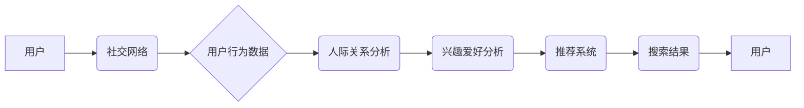

                 

## 社交化搜索：AI的人际网络分析

> 关键词：社交网络分析、人际关系、AI搜索、推荐系统、知识图谱、自然语言处理、机器学习

## 1. 背景介绍

在信息爆炸的时代，传统的搜索引擎已经难以满足人们日益增长的信息获取需求。人们不再仅仅寻求孤立的信息片段，而是希望获得更全面、更深入、更个性化的信息体验。社交化搜索应运而生，它将社交网络的丰富人际关系和用户行为数据融入搜索引擎，为用户提供更加精准、智能、人性化的搜索服务。

社交化搜索的核心思想是：

* **将用户的人际关系作为搜索的重要线索。** 

  用户的朋友、家人、同事等社交关系网络中的成员，往往拥有相似的兴趣爱好、价值观和知识背景，因此他们的搜索行为和信息偏好也可能存在一定的关联性。
* **利用社交网络数据挖掘用户兴趣和需求。** 

  通过分析用户的社交行为、点赞、评论、分享等数据，可以更好地理解用户的兴趣爱好、需求和偏好，从而提供更精准的搜索结果。
* **构建基于人际关系的知识图谱。** 

  将社交网络中的用户、实体、关系等信息整合到知识图谱中，可以建立起一个更加丰富的、更加智能的知识网络，为搜索引擎提供更深层的语义理解能力。

## 2. 核心概念与联系

社交化搜索的核心概念包括：

* **社交网络分析 (Social Network Analysis, SNA):**  研究社交网络结构、节点之间的关系和动态演变的学科。
* **人际关系 (Social Relationship):** 指个体之间相互连接、相互影响的联系。
* **用户行为分析 (User Behavior Analysis):**  分析用户在社交网络平台上的行为模式，例如浏览、点赞、评论、分享等。
* **推荐系统 (Recommendation System):**  根据用户的兴趣爱好和行为数据，推荐相关的信息或内容。
* **知识图谱 (Knowledge Graph):**  一种结构化的知识表示形式，将实体和关系以图的形式表示出来。

**Mermaid 流程图:**



## 3. 核心算法原理 & 具体操作步骤

### 3.1  算法原理概述

社交化搜索的核心算法原理主要包括：

* **节点相似度计算:**  根据用户的人际关系和行为数据，计算用户之间的相似度。常用的算法包括Jaccard系数、余弦相似度等。
* **路径分析:**  分析用户之间的社交路径，例如共同好友、朋友圈关系等，以挖掘潜在的关联性。
* **聚类分析:**  将用户按照兴趣爱好、行为模式等特征进行聚类，以便更精准地推荐相关信息。
* **机器学习:**  利用机器学习算法，例如深度学习、支持向量机等，对用户数据进行建模，预测用户的搜索意图和偏好。

### 3.2  算法步骤详解

以节点相似度计算为例，具体操作步骤如下：

1. **构建社交网络图:** 将用户作为节点，用户之间的关系作为边，构建一个社交网络图。
2. **提取用户特征:**  从用户的社交行为数据中提取特征，例如好友数量、点赞数量、评论数量、分享数量、关注话题等。
3. **计算节点相似度:**  使用Jaccard系数或余弦相似度等算法，计算用户之间的相似度。
4. **排序相似用户:**  根据用户之间的相似度，将用户进行排序，找到与目标用户最相似的用户。
5. **推荐相关信息:**  从相似用户的搜索历史、点赞、评论等数据中，推荐相关的信息或内容给目标用户。

### 3.3  算法优缺点

**优点:**

* **更精准的推荐:**  通过分析用户的人际关系和行为数据，可以更精准地推荐用户感兴趣的信息。
* **个性化的搜索体验:**  根据用户的兴趣爱好和偏好，提供个性化的搜索结果，提升用户体验。
* **挖掘潜在关联:**  通过路径分析等算法，可以挖掘用户之间潜在的关联性，发现新的信息和知识。

**缺点:**

* **数据隐私问题:**  社交化搜索需要收集和分析用户的个人数据，因此需要妥善处理数据隐私问题。
* **算法复杂度:**  社交网络分析和机器学习算法的复杂度较高，需要强大的计算能力和数据处理能力。
* **冷启动问题:**  对于新用户，由于缺乏历史数据，难以进行精准的推荐。

### 3.4  算法应用领域

社交化搜索算法广泛应用于以下领域:

* **搜索引擎:**  例如Google、百度等搜索引擎，已经开始将社交化搜索技术融入到其搜索算法中。
* **电商平台:**  例如淘宝、京东等电商平台，利用社交化搜索推荐商品，提升用户购物体验。
* **社交媒体平台:**  例如Facebook、Twitter等社交媒体平台，利用社交化搜索推荐内容，增强用户粘性。
* **新闻资讯平台:**  例如今日头条、网易新闻等新闻资讯平台，利用社交化搜索推荐新闻，满足用户个性化信息需求。

## 4. 数学模型和公式 & 详细讲解 & 举例说明

### 4.1  数学模型构建

社交网络分析中常用的数学模型包括：

* **邻接矩阵:**  用矩阵表示社交网络的结构，其中矩阵元素表示两个节点之间是否存在关系。
* **度分布:**  描述社交网络中节点的连接度，即每个节点拥有的邻居数量。
* **聚类系数:**  衡量节点在一个子图中的聚集程度，反映节点之间的紧密程度。

### 4.2  公式推导过程

**Jaccard系数:**

Jaccard系数用于衡量两个集合之间的相似度，在社交网络分析中，可以用来计算用户之间的相似度。

公式：

$$J(A, B) = \frac{|A \cap B|}{|A \cup B|}$$

其中：

* $A$ 和 $B$ 是两个集合，分别代表两个用户的社交关系网络。
* $|A \cap B|$ 是 $A$ 和 $B$ 的交集大小，即两个用户共同好友的数量。
* $|A \cup B|$ 是 $A$ 和 $B$ 的并集大小，即两个用户所有好友的数量。

**举例说明:**

假设用户A有5个好友，用户B有7个好友，他们有3个共同好友。

则Jaccard系数为：

$$J(A, B) = \frac{3}{5 + 7 - 3} = \frac{3}{9} = 0.33$$

### 4.3  案例分析与讲解

通过Jaccard系数计算，我们可以发现用户A和用户B之间的相似度为0.33，说明他们有一定的关联性。

我们可以进一步分析他们的共同好友，了解他们的兴趣爱好和行为模式，从而更精准地推荐相关信息给用户A。

## 5. 项目实践：代码实例和详细解释说明

### 5.1  开发环境搭建

* **操作系统:**  Windows/macOS/Linux
* **编程语言:**  Python
* **库依赖:**  NetworkX, Scikit-learn, Pandas

### 5.2  源代码详细实现

```python
import networkx as nx
from sklearn.metrics.pairwise import cosine_similarity

# 构建社交网络图
graph = nx.Graph()
graph.add_edges_from([(1, 2), (1, 3), (2, 3), (2, 4), (3, 5)])

# 计算节点之间的余弦相似度
user_features = {
    1: [1, 2, 3],
    2: [2, 3, 4],
    3: [3, 4, 5],
    4: [4, 5, 6],
    5: [5, 6, 7],
}
similarity_matrix = cosine_similarity(list(user_features.values()))

# 打印相似度矩阵
print(similarity_matrix)

# 寻找相似度最高的两个用户
max_similarity = 0
max_similarity_users = (0, 0)
for i in range(len(similarity_matrix)):
    for j in range(i + 1, len(similarity_matrix[i])):
        if similarity_matrix[i, j] > max_similarity:
            max_similarity = similarity_matrix[i, j]
            max_similarity_users = (i, j)

print(f"相似度最高的两个用户是: {max_similarity_users}")
```

### 5.3  代码解读与分析

* **构建社交网络图:**  使用NetworkX库构建一个社交网络图，其中节点代表用户，边代表用户之间的关系。
* **计算节点特征:**  为每个用户定义特征向量，例如好友数量、点赞数量等。
* **计算节点相似度:**  使用Scikit-learn库中的cosine_similarity函数计算用户之间的余弦相似度。
* **寻找相似度最高的两个用户:**  遍历相似度矩阵，找到相似度最高的两个用户。

### 5.4  运行结果展示

运行代码后，会输出用户之间的相似度矩阵和相似度最高的两个用户。

## 6. 实际应用场景

社交化搜索技术已广泛应用于以下场景:

* **个性化推荐:**  电商平台、社交媒体平台等利用社交化搜索推荐个性化的商品、内容和服务。
* **精准营销:**  广告平台利用社交化搜索精准定位目标用户，进行精准营销。
* **知识发现:**  科研机构利用社交化搜索挖掘学术领域的人际关系和知识关联，促进科研合作和知识传播。
* **舆情监测:**  政府机构和企业利用社交化搜索监测舆情，了解公众对特定事件或产品的看法。

### 6.4  未来应用展望

未来，社交化搜索技术将更加智能化、个性化和融合化。

* **更深入的语义理解:**  利用自然语言处理技术，更深入地理解用户的搜索意图和需求。
* **更精准的个性化推荐:**  结合用户行为数据、兴趣爱好和社会关系，提供更加精准的个性化推荐。
* **跨平台融合:**  将社交化搜索技术与其他平台和服务融合，提供更加丰富的用户体验。

## 7. 工具和资源推荐

### 7.1  学习资源推荐

* **书籍:**  《社交网络分析》
* **在线课程:**  Coursera、edX等平台提供社交网络分析相关的在线课程。
* **博客:**  网络上有很多关于社交网络分析的博客和技术文章。

### 7.2  开发工具推荐

* **NetworkX:**  Python库，用于构建和分析社交网络图。
* **Scikit-learn:**  Python库，用于机器学习算法的实现。
* **Gephi:**  开源软件，用于可视化和分析社交网络图。

### 7.3  相关论文推荐

* **"Social Network Analysis: Methods and Applications" by Wasserman and Faust**
* **"Mining the Social Web" by Matthew A. Russell**

## 8. 总结：未来发展趋势与挑战

### 8.1  研究成果总结

社交化搜索技术取得了显著的进展，为信息获取、推荐系统和知识发现等领域带来了新的机遇。

### 8.2  未来发展趋势

未来，社交化搜索技术将朝着更加智能化、个性化和融合化的方向发展。

### 8.3  面临的挑战

* **数据隐私保护:**  社交化搜索需要处理大量用户个人数据，如何保护用户隐私是一个重要的挑战。
* **算法公平性:**  社交化搜索算法可能会存在偏见，导致推荐结果不公平，需要研究如何保证算法的公平性。
* **可解释性:**  许多社交化搜索算法是黑箱模型，难以解释其决策过程，需要提高算法的可解释性。

### 8.4  研究展望

未来，需要进一步研究以下问题:

* 如何开发更加隐私保护的社交化搜索算法。
* 如何保证社交化搜索算法的公平性和可解释性。
* 如何将社交化搜索技术与其他人工智能技术融合，构建更加智能的搜索系统。

## 9. 附录：常见问题与解答

* **什么是社交化搜索?**

  社交化搜索是指将社交网络数据融入到搜索引擎中，提供更加精准、智能、人性化的搜索服务。

* **社交化搜索有哪些应用场景?**

  社交化搜索应用场景广泛，例如个性化推荐、精准营销、知识发现、舆情监测等。

* **如何构建社交化搜索系统?**

  构建社交化搜索系统需要以下步骤:

  1. 构建社交网络图。
  2. 提取用户特征。
  3. 计算节点相似度。
  4. 建立推荐模型。
  5. 开发搜索接口。

* **社交化搜索有哪些挑战?**

  社交化搜索面临的数据隐私保护、算法公平性、可解释性等挑战。


作者：禅与计算机程序设计艺术 / Zen and the Art of Computer Programming<end_of_turn>

