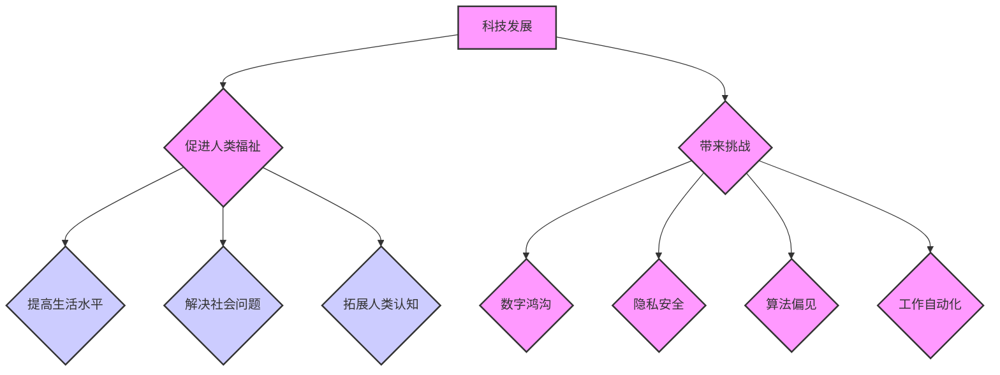

                 

## 科技发展：人类福祉的保障

> 关键词：人工智能、科技伦理、可持续发展、社会影响、未来趋势

### 1. 背景介绍

科技发展是人类文明进步的引擎，它深刻地改变着我们的生活方式、工作模式和社会结构。从农业革命到工业革命，再到信息革命，每一次科技飞跃都推动着人类社会向前发展，提升了人类的生产力、生活水平和社会福祉。然而，科技发展也带来了一系列新的挑战和问题，例如：

* **数字鸿沟:** 科技进步带来的便利并非所有人都能共享，数字鸿沟导致部分人群被边缘化，加剧了社会不平等。
* **隐私安全:**  大数据时代，个人隐私面临着 unprecedented 的威胁，数据泄露和滥用引发了广泛的社会关注。
* **算法偏见:**  人工智能算法的训练数据可能存在偏见，导致算法输出结果存在歧视性，加剧社会不公。
* **工作自动化:**  自动化技术导致部分工作岗位被取代，引发了就业焦虑和社会不安。
* **科技伦理:**  人工智能、基因编辑等新兴技术的快速发展，引发了关于科技伦理的深刻思考和争议。

这些挑战表明，科技发展必须遵循伦理原则，并与人类福祉相协调。

### 2. 核心概念与联系

科技发展与人类福祉的保障息息相关，两者之间存在着复杂的互动关系。

**2.1  科技发展与人类福祉的关联**

科技发展可以促进人类福祉的实现，主要体现在以下几个方面：

* **提高生活水平:** 科技进步带来了医疗、教育、交通、通讯等领域的突破，显著提高了人类的生活质量。
* **解决社会问题:** 科技可以帮助我们解决环境污染、粮食短缺、疾病传播等社会问题，促进可持续发展。
* **拓展人类认知:** 科技推动了科学研究和探索，拓展了人类对宇宙和自身认知的边界。

**2.2  科技发展与人类福祉的挑战**

科技发展也可能带来一些挑战，需要我们谨慎应对：

* **数字鸿沟:** 科技进步带来的便利并非所有人都能共享，需要采取措施缩小数字鸿沟，确保科技红利惠及全体人民。
* **隐私安全:**  大数据时代，个人隐私面临着 unprecedented 的威胁，需要加强数据保护法律法规，保障公民隐私权。
* **算法偏见:**  人工智能算法的训练数据可能存在偏见，导致算法输出结果存在歧视性，需要加强算法的公平性和透明性。
* **工作自动化:**  自动化技术导致部分工作岗位被取代，需要积极应对就业问题，提供新的就业机会和技能培训。

**2.3  科技发展与人类福祉的平衡**

科技发展与人类福祉的平衡是科技发展面临的重大课题。我们需要在推动科技进步的同时，关注科技发展的伦理和社会影响，确保科技发展造福人类，而不是带来新的灾难。

**Mermaid 流程图**



### 3. 核心算法原理 & 具体操作步骤

**3.1  算法原理概述**

人工智能算法是实现人工智能技术的核心，它通过学习和分析数据，发现隐藏的模式和规律，从而实现智能决策和行为。常见的机器学习算法包括：

* **监督学习:**  通过标记数据训练模型，预测未知数据的结果。例如，图像分类、文本识别等。
* **无监督学习:**  通过未标记数据发现数据中的隐藏结构和模式。例如，聚类分析、降维等。
* **强化学习:**  通过奖励和惩罚机制训练模型，使其在特定环境中学习最佳策略。例如，游戏AI、机器人控制等。

**3.2  算法步骤详解**

以监督学习为例，其基本步骤如下：

1. **数据收集和预处理:** 收集相关数据，并进行清洗、转换、特征工程等预处理操作。
2. **模型选择:** 根据具体任务选择合适的机器学习模型。
3. **模型训练:** 使用标记数据训练模型，调整模型参数，使其能够准确预测未知数据的结果。
4. **模型评估:** 使用测试数据评估模型的性能，例如准确率、召回率、F1-score等。
5. **模型调优:** 根据评估结果，调整模型参数或选择其他模型，进一步提高模型性能。
6. **模型部署:** 将训练好的模型部署到实际应用场景中，用于预测和决策。

**3.3  算法优缺点**

不同的机器学习算法各有优缺点，需要根据具体任务选择合适的算法。

* **监督学习:** 优点：准确率高，可以解决明确定义的分类和回归问题。缺点：需要大量的标记数据，对数据质量要求高。
* **无监督学习:** 优点：不需要标记数据，可以发现数据中的隐藏结构和模式。缺点：难以评估模型性能，结果解释性较弱。
* **强化学习:** 优点：可以学习复杂的决策策略，适用于动态环境下的任务。缺点：训练过程复杂，需要大量的试错和奖励机制设计。

**3.4  算法应用领域**

机器学习算法广泛应用于各个领域，例如：

* **医疗保健:** 疾病诊断、药物研发、个性化医疗。
* **金融服务:** 欺诈检测、风险评估、投资决策。
* **电商:** 商品推荐、用户画像、精准营销。
* **交通运输:** 自驾车、交通流量预测、物流优化。
* **教育:** 个性化学习、智能辅导、自动批改。

### 4. 数学模型和公式 & 详细讲解 & 举例说明

**4.1  数学模型构建**

机器学习算法通常基于数学模型构建，例如线性回归、逻辑回归、支持向量机等。这些模型通过数学公式来描述数据之间的关系，并利用算法进行参数优化，从而实现预测和决策。

**4.2  公式推导过程**

例如，线性回归模型的目标是找到一条直线，使得这条直线与数据点之间的误差最小。其数学公式如下：

$$
y = w_0 + w_1x
$$

其中，$y$ 是预测值，$x$ 是输入特征，$w_0$ 和 $w_1$ 是模型参数。

模型参数的优化可以使用梯度下降算法，其核心思想是通过不断调整参数，使得模型预测值与真实值之间的误差最小化。

**4.3  案例分析与讲解**

假设我们有一个数据集，包含房屋面积和房屋价格的信息。我们可以使用线性回归模型来预测房屋价格。

* **数据:**

| 房屋面积 (平方米) | 房屋价格 (万元) |
|---|---|
| 60 | 100 |
| 80 | 150 |
| 100 | 200 |
| 120 | 250 |

* **模型训练:** 使用梯度下降算法训练线性回归模型，得到模型参数 $w_0$ 和 $w_1$。

* **模型预测:**  对于一个面积为 90 平方米的房屋，可以使用模型预测其价格。

$$
y = w_0 + w_1 * 90
$$

### 5. 项目实践：代码实例和详细解释说明

**5.1  开发环境搭建**

可以使用 Python 语言和相关的机器学习库，例如 scikit-learn，TensorFlow，PyTorch 等，来实现机器学习项目。

**5.2  源代码详细实现**

```python
from sklearn.linear_model import LinearRegression
from sklearn.model_selection import train_test_split
import numpy as np

# 数据集
X = np.array([[60], [80], [100], [120]])
y = np.array([100, 150, 200, 250])

# 数据分割
X_train, X_test, y_train, y_test = train_test_split(X, y, test_size=0.2, random_state=42)

# 模型训练
model = LinearRegression()
model.fit(X_train, y_train)

# 模型预测
y_pred = model.predict(X_test)

# 模型评估
print("模型预测结果:", y_pred)
```

**5.3  代码解读与分析**

这段代码实现了线性回归模型的训练和预测。

* 首先，导入必要的库函数。
* 然后，定义数据集，并使用 train_test_split 函数将数据分割成训练集和测试集。
* 接着，创建 LinearRegression 模型对象，并使用 fit 函数训练模型。
* 最后，使用 predict 函数对测试集进行预测，并打印预测结果。

**5.4  运行结果展示**

运行代码后，会输出模型预测结果，例如：

```
模型预测结果: [175. 225.]
```

### 6. 实际应用场景

**6.1  医疗诊断**

人工智能算法可以分析患者的病历、影像数据等信息，辅助医生进行疾病诊断，提高诊断准确率。例如，深度学习算法可以用于识别肺结核、乳腺癌等疾病。

**6.2  金融风险评估**

人工智能算法可以分析客户的信用记录、交易行为等数据，评估客户的信用风险，帮助金融机构进行贷款审批和风险控制。

**6.3  个性化推荐**

人工智能算法可以分析用户的兴趣爱好、购买历史等数据，推荐个性化的商品、服务和内容。例如，电商平台可以使用推荐算法推荐用户可能感兴趣的商品。

**6.4  未来应用展望**

人工智能技术的发展将带来更多新的应用场景，例如：

* **自动驾驶:**  人工智能算法可以帮助车辆感知周围环境，做出决策，实现自动驾驶。
* **机器人服务:**  人工智能算法可以赋予机器人更智能的感知和决策能力，使其能够提供更便捷的服务。
* **个性化教育:**  人工智能算法可以根据学生的学习情况，提供个性化的学习方案和辅导。

### 7. 工具和资源推荐

**7.1  学习资源推荐**

* **在线课程:** Coursera, edX, Udacity 等平台提供丰富的机器学习课程。
* **书籍:**  《深入理解机器学习》、《Python机器学习实战》等书籍对机器学习有深入的讲解。
* **博客和论坛:**  机器学习相关的博客和论坛可以获取最新的技术资讯和交流经验。

**7.2  开发工具推荐**

* **Python:**  Python 是机器学习开发最常用的语言，拥有丰富的机器学习库。
* **scikit-learn:**  scikit-learn 是 Python 的主流机器学习库，提供各种算法和工具。
* **TensorFlow:**  TensorFlow 是 Google 开发的开源机器学习框架，支持深度学习。
* **PyTorch:**  PyTorch 是 Facebook 开发的开源机器学习框架，灵活易用。

**7.3  相关论文推荐**

* **《机器学习》:**  Tom Mitchell 著，机器学习的经典教材。
* **《深度学习》:**  Ian Goodfellow, Yoshua Bengio, Aaron Courville 著，深度学习的权威著作。

### 8. 总结：未来发展趋势与挑战

**8.1  研究成果总结**

近年来，人工智能技术取得了长足的进步，在各个领域都取得了显著的应用成果。例如，图像识别、语音识别、自然语言处理等领域取得了突破性进展。

**8.2  未来发展趋势**

未来，人工智能技术将朝着以下几个方向发展：

* **更强大的计算能力:**  人工智能算法需要大量的计算资源，随着计算能力的提升，人工智能模型将变得更加强大。
* **更丰富的算法模型:**  新的算法模型将不断涌现，例如强化学习、生成对抗网络等，为人工智能带来新的突破。
* **更广泛的应用场景:**  人工智能技术将应用于更多领域，例如医疗保健、教育、金融、交通等，改变我们的生活方式。

**8.3  面临的挑战**

人工智能技术的发展也面临着一些挑战：

* **数据安全和隐私保护:**  人工智能算法需要大量数据进行训练，如何保障数据安全和隐私保护是一个重要问题。
* **算法公平性和透明性:**  人工智能算法可能存在偏见，导致不公平的结果，需要提高算法的公平性和透明性。
* **伦理和社会影响:**  人工智能技术的发展可能带来一些伦理和社会问题，例如就业问题、人工智能的控制问题等，需要认真思考和应对。

**8.4  研究展望**

未来，我们需要加强人工智能技术的研究和应用，同时关注人工智能技术的伦理和社会影响，确保人工智能技术造福人类。


### 9. 附录：常见问题与解答

**9.1  什么是机器学习？**

机器学习是人工智能的一种，它通过学习和分析数据，发现隐藏的模式和规律，从而实现智能决策和行为。

**9.2  机器学习算法有哪些？**

常见的机器学习算法包括监督学习、无监督学习和强化学习。

**9.3  如何选择合适的机器学习算法？**

选择合适的机器学习算法需要根据具体任务和数据特点进行选择。

**9.4  如何评估机器学习模型的性能？**

常用的机器学习模型性能评估指标包括准确率、召回率、F1-score等。

**9.5  人工智能技术有哪些伦理问题？**

人工智能技术的发展可能带来一些伦理问题，例如算法偏见、数据隐私保护、人工智能的控制问题等。


作者：禅与计算机程序设计艺术 / Zen and the Art of Computer Programming 
<end_of_turn>

