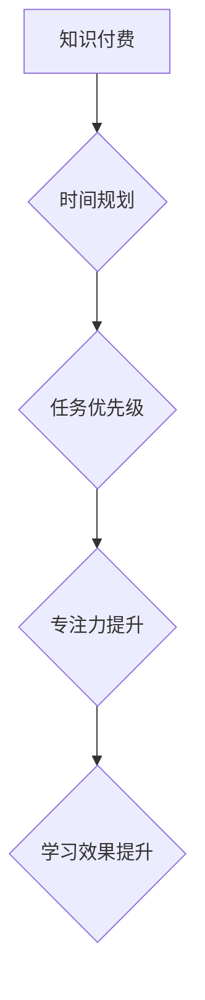

                 

## 程序员如何进行知识付费的时间管理

> 关键词：知识付费、时间管理、程序员、学习效率、持续学习

### 1. 背景介绍

在当今科技日新月异的时代，程序员的职业发展离不开持续学习。新的技术、框架和工具层出不穷，想要保持竞争力，必须不断提升自身技能。知识付费作为一种便捷高效的学习方式，越来越受到程序员的青睐。然而，时间是宝贵的资源，如何合理安排时间进行知识付费，提升学习效率，成为了程序员面临的共同挑战。

### 2. 核心概念与联系

**2.1 知识付费**

知识付费是指通过付费的方式获取知识、技能和经验。它涵盖了各种形式，例如在线课程、书籍、视频教程、付费社区等。

**2.2 时间管理**

时间管理是指合理规划和利用时间，提高工作效率和生活质量。它涉及到时间规划、任务优先级排序、专注力提升等多个方面。

**2.3 核心概念联系**

知识付费和时间管理是相互关联的。有效的知识付费需要合理的 时间管理，才能保证学习效果。反之，良好的时间管理可以帮助程序员更好地安排学习时间，提高知识付费的效率。

**Mermaid 流程图**

### 3. 核心算法原理 & 具体操作步骤

**3.1 算法原理概述**

时间管理的核心在于高效地利用时间，最大化学习成果。这需要程序员根据自身情况制定合理的学习计划，并严格执行。

**3.2 算法步骤详解**

1. **目标设定:** 明确学习目标，例如掌握某个新的技术框架，提升某个编程语言的技能等。
2. **时间规划:** 根据自身时间安排，制定详细的学习计划，包括每天学习时间、学习内容、学习方式等。
3. **任务分解:** 将学习目标分解成多个小任务，并设定完成时间，避免学习任务过于庞大，造成学习压力。
4. **专注力提升:** 营造良好的学习环境，减少干扰，提高专注力，保证学习效率。
5. **学习方法选择:** 根据自身学习风格和知识付费内容选择合适的学习方法，例如视频教程、在线课程、书籍阅读等。
6. **复习巩固:** 定期复习已学知识，巩固学习成果，避免知识遗忘。
7. **评估调整:** 定期评估学习进度和效果，根据实际情况调整学习计划，不断优化学习方法。

**3.3 算法优缺点**

* **优点:** 
    * 提高学习效率，有效利用时间。
    * 帮助程序员明确学习目标，制定计划，提高学习动力。
    * 促进程序员的持续学习，保持竞争力。
* **缺点:** 
    * 需要程序员付出一定的学习成本，例如时间、精力、金钱等。
    * 需要程序员具备一定的自律性和时间管理能力。

**3.4 算法应用领域**

时间管理算法广泛应用于程序员的学习和工作中，例如：

* **学习计划制定:** 程序员可以根据自身情况制定学习计划，安排学习时间和内容。
* **任务优先级排序:** 程序员可以根据任务重要性和紧急程度，优先完成重要任务。
* **专注力提升:** 程序员可以通过番茄工作法等方法，提高专注力，提高学习效率。

### 4. 数学模型和公式 & 详细讲解 & 举例说明

**4.1 数学模型构建**

时间管理可以抽象为一个资源分配模型，其中时间是有限资源，学习任务是需要分配资源的任务。

**4.2 公式推导过程**

假设程序员每天有 $T$ 个小时的时间，需要完成 $N$ 个学习任务，每个任务需要 $t_i$ 个小时。

则时间分配模型可以表示为：

$$
\sum_{i=1}^{N} t_i \leq T
$$

**4.3 案例分析与讲解**

假设程序员每天有 8 个小时的时间，需要学习 3 个任务，分别是学习 Python 需要 3 小时，学习数据结构需要 2 小时，学习算法需要 3 小时。

根据公式推导过程，我们可以得到：

$$
3 + 2 + 3 \leq 8
$$

所以，程序员可以合理安排时间完成这 3 个学习任务。

### 5. 项目实践：代码实例和详细解释说明

**5.1 开发环境搭建**

程序员可以根据自身需求选择合适的开发环境，例如使用 VS Code、Atom 等代码编辑器，并安装相关的插件和工具。

**5.2 源代码详细实现**

由于时间管理算法本身不是一个具体的代码实现，所以这里无法提供具体的代码实例。

**5.3 代码解读与分析**

时间管理算法更多的是一种思维方式和方法论，需要程序员根据自身情况进行实践和调整。

**5.4 运行结果展示**

时间管理算法的运行结果是程序员能够有效地利用时间，提高学习效率，并最终达到学习目标。

### 6. 实际应用场景

**6.1 学习计划制定**

程序员可以使用时间管理算法制定学习计划，例如使用番茄工作法，将学习时间划分为 25 分钟的学习段和 5 分钟的休息段，提高学习效率。

**6.2 任务优先级排序**

程序员可以根据任务重要性和紧急程度，使用 Eisenhower 矩阵等方法，优先完成重要任务，避免时间浪费。

**6.3 专注力提升**

程序员可以通过使用专注力提升工具，例如 Freedom、Forest 等，屏蔽干扰，提高专注力，保证学习效率。

**6.4 未来应用展望**

随着人工智能技术的不断发展，时间管理算法将会更加智能化和个性化，能够更好地帮助程序员进行时间管理，提高学习效率。

### 7. 工具和资源推荐

**7.1 学习资源推荐**

* **在线课程平台:** Coursera、Udemy、edX 等
* **书籍:** 《Getting Things Done》、《Deep Work》等
* **博客和网站:** Zen Habits、Lifehacker 等

**7.2 开发工具推荐**

* **代码编辑器:** VS Code、Atom、Sublime Text 等
* **时间管理工具:** Todoist、Trello、Asana 等
* **专注力提升工具:** Freedom、Forest、Noisli 等

**7.3 相关论文推荐**

* **时间管理算法研究:** 
    * "A Survey of Time Management Techniques"
    * "Time Management Strategies for Software Developers"

### 8. 总结：未来发展趋势与挑战

**8.1 研究成果总结**

时间管理算法的研究成果表明，有效的学习计划、任务优先级排序和专注力提升可以显著提高程序员的学习效率。

**8.2 未来发展趋势**

未来时间管理算法将会更加智能化和个性化，能够根据程序员的学习风格、目标和时间安排，提供更加精准的学习建议。

**8.3 面临的挑战**

* **个性化定制:** 如何根据每个程序员的独特需求，定制个性化的学习计划和时间管理方案。
* **算法准确性:** 如何提高时间管理算法的准确性，避免过度安排或安排不足。
* **用户体验:** 如何设计更加人性化、易于使用的用户界面，提高用户体验。

**8.4 研究展望**

未来研究将重点关注时间管理算法的个性化定制、算法准确性提升和用户体验优化，以更好地帮助程序员进行时间管理，提高学习效率。

### 9. 附录：常见问题与解答

**9.1 如何制定合理的学习计划？**

* 明确学习目标，例如掌握某个新的技术框架，提升某个编程语言的技能等。
* 根据自身时间安排，制定详细的学习计划，包括每天学习时间、学习内容、学习方式等。
* 将学习目标分解成多个小任务，并设定完成时间，避免学习任务过于庞大，造成学习压力。

**9.2 如何提高专注力？**

* 营造良好的学习环境，减少干扰，例如关闭手机、社交软件等。
* 使用番茄工作法等方法，将学习时间划分为 25 分钟的学习段和 5 分钟的休息段，提高学习效率。
* 使用专注力提升工具，例如 Freedom、Forest 等，屏蔽干扰，提高专注力。

作者：禅与计算机程序设计艺术 / Zen and the Art of Computer Programming 
<end_of_turn>

